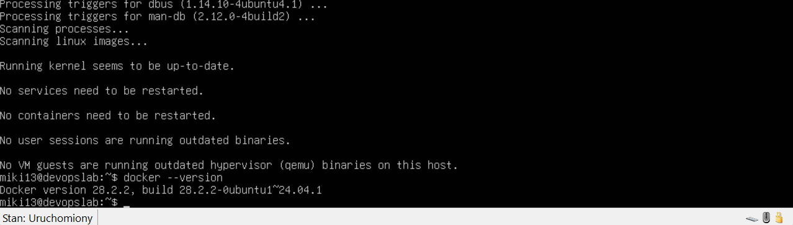
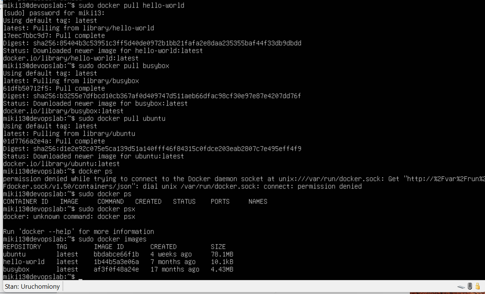
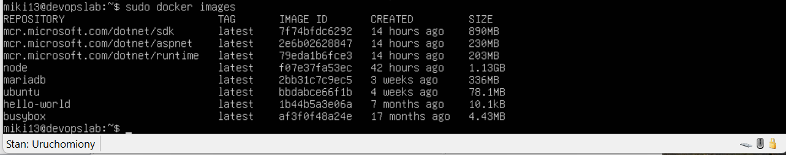
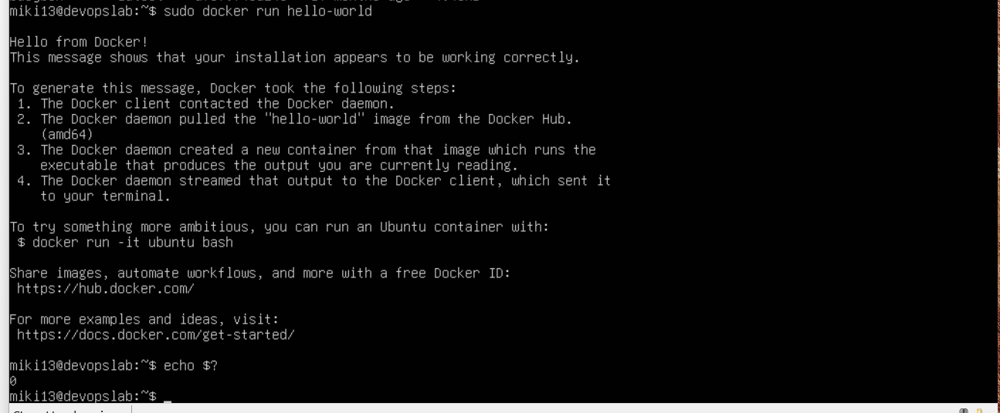
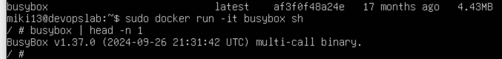
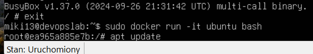
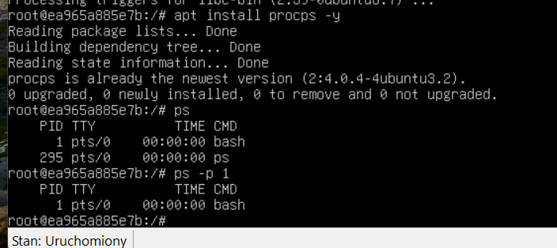

# Sprawozdanie - MB423178

## 1. Mój Git Hook
Oto skrypt, który napisałem, aby wymusić poprawne nazewnictwo commitów:

```bash
#!/bin/bash
PREFIX="MB423178"
commit_msg=$(head -n1 "$1")
if [[ ! $commit_msg == $PREFIX* ]]; then
    echo "BŁĄD: Twój commit message musi zaczynać się od: $PREFIX"
    exit 1
fi
```


# LAB 2 Docker


## Zadanie 2 i 3: Docker - Instalacja, obrazy i kody wyjścia

Zgodnie z instrukcją zainstalowałem Dockera, pobrałem wymagane obrazy (w tym te z repozytorium Microsoftu) oraz sprawdziłem ich rozmiary i kod wyjścia (dla hello-world). Poniżej pełna dokumentacja z tych kroków:









## Pozostałe zrzuty ekranu z wykonanych zadań (Zadania 4-9)

 dokumentacjaa z dalszej pracy z Dockerem (interaktywna praca z kontenerami, budowanie własnego obrazu z pliku Dockerfile oraz czyszczenie środowiska):





.png>)
.png>)
.png>)
.png>)
.png>)
.png>)
.png>)
.png>)
.png>)
