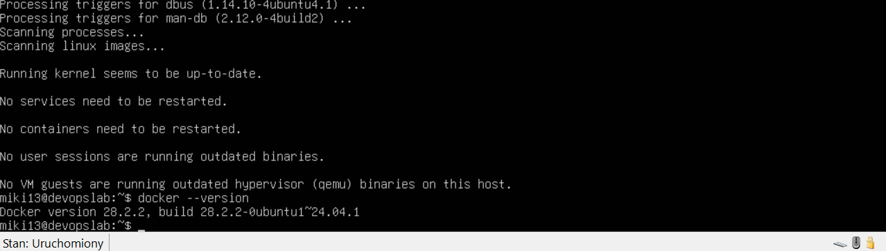
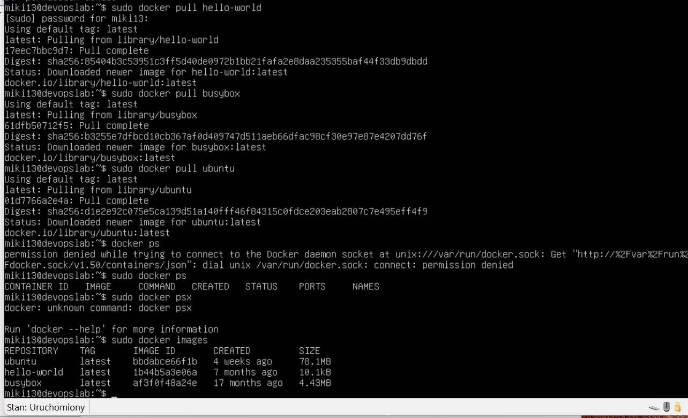
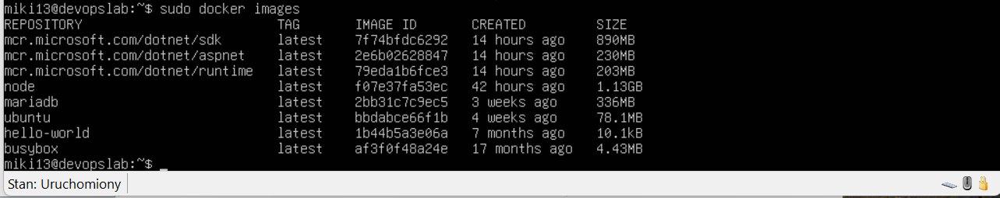
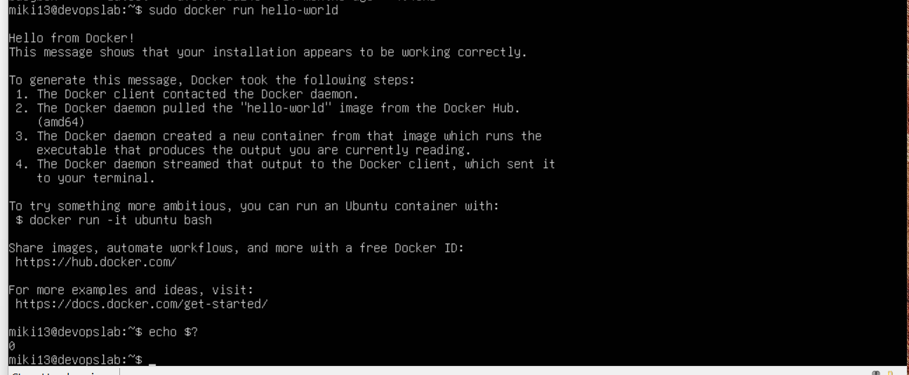

# Sprawozdanie - MB423178

## 1. Mój Git Hook
Oto skrypt, który napisałem, aby wymusić poprawne nazewnictwo commitów:

```bash
#!/bin/bash
PREFIX="MB423178"
commit_msg=$(head -n1 "$1")
if [[ ! $commit_msg == $PREFIX* ]]; then
    echo "BŁĄD: Twój commit message musi zaczynać się od: $PREFIX"
    exit 1
fi
```


# LAB 2 Docker


## Zadanie 2 i 3: Docker - Instalacja, obrazy i kody wyjścia

Zgodnie z instrukcją zainstalowałem Dockera, pobrałem wymagane obrazy (w tym te z repozytorium Microsoftu) oraz sprawdziłem ich rozmiary i kod wyjścia (dla hello-world). Poniżej pełna dokumentacja z tych kroków:









# Lab 03: Dockerfiles 

## 1. Wybór oprogramowania i budowa lokalna
Wybrałem aplikację **Spring PetClinic**. Jest to otwartoźródłowy projekt (licencja Apache 2.0) służący do demonstracji możliwości frameworka Spring Boot. Wykorzystuje on narzędzie **Maven** do zarządzania cyklem życia aplikacji.

### Proces przygotowania środowiska i budowy na hoście:
* **Instalacja JDK 17 oraz Git:**
    
* **Klonowanie repozytorium:**
    
* **Budowanie aplikacji (mvnw package):**
    
* **Uruchomienie testów lokalnie:**
    

## 2. Izolacja: build w kontenerze interaktywnie
Kolejnym etapem było powtórzenie procesu wewnątrz odizolowanego kontenera, aby zapewnić powtarzalność środowiska.

* **Pobieranie obrazu bazowego Javy:**
    
* **Klonowanie repozytorium wewnątrz kontenera:**
    
* **Instalacja narzędzi pomocniczych (Git):**
    
* **Finalny Build i testy w kontenerze:**
    

## 3. Automatyzacja: Dockerfiles i Docker Compose
Aby zautomatyzować powyższe kroki, stworzyłem dwa pliki Dockerfile:
1.  **Dockerfile.petClinic.build** – odpowiedzialny za kompilację kodu.
    
2.  **Dockerfile.petClinic.test** – bazujący na pierwszym, dedykowany do uruchamiania testów.
    

### Wykazanie pracy kontenera i różnica obraz vs kontener
Uruchomiłem kontener testowy ręcznie:


**Różnica:** Obraz to statyczna definicja środowiska i aplikacji, natomiast kontener to działająca instancja. W moim przypadku w kontenerze pracuje proces **Java (JVM)**, który wykonuje testy jednostkowe przy pomocy biblioteki JUnit.

### Ujęcie w kompozycję (Docker Compose)
Finalnie proces został ujęty w `docker-compose.yml`, co pozwala na uruchomienie całego etapu CI jedną komendą:


## 4. Dyskusja: Przygotowanie do wdrożenia (Deploy)
* **Czy program nadaje się do wdrażania jako kontener?** Tak, aplikacje Spring Boot są natywnie przystosowane do pracy w kontenerach (microservices).
* **Artefakt końcowy:** Aplikacja powinna być dystrybuowana jako plik **JAR**.
* **Oczyszczanie:** Obraz budujący zawiera kod źródłowy i narzędzia deweloperskie, co zwiększa jego rozmiar i zmniejsza bezpieczeństwo. Do celów produkcyjnych należy zastosować technikę **Multi-stage build**, kopiując wyłącznie skompilowany plik `.jar` do lekkiego obrazu JRE (np. Alpine).