# Sprawozdanie - MB423178

## Środowisko uruchomieniowe
Wszystkie opisane poniżej kroki zostały wykonane w wyizolowanym środowisku.
* **System operacyjny:** Maszyna wirtualna z systemem Linux.
* **Metoda dostępu:** Połączenie zdalne za pośrednictwem protokołu SSH (Secure Shell). Praca odbywała się na koncie standardowego użytkownika (bez logowania na konto `root` oraz bez użycia konsoli KVM).
* **Narzędzia pracy:** Edytor Visual Studio Code z wtyczką *Remote - SSH*, zapewniający dostęp do terminala oraz zarządzanie plikami.

## Lab 1 Wprowadzenie, Git, Gałęzie, SSH

### 1. Git
Zgodnie z poleceniem, upewniono się, że w systemie Linux zainstalowany jest klient Git. Następnie wykonano pierwsze, testowe klonowanie repozytorium przedmiotowego z użyciem protokołu HTTPS. Do uwierzytelnienia wykorzystano wygenerowany w panelu GitHub *Personal Access Token* (PAT).


### 2. SSH
Aby docelowo zabezpieczyć i ułatwić komunikację z serwerem, porzucono autoryzację HTTPS na rzecz kluczy SSH.
* **Tworzenie kluczy:** Wygenerowano dwa klucze oparte o nowoczesne algorytmy (zrezygnowano z przestarzałego RSA):
  1. Główny klucz `ED25519` zabezpieczony silnym hasłem (`ssh-keygen -t ed25519 -C "bednarczyk1mikolaj@gmail.com"`).
  2. Zapasowy klucz `ECDSA` 521-bit (`ssh-keygen -t ecdsa -b 521`).
  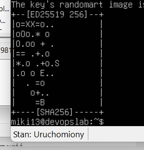
  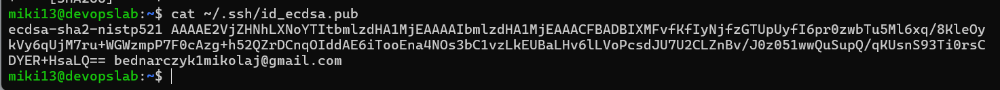
* **Konfiguracja GitHub:** Klucze publiczne dodano do ustawień konta GitHub, a konto dodatkowo zabezpieczono uwierzytelnianiem dwuskładnikowym (2FA).
  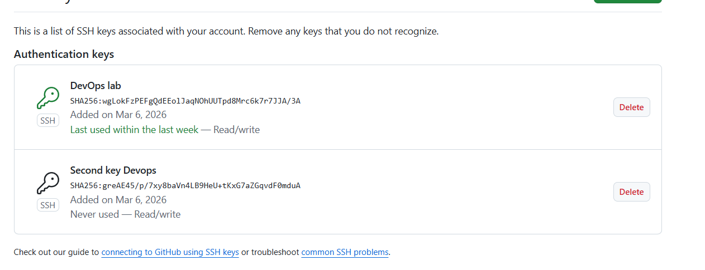
* **Klonowanie repozytorium po SSH:** Z powodzeniem nawiązano połączenie (`ssh -T git@github.com`) i sklonowano repozytorium wykorzystując protokół SSH.
  

### 3. Narzędzia
Jako docelowe środowisko IDE skonfigurowano **Visual Studio Code**. Użyto rozszerzenia *Remote - SSH*, co wyeliminowało potrzebę instalowania zewnętrznych menedżerów plików (np. FileZilla). Wbudowany eksplorator zapewnił natychmiastową wymianę plików i wygodny podgląd dokumentacji Markdown.
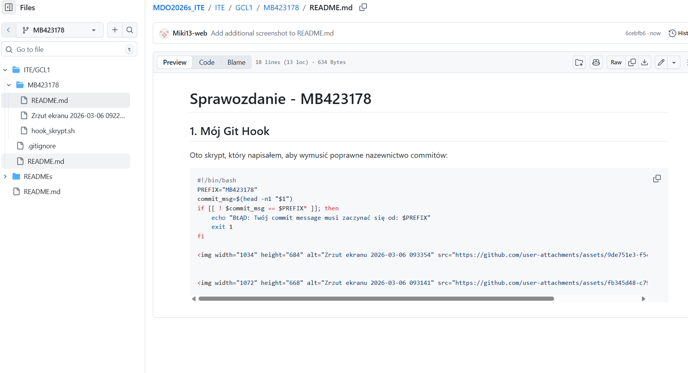
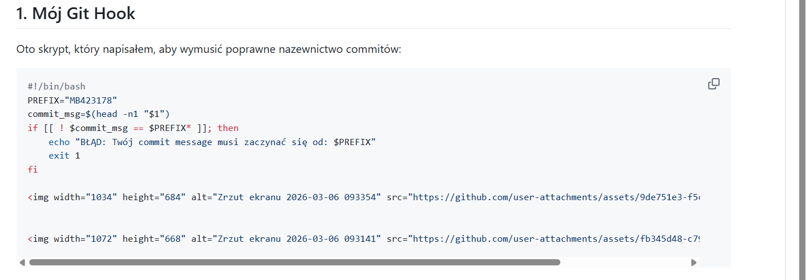

### 4. Gałąź i struktura katalogów
Zarządzanie repozytorium rozpoczęto od przełączenia się na gałąź `main`, a następnie na gałąź grupy `GCL1`.
* Utworzono własną gałąź roboczą o nazwie `MB423178` (inicjały i numer indeksu).
* Wewnątrz katalogu grupowego utworzono dedykowany folder roboczy `MB423178`.
  

**Napisanie i wdrożenie Git Hooka**
Aby wymusić poprawne konwencje nazewnicze, przygotowano skrypt `commit-msg` weryfikujący, czy wiadomość commita zaczyna się od zadanego prefiksu. Skrypt dodano do folderu roboczego, a następnie skopiowano do ukrytego katalogu `.git/hooks` nadając mu prawa do wykonania (`chmod +x`).

## Mój Git Hook
Oto skrypt, który napisałem, aby wymusić poprawne nazewnictwo commitów:

```bash
#!/bin/bash
PREFIX="MB423178"
commit_msg=$(head -n1 "$1")
if [[ ! $commit_msg == $PREFIX* ]]; then
    echo "BŁĄD: Twój commit message musi zaczynać się od: $PREFIX"
    exit 1
fi
```
### 5. Praca z serwerem i rozwiązywanie konfliktów
Zgodnie z instrukcją dodano pliki sprawozdania wraz ze zrzutami ekranu i spróbowano wciągnąć zmiany do gałęzi grupowej. W tym procesie napotkano na problem, który przetestował działanie stworzonego Git Hooka.

Problem z git push i odrzucenie zmian: Zdalne repozytorium odrzuciło wysyłanie zmian z powodu rozbieżności historii (ktoś inny dodał w międzyczasie commity na serwerze).

Aktywacja Git Hooka podczas git pull: Przy próbie integracji serwerowych zmian, system Git usiłował stworzyć automatyczny "Merge commit". Zostało to jednak zablokowane przez mój własny skrypt powłoki, ponieważ domyślna wiadomość scalająca nie posiadała wymaganego prefiksu MB423178.

Rozwiązanie: Należało ręcznie sfinalizować proces scalania, wywołując polecenie git commit z podaniem precyzyjnego tytułu spełniającego warunki Hooka (np. MB423178: Złączenie plików z serwerem). Operacja ta zakończyła się sukcesem i pozwoliła na poprawne zaktualizowanie serwera (git push).


# LAB 2 Docker


## Zadanie 2 i 3: Docker - Instalacja, obrazy i kody wyjścia

Zgodnie z instrukcją zainstalowałem Dockera, pobrałem wymagane obrazy (w tym te z repozytorium Microsoftu) oraz sprawdziłem ich rozmiary i kod wyjścia (dla hello-world). Poniżej pełna dokumentacja z tych kroków:


## Pozostałe zrzuty ekranu z wykonanych zadań (Zadania 4-9)

 dokumentacjaa z dalszej pracy z Dockerem (interaktywna praca z kontenerami, budowanie własnego obrazu z pliku Dockerfile oraz czyszczenie środowiska):


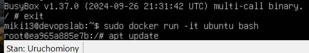
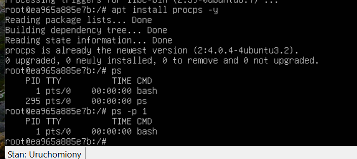
.png>)
.png>)
.png>)
.png>)
.png>)
.png>)
.png>)
.png>)
.png>)

# Lab 03: Dockerfiles 

## 1. Wybór oprogramowania i budowa lokalna
Wybrałem aplikację **Spring PetClinic**. Jest to otwartoźródłowy projekt (licencja Apache 2.0) służący do demonstracji możliwości frameworka Spring Boot. Wykorzystuje on narzędzie **Maven** do zarządzania cyklem życia aplikacji.

### Proces przygotowania środowiska i budowy na hoście:
* **Instalacja JDK 17 oraz Git:**
    
* **Klonowanie repozytorium:**
    
* **Budowanie aplikacji (mvnw package):**
    
* **Uruchomienie testów lokalnie:**
    

## 2. Izolacja: build w kontenerze interaktywnie
Kolejnym etapem było powtórzenie procesu wewnątrz odizolowanego kontenera, aby zapewnić powtarzalność środowiska.

* **Pobieranie obrazu bazowego Javy:**
    
* **Klonowanie repozytorium wewnątrz kontenera:**
    
* **Instalacja narzędzi pomocniczych (Git):**
    
* **Finalny Build i testy w kontenerze:**
    

## 3. Automatyzacja: Dockerfiles i Docker Compose
Aby zautomatyzować powyższe kroki, stworzyłem dwa pliki Dockerfile:
1.  **Dockerfile.petClinic.build** – odpowiedzialny za kompilację kodu.
    
2.  **Dockerfile.petClinic.test** – bazujący na pierwszym, dedykowany do uruchamiania testów.
    

### Wykazanie pracy kontenera i różnica obraz vs kontener
Uruchomiłem kontener testowy ręcznie:


**Różnica:** Obraz to statyczna definicja środowiska i aplikacji, natomiast kontener to działająca instancja. W moim przypadku w kontenerze pracuje proces **Java (JVM)**, który wykonuje testy jednostkowe przy pomocy biblioteki JUnit.

### Ujęcie w kompozycję (Docker Compose)
Finalnie proces został ujęty w `docker-compose.yml`, co pozwala na uruchomienie całego etapu CI jedną komendą:


## 4. Dyskusja: Przygotowanie do wdrożenia (Deploy)
* **Czy program nadaje się do wdrażania jako kontener?** Tak, aplikacje Spring Boot są natywnie przystosowane do pracy w kontenerach (microservices).
* **Artefakt końcowy:** Aplikacja powinna być dystrybuowana jako plik **JAR**.
* **Oczyszczanie:** Obraz budujący zawiera kod źródłowy i narzędzia deweloperskie, co zwiększa jego rozmiar i zmniejsza bezpieczeństwo. Do celów produkcyjnych należy zastosować technikę **Multi-stage build**, kopiując wyłącznie skompilowany plik `.jar` do lekkiego obrazu JRE (np. Alpine).

# Zajęcia 04: Woluminy, Sieci, Usługi i Jenkins

## Część 1: Zachowywanie stanu między kontenerami (Woluminy)
Celem zadania było odseparowanie kodu źródłowego i zbudowanych artefaktów od ulotnych kontenerów za pomocą woluminów Dockera.

1.  **Tworzenie woluminów:** Utworzono woluminy `wejscie` i `wyjscie`.
    
2.  **Klonowanie bez użycia Gita w kontenerze budującym:** Ponieważ obraz bazowy nie posiadał Gita, użyto tymczasowego kontenera pomocniczego (`alpine/git`), który sklonował repozytorium bezpośrednio na wolumin wejściowy i natychmiast uległ zniszczeniu (`--rm`). To najbezpieczniejsze podejście utrzymujące czystość obrazu budującego.
    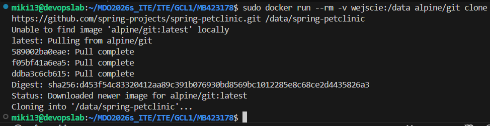
3.  **Budowa aplikacji:** Uruchomiono główny kontener budujący podpinając oba woluminy.
    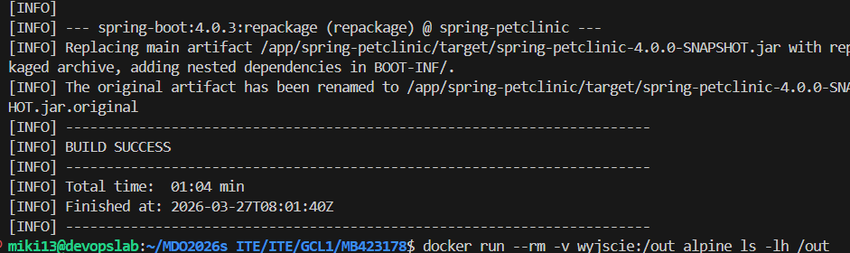
4.  **Weryfikacja trwałości:** Gotowy plik `.jar` przetrwał na woluminie wyjściowym po zamknięciu kontenera.
    
5.  **Ponowienie operacji wewnątrz kontenera:** Drugą metodą było wejście do kontenera w trybie interaktywnym, ręczna instalacja Gita i sklonowanie repozytorium.
    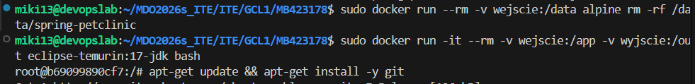
    
6.  **Zapisanie drugiego artefaktu:** Nowy plik skopiowano jako `build_ponowiony.jar`.
    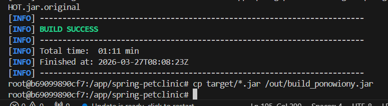
    

## Część 2: Eksponowanie portów i łączność między kontenerami (Sieci Docker)
Celem tej części zadania było zbadanie przepustowości sieciowej oraz udowodnienie, że własne sieci w Dockerze posiadają wbudowany mechanizm rozwiązywania nazw (DNS).

1. **Test w domyślnej sieci (po adresie IP):** Uruchomiono serwer narzędzia `iperf3` w tle, a następnie połączono się z nim z drugiego kontenera (klienta), identyfikując go za pomocą sztywnego adresu IP (`172.17.0.2`). Domyślna sieć typu *bridge* nie wspiera automatycznego rozwiązywania nazw.
   
   

2. **Test we własnej sieci (Rozwiązywanie nazw - DNS):** Utworzono dedykowaną sieć mostkową o nazwie `moja-siec`. Uruchomiono w niej serwer, a następnie klient połączył się z nim, używając wyłącznie jego nazwy (`serwer-dns`). 
   *Wniosek:* Własne sieci w Dockerze (User-defined bridges) uruchamiają wbudowany serwer DNS, który automatycznie mapuje nazwy kontenerów na ich adresy IP. Jest to kluczowy mechanizm przy budowaniu komunikujących się ze sobą mikroserwisów.
   

### Dyskusja: Analiza przepustowości
Z wykonanych pomiarów wnika, że przepustowość komunikacji wynosi około **21 - 23 Gbits/sec**. Tak ogromna prędkość wynika z faktu, że ruch między kontenerami nigdy nie trafia na fizyczną kartę sieciową. Pakiety są routowane całkowicie wewnątrz systemu hosta poprzez wirtualny przełącznik (software bridge) w pamięci RAM. W rzeczywistości wynik ten mierzy głównie wydajność procesora maszyny wirtualnej, a nie przepustowość prawdziwego łącza.

## Część 3: Usługi w rozumieniu systemu, kontenera i klastra (SSHD)
Uruchomiono kontener `rastasheep/ubuntu-sshd:18.04` ze zintegrowaną usługą SSH. Następnie zalogowano się do niego pomyślnie z poziomu hosta za pomocą polecenia `ssh root@localhost -p 2222`.


## Część 4: Przygotowanie serwera Jenkins (DIND)
Zgodnie z oficjalną dokumentacją skonfigurowano środowisko Jenkinsa w architekturze Docker-in-Docker (DIND), co pozwoli agentom na swobodne uruchamianie kontenerów w przyszłych zadaniach CI/CD.

1. **Inicjalizacja środowiska:** Utworzono dedykowaną sieć `jenkins` oraz uruchomiono główne kontenery, co zweryfikowano poleceniem `docker ps`.
   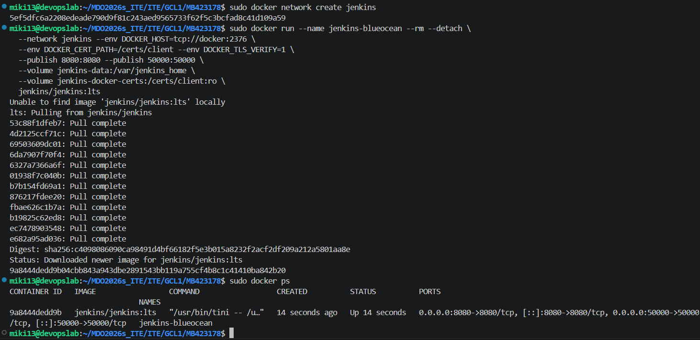
2. **Odzyskanie hasła i dowód trwałości danych:** Ponieważ główny kontener został zrestartowany z flagą `--rm`, dostęp do początkowych logów został utracony. Wykorzystano jednak fakt, że dane Jenkinsa są bezpieczne na woluminie `jenkins-data`. Przy pomocy tymczasowego kontenera odczytano plik `initialAdminPassword` bezpośrednio z wirtualnego dysku.
   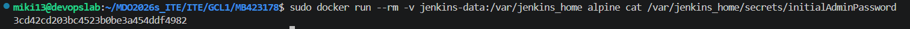
3. **Ekran logowania i konfiguracja:** Przekierowano port `8080` do środowiska lokalnego, odblokowano interfejs w przeglądarce odzyskanym hasłem i rozpoczęto instalację sugerowanych wtyczek.
   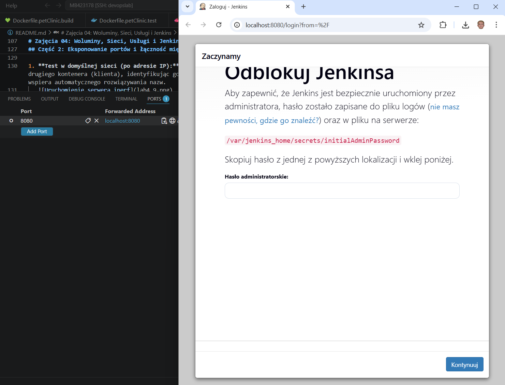
   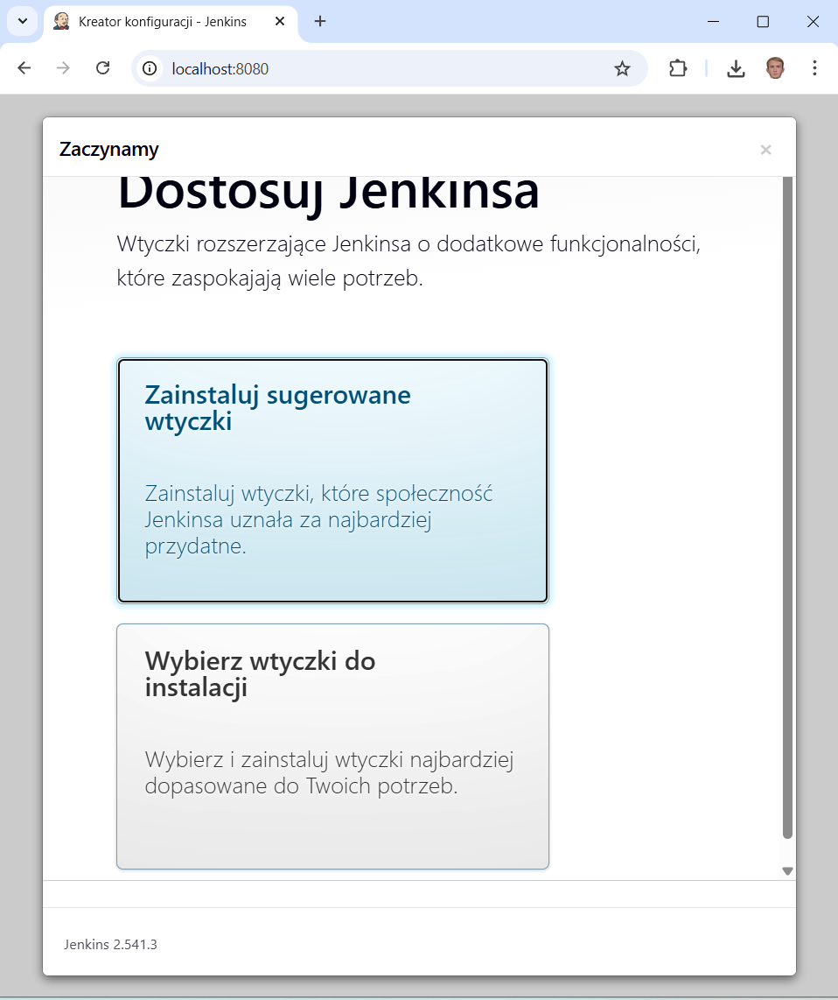