# Sprawozdanie - MB423178

## Środowisko uruchomieniowe
Wszystkie opisane poniżej kroki zostały wykonane w wyizolowanym środowisku.
* **System operacyjny:** Maszyna wirtualna z systemem Linux.
* **Metoda dostępu:** Połączenie zdalne za pośrednictwem protokołu SSH (Secure Shell). Praca odbywała się na koncie standardowego użytkownika (bez logowania na konto `root` oraz bez użycia konsoli KVM).
* **Narzędzia pracy:** Edytor Visual Studio Code z wtyczką *Remote - SSH*, zapewniający dostęp do terminala oraz zarządzanie plikami.

## Lab 1 Wprowadzenie, Git, Gałęzie, SSH

Celem zajęć było przygotowanie stanowiska pracy, w tym konfiguracja narzędzi, uwierzytelniania SSH oraz struktury repozytorium.

### 1. Git
Zgodnie z poleceniem, upewniłem się, że w systemie Linux zainstalowany jest klient Git. Następnie wykonałem pierwsze, testowe klonowanie repozytorium przedmiotowego z użyciem protokołu HTTPS. Do uwierzytelnienia wykorzystałem wygenerowany w panelu GitHub *Personal Access Token* (PAT).

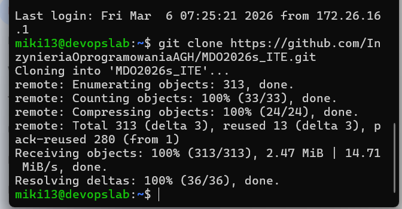

### 2. SSH

Aby docelowo zabezpieczyć i ułatwić komunikację z serwerem, wdrożyłem autoryzację opartą o klucze SSH.

* **Tworzenie kluczy:** Wygenerowałem dwa klucze oparte o nowoczesne algorytmy inne niż RSA:
  1. Główny klucz `ED25519` zabezpieczony silnym hasłem (`ssh-keygen -t ed25519 -C "bednarczyk1mikolaj@gmail.com"`).
  2. Zapasowy klucz `ECDSA` 521-bit (`ssh-keygen -t ecdsa -b 521`).
  
  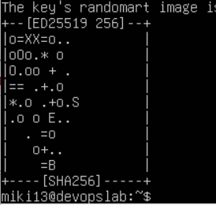
  
  

* **Konfiguracja GitHub:** Klucze publiczne dodałem do ustawień konta GitHub, a konto dodatkowo zabezpieczyłem uwierzytelnianiem dwuskładnikowym (2FA).

  

* **Klonowanie repozytorium po SSH:** Z powodzeniem nawiązano połączenie (`ssh -T git@github.com`) i sklonowałem repozytorium wykorzystując protokół SSH.

  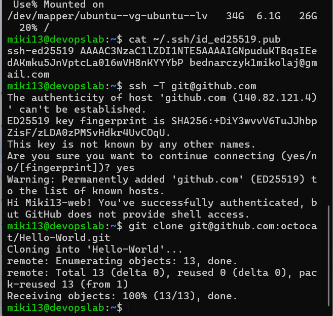

### 3. Narzędzia

Jako docelowe środowisko IDE skonfigurowałem **Visual Studio Code**. Użyłem rozszerzenia *Remote - SSH*, co wyeliminowało potrzebę instalowania zewnętrznych menedżerów plików (np. FileZilla). Wbudowany eksplorator zapewnił natychmiastową wymianę plików i wygodny podgląd dokumentacji Markdown.


### 4. Gałąź i struktura katalogów

Zarządzanie repozytorium rozpocząłem od przełączenia się na gałąź `main`, a następnie na gałąź grupy `GCL1`.
* Stworzyłem nową gałąź roboczą (brnach) o nazwie `MB423178` (inicjały i numer indeksu) od gałęzi grupowej.
* Wewnątrz powiązanego katalogu utworzyłem dedykowany katalog roboczy `MB423178`.

  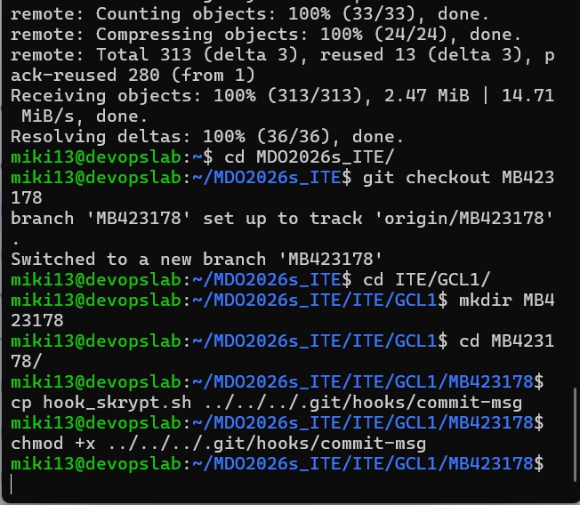

**Napisanie i wdrożenie Git Hooka**
Aby wymusić poprawne konwencje nazewnicze, przygotowałem skrypt `commit-msg` weryfikujący, czy wiadomość commita zaczyna się od zadanego prefiksu. Skrypt dodałem do folderu roboczego, a następnie skopiowano do ukrytego katalogu `.git/hooks` nadając mu prawa do wykonania poleceniem (`chmod +x`).

### Mój Git Hook
Aby utworzyć ten skrypt lokalnie, użyłem wbudowanego edytora tekstu `nano`. W terminalu wpisałem polecenie `nano hook_skrypt.sh`, napisałem poniższy kod, a następnie zapisałem plik (skrót `Ctrl+O`, `Enter`) i zamknąłem edytor (`Ctrl+X`).

Oto dokładna treść, która znalazła się wewnątrz pliku:

```bash
#!/bin/bash
PREFIX="MB423178"
commit_msg=$(head -n1 "$1")
if [[ ! $commit_msg == $PREFIX* ]]; then
    echo "BŁĄD: Twój commit message musi zaczynać się od: $PREFIX"
    exit 1
fi
```

### 5. Praca z serwerem i rozwiązywanie konfliktów
Zgodnie z instrukcją dodałem pliki sprawozdania wraz ze zrzutami ekranu i spróbowałem zrobić `git push` żeby wypchnąć zmiany do gałęzi grupowej. W tym procesie wystąpił problem, który przetestował działanie stworzonego Git Hooka.

1. **Problem z `git push`:** Serwer odrzucił wysyłanie zmian, ponieważ zdalne repozytorium zawierało pracę, której nie posiadałem lokalnie (konieczność pobrania gałęzi grupowej).

   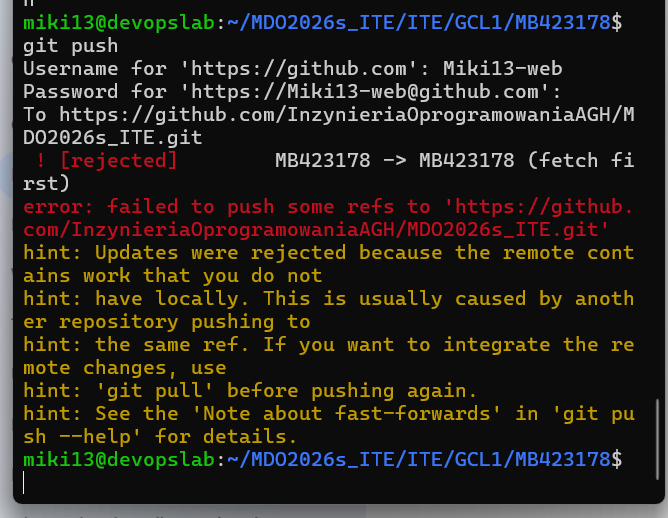

   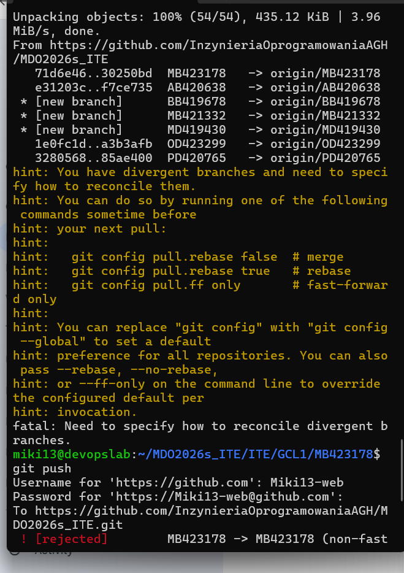

2. **Aktywacja Git Hooka podczas `git pull`:** Przy próbie integracji zmian z serwera (`git pull`), Git usiłował stworzyć automatyczny "Merge commit". Operacja ta została **zablokowana przez mój autorski skrypt**, ponieważ domyślna wiadomość scalająca nie posiadała wymaganego prefiksu `MB423178`.

   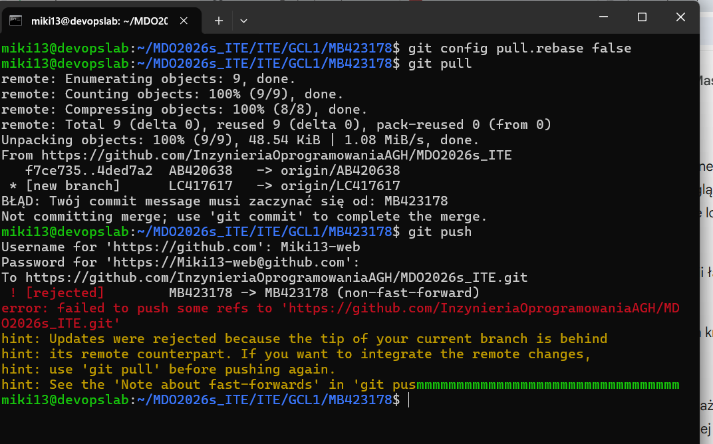

3. **Rozwiązanie:** Aby prawidłowo połączyć pliki z pominięciem blokady, wykonałem commita ręcznie, nadając mu tytuł spełniający wymogi skryptu (`MB423178: Złączenie plików z serwerem`). Operacja ta zakończyła się sukcesem i pozwoliła na poprawne zaktualizowanie serwera (`git push`).

   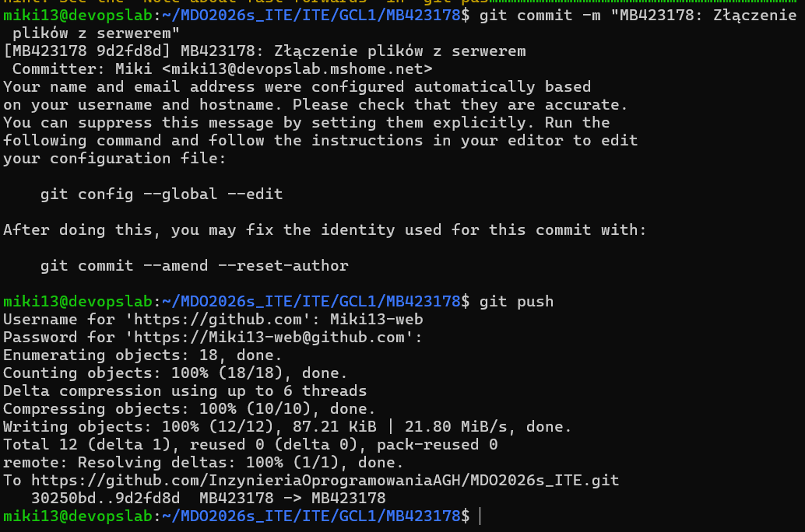

---

# LAB 2 Docker Git, Docker - Zestawienie środowiska skonteneryzowanego

Celem tych zajęć było skonfigurowanie środowiska Docker oraz zapoznanie się z cyklem życia kontenerów i budową własnych obrazów, co posłużyło mi jako fundament do dalszej pracy nad CI.

### 1. Instalacja Dockera
Zgodnie z wymogami, zainstalowałem demona Docker bezpośrednio z natywnego repozytorium dystrybucji Ubuntu, unikając pakietów typu Snap czy Flatpak. Poprawność instalacji zweryfikowałem sprawdzając wersję narzędzia:
```bash
docker --version
```

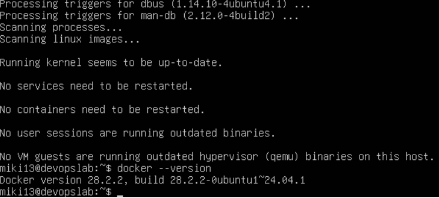

### 2. oraz 3. Pobieranie obrazów, sprawdzanie rozmiarów i kodów wyjścia
Zarejestrowałem konto na platformie Docker Hub. Następnie pobrałem wyznaczone obrazy testowe i systemowe: `hello-world`, `busybox`, `ubuntu`, bazę danych `mariadb`, serwer `node` oraz środowiska .NET.
Do weryfikacji zajmowanego przez nie miejsca na dysku użyłem polecenia:
```bash
sudo docker images
```

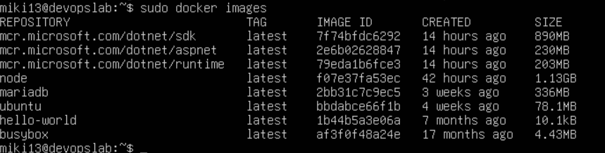

Aby przetestować uruchamianie kontenerów i zweryfikować kody wyjścia (exit codes), uruchomiłem obraz `hello-world`. Ponieważ program ten wykonuje zadanie i natychmiast się kończy, po jego wykonaniu odczytałem status ostatniego polecenia systemowego:

```bash
sudo docker run hello-world
echo $?
```

Kod wyjścia wyniósł `0`, co potwierdza bezbłędne wykonanie procesu.

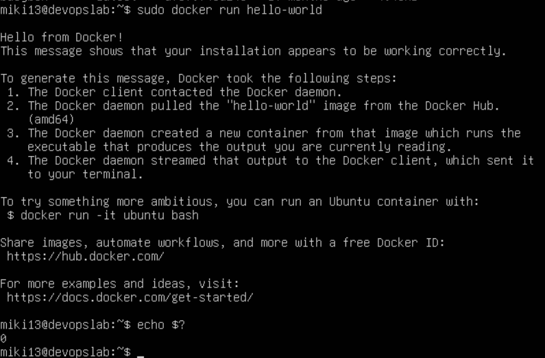

### 4. Praca interaktywna z kontenerem BusyBox
Uruchomiłem lekki kontener narzędziowy oparty na obrazie `busybox` w trybie interaktywnym z podłączonym terminalem TTY (flagi `-it`), aby móc wydawać w nim polecenia. Wewnątrz środowiska sprawdziłem numer wersji narzędzia:

```bash
sudo docker run -it busybox sh
/ # busybox | head -n 1
```

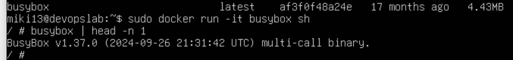

### 5. System w kontenerze i demonstracja PID 1
W celu udowodnienia izolacji procesów w Dockerze, uruchomiłem pełnoprawny system operacyjny (`ubuntu`) w kontenerze:

```bash
sudo docker run -it ubuntu bash
```

Wewnątrz kontenera odświeżyłem repozytoria oraz zainstalowałem pakiet `procps`, aby móc wywołać menedżer zadań `ps`:

```bash
apt update
apt install procps -y
ps -p 1
```

Z wykonanego polecenia jasno wynika, że główny proces systemowy (PID 1) to moja powłoka `bash`. Kontener to odizolowane "pudełko", które nie widzi procesów mojej maszyny hosta.

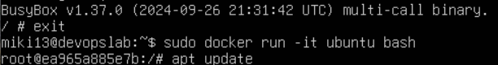

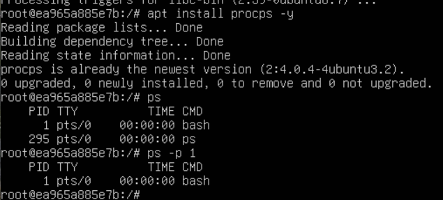

Potwierdziłem, że proces działa w tle, wykonując z drugiego terminala na hoście listowanie uruchomionych kontenerów:

```bash
sudo docker ps
```

.png)

### 7. Budowa własnego obrazu (Dockerfile)
Stworzyłem własny plik `Dockerfile` definiujący nowe środowisko oparte na `ubuntu:24.04`, wyposażone w narzędzie `git` oraz pobrany kod repozytorium zajęciowego. 
Zanim zbudowałem obraz, musiałem fizycznie utworzyć plik z instrukcjami. W terminalu wpisałem polecenie `nano Dockerfile` (wielkość liter ma znaczenie), napisałem poniższą zawartość, zapisałem plik (`Ctrl+O`, `Enter`) i wyszedłem z edytora (`Ctrl+X`).

**Treść `Dockerfile`:**
```dockerfile
# FROM - Określa obraz bazowy (nowoczesne wydanie LTS Ubuntu)
FROM ubuntu:24.04

# RUN - Wykonuje polecenia podczas budowania warstwy. 
# Zgrupowanie poleceń update i install w jednej linijce to dobra praktyka oszczędzająca ilość warstw obrazu.
RUN apt-get update && apt-get install -y git

# WORKDIR - Ustawia katalog roboczy dla kolejnych instrukcji w kontenerze
WORKDIR /app

# RUN - Sklonowanie repozytorium przedmiotowego do katalogu roboczego
RUN git clone https://github.com/InzynieriaOprogramowaniaAGH/MDO2026s_ITE.git

# CMD - Definiuje domyślny proces (powłokę), który zostanie uruchomiony po starcie kontenera
CMD ["bash"]
```

Zbudowałem obraz nadając mu własny tag `my-image-git`:

```bash
sudo docker build -t my-image-git .
```

Następnie uruchomiłem wygenerowany kontener interaktywnie, aby sprawdzić, czy repozytorium faktycznie zostało do niego sklonowane.

```bash
sudo docker run -it my-image-git
ls -la MDO2026s_ITE/
```

Repozytorium było na swoim miejscu.

.png)

.png)

.png)

### 8. Zarządzanie kontenerami i czyszczenie (Prune)
Wyświetliłem pełną listę kontenerów (działających oraz zatrzymanych) komendą `ps -a`. Następnie użyłem komendy czyszczącej, aby hurtem usunąć z systemu wszystkie kontenery, które zakończyły swoje działanie:

```bash
sudo docker ps -a
sudo docker container prune -f
```

.png)

.png)

### 9. Oczyszczanie lokalnego magazynu obrazów
Po wyczyszczeniu kontenerów wykonałem polecenie usuwające nieużywane obrazy pobrane do lokalnego cache demona, aby odzyskać przestrzeń dyskową na maszynie wirtualnej:

```bash
sudo docker image prune -a -f
```

Proces ten odzyskał znaczne ilości wolnego miejsca. Mój plik `Dockerfile` został zachowany na dysku w celach raportowych.

.png)

.png)

---

## ZAJĘCIA 03: Dockerfiles - kontener jako definicja etapu

Celem zajęć było zbudowanie oprogramowania w powtarzalnym środowisku CI, gwarantującym przenośność procesu pomiędzy różnymi systemami.

### 1. Wybór oprogramowania i budowa lokalna na hoście
Na obiekt testowy wybrałem projekt **Spring PetClinic**. Spełnia on wszystkie wymagania instrukcji: posiada otwartą licencję (Apache 2.0), opiera się na popularnym narzędziu do budowania (Maven - `./mvnw`) oraz zawiera zdefiniowane testy jednostkowe z czytelnym raportem końcowym.

W pierwszej kolejności przygotowałem środowisko na maszynie hosta, doinstalowując niezbędne pakiety (Java JDK 17 i Git), a następnie zbudowałem i przetestowałem projekt lokalnie:

```bash
sudo apt update && sudo apt install -y openjdk-17-jdk git
git clone https://github.com/spring-projects/spring-petclinic.git
cd spring-petclinic
./mvnw package -DskipTests
./mvnw test
```

**Dokumentacja procesu na hoście:**
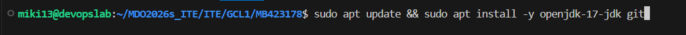
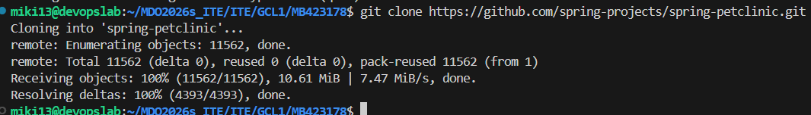
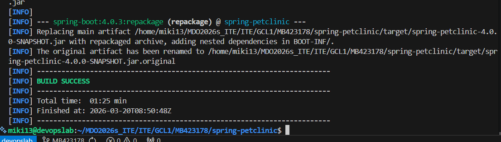
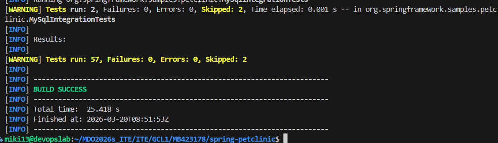

### 2. Izolacja i powtarzalność: build w kontenerze interaktywnie
Aby zagwarantować powtarzalność środowiska, odtworzyłem cały proces kompilacji i testowania wewnątrz czystego kontenera bazowego z preinstalowanym środowiskiem Java. Uruchomiłem interaktywną powłokę (TTY) w obrazie `eclipse-temurin:17-jdk`:

```bash
sudo docker run -it eclipse-temurin:17-jdk bash
```

Wewnątrz kontenera zainstalowałem narzędzie `git`, sklonowałem projekt i ponownie wykonałem fazy *build* oraz *test*:

```bash
apt-get update && apt-get install -y git
git clone https://github.com/spring-projects/spring-petclinic.git
cd spring-petclinic
./mvnw package -DskipTests
./mvnw test
```

**Dokumentacja pracy interaktywnej:**
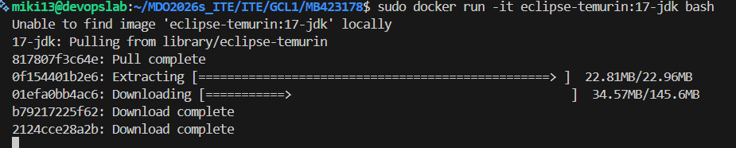
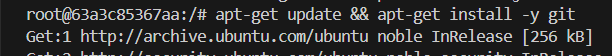
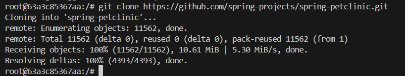
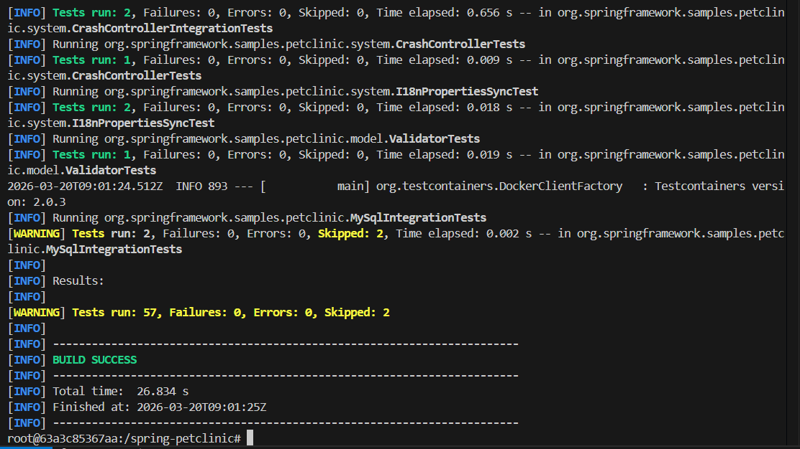

### 3. Automatyzacja procesu (Dockerfiles)
Ręczny proces przekułem w zautomatyzowane ramy. Zgodnie z instrukcją, przygotowałem dwa oddzielne pliki `Dockerfile`:

**Plik 1: `Dockerfile.petClinic.build`** (odpowiada wyłącznie za pobranie i zbudowanie kodu). Utworzyłem go wpisując w terminalu `nano Dockerfile.petClinic.build`i piosząc w nim  taki kod:

```dockerfile
FROM eclipse-temurin:17-jdk
WORKDIR /app
RUN apt-get update && apt-get install -y git
RUN git clone https://github.com/spring-projects/spring-petclinic.git .
RUN ./mvnw package -DskipTests
```

**Wyjaśnienie użytych dyrektyw:**
* **`FROM`**: Określa obraz bazowy, na którym będzie opierał się nasz kontener. W tym przypadku jest to gotowe środowisko Java (JDK 17), niezbędne do skompilowania projektu.
* **`WORKDIR`**: Tworzy i ustawia domyślny katalog roboczy (`/app`) wewnątrz kontenera. Wszystkie kolejne instrukcje będą wykonywane w tym folderze.
* **`RUN`**: Służy do uruchamiania poleceń powłoki w trakcie budowania (tworzenia warstw) obrazu. Najpierw użyłem go do instalacji narzędzia Git, następnie do pobrania kodu źródłowego aplikacji z GitHuba, a na końcu do uruchomienia Mavena (`./mvnw package`), który skompilował projekt do pliku wykonywalnego z pominięciem testów.

**Plik 2: `Dockerfile.petClinic.test`** (bazuje na obrazie budującym i definiuje proces testowania). Utworzyłem go wpisując w terminalu `nano Dockerfile.petClinic.build`i piosząc w nim  taki kod:

```dockerfile
FROM petclinic-build:latest
CMD ["./mvnw", "test"]
```

**Wyjaśnienie użytych dyrektyw:**
* **`FROM`**: Jako bazy nie używa czystego systemu, lecz naszego lokalnego obrazu `petclinic-build:latest`, który zbudowaliśmy w poprzednim kroku. Dzięki temu kontener testowy dziedziczy całe środowisko wraz z już pobranym i skompilowanym kodem.
* **`CMD`**: Definiuje polecenie, które ma zostać uruchomione jako główny proces w momencie startu gotowego kontenera (w przeciwieństwie do `RUN`, które działa tylko podczas budowania obrazu). Tutaj wymusza wykonanie zestawu testów jednostkowych za pomocą narzędzia Maven.
Zbudowałem oba obrazy:

```bash
sudo docker build -t petclinic-build -f Dockerfile.petClinic.build .
sudo docker build -t petclinic-test -f Dockerfile.petClinic.test .
```

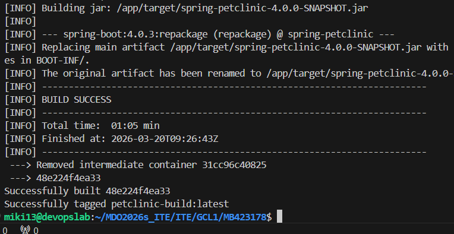

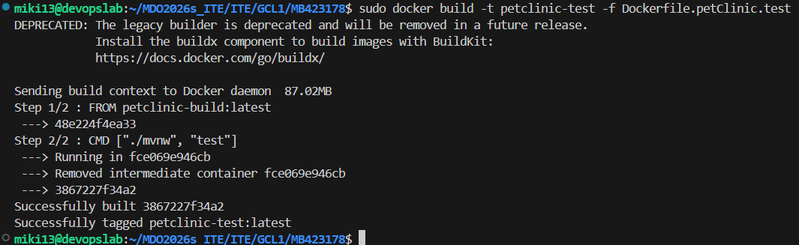

Następnie wdrożyłem i uruchomiłem finalny kontener testowy:

```bash
sudo docker run --name tester-petclinic petclinic-test
```

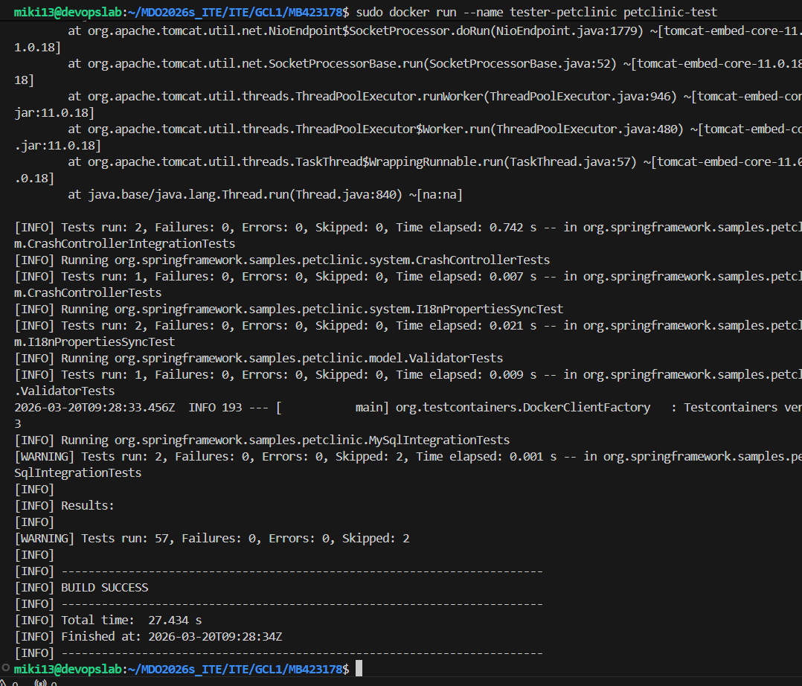

**Różnica między obrazem a kontenerem:** Obraz (`petclinic-test`) to wyłącznie "przepis" – statyczna, niezmienna warstwa plików zawierająca system operacyjny, kod źródłowy i skompilowaną aplikację. Kontener (`tester-petclinic`) to uruchomiona instancja tego obrazu. Wnętrze tego kontenera to pracujący proces, którym w tym przypadku jest środowisko **Java Virtual Machine (JVM)** wykonujące bibliotekę narzędziową Maven na skompilowanych plikach klas.

### 4. Zadania dodatkowe: Docker Compose
Zamiast wdrażać kontenery ręcznie z użyciem CLI, ująłem proces testowy w kompozycję. W tym celu utworzyłem nowy plik wpisując `nano docker-compose.yml`, napisałem w nim poniższą konfigurację i zapisałem:

```yaml
version: '3.8'
services:
  app-test:
    build:
      context: .
      dockerfile: Dockerfile.petClinic.test
```

Uruchomiłem całość zautomatyzowaną komendą `sudo docker-compose up`. Proces podniósł usługi, wykonał testy i wyłączył kontener z kodem `0` (sukces).

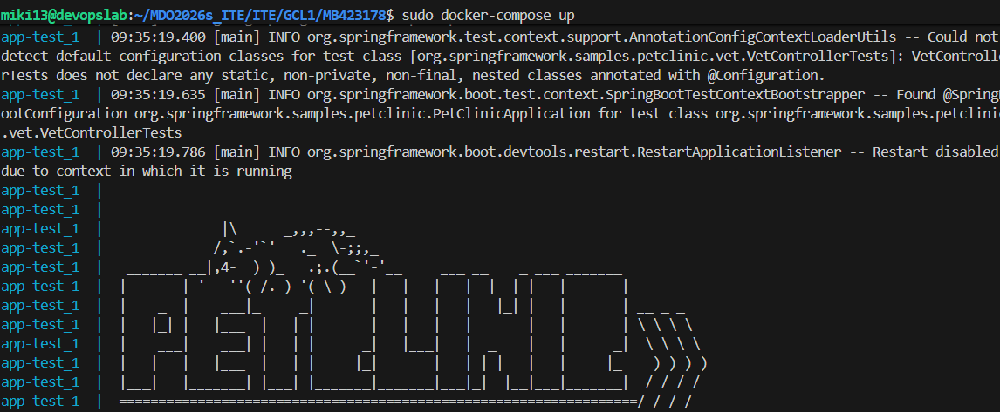

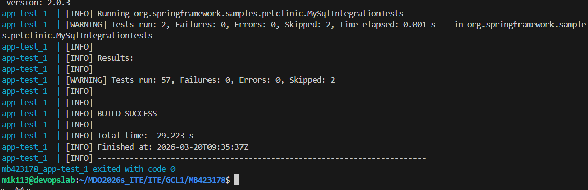

### 5. Przygotowanie do wdrożenia (Deploy) - Dyskusja
Analizując cykl życia aplikacji i końcowy artefakt zająłem stanowisko w dyskusji dotyczącej publikowania oprogramowania:

* **Czy program nadaje się jako kontener?** Tak, Spring PetClinic to typowa aplikacja serwerowa/mikroserwisowa (backend webowy). Aplikacje tego typu idealnie nadają się do wdrażania bezpośrednio jako kontenery do klastrów takich jak Kubernetes czy Docker Swarm. Interakcja odbywa się przez porty sieciowe (np. HTTP 8080), co jest natywne dla systemów kontenerowych.
* **Oczyszczanie po buildzie (Multi-stage build):** Aplikacja absolutnie **nie może** być wdrożona w obecnej postaci. Utworzony obraz zawiera pełne środowisko JDK, narzędzie Git oraz cały kod źródłowy. Zwiększa to wagę kontenera o setki megabajtów i drastycznie poszerza pole ataku (security risk). Konieczne jest zastosowanie mechanizmu **Multi-stage build**, w którym docelowy obraz wykorzystuje tylko środowisko uruchomieniowe (np. `eclipse-temurin:17-jre`), do którego kopiowany jest wyłącznie gotowy, pojedynczy artefakt z warstwy budującej.
* **Format dystrybucji:** Gotowy artefakt z frameworka Spring Boot jest dystrybuowany jako plik typu pakiet **`JAR` (Java ARchive)**. Zawiera on wbudowany serwer aplikacyjny (np. Tomcat). Inne środowiska mogą wymagać pakietów `DEB` czy `RPM` na poziomie OS, ale dla ekosystemu Javy skonteneryzowany, wykonywalny plik `JAR` jest standardem przemysłowym.

---

## ZAJĘCIA 04: Woluminy, Sieci, Usługi i Jenkins

### 1. Zachowywanie stanu (Woluminy Dockera)
Zadanie polegało na zachowaniu wygenerowanego pliku `.jar` nawet po zniszczeniu kontenera budującego.
Utworzyłem woluminy wirtualne:

```bash
docker volume create wejscie
docker volume create wyjscie
```

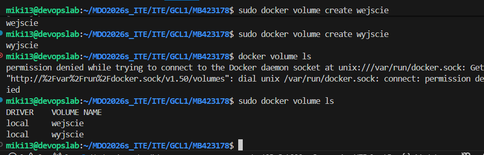

Zgodnie z wymogami "czystego obrazu" (bez preinstalowanego narzędzia Git), repozytorium sklonowałem na wolumin `wejscie` przy pomocy tymczasowego kontenera pomocniczego:

```bash
docker run --rm -v wejscie:/data alpine/git clone [https://github.com/spring-projects/spring-petclinic.git](https://github.com/spring-projects/spring-petclinic.git) /data/spring-petclinic
```


**Dlaczego wybrano kontener pomocniczy zamiast innych metod? (Dyskusja)**
* **Bind mount z lokalnym katalogiem:** Zastosowanie bind mount uzależnia kontener od specyficznej ścieżki i struktury plików na maszynie hosta. Łamie to zasadę przenośności (portability), a kontener przestaje być w pełni odizolowany.
* **Kopiowanie bezpośrednio do `/var/lib/docker`:** Modyfikowanie plików w tym katalogu na hoście to skrajny antywzorzec. Wymaga to użycia uprawnień `root` omijających demona Dockera, co może prowadzić do uszkodzenia struktury woluminów i problemów z prawami dostępu (permissions).
* **Zaleta kontenera pomocniczego:** Jest to najbezpieczniejsza i w pełni natywna metoda w ekosystemie Dockera. Pozwala zaciągnąć dane do izolowanego woluminu w sposób kontrolowany, po czym kontener sam się usuwa (`--rm`), zostawiając czyste dane gotowe do użycia przez inny obraz.

Następnie uruchomiłem kontener budujący, podpinając oba woluminy, i skopiowałem wynik na wolumin wyjściowy:

```bash
docker run --rm -v wejscie:/app -v wyjscie:/out eclipse-temurin:17-jdk bash -c "cd /app/spring-petclinic && ./mvnw package -DskipTests && cp target/*.jar /out/"
```


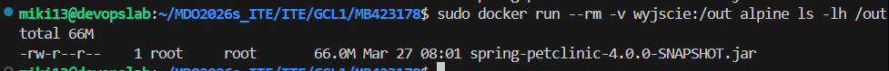

Ponowiłem test interaktywnie z instalacją Gita wewnątrz kontenera i zapisaniem drugiego pliku:

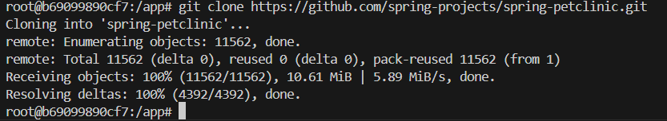

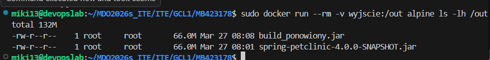

**Dyskusja Wykorzystanie `docker build` (`RUN --mount`):** Manipulację zewnętrznymi woluminami podczas budowy można by w ogóle pominąć, stosując dyrektywę `RUN --mount=type=bind` wewnątrz pliku `Dockerfile`. Pozwala to kompilatorowi na jednorazowe, nietrwałe "podglądnięcie" lokalnego kodu hosta na czas kompilacji, bez powiększania rozmiaru warstw końcowego obrazu. Omija to konieczność ręcznego tworzenia woluminów z poziomu CLI.

### 2. Eksponowanie portów i łączność (Sieci)
Wykonałem badanie łączności z użyciem narzędzia `iperf3`.

W **sieci domyślnej (default bridge)** uruchomiłem serwer i odpytałem go z klienta za pomocą statycznego adresu IP wyciągniętego narzędziem `docker inspect`:

```bash
docker run -d --name serwer-iperf networkstatic/iperf3 -s
docker inspect -f '{{range .NetworkSettings.Networks}}{{.IPAddress}}{{end}}' serwer-iperf
docker run -it --rm networkstatic/iperf3 -c <ZWRÓCONE_IP>
```

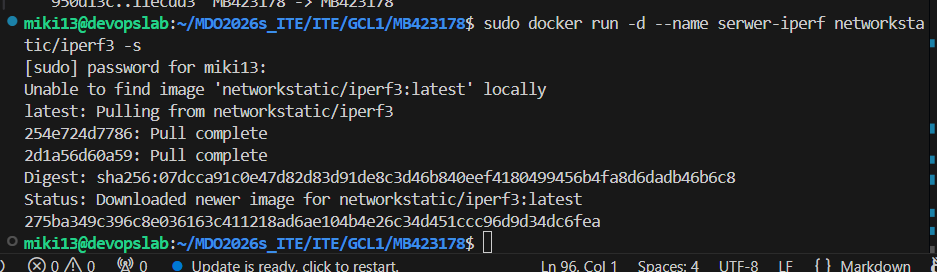

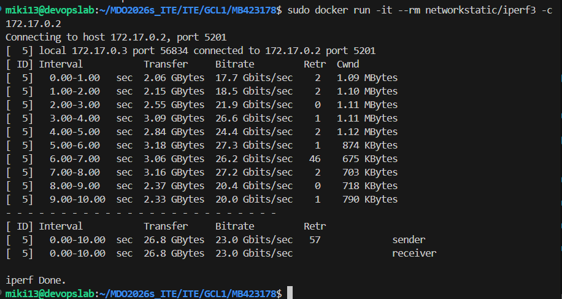

Następnie utworzyłem **własną sieć mostkową (custom bridge)**. Wykazałem, że nowa sieć posiada zintegrowany serwer DNS, umożliwiając komunikację po nazwie hosta (`serwer-dns`), bez znajomości adresu IP:

```bash
docker network create moja-siec
docker run -d --name serwer-dns --network moja-siec networkstatic/iperf3 -s
docker run -it --rm --network moja-siec networkstatic/iperf3 -c serwer-dns
```

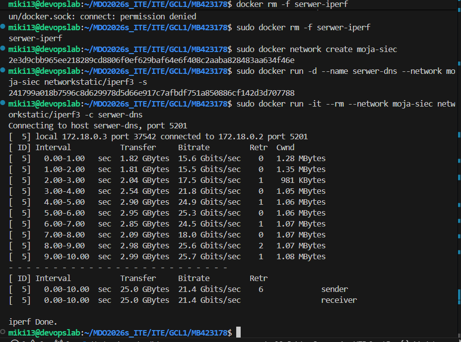


### 3. Usługi w systemie i klastrze (SSHD)
Uruchomiłem kontener realizujący usługę SSH i zalogowałem się do niego z poziomu mojej maszyny:

```bash
docker run -d --name serwer-ssh -p 2222:22 rastasheep/ubuntu-sshd:18.04
ssh root@localhost -p 2222
```

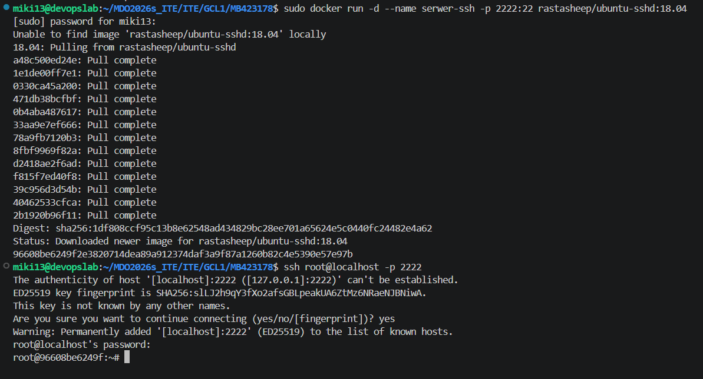


**Wnioski i przypadki użycia (Zalety/Wady):** Uruchamianie serwera SSH w kontenerze zasadniczo łamie zasadę pojedynczej odpowiedzialności (Single Responsibility Principle) – kontener zaczyna zarządzać dwoma procesami naraz. Instalowanie demona SSH wewnątrz kontenera jest uznawane za antywzorzec, ponieważ utrudnia zbieranie logów i stwarza luki w bezpieczeństwie. Bezpieczny, natywny dostęp administracyjny zapewnia polecenie `docker exec -it <nazwa_kontenera> bash`.
Jedynymi **uzasadnionymi przypadkami użycia** zintegrowanego SSH w kontenerze są:
1. Tworzenie kontenerów typu *Honeypot* (pułapki na hakerów skanujących sieć w poszukiwaniu otwartego portu 22).
2. Specyficzne, stare aplikacje (legacy), które twardo wymagają protokołu SSH do komunikacji wewnętrznej i nie da się ich zrefaktoryzować.

### 4. Serwer Jenkins (Docker-in-Docker)
Zgodnie z wymogami projektu, zapoznałem się z oficjalną dokumentacją instalacyjną Jenkinsa i na jej podstawie skonfigurowałem architekturę DIND (Docker-in-Docker). Utworzyłem dedykowaną sieć i uruchomiłem kontener za pomocą oficjalnie rekomendowanej komendy:

```bash
docker network create jenkins

# Uruchomienie głównego kontenera Jenkinsa w stworzonej sieci z odpowiednimi portami i woluminem
sudo docker run --name jenkins-blueocean --rm --detach --network jenkins --env DOCKER_HOST=tcp://docker:2376 --env DOCKER_CERT_PATH=/certs/client --env DOCKER_TLS_VERIFY=1 --publish 8080:8080 --publish 50000:50000 --volume jenkins-data:/var/jenkins_home --volume jenkins-docker-certs:/certs/client:ro jenkins/jenkins:lts

# Weryfikacja działania
docker ps
```

**Dlaczego użyto tak złożonej komendy? (Wyjaśnienie parametrów):**
Zastosowanie tej dokładnej składni z dokumentacji było konieczne do poprawnego i bezpiecznego zestawienia środowiska:
* **`--network jenkins`**: Izoluje Jenkinsa i pozwala mu komunikować się z wewnętrznym demonem Dockera po nazwie hosta.
* **`--env DOCKER_...`**: Przekazuje zmienne środowiskowe wymagane do autoryzacji TLS przy tworzeniu kontenerów wewnątrz kontenera.
* **`--publish 8080:8080` oraz `50000:50000`**: Mapuje port interfejsu graficznego (UI) oraz port komunikacyjny dla przyszłych agentów roboczych (JNLP).
* **`--volume jenkins-data:/var/jenkins_home`**: To kluczowy element – montuje nazwany wolumin, dzięki któremu wtyczki, historia budowania i hasła administracyjne przetrwają nawet mimo obecności flagi `--rm` (usuwającej kontener po restarcie).

Ponieważ kontener konfiguracyjny uruchomiłem z flagą `--rm`, po restarcie maszyny wyczyszczono logi z początkowym hasłem administratora. Zademonstrowałem jednak potęgę trwałości danych w Dockerze, odzyskując hasło bezpośrednio z utworzonego wcześniej woluminu `jenkins-data`:
```bash
sudo docker run --rm -v jenkins-data:/var/jenkins_home alpine cat /var/jenkins_home/secrets/initialAdminPassword
```


Przekierowałem port 8080 do środowiska lokalnego za pomocą VS Code i odblokowałem interfejs graficzny zdekodowanym hasłem, po czym zainstalowałem niezbędne wtyczki.


---

## Historia poleceń (Command History)
Poniżej znajduje się listing historii poleceń obrazujący sekwencję mojej pracy w terminalu maszyny wirtualnej (SSH):

```bash
# ==========================================
# LAB 1: Konfiguracja, Git, SSH i Git Hook
# ==========================================
git clone [https://github.com/InzynieriaOprogramowaniaAGH/MDO2026s_ITE.git](https://github.com/InzynieriaOprogramowaniaAGH/MDO2026s_ITE.git)
cd MDO2026s_ITE/ITE/GCL1/
git checkout -b MB423178
mkdir MB423178 && cd MB423178/
cp hook_skrypt.sh ../../../.git/hooks/commit-msg
chmod +x ../../../.git/hooks/commit-msg
ssh-keygen -t ed25519 -C "bednarczyk1mikolaj@gmail.com"
ssh-keygen -t ecdsa -b 521 -C "bednarczyk1mikolaj@gmail.com"
cat ~/.ssh/id_ed25519.pub
ssh -T git@github.com
git config pull.rebase false

# ==========================================
# LAB 2: Docker - Podstawy, Obrazy, PID 1
# ==========================================
sudo apt update && sudo apt install docker.io -y
docker --version
sudo docker pull hello-world
sudo docker pull busybox
sudo docker pull ubuntu
sudo docker images
sudo docker run hello-world
echo $?
sudo docker run -it busybox sh
sudo docker run -it ubuntu bash
cat <<EOF > Dockerfile
FROM ubuntu:24.04
RUN apt-get update && apt-get install -y git
WORKDIR /app
RUN git clone [https://github.com/InzynieriaOprogramowaniaAGH/MDO2026s_ITE.git](https://github.com/InzynieriaOprogramowaniaAGH/MDO2026s_ITE.git)
CMD ["bash"]
EOF
sudo docker build -t my-image-git .
sudo docker run -it my-image-git
sudo docker ps -a
sudo docker container prune -f
sudo docker image prune -a -f

# ==========================================
# LAB 3: Dockerfiles i Docker Compose (CI)
# ==========================================
sudo apt update && sudo apt install -y openjdk-17-jdk git docker-compose
git clone [https://github.com/spring-projects/spring-petclinic.git](https://github.com/spring-projects/spring-petclinic.git)
cd spring-petclinic/
./mvnw package -DskipTests
./mvnw test
cd ..
sudo docker run -it eclipse-temurin:17-jdk bash
sudo docker build -t petclinic-build -f Dockerfile.petClinic.build .
sudo docker build -t petclinic-test -f Dockerfile.petClinic.test .
sudo docker run --name tester-petclinic petclinic-test
sudo docker-compose up
sudo docker system prune -a

# ==========================================
# LAB 4: Woluminy, Sieci (iperf), SSH i Jenkins
# ==========================================
sudo docker volume create wejscie
sudo docker volume create wyjscie
sudo docker run --rm -v wejscie:/data alpine/git clone [https://github.com/spring-projects/spring-petclinic.git](https://github.com/spring-projects/spring-petclinic.git) /data/spring-petclinic
sudo docker run --rm -v wejscie:/app -v wyjscie:/out eclipse-temurin:17-jdk bash -c "cd /app/spring-petclinic && ./mvnw package -DskipTests && cp target/*.jar /out/"
sudo docker run --rm -v wyjscie:/out alpine ls -lh /out
sudo docker run -d --name serwer-iperf networkstatic/iperf3 -s
sudo docker inspect -f '{{range .NetworkSettings.Networks}}{{.IPAddress}}{{end}}' serwer-iperf
sudo docker run -it --rm networkstatic/iperf3 -c 172.17.0.2
sudo docker network create moja-siec
sudo docker run -d --name serwer-dns --network moja-siec networkstatic/iperf3 -s
sudo docker run -it --rm --network moja-siec networkstatic/iperf3 -c serwer-dns
sudo docker run -d --name serwer-ssh -p 2222:22 rastasheep/ubuntu-sshd:18.04
ssh root@localhost -p 2222
sudo docker network create jenkins
sudo docker run --name jenkins-blueocean --rm --detach --network jenkins --env DOCKER_HOST=tcp://docker:2376 --env DOCKER_CERT_PATH=/certs/client --env DOCKER_TLS_VERIFY=1 --publish 8080:8080 --publish 50000:50000 --volume jenkins-data:/var/jenkins_home --volume jenkins-docker-certs:/certs/client:ro jenkins/jenkins:lts
sudo docker run --rm -v jenkins-data:/var/jenkins_home alpine cat /var/jenkins_home/secrets/initialAdminPassword
```

---

