# Sprawozdanie - Metodyki DevOps (Zajęcia 5-7)

**Imię i nazwisko:** Mikołaj Bednarczyk  
**Grupa:** Gr 1 , ITE

**Nr indeksu:** 423178  
**Data:** 30.04.2025

---

## Środowisko uruchomieniowe
Wszystkie opisane poniżej kroki zostały wykonane w wyizolowanym środowisku.
* **System operacyjny:** Maszyna wirtualna z systemem Linux (Ubuntu).
* **Metoda dostępu:** Połączenie zdalne za pośrednictwem protokołu SSH (Secure Shell). Cała praca odbywała się na koncie standardowego użytkownika.
* **Narzędzia pracy:** Edytor Visual Studio Code z wtyczką *Remote - SSH*, zapewniający dostęp do terminala oraz zarządzanie plikami.

---

## Lab 5: Pipeline, Jenkins, izolacja etapów

Celem tych zajęć było uruchomienie własnej instancji serwera Jenkins w architekturze Docker-in-Docker (DIND) oraz konfiguracja podstawowych kroków dla potoku CI/CD.

### 0. Etap 0: Konfiguracja środowiska
Aby ułatwić pracę z kontenerami i zautomatyzować procesy bez ciągłego podawania haseł, dodałem swojego użytkownika do grupy `docker`. Eliminuje to konieczność używania przedrostka `sudo` przed każdą komendą.

```bash
sudo usermod -aG docker $USER
newgrp docker
```

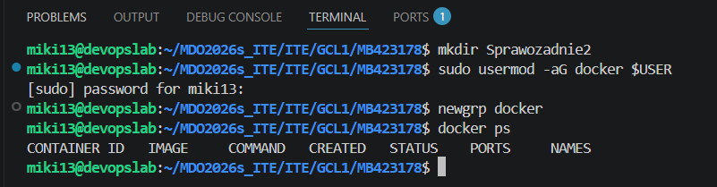

### 1. Etap 1: Przygotowanie Jenkinsa (Architektura DIND)
Zgodnie z wymaganiami i instrukcją, skonfigurowałem środowisko Jenkins w architekturze Docker-in-Docker (DIND), opierając się na oficjalnej dokumentacji dostawcy.

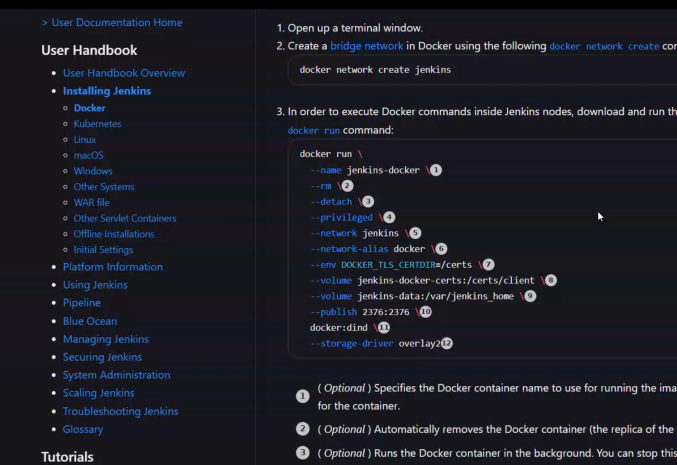

W pierwszej kolejności zbudowałem własny obraz bazujący na `jenkins/jenkins:lts`, instalując w nim klienta Dockera oraz sugerowaną wtyczkę Blue Ocean. Wykorzystałem do tego odpowiedni plik Dockerfile.

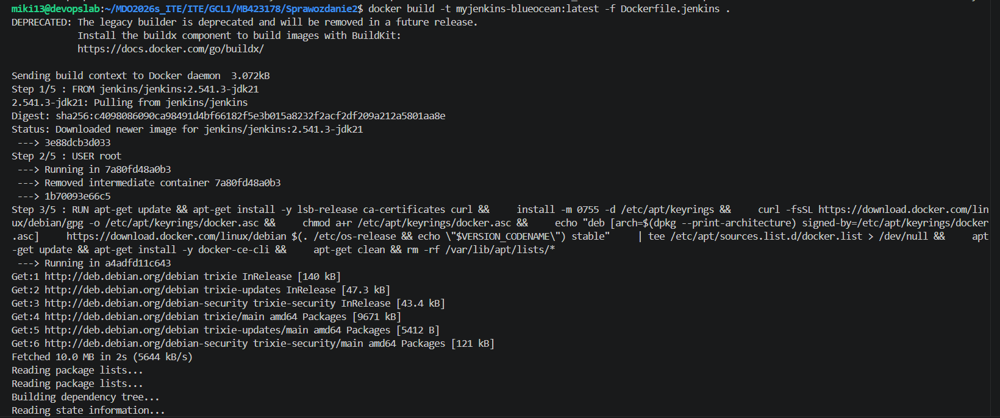
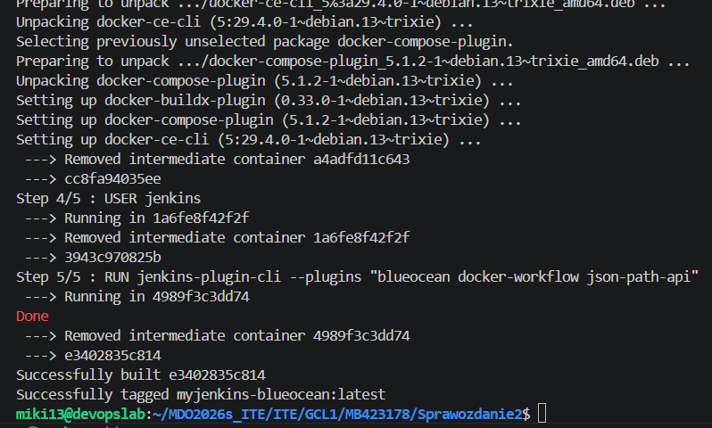

Następnie uruchomiłem wewnętrzny silnik Dockera (`docker:dind`) oraz powiązany z nim główny kontener Jenkinsa wewnątrz wspólnej dedykowanej sieci `jenkins`. Zweryfikowałem działanie podpiętych woluminów, odzyskując z nich początkowe hasło administratora.

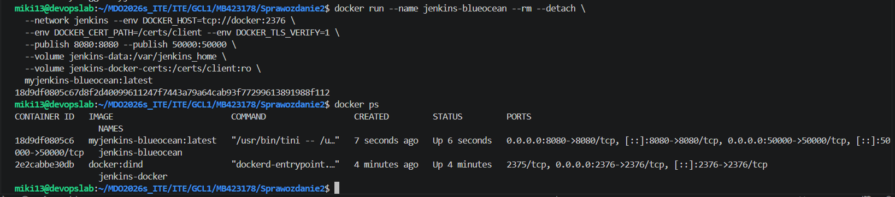
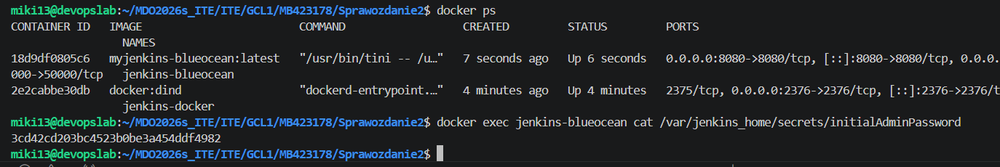
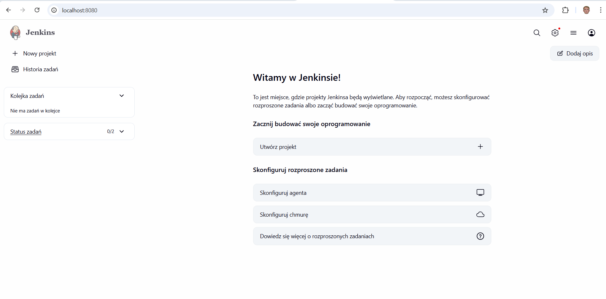

### 2. Etap 2: Zadanie wstępne (Uruchomienie)
Utworzyłem i pomyślnie wykonałem trzy projekty typu Freestyle w interfejsie Jenkinsa. Zweryfikowałem w ten sposób poprawność działania środowiska i komunikację z demonem Dockera pracującym wewnątrz DIND:

1. Wyświetlenie komendy `uname`
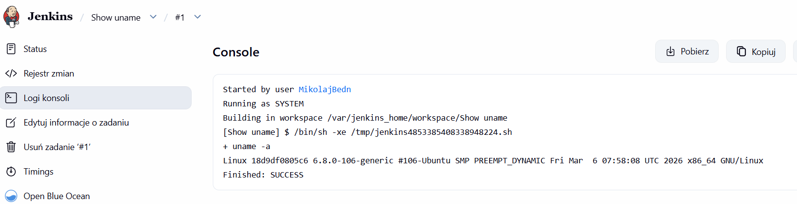

2. Projekt zwracający błąd przy nieparzystej godzinie
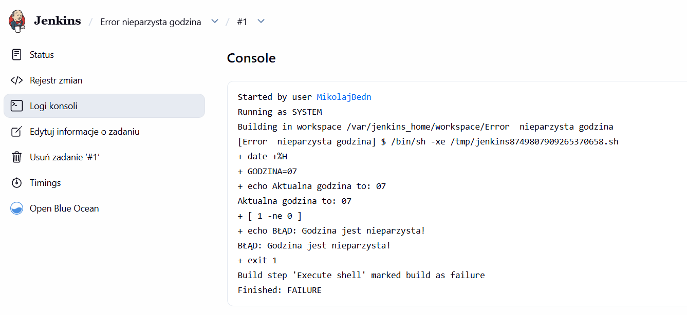

3. Pobranie obrazu `ubuntu` (`docker pull`)
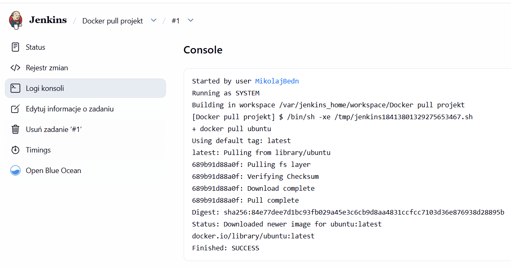

### 3. Etap 3: Zadanie wstępne - obiekt typu pipeline
Skonfigurowałem pierwszy projekt typu "Pipeline as Code". Skrypt automatycznie pobiera repozytorium uczelniane (z mojej gałęzi) i buduje obraz zdefiniowany w pliku `Dockerfile.petClinic.build` (napisanym podczas Sprawozdania 1). Na tym etapie skrypt wpisałem bezpośrednio w konfigurację zadania.

**Pierwsze uruchomienie (sukces kompilacji):**  
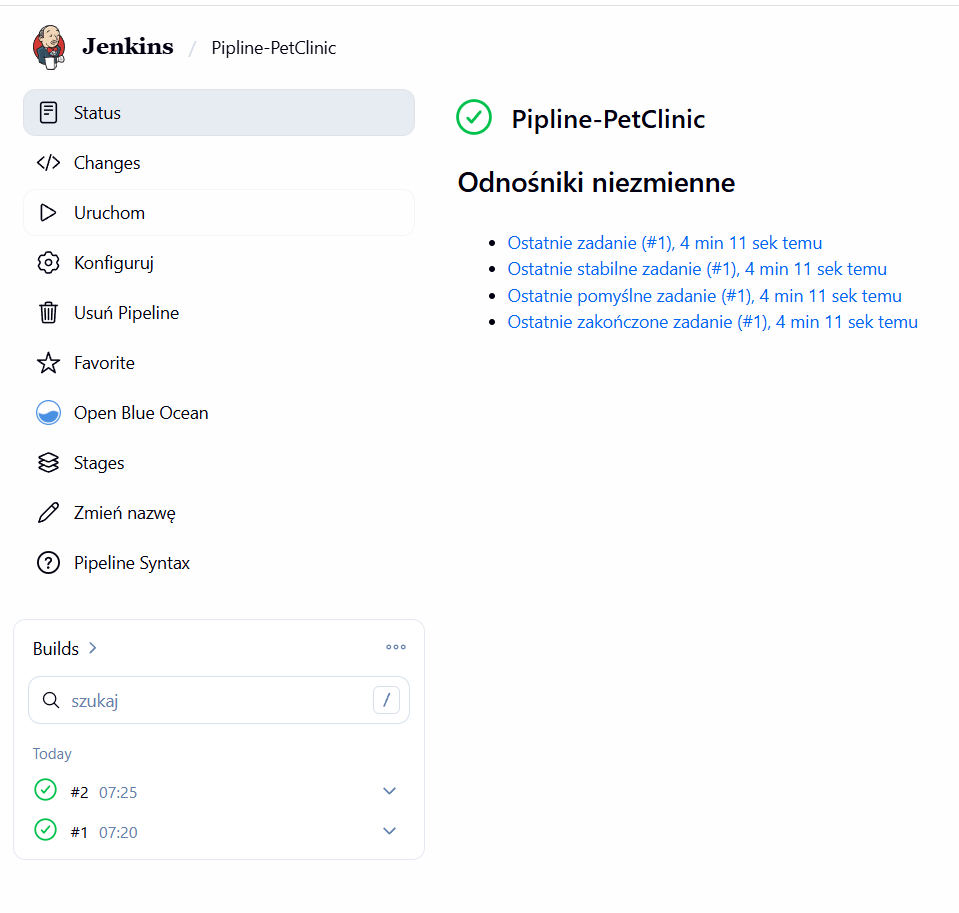  
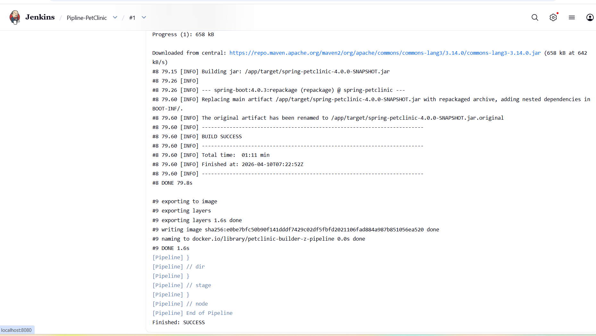  

**Drugie uruchomienie (weryfikacja mechanizmu cache):**  
Zgodnie z poleceniem, uruchomiłem potok po raz drugi. Logi jednoznacznie wskazują, że Docker poprawnie wykorzystał pamięć podręczną (`CACHED`), błyskawicznie kończąc zadanie bez ponownego pobierania pakietów z sieci.  
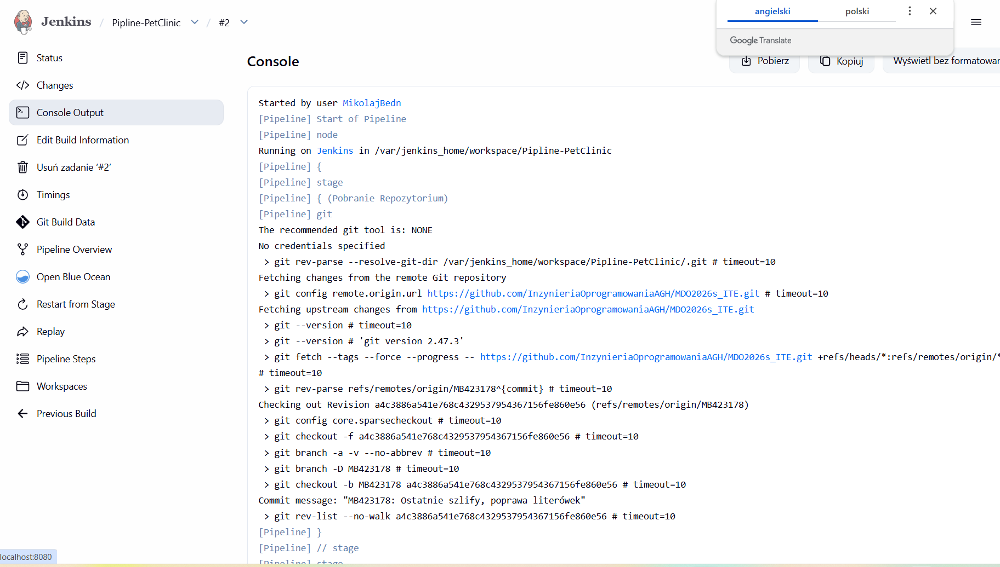  
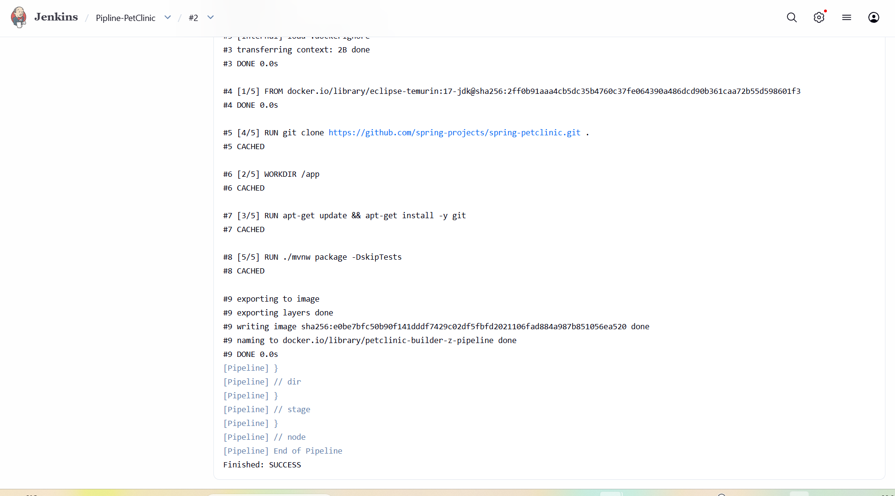  

---

## Projekt i Architektura Potoku CI/CD (Diagramy UML)

Zgodnie z wymogami listy kontrolnej, przed przystąpieniem do implementacji pełnej ścieżki krytycznej, przygotowałem formalne modele UML opisujące zaplanowany proces.

### Ogólny przepływ potoku (Diagram Aktywności)
Poniższy diagram przedstawia wysokopoziomowy przepływ zadań w potoku CI/CD, od momentu wypchnięcia kodu do repozytorium, aż po publikację zbudowanego artefaktu.

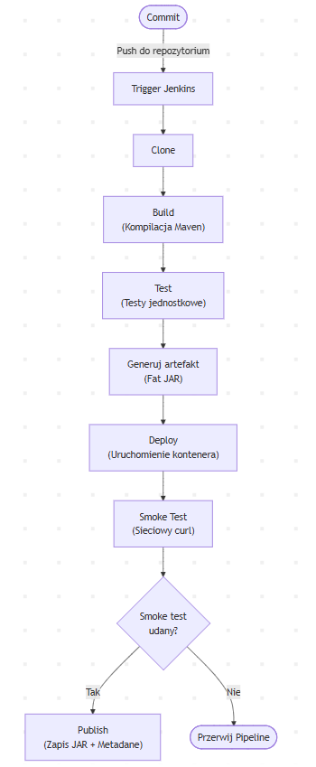  
*Rys. 1. Ogólny diagram aktywności (przepływ potoku CI/CD).*

### Szczegółowa architektura wdrażania i publikacji (Diagram Wdrożeniowy)
Zgodnie z wytycznymi z zajęć, etapy `Deploy` oraz `Publish` zostały ściśle odizolowane. Architektura wykorzystuje dedykowaną podsieć, w której kontener aplikacji eksponuje port `8080`, a tymczasowy kontener testowy weryfikuje jego stan narzędziem `curl`. Publikacja (z dołączeniem metadanych) odbywa się wyłącznie w przypadku kodu HTTP 200.

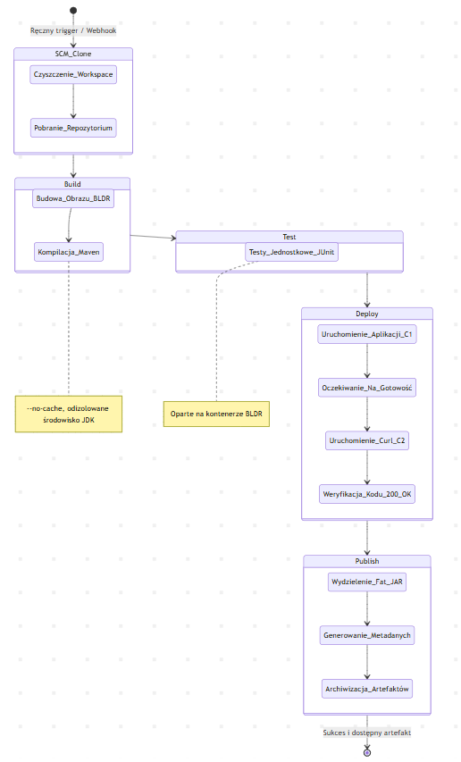  
*Rys. 2. Szczegółowy diagram aktywności.*

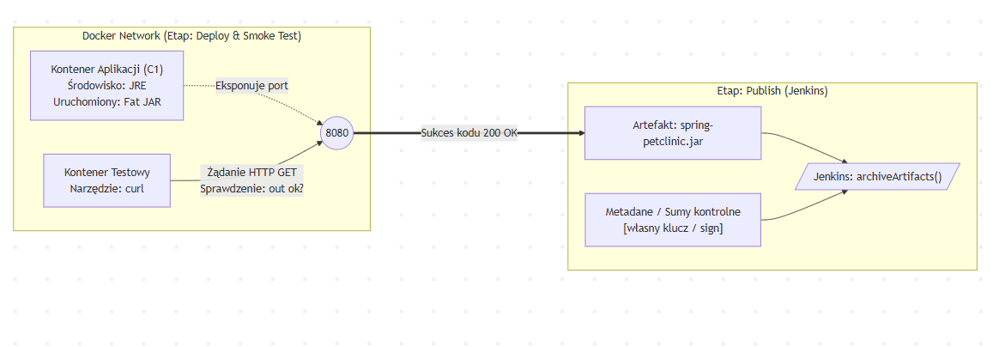  
*Rys. 3. Diagram wdrożeniowy: architektura izolowanego środowiska testowego i mechanizm dodawania metadanych.*

---

## Lab 6: Implementacja potoku CI/CD ze ścieżką krytyczną

W ramach tych zajęć zintegrowałem wcześniejsze etapy w jeden pełny potok CI/CD realizujący ścieżkę krytyczną: clone -> build -> test -> deploy -> publish.

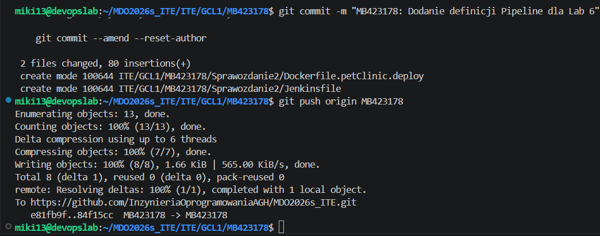  
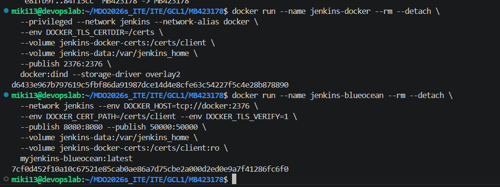  

### 1. Konfiguracja zadania i Maintainability (SCM)
Zrezygnowałem z ręcznego wpisywania skryptu w interfejsie Jenkinsa na rzecz opcji "Pipeline script from SCM", wskazując plik `Jenkinsfile` bezpośrednio w repozytorium GitHub. 

**Uzasadnienie (Maintainability):** 
Utrzymywanie definicji potoku jako kodu (*Infrastructure as Code*) w repozytorium to kluczowy element odporności na awarie. Wersjonujemy w ten sposób historię zmian w procesie budowania (widoczne w `git log`), a w przypadku uszkodzenia serwera Jenkinsa, cały potok można odtworzyć w kilka minut na nowej instancji. Gwarantuje to pełną przenośność rozwiązania.

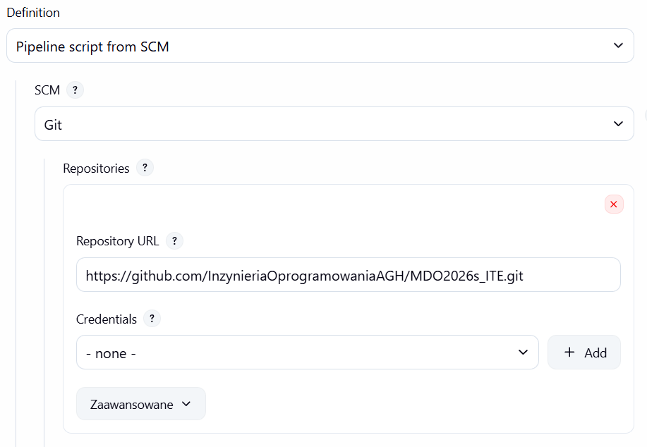  
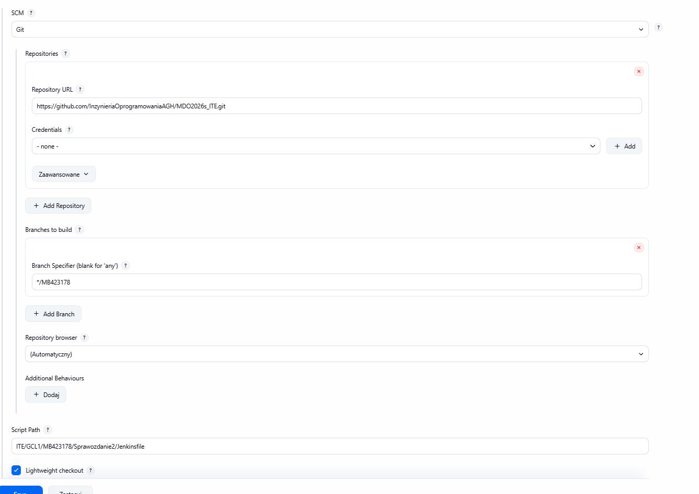  
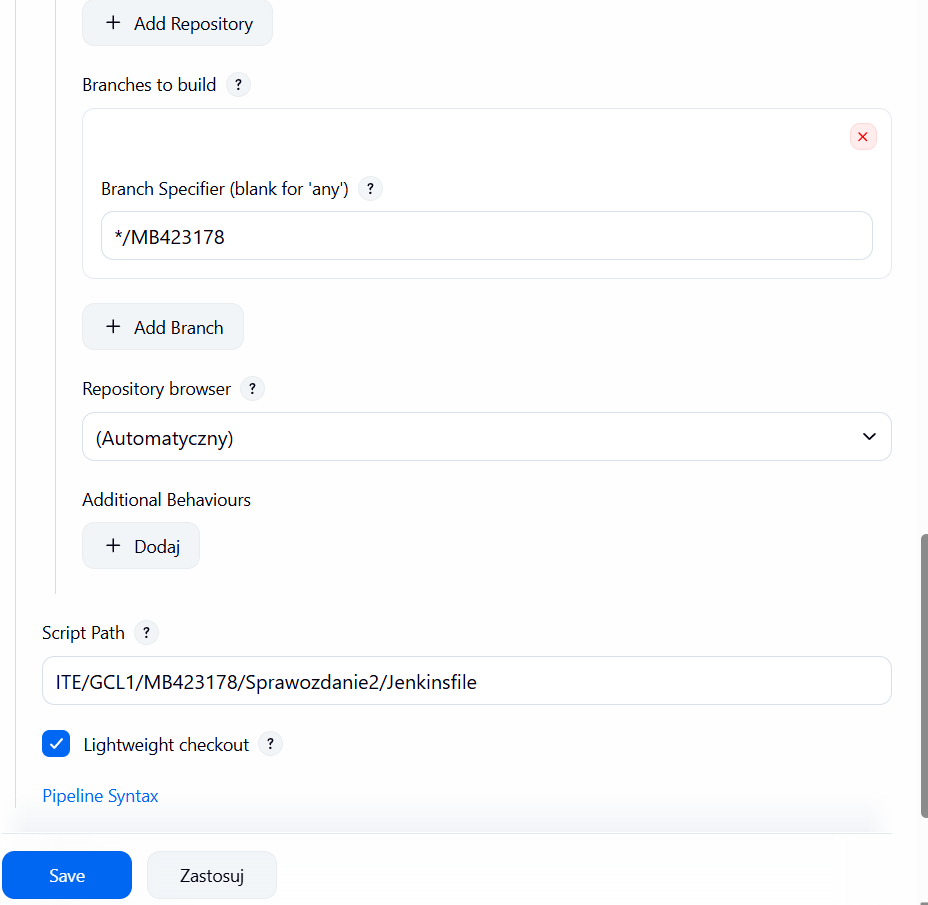  

### 2. Krok Build 
Proces budowania zajął niecałe 2 minuty. Kod kompiluje się wewnątrz tymczasowego kontenera bazującego na obrazie JDK.

**Uzasadnienie izolacji:**
Krok ten ma za zadanie wyłącznie pobranie zależności z Mavena i zbudowanie plików binarnych. Aplikacja nie jest w tym momencie uruchamiana. Taka izolacja zapewnia przewidywalność procesu i chroni serwer Jenkinsa przed zaśmiecaniem zależnościami.

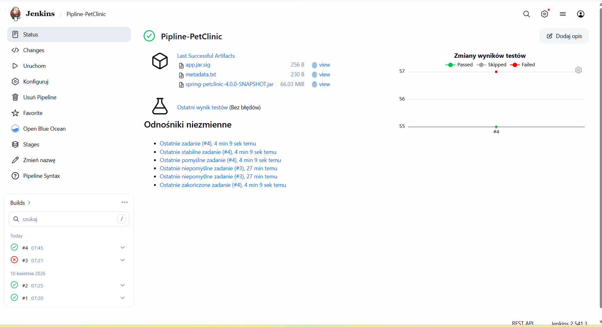  
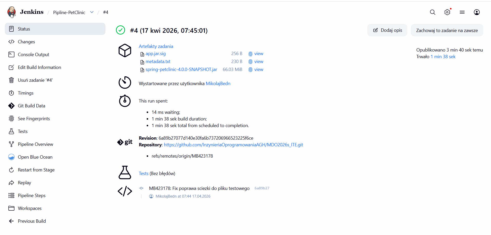  

### 3. Krok Test: Automatyczne testy (JUnit)
Weryfikacja jednostkowa zakończyła się sukcesem, a Jenkins przetworzył wygenerowane raporty (55 pomyślnych testów).

**Uzasadnienie dziedziczenia:**
Aby zagwarantować spójność, kontener testowy dziedziczy bezpośrednio z obrazu kompilacyjnego (`FROM petclinic-build:latest`). Dzięki temu mam absolutną pewność, że proces testowania operuje dokładnie na tym samym kodzie i tych samych pakietach binarnych, które zostały przed chwilą skompilowane.

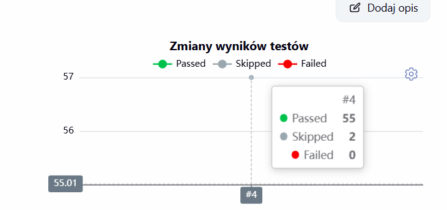

### 4. Krok Deploy: Weryfikacja sieciowa (Smoke Test)
W etapie Deploy zweryfikowałem, czy skompilowana aplikacja uruchamia się bez krytycznych błędów. W tym celu uruchomiłem kontener z aplikacją i wykorzystałem drugi kontener z zainstalowanym narzędziem `curl`, aby odpytać ją po wewnętrznej sieci Dockera. Wynik HTTP 200 potwierdził gotowość usługi.

**Uzasadnienie i dyskusja:**
Ważne jest zaznaczenie, że obraz wykorzystywany do budowania (zawierający klienta Git, JDK i kody źródłowe) nie jest docelowym obrazem produkcyjnym. Wdrażanie go na produkcję stwarzałoby ogromne zagrożenie bezpieczeństwa i marnowało zasoby. Na środowisko docelowe powinna trafić wyłącznie "odchudzona" wersja (np. z samym środowiskiem JRE) połączona ze zbudowanym w kroku *Build* artefaktem. Do symulacji wdrożenia (Smoke Test) uruchomiłem ją jako proces w tle.

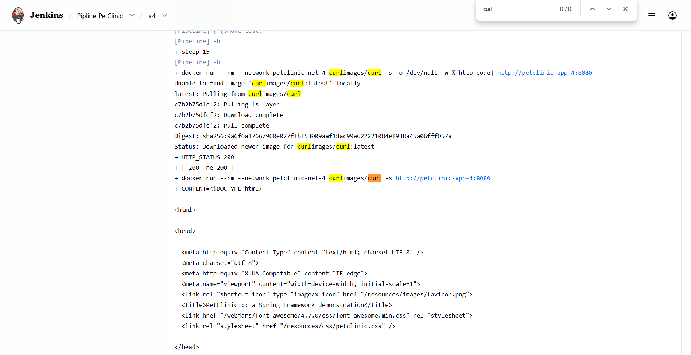

### 5. Krok Publish: Publikacja Artefaktów
Na koniec procesu aplikacja została zabezpieczona, zarchiwizowana w Jenkinsie (`archiveArtifacts`) wraz z wymaganymi metadanymi identyfikującymi jej pochodzenie.

**Uzasadnienie wyboru formatu:**
Dla projektu napisanego w frameworku Spring Boot idealnym rozwiązaniem dystrybucyjnym jest paczka **Fat JAR**. Zamyka ona w pojedynczym pliku `.jar` zarówno skompilowany kod, niezbędne biblioteki (Maven), jak i serwer aplikacyjny (Tomcat). Z perspektywy wdrożenia jest to najwygodniejsza forma – do uruchomienia aplikacji w środowisku klienckim wystarczy podstawowe środowisko uruchomieniowe Javy (`java -jar aplikacja.jar`), bez konieczności instalowania zewnętrznych serwerów.

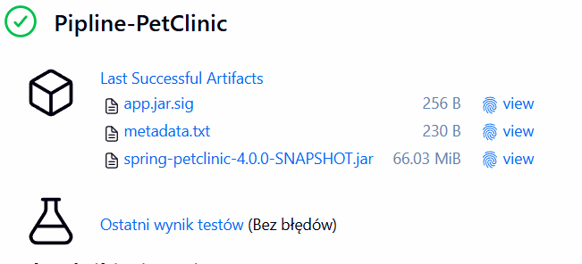

---

## Lab 7: Optymalizacja potoku i przygotowanie pod Ansible

### 1. Aktualizacja potoku (Jenkinsfile)
Aby potok był w pełni powtarzalny i spełniał kryterium "Definition of Done", zaktualizowałem plik konfiguracyjny o dwie istotne reguły:

* **Czyszczenie obszaru roboczego (Clean Workspace):** Zastosowałem instrukcję `deleteDir()` przed operacją `checkout scm`. Gwarantuje to skuteczne usunięcie starych plików tymczasowych i daje pewność, że agent Jenkinsa zawsze kompiluje najnowszą wersję kodu pobraną z serwera.
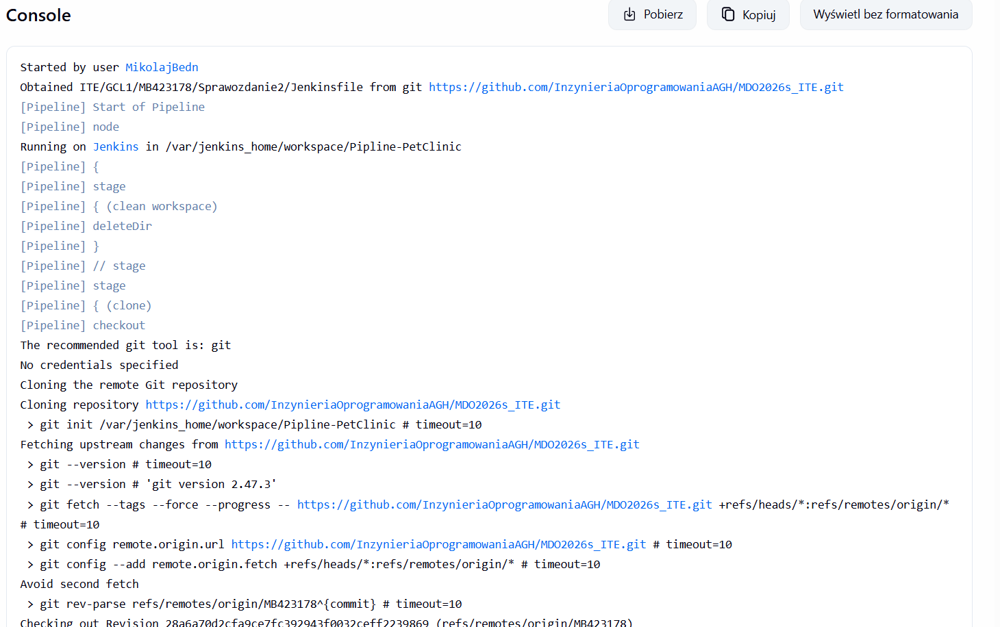

* **Wymuszenie czystego budowania (No-Cache):** Dodałem flagę `--no-cache` do komend demona Dockera. Służy to omijaniu pamięci podręcznej obrazów przy docelowych kompilacjach, co wymusza pobranie zaktualizowanych pakietów bazowych za każdym przejściem rurociągu.
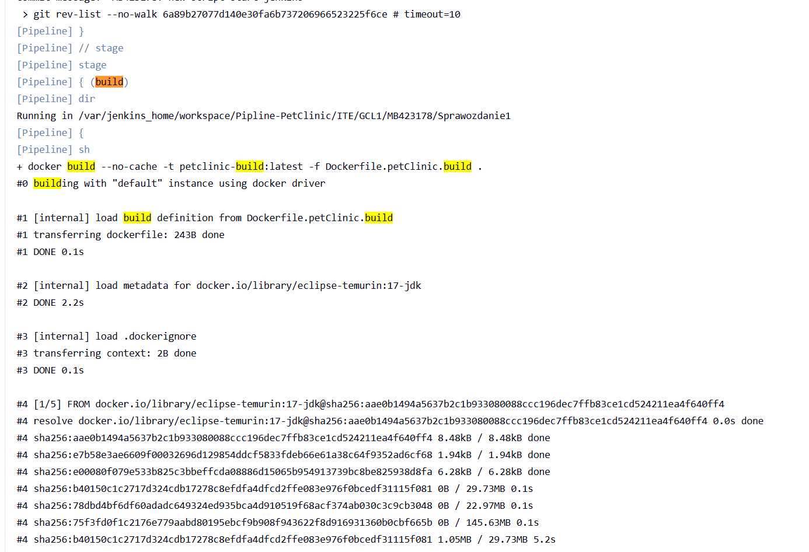

### 2. Przygotowanie infrastruktury pod Ansible
Przygotowując się do automatyzacji infrastruktury (Infrastructure as Code), skonfigurowałem drugą, lekką maszynę wirtualną (`ansible-target`) na systemie Ubuntu Server.

Na początku zweryfikowałem przydzielony jej adres IP oraz obecność serwera SSH i pakietu `tar`.
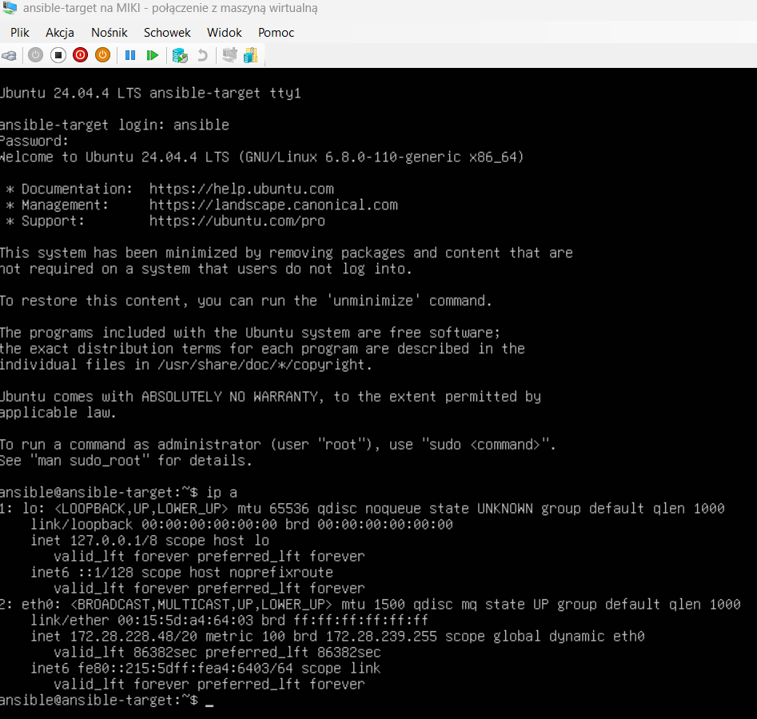

Następnie, na głównej maszynie wygenerowałem nową parę kluczy RSA (4096 bitów).
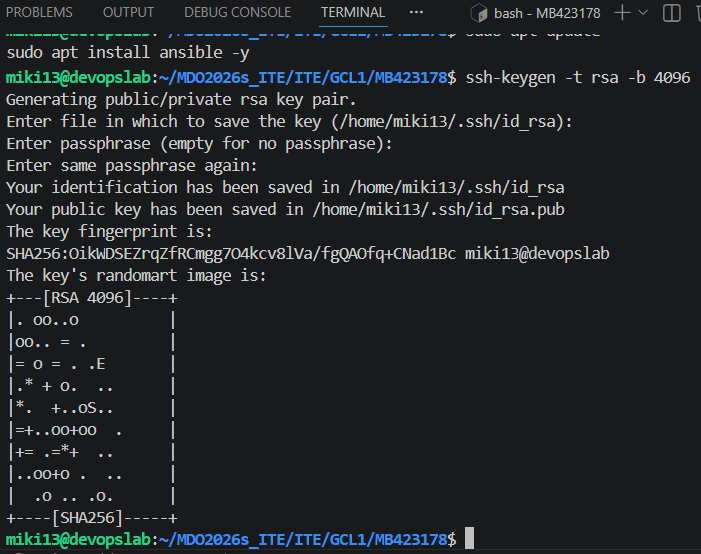

Przesłałem klucz publiczny na maszynę docelową przy pomocy narzędzia `ssh-copy-id`.


Poprawność konfiguracji potwierdziłem logując się po protokole SSH na użytkownika `ansible` bez monitu o hasło. Jest to niezbędny warunek poprawnego działania automatyzacji.
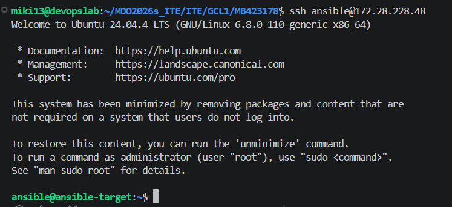

Na maszynie głównej zainstalowałem pakiet `ansible` i zweryfikowałem jego poprawną instalację.
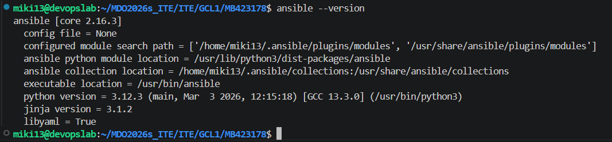

---

## Załączniki: Kod źródłowy

Aby zapewnić pełną odtwarzalność projektu i spełnić wymogi z listy kontrolnej (udostępnienie przepisów w kopiowalnej postaci), poniżej załączam kompletny kod użyty w procesie automatyzacji.

### 1. Skrypt startowy środowiska Jenkins (DIND)
Skrypt użyty do powołania architektury Docker-in-Docker oraz głównego kontenera Jenkins.
```bash
#!/bin/bash
echo "running Dockera (DIND)..."
docker run --name jenkins-docker --rm --detach \
  --privileged --network jenkins --network-alias docker \
  --env DOCKER_TLS_CERTDIR=/certs \
  --volume jenkins-docker-certs:/certs/client \
  --volume jenkins-data:/var/jenkins_home \
  --publish 2376:2376 \
  docker:dind --storage-driver overlay2

echo "waiting 5 seconds for the Docker daemon to start..."
sleep 5

echo "starting Jenkins..."
docker run --name jenkins-blueocean --rm --detach \
  --network jenkins --env DOCKER_HOST=tcp://docker:2376 \
  --env DOCKER_CERT_PATH=/certs/client --env DOCKER_TLS_VERIFY=1 \
  --publish 8080:8080 --publish 50000:50000 \
  --volume jenkins-data:/var/jenkins_home \
  --volume jenkins-docker-certs:/certs/client:ro \
  myjenkins-blueocean:latest

echo "Done! Jenkins is starting. It will be available at http://localhost:8080"
```

### 2. Dockerfile instalujący klienta Dockera wewnątrz Jenkinsa
```dockerfile
FROM jenkins/jenkins:2.541.3-jdk21
USER root
RUN apt-get update && apt-get install -y lsb-release ca-certificates curl && \
    install -m 0755 -d /etc/apt/keyrings && \
    curl -fsSL https://download.docker.com/linux/debian/gpg -o /etc/apt/keyrings/docker.asc && \
    chmod a+r /etc/apt/keyrings/docker.asc && \
    echo "deb [arch=$(dpkg --print-architecture) signed-by=/etc/apt/keyrings/docker.asc] \
    https://download.docker.com/linux/debian $(. /etc/os-release && echo \"$VERSION_CODENAME\") stable" \
    | tee /etc/apt/sources.list.d/docker.list > /dev/null && \
    apt-get update && apt-get install -y docker-ce-cli && \
    apt-get clean && rm -rf /var/lib/apt/lists/*
USER jenkins
RUN jenkins-plugin-cli --plugins "blueocean docker-workflow json-path-api"
```

### 3. Dockerfile.petClinic.deploy (Lekkie środowisko produkcyjne)
Obraz wykorzystywany wyłącznie do wdrażania artefaktu w kroku *Smoke Test*. Nie zawiera kodu źródłowego ani narzędzi budujących.
```dockerfile
FROM eclipse-temurin:17-jre
WORKDIR /app
COPY target/*.jar app.jar
EXPOSE 8080
CMD ["java", "-jar", "app.jar"]
```

### 4. Plik Jenkinsfile (Główny potok CI/CD)
Przepis deklaratywny realizujący kroki od pobrania kodu, przez testy sieciowe w dedykowanej sieci Dockera, aż po generowanie podpisów cyfrowych (OpenSSL) i metadanych.
```groovy
pipeline {
    agent any
    options {
        skipDefaultCheckout()
    }
    stages {
        stage('clean workspace') {
            steps {
                deleteDir()
            }
        }
        stage('clone') {
            steps {
                checkout scm
            }
        }
        stage('build') {
            steps {
                dir('ITE/GCL1/MB423178/Sprawozdanie1') {
                    sh 'docker build --no-cache -t petclinic-build:latest -f Dockerfile.petClinic.build .'
                }
            }
        }
        stage('test') {
            steps {
                dir('ITE/GCL1/MB423178/Sprawozdanie1') {
                    sh 'docker build --no-cache -t petclinic-test:latest -f Dockerfile.petClinic.test .'
                }
                dir('ITE/GCL1/MB423178/Sprawozdanie2') {
                    sh 'docker run --name pt-${BUILD_NUMBER} petclinic-test:latest || true'
                    sh 'docker cp pt-${BUILD_NUMBER}:/app/target ./target'
                    sh 'docker rm pt-${BUILD_NUMBER}'
                }
            }
        }
        stage('deploy') {
            steps {
                dir('ITE/GCL1/MB423178/Sprawozdanie2') {
                    sh 'docker network create petclinic-net-${BUILD_NUMBER} || true'
                    sh 'docker build --no-cache -t petclinic-runtime:${BUILD_NUMBER} -f Dockerfile.petClinic.deploy .'
                    sh 'docker run -d --network petclinic-net-${BUILD_NUMBER} --name petclinic-app-${BUILD_NUMBER} petclinic-runtime:${BUILD_NUMBER}'
                }
            }
        }
        stage('smoke test') {
            steps {
                sh 'sleep 15'
                sh '''
                HTTP_STATUS=$(docker run --rm --network petclinic-net-${BUILD_NUMBER} curlimages/curl -s -o /dev/null -w "%{http_code}" http://petclinic-app-${BUILD_NUMBER}:8080)
                if [ "$HTTP_STATUS" -ne 200 ]; then exit 1; fi
                
                CONTENT=$(docker run --rm --network petclinic-net-${BUILD_NUMBER} curlimages/curl -s http://petclinic-app-${BUILD_NUMBER}:8080)
                echo "$CONTENT" | grep -qi "PetClinic"
                echo "$CONTENT" | grep -qi "Welcome"
                '''
            }
        }
        stage('publish') {
            steps {
                dir('ITE/GCL1/MB423178/Sprawozdanie2') {
                    sh '''
                    openssl genrsa -out private_key.pem 2048
                    openssl dgst -sha256 -sign private_key.pem -out target/app.jar.sig target/*.jar
                    
                    echo "Aplikacja: Spring PetClinic" > target/metadata.txt
                    echo "Build Jenkinsa numer: ${BUILD_NUMBER}" >> target/metadata.txt
                    echo "Data zbudowania: $(date)" >> target/metadata.txt
                    echo "Zabezpieczenie SHA256:" >> target/metadata.txt
                    sha256sum target/*.jar >> target/metadata.txt
                    '''
                    
                    archiveArtifacts artifacts: 'target/*.jar, target/*.sig, target/metadata.txt', fingerprint: true
                    junit 'target/surefire-reports/*.xml'
                }
            }
        }
    }
    post {
        always {
            sh 'docker stop petclinic-app-${BUILD_NUMBER} || true'
            sh 'docker rm petclinic-app-${BUILD_NUMBER} || true'
            sh 'docker network rm petclinic-net-${BUILD_NUMBER} || true'
        }
    }
}
```

## Ważna adnotacja dotycząca użycia AI
Zgodnie z wymaganiami z pliku Rules.md, informuję, że podczas pisania tego sprawozdania wspomagałem się modelem językowym (LLM) jako narzędziem do korekty tekstu oraz rozwiązywania niektórych problemów tehcnicznych.

**Przykładowe prompty użyte podczas pracy nad sprawozdaniem:**
1. *"Sprawdź i popraw błędy składniowe oraz gramatyczne w poniższym tekście mojego sprawozdania."*
2. *"Jak odzyskać initialAdminPassword w Jenkinsie postawionym w kontenerze z opcją --rm, jeśli zapomniałem sprawdzić logi na starcie?"*
3. *"Jakie są główne luki bezpieczeństwa i wady wrzucania kontenera z etapu 'Build' (z pełnym kodem źródłowym i Mavenem) bezpośrednio na środowisko produkcyjne?"*
4. *"Instalator Ubuntu Server zawiesza się w nieskończoność na etapie 'Installing kernel'. Czy to problem z Hyper-V i jak wymusić pominięcie pobierania aktualizacji?"*

5. *"W jaki sposób w Jenkinsfile wymusić czyszczenie workspace'u (komenda deleteDir), aby upewnić się, że pobierany jest zawsze świeży kod z repozytorium?"*

**Metody weryfikacji odpowiedzi:**
Odpowiedzi modelu traktowałem jako wskazówki. Weryfikowałem je na dwa sposoby: po pierwsze, uruchamiając podane komendy w maszynie wirtualnej (co widac na screenach), a po drugie, sprawdzając informacje z oficjalną dokumentacją Dockera i GitHuba.
1. **Weryfikacja praktyczna:** Wszelkie sugestie dotyczące komend powłoki czy konfiguracji środowiska były najpierw analizowane merytorycznie, a następnie uruchamiane ręcznie w wyizolowanym środowisku. Dowodem ich poprawnego działania są uwiecznione logi i zrzuty ekranu.
2. **Sprawdzanie źródeł :** W przypadku zapytań o teorię, wady i zalety architektoniczne oraz prośby o linki, wygenerowane materiały były konfrontowane z oficjalną dokumentacją dostawców technologii. Linki dostarczone przez AI były ręcznie odwiedzane w celu potwierdzenia rzetelności informacji zawartych w sprawozdaniu.