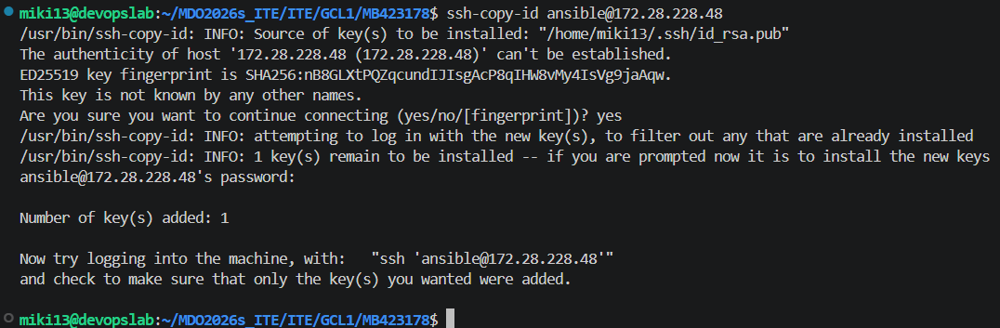
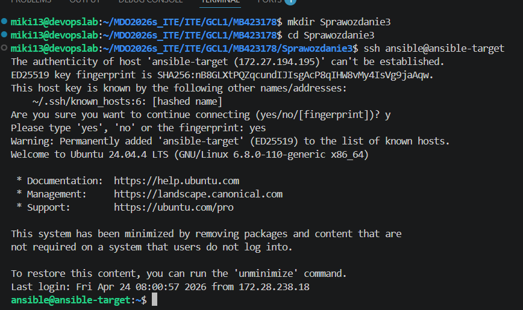
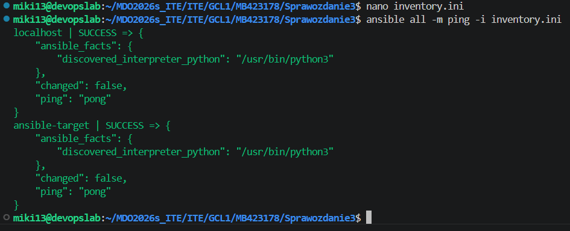

# Sprawozdanie - Metodyki DevOps (Zajęcia 8 - .....)

**Imię i nazwisko:** Mikołaj Bednarczyk  
**Grupa:** Gr 1 , ITE

**Nr indeksu:** 423178  
**Data:** 30.04.2025

---

## Środowisko uruchomieniowe
Wszystkie opisane poniżej kroki zostały wykonane w wyizolowanym środowisku.
* **System operacyjny:** Maszyna wirtualna z systemem Linux (Ubuntu).
* **Metoda dostępu:** Połączenie zdalne za pośrednictwem protokołu SSH (Secure Shell). Cała praca odbywała się na koncie standardowego użytkownika.
* **Narzędzia pracy:** Edytor Visual Studio Code z wtyczką *Remote - SSH*, zapewniający dostęp do terminala oraz zarządzanie plikami.

---

## Lab 8: Automatyzacja i zdalne wykonywanie poleceń za pomocą Ansible

Na poprzednich zajeciach sobie przygotowałem ansible target


Celem zajęć było zapoznanie się z narzędziem Ansible, przeprowadzenie inwentaryzacji systemów oraz automatyzacja zadań konfiguracyjnych i wdrożeniowych na zdalnych maszynach. Pracę oparłem na środowisku przygotowanym w ramach poprzedniego laboratorium (Lab 7), gdzie zainstalowałem pakiet Ansible na maszynie głównej, wykreowałem maszynę docelową o nazwie `ansible-target` oraz wymieniłem klucze SSH, zapewniając bezpieczny dostęp bez konieczności wpisywania hasła.





### 1. Weryfikacja środowiska i aktualizacja adresacji (Specyfika Hyper-V)
Ze względu na specyfikę przydzielania adresów przez wirtualny przełącznik w Hyper-V, po ponownym uruchomieniu środowiska adres IP mojej maszyny docelowej uległ zmianie. Aby móc odwoływać się do maszyny za pomocą nazwy DNS, wyedytowałem plik `/etc/hosts` na głównej maszynie, aktualizując wpis dla hosta `ansible-target`.

Następnie przetestowałem połączenie. Ponieważ system SSH odnotował zmianę adresu IP pod znaną nazwą hosta, poprosił o akceptację nowego odcisku klucza (fingerprint). Po wpisaniu `yes`, zostałem pomyślnie zalogowany do systemu z użyciem klucza wymuszającego brak hasła, co potwierdziło gotowość maszyny do pracy.

```bash
ssh ansible@ansible-target
```



### 2. Inwentaryzacja systemów i test łączności
Kolejnym krokiem było utworzenie pliku inwentaryzacji, dzięki któremu Ansible wie, jakimi maszynami zarządza. W dedykowanym folderze roboczym dla sprawozdania utworzyłem plik inventory.ini za pomocą edytora tekstowego:

```bash
nano inventory.ini
```

Zgodnie z wymaganiami, umieściłem w nim dwie sekcje maszyn. W sekcji Orchestrators zdefiniowałem maszynę lokalną (sterującą), a w sekcji Endpoints wskazałem moją maszynę wirtualną wraz z parametrem określającym dedykowanego użytkownika:

```ini
[Orchestrators]
localhost ansible_connection=local

[Endpoints]
ansible-target ansible_user=ansible
```

Aby zweryfikować poprawność konfiguracji i komunikacji, wysłałem żądanie ping do wszystkich zdefiniowanych w inwentarzu maszyn, wykorzystując wbudowany moduł narzędzia Ansible:

```bash
ansible all -m ping -i inventory.ini
```

Otrzymałem odpowiedź oznaczającą sukces (wartość SUCCESS oraz "ping": "pong") zarówno z maszyny lokalnej, jak i zdalnej, co stanowiło ostateczne potwierdzenie bezproblemowej komunikacji między węzłami.

