# Sprawozdanie - Metodyki DevOps (Zajęcia 8 - .....)

**Imię i nazwisko:** Mikołaj Bednarczyk  
**Grupa:** Gr 1 , ITE

**Nr indeksu:** 423178  
**Data:** .2026

---

## Środowisko uruchomieniowe
Wszystkie opisane poniżej kroki zostały wykonane w wyizolowanym środowisku.
* **System operacyjny:** Maszyna wirtualna z systemem Linux (Ubuntu).
* **Metoda dostępu:** Połączenie zdalne za pośrednictwem protokołu SSH (Secure Shell). Cała praca odbywała się na koncie standardowego użytkownika.
* **Narzędzia pracy:** Edytor Visual Studio Code z wtyczką *Remote - SSH*, zapewniający dostęp do terminala oraz zarządzanie plikami.

---

## Lab 8: Automatyzacja i zdalne wykonywanie poleceń za pomocą Ansible

Na poprzednich zajeciach sobie przygotowałem ansible target


Celem zajęć było zapoznanie się z narzędziem Ansible, przeprowadzenie inwentaryzacji systemów oraz automatyzacja zadań konfiguracyjnych i wdrożeniowych na zdalnych maszynach. Pracę oparłem na środowisku przygotowanym w ramach poprzedniego laboratorium (Lab 7), gdzie zainstalowałem pakiet Ansible na maszynie głównej, wykreowałem maszynę docelową o nazwie `ansible-target` oraz wymieniłem klucze SSH, zapewniając bezpieczny dostęp bez konieczności wpisywania hasła.


### 1. Weryfikacja środowiska i aktualizacja adresacji (Specyfika Hyper-V)
Ze względu na specyfikę przydzielania adresów przez wirtualny przełącznik w Hyper-V, po ponownym uruchomieniu środowiska adres IP mojej maszyny docelowej uległ zmianie. Aby móc odwoływać się do maszyny za pomocą nazwy DNS, wyedytowałem plik `/etc/hosts` na głównej maszynie, aktualizując wpis dla hosta `ansible-target`.

Następnie przetestowałem połączenie. Ponieważ system SSH odnotował zmianę adresu IP pod znaną nazwą hosta, poprosił o akceptację nowego odcisku klucza (fingerprint). Po wpisaniu `yes`, zostałem pomyślnie zalogowany do systemu z użyciem klucza wymuszającego brak hasła, co potwierdziło gotowość maszyny do pracy.

```bash
ssh ansible@ansible-target
```


### 2. Inwentaryzacja systemów i test łączności
Kolejnym krokiem było utworzenie pliku inwentaryzacji, dzięki któremu Ansible wie, jakimi maszynami zarządza. W dedykowanym folderze roboczym dla sprawozdania utworzyłem plik inventory.ini za pomocą edytora tekstowego:

```bash
nano inventory.ini
```

Zgodnie z wymaganiami, umieściłem w nim dwie sekcje maszyn. W sekcji Orchestrators zdefiniowałem maszynę lokalną (sterującą), a w sekcji Endpoints wskazałem moją maszynę wirtualną wraz z parametrem określającym dedykowanego użytkownika:

```ini
[Orchestrators]
localhost ansible_connection=local

[Endpoints]
ansible-target ansible_user=ansible
```

Aby zweryfikować poprawność konfiguracji i komunikacji, wysłałem żądanie ping do wszystkich zdefiniowanych w inwentarzu maszyn, wykorzystując wbudowany moduł narzędzia Ansible:

```bash
ansible all -m ping -i inventory.ini
```

Otrzymałem odpowiedź oznaczającą sukces (wartość SUCCESS oraz "ping": "pong") zarówno z maszyny lokalnej, jak i zdalnej, co stanowiło ostateczne potwierdzenie bezproblemowej komunikacji między węzłami.


### 3. Zdalne wywoływanie procedur (Pierwszy Playbook)
Zgodnie z poleceniem, zamiast wykonywać komendy ręcznie, przygotowałem plik konfiguracyjny (Playbook), realizujący podstawową konfigurację maszyny docelowej. 

Utworzyłem plik `setup-system.yml` i zdefiniowałem w nim zadania (tasks) polegające na: wysłaniu testowego pingu, skopiowaniu pliku inwentaryzacji na serwer, zaktualizowaniu pakietów menedżerem APT oraz restarcie wymaganych usług (`sshd` oraz `rngd`).

**Uwaga dotycząca bezpieczeństwa:**
Zadbałem o to, aby w plikach konfiguracyjnych nie znalazły się żadne zapisane czystym tekstem hasła. Zamiast tego, przy uruchamianiu playbooka korzystam z flagi `--ask-become-pass`, która interaktywnie prosi o hasło do podniesienia uprawnień (`sudo`) na zdalnej maszynie na czas działania skryptu.

Kod playbooka `setup-system.yml`:

```yaml
---
- name: Podstawowa konfiguracja maszyn
  hosts: Endpoints
  become: yes
  tasks:
    - name: 1. Skopiowanie pliku inwentaryzacji
      ansible.builtin.copy:
        src: inventory.ini
        dest: /tmp/inventory.ini

    - name: 2. Aktualizacja pakietow systemowych
      ansible.builtin.apt:
        update_cache: yes
        upgrade: dist

    - name: 3. Instalacja rng-tools-debian (wymagane dla usługi rngd)
      ansible.builtin.apt:
        name: rng-tools-debian
        state: present

    - name: 4. Restart uslug sshd i rngd
      ansible.builtin.systemd:
        name: "{{ item }}"
        state: restarted
      loop:
        - ssh
        - rng-tools-debian
```

Uruchomiłem skrypt poleceniem:

```bash
ansible-playbook -i inventory.ini setup-system.yml --ask-become-pass
```

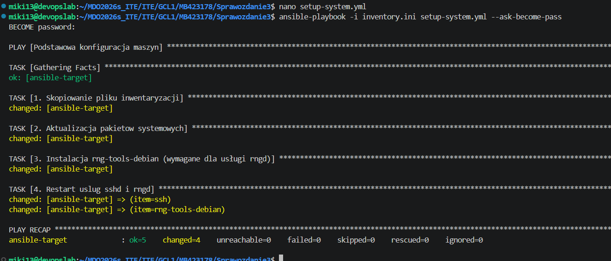

Po pomyślnym wykonaniu operacji (statusy ok i changed), przeprowadziłem wymagany test awarii. W menedżerze Hyper-V odłączyłem wirtualną kartę sieciową maszyny `ansible-target` i uruchomiłem Playbook ponownie.

Zgodnie z oczekiwaniami, narzędzie nie mogło nawiązać połączenia po protokole SSH i poprawnie zgłosiło błąd UNREACHABLE. Po teście przywróciłem połączenie sieciowe.

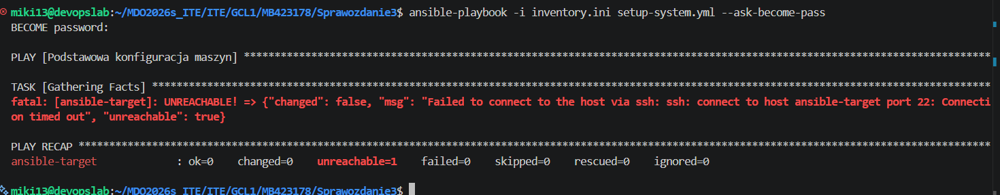

### 4. Zarządzanie stworzonym artefaktem (Wdrożenie aplikacji)
W kolejnym kroku zautomatyzowałem proces wdrożenia aplikacji z wykorzystaniem wygenerowanego na poprzednich laboratoriach pliku binarnego `spring-petclinic.jar`. Zgodnie z dobrymi praktykami CI/CD, nie kompilowałem aplikacji na serwerze docelowym, lecz pobrałem gotowy artefakt z serwera Jenkins i umieściłem go w katalogu roboczym obok playbooków.

Przygotowałem plik `deploy-app.yml`, który instaluje Dockera, kopiuje plik JAR, uruchamia go w kontenerze JRE, przeprowadza test dostępności usługi (Smoke Test) i czyści środowisko docelowe z wdrożonej aplikacji.

**Rozwiązanie problemów napotkanych podczas wdrożenia:**
Podczas pierwszego uruchomienia skryptu, playbook zakończył się niepowodzeniem na etapie kroku nr 7 (Smoke Test). Zdefiniowany warunek sprawdzał obecność dokładnej frazy "Welcome to Petclinic" w pobranym kodzie strony. Kod HTML serwowany przez aplikację zawierał jednak te słowa w osobnych znacznikach (nagłówek `<h2>Welcome</h2>` oraz tytuł `<title>PetClinic...</title>`). Ansible słusznie uznał test za niezaliczony i zatrzymał wykonanie skryptu.

Z uwagi na przerwanie skryptu, krok 8 (usuwający kontener) nie został wywołany. Zanim zaktualizowałem Playbook, musiałem ręcznie oczyścić maszynę ze zablokowanego kontenera. Wykorzystałem do tego komendę ad-hoc w Ansible:

```bash
ansible Endpoints -i inventory.ini -m shell -a "docker rm -f petclinic-prod" -b --ask-become-pass
```

Następnie zaktualizowałem Playbook, modyfikując warunek `failed_when` przy użyciu operatora `or`, tak aby weryfikował obecność słów niezależnie od siebie:

```yaml
---
- name: Wdrozenie aplikacji PetClinic w kontenerze JRE
  hosts: Endpoints
  become: yes
  tasks:
    - name: 1. Sanity check - czy maszyna odpowiada przed wdrozeniem
      ansible.builtin.ping:
      ignore_unreachable: yes

    - name: 2. Instalacja Dockera za pomoca Ansible
      ansible.builtin.apt:
        name: docker.io
        state: present
        update_cache: yes

    - name: 3. Utworzenie katalogu na aplikacje
      ansible.builtin.file:
        path: /opt/petclinic
        state: directory
        mode: '0755'

    - name: 4. Wyslanie pliku binarnego (JAR) na zdalna maszyne
      ansible.builtin.copy:
        src: spring-petclinic.jar
        dest: /opt/petclinic/spring-petclinic.jar

    - name: 5. Uruchomienie aplikacji w kontenerze JRE
      ansible.builtin.shell: |
        docker run -d --name petclinic-prod -p 8080:8080 \
        -v /opt/petclinic/spring-petclinic.jar:/app.jar \
        eclipse-temurin:17-jre java -jar /app.jar

    - name: 6. Oczekiwanie na uruchomienie serwera aplikacji
      ansible.builtin.pause:
        seconds: 35

    - name: 7. Weryfikacja (Smoke Test) czy serwer odpowiada
      ansible.builtin.uri:
        url: http://localhost:8080
        return_content: yes
      register: webpage
      failed_when: "'Welcome' not in webpage.content or 'PetClinic' not in webpage.content"

    - name: 8. Oczyszczenie srodowiska (zatrzymanie i usuniecie kontenera)
      ansible.builtin.shell: |
        docker stop petclinic-prod
        docker rm petclinic-prod
```

Po poprawkach, wdrożenie zainicjowane poniższym poleceniem wykonało się w pełni poprawnie (widoczny na zrzucie ekranu zielony status operacji):

```bash
ansible-playbook -i inventory.ini deploy-app.yml --ask-become-pass
```

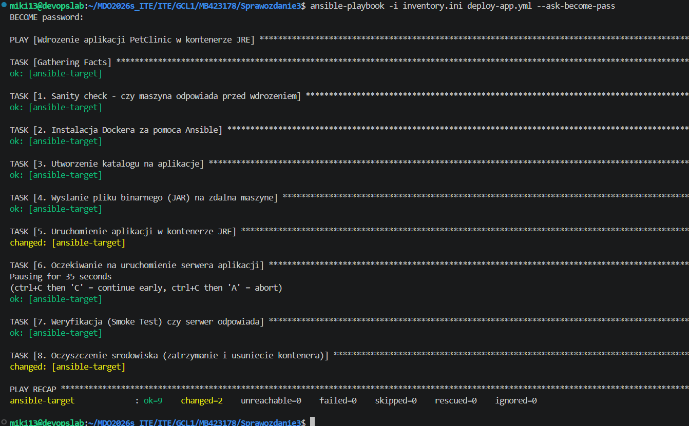

### 5. Ubieranie logiki w Role (Ansible Galaxy)
Ostatnim etapem była refaktoryzacja kodu. Zamiast przechowywać wszystkie instrukcje w jednym płaskim pliku YAML, użyłem narzędzia szablonowania, aby przekształcić projekt w ustandaryzowaną rolę konfiguracyjną (Role).

Wygenerowałem szkielet katalogów komendą:

```bash
ansible-galaxy role init deploy_petclinic
```

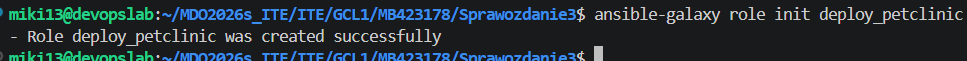

Zadania skryptu wdrażającego przeniosłem bezpośrednio do wygenerowanego pliku `deploy_petclinic/tasks/main.yml`, oddzielając je od deklaracji hostów i uprawnień. Zaktualizowałem również metadane w pliku `deploy_petclinic/meta/main.yml`, definiując siebie jako autora oraz opisując cel roli. Wygenerowana w ten sposób struktura prezentuje się następująco:

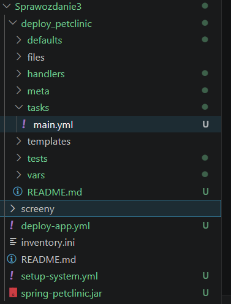

Na zakończenie laboratoriów, stworzone artefakty i zaktualizowaną dokumentację umieściłem w repozytorium.

## Lab 9: Pliki odpowiedzi dla wdrożeń nienadzorowanych (Kickstart)

Celem ostatniego zadania było przygotowanie w pełni zautomatyzowanej instalacji nienadzorowanej (Zero-touch) systemu Fedora z wykorzystaniem technologii Kickstart oraz podejścia Infrastructure as Code (IaC).

### 1. Pierwsza próba: Użycie surowego pliku anaconda-ks.cfg
Rozpocząłem od zainstalowania "wzorcowej" maszyny wirtualnej UEFI z wykorzystaniem obrazu sieciowego *Everything Netinst*. Następnie pobrałem z niej automatycznie wygenerowany plik odpowiedzi `/root/anaconda-ks.cfg`. 

Na początku spróbowałem zainstalować kolejną maszynę używając tego pliku bazowego bez żadnych modyfikacji. Próba ta zakończyła się niepowodzeniem i obnażyła następujące problemy:
* **Konieczność interakcji:** Instalator wstrzymał pracę, domagając się ręcznego zatwierdzenia formatowania używanego dysku, co uniemożliwiało reinstalację "w kółko".
* **Brak pakietów:** Wersja *Netinst* bez zdefiniowanych zewnętrznych repozytoriów w pliku odpowiedzi nie potrafiła odnaleźć źródła plików instalacyjnych.
* **Brak automatyzacji po instalacji:** Maszyna zatrzymała się na ekranie końcowym (brak automatycznego restartu), a sam system nie posiadał narzędzi (Dockera, `wget`) potrzebnych do uruchomienia naszej aplikacji.

### 2. Modyfikacja pliku odpowiedzi i udana instalacja nienadzorowana
Aby rozwiązać powyższe problemy i zrealizować założenia projektu, zmodyfikowałem plik `ks.cfg`:
* Dodałem dyrektywy `url` i `repo` wskazujące na oficjalne repozytoria Fedory 44.
* Wymusiłem bezwarunkowe formatowanie dysku (`zerombr`, `clearpart --all --initlabel`), co pozwala na bezdotykową reinstalację.
* Skonfigurowałem nazwy hosta (`fedora-petclinic`), użytkownika z uprawnieniami administratora oraz wymusiłem zautomatyzowany restart (`reboot`) po zakończeniu procesu.
* Dodałem w sekcji `%packages` pakiety wymagane dla kontenerów (m.in. `moby-engine`).
* **Skrypt poinstalacyjny:** W sekcji `%post` dodałem logikę odpowiedzialną za wdrożenie aplikacji. Skrypt pobiera z udostępnionego przeze mnie lokalnego serwera HTTP zbudowany wcześniej plik JAR i za pomocą usługi `systemd` gwarantuje jego uruchomienie w kontenerze JRE natychmiast po pierwszym uruchomieniu systemu.

Dzięki tym poprawkom, kolejna instalacja nowej maszyny przebiegła w pełni bezobsługowo. Instalator pobrał konfigurację po dodaniu parametru `inst.ks=http://...` w menu GRUB i nie zadał ani jednego pytania.

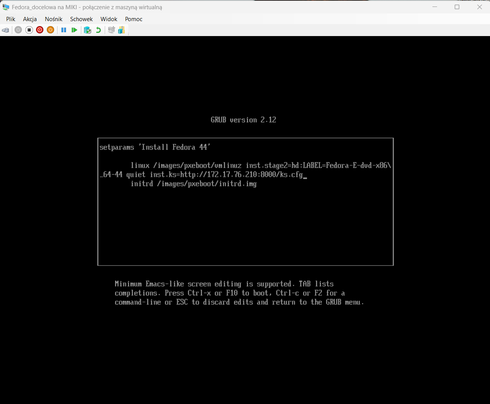

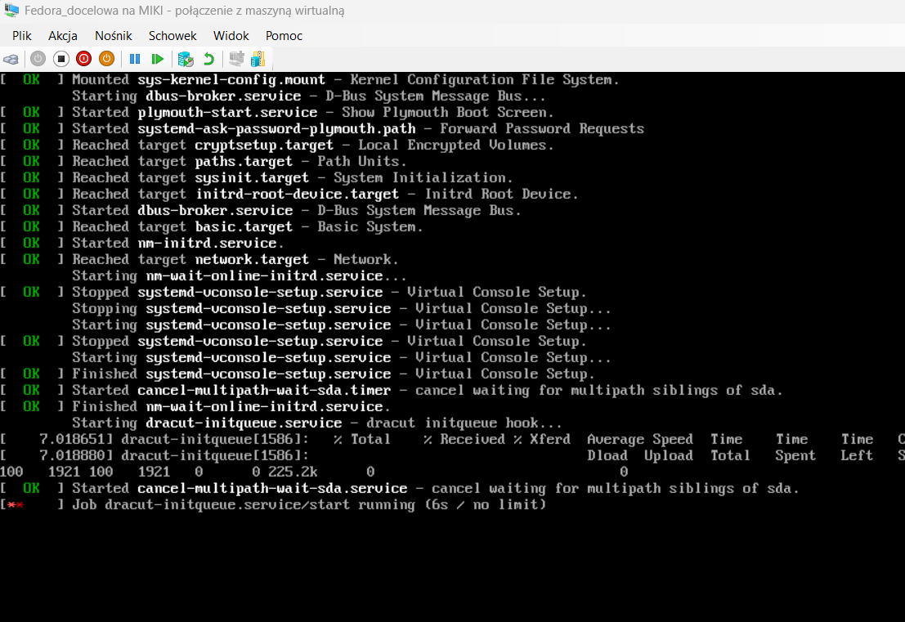

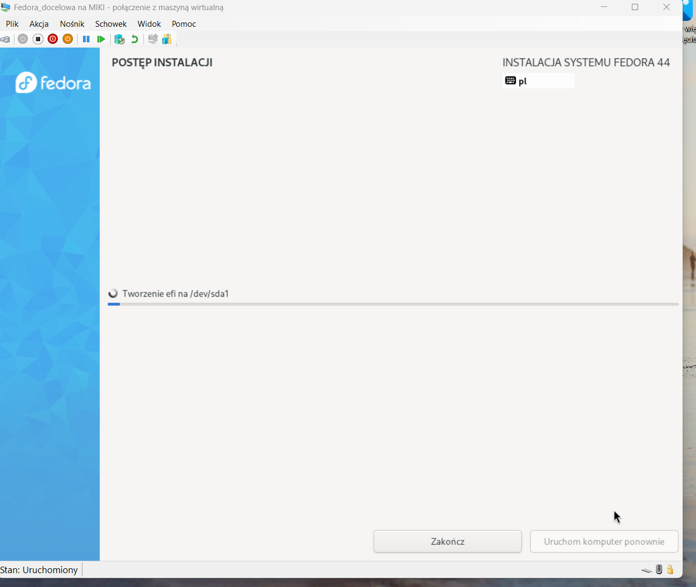

### 3. Weryfikacja działania wdrożonego oprogramowania
Po zautomatyzowanym restarcie systemu zalogowałem się na stworzone konto użytkownika i zweryfikowałem, czy skrypt `%post` wykonał swoje zadanie. Sprawdzenie statusu Dockera poleceniem `sudo docker ps` potwierdziło, że usługa poprawnie uruchomiła środowisko kontenerowe z naszą aplikacją:

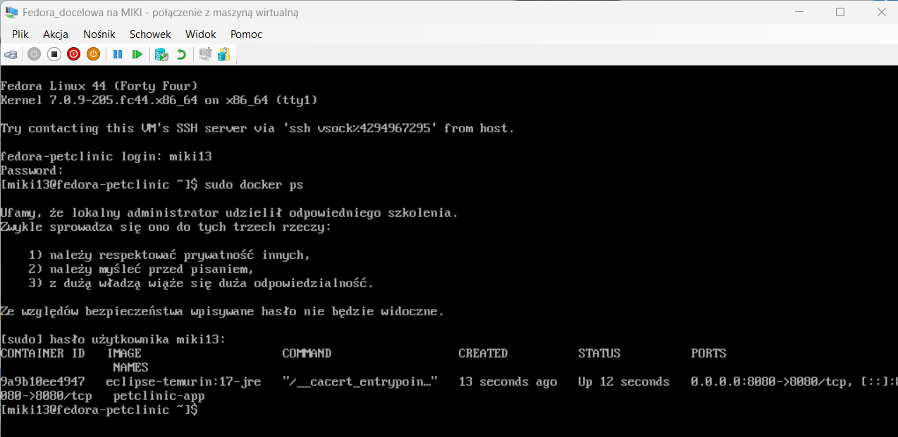

Następnie przetestowałem odpowiedź serwera narzędziem `curl`. Aplikacja prawidłowo i natychmiastowo obsłużyła żądanie sieciowe (status `HTTP/1.1 200 OK`), udowadniając sukces pełnej automatyzacji.

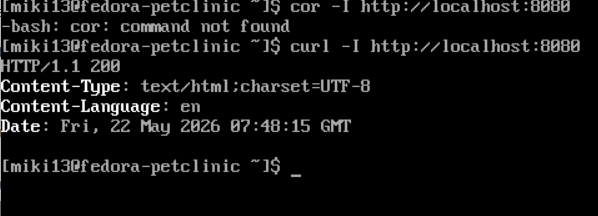


# Sprawozdanie: Laboratorium 10 - Wdrażanie na zarządzalne kontenery (Kubernetes cz. 1)

**Autor:** MB423178

## 1. Przygotowanie obrazów (Docker Hub)
W pierwszej części laboratorium odpowiednio zmodyfikowano plik `Dockerfile` aplikacji PetClinic. Zbudowano i wypchnięto do repozytorium na Docker Hubie trzy wersje obrazu (tagi: `v1`, `v2` oraz `broken`). Wersja `broken` została intencjonalnie uszkodzona poprzez podmianę pliku JAR na nieprawidłowy plik tekstowy, co posłużyło do późniejszych testów aktualizacji klastra.

## 2. Konfiguracja klastra i wdrożenie manualne
Uruchomiono lokalny klaster Kubernetes przy użyciu narzędzia Minikube z wykorzystaniem sterownika Dockera (`--driver=docker`). 
Zarządzanie klastrem zweryfikowano poprzez uruchomienie wbudowanego interfejsu graficznego (Kubernetes Dashboard) z wykorzystaniem polecenia `kubectl proxy`.
Aplikację wdrożono początkowo w sposób imperatywny (manualny pod `petclinic-manual`), po czym przetestowano bezpośredni dostęp do niej z poziomu przeglądarki używając mechanizmu przekierowania portów (Port Forwarding).

## 3. Przekucie wdrożenia w plik YAML (Infrastructure as Code)
Po usunięciu ręcznie wdrożonego Poda, zdefiniowano konfigurację środowiska w pliku deklaratywnym `deploy-kubernetes-app.yml`. 
Plik zawierał konfigurację dwóch zasobów:
* **Deployment:** zarządzający pożądanym stanem aplikacji (ustalono 4 repliki).
* **Service (NodePort):** udostępniający aplikację na zewnątrz oraz pełniący rolę load balancera pomiędzy replikami.
Poprawność wdrożenia zweryfikowano poleceniem `kubectl rollout status` oraz w podglądzie w Dashboardzie.

## 4. Skalowanie i mechanizm aktualizacji (Rolling Updates)
Wdrożenie przetestowano pod kątem elastyczności i niezawodności operacyjnej:
1.  **Skalowanie:** Użyto polecenia `kubectl scale`, by z powodzeniem zmienić liczbę działających replik z 4 do 8, następnie do 1, 0, i z powrotem do 4.
2.  **Aktualizacja wersji:** Podmieniono w locie obraz wdrożenia na `v2` poleceniem `kubectl set image`. 
3.  **Obsługa awarii i Rollback:** Spróbowano wdrożyć uszkodzony obraz `broken`. Kubernetes poprawnie zidentyfikował problem z uruchomieniem kontenera, nałożył na uszkodzone pody status `CrashLoopBackOff` i wstrzymał dalszą aktualizację, co ochroniło aplikację przed całkowitą awarią. Następnie wykonano udany rollback (`kubectl rollout undo`) do w pełni stabilnej i działającej wersji.

## 5. Strategie wdrożenia
Na koniec przetestowano i porównano metody wdrażania aktualizacji:
* **Rolling Update (Domyślna):** W tej strategii nowe pody są uruchamiane równolegle z wyłączaniem starych, co zapewnia brak przerw w dostępie do usługi (Zero-Downtime Deployment).
* **Recreate:** Po dodaniu parametrów strategii `Recreate` do pliku YAML zaobserwowano, że Kubernetes podczas modyfikacji wersji najpierw bezwzględnie zatrzymuje i usuwa wszystkie dotychczasowe pody, a dopiero potem podnosi nowe. Strategia ta generuje krótkotrwałą niedostępność usługi, ale wyklucza sytuację jednoczesnego działania dwóch różnych wersji aplikacji.


# Sprawozdanie: Laboratorium 11 - Wdrażanie na zarządzalne kontenery (Kubernetes cz. 2)

**Autor:** MB423178

## 1. Wdrożenie web-serwera za pomocą Deploymentu (YAML)
Zgodnie z instrukcją, przygotowano plik konfiguracyjny `lab11-petclinic-deployment.yml` w oparciu o obraz z poprzednich zajęć (`13miki/petclinic:v1`). Aplikacja została wdrożona w dużej liczbie replik. 

Początkowo klaster podjął próbę uruchomienia 36 podów, co z racji wysokiego zapotrzebowania aplikacji Spring Boot na zasoby (RAM), doprowadziło do testu granic wydajności środowiska Minikube. 
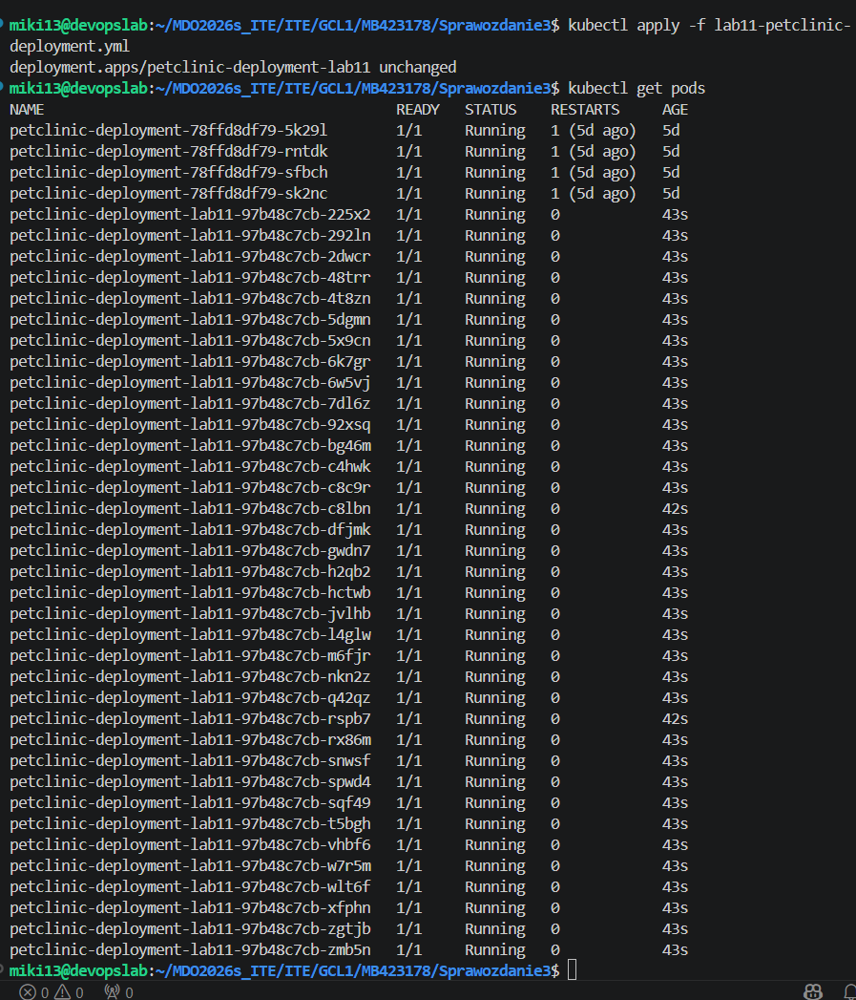

## 2. Eksponowanie dostępu do aplikacji
Przeprowadzono serię wdrożeń udowadniających możliwość zestawienia komunikacji z aplikacją na trzech różnych warstwach architektury Kubernetes za pomocą mechanizmu `port-forward`.

* **Eksponowanie pojedynczego poda:** Ruch z portu lokalnego `8080` skierowano bezpośrednio do instancji kontenera.
* **Eksponowanie do Deploymentu:** Ruch z portu lokalnego `8081` skierowano do kontrolera wdrożenia.
* **Eksponowanie do Serwisu (CLI & YAML):** Utworzono Serwisy typu `LoadBalancer`. Pierwszy za pomocą polecenia `kubectl expose` (udostępniony na porcie lokalnym `8082`), a drugi deklaratywnie za pomocą przygotowanego pliku `lab11-petclinic-service.yml` (udostępniony na porcie lokalnym `8083`).

Działanie równoległego przekierowania portów:
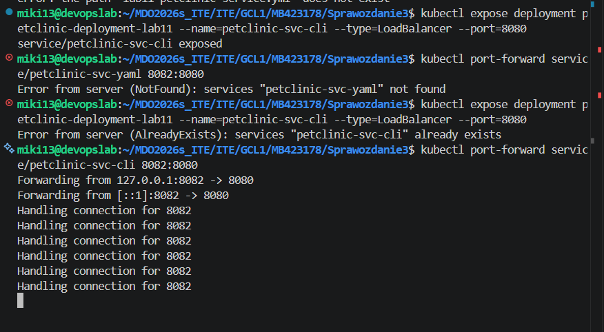
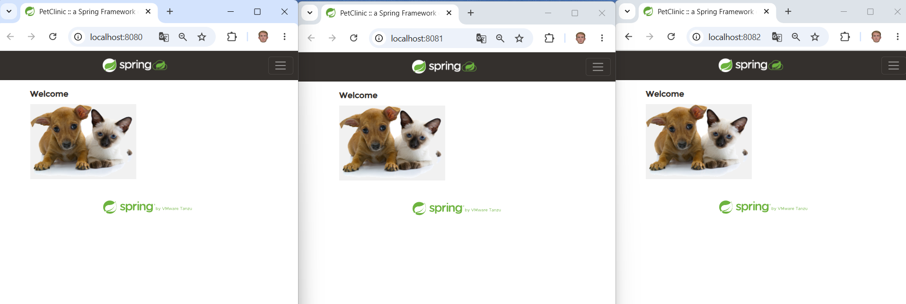
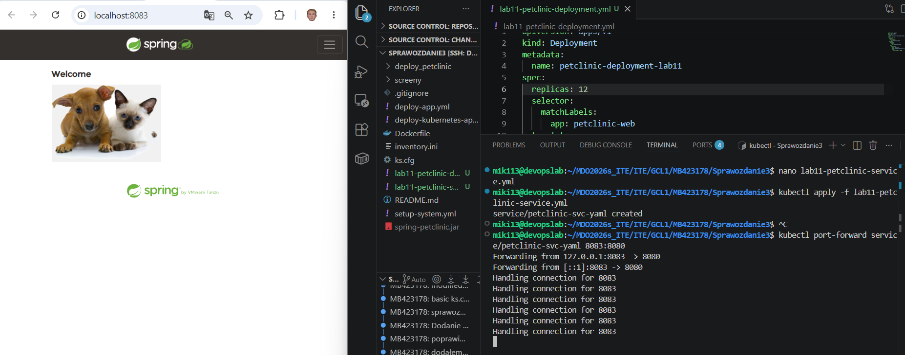

## 3. Skalowanie wdrożenia
Aby zweryfikować elastyczność klastra oraz odciążyć węzeł, zmniejszono i zwiększono liczbę replik na dwa zalecone sposoby:
1.  **Za pomocą dyrektywy z linii poleceń:** Użycie `kubectl scale deployment ... --replicas=6` wymusiło natychmiastowe usunięcie nadmiarowych podów.
    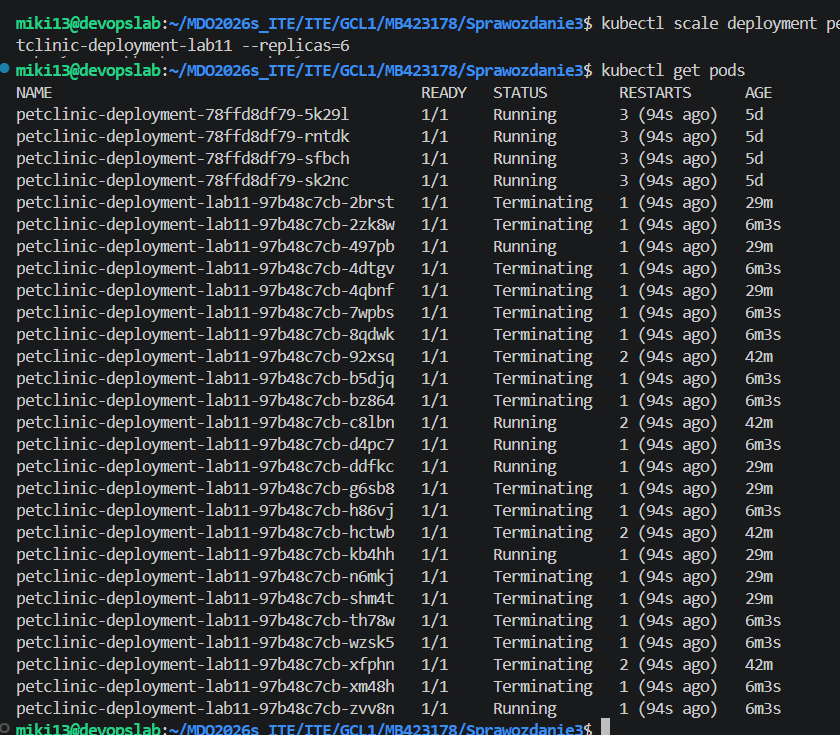
2.  **Za pomocą modyfikacji pliku YAML:** Zmodyfikowano wartość `replicas: 8` w pliku deklaratywnym i wdrożono zmiany poleceniem `kubectl apply`. Klaster dostosował pożądany stan, uruchamiając brakujące kontenery.
    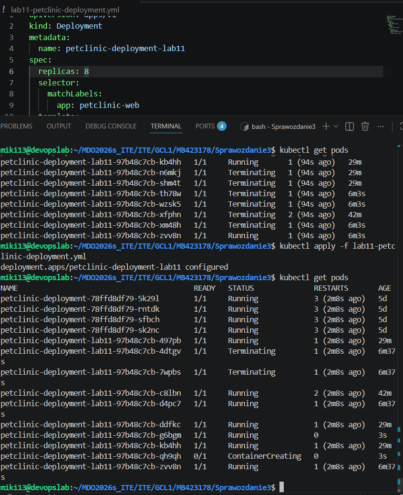

## 4. Zadanie z Bonusem: Weryfikacja działania LoadBalancera
Ostatnim etapem było udowodnienie mechanizmu działania Serwisu. Po przekierowaniu ruchu wygenerowano zapytania HTTP do aplikacji. Za pomocą polecenia `kubectl logs -l app=petclinic-web -f --max-log-requests=10` nasłuchiwano logów ze wszystkich działających replik jednocześnie.

Zgodnie z przewidywaniami, logi potwierdziły, że żądania przesyłane do głównego Serwisu są naprzemiennie rozdzielane pomiędzy różnymi instancjami aplikacji (podami), realizując tym samym funkcję równoważenia obciążenia (Load Balancing).
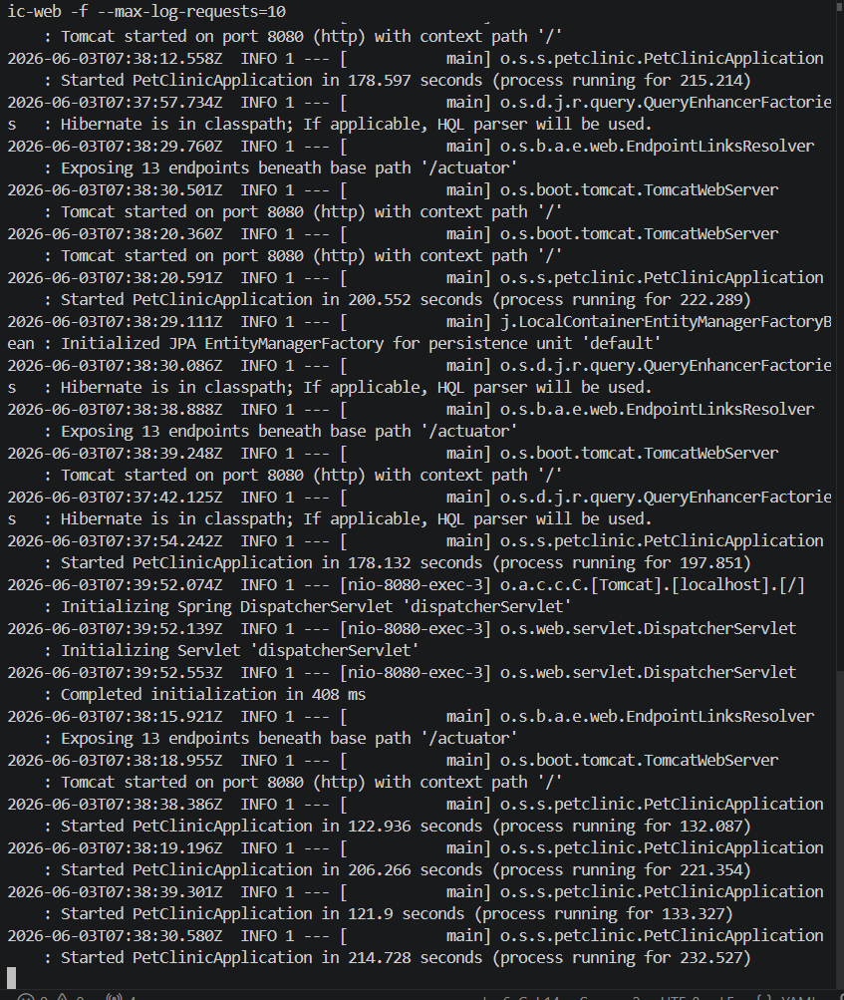

## 5. Troubleshooting (Rozwiązywanie problemów)
W trakcie trwania laboratorium środowisko deweloperskie uległo całkowitemu wyczerpaniu zasobów pamięci (Out of Memory). Spowodowało to brak odpowiedzi API Servera (`TLS handshake timeout`) oraz błędy zestawiania połączeń do portów (`Connection refused`), wynikające ze wstrzymania inicjalizacji procesów Javy. Konieczny był restart wirtualnej maszyny z węzłem Kubernetes.
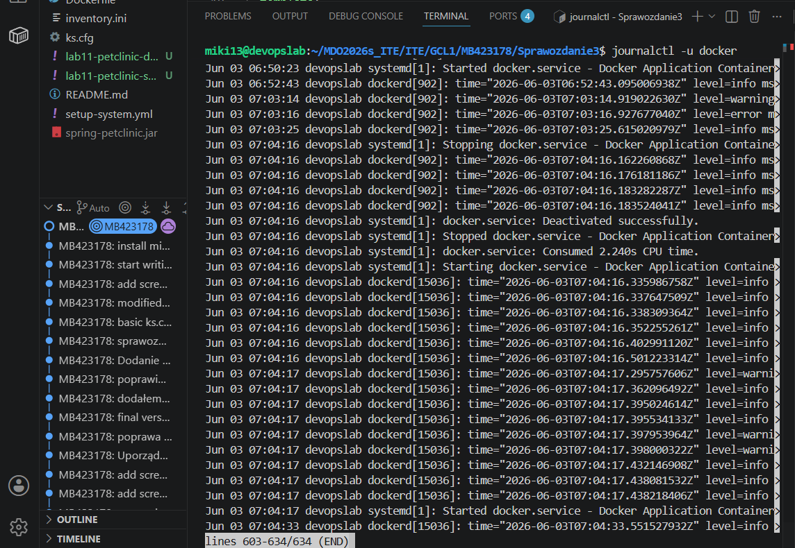
Powyższe problemy posłużyły jako studium przypadku do diagnostyki stanu aplikacji za pomocą kolumny statusu oraz analizy logów startowych podów, po czym środowisko pomyślnie ustabilizowano do założonego w poleceniu stanu (4-8 stabilnych replik).