# Laboratorium 1
## 1. Implementacja Githooka (commit-msg)

W ramach zadania przygotowałem skrypt typu `githook`, który wymusza określoną strukturę wiadomości commita. Każdy commit musi zaczynać się od identyfikatora `MD419430`.

### Kod skryptu:
```bash
#!/bin/bash

message=$(cat "$1")

pattern="^MD419430"

if [[ ! $message =~ $pattern ]]; then
    echo "Błąd: commit message musi zaczynać się od MD419430"
    exit 1
fi

```
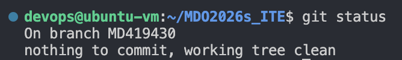
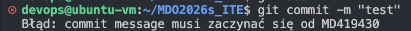 

# Laboratorium 2

## 1. Zestawienie środowiska Docker

### Cel
Celem zadania była instalacja silnika Docker w systemie Linux przy użyciu natywnych pakietów dystrybucyjnych oraz weryfikacja poprawności działania usługi.

------------------------------------------------------------------------

### Krok 1. Instalacja oprogramowania
Zainstalowano pakiet `docker.io` z oficjalnych repozytoriów dystrybucji Ubuntu, unikając rozwiązań typu Snap/Flatpak.

```bash
sudo apt update
sudo apt install docker.io
```
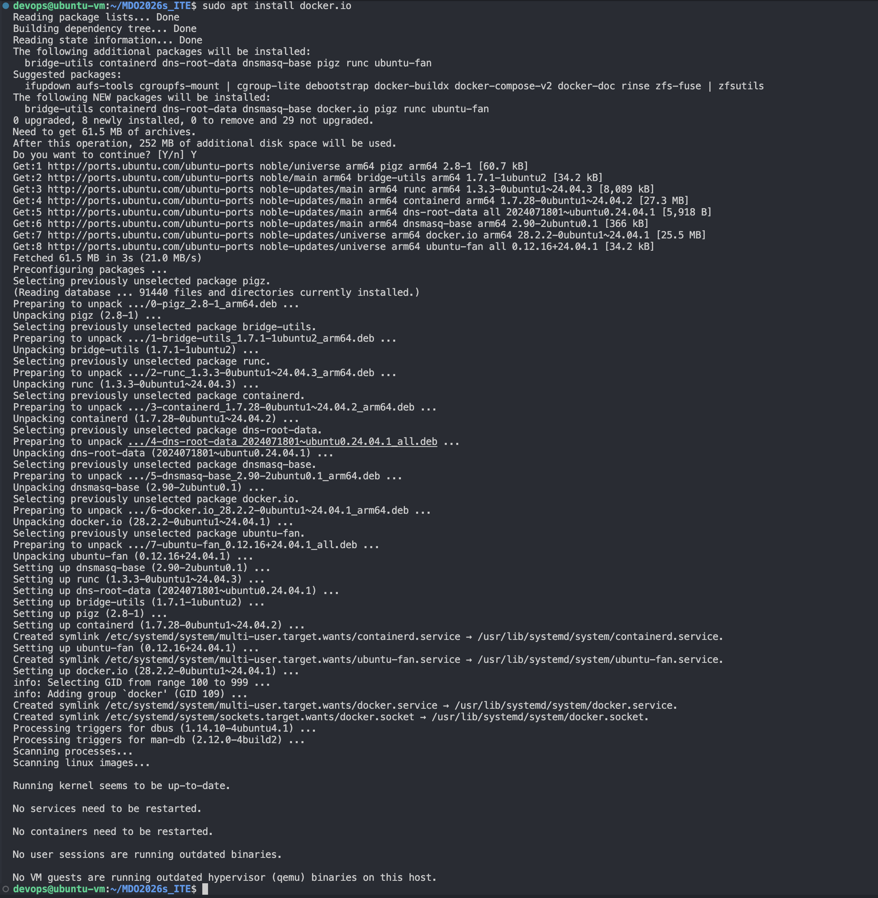

### Krok 2. Weryfikacja statusu i wersji
Sprawdzono wersję zainstalowanego narzędzia oraz upewniono się, że demon Dockera pracuje poprawnie w systemie.

```bash
docker --version
```

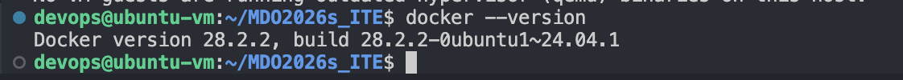

```bash
sudo systemctl status docker
```

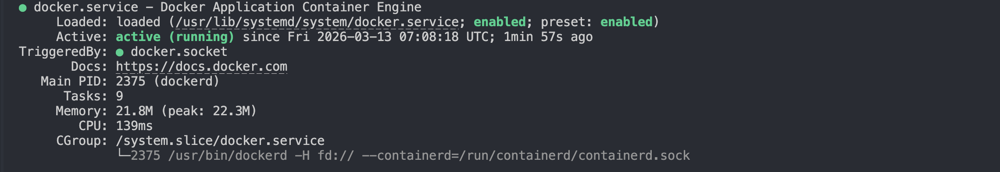

------------------------------------------------------------------------

## 2. Zarządzanie obrazami i testy uruchomieniowe

### Cel
Pobranie sugerowanych obrazów z Docker Hub, analiza ich rozmiarów oraz weryfikacja mechanizmu "pull-and-run".

------------------------------------------------------------------------

### Krok 1. Przegląd obrazów lokalnych
Pobrano szereg obrazów (m.in. `node`, `ubuntu`, `fedora`, `.NET`) i wyświetlono ich listę wraz z rozmiarami.

```bash
docker images
```
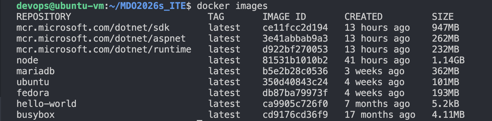

### Krok 2. Test Hello-World
Uruchomiono kontener testowy w celu weryfikacji łączności z Docker Hub i poprawnego generowania strumienia wyjściowego.

```bash
docker run hello-world
```
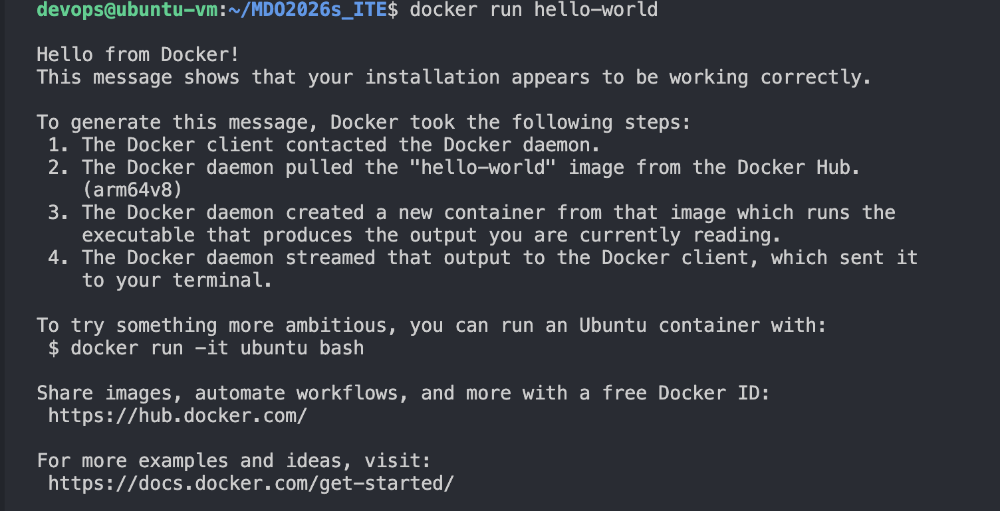

------------------------------------------------------------------------

## 3. Praca interaktywna i izolacja procesów

### Cel
Badanie izolacji kontenera poprzez analizę procesów systemowych oraz modyfikację środowiska wewnątrz kontenera.

------------------------------------------------------------------------

### Krok 1. Kontener Busybox
Uruchomiono lekki kontener w trybie interaktywnym, aby zapoznać się z dostępnymi narzędziami systemowymi.

```bash
docker run -it busybox sh
```
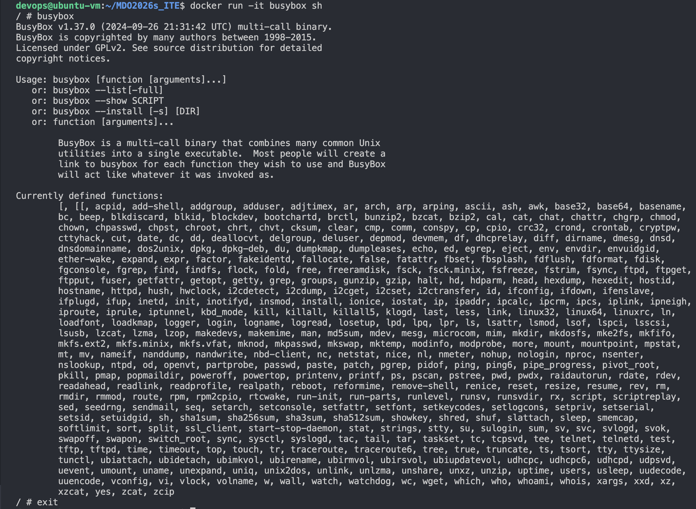

### Krok 2. Analiza PID 1 (Ubuntu)
Uruchomiono system Ubuntu w kontenerze i zweryfikowano, że proces `bash` posiada identyfikator PID 1, co dowodzi izolacji od procesów hosta.

```bash
docker run -it ubuntu bash
ps -p 1
```
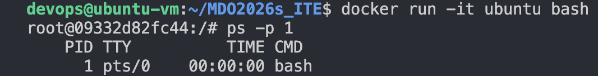

### Krok 3. Aktualizacja systemu wewnątrz kontenera
Przeprowadzono aktualizację pakietów w kontenerze, sprawdzając odizolowanie systemu plików.

```bash
apt update 
apt upgrade
```
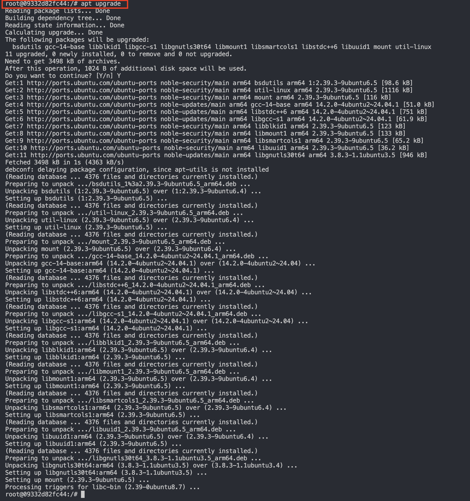

------------------------------------------------------------------------

## 4. Własna definicja obrazu (Dockerfile)

### Cel
Przygotowanie autorskiego obrazu zawierającego narzędzie Git oraz automatycznie sklonowane repozytorium projektu.

------------------------------------------------------------------------

### Krok 1. Budowa i weryfikacja
Zbudowano obraz na podstawie przygotowanego pliku `Dockerfile`, a następnie sprawdzono obecność sklonowanych plików repozytorium.

```bash
docker build -t devops-lab-image .
docker run -it devops-lab-image bash
# ls wewnątrz kontenera
```
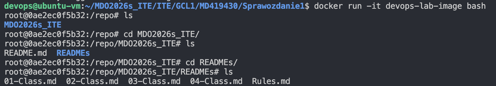

------------------------------------------------------------------------

## 5. Porządkowanie zasobów

### Cel
Zwolnienie zasobów dyskowych poprzez usunięcie zatrzymanych kontenerów oraz nieużywanych warstw obrazów.

------------------------------------------------------------------------

### Krok 1. Lista wszystkich kontenerów
Wyświetlono kontenery, które zakończyły pracę, przed ich ostatecznym usunięciem.

```bash
docker ps -a
```
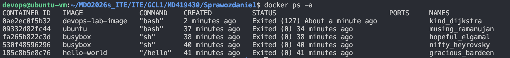

### Krok 2. Czyszczenie (Pruning)
Wykonano komendy czyszczące magazyn lokalny Dockera.

```bash
docker image prune -a
```
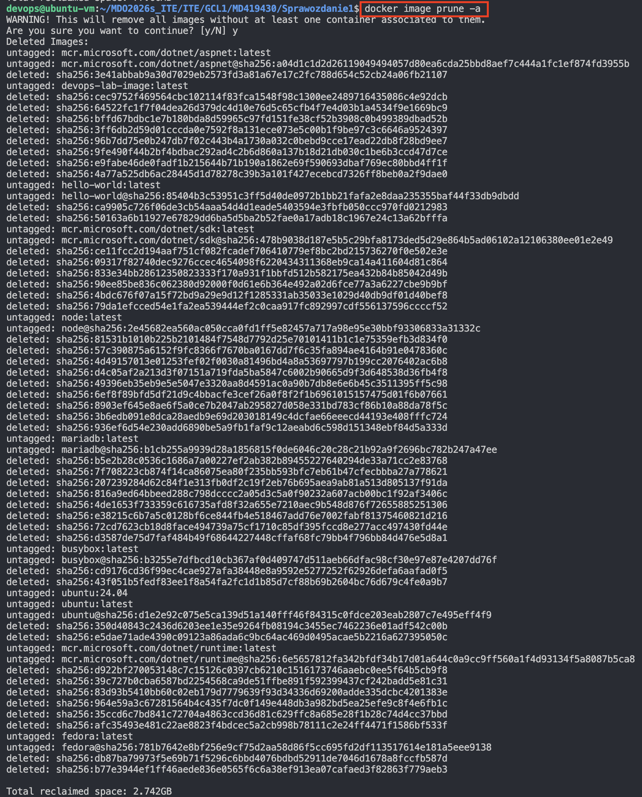

```bash
docker container prune
```
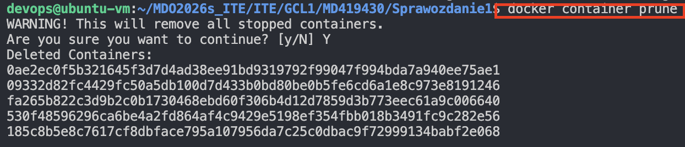

------------------------------------------------------------------------

## Wnioski

* **Środowisko:** Docker pozwala na błyskawiczne zestawienie różnorodnych systemów operacyjnych (Ubuntu, Fedora) bez narzutu typowego dla pełnej wirtualizacji.
* **Izolacja:** Procesy wewnątrz kontenera są odseparowane od hosta, co potwierdza analiza PID 1.
* **Dockerfile:** Wykorzystanie własnych definicji pozwala na pełną automatyzację przygotowania środowiska pracy (np. instalacja gita i pobranie kodu).
* **Zarządzanie:** Regularne czyszczenie obrazów i kontenerów jest niezbędne do zachowania porządku w systemie deweloperskim.

# Laboratorium 3

## 1. Wybór oprogramowania i przygotowanie środowiska

### Cel
Celem zadania był wybór repozytorium z otwartą licencją, posiadającego zdefiniowane skrypty budowania oraz testowania, a następnie weryfikacja jego działania w systemie operacyjnym hosta.

------------------------------------------------------------------------

### Krok 1. Wybór projektu
Wybrano oficjalne repozytorium startowe frameworka **NestJS**, które spełnia wymagania dotyczące licencji (MIT) oraz posiada predefiniowane skrypty w pliku `package.json`.

```bash
# Klonowanie projektu
git clone --depth 1 https://github.com/nestjs/typescript-starter.git nestjs-app
```
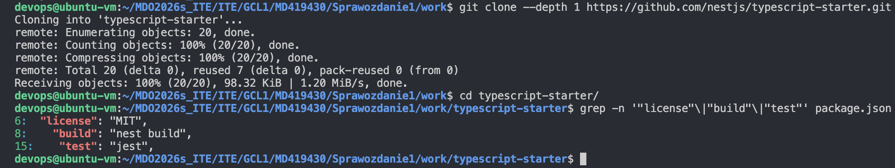 

------------------------------------------------------------------------

### Krok 2. Budowanie aplikacji (Host)
Zainstalowano zależności oraz przeprowadzono proces kompilacji TypeScript do JavaScript.

```bash
npm ci
```
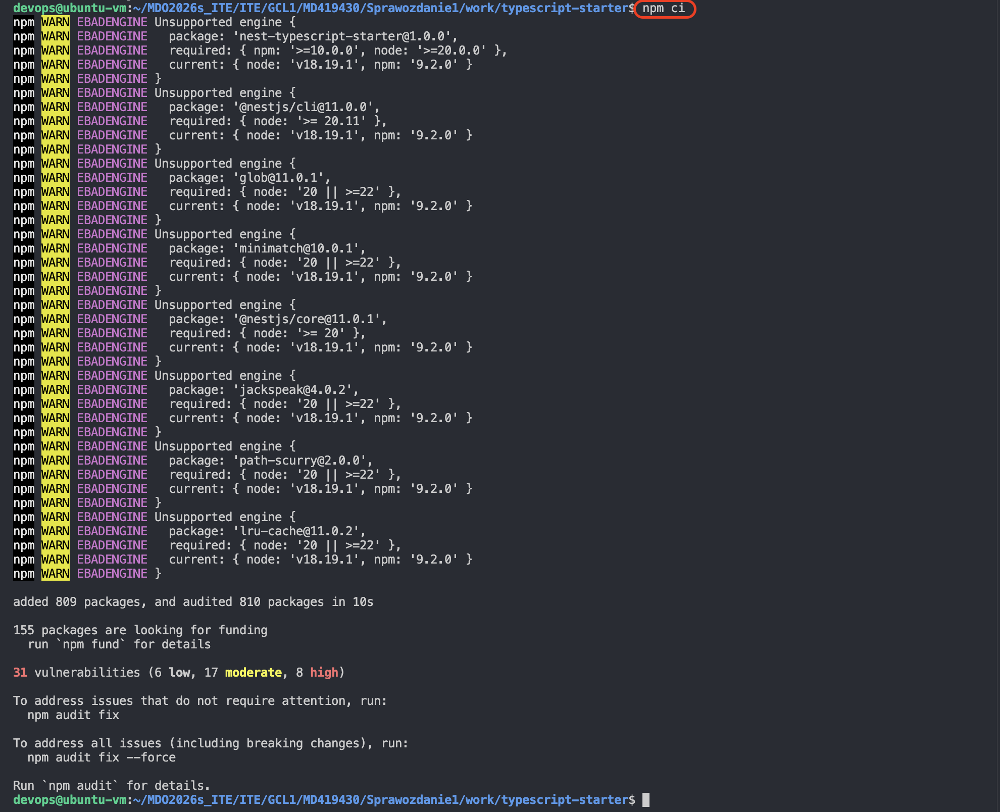 

```bash
npm run build
```
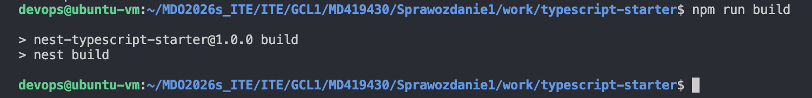 

------------------------------------------------------------------------

### Krok 3. Uruchomienie testów (Host)
Zweryfikowano poprawność działania aplikacji poprzez uruchomienie testów jednostkowych **Jest**.

```bash
npm run test
```
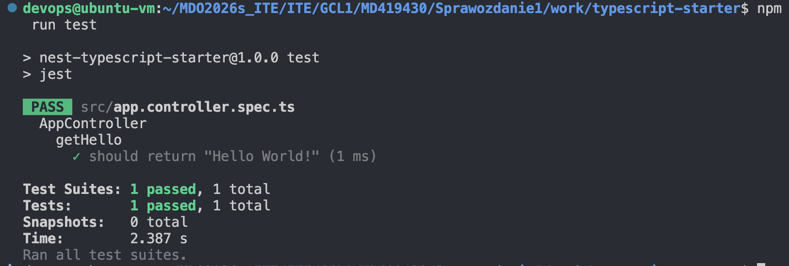 

------------------------------------------------------------------------

## 2. Izolacja i powtarzalność: Build w kontenerze

### Cel
Weryfikacja procesu budowania w izolowanym środowisku przy użyciu interaktywnego kontenera Docker, co zapewnia niezależność od konfiguracji hosta.

------------------------------------------------------------------------

### Krok 1. Praca interaktywna
Uruchomiono kontener z oficjalnym obrazem Node.js i ręcznie wykonano kroki niezbędne do zbudowania aplikacji.

```bash
docker run --rm -it node:22-bookworm-slim bash

# Wewnątrz kontenera:
apt update && apt install -y git
git clone --depth 1 https://github.com/nestjs/typescript-starter.git .
npm ci
npm run build
npm test
```
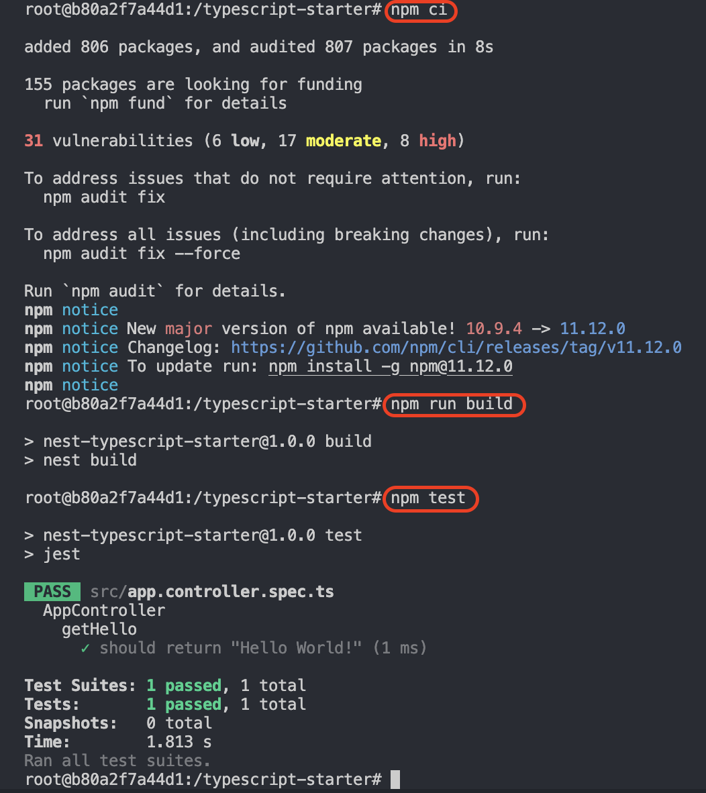

------------------------------------------------------------------------

## 3. Automatyzacja — Dockerfile jako definicja etapu

### Cel
Stworzenie dwóch plików Dockerfile automatyzujących proces: pierwszy przygotowuje artefakt (build), a drugi wykonuje testy na bazie tego artefaktu.

------------------------------------------------------------------------

### Krok 1. Etap Build (Dockerfile.build)
Przygotowano plik `Dockerfile.build` wykonujący pełną kompilację kodu.

```dockerfile
FROM node:22-bookworm-slim
WORKDIR /app
RUN apt-get update && apt-get install -y --no-install-recommends git ca-certificates \
    && rm -rf /var/lib/apt/lists/*
RUN git clone --depth 1 https://github.com/nestjs/typescript-starter.git .
RUN npm ci
RUN npm run build
CMD ["bash"]
```

Budowa obrazu:
```bash
docker build -f Dockerfile.build -t md419430-nest-build .
```
 
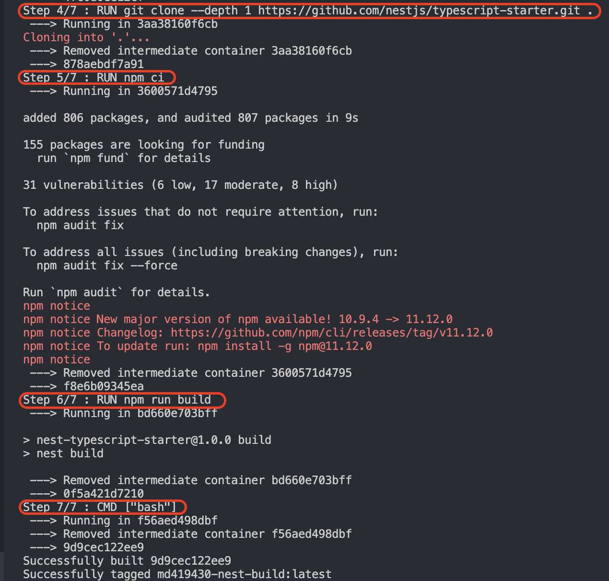

------------------------------------------------------------------------

### Krok 2. Etap Test (Dockerfile.test)
Utworzono plik `Dockerfile.test` bazujący na obrazie z poprzedniego kroku, aby uniknąć powtarzania instalacji zależności.

```dockerfile
FROM md419430-nest-build
CMD ["npm", "run", "test"]
```

Uruchomienie procesu testowego:
```bash
docker build -f Dockerfile.test -t md419430-nest-test .
docker run --rm md419430-nest-test
```
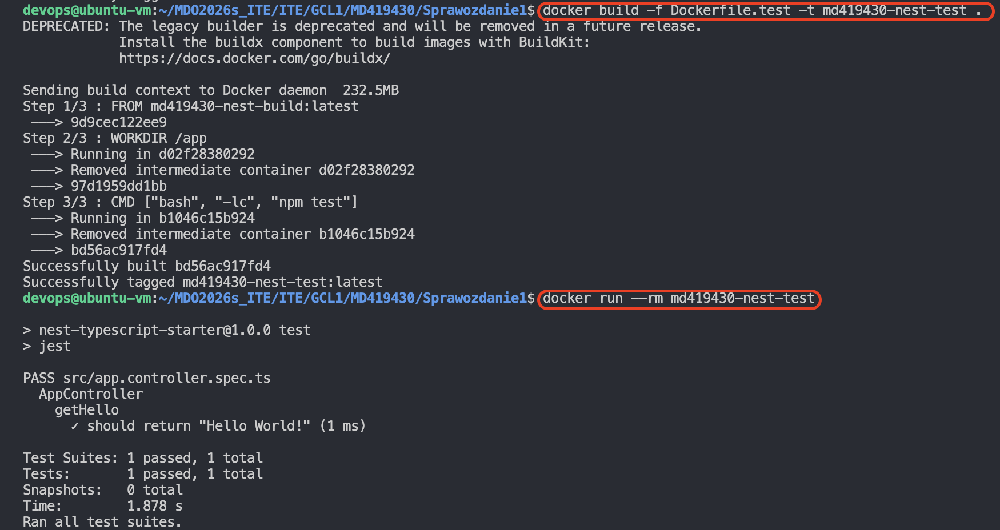

------------------------------------------------------------------------

## 4. Weryfikacja działania kontenera i wnioski

### Cel
Analiza procesów zachodzących wewnątrz uruchomionego kontenera NestJS oraz podsumowanie korzyści z konteneryzacji.

------------------------------------------------------------------------

### Krok 1. Monitoring procesów
Uruchomiono kontener w trybie interaktywnym, uruchomiono aplikację w tle i sprawdzono listę procesów.

```bash
docker run --rm -it md419430-nest-build bash
# Wewnątrz kontenera:
node dist/main.js &
ps aux
```
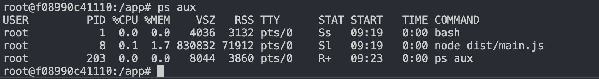

------------------------------------------------------------------------

### Wnioski

* **Przenośność:** Konteneryzacja pozwala na uruchomienie aplikacji NestJS w identycznym środowisku na każdym systemie wspierającym Dockera.
* **Separacja etapów:** Rozdzielenie obrazu na `build` i `test` pozwala na optymalizację potoków CI/CD i łatwiejsze zarządzanie artefaktami.
* **Izolacja:** Instalacja zależności w kontenerze zapobiega konfliktom wersji Node.js i bibliotek na maszynie dewelopera.
* **Obraz vs Kontener:** Obraz jest statyczną definicją, natomiast kontener to działający proces (w tym przypadku proces `node` wykonujący skompilowany kod JS).

# Laboratorium 4

## 1. Zachowywanie stanu między kontenerami

### Cel

Celem zadania było wykorzystanie woluminów Dockera do zachowania stanu
pomiędzy kontenerami oraz wykonanie procesu budowania aplikacji.

------------------------------------------------------------------------

### Krok 1. Utworzenie woluminów

Utworzono dwa woluminy: - wejściowy (`vol_in`) - wyjściowy (`vol_out`)

``` bash
docker volume create vol_in
docker volume create vol_out
```

------------------------------------------------------------------------

### Krok 2. Sklonowanie repozytorium

Repozytorium zostało pobrane przy użyciu tymczasowego kontenera
`alpine/git`.

``` bash
docker run --rm -v vol_in:/app alpine/git clone https://github.com/nestjs/typescript-starter.git /app
```

Podejście to pozwala uniknąć instalowania Gita w docelowym kontenerze.

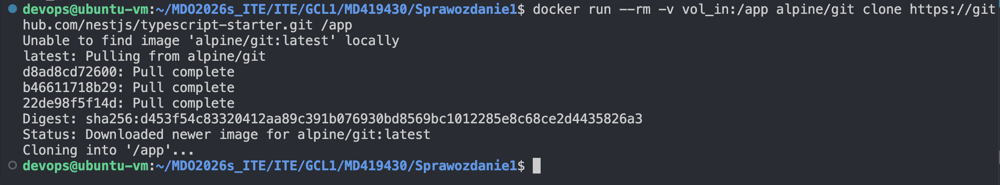
------------------------------------------------------------------------

### Krok 3. Budowanie aplikacji

Uruchomiono kontener Node.js z podłączonymi woluminami i wykonano proces
budowania aplikacji.

``` bash
docker run --rm -v vol_in:/app -v vol_out:/output -w /app node:20-alpine sh -c "npm install && npm run build && cp -r dist /output/"
```

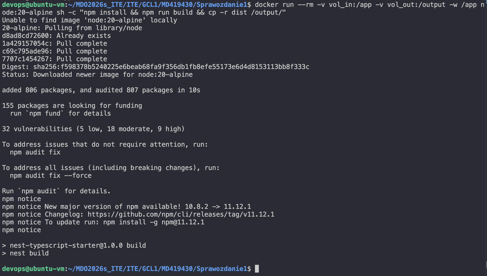
------------------------------------------------------------------------

### Krok 4. Weryfikacja wyników

Sprawdzono zawartość woluminu wyjściowego.

``` bash
docker run --rm -v vol_out:/output alpine ls -la /output/dist
```

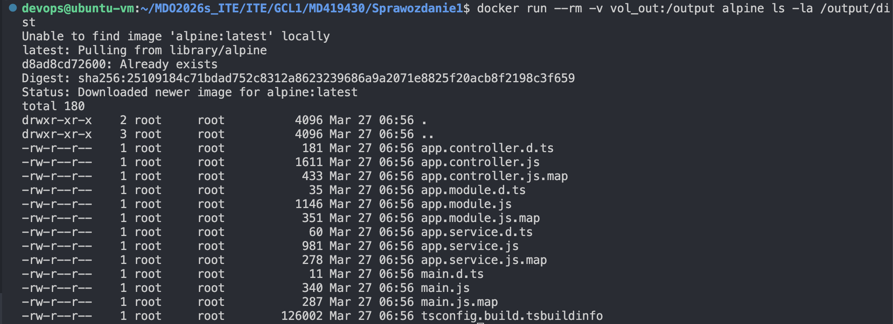
------------------------------------------------------------------------

### Krok 5. Wariant z Gitem w kontenerze

Wykonano alternatywne rozwiązanie z użyciem obrazu zawierającego Git.

``` bash
docker volume create vol_in2
docker volume create vol_out2

docker run --rm -v vol_in2:/app -v vol_out2:/output -w /app node:20 sh -c "git clone https://github.com/nestjs/typescript-starter.git . && npm install && npm run build && cp -r dist /output/"
```

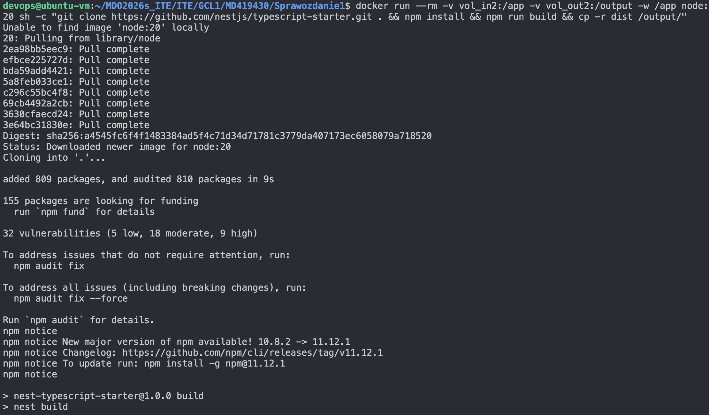
------------------------------------------------------------------------

### Wnioski

Podobny efekt można uzyskać przy użyciu `docker build` oraz
mechanizmów: - `RUN --mount=type=bind` - `RUN --mount=type=cache`

------------------------------------------------------------------------

## 2. Łączność między kontenerami

### Cel

Celem było sprawdzenie komunikacji między kontenerami przy użyciu
narzędzia `iperf3`.

------------------------------------------------------------------------

### Krok 1. Uruchomienie serwera

``` bash
docker run -d --name iperf_server networkstatic/iperf3 -s
```

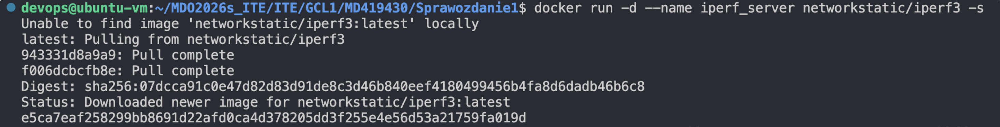
------------------------------------------------------------------------

### Krok 2. Odczyt adresu IP

``` bash
docker inspect -f '{{range.NetworkSettings.Networks}}{{.IPAddress}}{{end}}' iperf_server
```

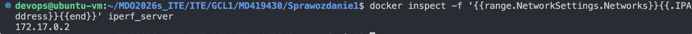
------------------------------------------------------------------------

### Krok 3. Test połączenia

``` bash
docker run --rm networkstatic/iperf3 -c <IP_SERWERA>
```

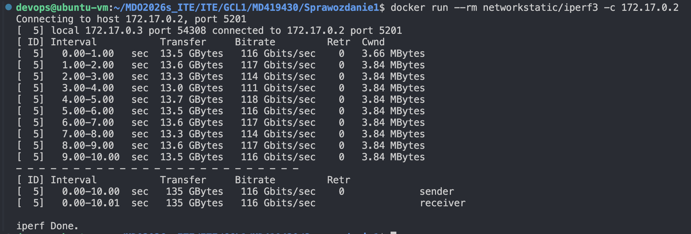
------------------------------------------------------------------------

### Krok 4. Własna sieć Docker

``` bash
docker stop iperf_server && docker rm iperf_server
docker network create my_bridge_net
```

Uruchomienie kontenerów w sieci:

``` bash
docker run -d --name iperf_server --network my_bridge_net networkstatic/iperf3 -s
docker run --rm --network my_bridge_net networkstatic/iperf3 -c iperf_server
```

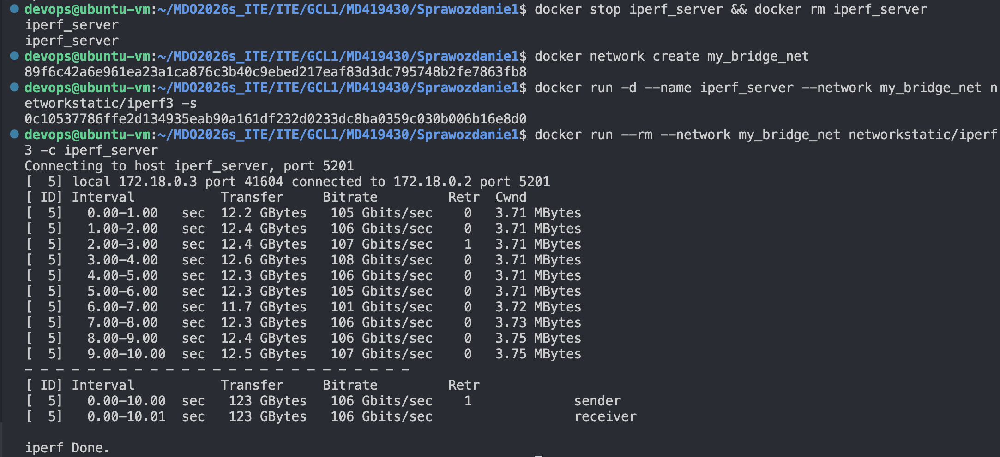
------------------------------------------------------------------------

### Krok 5. Dostęp z hosta

``` bash
docker run -d --name iperf_server -p 5201:5201 networkstatic/iperf3 -s
```

Test z hosta:

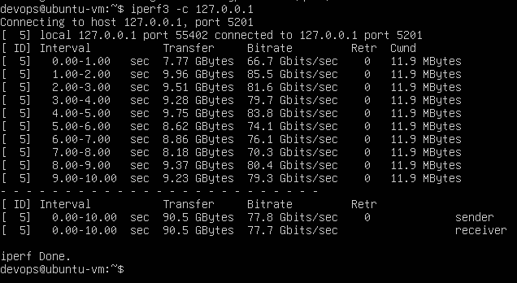

Test z spoza hosta:

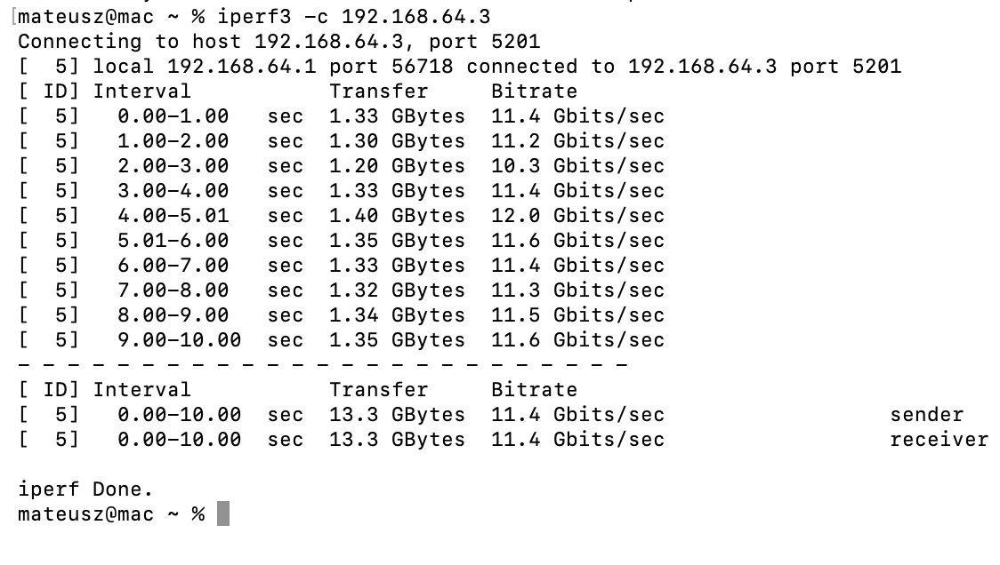
------------------------------------------------------------------------

## 3. SSH w kontenerze

### Cel

Celem było zestawienie połączenia SSH z kontenerem.

------------------------------------------------------------------------

### Krok 1. Uruchomienie kontenera

``` bash
docker run -d -p 2222:22 --name test_sshd rastasheep/ubuntu-sshd
```

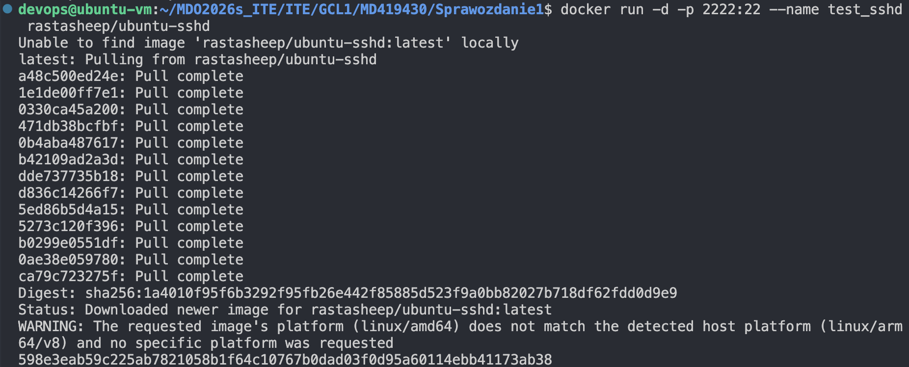
------------------------------------------------------------------------

### Krok 2. Połączenie SSH

``` bash
ssh test@127.0.0.1 -p 2222
```
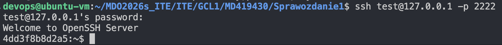
------------------------------------------------------------------------

### Wnioski

**Wady:** 
- naruszenie zasady jeden proces = jeden kontener\
- zwiększone ryzyko bezpieczeństwa\
- większy rozmiar obrazu

**Zalety:** 
- możliwość zdalnego dostępu\
- zastosowania testowe i integracyjne

------------------------------------------------------------------------

## 4. Jenkins w Dockerze

### Cel

Celem było uruchomienie serwera Jenkins z możliwością zarządzania
Dockerem.

------------------------------------------------------------------------

### Krok 1. Utworzenie sieci

``` bash
docker network create jenkins
```

------------------------------------------------------------------------

### Krok 2. Uruchomienie Docker-in-Docker

``` bash
docker run --name jenkins-docker --rm --detach \
  --privileged --network jenkins --network-alias docker \
  --env DOCKER_TLS_CERTDIR=/certs \
  --volume jenkins-docker-certs:/certs/client \
  --volume jenkins-data:/var/jenkins_home \
  --publish 2376:2376 \
  docker:dind --storage-driver overlay2
```

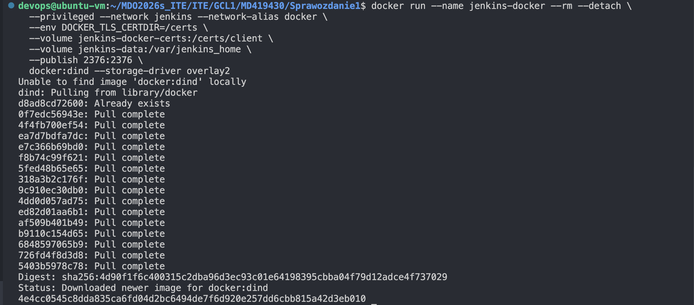
------------------------------------------------------------------------

### Krok 3. Budowa obrazu Jenkins

``` bash
docker build -t myjenkins-blueocean:2.426.3-1 -f Dockerfile.jenkins .
```

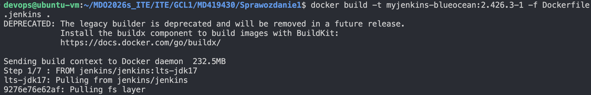 
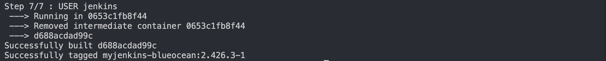
------------------------------------------------------------------------

### Krok 4. Uruchomienie Jenkins

``` bash
docker run --name jenkins-blueocean --rm --detach \
  --network jenkins --env DOCKER_HOST=tcp://docker:2376 \
  --env DOCKER_CERT_PATH=/certs/client --env DOCKER_TLS_VERIFY=1 \
  --publish 8080:8080 --publish 50000:50000 \
  --volume jenkins-data:/var/jenkins_home \
  --volume jenkins-docker-certs:/certs/client:ro \
  myjenkins-blueocean:2.426.3-1
```

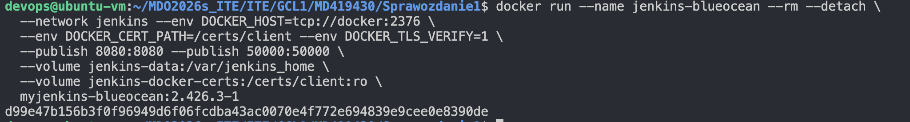
------------------------------------------------------------------------

### Krok 5. Konfiguracja

Odczyt hasła administratora:

``` bash
docker exec jenkins-blueocean cat /var/jenkins_home/secrets/initialAdminPassword
```

Następnie: - logowanie do panelu - instalacja
sugerowanych wtyczek - utworzenie użytkownika

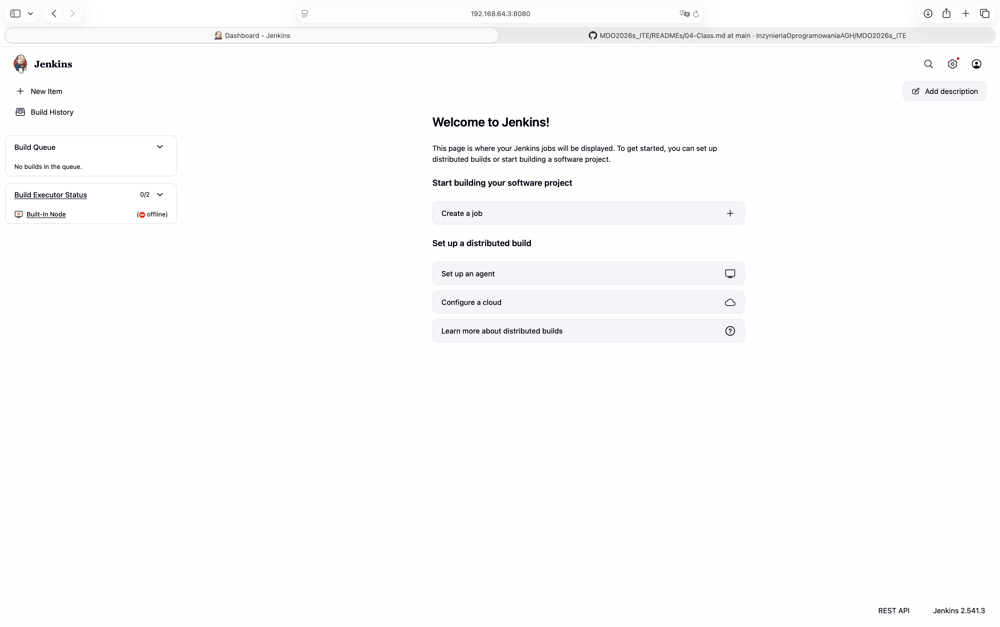
------------------------------------------------------------------------

### Weryfikacja działania

``` bash
docker ps
```

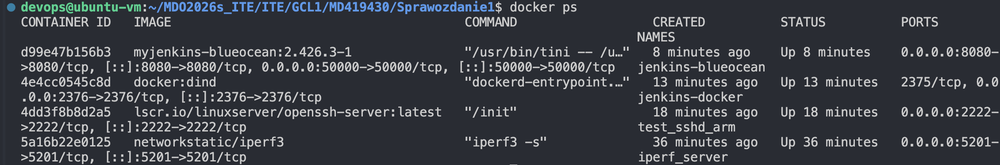