# Laboratorium1
## 1. Implementacja Githooka (commit-msg)

W ramach zadania przygotowałem skrypt typu `githook`, który wymusza określoną strukturę wiadomości commita. Każdy commit musi zaczynać się od identyfikatora `MD419430`.

### Kod skryptu:
```bash
#!/bin/bash

message=$(cat "$1")

pattern="^MD419430"

if [[ ! $message =~ $pattern ]]; then
    echo "Błąd: commit message musi zaczynać się od MD419430"
    exit 1
fi

```

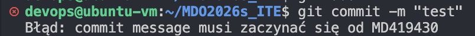 

## 2. Pull request'u
Utworzono Pull Request z gałęzi MD419430 do gałęzi grupowej GCL1.
Pull Request zawiera dwa commity:
- MD419430 pierwszy commit
- MD419430 dodanie sprawozdania

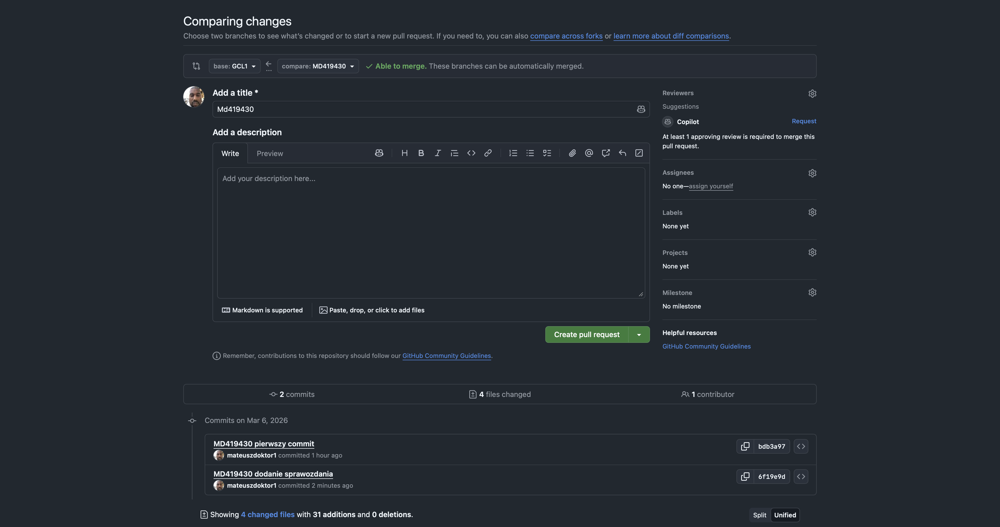 
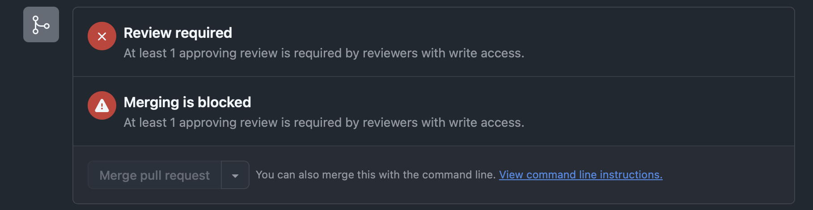

# Laboratorium2
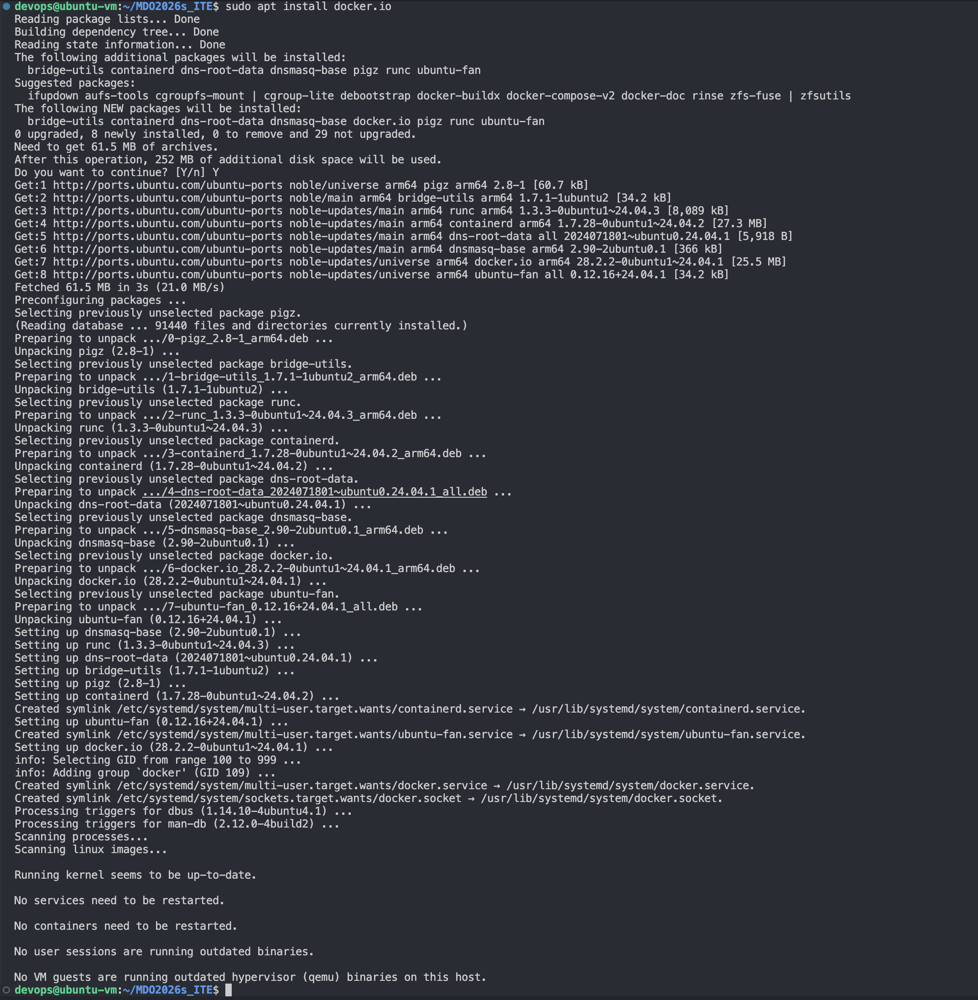
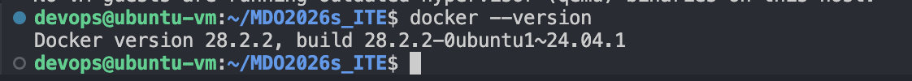
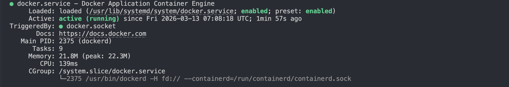 
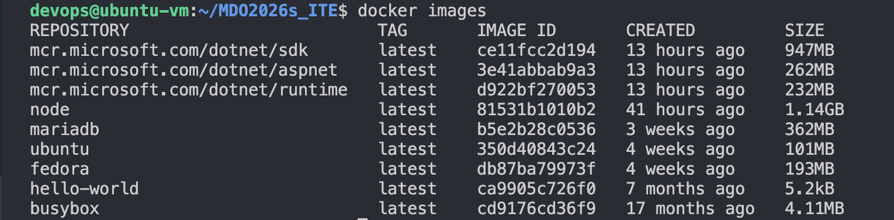 
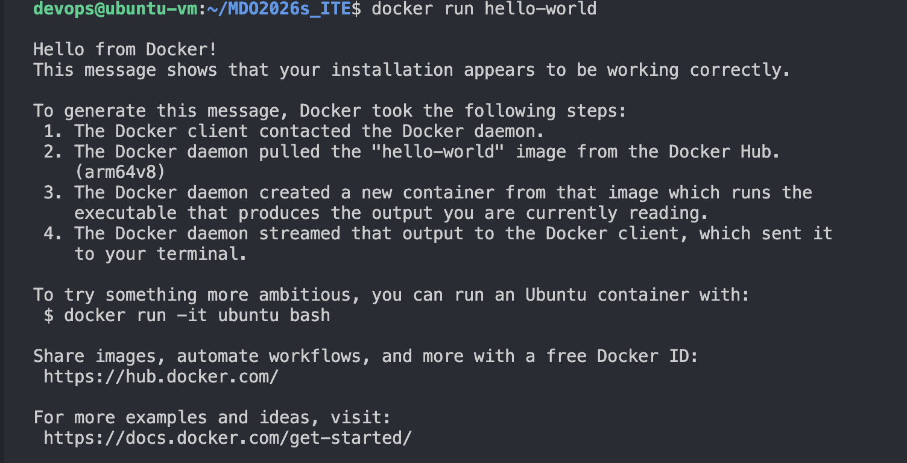 
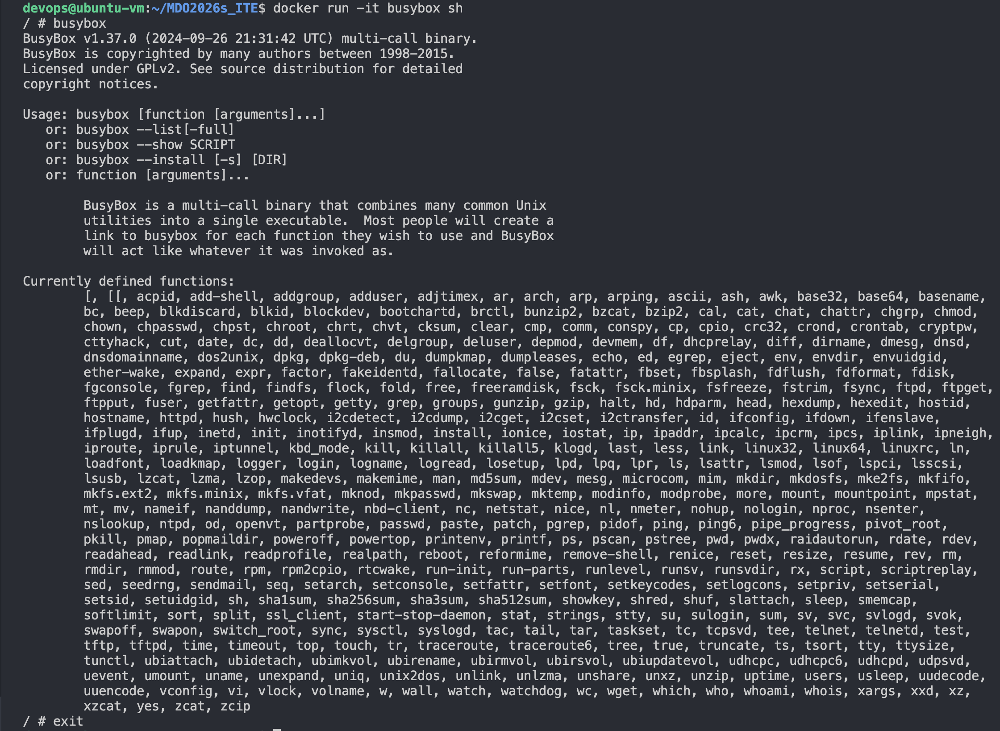 
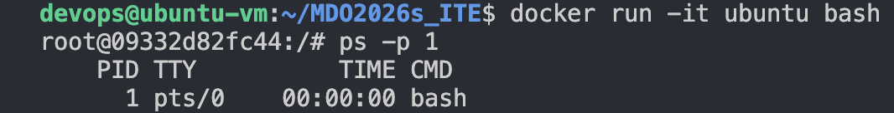 
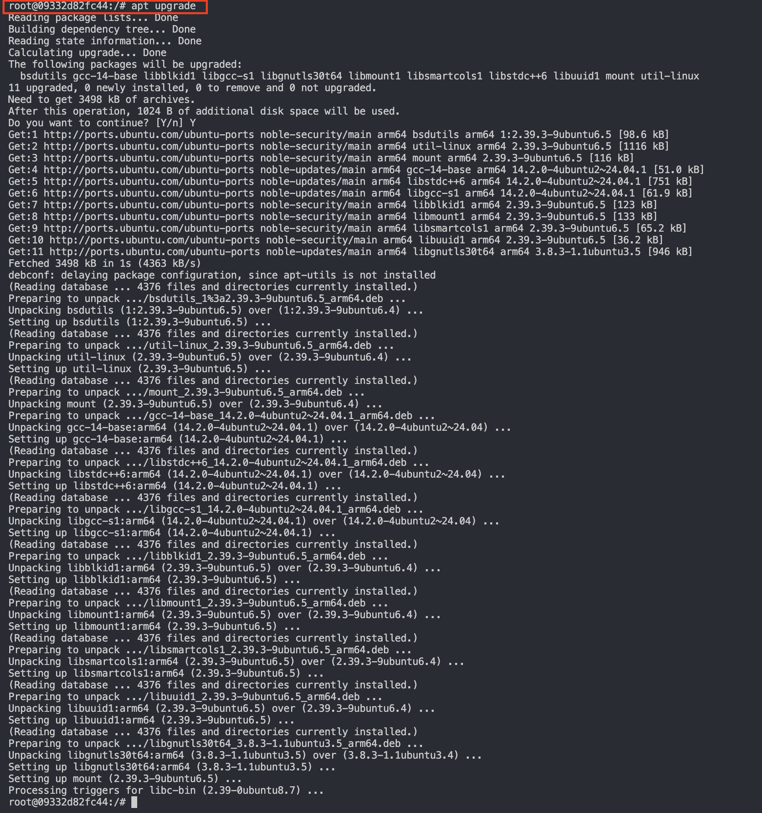 
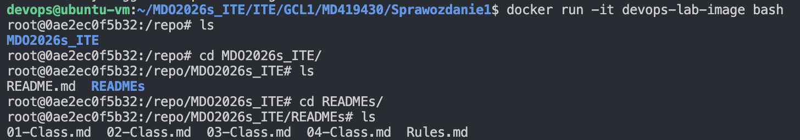 
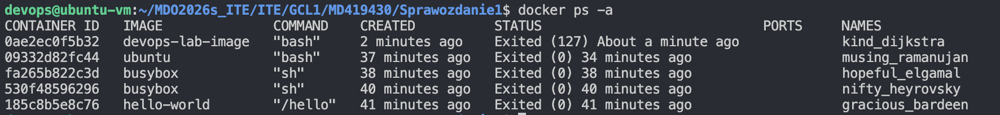 
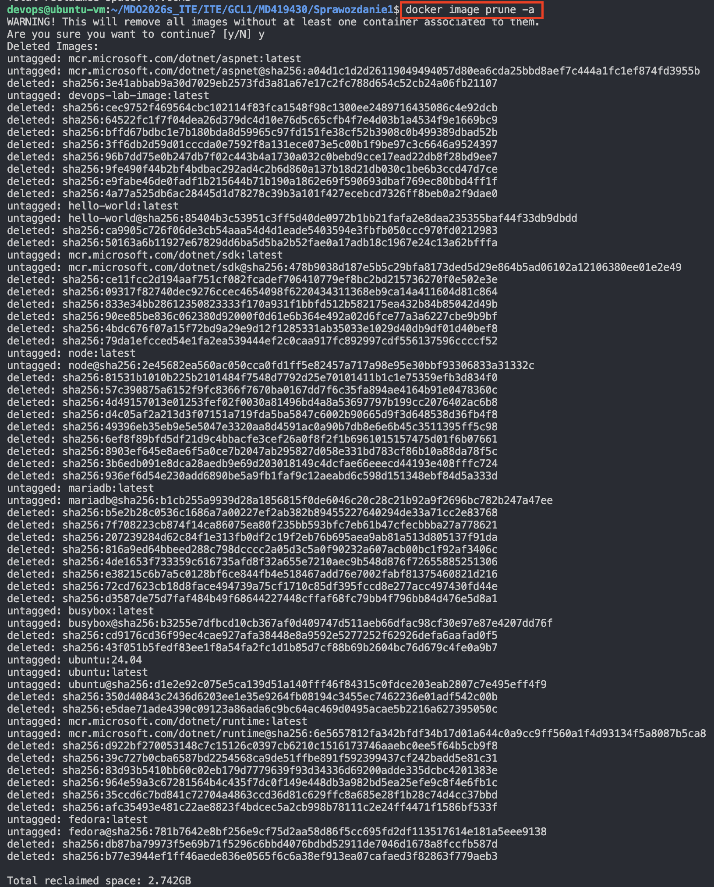 
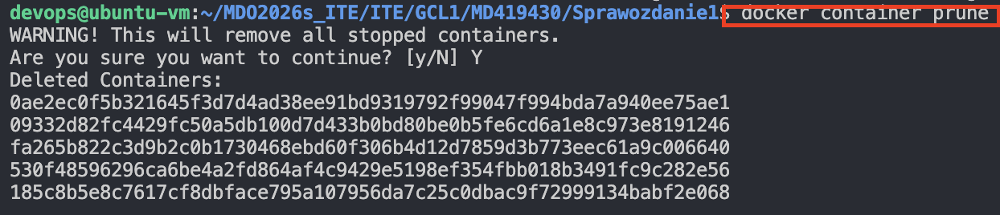