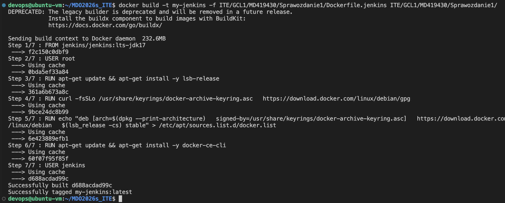
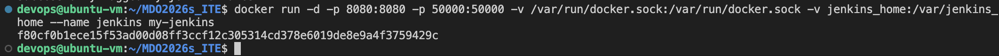
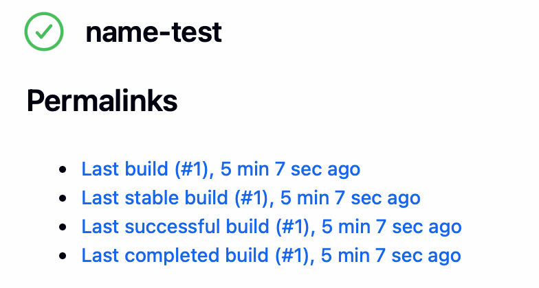
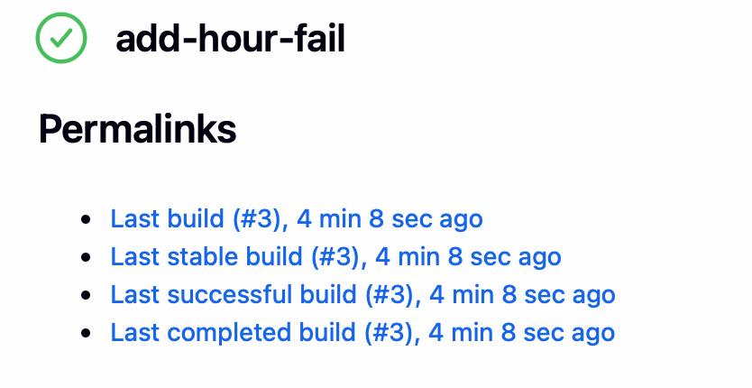
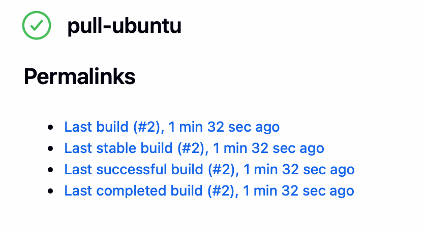
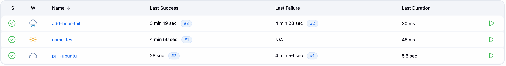
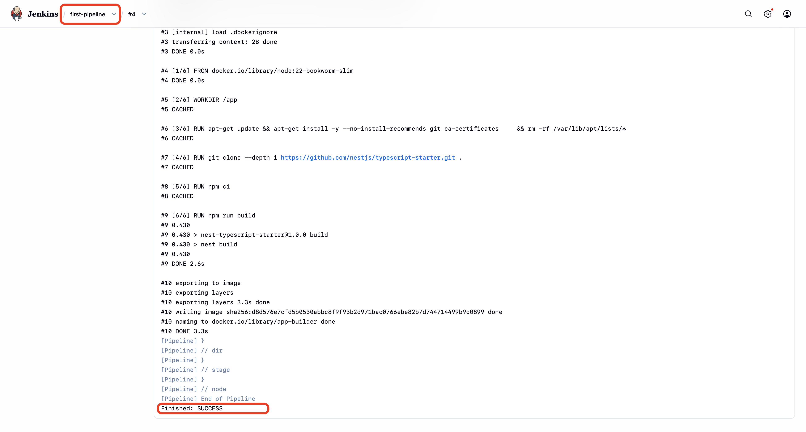
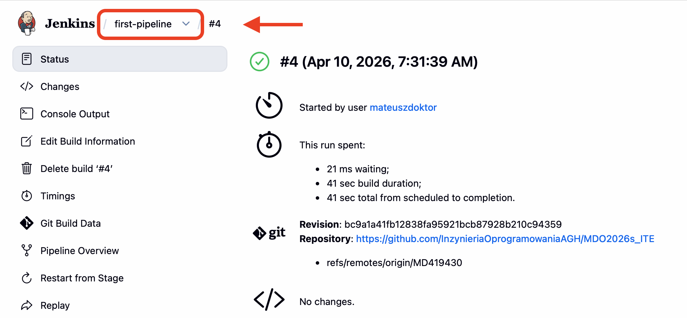

# Laboratorium 5

## 1. Pipeline, Jenkins, izolacja etapów

### Cel
Celem zadania była instalacja serwera Jenkins, konfiguracja początkowa oraz utworzenie i uruchomienie wieloetapowego potoku (pipeline) realizującego kroki *build-test-publish-deploy* dla aplikacji Node.js (NestJS), opierając się na obrazach wypracowanych na poprzednich zajęciach.

------------------------------------------------------------------------

### Krok 1. Uruchomienie instancji Jenkins z dostępem do Dockera
Wykorzystano autorski `Dockerfile.jenkins` wspierający klienta Docker. Kontener uruchomiono z prawami roota (`-u root`) oraz wmontowano gniazdo demona Dockera hosta (socket), aby umożliwić Jenkinsowi zlecanie budowy kontenerów.

```bash
docker build -t my-jenkins -f ITE/GCL1/MD419430/Sprawozdanie1/Dockerfile.jenkins ITE/GCL1/MD419430/Sprawozdanie1/
docker run -d -u root -p 8080:8080 -p 50000:50000 -v /var/run/docker.sock:/var/run/docker.sock -v jenkins_home:/var/jenkins_home --name jenkins my-jenkins
```



Pobrano startowe hasło administratora by ukończyć inicjalizację w UI przeglądarkowym na standardowym porcie 8080:
```bash
docker exec jenkins cat /var/jenkins_home/secrets/initialAdminPassword
```


------------------------------------------------------------------------

### Krok 2. Zadania wstępne (Freestyle projects)
W interfejsie serwera sprawdzono elementarne operacje przygotowując 3 podstawowe projekty typu *Freestyle project*:
1. **Wyświetlający informacje o systemie** (skrypt: `uname -a`)



2. **Warunkowy błąd** (zwraca exit code 1 i błąd w logach po weryfikacji nieparzystości obecnej godziny za pomocą modulo)



3. **Pobierający obraz testowy** (`docker pull ubuntu`)




------------------------------------------------------------------------

### Krok 3. Wstępny obiekt typu Pipeline (skrypt w UI Jenkinsa)
Zestawiono proste zadanie w typie Pipeline, którego kod wklejono bezpośrednio do konfiguracji projektu. Kod ten pobiera repozytorium z domyślnego serwera zdalnego na wskazaną gałąź, a potem buduje pierwszą warstwę zależności aplikacji TypeScript.

```groovy
pipeline {
    agent any
    stages {
        stage('Clone Repo') {
            steps {
                git branch: 'MD419430', url: 'https://github.com/InzynieriaOprogramowaniaAGH/MDO2026s_ITE.git'
            }
        }
        stage('Build Docker') {
            steps {
                dir('ITE/GCL1/MD419430/Sprawozdanie1') {
                    sh 'docker build -t app-builder -f Dockerfile.build ./work/typescript-starter/'
                }
            }
        }
    }
}
```


