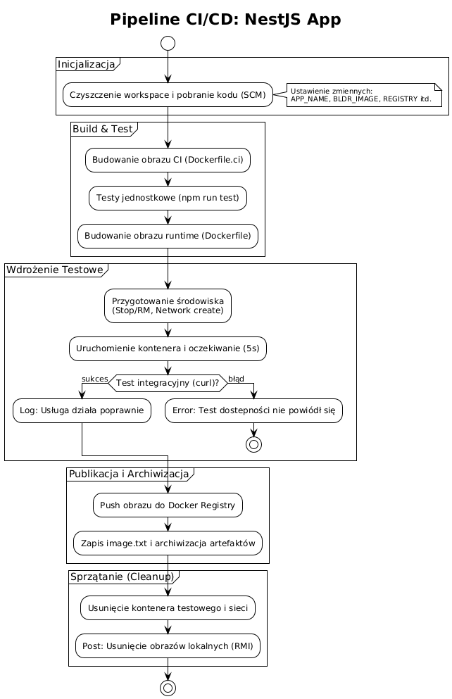
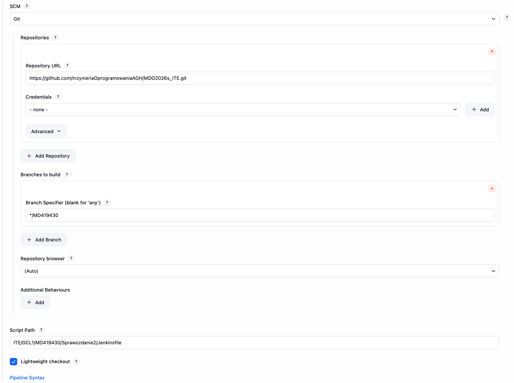
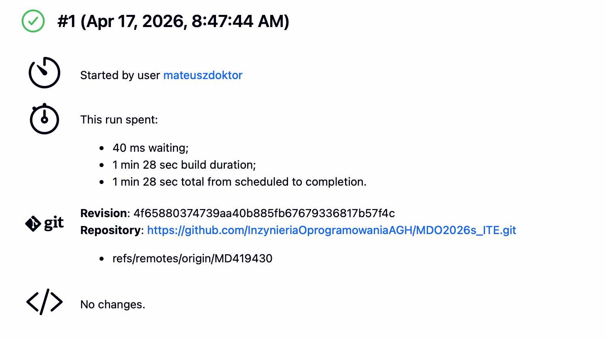
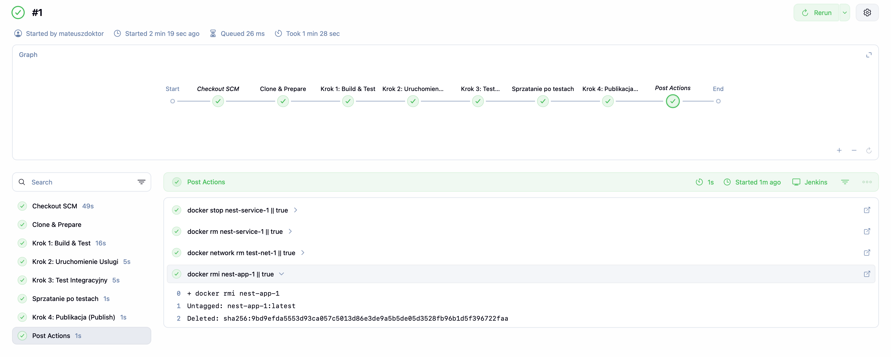
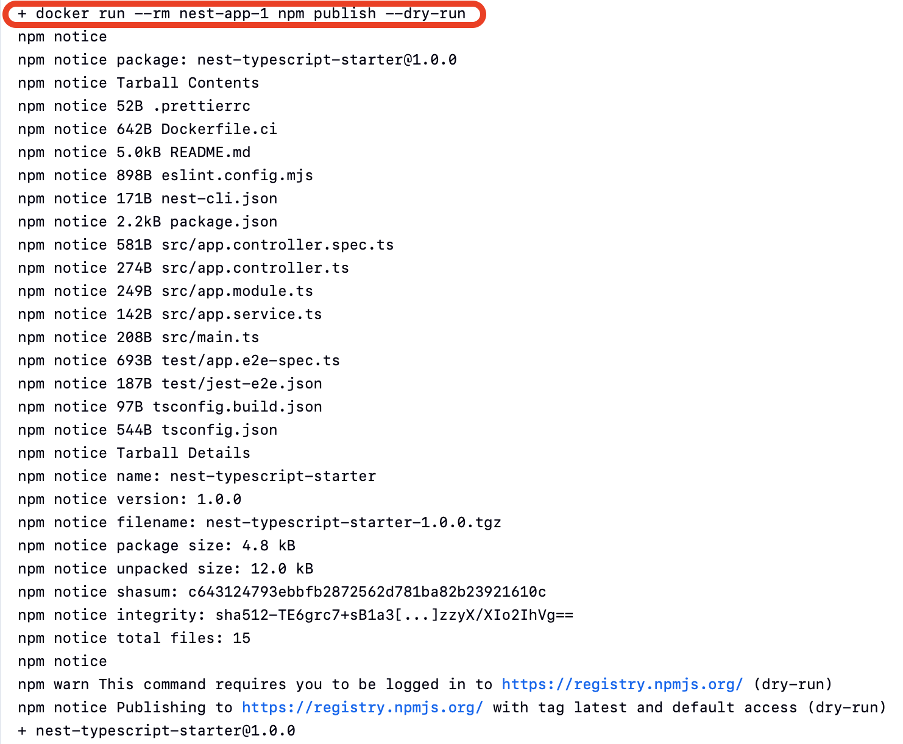
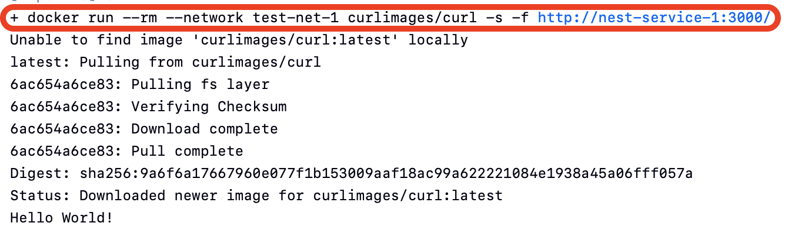

# Laboratorium 5

## 1. Pipeline, Jenkins, izolacja etapów

### Cel
Celem zadania była instalacja serwera Jenkins, konfiguracja początkowa oraz utworzenie i uruchomienie wieloetapowego potoku (pipeline) realizującego kroki *build-test-publish-deploy* dla aplikacji Node.js (NestJS), opierając się na obrazach wypracowanych na poprzednich zajęciach.

------------------------------------------------------------------------

### Krok 1. Uruchomienie instancji Jenkins z dostępem do Dockera
Wykorzystano `Dockerfile.jenkins` wspierający klienta Docker. Kontener uruchomiono z prawami roota (`-u root`) oraz wmontowano gniazdo demona Dockera hosta (socket), aby umożliwić Jenkinsowi zlecanie budowy kontenerów.

```bash
docker build -t my-jenkins -f ITE/GCL1/MD419430/Sprawozdanie1/Dockerfile.jenkins ITE/GCL1/MD419430/Sprawozdanie1/
docker run -d -u root -p 8080:8080 -p 50000:50000 -v /var/run/docker.sock:/var/run/docker.sock -v jenkins_home:/var/jenkins_home --name jenkins my-jenkins
```


Pobrano startowe hasło administratora by ukończyć inicjalizację w UI przeglądarkowym na standardowym porcie 8080:
```bash
docker exec jenkins cat /var/jenkins_home/secrets/initialAdminPassword
```


------------------------------------------------------------------------

### Krok 2. Zadania wstępne (Freestyle projects)
W interfejsie serwera sprawdzono elementarne operacje przygotowując 3 podstawowe projekty typu *Freestyle project*:
1. **Wyświetlający informacje o systemie** (skrypt: `uname -a`)


2. **Warunkowy błąd** (zwraca exit code 1 i błąd w logach po weryfikacji nieparzystości obecnej godziny za pomocą modulo)


3. **Pobierający obraz testowy** (`docker pull ubuntu`)


------------------------------------------------------------------------

### Krok 3. Wstępny obiekt typu Pipeline (skrypt w UI Jenkinsa)
Zestawiono proste zadanie w typie Pipeline, którego kod wklejono bezpośrednio do konfiguracji projektu. Kod ten pobiera repozytorium z domyślnego serwera zdalnego na wskazaną gałąź, a potem buduje pierwszą warstwę zależności aplikacji TypeScript.

```groovy
pipeline {
    agent any
    stages {
        stage('Clone Repo') {
            steps {
                git branch: 'MD419430', url: 'https://github.com/InzynieriaOprogramowaniaAGH/MDO2026s_ITE.git'
            }
        }
        stage('Build Docker') {
            steps {
                dir('ITE/GCL1/MD419430/Sprawozdanie1') {
                    sh 'docker build -t app-builder -f Dockerfile.build ./work/typescript-starter/'
                }
            }
        }
    }
}
```


# Laboratorium 6

## 1. Kompletny Pipeline CI/CD, izolacja etapów i publikacja

### Cel
Celem zadania było zaprojektowanie i wdrożenie pełnego procesu CI/CD (ścieżka: *clone -> build -> test -> deploy -> publish*) dla aplikacji NestJS. Konfigurację potoku zapisano w repozytorium jako kod (`Jenkinsfile`). Wykorzystano oddzielne kontenery Dockera dla poszczególnych etapów pracy.

------------------------------------------------------------------------

### Krok 1. Projektowanie procesu
W pierwszej kolejności zaplanowano architekturę pokazaną na poniższym diagramie UML. Zdecydowano się na utworzenie oddzielnych środowisk do budowania i docelowego uruchamiania aplikacji. Główne procesy (instalacja zależności, budowa i testy jednostkowe) odbywają się w podstawowym kontenerze narzędziowym (`Dockerfile.ci`). Następnie potok buduje lżejszy docelowy kontener uruchomieniowy (`Dockerfile`) i stawia go w nowo utworzonej, izolowanej sieci w środowisku testowym.

Do weryfikacji faktycznego działania programu uruchamiany jest drugi, krótko żyjący kontener integracyjny (klient z narzędziem `curl`), który działa jak zwykły użytkownik testujący dostępność usługi poprzez sieć. Po pozytywnym przejściu testu obraz zostaje zarchiwizowany i wysłany do rejestru Docker Hub, a tymczasowe kontenery testowe są sprzątane ze środowiska.



------------------------------------------------------------------------

### Krok 2. Konfiguracja Jenkinsa

W systemie wybrano opcję **Pipeline script from SCM**. Dzięki temu Jenkins automatycznie pobiera instrukcje potoku z GitHuba, co ułatwia zarządzanie i wersjonowanie kodu.

Dodatkowo, zrezygnowano ze skomplikowanego instalowania Dockera wewnątrz Dockera. Zamiast tego Jenkins otrzymał dostęp do procesu obsługującego Dockera na głównej maszynie (`/var/run/docker.sock`).



------------------------------------------------------------------------

### Krok 3. Przygotowanie obrazu Docker (Kontener C1)
Aby zbudować program w powtarzalnych warunkach, stworzono plik `Dockerfile.ci`.
Wykorzystano obraz `node:22-bookworm-slim`.Tego samego obrazu można użyć zarówno do testowania, jak i uruchomienia gotowego programu, bez tworzenia dodatkowych plików wdrożeniowych środowiska roboczego.

Pakiety aplikacji są wgrywane opcją `npm ci`, która gwarantuje uzycie sztywnych i stałych wersji paczek z pliku konfiguracyjnego projektu. Kod aplikacji znajduje sie w docelowym folderze `/app/dist`.

```dockerfile
FROM node:22-bookworm-slim
WORKDIR /app
COPY package.json package-lock.json ./
RUN npm ci
COPY . .
RUN npm run build
EXPOSE 3000
CMD ["npm", "run", "start:prod"]
```

------------------------------------------------------------------------

### Krok 4. Potok w Jenkinsie (`Jenkinsfile`)
Proces podzielono na następujące kroki, adekwatnie odwzorowujące zaktualizowany `Jenkinsfile`:

1. **Czyszczenie workspace i pobranie kodu (SCM)**: Przed pobraniem wywoływane jest całkowite wyczyszczenie przestrzeni roboczej (`deleteDir()`), aby upewnić się, że potok przebuduje cały kod (nie cache'owany). Następnie nowa treść jest pobierana przez SCM.
2. **Budowanie obrazu CI (C1)**: Tworzony jest obraz narzędziowy `BLDR_IMAGE`, budowany z wykorzystaniem środowiska `Dockerfile.ci`. Służy on do budowy i uruchomienia testów.
3. **Testy**: Uruchamiany jest kontener z zbudowanego obrazu, wewnątrz którego wywoływana jest komenda `npm run test`.
4. **Budowanie obrazu runtime**: Używając właściwego pliku `Dockerfile`, powstaje mniejszy obraz aplikacji zawierający jedynie jej docelową wersję wyjściową (`RUNTIME_IMAGE`). Różnica chroni środowisko produkcyjne przed niechcianymi plikami z fazy budowania.
5. **Wdrożenie i test w środowisku testowym (deploy test)**: Tworzona jest izolowana sieć testowa na demonie Dockera (`test-net-...`). W środowisku tym podnoszona jest skonteneryzowana aplikacja, po czym drugi kontener (`curlimages/curl`) z wnętrza tej wirtualnej sieci potwierdza faktyczne uruchomienie serwera aplikacji odpowiednim żądaniem na dostępny wewnątrz port 3000.
6. **Publikacja do Docker Registry (Publish)**: Po pozytywnych testach potok wgrywa (push) wygenerowany obraz do usługi Docker Hub pod utworzonym dla aplikacji miejscem, wstawiając numer budowania (tag). Generuje to artefakt "deployable" gotowy do użycia przez docelowych klientów. Zapisywana jest notatka do pliku `image.txt`, podczepianego jako log Jenkinsa.
7. **Porządki w systemie**: Po finalizacji potok obligatoryjnie zatrzymuje i usunie zużyte testowe aplikacje serwera oraz kasuje tymczasowo zapisane kopie obrazów ze środowiska CI, dzięki czemu minimalizowane są odpady i zachowana jest powtarzalność.

 






