# Laboratorium 8

## 1. Automatyzacja i zdalne wykonywanie poleceń (Ansible)

### Cel
Celem zadania było przygotowanie środowiska Ansible (VM1 jako orkiestrator, VM2 jako endpoint), wykonanie inwentaryzacji hostów, uruchomienie playbooków operacyjnych oraz zarządzanie artefaktem kontenerowym z pipeline'u.

------------------------------------------------------------------------

### Krok 1. Przygotowanie VM2 (ansible-target)
Na maszynie docelowej przygotowano minimalny system, zainstalowano `tar` i `openssh-server`, ustawiono hostname oraz utworzono użytkownika `ansible`.

```bash
sudo apt update
sudo apt install -y openssh-server tar rng-tools
sudo systemctl enable --now ssh

sudo hostnamectl set-hostname ansible-target
sudo adduser ansible
sudo usermod -aG sudo ansible
echo "ansible ALL=(ALL) NOPASSWD:ALL" | sudo tee /etc/sudoers.d/ansible
sudo chmod 440 /etc/sudoers.d/ansible
```

------------------------------------------------------------------------

### Krok 2. Instalacja Ansible i wymiana kluczy (VM1)
Na maszynie orkiestratora (VM1) zainstalowano Ansible i skonfigurowano logowanie bezhasłowe do VM2.

```bash
sudo apt update
sudo apt install -y ansible

ssh-keygen -t ed25519 -C "ansible@vm1"
ssh-copy-id ansible@ansible-target
```

------------------------------------------------------------------------

### Krok 3. Inwentaryzacja i weryfikacja łączności
Ustalono nazwy hostów i wpisy DNS w `/etc/hosts`, a następnie utworzono plik inwentaryzacji z sekcjami `Orchestrators` i `Endpoints`.

```ini
[Orchestrators]
ansible-control ansible_connection=local

[Endpoints]
ansible-target ansible_host=192.168.1.50 ansible_user=ansible
```

Test łączności:

```bash
ansible -i inventory.ini all -m ping
```

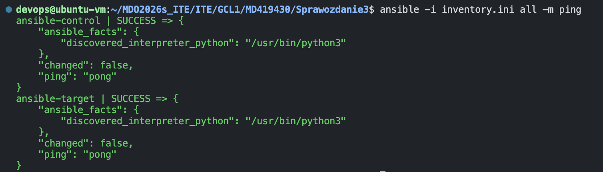

------------------------------------------------------------------------

### Krok 4. Playbook operacyjny (ping, kopiowanie, aktualizacja, restart)
Przygotowano playbook `lab08.yml`, który:
1. Wysyła `ping` do wszystkich maszyn.
2. Kopiuje plik inwentaryzacji na endpoint.
3. Ponawia `ping`.
4. Aktualizuje pakiety i restartuje `ssh` oraz `rngd`/`rng-tools`.

```bash
ansible-playbook -i inventory.ini lab08.yml -v
```

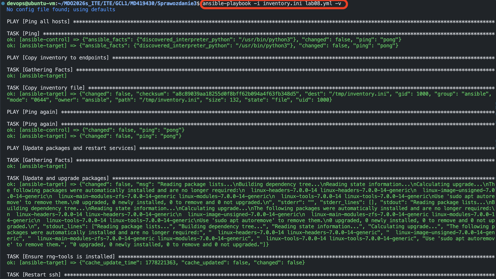
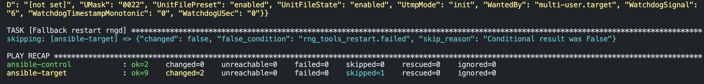

------------------------------------------------------------------------

### Krok 5. Test hosta niedostępnego
Wyłączono SSH na VM2 i uruchomiono test odporności (playbook nie przerywa pracy dla hosta niedostępnego):

```bash
sudo systemctl stop ssh
```

```bash
ansible -i inventory.ini Endpoints -m ping -T 3
```

Następnie przywrócono SSH:

```bash
sudo systemctl start ssh
```

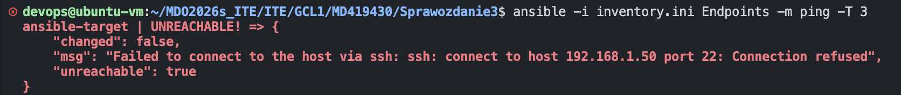

------------------------------------------------------------------------

### Krok 6. Zarządzanie artefaktem (kontener)
Ponieważ artefaktem z pipeline'u jest kontener, przygotowano rolę `deploy_artifact` zbudowaną przez `ansible-galaxy`. Rola:
- wykonuje sanity check (dysk, pamięć, docker),
- instaluje Dockera,
- klonuje repozytorium z brancha `MD419430`,
- buduje obraz runtime z `Dockerfile`,
- uruchamia i weryfikuje kontener lokalny,
- pobiera obraz z Docker Hub i testuje jego uruchomienie,
- sprząta kontenery po weryfikacji.

Uruchomienie roli:

```bash
ansible-playbook -i inventory.ini deploy_artifact.yml
```

Domyślne parametry (ustawione w `defaults/main.yml`):

```yaml
repo_url: "https://github.com/InzynieriaOprogramowaniaAGH/MDO2026s_ITE.git"
repo_version: "MD419430"
published_image: "mateuszdoktor1/nest-app:3"
```

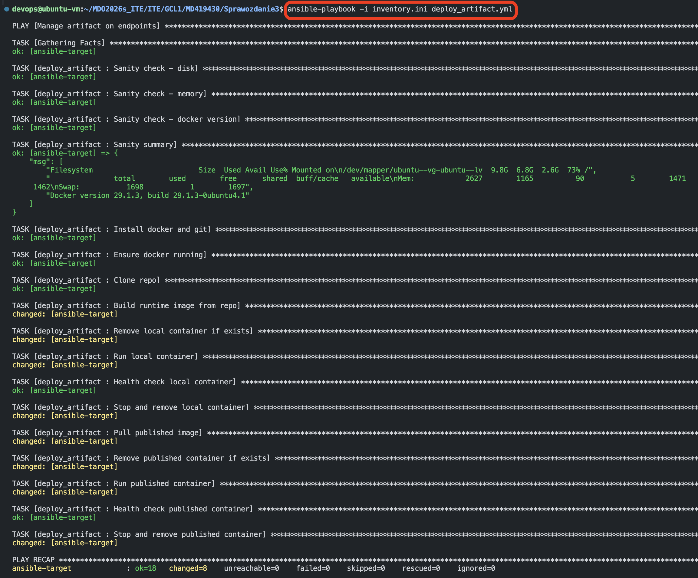

------------------------------------------------------------------------

### Krok 7. Struktura roli
W repozytorium umieszczono rolę w następującej strukturze:

```
roles/deploy_artifact/
	defaults/main.yml
	tasks/main.yml
	meta/main.yml
```

# Laboratorium 9

## 1. Pliki odpowiedzi dla wdrożeń nienadzorowanych (Kickstart)

### Cel
Celem zadania było przygotowanie źródła instalacji nienadzorowanej dla systemu Fedora oraz automatyczne uruchomienie aplikacji z pipeline'u po pierwszym starcie.

------------------------------------------------------------------------

### Krok 1. Pobranie pliku anaconda-ks.cfg i przygotowanie ks.cfg
Po pierwszej instalacji pobrano plik `/root/anaconda-ks.cfg`, zachowano kopie robocze oraz przygotowano docelowy plik `ks.cfg` w repozytorium.

```bash
ls /root
```

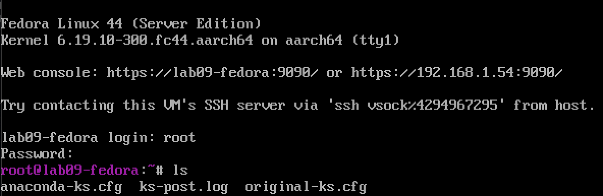

------------------------------------------------------------------------

### Krok 2. Modyfikacja pliku Kickstart
Plik `ks.cfg` został rozszerzony o źródła instalacyjne, automatyczne czyszczenie dysku, hostname oraz zestaw pakietów i sekcję `%post` do uruchomienia kontenera.

Najważniejsze elementy:

```cfg
#version=F44
url --mirrorlist=https://mirrors.fedoraproject.org/mirrorlist?repo=fedora-44&arch=aarch64
repo --name=updates --mirrorlist=https://mirrors.fedoraproject.org/mirrorlist?repo=updates-released-f44&arch=aarch64

network --bootproto=dhcp --device=link --activate --hostname=lab09-fedora

zerombr
clearpart --all --initlabel
autopart

reboot

%packages
@^server-product-environment
openssh-server
sudo
curl
wget
git
dnf-plugins-core
podman
podman-docker
%end
```

W sekcji `%post` przygotowano skrypt `/usr/local/bin/run-app.sh` oraz usługę `nest-app.service`, które pobierają i uruchamiają obraz z Docker Hub: `mateuszdoktor1/nest-app:3`. Log z instalacji zapisywany jest do `/root/ks-post.log`.

------------------------------------------------------------------------

### Krok 3. Instalacja nienadzorowana i pierwszy start
Utworzono nową maszynę UEFI i uruchomiono instalator z parametrem `inst.ks` wskazującym na `ks.cfg` w repozytorium. Instalator nie zadał żadnych pytań i po zakończeniu wykonał `reboot`.

Weryfikacja systemu po pierwszym uruchomieniu:

```bash
hostnamectl
```

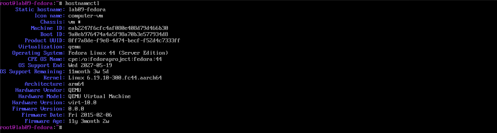

------------------------------------------------------------------------

### Krok 4. Uruchomienie kontenera po pierwszym starcie
Sprawdzono działanie Podmana oraz status kontenera i usługi systemd, która uruchamia aplikację po starcie systemu.

```bash
systemctl status podman
podman ps
```

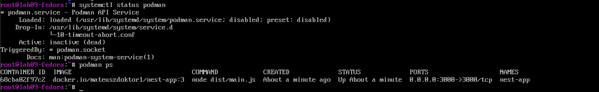

```bash
systemctl status nest-app
```

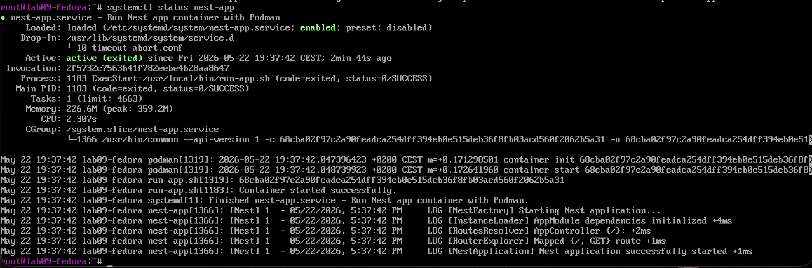

------------------------------------------------------------------------

### Krok 5. Weryfikacja działania aplikacji
Sprawdzono odpowiedź aplikacji lokalnie na VM2:

```bash
curl http://localhost:3000
```


Oraz z VM1 po sieci (VM2 otrzymała adres 192.168.1.54 z DHCP):

```bash
curl http://192.168.1.54:3000
```

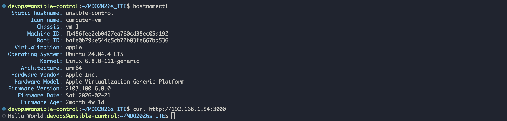

# Laboratorium 10

## 1. Wdrażanie na Kubernetes (minikube)

### Cel
Celem zadania było uruchomienie klastra k8s (minikube), przygotowanie kontenera w wariancie optimum (nginx z własną konfiguracją), wdrożenie w podzie i deploymencie oraz weryfikacja działania i skalowania.

------------------------------------------------------------------------

### Krok 1. Instalacja i uruchomienie minikube (ARM64, UTM)
Uruchomiono minikube w Ubuntu ARM64 na UTM (sterownik docker) i zweryfikowano stan klastra.
Użyto aliasu `mk` = `minikube kubectl --`.

```bash
minikube start --driver=docker --cpus=2 --memory=4096
minikube status
mk get pods -A
```

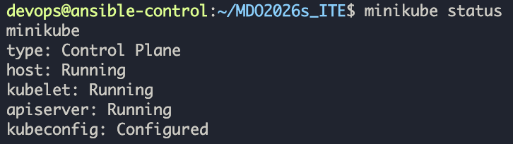
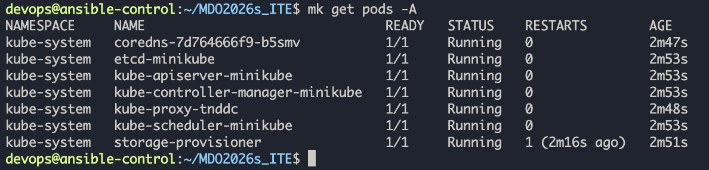

------------------------------------------------------------------------

### Krok 2. Dashboard i potwierdzenie łączności
Uruchomiono dashboard i sprawdzono dostęp przez przeglądarkę.

```bash
minikube dashboard --url
```

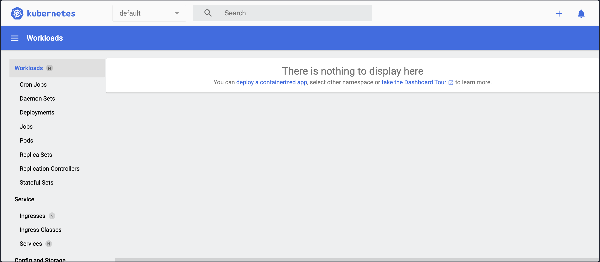

------------------------------------------------------------------------

### Krok 3. Przygotowanie obrazu (nginx + własna konfiguracja)
Wykorzystano bazowy obraz `nginx:1.27-alpine` i dodano własną konfigurację oraz stronę HTML.

`Dockerfile`:
```dockerfile
FROM nginx:1.27-alpine

COPY nginx.conf /etc/nginx/nginx.conf
COPY index.html /usr/share/nginx/html/index.html

EXPOSE 8080
CMD ["nginx", "-g", "daemon off;"]
```

`nginx.conf`:
```nginx
worker_processes 1;

events { worker_connections 1024; }

http {
  server {
    listen 8080;
    server_name _;

    root /usr/share/nginx/html;
    index index.html;

    location / {
      try_files $uri /index.html;
    }
  }
}
```

`index.html` (wersja v2; v1 analogiczna z innym tytułem):
```html
<!doctype html>
<html>
  <head>
    <meta charset="utf-8" />
    <title>Lab10 v2</title>
  </head>
  <body>
    <h1>Lab10 - nginx custom config - v2</h1>
    <p>App: md419430-nginx</p>
  </body>
</html>
```

Budowa i test wersji v1:
```bash
docker build -t "md419430-nginx:v1" .
docker run --rm -p 8080:8080 "md419430-nginx:v1"
curl -i http://localhost:8080
```

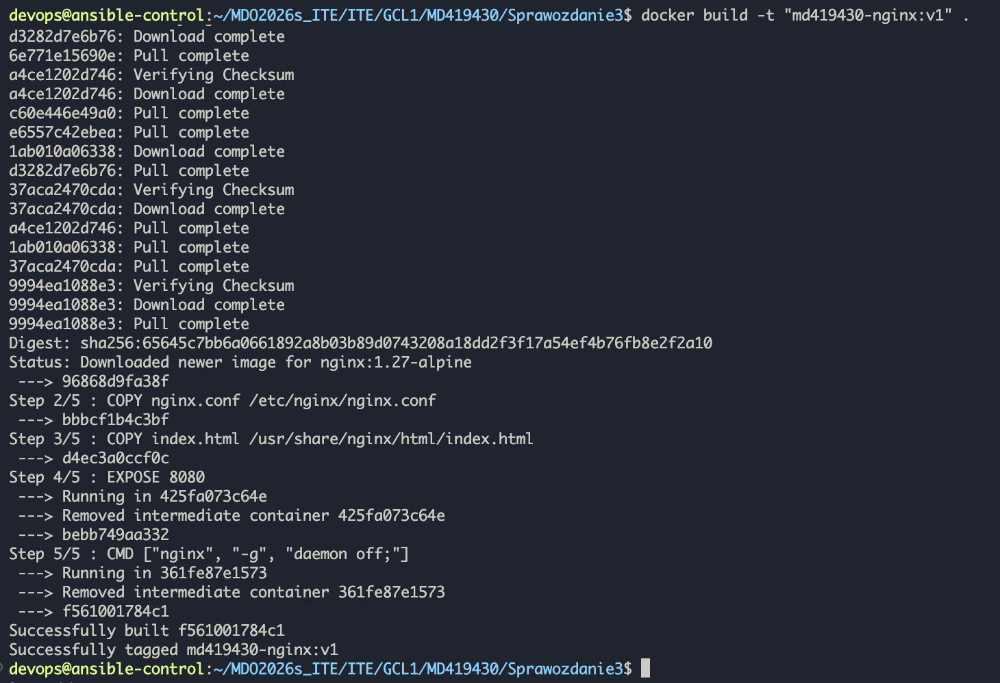
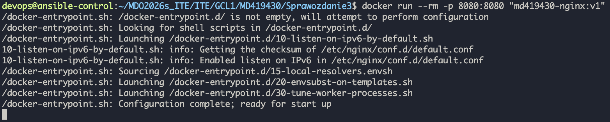
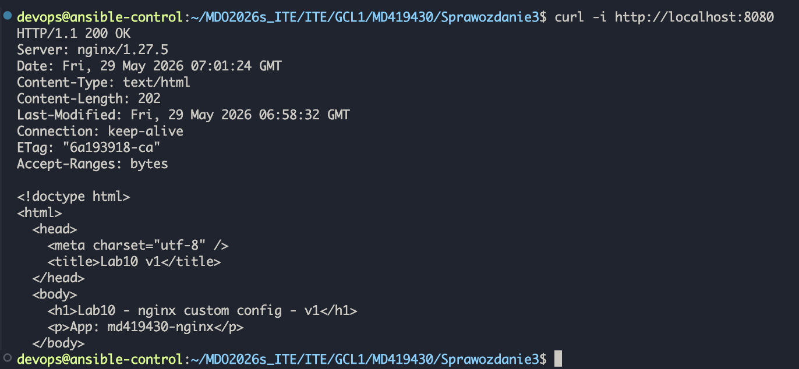

Budowa wersji v2 oraz wersji wadliwej (z błędną dyrektywą w `nginx.conf`):
```bash
docker build -t "md419430-nginx:v2" .
docker build -t "md419430-nginx:bad" .
docker run --rm -p 8080:8080 "md419430-nginx:bad"
```

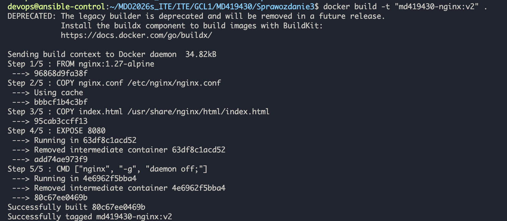
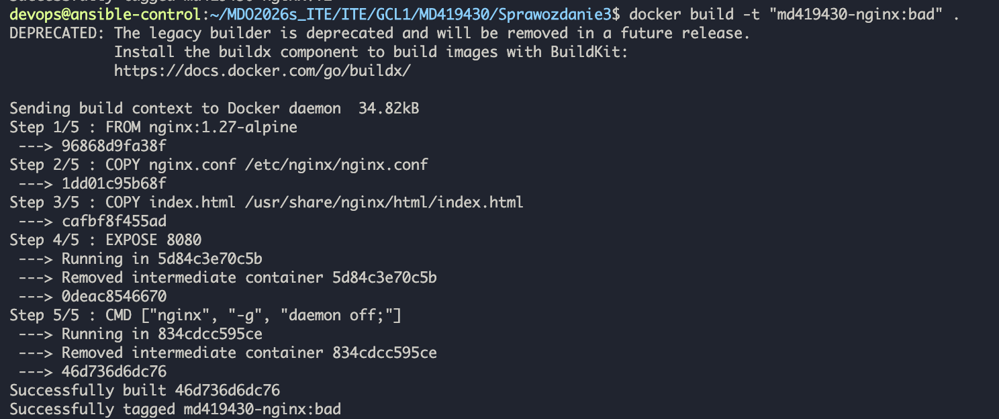
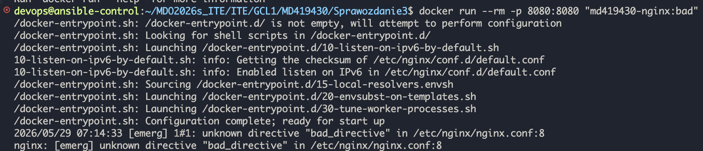

Załadowanie obrazów do minikube:
```bash
minikube image load "md419430-nginx:v1"
minikube image load "md419430-nginx:v2"
minikube image load "md419430-nginx:bad"
minikube image ls | grep "md419430-nginx"
```

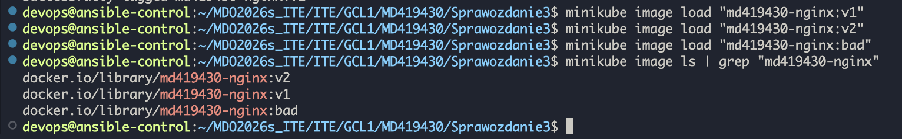

------------------------------------------------------------------------

## 2. Uruchomienie kontenera w podzie

### Cel
Uruchomienie kontenera na minikube i potwierdzenie działania poprzez przekierowanie portów.

------------------------------------------------------------------------

### Krok 1. Uruchomienie poda i weryfikacja

```bash
mk run md419430-nginx-pod --image=md419430-nginx:v1 --port=8080 --labels=app=md419430-nginx
mk get pods
mk describe pod "md419430-nginx-pod"
```

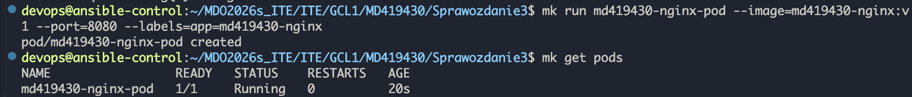
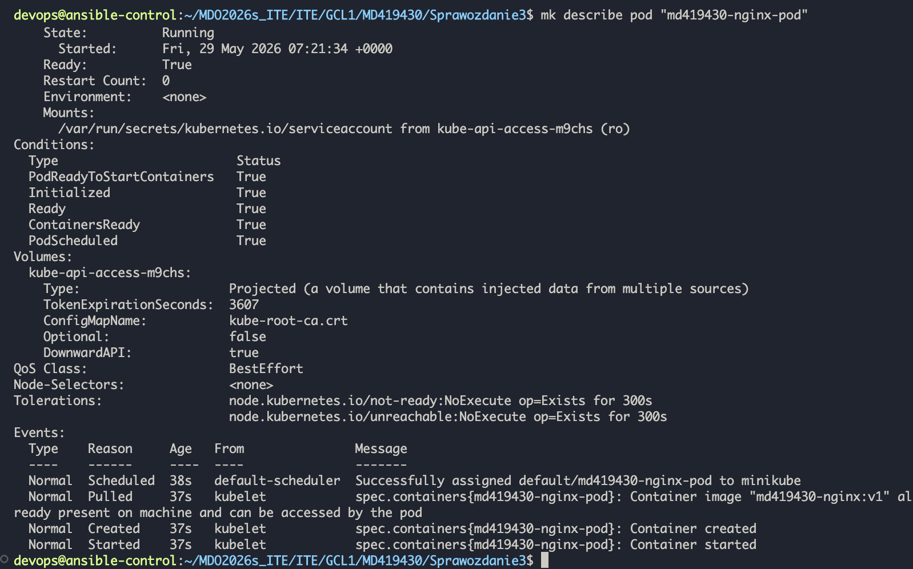

------------------------------------------------------------------------

### Krok 2. Port-forward i test HTTP

```bash
mk port-forward pod/md419430-nginx-pod 8080:8080
curl -i http://localhost:8080
```

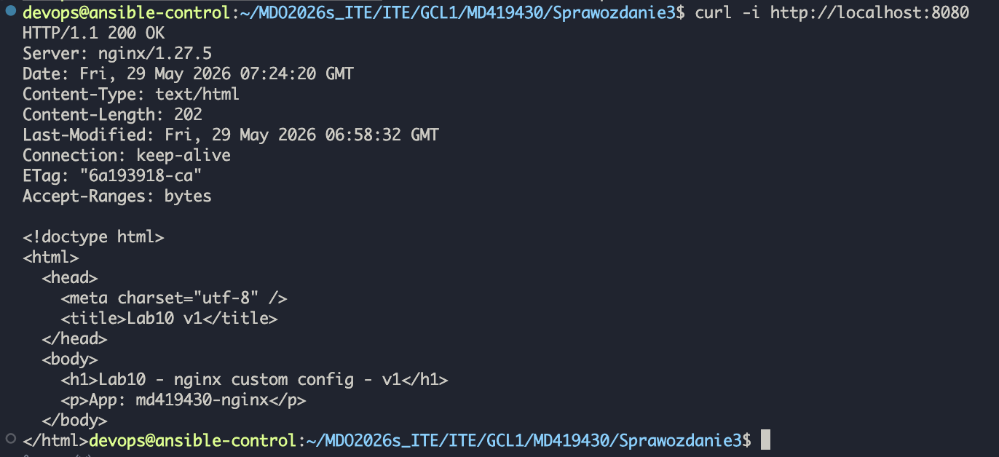

------------------------------------------------------------------------

## 3. Deployment i serwis

### Cel
Zapisanie wdrożenia w plikach YAML, uruchomienie deploymentu z replikami oraz wystawienie serwisu.

------------------------------------------------------------------------

### Krok 1. Wdrożenie i serwis z plików YAML

`deployment.yaml` (fragment):
```yaml
apiVersion: apps/v1
kind: Deployment
metadata:
  name: md419430-nginx-deploy
spec:
  replicas: 4
  selector:
    matchLabels:
      app: md419430-nginx
      track: stable
  template:
    metadata:
      labels:
        app: md419430-nginx
        track: stable
        version: "v1"
    spec:
      containers:
        - name: md419430-nginx
          image: md419430-nginx:v1
          ports:
            - containerPort: 8080
  strategy:
    type: RollingUpdate
    rollingUpdate:
      maxUnavailable: 2
      maxSurge: 30%
```

`service.yaml`:
```yaml
apiVersion: v1
kind: Service
metadata:
  name: md419430-nginx-svc
spec:
  selector:
    app: md419430-nginx
  ports:
    - port: 8080
      targetPort: 8080
```

Zastosowanie plików:
```bash
mk apply -f deployment.yaml
mk apply -f service.yaml
mk rollout status deployment/md419430-nginx-deploy
mk get deploy,pods,svc
```

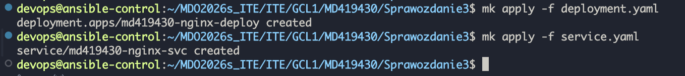
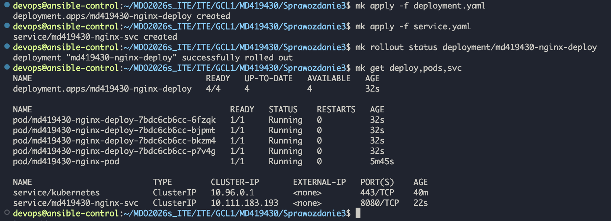

------------------------------------------------------------------------

### Krok 2. Port-forward do serwisu i test HTTP

```bash
mk port-forward svc/md419430-nginx-svc 8080:8080
curl -i http://localhost:8080
```

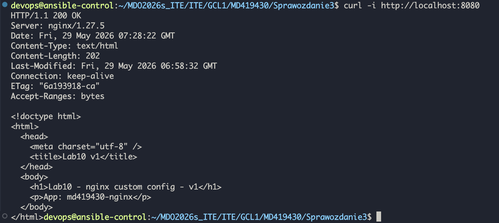

------------------------------------------------------------------------

## 4. Zmiany w deploymencie i strategie wdrożeń

### Cel
Skalowanie deploymentu, obserwacja rolloutów oraz przygotowanie canary deployment.

------------------------------------------------------------------------

### Krok 1. Obserwacja rolloutów i zmian liczby replik

```bash
mk get pods -w
```

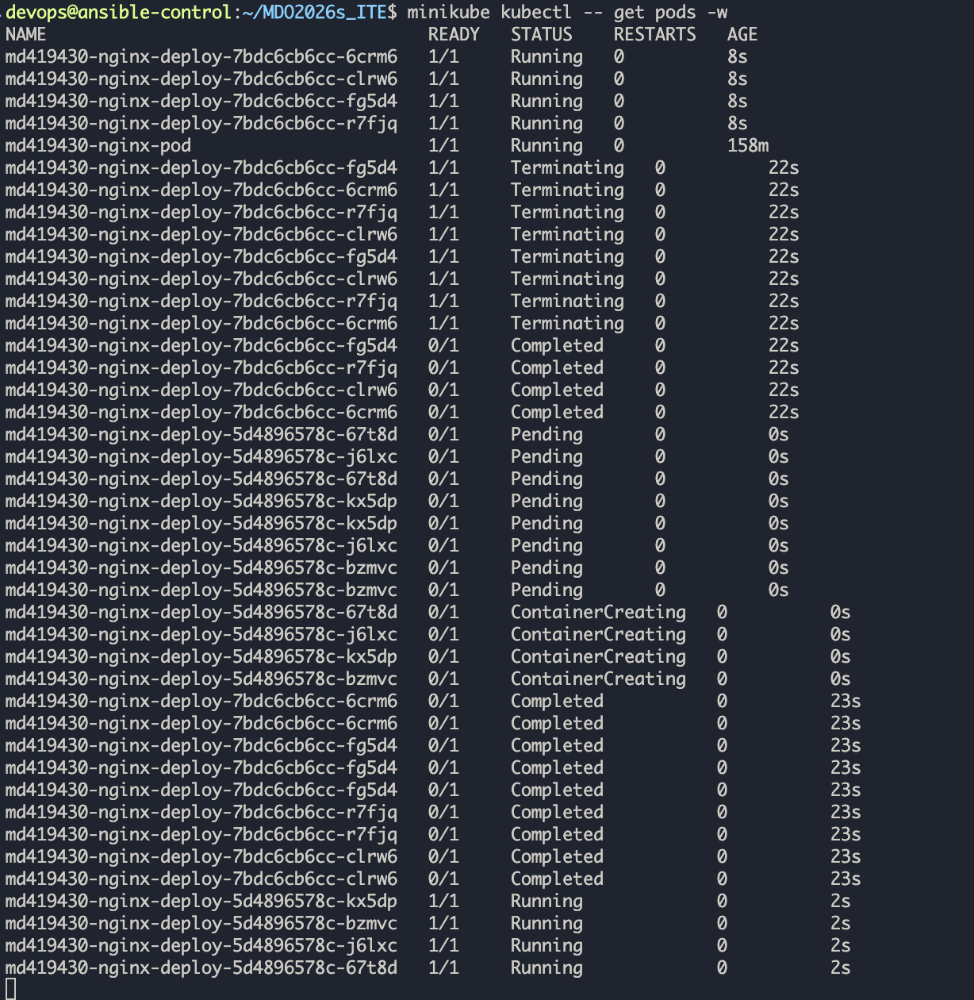
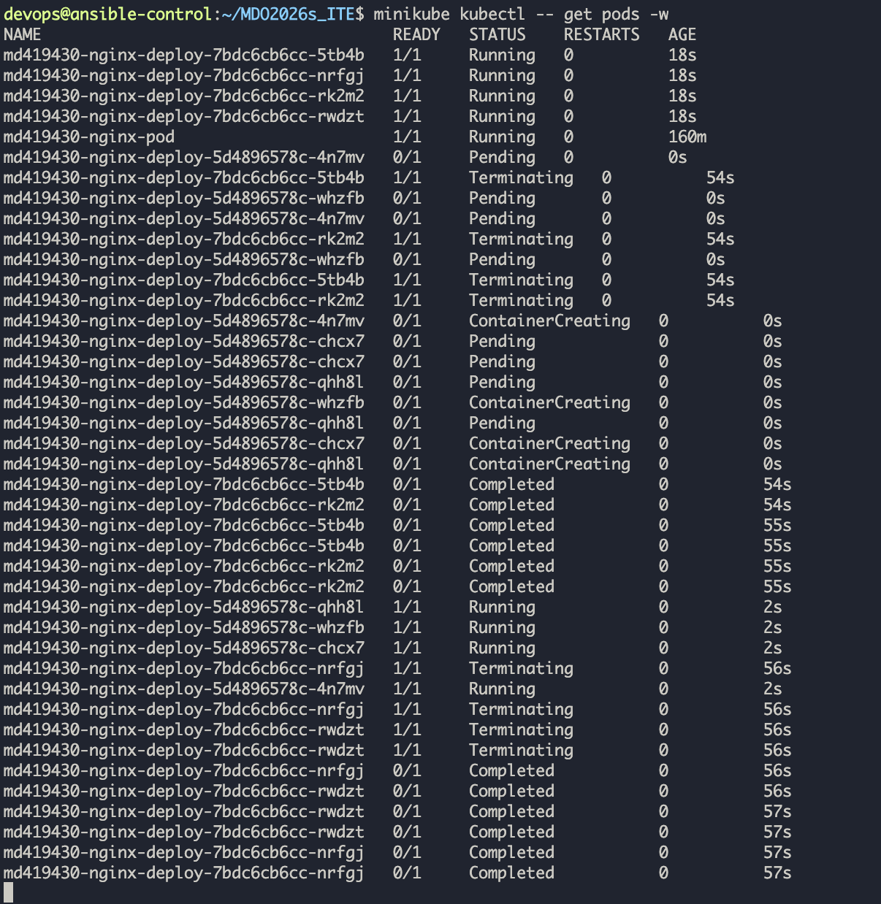

------------------------------------------------------------------------

### Krok 2. Canary deployment i etykiety
W pliku `deployment.yaml` zdefiniowano dodatkowy deployment canary (`md419430-nginx-deploy-canary`) z etykietą `track=canary` i obrazem w wersji v2.

```bash
mk get pods -l app=md419430-nginx --show-labels
```

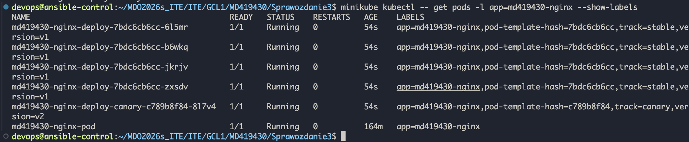

# Laboratorium 11

## 1. Wdrożenie deploymentu z dużą liczbą replik

### Cel
Celem zadania było wdrożenie serwera WWW (nginx z własną konfiguracją, przygotowanego w Lab 10) za pomocą pliku YAML z dużą liczbą replik, następnie wyeksponowanie dostępu do poda, deploymentu i serwisu na trzy sposoby oraz zweryfikowanie skalowania deploymentu — zarówno poleceniem, jak i poprzez zastosowanie nowego pliku YAML.

------------------------------------------------------------------------

### Krok 1. Wdrożenie 36 podów z pliku YAML

Na podstawie istniejącego `deployment.yaml` (z Lab 10) przygotowano nowy plik `deployment-36.yaml` ze zwiększoną liczbą replik do 36. Plik zawiera ten sam obraz `md419430-nginx:v1` i te same etykiety co poprzednio.

`deployment-36.yaml`:
```yaml
apiVersion: apps/v1
kind: Deployment
metadata:
  name: md419430-nginx-deploy
  labels:
    app: md419430-nginx
spec:
  replicas: 36
  selector:
    matchLabels:
      app: md419430-nginx
      track: stable
  template:
    metadata:
      labels:
        app: md419430-nginx
        track: stable
        version: "v1"
    spec:
      containers:
        - name: md419430-nginx
          image: md419430-nginx:v1
          imagePullPolicy: IfNotPresent
          ports:
            - containerPort: 8080
  strategy:
    type: RollingUpdate
    rollingUpdate:
      maxUnavailable: 2
      maxSurge: 30%
```

Wdrożenie i weryfikacja:
```bash
mk apply -f deployment-36.yaml
mk rollout status deployment/md419430-nginx-deploy
mk get pods | grep md419430 | wc -l
```

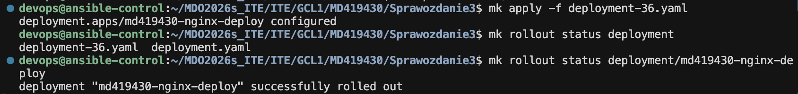


Wynik liczby podów wynosi 38: 36 replik głównego deploymentu, 1 pod canary (`md419430-nginx-deploy-canary`) oraz 1 pod singletonowy (`md419430-nginx-pod`) — pozostałości z poprzednich ćwiczeń. Wszystkie posiadają etykietę `app=md419430-nginx`.

------------------------------------------------------------------------

### Krok 2. Eksponowanie dostępu do jednego poda

Pobrano nazwę jednego z podów deploymentu, następnie przekierowano port bezpośrednio do niego:

```bash
mk get pods -l app=md419430-nginx
mk port-forward pod/md419430-nginx-deploy-7bdc6cb6cc-pvxwq 8080:8080
```

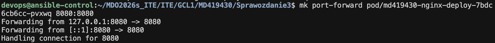

Test połączenia:
```bash
curl -i http://localhost:8080
```

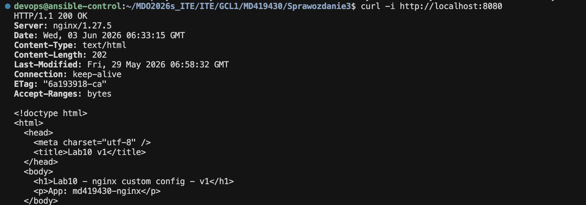

------------------------------------------------------------------------

### Krok 3. Eksponowanie dostępu do deploymentu

Przekierowanie portu skierowano bezpośrednio do obiektu deployment — Kubernetes sam wybrał jeden z dostępnych podów:

```bash
mk port-forward deployment/md419430-nginx-deploy 8080:8080
```

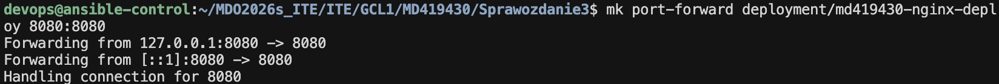

Test połączenia:
```bash
curl -i http://localhost:8080
```

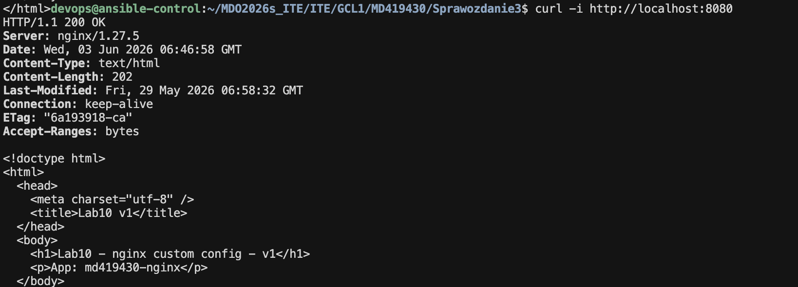

------------------------------------------------------------------------

## 2. Wystawienie serwisu

### Cel
Wyeksponowanie dostępu do wdrożonego deploymentu jako serwis — raz za pomocą dedykowanego polecenia `kubectl expose`, drugi raz przez zastosowanie dodatkowego pliku YAML.

------------------------------------------------------------------------

### Krok 1. Serwis dedykowanym poleceniem kubectl expose

```bash
mk expose deployment md419430-nginx-deploy \
  --name=md419430-nginx-svc-cmd \
  --port=8080 \
  --target-port=8080
mk get svc
```

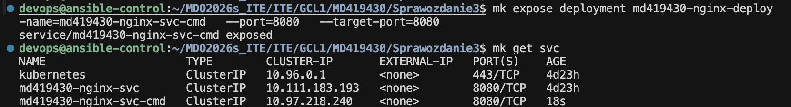

Na liście serwisów widoczne są dwa serwisy nginx: `md419430-nginx-svc` (istniejący z Lab 10) oraz nowo utworzony `md419430-nginx-svc-cmd` (typ ClusterIP, port 8080).

Przekierowanie portu do nowo utworzonego serwisu:
```bash
mk port-forward svc/md419430-nginx-svc-cmd 8080:8080
```

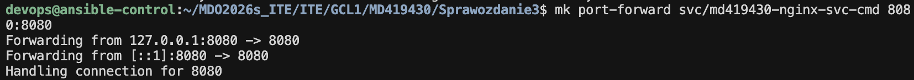

Test połączenia:
```bash
curl -i http://localhost:8080
```

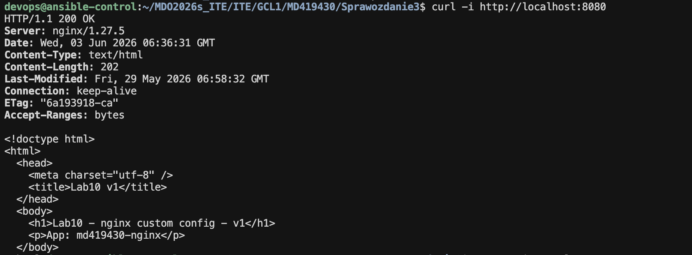

------------------------------------------------------------------------

### Krok 2. Serwis z pliku YAML

Serwis `md419430-nginx-svc` zdefiniowany w `service.yaml` (przygotowanym w Lab 10) został ponownie zaaplikowany:

`service.yaml`:
```yaml
apiVersion: v1
kind: Service
metadata:
  name: md419430-nginx-svc
spec:
  selector:
    app: md419430-nginx
  ports:
    - port: 8080
      targetPort: 8080
```

```bash
mk apply -f service.yaml
mk get svc
mk port-forward svc/md419430-nginx-svc 8080:8080
```

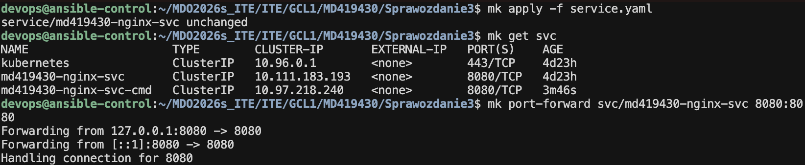

Serwis istniał już z poprzednich zajęć (`unchanged`). Po ponownym zastosowaniu pliku oba serwisy nginx widoczne są na liście. Przekierowanie portu do `md419430-nginx-svc` i test połączenia:

```bash
curl -i http://localhost:8080
```

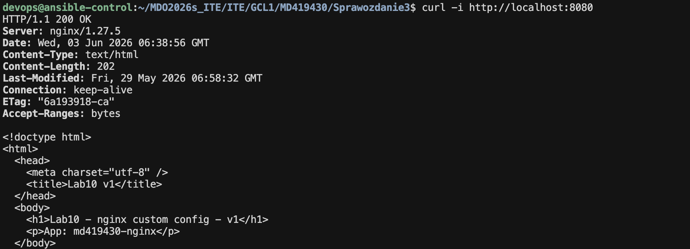

------------------------------------------------------------------------

## 3. Skalowanie wdrożenia

### Cel
Przeskalowanie deploymentu za pomocą dyrektywy `scale` oraz za pomocą zastosowania nowego pliku YAML, z pokazaniem różnicy między oboma plikami.

------------------------------------------------------------------------

### Krok 1. Skalowanie poleceniem kubectl scale

Skalowanie w górę do 50 replik i weryfikacja:
```bash
mk scale deployment/md419430-nginx-deploy --replicas=50
mk get pods | grep md419430 | wc -l
```

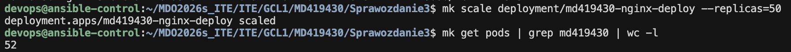

Wynik 52 uwzględnia również pod canary oraz pod singletonowy z poprzednich ćwiczeń (oba mają etykietę `app=md419430-nginx`).

Skalowanie w dół do 10 replik:
```bash
mk scale deployment/md419430-nginx-deploy --replicas=10
mk rollout status deployment/md419430-nginx-deploy
mk get pods | grep md419430 | wc -l
```

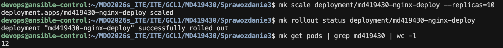

------------------------------------------------------------------------

### Krok 2. Skalowanie przez zastosowanie nowego pliku YAML

Przygotowano `deployment-10.yaml` jako kopię `deployment-36.yaml` z jedyną zmianą — liczbą replik:

```bash
cp deployment-36.yaml deployment-10.yaml
# edycja: replicas: 36  -  replicas: 10
diff deployment-36.yaml deployment-10.yaml
```

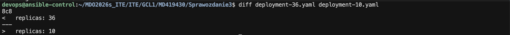

Jedyną różnicą między oboma plikami YAML jest wartość pola `spec.replicas` (linia 8).

Zastosowanie i weryfikacja:
```bash
mk apply -f deployment-10.yaml
mk rollout status deployment/md419430-nginx-deploy
mk get pods | grep md419430 | wc -l
```

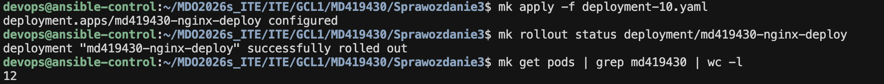

------------------------------------------------------------------------

## 4. Bonus: identyfikacja aktywnego poda

### Cel
Sprawdzenie, do którego poda trafiają zapytania po przeskalowaniu deploymentu, na podstawie logów nginx.

------------------------------------------------------------------------

### Krok 1. Podgląd logów wielu podów jednocześnie

Uruchomiono przekierowanie portu do serwisu w tle, a następnie wysłano serię zapytań HTTP:

```bash
mk port-forward svc/md419430-nginx-svc 8080:8080 &
for i in {1..10}; do curl -s http://localhost:8080 > /dev/null; done
```

Jednocześnie w osobnym terminalu obserwowano logi wszystkich podów z prefiksem nazwy poda:

```bash
minikube kubectl -- logs -l app=md419430-nginx --prefix=true -f --max-log-requests 12
```

Fragment wyjścia:
```
[pod/md419430-nginx-deploy-7bdc6cb6cc-zxsdv/md419430-nginx] 127.0.0.1 - - [03/Jun/2026:06:55:37 +0000] "GET / HTTP/1.1" 200 202 "-" "curl/8.5.0"
[pod/md419430-nginx-deploy-7bdc6cb6cc-zxsdv/md419430-nginx] 127.0.0.1 - - [03/Jun/2026:06:55:37 +0000] "GET / HTTP/1.1" 200 202 "-" "curl/8.5.0"
[pod/md419430-nginx-deploy-7bdc6cb6cc-zxsdv/md419430-nginx] 127.0.0.1 - - [03/Jun/2026:06:55:37 +0000] "GET / HTTP/1.1" 200 202 "-" "curl/8.5.0"
[pod/md419430-nginx-deploy-7bdc6cb6cc-vvnl5/md419430-nginx] /docker-entrypoint.sh: Configuration complete; ready for start up
```

Z logów wynika, że polecenie `port-forward` dla serwisu konsekwentnie kierowało ruch do tego samego poda (`zxsdv`). Jest to zachowanie zgodne z mechaniką `port-forward` — tworzy ono stałe połączenie z jednym, wybranym w momencie uruchomienia podem, w odróżnieniu od rzeczywistego load balancera, który rozkładałby ruch równomiernie. W logach widoczny jest również pod `vvnl5` kończący inicjalizację (`Configuration complete`) — efekt wcześniejszego skalowania.
