# Sprawozdanie - Zajęcia 01

## 1. Konfiguracja środowiska i Git
W ramach zadania zainstalowano klienta Git oraz skonfigurowano dane użytkownika:

* **Instalacja Git**: Wykorzystano komendę `sudo apt install git -y`.
* **Konfiguracja**: Ustawiono `user.name` jako "PaloneAppEnjoyer" oraz `user.email`.
* **Klonowanie HTTPS**: Repozytorium przedmiotowe zostało sklonowane przy użyciu protokołu HTTPS.

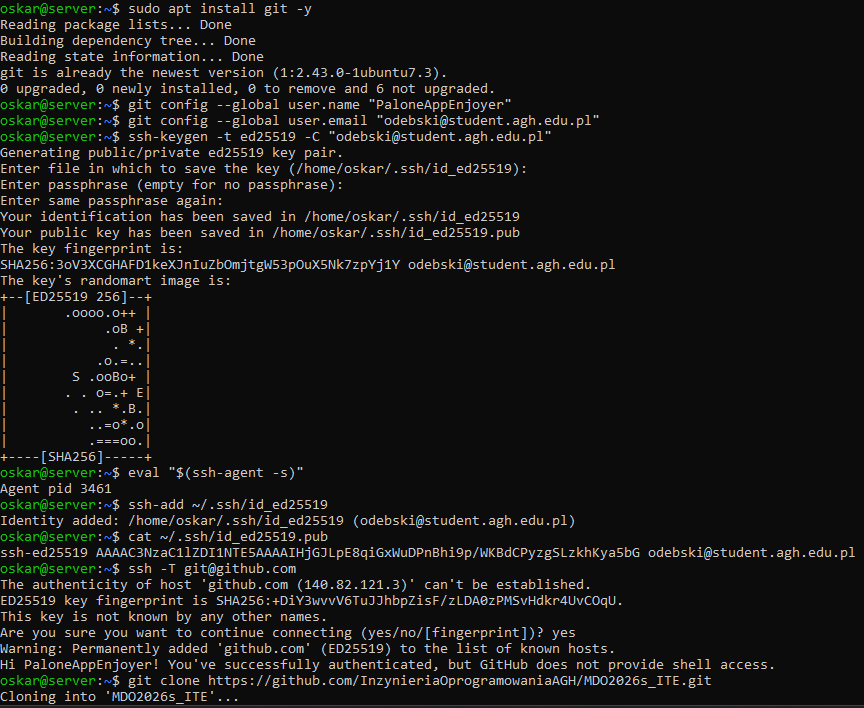

## 2. SSH i Bezpieczeństwo
Skonfigurowano bezpieczny dostęp do serwisu GitHub przy użyciu kluczy SSH:

* **Generowanie klucza**: Utworzono klucz typu **ED25519** komendą `ssh-keygen -t ed25519`.
* **Dodanie klucza do agenta**: Klucz został dodany do `ssh-agent`, co pozwala na uwierzytelnianie bez każdorazowego wpisywania hasła.
* **GitHub**: Klucz publiczny o nazwie "devops" został dodany do profilu GitHub, co potwierdzono testowym połączeniem `ssh -T git@github.com`.

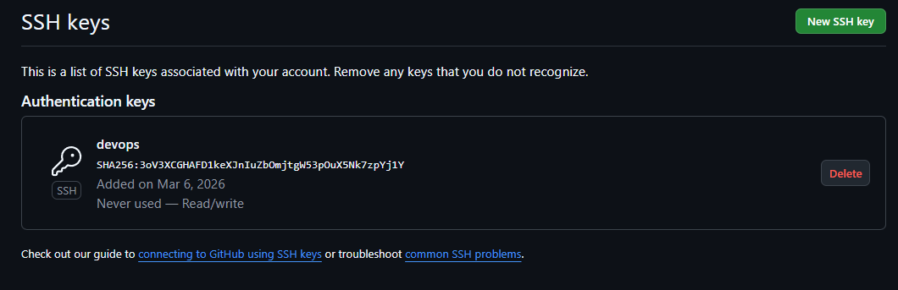

## 3. Zarządzanie gałęziami (Branches)
Praca z repozytorium odbywała się zgodnie ze strukturą grupową:

* Przełączono się na gałąź grupy: `git switch OD423299`.
* Nawigowano do odpowiedniej ścieżki katalogów: `ITE/GCL1`.
* Zgodnie z poleceniem, przygotowano strukturę pod nową gałąź i katalog o nazwie bazującej na inicjałach i numerze indeksu.

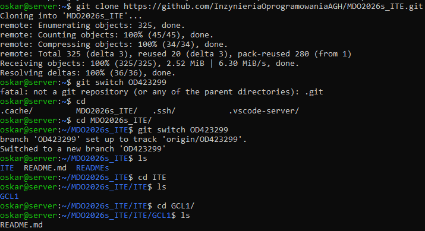

## 4. Narzędzia i wymiana plików
Do zarządzania plikami oraz pracy zdalnej skonfigurowano:
* **Visual Studio Code**: Zdalny dostęp do maszyny wirtualnej.
* **FileZilla**: Zapewniono natychmiastową wymianę plików między maszyną lokalną a serwerem za pomocą protokołu SFTP.

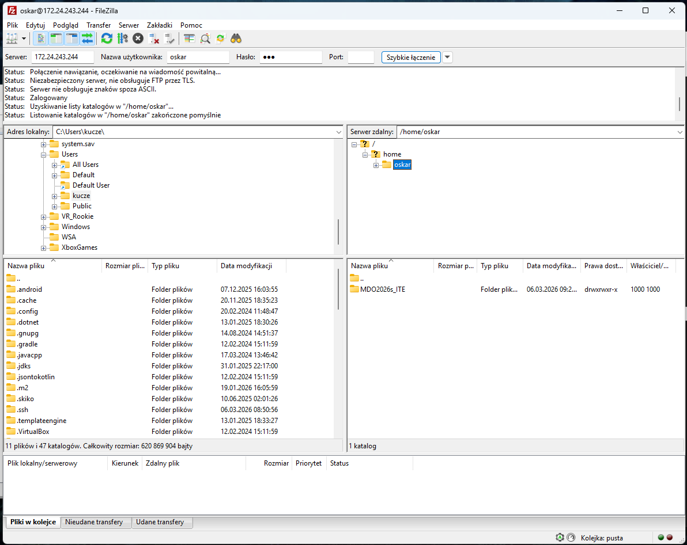

## 5. Git Hook (Zadanie do uzupełnienia)
> **Notatka**: Ze względu na przeoczenie, skrypt Git hook weryfikujący format commit message nie został zaimplementowany w trakcie trwania bieżących zadań. Zostanie on przygotowany i dodany do katalogu w późniejszym terminie, a informacja o jego działaniu zostanie umieszczona później.

# Zajęcia 02
## 1. Instalacja środowiska Docker
Zgodnie z zaleceniami, zainstalowano silnik Docker korzystając z repozytorium dystrybucji Ubuntu, unikając pakietów Snap.

* **Instalacja**: Wykonano komendę `sudo apt install docker.io`.
* **Konfiguracja uprawnień**: Dodano użytkownika do grupy `docker` (`sudo usermod -aG docker $USER`), aby umożliwić uruchamianie kontenerów bez konieczności stałego używania `sudo`.
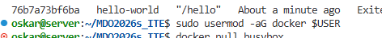
* **Aktywacja grupy**: Zastosowano `newgrp docker`, co pozwoliło na natychmiastowe uruchomienie kontenera `hello-world`.
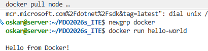

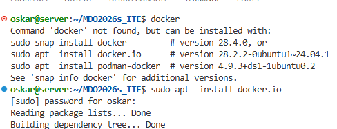
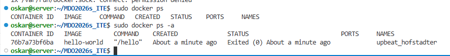

## 2. Przegląd obrazów i kontenerów
Zapoznano się z sugerowanymi obrazami z Docker Hub, pobierając i uruchamiając podstawowe dystrybucje oraz runtime'y.

* **Obrazy lokalne**: Pobrano m.in. `ubuntu`, `fedora`, `mariadb`, `node` oraz obrazy SDK i runtime dla .NET.
* **Rozmiary**: Największym z pobranych obrazów był `node` (1.13GB), natomiast najmniejszym `busybox` (4.43MB).
* **Uruchomione kontenery**: Wyświetlono listę wszystkich kontenerów (`docker ps -a`), w tym te, które zakończyły już pracę z kodem wyjścia `0`.

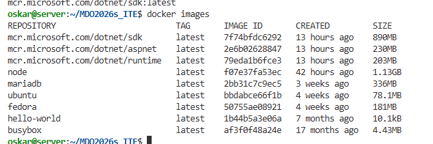

## 3. Praca interaktywna w kontenerach
Przeprowadzono testy interaktywne wewnątrz kontenerów BusyBox oraz Ubuntu.

* **BusyBox**: Uruchomiono tryb interaktywny (`docker run -it busybox`), w którym zweryfikowano wersję systemu (v1.37.0).
* **Ubuntu (PID1 i procesy)**: 
    * W kontenerze Ubuntu polecenie `cat /proc/1/comm` potwierdziło, że procesem o ID 1 jest `bash`.
    * Na hoście zweryfikowano procesy za pomocą `ps -ef`, widząc kontener działający pod kontrolą `containerd-shim`.
* **Aktualizacja**: Wewnątrz kontenera Ubuntu wykonano pełną aktualizację pakietów (`apt update && apt upgrade -y`).

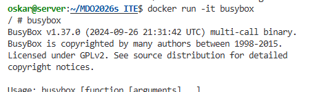
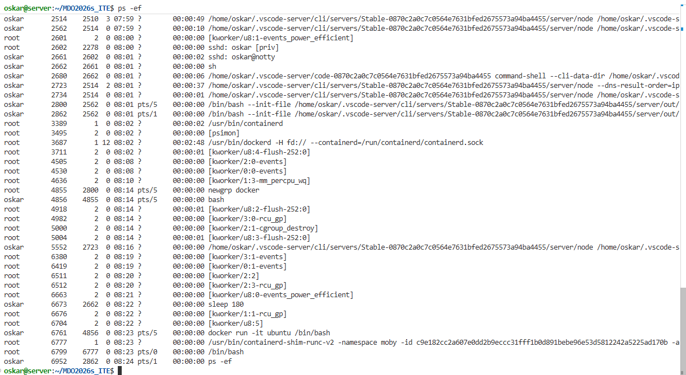

## 4. Budowa własnego obrazu (Dockerfile)
Stworzono i zbudowano własny obraz `lab2docker` bazujący na lekkiej dystrybucji Alpine.

* **Dockerfile**: Skonfigurowano plik tak, aby obraz zawierał zainstalowanego klienta `git` oraz sklonowane repozytorium przedmiotowe.
<code> FROM:3.19 
WORKDIR /app 
RUN apk add git 
RUN git clone https://github.com/InzynieriaOprogramowaniaAGH/MDO2026s_ITE.git . 
CMD ["/bin/sh"]</code>  
* **Build**: Obraz zbudowano poleceniem `docker build -t lab2docker .`.
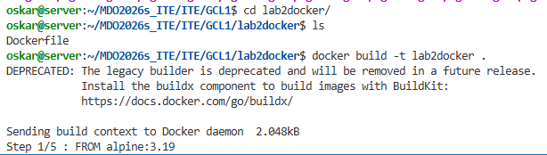
* **Weryfikacja**: Po uruchomieniu kontenera (`docker run -it lab2docker`) potwierdzono obecność sklonowanych plików w katalogu `/app`.
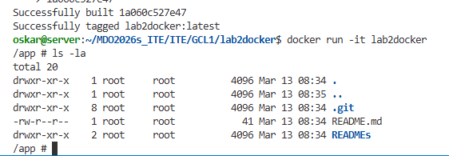

## 5. Porządki w magazynie Docker
Po zakończeniu prac wyczyszczono lokalne środowisko.

* **Usuwanie kontenerów**: Polecenie `docker container prune` usunęło wszystkie zatrzymane kontenery, odzyskując ponad 70MB miejsca.
* **Obrazy**: Wyczyszczono nieużywane warstwy i obrazy za pomocą `docker image prune`.

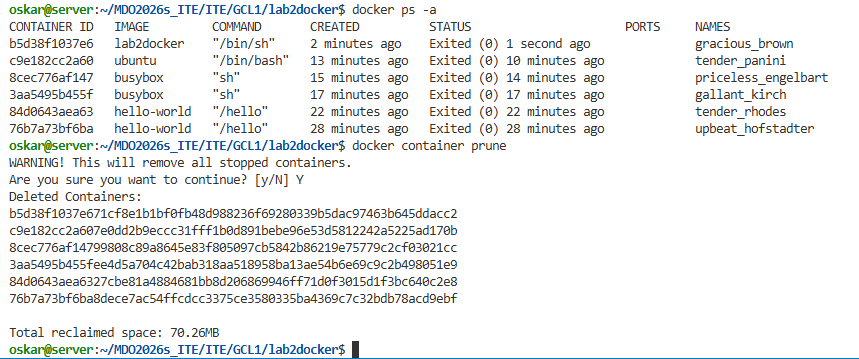
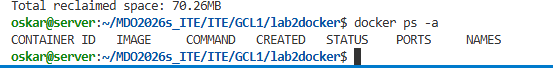

# Zajęcia 03

## 1. Wybór oprogramowania i budowanie interaktywne
Do realizacji zadań wybrano bibliotekę **zlib** (autorstwa Marka Adlera), która dysponuje otwartą licencją oraz standardowym systemem budowania opartym na pliku `Makefile`.

* **Klonowanie i zależności**: Wewnątrz kontenera z obrazem `fedora` zainstalowano niezbędne narzędzia: `git`, `gcc` oraz `make`.
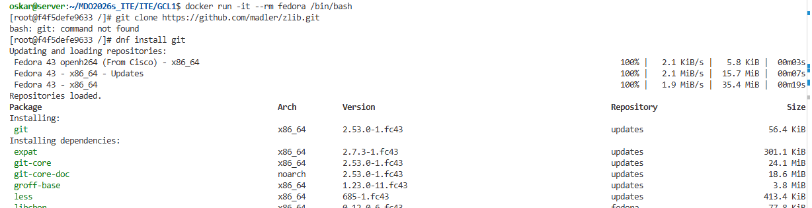
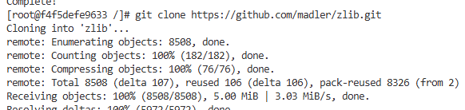
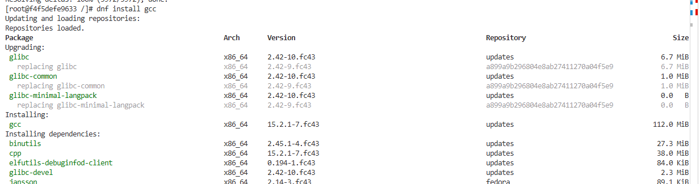
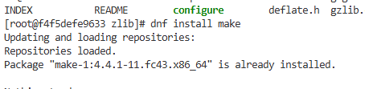
* **Proces build**: Wykonano konfigurację środowiska poleceniem `./configure`, a następnie skompilowano bibliotekę za pomocą `make`.
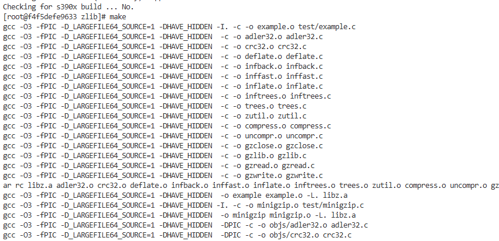
* **Testy jednostkowe**: Poprawność kompilacji zweryfikowano uruchamiając wbudowane testy poleceniem `make test`. Proces zakończył się raportem „zlib test OK”, „zlib shared test OK” oraz „zlib 64-bit test OK”.
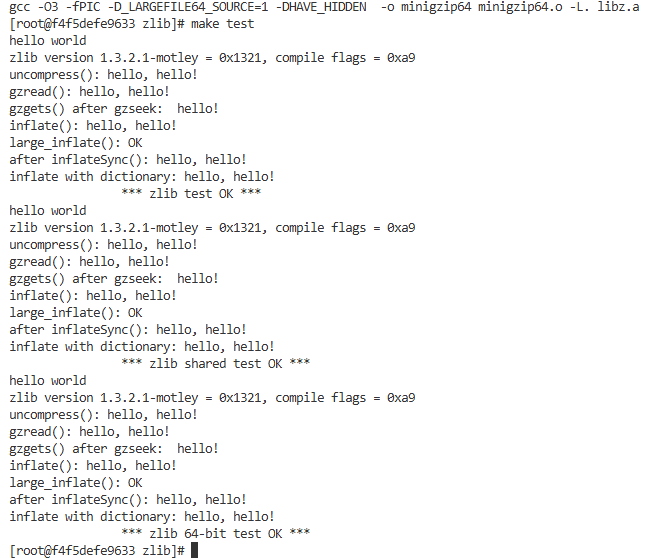

## 2. Automatyzacja: Dockerfile i konteneryzacja etapu
Zgodnie z wymaganiami stworzono dwa pliki `Dockerfile`, aby rozdzielić etap budowania od etapu testowania.

### Krok 1: Budowanie (Dockerfile.zlib.bld)
Ten etap przygotowuje środowisko, klonuje kod źródłowy i kompiluje artefakty.
<code> FROM fedora 
RUN dnf install -y git gcc make  
RUN git clone https://github.com/madler/zlib.git 
WORKDIR /zlib 
RUN ./configure 
RUN make<code>
* **Obraz bazowy**: `fedora`.
* **Instrukcje**: Instalacja pakietów, klonowanie repozytorium do `/zlib` i wykonanie `make`.
* **Budowa obrazu**: `docker build -t zlibbld -f Dockerfile.zlib.bld .`.
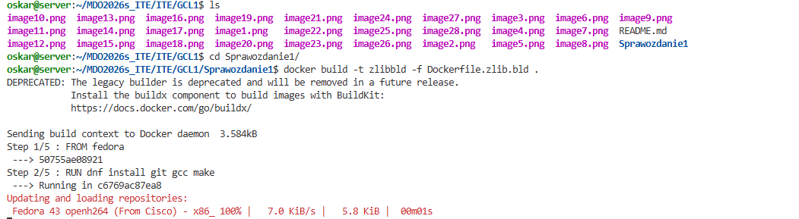

### Krok 2: Testowanie (Dockerfile.zlib.test)
Ten etap bazuje na skompilowanym wcześniej obrazie, aby przeprowadzić walidację bez ponownego budowania.
<code> FROM zlibbld 
WORKDIR /zlib 
RUN ls 
RUN make -B test </code>
* **Obraz bazowy**: `zlibbld`.
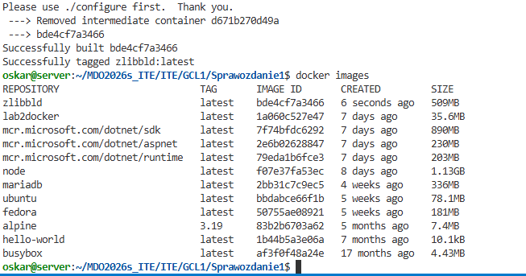
* **Instrukcje**: Wymuszenie ponownego uruchomienia testów za pomocą `make -B test`.
* **Budowa obrazu**: `docker build -t zlibtest -f Dockerfile.zlib.test .`.
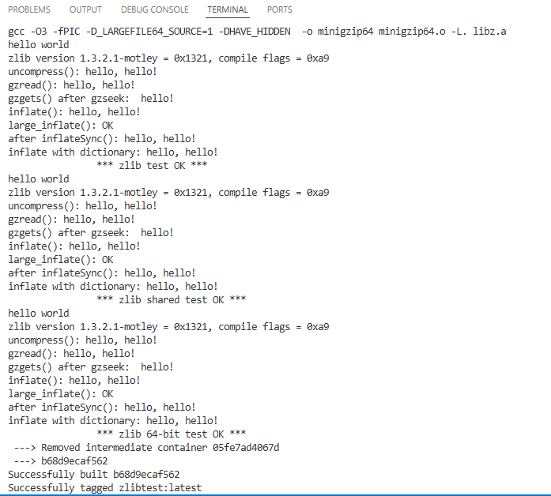

## 3. Weryfikacja obrazów
Po zakończeniu automatyzacji sprawdzono dostępność obrazów w lokalnym magazynie:
* Obraz `zlibbld` zajmuje ok. **509MB**.
* Potwierdzono, że każdy krok `Dockerfile` tworzy warstwę (intermediate container), co zapewnia powtarzalność procesu CI.

## 4. Dyskusja nad wdrożeniem (Deploy)
Na podstawie przeprowadzonego procesu budowania biblioteki `zlib`:

* **Charakter programu**: Biblioteka `zlib` jest komponentem systemowym (nieinteraktywnym). Sam kontener służy tutaj głównie jako **środowisko budowania (Build Environment)**.
* **Finalny artefakt**: Program nie powinien być publikowany jako cały kontener `zlibbld` (zawierający kompilatory i kod źródłowy). Finalnym artefaktem powinny być pliki binarne (np. `libz.so`) spakowane do pakietu dystrybucyjnego (np. **RPM** dla Fedory lub **DEB** dla Ubuntu).
* **Oczyszczanie**: W procesie produkcyjnym należy zastosować *Multi-stage build*, aby w końcowym obrazie nie znajdowały się narzędzia typu `gcc` czy katalog `.git`, co znacząco zredukuje rozmiar i zwiększy bezpieczeństwo.

# Zajęcia 04

## 1. Zarządzanie stanem: Woluminy i Bind Mounts
W celu zachowania danych między sesjami kontenerów przetestowano mechanizmy woluminów oraz montowania katalogów lokalnych.

* **Woluminy**: Utworzono dwa woluminy: `vol_wejsciowy` oraz `vol_wyjsciowy`.
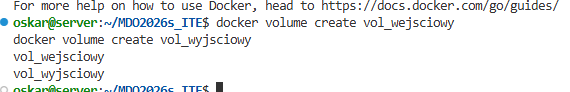
To podejście jest zgodne z filozofią mikroserwisów — obraz aplikacji powinien być jak najlżejszy i zawierać tylko niezbędne biblioteki uruchomieniowe. Git jest potrzebny tylko na etapie pobierania kodu, więc użycie wyspecjalizowanego "helpera" pozwala utrzymać główny obraz w czystości.
* **Klonowanie bez Gita**: Repozytorium zostało sklonowane bezpośrednio na wolumin `vol_wejsciowy` przy użyciu pomocniczego obrazu `alpine/git`. Pozwoliło to na dostarczenie kodu do kontenera bazowego, który sam nie posiadał zainstalowanego Gita.
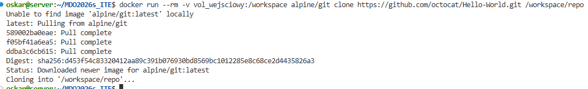
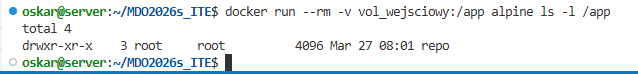
* **Bind Mounts**: Przetestowano montowanie katalogów hosta za pomocą flagi `-v "$(pwd)/bind_in:/app"`, co umożliwiło bezpośrednią edycję plików na maszynie lokalnej i ich natychmiastową dostępność w kontenerze.
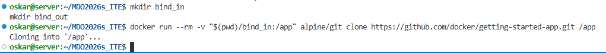
 
To najlepsza metoda do tworzenia oprogramowania. Pozwala ona na edycję kodu w lokalnym IDE, a zmiany są natychmiast widoczne wewnątrz kontenera bez konieczności ponownego budowania obrazu (docker build).

## 2. Łączność sieciowa i IPerf3
Przeprowadzono testy przepustowości oraz komunikacji między kontenerami w różnych konfiguracjach sieciowych.

* **Sieć domyślna (Bridge)**: Uruchomiono serwer `iperf3` w kontenerze o nazwie `iperf-server`. Adres IP (172.17.0.2) zidentyfikowano poleceniem `docker exec ... hostname -I`. Klient połączył się pomyślnie, osiągając transfer rzędu 21 Gbits/sec.
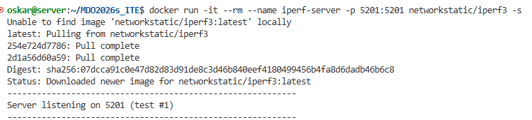
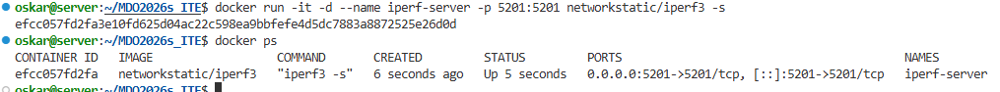
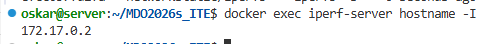
* **Sieć dedykowana**: Utworzono sieć `siec-testowa`. Dzięki niej kontenery mogły komunikować się po **nazwach** (DNS), co sprawdzono łącząc się z `iperf-server` zamiast po adresie IP. Utworzono nowy kontener o nazwie `iperf-client` o adresie IP 172.17.0.3.
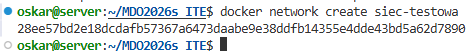
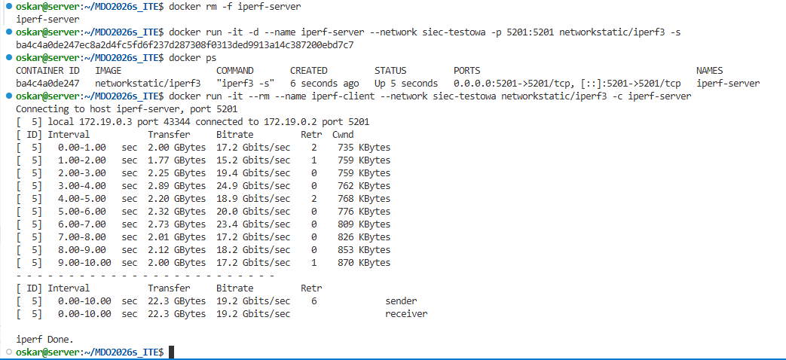
* **Łączność z hosta**: Po zainstalowaniu `iperf3` na hoście, nawiązano połączenie z kontenerem poprzez zmapowany port `5201`.
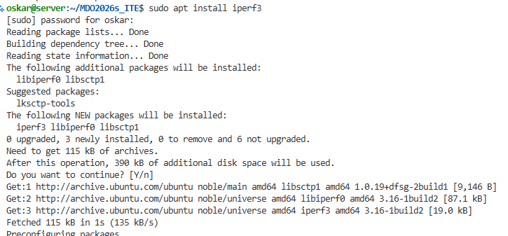
z hosta:
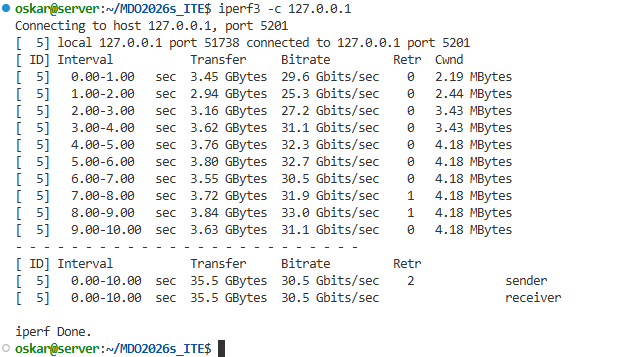
spoza hosta (komputer Windows):
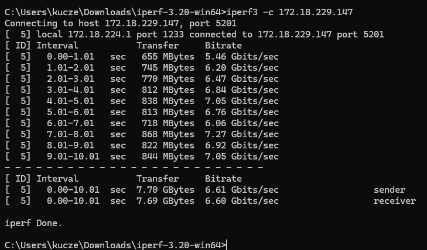
## 3. Usługa SSH wewnątrz kontenera
Skonfigurowano kontener Ubuntu jako serwer SSH, co pozwala na zdalne zarządzanie jego wnętrzem.

* **Instalacja**: W kontenerze zainstalowano pakiet `openssh-server` oraz skonfigurowano hasło dla użytkownika root.
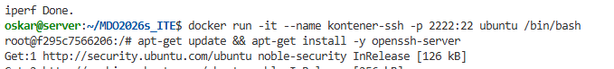
* **Konfiguracja**: Zmodyfikowano plik `/etc/ssh/sshd_config`, aby umożliwić logowanie na konto root (`PermitRootLogin yes`).
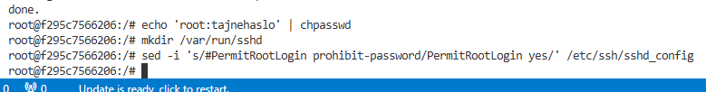
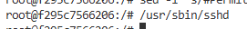
* **Uruchomienie kontenera i serwera ssh**
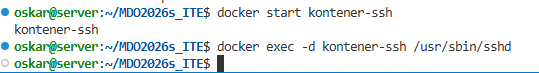
* **Dostęp**: Połączenie nawiązano z hosta poleceniem `ssh root@127.0.0.1 -p 2222`, wykorzystując przekierowanie portów.
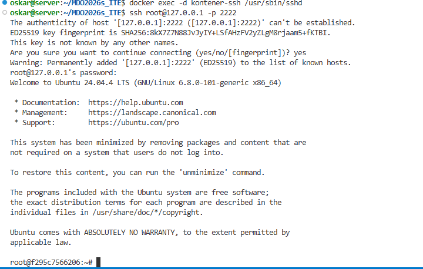

## 4. Uruchomienie instancji Jenkins (DIND)
Zestawiono środowisko CI/CD oparte na Jenkinsie, wykorzystując mechanizm Docker-in-Docker (DIND).

* **Sieć i pomocnik DIND**: Utworzono dedykowaną sieć `jenkins` i uruchomiono kontener `docker:dind` w trybie uprzywilejowanym.
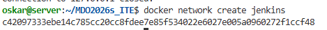
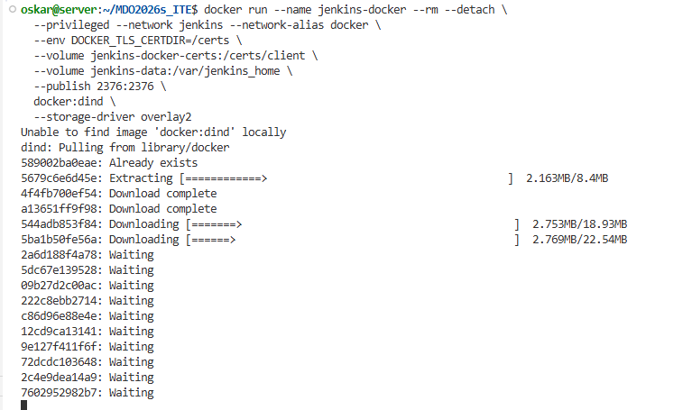
* **Własny obraz Jenkins**: Stworzono plik Dockerfile.jenkins oraz zbudowano obraz na bazie `jenkins/jenkins:2.440.1-jdk17`, doinstalowując w nim klienta `docker-ce-cli`, aby Jenkins mógł wydawać polecenia systemowi Docker.
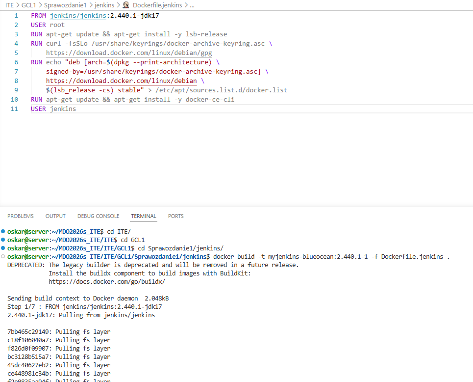
* **Inicjalizacja**: Po uruchomieniu kontenera `jenkins-blueocean`, odczytano początkowe hasło administratora z logów kontenera i przeprowadzono wstępną konfigurację w przeglądarce.
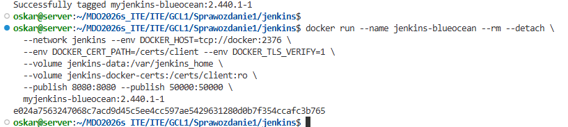
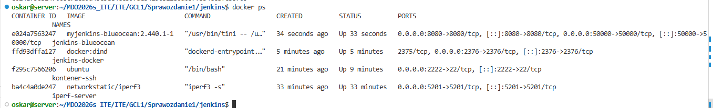
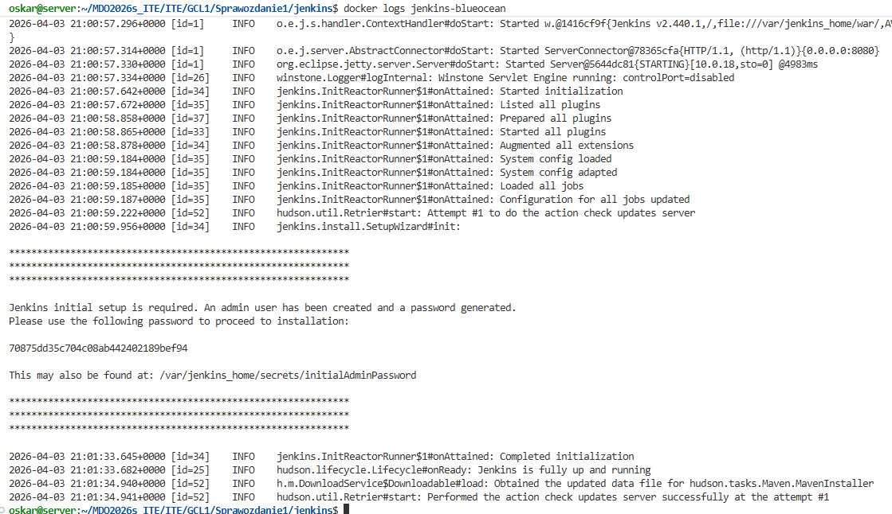
Ekran logowania:
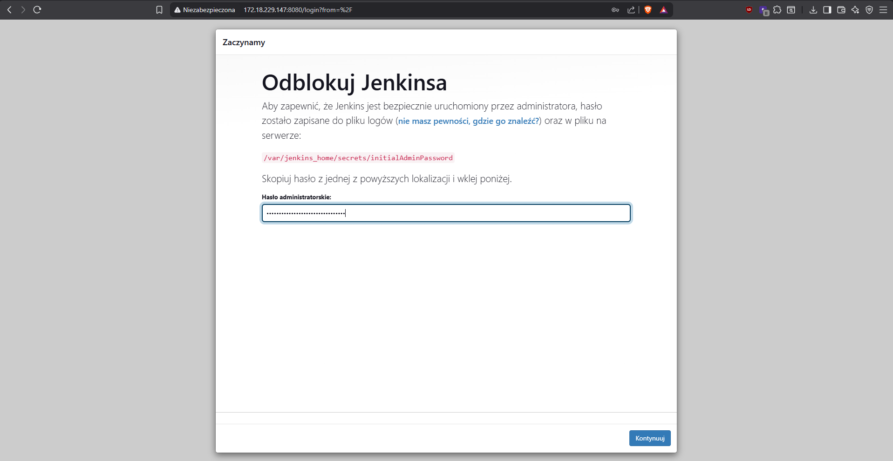
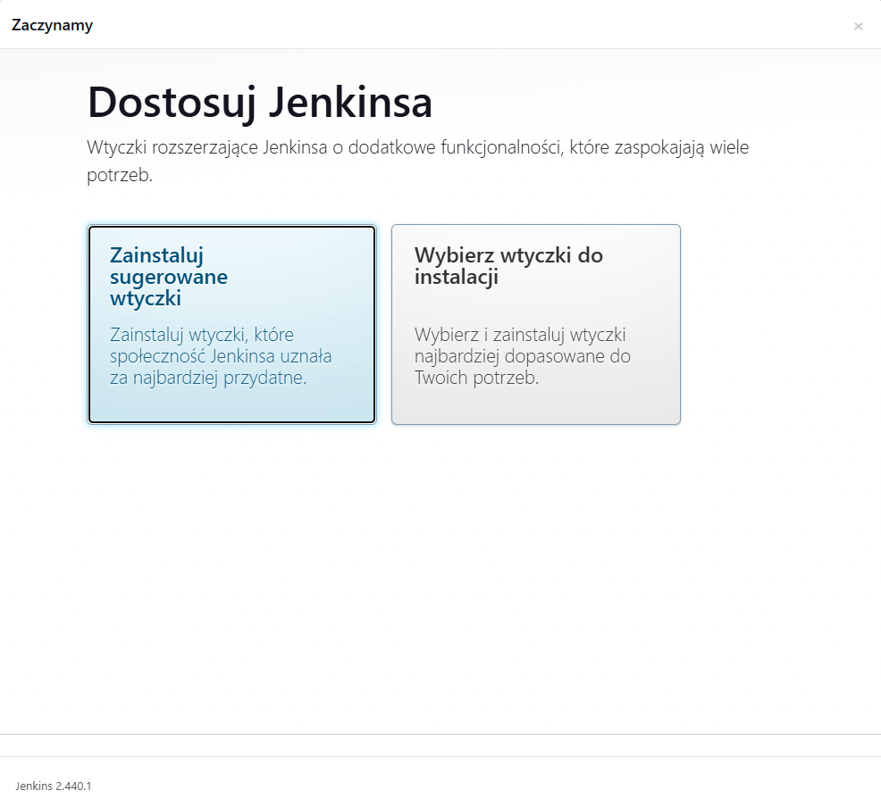

## Podsumowanie i dyskusja
* **SSH w kontenerze**: Jest to rozwiązanie przydatne w celach edukacyjnych lub specyficznych narzędziach, jednak w produkcji zazwyczaj unika się SSH na rzecz `docker exec`, aby zachować lekkość kontenerów.
* **Woluminy vs Bind Mounts**: Woluminy są preferowane do trwałego przechowywania danych (np. bazy danych), podczas gdy bind mounts świetnie sprawdzają się w procesie developmentu (kod źródłowy).