# Sprawozdanie nr 1

#### Wszystkie zadania wykonałam na Ubuntu Server 24.04 LTS w Hyper-V, poprzez połączenie zdalne przez protokół SSH z poziomu Visual Studio Code.

# Lab 1

### Moim pierwszym zadaniem było przygotowanie klienta Git. Po upewnieniu się, że pakiet jest zainstalowany, sklonowałam repozytorium przedmiotu. Z racji, że GitHub nie wspiera uwierzytelniania zwykłym hasłem, wykorzystałam protoków HTTPS i Personal Acces Token, który wygenerowałam wcześniej w ustawieniach deweloperskich mojego konta na GitHubie.

### Następnie w celu zwiększenia bezpieczeństwa, skonfigurowałąm dostęp przez SSH. Zgodnie z instrukcją utworzyłam dwa różne klucze - klucz standardowy i klucz zabezpieczony hasłem, wymagający podania hasła przy każdej próbie użycia.


### Następnie dodałam klucz publiczny do mojego profilu na GitHubie i sprawdziłam połączenie. Z racji, że miałam już skondfigurowane uwierzytelnianie dwuskładnikowe to pominęłam ten etap. 

### Następnie sprawdziłam adres ip mojej maszyny wirtualnej, aby móc się z nią połączyć przez Visual Studio Code za pomocą wtyczki Remote SSH.


### Następnie przetestowałam natychmiastowe przesyłanie plikó programem FileZilla przenosząc plik hej.txt.


 

 


### W kolejnym kroku w odpowiedniej gałęzi grupy utworzyłam swoją gałąź o nazwie PB422021 i zaczęłam na niej prace. Napisałam Git hooka, weryfikującego każdego commita, aby zaczynał się od nazwy mojej gałęzi.


### treść hooka:
```bash
#!/bin/bash
INPUT_FILE=$1
START_LINE=$(head -n 1 "$INPUT_FILE")
if [[ ! $START_LINE =~ ^PB422021 ]]; then
  echo "BŁĄD: Commit message musi zaczynać się od PB422021"
  exit 1
fi
```
### Jako ostatni krok nadałam odpowiednie uprawnienia dla hooka.


 


# Lab2

### W pierwszej kolejności zainstalowałam dockera w moim środowisku.

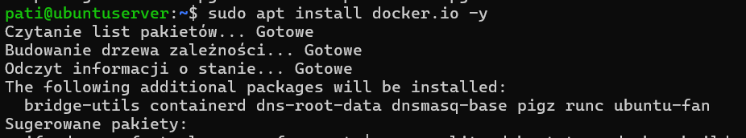
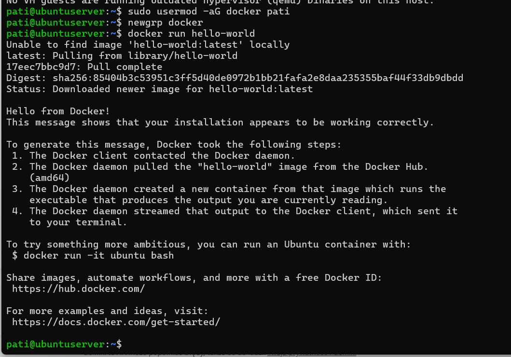

### Następnie zpaoznałam się z wypisanymi w instrukcji obrazami i kolejno każdy z nich uruchomiłam, sprawdziłam rozmiary oraz kody wyjścia komendą `echo $?`.


### Uruchomiłam kontener Busybox w trybie interaktywnym i sprawdziłam nr wersji. Tryb interaktywny pozwolił na bezpośrednią pracę w powłoką wewnątrz kontenera.

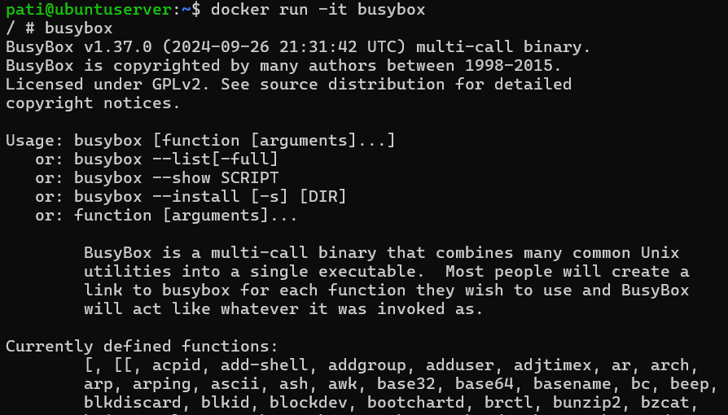

### Następnie uruchomiłam kontener z obrazem ubuntu, aby zweryfikować izolację procesów.  

### W kontenerze polecenie `ps -ef` wykazało, że procesem o PID 1 jest mojapowłoka /bin/bash, co oznacza, że dla kontenera nie istnieje świat zewnętrzny.


### W tym samym czasie, w drugim terminalu SSH, sprawdziłam procesy dockera. Proces bash miał tam zupełnie inny numer PID. 


### Zaktualizowałam pakiety wewnątrz kontenera.


### Następnie stworzyłam własny plik Dockerfile, który automatyzuje przygotowanie środowiska z Gitem.

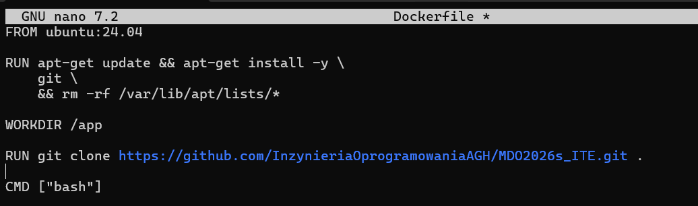

### Zbudowałam obraz:

.png)

### Uruchomiłam i zweryfikowałam (ls -la) zawartości sklonowanego repozytorium:


### Na koniec wyświetliłam wszytskie kontenery.

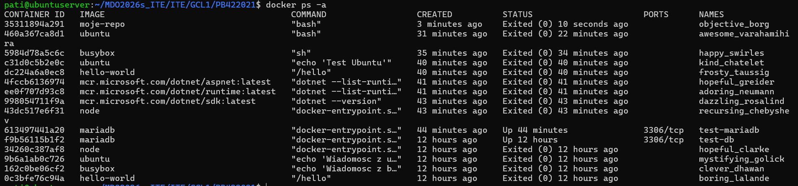

### Usunęłam zakończone kontenery:

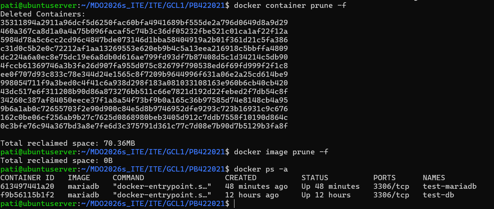


# LAB3 

### Do realizacji laboratorium wybrałam repozytorium NestJS TypeScript Starter: [NestJS TypeScript Starter](https://github.com/nestjs/typescript-starter.git). Spełnia on wymagania instrukcji - posiada skrypty budowania (npm run build) oraz testy jednostkowe (npm run test). Ma też licencję MIT.

 ### Po sklonowaniu repo na systemie Ubuntu Server próba zbudowania zakończyła się niepowodzeniem. Wybrane repozytorium wymaga środowiska Node.js w wersji >= 20, podczas gdy system operacyjny oferuje wersję 18.19.1.

 

 ### Z tego powodu przechodzę do wykonania kolejnej części instrukcji, aby wykonać to bez potrzeby instalacji nowej wersji node na ubuntu.

 ### Uruchomiałam i pobrałam nowy obraz node:20 
 
 

 ### Zainstalowałam gita 

  

 ### Sklonowałam repozytorium do folderu app.

  

### Repozytorium zostało pobrane poprawnie.

 

### Następnie zainstalowałam zależności. 
 

### Uruchomiłam build, po tej komendzie pojawił się nowy folder dist, co wskazuje na poprawne zbudowanie programu. 

 

### Następnie uruchomiłam testy, które przeszły poprawnie.

 


### W kolejnym kroku przeszłam do utworzenia plików Dockerfile, które zautomatyzują to co było wykonane wcześniej. 

### Dockerfile.build przygotowuje środowisko, klonuje kod i kompiluje aplikację.

Dockerfile.build:
```bash
FROM node:20

RUN apt-get update && apt-get install -y git && rm -rf /var/lib/apt/lists/*

WORKDIR /app

RUN git clone https://github.com/nestjs/typescript-starter.git .

RUN npm install
RUN npm run build

CMD ["npm", "run", "start:prod"]
```

 
 ### Dockerfile.test natomiast nie buduje aplikacji od nowa a dziedziczy wszystko po wcześniej napisanycm Dockerfile i tylko uruchamia testy.

Dockerfile.test:
```bash
FROM app-build

CMD ["npm", "run", "test"]
```

### Następnie zbudowałam program i przetestowałam przy użyciu napisanych Dockerfile'ów.

 
 

 ### W kolejnym kroku uruchomiłam kontener testowy:

 

### To, że i w tym przypadku testy przeszły poprawnie potwierdza poprawność wdrożenia.

 


 # LAB 4

### Pracę z woluminami rozpoczęłam w wersji bez zainstalowanego gita. Utworzyłąm zatem dwa woluminy - wejściowy i wyjściowy. Woluminy zostały utworzone niejawnie podczas uruchamiania kontenera przy użyciu flagi -v. Docker automatycznie zainicjalizował nazwane woluminy lab4_wejscie i lab4_wyjscie. 

### W pierwszej wersji przygotowałam kontener bazowy, który nie posiada gita, więc zrobiłam to na obrazie node:20-slim. 

  

  ### Ponieważ kontener nie mógł sam pobrać kodu skożystałam z kontenera pomocniczego. Uruchomilam tymczasowy kontener oparty na obrazie alpine/git. Podczas jego startu podmontowałam wolumin lab4_wejscie do katalogu /target wewnątzr kontenera. Następnie sklonowałam repo na ten wolumin.

  

  ### Jest to rozwiązanie, który pozwala zachować obraz budujący czysty, bez zbędnych zależności. Kontener pomocniczy wypełnia swoje zadanie i jest od razu usuwany, zostawiając dane na wspólnym woluminie. Dla porównania Bind Mount wymagałby posiadania Gita na hoście i ręcznego zarządzania uprawnieniami do plików między hostem a kontenerem. Natomiast kopiowanie do /var/lib/docker ingeruje w wewnętrzne pliki systemowe Dockera, co może prowadzić do uszkodzenia danych.

  

  

  ### Następnie uruchomiłam build w kontenerze.

  

  

  ### Skopiowałam zbudowany folder dist na wolumin wyjściowy:

  

  ### Następnie, aby sprawdzić czy dane przetrwały, całkowicie usunęłam kontener lab4-base i podpięłam wolumin wyjściowy do zupełnie nowego kontenera busybox.

  

  ### Na ekranie pojawiła się pełna struktura skompilowanych plików JavaScript, co potwierdza to, że proces budowania zakończył się sukcesem.


  ### Następnie zrobiłam to samo, ale klonawanie na wolumin wejściowy przeprowadziłam wewnątrz kontenera już z wykorzystaniem Gita w kontenerze.

 

 ### Po uruchomieniu nowego kontenera w folderze input nadal były stare pliki, więc musiałam je usunąć przed zaciągnięciem repo do tego folderu. Po usunięciu pierwszej instancji kontenera i uruchomieniu nowej z tym samym montowaniem, pliki z poprzedniej sesji były nadal dostępne. Ponieważ narzędzie Git wymaga pustego katalogu docelowego do wykonania operacji clone, konieczne było wyczyszczenie zawartości woluminu przed ponownym pobraniem kodu.

  

  
  
  

 ### Ta metoda jest szybsza w konfiguracji, ale powoduje że finalny obraz kontenera jest znacznie cięższy.

  ### Prezanalizowałam również możliwość automatyzacji opisanych kroków za pomocą pliku Dockerfile i instrukcji RUN --mount, kóra pozwala na tymczasowe podpięcie zasobów wyłącznie na czas budowania obrazu. Umożliwiłoby to dostarczenie kodu źródłowego do kompilacji bez koniecnzości jego trwałego kopiowania do warstw obrazu czy instalacji Gita wewnątrz kontenera bazowego. Takie podejście pozwala na stworzenie minimalistycznego obrazu zawierającego folder dist jednocześnie eliminując konieczność zarządzania. woluminami wejściowymi i wyjściowymi. 


  ### Następnie rozpoczęłam kolejną część laboratoriów dotyczącą łączności między kontenerami.

  ### Do uruchomienia serweru iperf wykorzystałam gotowy obraz. 

 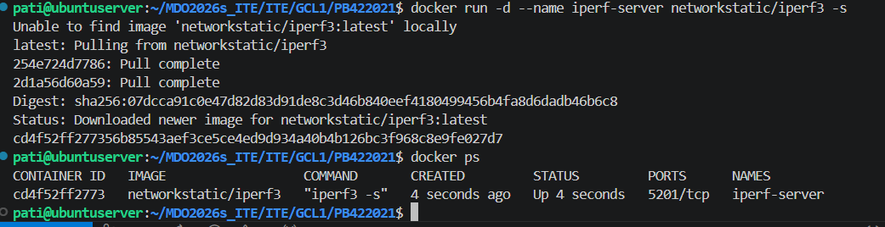

 ### Następnie sprawdziłam adres IP serwera:

 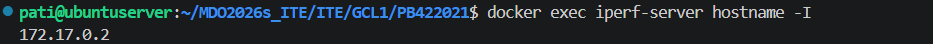

 ### Uruchomiłam drugi kontener, który posłuży jako klient i połączyłam się z drugim kontenerem. W ten sposób zabadałam ruch sieciowy. 

  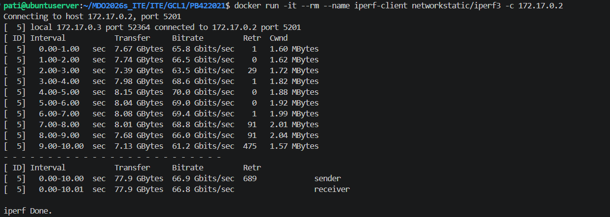

  ### Sprawdziłam adres ip drugiego kontenera.

   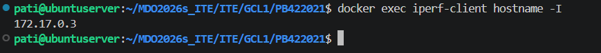

   ### Jednocześnie został wykonany test przepustowości. Wyniki są na poziomie 66,8 Gbits/sec, co jest bardzo dobrym wynikiem.

   ### W celu potwierdzenia połączenia między dwoma kontenerami wyświetliłam logi:

   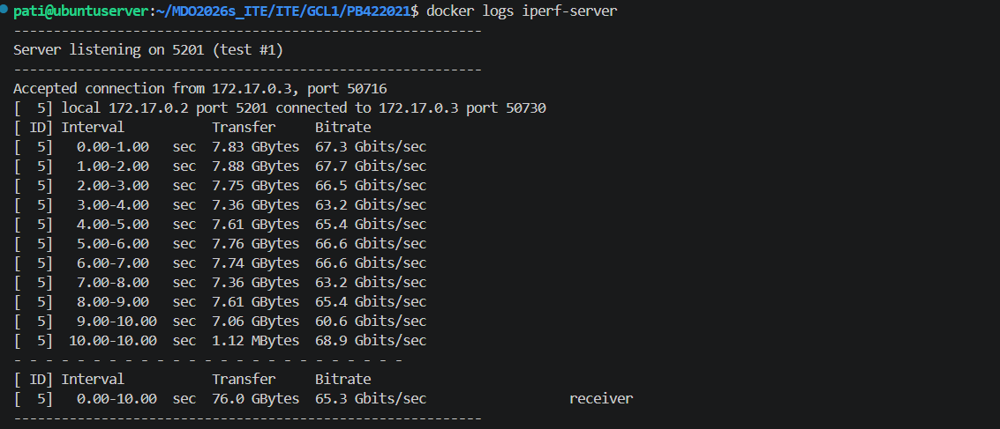

   ### Następnie przeszłam do utworzenia dedykowanej sieci mostkowej.

   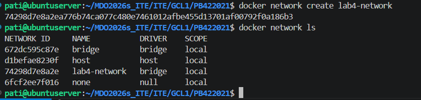

   ### Aby móc skorzystać z tej samej nazwy serwera usunęlam stary serwer, a następnie uruchomiłam nowy serwer w sieci lab4_network.

   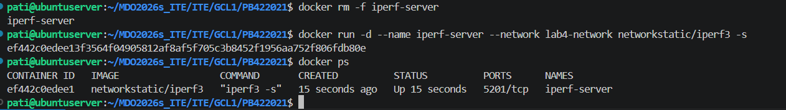

   ### Tym razem połączyłam się z wykorzystaniem nazw zamiast adresów IP. Test zakończył się sukcesem, co udowodniło poprawność działania wewnętrznego mechanizmu DNS Dockera w sieciach użytkownika.

   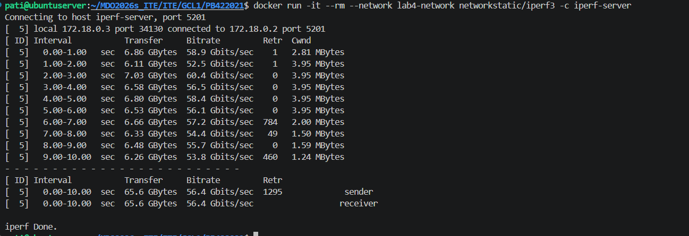

   ### W kolejnym kroku, aby połączyć się spoza kontenera ponownie usunęłam poprzedni serwer i uruchomiłam nowy z mapowaniem portów.

   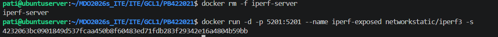


### Najpierw połączyłam się z poziomu hosta z mojego ubuntu. W tym celu najpierw zainstalowałam Ierf3 na moim ubuntu. 

### Następnie uruchomiłam test łacząc się z adresem localhost.

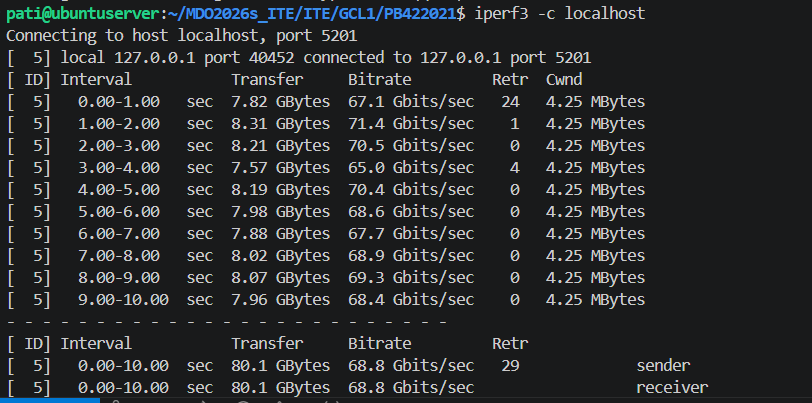

### Test zakończył się powodzeniem, zatem przeszłam do testu łączności spoza hosta - z mojego windowsa. W konsoli powershell wykonałam test i również zakończył się powodzeniem.

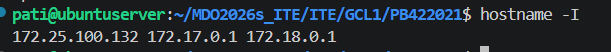

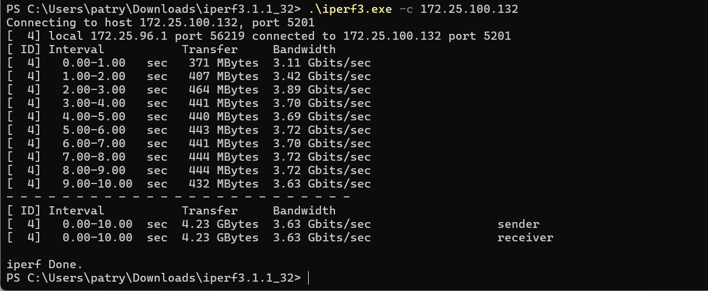

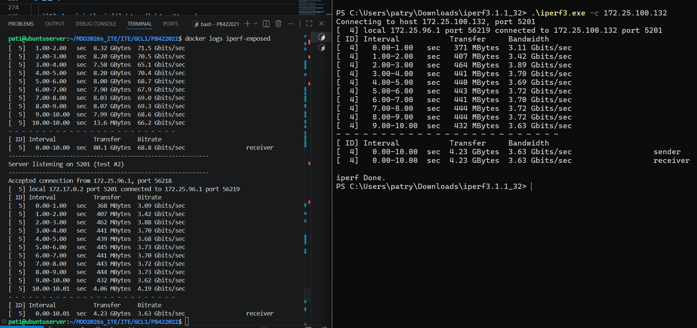


### Następnie przystąpiłam do kolejnej części laboratorium. Przygotowałam kontener z SSHD.

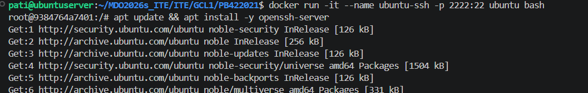

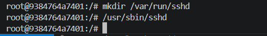

### Teraz otwierając nowy terminal w sprawdziłam połączenie.

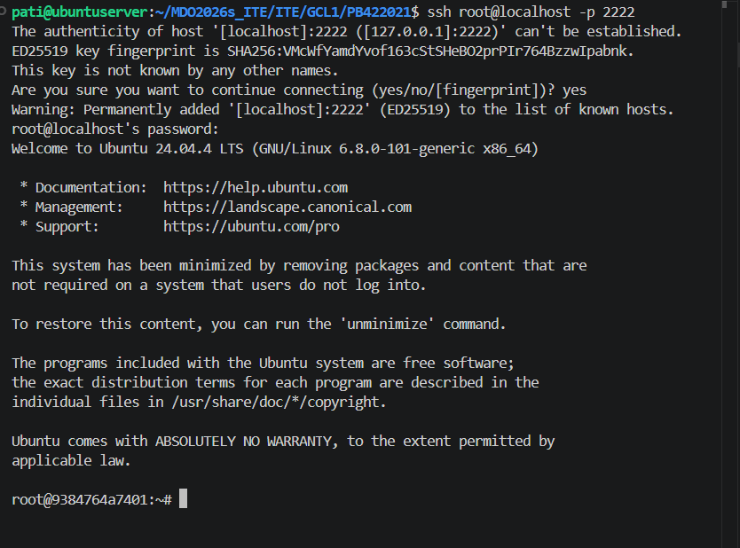

   
### Główną zaletą SSH jest wygoda i możliwość korzystania z różnych narzędzi. Dodatkowo można w prosty sposób kopiować pliki z mojego komputera bezpośrednio do wnętrza kontenera. To rozwiązanie ma jednak też wady. Kontener ma większy rozmiar - konieczne było zainstalowanie dodatkowych pakietó takich jak openssh-server. 


### Przeszłam do ostatniego etapu instrukcji, czyli uruchomienie Jenkinsa wewnątrz Dockera. 

### Zastosowałam obraz docker:dind w trybie --privileged. Pozwoliło to na stworzenie dedykowanego środowiska, w którym Jenkins może samodzielnie zarządzać kontenerami. Natomiast użycie woluminów zapewniło trwałość certyfikatów TLS oraz danych konfiguracyjnych.
  
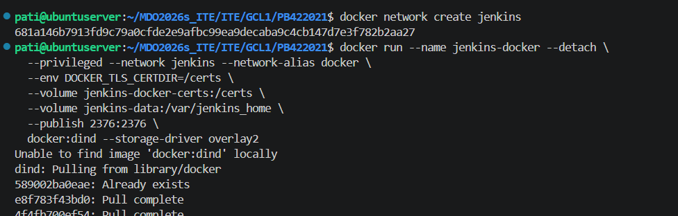


### Uruchomiłam główny kontener serwera Jenkins, wykorzystując obraz jenkinsci/blueocean. luczowym elementem konfiguracji było zdefiniowanie zmiennych środowiskowych DOCKER_HOST, DOCKER_CERT_PATH, które wskazały Jenkinsowi drogę do zewnętrznego silnika Docker-in-Docker.

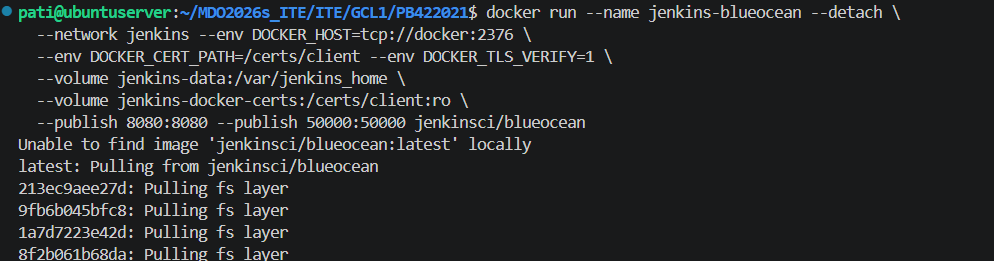

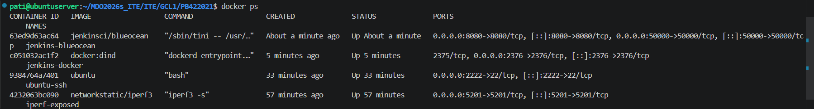

### Następnie wyświetliłam logi, aby uzyskać hasło. Wpisałam w przeglądarkę windowsa adres [..... ](http://172.25.100.132:8080/) i się zalogowałam.


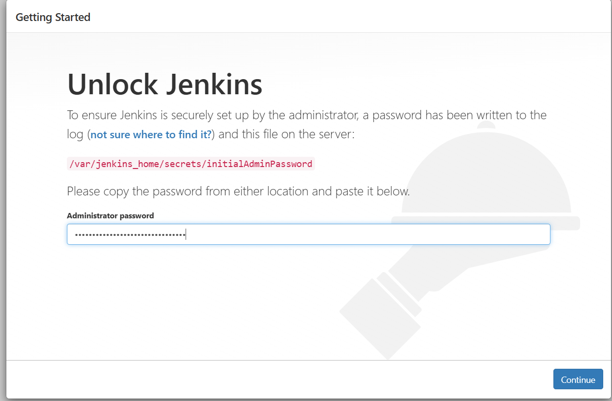

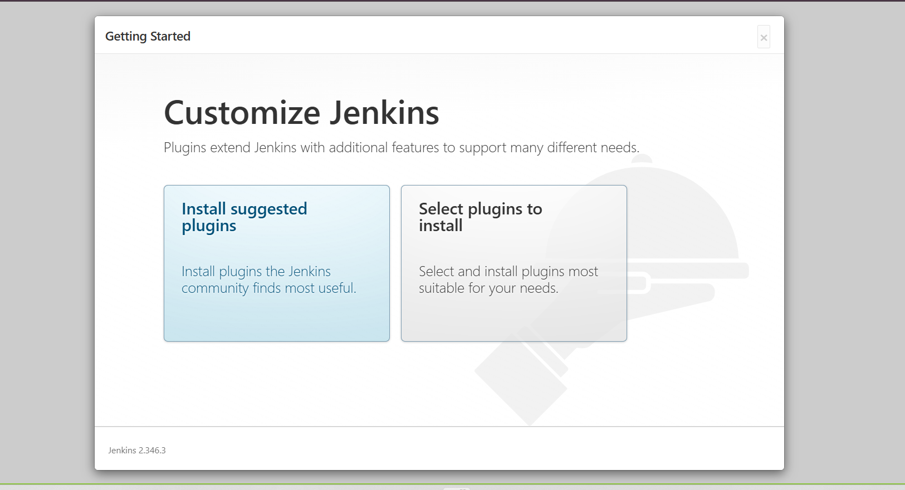