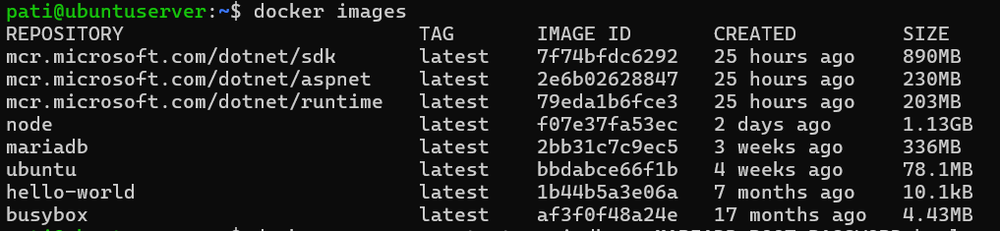
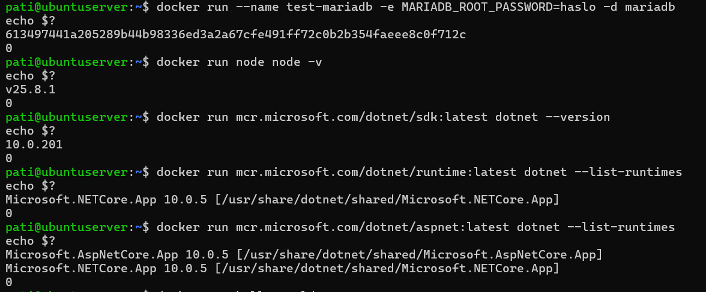
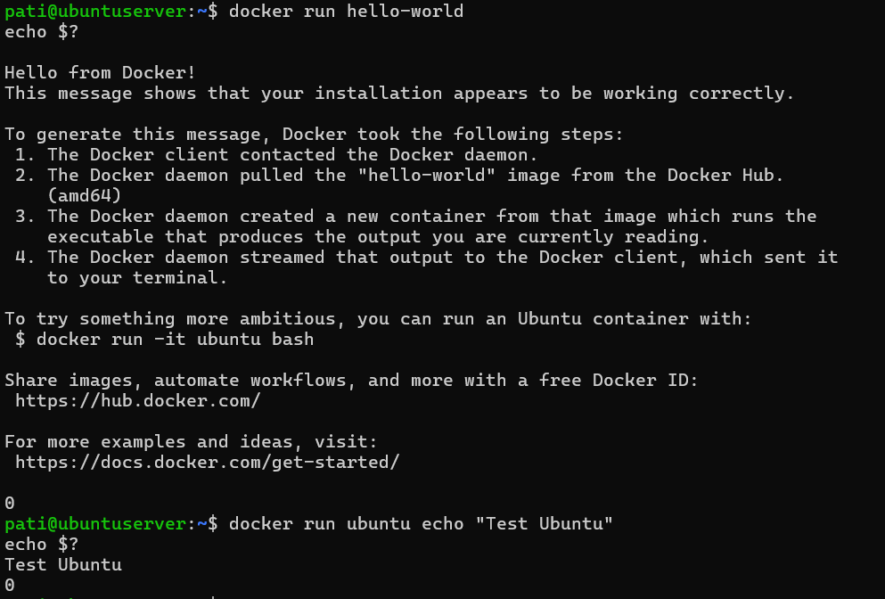
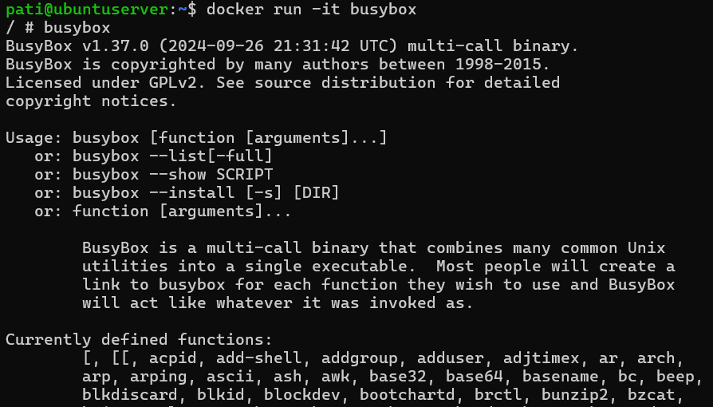
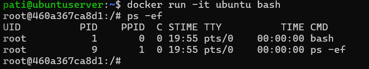
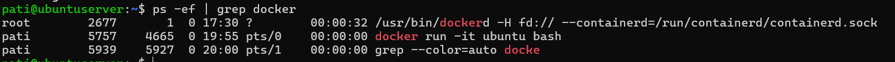
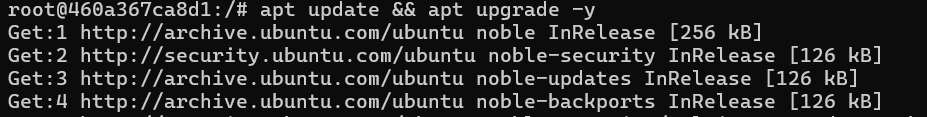
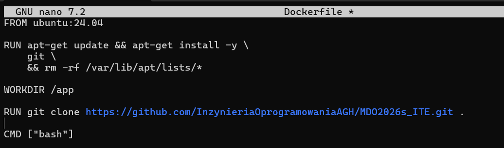
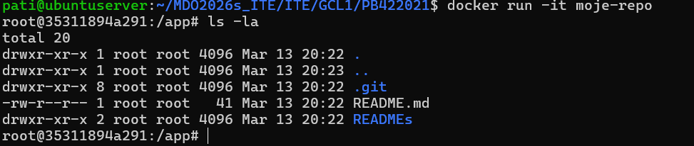
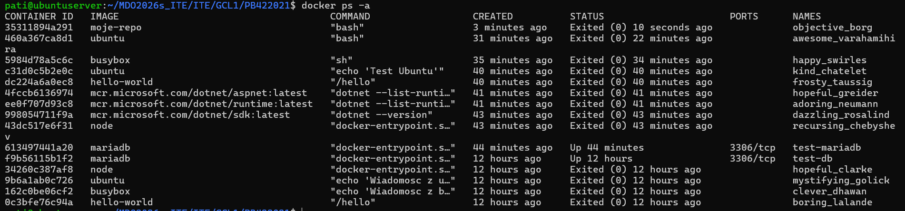

Sprawozdanie nr 1

treść hooka:

#!/bin/bash
INPUT_FILE=$1
START_LINE=$(head -n 1 "$INPUT_FILE")
if [[ ! $START_LINE =~ ^PB422021 ]]; then
  echo "BŁĄD: Commit message musi zaczynać się od PB422021"
  exit 1
fi

Utworzenie własnego folderu z inicjałem i nr indeksu:

lab2
### 1. Zapoznanie się z obrazami i ich rozmiarami
Wyświetlenie listy pobranych obrazów wraz z ich rozmiarem:

### 2. Uruchomienie obrazów i sprawdzenie kodów wyjścia
Uruchomienie przykładowych kontenerów i weryfikacja komendą `echo $?`:

### 3. Praca interaktywna - Busybox
Uruchomienie kontenera Busybox w trybie interaktywnym i sprawdzenie wersji:

### 4. Izolacja procesów (PID1)
Prezentacja procesu o identyfikatorze 1 wewnątrz kontenera:

Prezentacja procesów Dockera widzianych z poziomu hosta:

### 5. Aktualizacja systemu w kontenerze
Weryfikacja poprawności działania sieci i aktualizacji pakietów:

### 6. Własny plik Dockerfile
Zawartość przygotowanego pliku Dockerfile (screen):

Proces budowania własnego obrazu:
.png)

Uruchomienie i weryfikacja (ls -la) zawartości sklonowanego repozytorium:

### 7. Porządki i historia
Wyświetlenie historii wszystkich kontenerów (zarówno działających, jak i zatrzymanych):

