# Sprawozdanie nr 1

Wszystkie zadania wykonałam na Ubuntu Server 24.04 LTS w Hyper-V, poprzez połączenie zdalne przez protokół SSH z poziomu Visual Studio Code.

## Lab 1

Moim pierwszym zadaniem było przygotowanie klienta Git. Po upewnieniu się, że pakiet jest zainstalowany, sklonowałam repozytorium przedmiotu. Z racji, że GitHub nie wspiera uwierzytelniania zwykłym hasłem, wykorzystałam protoków HTTPS i Personal Acces Token, który wygenerowałam wcześniej w ustawieniach deweloperskich mojego konta na GitHubie.

Następnie w celu zwiększenia bezpieczeństwa, skonfigurowałąm dostęp przez SSH. Zgodnie z instrukcją utworzyłam dwa różne klucze - klucz standardowy i klucz zabezpieczony hasłem, wymagający podania hasła przy każdej próbie użycia.

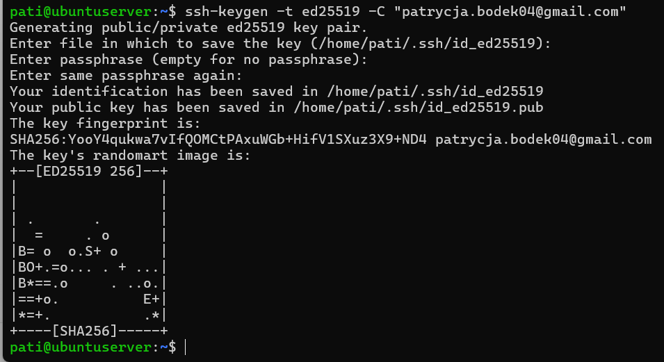

Następnie dodałam klucz publiczny do mojego profilu na GitHubie i sprawdziłam połączenie. Z racji, że miałam już skondfigurowane uwierzytelnianie dwuskładnikowe to pominęłam ten etap. 

Następnie sprawdziłam adres ip mojej maszyny wirtualnej, aby móc się z nią połączyć przez Visual Studio Code za pomocą wtyczki Remote SSH.

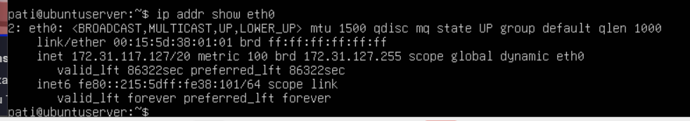

Następnie przetestowałam natychmiastowe przesyłanie plikó programem FileZilla przenosząc plik hej.txt.

 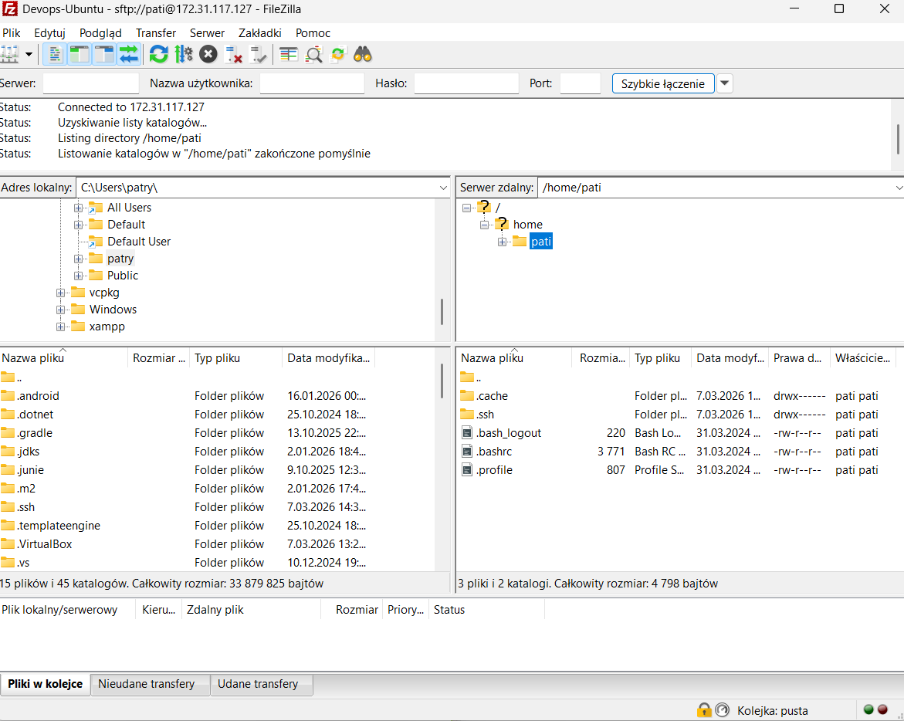
 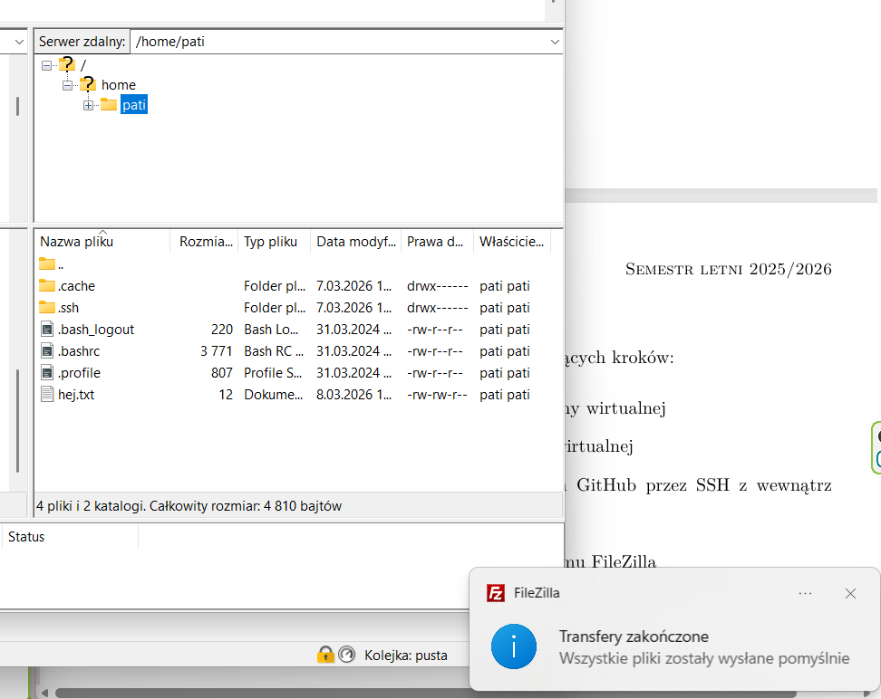

W kolejnym kroku w odpowiedniej gałęzi grupy utworzyłam swoją gałąź o nazwie PB422021 i zaczęłam na niej prace. Napisałam Git hooka, weryfikującego każdego commita, aby zaczynał się od nazwy mojej gałęzi.

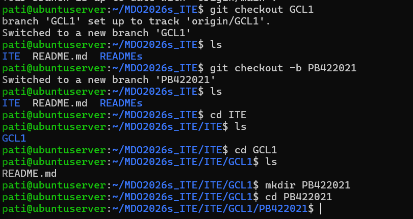

treść hooka:
```bash
#!/bin/bash
INPUT_FILE=$1
START_LINE=$(head -n 1 "$INPUT_FILE")
if [[ ! $START_LINE =~ ^PB422021 ]]; then
  echo "BŁĄD: Commit message musi zaczynać się od PB422021"
  exit 1
fi
```
Jako ostatni krok nadałam odpowiednie uprawnienia dla hooka.

 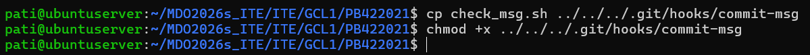

## Lab2

### 1. Zapoznanie się z obrazami i ich rozmiarami
Wyświetlenie listy pobranych obrazów wraz z ich rozmiarem:
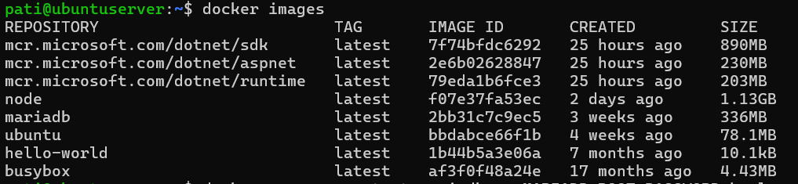

### 2. Uruchomienie obrazów i sprawdzenie kodów wyjścia
Uruchomienie przykładowych kontenerów i weryfikacja komendą `echo $?`:
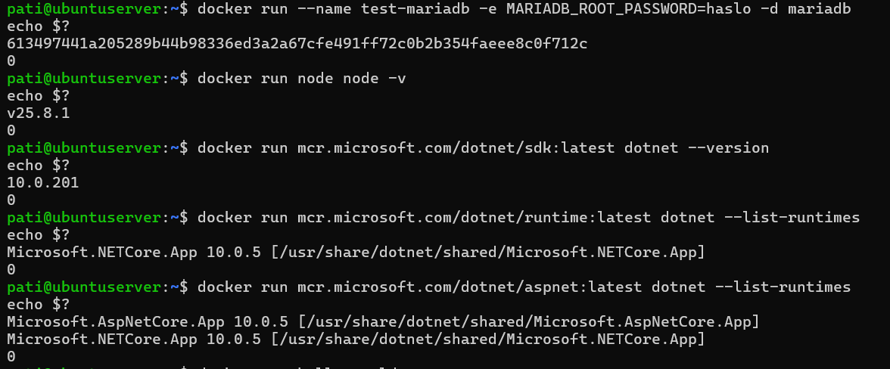
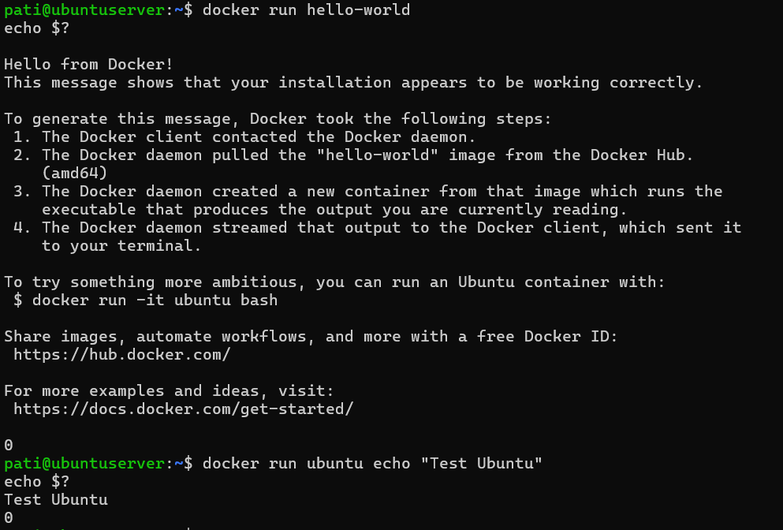

### 3. Praca interaktywna - Busybox
Uruchomienie kontenera Busybox w trybie interaktywnym i sprawdzenie wersji:


### 4. Izolacja procesów (PID1)
Prezentacja procesu o identyfikatorze 1 wewnątrz kontenera:
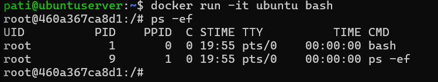

Prezentacja procesów Dockera widzianych z poziomu hosta:
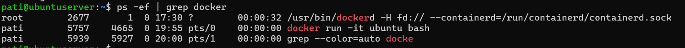

### 5. Aktualizacja systemu w kontenerze
Weryfikacja poprawności działania sieci i aktualizacji pakietów:
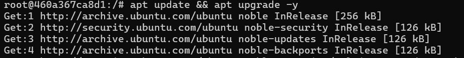

### 6. Własny plik Dockerfile
Zawartość przygotowanego pliku Dockerfile (screen):


Proces budowania własnego obrazu:
.png)

Uruchomienie i weryfikacja (ls -la) zawartości sklonowanego repozytorium:
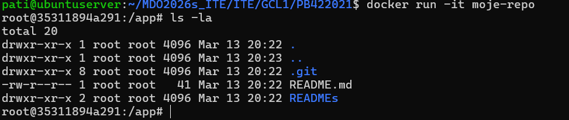

### 7. Porządki i historia
Wyświetlenie historii wszystkich kontenerów (zarówno działających, jak i zatrzymanych):


#### LAB3 

 1. Po sklonowaniu repo na systemie Ubuntu Server próba zbudowania zakończyła się niepowodzeniem. Wybrane repozytorium wymaga środowiska Node.js w wersji >= 20, podczas gdy system operacyjny oferuje wersję 18.19.1.

 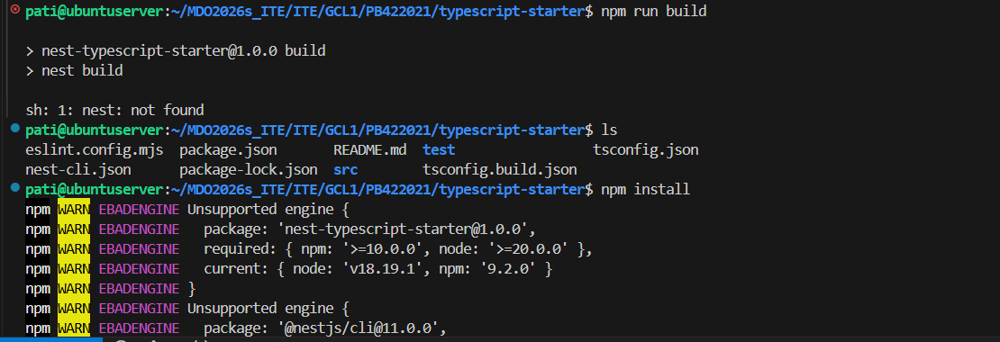

 Z tego powodu przechodzę do wykonania kolejnej części instrukcji, ay wykonać to bez potrzeby instalacji nowej wersji node na ubuntu.

 2. Uruchomiałam i pobrałąm nowy obraz node:20 
 
 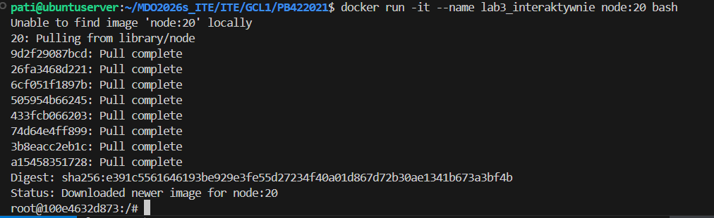

 Zainstalowałam gita 

  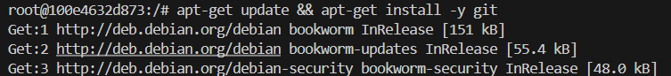

 Sklonowałam repozytorium do folderu app.

  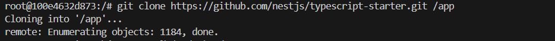

Repozytorium zostało pobrane poprawnie.

 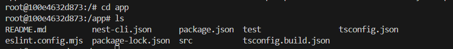

Zainstalowałam zależności 
 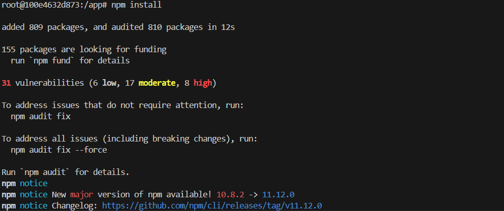

Uruchomiłam build, po tej komendzie pojawił sięnowy folder dist, co wskazuje na poprawne zbudowanie programu. 
 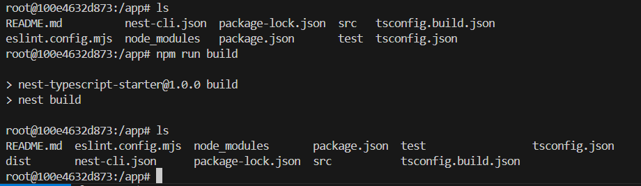

Następnie uruchomiłam testy, które przeszły poprawnie.
 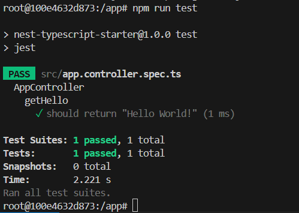

3. W kolejnym kroku przeszłam do utworzenia plików Dockerfile, które zautomatyzują to co było wykonane wcześniej. 

Dockerfile.build:
FROM node:20

RUN apt-get update && apt-get install -y git && rm -rf /var/lib/apt/lists/*

WORKDIR /app

RUN git clone https://github.com/nestjs/typescript-starter.git .

RUN npm install
RUN npm run build

CMD ["npm", "run", "start:prod"]

 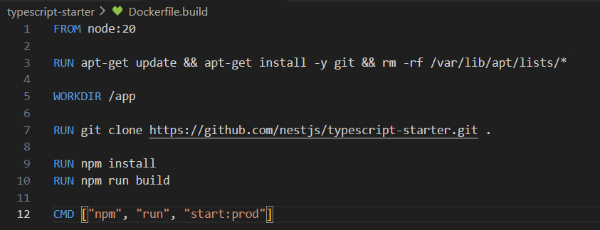

Dockerfile.test:
FROM app-build

CMD ["npm", "run", "test"]

 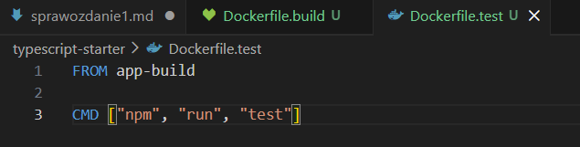

 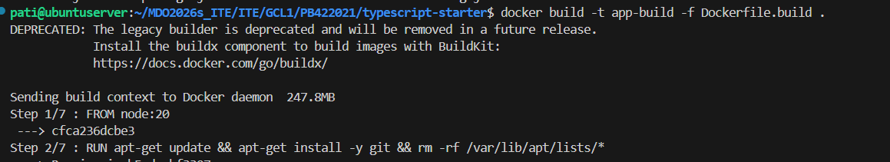
 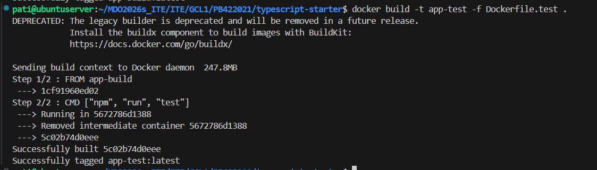
 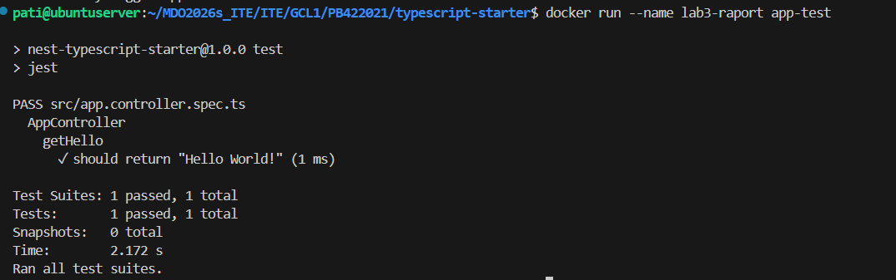

To, że i w tym przypadku testy przeszły poprawnie potwierdza poprawność wdrożenia.
 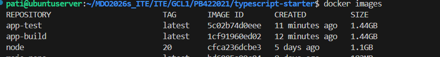


 #### LAB 4

1. Woluminy - wersja bez zainstalowanego gita.

  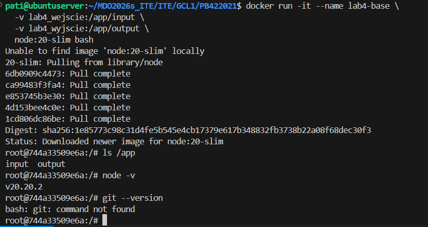

  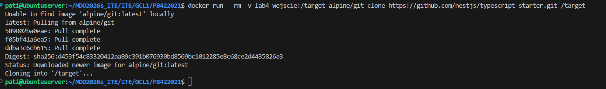

  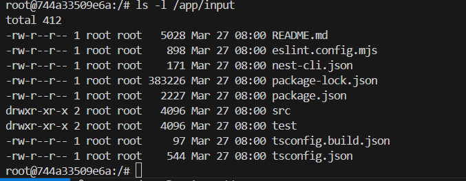

  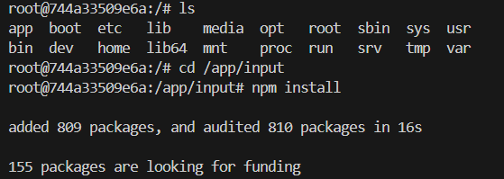

  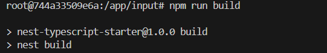

  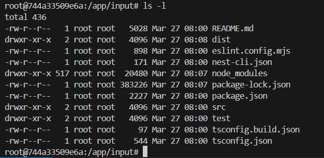

  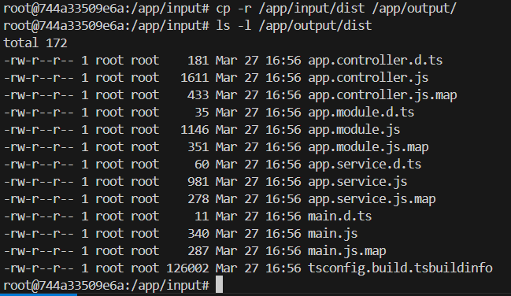

  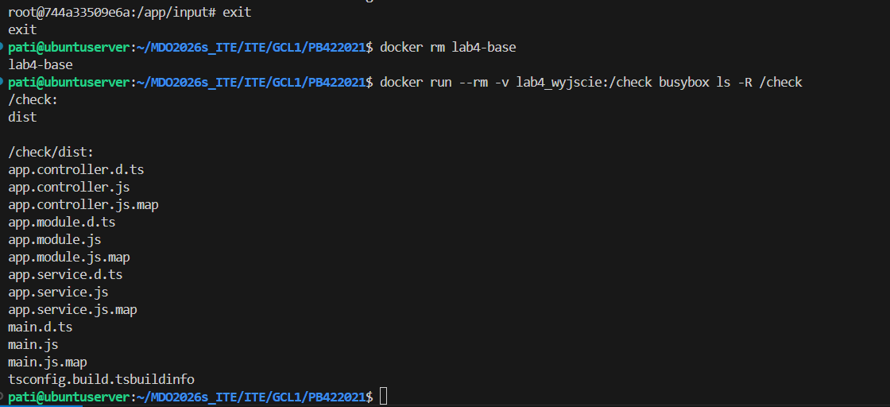


  Następnie zrobiłam to samo, ale klonawanie na wolumin wejściowy przeprowadziłam wewnątrz kontenera już z wykorzystaniem Gita w kontenerze.

 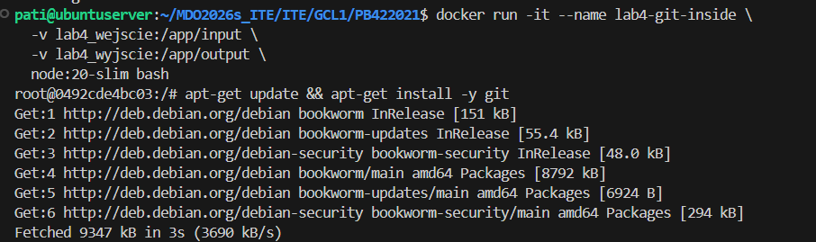

 Po uruchomieniu nowego kontenera w folderze input nadal były stare pliki, więc musiałam je usunąć przed zaciągnięciem repo do tego folderu. Po usunięciu pierwszej instancji kontenera i uruchomieniu nowej z tym samym montowaniem, pliki z poprzedniej sesji były nadal dostępne. Ponieważ narzędzie Git wymaga pustego katalogu docelowego do wykonania operacji clone, konieczne było wyczyszczenie zawartości woluminu przed ponownym pobraniem kodu.

  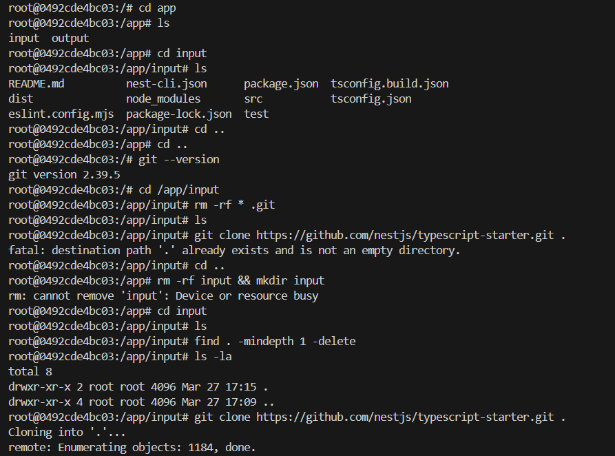

  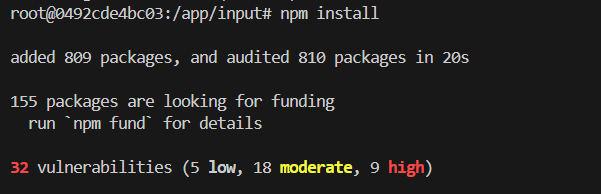
  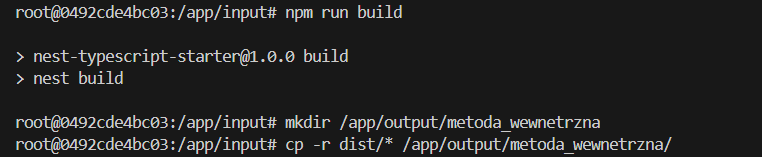
  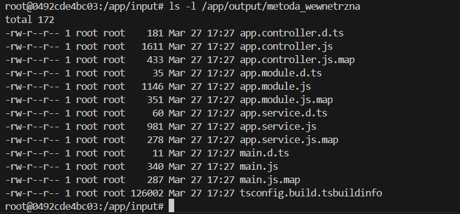
