# Sprawozdanie nr 2

#### Wszystkie zadania wykonałam na Ubuntu Server 24.04 LTS w Hyper-V, poprzez połączenie zdalne przez protokół SSH z poziomu Visual Studio Code.


# Lab5/6/7

### Przygotowanie 

Laboratorium rozpoczęłam od przygotowania Jenkinsa z ostatnich zajęć. Na poprzednich zajęciach już go poprawnie skonfigurowałam, więc teraz wystarczyło go poprawnie uruchomić.

Standardowy Jenkind od Blue Ocean różni się głównie interfejsem. Blue Ocean oferuje czytelny graf etapów, dzięki czemu można łatwo zobaczyć, w którym momencie (np. budowanie, testy lub deploy) wystąpił błąd.

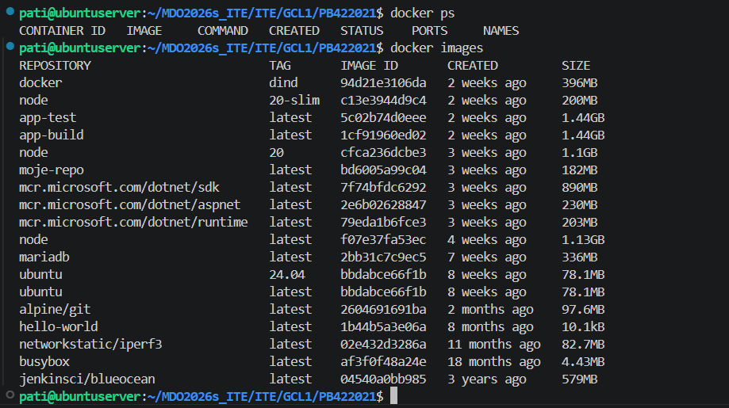
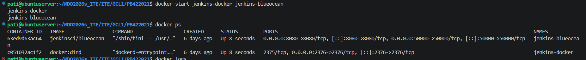

Następnie wpisując odpowiedni adres do przeglądarki i uzyskując wcześniej unikalne hasło z logów zalogowałam się pomyślnie na Jenkinsa.

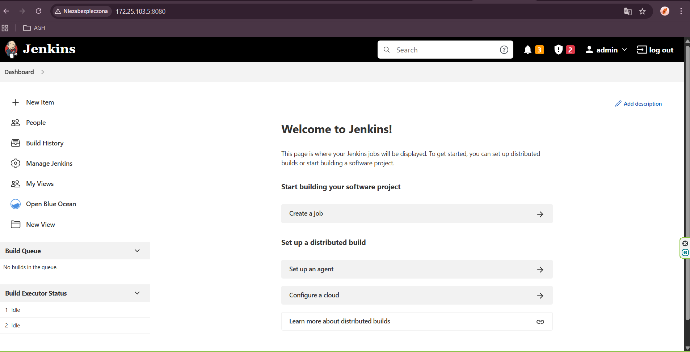


Aby zabezpieczyć logi Jenkinsa zastosowałam woluminy. Główny katalog Jenkinsa został zamapowany poleceniem --volume jenkins-data:/var/jenkins_home. Komenda docker volume inspect jenkins-data potwierdza, że dane są bezpiecznie archiwizowane bezpośrednio na dysku hosta.

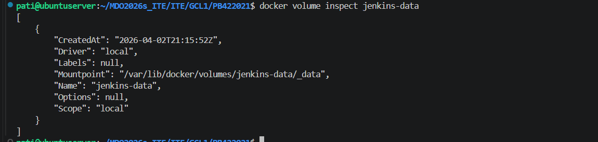


### Zadanie wstępne: uruchomienie 

- Projekt wyświetlający uname 

Utworzyłam nowy projekt i konsola zwróciła informacje o moim Linuxie, zatem wynik jest poprawny.

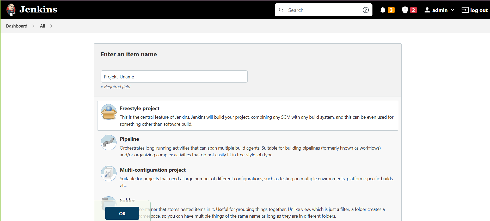
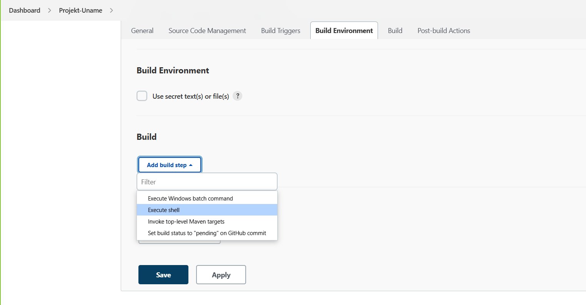
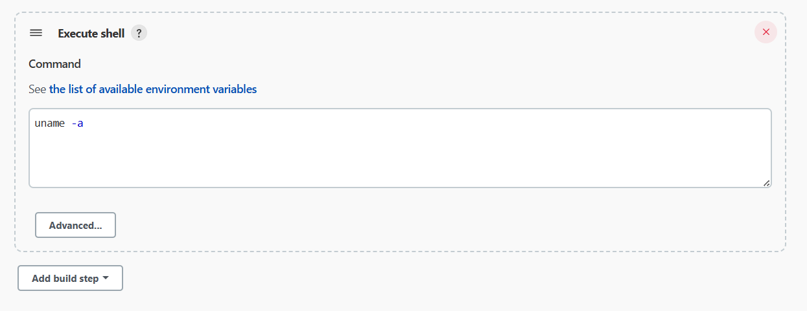
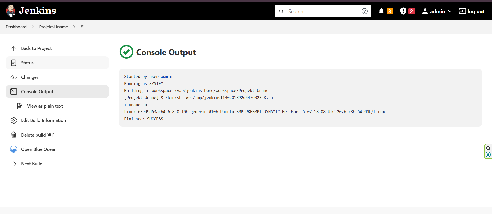

- Projekt zwracający błąd, kiedy godzina jest nieparzysta


```bash
GODZINA=$(date +%H)
echo "Aktualna godzina: $GODZINA"

if [ $((GODZINA % 2)) -ne 0 ]; then
  echo "Błąd! Godzina jest nieparzysta!"
  exit 1
else
  echo "Godzina jest parzysta!"
  exit 0
fi
```

W przypadku, gdy godzina jest parzysta:

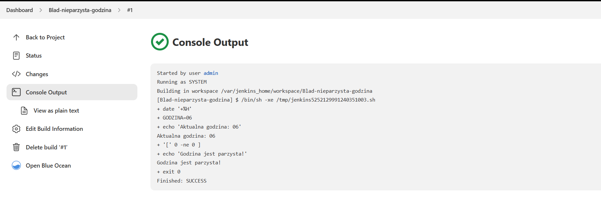

W przypadku, gdy godzina jest nieparzysta:

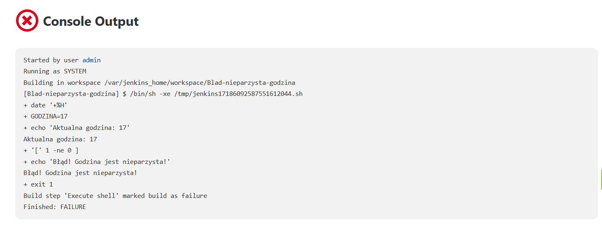

- Pobranie obrazu kontenera ubuntu

Utworzyłam nowy projekt i chciałam pobrać obraz dockera. 

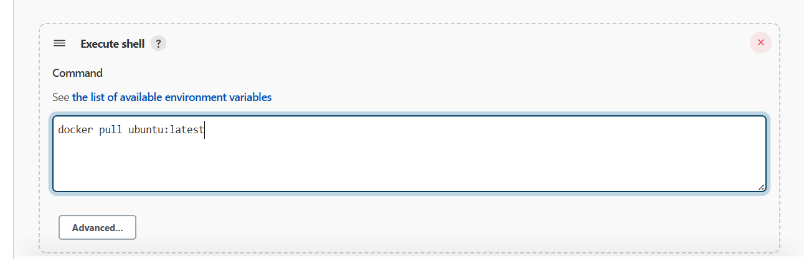
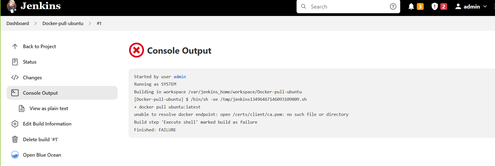

Okazało się jednak, że domyślnie mam niepoprawne ścieżki do certyfikatów TLS wewnątrz kontenera Jenkins. Dlatego musiałam ustawić odpowiednią ścieżkę, aby wszystko zadziałało poprawnie. 

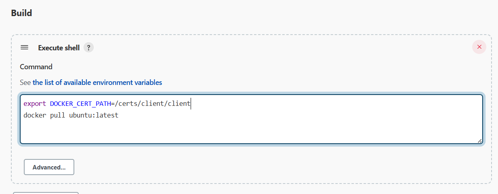
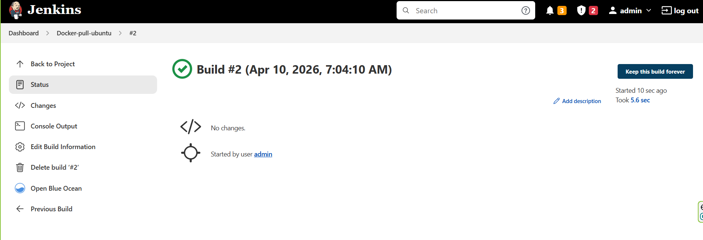

Aby sprawdzić jeszcze czy poprawnie działa mi dind chwilowo go wyłączyłam zostawiając jedynie blueocean, a następnie uruchomiłam docker pull ubuntu.

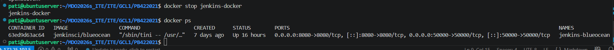
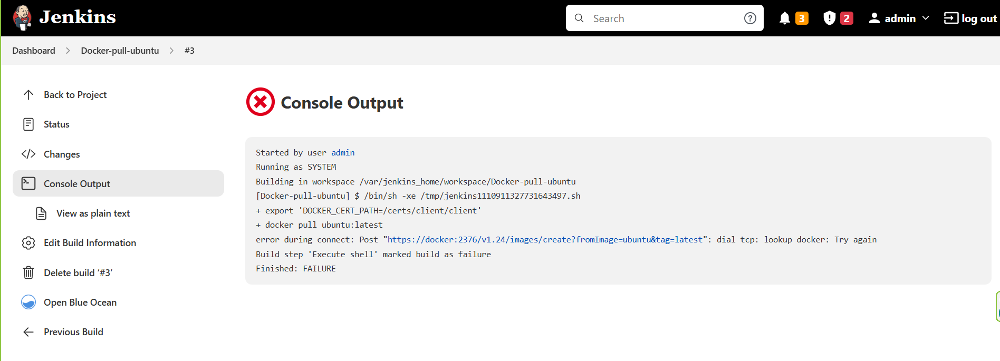

Jak widać w tym przypadku operacja nie zadziałała, co oznacza, że dind działa w sposób poprawny. 


Do dalszej pracy ponownie go uruchomiłam.

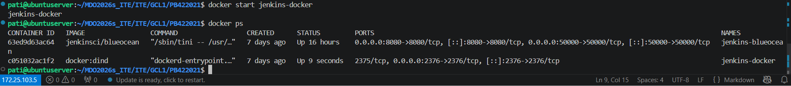


### Zadanie wstępne: obiekt typu pipeline

Utworzyłam nowy obiekt typu pepieline.

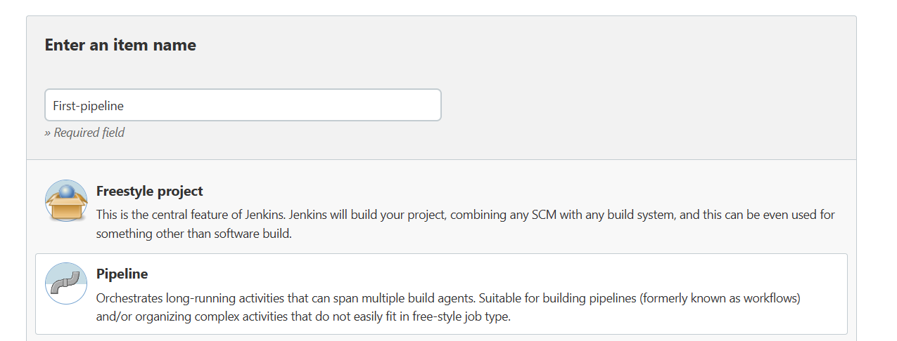

Treść pipelinu:

```bash
pipeline {
    agent any
    
    environment {
        DOCKER_CERT_PATH = '/certs/client/client'
    }

    stages {
        stage('Checkout') {
            steps {
                git branch: 'PB422021', 
                    url: 'https://github.com/InzynieriaOprogramowaniaAGH/MDO2026s_ITE.git'
            }
        }

        stage('Build Builder Image') {
            steps {
                script {
                    sh 'docker build -f ITE/GCL1/PB422021/Sprawozdanie1/Dockerfile.build -t app-build ITE/GCL1/PB422021/Sprawozdanie1'
                }
            }
        }

        stage('Build Tester Image') {
            steps {
                sh 'docker build -f ITE/GCL1/PB422021/Sprawozdanie1/Dockerfile.test -t tester ITE/GCL1/PB422021/Sprawozdanie1'
                echo 'Testy zakończone sukcesem'
            }
        }

        stage('Cleanup') {
            steps {
                sh 'docker image prune -f'
            }
        }
    }
}
```

Zapisałam skrypt i go uruchomiłam. Pierwsza próba zakończyła się niepowodzeniem na etapie testów. 

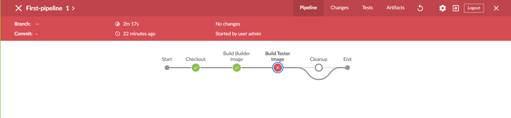

Błąd wynikał z niepoprawnej nazwy buildera. Po jego poprawieniu wszystko przebiegło pomyślnie.

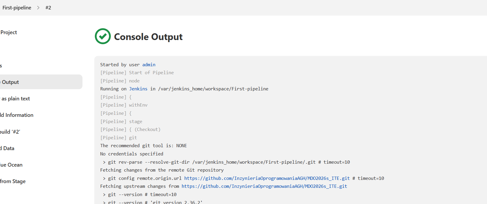
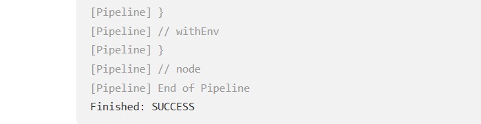
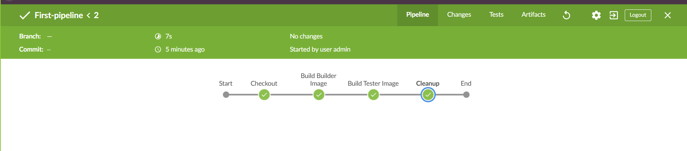

Grafika interfejsu blue ocean przedstawia poprawny przebieg wszystkich zdefiniowanych etapów: pobranie kodu, budowanie obrazu builder, budowanie obrazu tester oraz czyszczenie środowiska.


Uruchomiłam pipeline ponownie i widać, że czas budowania był krótszy. Wynika to z tego, że przy pierwszym uruchomieniu Docker musiał pobrać obraz Node.js, zainstalować pakiety i zbudować wszystko od zera.

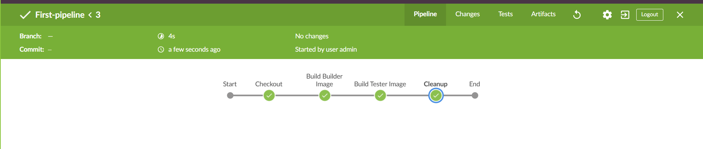


### Wymagania wstępne środowiska 

#### Zanim proces CI ruszy, środowisko musi spełniać określone warunki:

     - System operacyjny: Ubuntu Server 

     - Silnik konteneryzacji: Docker Engine w wersji 20.x lub nowszej

     - Jenkins Blue Ocean uruchomiony jako kontener (jenkins-blueocean)

     - Kontener pomocniczy docker:dind (jenkins-docker) działający w trybie --previledged

     - Dedykowana sieć Dockera umożliwiająca komunikację między Jenkinsem a silnikiem DinD po nazwie hosta

     - Współdzielony wolumin z certyfikatami TLS (jenkins-docker-certs) zapewniający bezpieczne połączenie 

     - Repozytorium Git na platformie GitHub z poprawnie skonfigurowanym dostępem.


### Diagramy UML

#### Diagram aktywności, pokazujący kolejne etapy:

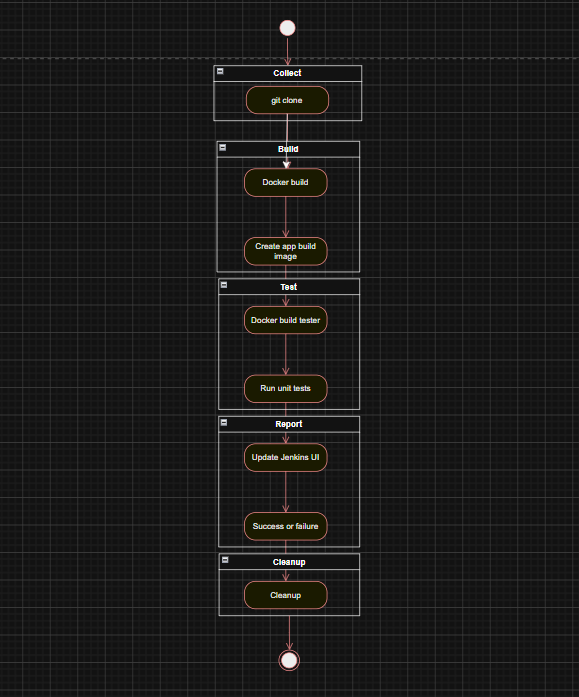


W kolejnym eapie przeniosłam mojego dotychczasowego pipelina do Jenkinsfila. W jenkinsie zmienlam w ustawieniach pipeline, na SCM.

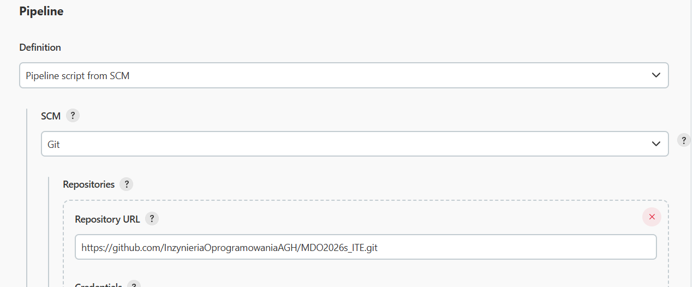

Po tej zmianie również wszystko przeszło pomyślnie.

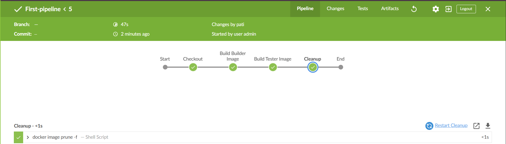


### Deploy

W oficjalnej dokumentacji NestJS sugerowane jest użycie platformy Mau do szybkiego wdrożenia na AWS. Jednak w celu pełnego zrozumienia procesu CI/CD i zapewnienia hermetyczności budowania, w projekcie zaimplementowałam własny mechanizm deployu. Zamiast instalować zależności globalnie (jak sugeruje Mau: npm install -g @nestjs/mau), wykorzystuję Dockerfile.deploy, do którego ręcznie wstrzykuję zbudowany folder node_modules. Gwarantuje to, że wersja uruchomieniowa jest identyczna z tą, która przeszła testy jednostkowe.

Dockerfile.deploy:

```bash
FROM node:20-slim

WORKDIR /app

COPY package.json ./
COPY node_modules ./node_modules
COPY dist ./dist

EXPOSE 3000

CMD ["node", "dist/main"]
```

Zdecydowałam się na obraz w wersji slim zamiast pełnego obrazu Node.js. Obraz ten zawiera jedynie niezbędne minimum do uruchomienia aplikacji. Zamiast uruchamiać komendę RUN npm install wewnątrz Dockerfile, kopiuję gotowe foldery node_modules oraz dist, które zostały przygotowane i przetestowane we wcześniejszych etapach Pipeline'u (Build i Test). Gwarantuje to, że wersja aplikacji, która trafi na produkcję, jest identyczna z wersją, która przeszła testy jednostkowe. Dzięki temu unikam ryzyka, że npm install pobierze z internetu nowszą, potencjalnie wadliwą wersję jakiejś biblioteki w ostatniej chwili.

Następnie zmodyfikowałam mój dotychczasowy Jenkinsfile.

Jenkinsfile:

```bash
pipeline {
    agent any
    
    environment {
        DOCKER_CERT_PATH = '/certs/client/client'
        APP_PORT = '3000'
    }

    stages {
        stage('Checkout') {
            steps {
                git branch: 'PB422021', 
                    url: 'https://github.com/InzynieriaOprogramowaniaAGH/MDO2026s_ITE.git'
            }
        }

        stage('Build') {
            steps {
                script {
                    sh 'docker build -f ITE/GCL1/PB422021/Sprawozdanie1/Dockerfile.build -t app-build ITE/GCL1/PB422021/Sprawozdanie1'
                }
            }
        }

        stage('Test') {
            steps {
                sh 'docker build -f ITE/GCL1/PB422021/Sprawozdanie1/Dockerfile.test -t tester ITE/GCL1/PB422021/Sprawozdanie1'
                echo "Testy dla buildy nr ${env.BUILD_NUMBER} zakończone sukcesem"
            }
        }

        stage('Prepare Deploy') {
            steps {
                script {
                    sh 'docker create --name extract-container app-build'
                    sh 'docker cp extract-container:/app/node_modules ./node_modules'
                    sh 'docker cp extract-container:/app/dist ./dist'
                    sh 'docker rm extract-container'

                    sh 'docker build -t app-deploy -f ITE/GCL1/PB422021/Sprawozdanie1/Dockerfile.deploy .'
                }
            }
        }

        stage('Smoke Test') {
            steps {
                script {
                    sh "docker run -d --name smoke-test-container -p ${APP_PORT}:${APP_PORT} app-deploy"
                    
                    sleep 5
                    
                    try {
                        echo 'Weryfikacja przez curl...'
                        sh "curl -f http://localhost:${APP_PORT} || exit 1"
                        echo 'SUKCES: Aplikacja odpowiada poprawnie'
                    } catch (Exception e) {
                        error('BŁĄD: Aplikacja nie odpowiada poprawnie')
                    } finally {
                        sh 'docker stop smoke-test-container'
                        sh 'docker rm smoke-test-container'
                    }
                }
            }
        }

        stage('Publish Artifact') {
            steps {
                script {
                    def artifactName = "nestjs-app-v${env.BUILD_NUMBER}.tar.gz"
                    
                    echo "Pakowanie zatwierdzonych plików do paczki: ${artifactName}"
                    sh "tar -czf ${artifactName} dist node_modules package.json"
                    
                    echo 'Publikacja artefaktu w systemie Jenkins...'
                    archiveArtifacts artifacts: artifactName, fingerprint: true
                }
            }
        }

        stage('Cleanup') {
            steps {
                sh 'docker image prune -f'
            }
        }
    }
}
```


W moim Jenkinsfile kluczowym krokiem było zapewnienie hermetyczności wdrożenia – zamiast pobierać biblioteki na nowo z sieci, za pomocą polecenia docker cp wyciągnęłam przetestowane już pliki dist oraz node_modules i wstrzyknęłam je do lekkiego obrazu produkcyjnego app-deploy.

Następnie zrealizowałam Smoke Test, uruchamiłam kontener i użyłam narzędzia curl, aby sprawdzić, czy aplikacja nasłuchuje na porcie 3000. Aby zapobiec blokowaniu portów w przypadku awarii, test ten objęłam blokiem try-catch-finally, który gwarantuje poprawne usunięcie kontenera po sprawdzeniu. 

Po udanej weryfikacji, skompilowany kod oraz zależności spakowałam do paczki .tar.gz, zawierającej skompilowany kod (dist), zależności (node_modules) oraz metadane (package.json) i opublikowałam w Jenkinsie jako finalny artefakt wdrożeniowy, a cały proces zakończyłam etapem automatycznego czyszczenia nieużywanych obrazów na serwerze.


Po pierwszym uruchomieniu pipeline wyrzucił błąd na etapie Prepare Deploy.

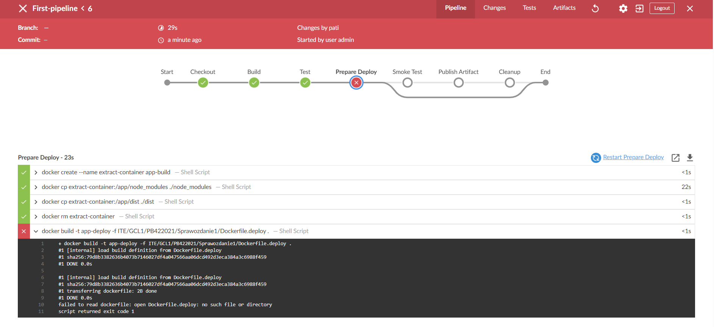

To co musiałam zrobić to poprawić ścieżki do plików, gdyż przez przypadek wpisane były błędnie. Po tej poprawie etap Prepare Deploy przeszedł poprawnie jednak pipeline wywalił si,ę na smoke test.

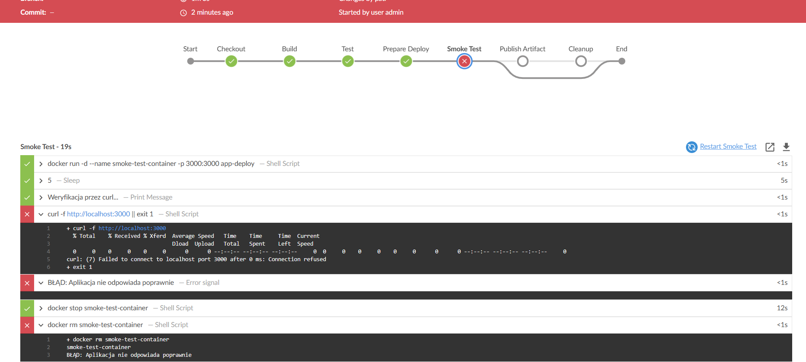

Aby znależć przyczynę dopisałam do mojego Jenkinsfile komendy echo, które pomogą przy debugowaniu.

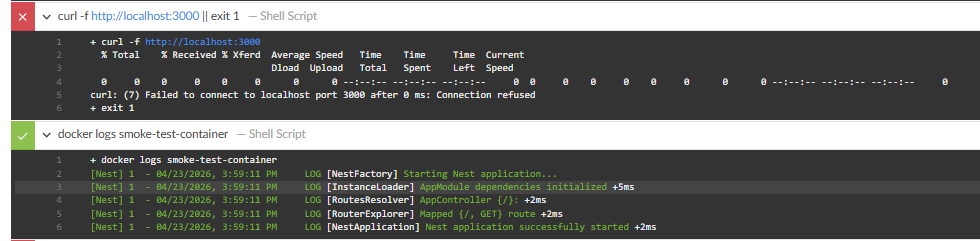

Na tej podstawie widać, że aplikacja działa. Problem pojawia się przy curl.

Najpierw w etapie Smoke Test wprowadziłam zmianę w sposobie weryfikacji dostępności aplikacji. Zamiast próbować połączyć się z adresem localhost, zastosowałam mechanizm dynamicznego pobierania adresu IP kontenera. Jednak nie zadziałało to poprawnie i wyskoczył timeout. Spróbowałam uruchomić kontener w trybie --network host. To również nie zadziałało.

Okazało się, że w Dockerfile.deploy z racji, że korzystam z obrazu node:20-slim musiałam doinstalować narzędzie curl. Po tej modyfikacji pipelina wykonał się poprawnie. 

Finalny kod Jenkinsfile: [Jenkinsfile](Jenkinsfile)

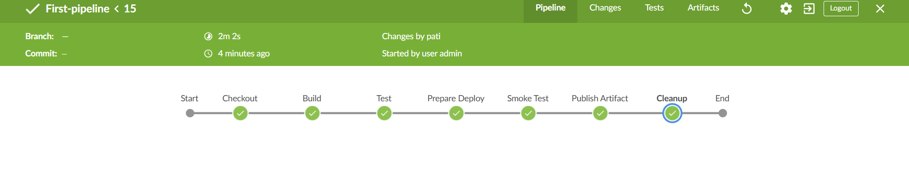

Następnie pobrałam istniejący artefakt.

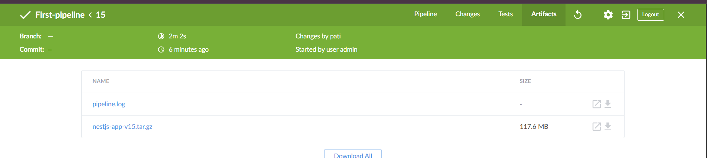

W moim katalogu domowym utworzyłam folder test1, w którym rozpakowałam pobrany artefakt, aby sprawdzić czy działa. 

Wszystko zadziałało poprawnie - potwierdziło to, że artefakt jest w pełni samodzielny oraz nie ma potrzeby niczego instalować.

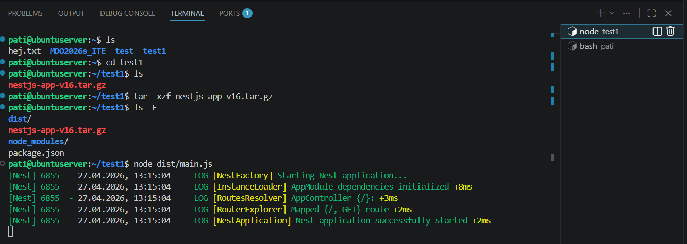
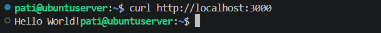