# Sprawozdanie nr 3

#### Wszystkie zadania wykonałam na Ubuntu Server 24.04 LTS w Hyper-V, poprzez połączenie zdalne przez protokół SSH z poziomu Visual Studio Code.

### Lab8

### Instalacja zarządcy Ansible

Laboratoria rozpoczęłam od utworzenia drugiej maszyny wirtualnej (ansible-target) w wersji Minimized. Zgodnie z wymaganiami, zapewniłam obecność pakietu tar oraz skonfigurowałam serwer OpenSSH, aby umożliwić zdalną automatyzację.


Następnie sprawdziłam adres IP nowej maszyny, a następnie na maszynie głównej skonfigurowałam plik /etc/hosts, aby umożliwić komunikację po nazwie hostname.


Po przejściu powyższych etapów wszytsko zadziałało poprawnie:


### Inwentaryzacja

Zgodnie z dobrą praktyką dokonałam zmiany nazwy głównej maszyny wirtualnej. Za pomocą narzędzia hostnamectl nadałam mojej maszynie głównej nazwę ansible-controller.


Widać, że nazwa została poprawnie zmieniona:


Ponieważ tworząc maszynę wirtualną ansible od razu nazwałam ją ansible-target, teraz nie musiałam już tego robić.

Następnie sprawdziłam adresy ip obu maszyn i wpisałam je do pliku /etc/hosts.


Następnie zweryfikowałam łączność za pomocą polecenia ping. Otrzymałam odpowiedź spod adresu ip przypisanego do ansible-target, zatem wszystko zadziałało poprawnie.


Następnie przeszłam do utworzenia pliku inwentaryzacji.


Aby zweyfikować poprawność wysłałam żądanie ping do wszystkich maszyn.


Wnikiem jest success w obu przypadkach oraz odpowiedź pong, co wskazuje na poprawne wykonanie konfiguracji. Potwierdza to też, że Ansible poprawnie odczytał plik inventory.ini i znalazł oba hosty.

### Zdalne wywołanie procedur 

Napisałam playbooka, który najpierw pinguje wszystkie maszyny, żeby sprawdzić łączność. Następnie na maszynie docelowej kopiuję plik inwentarza i aktualizuję system - rozbiłam to na dwa etapy, aby uniknąć błędów technicznych w module apt. Na koniec restartuję usługi SSH i RNGD.

```bash
- name: Procedury zdalne
  hosts: all
  tasks:
    - name: Ping
      ansible.builtin.ping:

- name: Zadania na Endpoints
  hosts: Endpoints
  become: yes
  tasks:
    - name: Kopiowanie pliku inwentory.ini
      ansible.builtin.copy:
        src: inventory.ini
        dest: /home/ansible/inventory.ini

    - name: Odświeżenie listy pakietów (apt update)
      ansible.builtin.apt:
        update_cache: yes

    - name: Aktualizacja wszystkich pakietów (apt upgrade)
      ansible.builtin.apt:
        upgrade: yes

    - name: Restart usług
      ansible.builtin.service:
        name: "{{ item }}"
        state: restarted
      loop:
        - ssh
        - rng-tools-debian
      ignore_errors: yes
```

Następnie uruchomiłam playbooka komendą ```ansible-playbook -i inventory.ini playbook.yaml -u ansible -K ```


Pojawił się komunikat o braku usługi rngd, zatem dopisałam do playbooka fragment, który zapewnia, że zostanie on zainstalowany. Poprawiony [playbook](playbook.yaml). Uruchomilam plik ponownie i widać, że zadania, któe zostały juz uruchomione wcześniej są od razu na zielono. Ansible nie tracił czasu na powtarzanie tych czynności. Natomiast usługa rngd została poprawnie zainstalowana i zadziałała. 


Następnie przetestowałam operację względem maszyny z wyłączonym serwerem SSH i odpiętą kartą sieciową. Tym razem otrzymałam błąd UNREACHABLE, co potwierdza, że system poprawnie potrafii wykryć awarię połączenia i zatrzymuje dalsze działania, aby nie generować dalszych błędów. 


### Zarządzanie stworzonym artefaktem

Moim artefaktem z pipelinu był plik .tar, zatem utworzyłam rolę i przeniosłam gotowy artefakt do folderu app_deploy/files.


Następnie otworzyłam plik [app_deploy/meta/main.yml](app_deploy/meta/main.yml) i zaczęłam go modyfikować. 

```bash
galaxy_info:
  author: Patrycja
  description:Zarządzanie artefaktem NestJS
  licence: MIT
  min_ansible_version: 2.1
  platforms:
    - name: Ubuntu
      versions:
        - all

dependencies: []
```

W kolejnym kroku przeszłam do modyfikacji pliku [app_deploy/tasks/main.yml](app_deploy/tasks/main.yml), w którym wykonałam kroki zawarte w instrukcji.

```bash
---
# Sanity check
- name: Sanity check 
  ansible.builtin.shell: df -h / | tail -1 | awk '{print $4}'
  register: disk_space
  ignore_errors: yes

- name: Wyświetlenie wyniku sanity check
  ansible.builtin.debug:
    msg: "Dostępne miejsce: {{ disk_space.stdout }}"

# Instalacja dockera
- name: Instalacja Docker
  ansible.builtin.apt:
    name: docker.io
    state: present
    update_cache: yes

- name: Uruchomienie usługi Docker
  ansible.builtin.service:
    name: docker
    state: started
    enabled: yes

# Wysłanie i przygotowanie aplikacji
- name: Tworzenie folderu na aplikację
  ansible.builtin.file:
    path: /home/ansible/app_deploy
    state: directory

- name: Wysłanie i rozpakowanie artefaktu
  ansible.builtin.unarchive:
    src: nestjs-app-v17.tar.gz
    dest: /home/ansible/app_deploy/

#Uruchomienie w konetenerze
- name: Uruchomienie kontenera z aplikacją
  community.docker.docker_container:
    name: nestjs_app
    image: node:18-alpine
    state: started
    volumes:
      - /home/ansible/app_deploy:/app
    working_dir: /app
    command: "node dist/main.js"
    ports:
      - "3000:3000"

# Sanity check wdrozenia 
- name: Czekam 5 sekund na start...
  ansible.builtin.pause:
    seconds: 5

- name: Weryfikacja działania 
  ansible.builtin.uri:
    url: "http://localhost:3000"
    status_code: 200
  register: web_result

- name: Potwierdzenie weryfikacji
  ansible.builtin.debug:
    msg: "Aplikacja odpowiada poprawnie!"
  when: web_result.status == 200

# Cleanup
- name: Zatrzymanie i usunięcie kontenera
  community.docker.docker_container:
    name: nestjs_app
    state: absent

- name: Usunięcie plików aplikacji
  ansible.builtin.file:
    path: /home/ansible/app_deploy
    state: absent
```

Następnie w moim folderze Sprawozdanie3 utworzylam playbook deploy_artifact.yml.

```bash
---
- name: Zarządzanie stworzonym artefaktem
  hosts: Endpoints
  become: yes
  roles:
    - app_deploy
```

Natsępnie uruchomiłam całość poleceniem ```ansible-playbook -i inventory.ini deploy_artifact.yml -u ansible -K``` i otrzymałam taki wynik:


Proces wdrożenia zakończył się sukcesem (failed=0).Moduł uri uderzył na port 3000 uruchomionego kontenera i otrzymał odpowiedź HTTP 200, co dowodzi, że aplikacja faktycznie wstała i działała, a nie tylko została przekopiowana. Na koniec środowisko zostało pomyślnie oczyszczone z testowego wdrożenia - usunięto kontener i wypakowane pliki.

### Lab 9

Laboratoria rozpoczęłam od utworzenia nowej madszyny wirtualnej Fedora. Instalacja przebiegła pomyślnie, więc się do niej zalogowałam.


Następnie połączyłam się z Fedorą poprzez ssh, aby móc wygodnie pracować w visual studio code i przeszłam do znalezienia pliku odpowiedzi /root/anaconda-ks.cfg.


Natstępnie utworzyłam plik anaconda-ks.cfg i skopiowałam tam zawartość tego co otrzymałam w odpowiedzi na polecenie cat. 


W kolejnym kroku zmodyfikowałam ten plik zgodnie z instrukcją, czyli tak aby plik umożliwiał reinstalację w kółko oraz hostname był inny niż localhost (u mnie jest to server-pati).


```bash
url --mirrorlist=https://mirrors.fedoraproject.org/mirrorlist?repo=fedora-44&arch=x86_64
repo --name=update --mirrorlist=https://mirrors.fedoraproject.org/mirrorlist?repo=updates-released-f44&arch=x86_64

keyboard --vckeymap=pl --xlayouts='pl'
lang pl_PL.UTF-8

network --bootproto=dhcp --device=link --activate
network --hostname=serwer-pati

%packages
@^server-product-environment
@container-management
@domain-client
@guest-agents
@server-hardware-support
%end

firstboot --disable

zerombr

# reinstalacja w kółko
clearpart --all --initlabel

autopart --type=plain

timezone Europe/Warsaw --utc

rootpw pati
user --groups=wheel --name=pati --password=pati
reboot


```
Następnie przystąpiłam do próby instalacji nienadzorowanej.  W tym celu utworzyłam nową maszynę wirtualną. Po jednej poprawce w pliku odpowiedzie (nie zgadzały się wersje fedory) bezdotykowa instalacja zakończyła się sukcesem.


Następnie w pliku odpowiedzi dodałam niezbędne narzędzia, takie jak nodejs, wget i tar do sekcji z pakietami, żeby po instalacji system miał jak pobrać i uruchomić projekt. Początkowo proces miał opierać się na bezpośrednim pobieraniu artefaktu z Jenkinsa, jednak ze względu na problemy z zaporą sieciową, która blokowała ruch, zastosowałam sprytne obejście. Polegało ono na uruchomieniu prywatnego serwera HTTP za pomocą wbudowanego modułu Pythona bezpośrednio w środowisku VS Code.

W związku z tym w sekcji %post napisałam skrypt, który od razu po instalacji systemu tworzy nowy folder w /usr/local/bin i pobiera do niego gotowy artefakt z aplikacją z mojego lokalnego serwera działającego w VS Code. Następnie skrypt rozpakowuje pliki i od razu kasuje zbędne archiwum. Żeby spełnić wymóg automatycznego uruchamiania programu, dopisałam konfigurację usługi systemd, która po cichu startuje aplikację w środowisku Node.js. Na sam koniec aktywowałam tę usługę poleceniem systemctl enable, dzięki czemu po restarcie maszyny system od razu podnosi aplikację i wszystko działa w pełni automatycznie.

 [Finalny plik anaconda-ks.cfg](anaconda-ks.cfg)


Zrzuty ekranu potwierdzają sukces przeprowadzonej automatyzacji.


### Lab 10

### Instalacja klastra Kubernetes

Najpierw pobrałam plik instalacyjny Minikube oraz plik z sumą kontrolną. Następnie użyłam komendy sha256sum --check, żeby udowodnić, że plik jest bezpieczny i nie został po drodze podmieniony, co potwierdził status "OK".

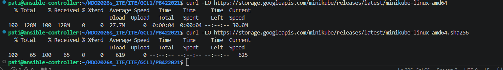
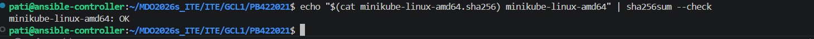

Przy uruchamianiu Minikube ograniczyłam go, żeby nie przeciążyć mojej maszyny wirtualnej. Dodałam do komendy startowej flagi --cpus=2 oraz --memory=4096, co pomyślnie i bezpiecznie postawiło cały klaster.

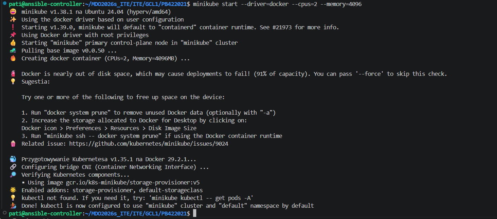

Żeby nie wpisywać za każdym razem długich poleceń, utworzyłam sobie wygodny alias minikubctl. Od razu po tym sprawdziłam stan klastra, a komenda pokazała mój działający węzeł ze statusem ready.

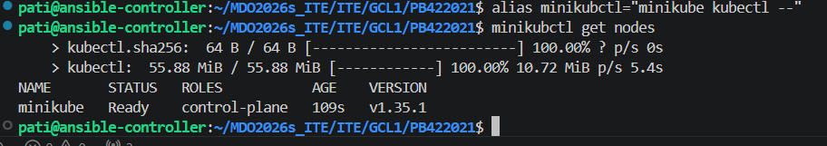

Na koniec odpaliłam graficzny interfejs Kubernetesa poleceniem działającym w tle. Dzięki przekierowaniu portów w VS Code mogłam kliknąć wygenerowany w terminalu link i otworzyć działający panel klastra bezpośrednio w przeglądarce na moim Windowsie.

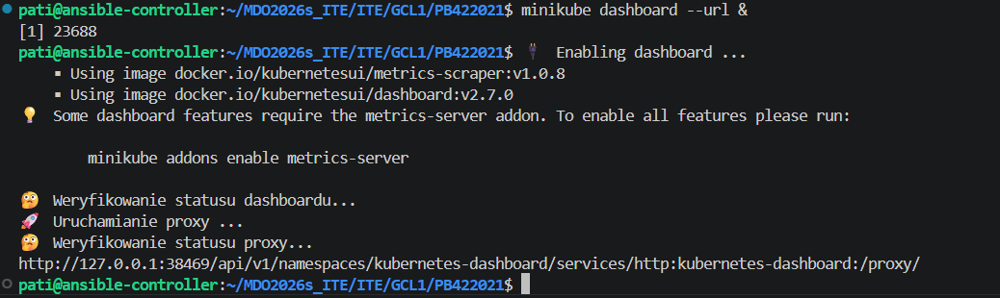
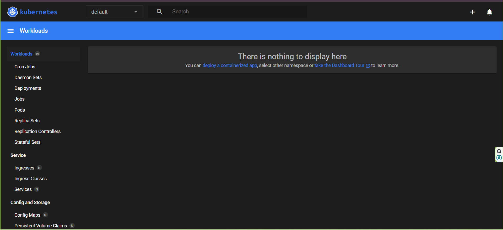


### Analiza posiadanego kontenera

Zdecydowałam się na wdrożenie mojej aplikacji bezpośrednio na kontener. Użyłam własnego programu i zbudowałam na jego bazie obraz. 

W folderze z moją pobraną aplikacją napisałam plik [Dockerfile](Dockerfile). Jako bazę wykorzystałam w nim lekkie środowisko Node.js, kazałam rozpakować pliki z aplikacją i dodałam główną komendę, która po starcie utrzyma serwer przy życiu.

Mając gotowy plik, zbudowałam swój obraz Dockera za pomocą polecenia docker build. Proces przeszedł pomyślnie.

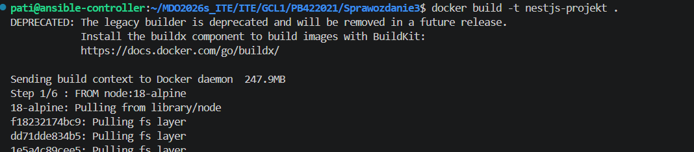

Kolejnym etapem było uruchomienie mojego zbudowanego obrazu poleceniem docker run. Dodałam do niego parametr -d, dzięki czemu kontener wystartował jako cicho działająca usługa w tle, wystawiając swój interfejs na zewnątrz.

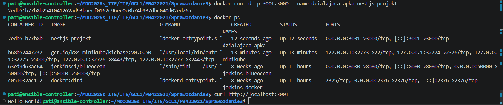

Na koniec użyłam komendy curl, a działająca w środku aplikacja poprawnie odpowiedziała komunikatem "Hello World!".


### Uruchamianie oprogramowania

Zanim uruchomiłam aplikację, musiałam przenieść mój lokalnie zbudowany obraz do wewnątrz zamkniętego środowiska Minikube. Zrobiłam to za pomocą polecenia minikube image load, dzięki czemu klaster miał dostęp do mojej paczki.

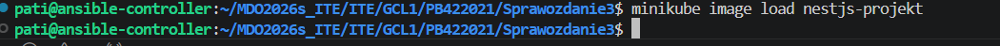

Mając gotowy obraz w pamięci klastra, utworzyłam nowe wdrożenie poleceniem kubectl run. Użyłam w nim parametru --image-pull-policy=Never, żeby wymusić na systemie użycie mojego lokalnego obrazu zamiast szukania go w internecie.

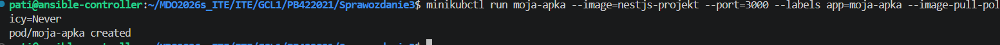

Zgodnie z poleceniem sprawdziłam, czy moja aplikacja faktycznie działa w klastrze. W terminalu użyłam komendy kubectl get pods, która pokazała status "Running". Zweryfikowałam to również wizualnie w panelu Dashboard.

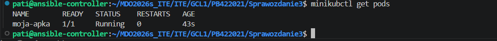
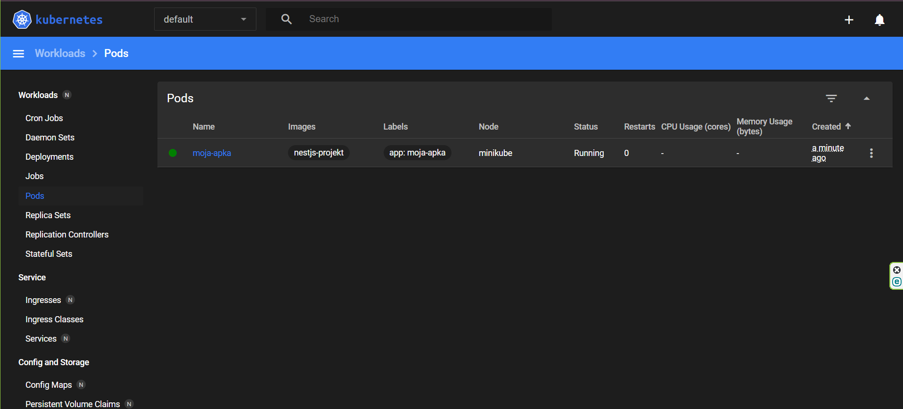

Ponieważ Kubernetes mocno izoluje uruchomione pody, musiałam przebić tunel sieciowy, żeby dostać się do interfejsu aplikacji. Użyłam komendy port-forward, przekierowując ruch na wolny port 8888. Na koniec przetestowałam ten tunel narzędziem curl.

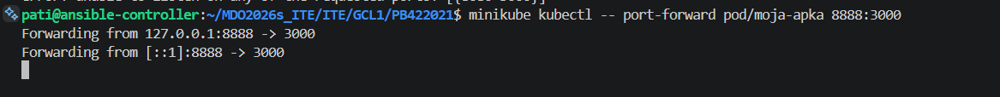
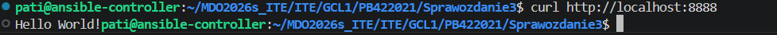


### Przekucie wdrożenia manualnego w plik wdrożenia

Utworzyłam plik [deployment.yaml](deployment.yaml), w którym opisałam jak ma wyglądać moje wdrożenie z początkowo jedną próbną repliką aplikacji. Następnie wgrałam ten plik do klastra za pomocą komendy kubectl apply -f deployment.yaml.

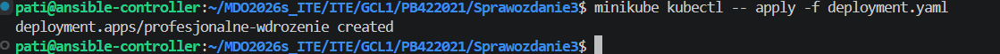
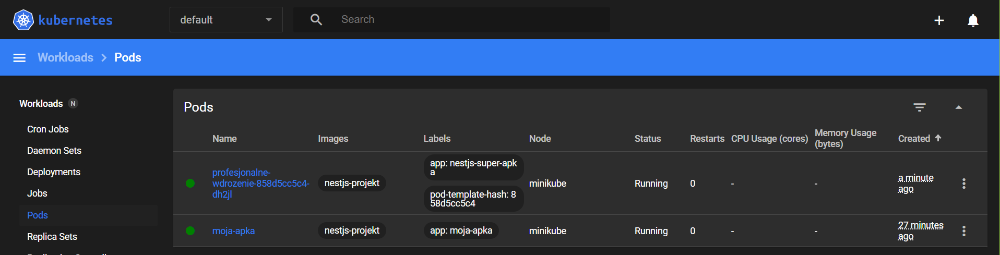

Następnie zwiększyłam ilość replik do 4 i użyłam polecenia kubectl apply.

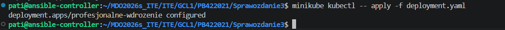
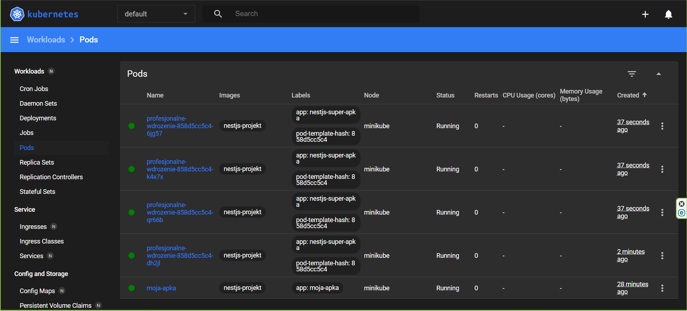


Aby się upewnić, że klaster poradził sobie z poprawnym uruchomieniem wszystkich czterech kopii naraz. Wpisałam polecenie kubectl rollout status, które potwierdziło, że proces powielania kontenerów zakończył się sukcesem.

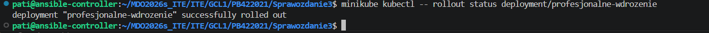

Ponieważ miałam teraz cztery działające Pody, musiałam połączyć je pod jednym spójnym adresem. Użyłam komendy kubectl expose deployment, co utworzyło w klastrze serwis, działający jako punkt wejścia dla mojej aplikacji.


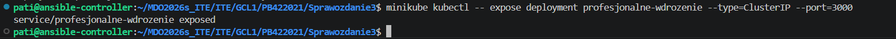

Następnie podobnie jak wcześniej przekeirowałam port do serwisu.


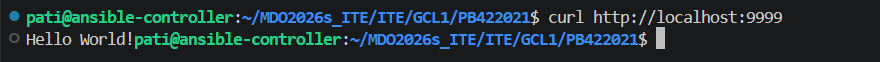


### Przygotowanie nowego obrazu

Aby udowodnić, że zarządzam wersjami, otworzyłam mój plik Dockerfile i wprowadziłam drobną modyfikację (dodałam zmienną środowiskową WERSJA=v2). Następnie poleceniem docker build wygenerowałam nową paczkę z tagiem v2 i załadowałam ją do klastra komendą minikube image load.

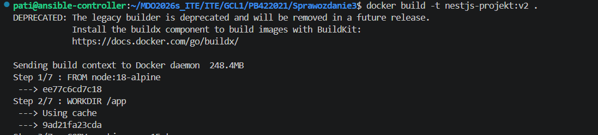
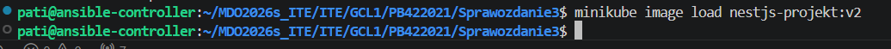

Upewniłam się, że w moim systemie są dwie wersje aplikacji.

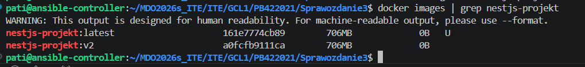

Na potrzeby kolejnych testów celowo zmodyfikowałam plik Dockerfile, ustawiając komendę startową na nieistniejący skrypt (zepsuty-plik.js). Zbudowałam obraz z tagiem error i wgrałam do klastra. Sam proces budowy i ładowania przeszedł bez błędów, ponieważ Docker jedynie pakuje pliki - awaria ujawni się dopiero podczas próby uruchomienia, gdy serwer spróbuje wywołać nieprawidłową komendę.

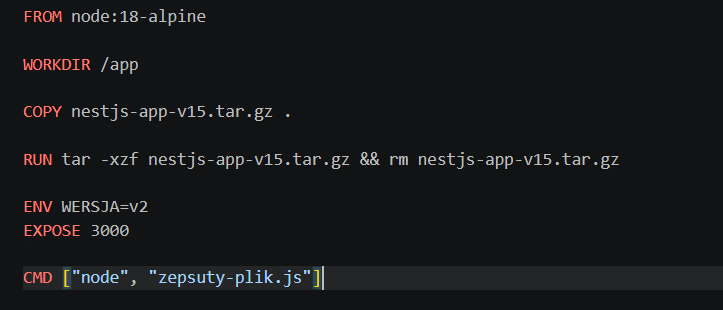
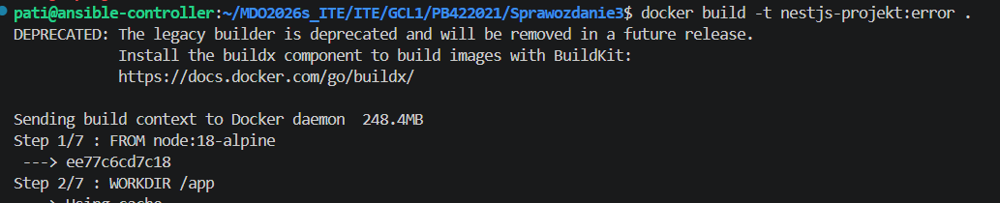
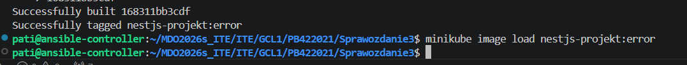


### Zmiany w deploymencie

Przetestowałam Kubernetesa zgodnie z instrukcją:

1) liczba replik: 8

Kubernetes błyskawicznie utworzył brakujące pody i rozłożył ruch na więcej instancji.

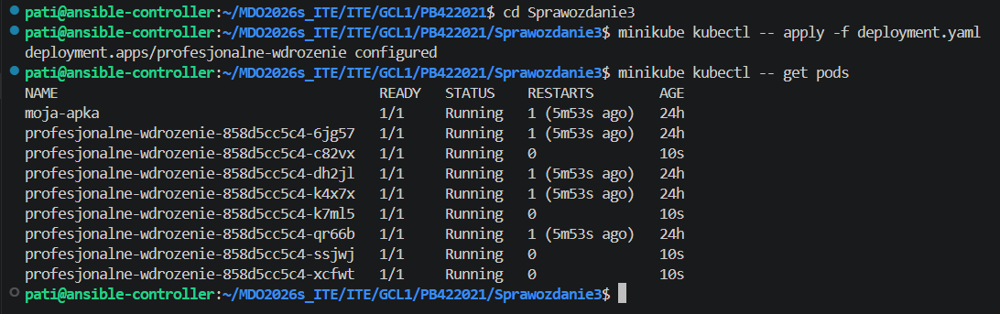

2) liczba replik: 1

System bezpiecznie wygasił nadmiarowe kontenery nadał im status terminating.

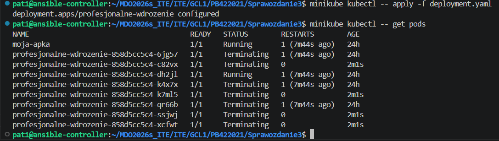

3) liczba replik: 0

Ustawienie zera replik całkowicie uśpiło aplikację, ale sama definicja wdrożenia została zachowana w pamięci klastra.

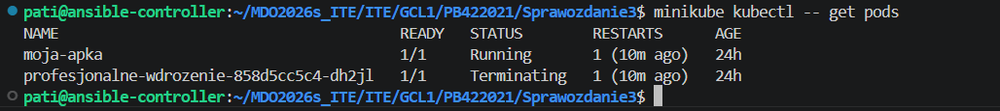

4) liczba replik: 4 (ponownie)

Po przywróceniu 4 replik, klaster momentalnie dostawił brakujące pody.
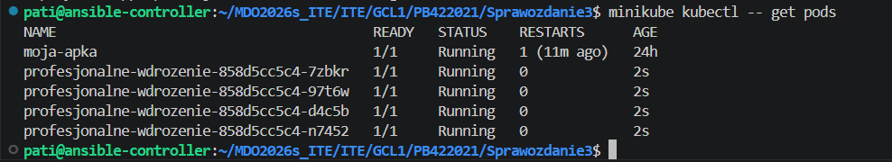

5) zastosowanie nowej wersji obrazu

Aktualizacja do wersji v2 przeszła płynnie dzięki mechanizmowi rolling update. Nowe kontenery przejmowały ruch stopniowo, a stare były wyłączane dopiero wtedy, gdy nowe były w 100% gotowe.

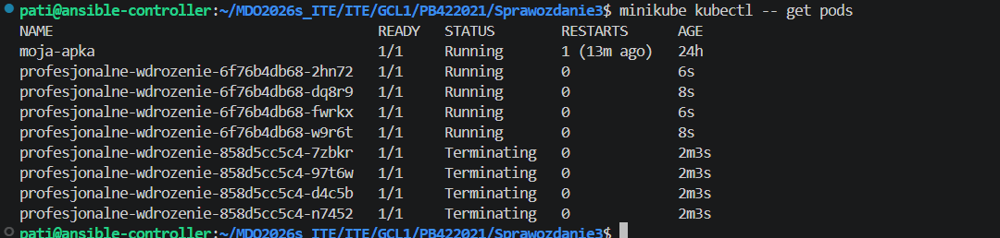

6) zastosowanie starszej wersji obrazu

Powrót do starszej wersji zadziałał dokładnie tak samo sprawnie jak poprzednia aktualizacja.

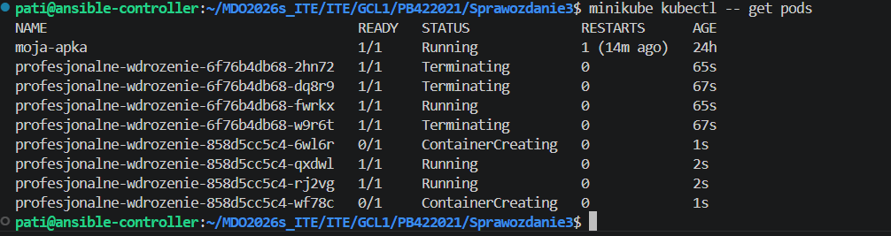

7) zastosowanie "wadliwego" obrazu 

Wgranie uszkodzonego obrazu pokazało  mechanizmy bezpieczeństwa klastra. Kiedy Kubernetes wykrył, że nowe kontenery od razu zwracają błąd, natychmiast wstrzymał aktualizację. System zachował starsze, sprawne repliki, co zagwarantowało ciągłość działania aplikacji mimo błędu w nowej wersji.

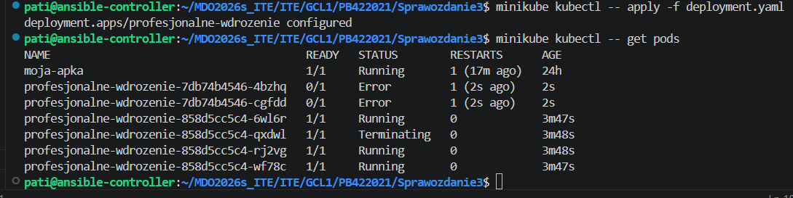

Aby posprzątać bałagan, użyłam najpierw polecenia kubectl rollout history, żeby podejrzeć listę poprzednich rewizji. Następnie wywołałam komendę kubectl rollout undo, która od razu cofnęła całe wdrożenie do ostatniej działającej wersji, przywracając moim podom czysty status "Running".

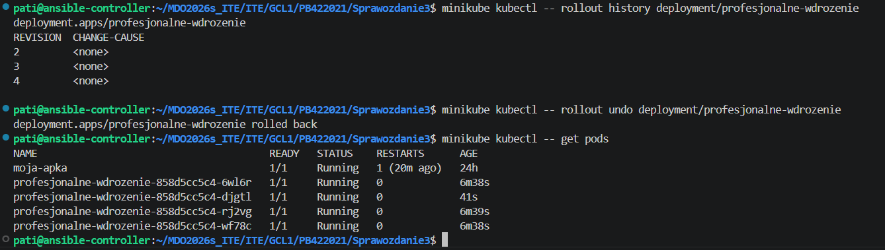


### Kontrola wdrożenia 

Napisałam krótki skrypt, weryfikujący czy wdrożenie "zdążyło" się wdrożyć w czasie 60 sekund. 

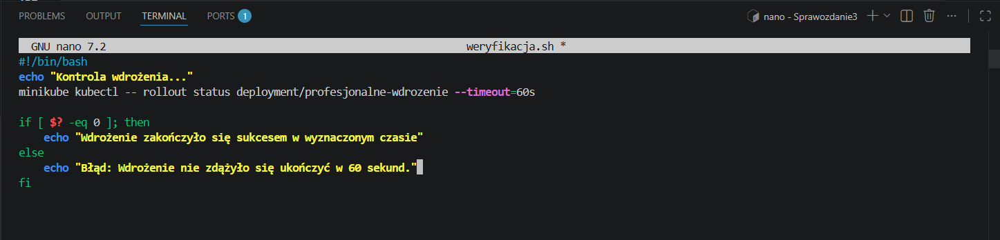

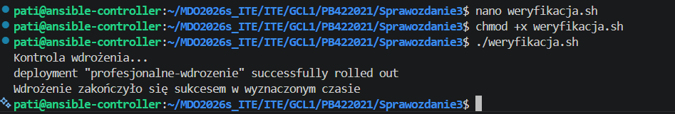


### Strategie wdrożenia

Najpierw przetestowałam strategię Recreate. Zmodyfikowałam plik deployment.yaml i po jego zaaplikowaniu Kubernetes najpierw usunął wszystkie stare pody, a dopiero po ich zniknięciu zaczął tworzyć nowe.

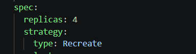

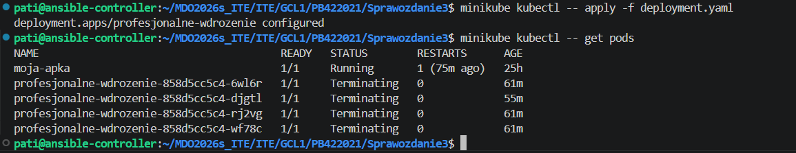

Następnie zmieniłam w pliku strategię na płynną aktualizację RollingUpdate, wymuszając parametry maxUnavailable: 2 oraz maxSurge: 25%. Dzięki temu system szybciej podmieniał po kilka kontenerów naraz, ale nadal utrzymywał aplikację przy życiu.

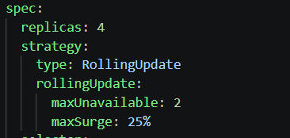

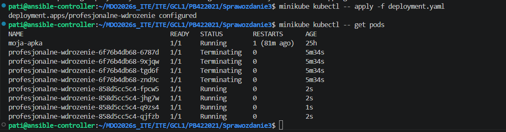


Na koniec zastosowałam Canary Deployment. Najpierw użyłam komendy expose, aby utworzyć serwis o nazwie moj-serwis, który ma za zadanie rozdzielać ruch sieciowy. Następnie z przygotowanego wcześniej pliku canary.yaml zaaplikowałam pojedynczą, testową replikę. Wynik polecenia get pods potwierdza sukces - na liście wyraźnie widać, że obok moich czterech starszych, głównych podów, działa już jeden nowy, świeżo uruchomiony pod testowy z dopiskiem canary.

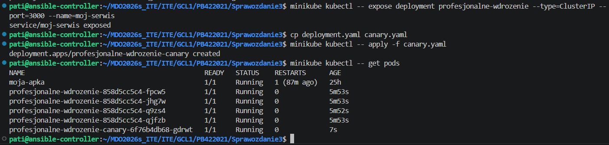

Podsumowując wszystkie strategie wdrożenia Recreate całkowicie odcina użytkowników na czas aktualizacji, ale gwarantuje brak konfliktów - nigdy nie działają dwie wersje naraz. Z kolei RollingUpdate pozwala na aktualizację bez przerw w dostępie, a wdrożenie typu Canary to najbezpieczniejsza opcja na sprawdzenie nowej wersji kodu tylko na garstce użytkowników, bez ryzykowania globalnej awarii.