# Sprawozdanie nr 3

#### Wszystkie zadania wykonałam na Ubuntu Server 24.04 LTS w Hyper-V, poprzez połączenie zdalne przez protokół SSH z poziomu Visual Studio Code.

### Lab8

### Instalacja zarządcy Ansible

Laboratoria rozpoczęłam od utworzenia drugiej maszyny wirtualnej (ansible-target) w wersji Minimized. Zgodnie z wymaganiami, zapewniłam obecność pakietu tar oraz skonfigurowałam serwer OpenSSH, aby umożliwić zdalną automatyzację.

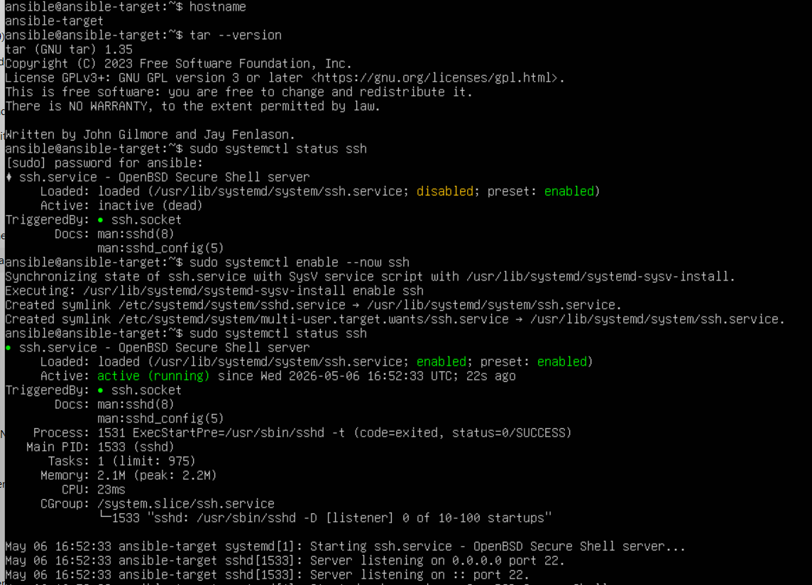

Następnie sprawdziłam adres IP nowej maszyny, a następnie na maszynie głównej skonfigurowałam plik /etc/hosts, aby umożliwić komunikację po nazwie hostname.

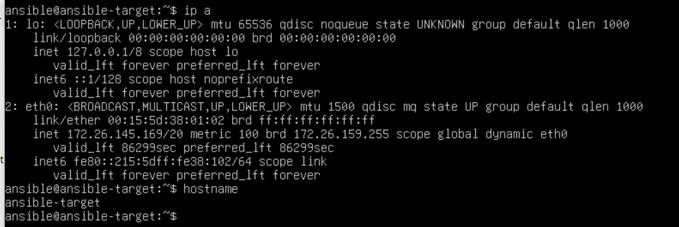

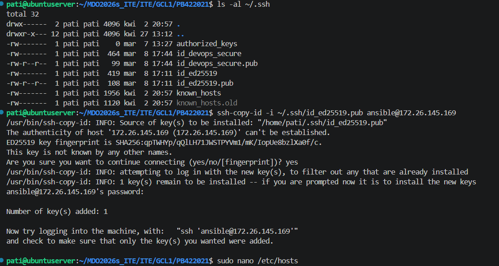

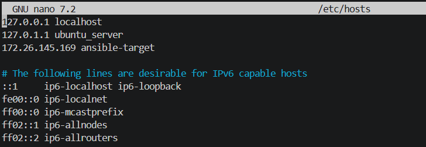

Po przejściu powyższych etapów wszytsko zadziałało poprawnie:

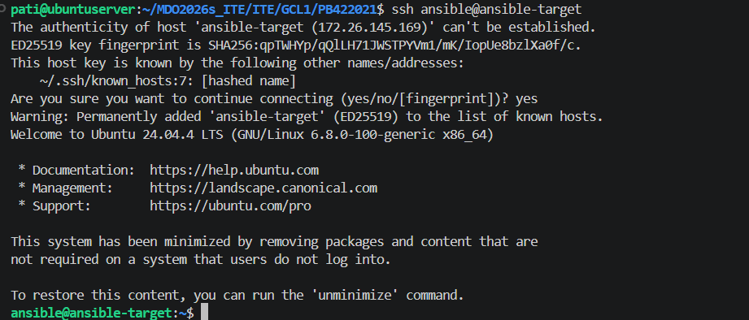

### Inwentaryzacja

Zgodnie z dobrą praktyką dokonałam zmiany nazwy głównej maszyny wirtualnej. Za pomocą narzędzia hostnamectl nadałam mojej maszynie głównej nazwę ansible-controller.

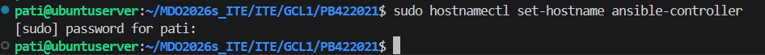

Widać, że nazwa została poprawnie zmieniona:


Ponieważ tworząc maszynę wirtualną ansible od razu nazwałam ją ansible-target, teraz nie musiałam już tego robić.

Następnie sprawdziłam adresy ip obu maszyn i wpisałam je do pliku /etc/hosts.

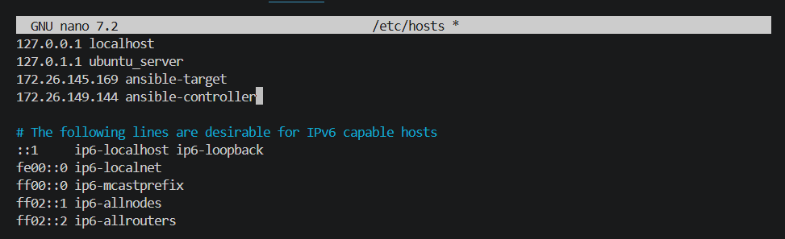

Następnie zweryfikowałam łączność za pomocą polecenia ping. Otrzymałam odpowiedź spod adresu ip przypisanego do ansible-target, zatem wszystko zadziałało poprawnie.

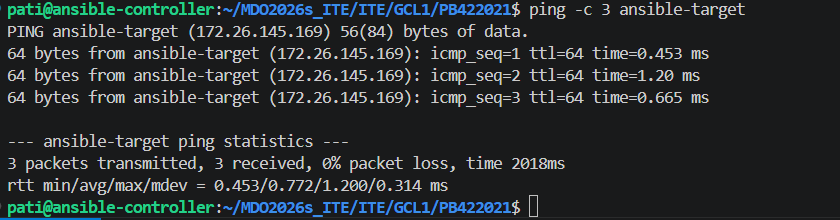

Następnie przeszłam do utworzenia pliku inwentaryzacji.

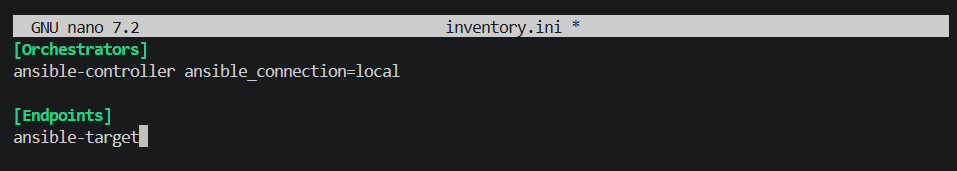

Aby zweyfikować poprawność wysłałam żądanie ping do wszystkich maszyn.

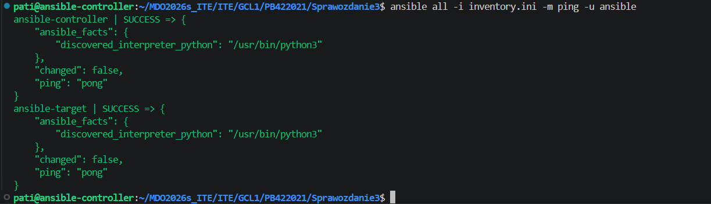

Wnikiem jest success w obu przypadkach oraz odpowiedź pong, co wskazuje na poprawne wykonanie konfiguracji. Potwierdza to też, że Ansible poprawnie odczytał plik inventory.ini i znalazł oba hosty.

### Zdalne wywołanie procedur 

Napisałam playbooka, który najpierw pinguje wszystkie maszyny, żeby sprawdzić łączność. Następnie na maszynie docelowej kopiuję plik inwentarza i aktualizuję system - rozbiłam to na dwa etapy, aby uniknąć błędów technicznych w module apt. Na koniec restartuję usługi SSH i RNGD.

```bash
- name: Procedury zdalne
  hosts: all
  tasks:
    - name: Ping
      ansible.builtin.ping:

- name: Zadania na Endpoints
  hosts: Endpoints
  become: yes
  tasks:
    - name: Kopiowanie pliku inwentory.ini
      ansible.builtin.copy:
        src: inventory.ini
        dest: /home/ansible/inventory.ini

    - name: Odświeżenie listy pakietów (apt update)
      ansible.builtin.apt:
        update_cache: yes

    - name: Aktualizacja wszystkich pakietów (apt upgrade)
      ansible.builtin.apt:
        upgrade: yes

    - name: Restart usług
      ansible.builtin.service:
        name: "{{ item }}"
        state: restarted
      loop:
        - ssh
        - rng-tools-debian
      ignore_errors: yes
```

Następnie uruchomiłam playbooka komendą ```ansible-playbook -i inventory.ini playbook.yaml -u ansible -K ```

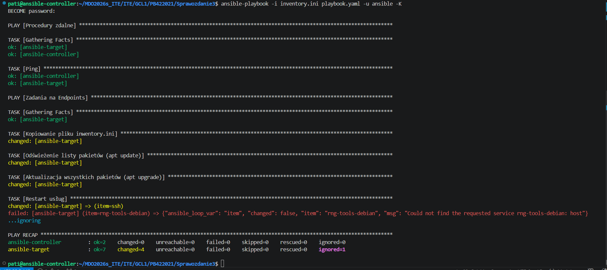

Pojawił się komunikat o braku usługi rngd, zatem dopisałam do playbooka fragment, który zapewnia, że zostanie on zainstalowany. Poprawiony [playbook](playbook.yaml). Uruchomilam plik ponownie i widać, że zadania, któe zostały juz uruchomione wcześniej są od razu na zielono. Ansible nie tracił czasu na powtarzanie tych czynności. Natomiast usługa rngd została poprawnie zainstalowana i zadziałała. 

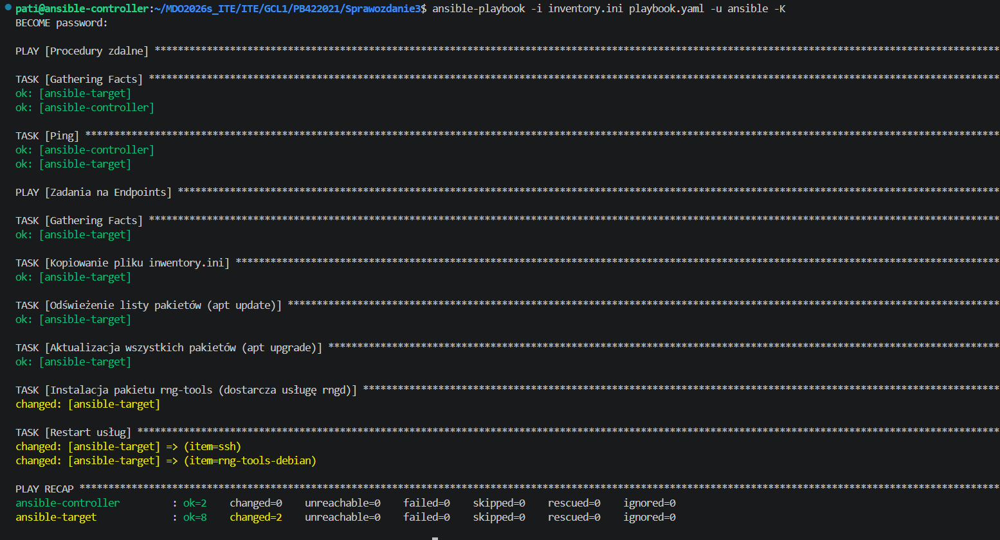


Następnie przetestowałam operację względem maszyny z wyłączonym serwerem SSH i odpiętą kartą sieciową. Tym razem otrzymałam błąd UNREACHABLE, co potwierdza, że system poprawnie potrafii wykryć awarię połączenia i zatrzymuje dalsze działania, aby nie generować dalszych błędów. 

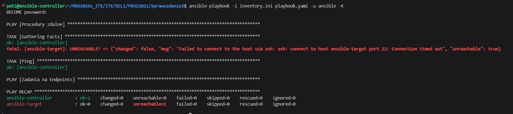

### Zarządzanie stworzonym artefaktem

Moim artefaktem z pipelinu był plik .tar, zatem utworzyłam rolę i przeniosłam gotowy artefakt do folderu app_deploy/files.


Następnie otworzyłam plik [app_deploy/meta/main.yml](app_deploy/meta/main.yml) i zaczęłam go modyfikować. 

```bash
galaxy_info:
  author: Patrycja
  description:Zarządzanie artefaktem NestJS
  licence: MIT
  min_ansible_version: 2.1
  platforms:
    - name: Ubuntu
      versions:
        - all

dependencies: []
```

W kolejnym kroku przeszłam do modyfikacji pliku [app_deploy/tasks/main.yml](app_deploy/tasks/main.yml), w którym wykonałam kroki zawarte w instrukcji.

```bash
---
# Sanity check
- name: Sanity check 
  ansible.builtin.shell: df -h / | tail -1 | awk '{print $4}'
  register: disk_space
  ignore_errors: yes

- name: Wyświetlenie wyniku sanity check
  ansible.builtin.debug:
    msg: "Dostępne miejsce: {{ disk_space.stdout }}"

# Instalacja dockera
- name: Instalacja Docker
  ansible.builtin.apt:
    name: docker.io
    state: present
    update_cache: yes

- name: Uruchomienie usługi Docker
  ansible.builtin.service:
    name: docker
    state: started
    enabled: yes

# Wysłanie i przygotowanie aplikacji
- name: Tworzenie folderu na aplikację
  ansible.builtin.file:
    path: /home/ansible/app_deploy
    state: directory

- name: Wysłanie i rozpakowanie artefaktu
  ansible.builtin.unarchive:
    src: nestjs-app-v17.tar.gz
    dest: /home/ansible/app_deploy/

#Uruchomienie w konetenerze
- name: Uruchomienie kontenera z aplikacją
  community.docker.docker_container:
    name: nestjs_app
    image: node:18-alpine
    state: started
    volumes:
      - /home/ansible/app_deploy:/app
    working_dir: /app
    command: "node dist/main.js"
    ports:
      - "3000:3000"

# Sanity check wdrozenia 
- name: Czekam 5 sekund na start...
  ansible.builtin.pause:
    seconds: 5

- name: Weryfikacja działania 
  ansible.builtin.uri:
    url: "http://localhost:3000"
    status_code: 200
  register: web_result

- name: Potwierdzenie weryfikacji
  ansible.builtin.debug:
    msg: "Aplikacja odpowiada poprawnie!"
  when: web_result.status == 200

# Cleanup
- name: Zatrzymanie i usunięcie kontenera
  community.docker.docker_container:
    name: nestjs_app
    state: absent

- name: Usunięcie plików aplikacji
  ansible.builtin.file:
    path: /home/ansible/app_deploy
    state: absent
```

Następnie w moim folderze Sprawozdanie3 utworzylam playbook deploy_artifact.yml.

```bash
---
- name: Zarządzanie stworzonym artefaktem
  hosts: Endpoints
  become: yes
  roles:
    - app_deploy
```

Natsępnie uruchomiłam całość poleceniem ```ansible-playbook -i inventory.ini deploy_artifact.yml -u ansible -K``` i otrzymałam taki wynik:

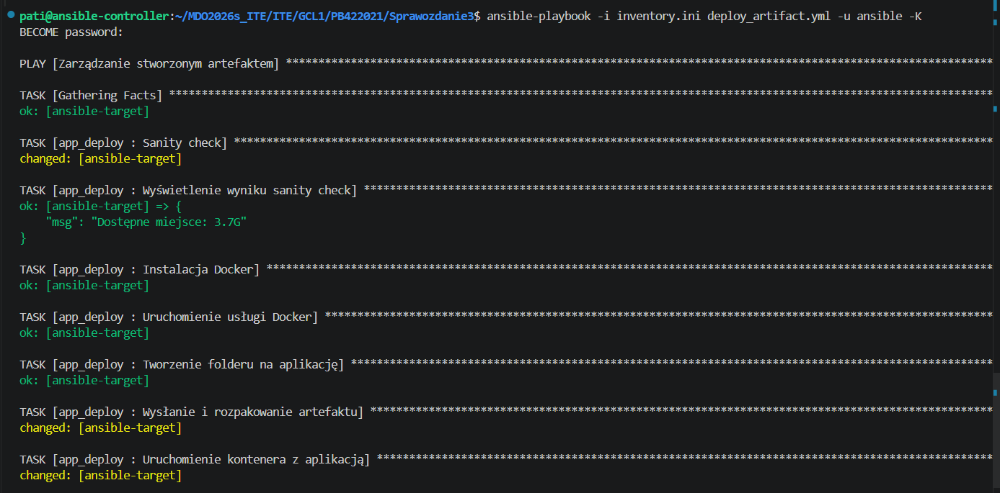
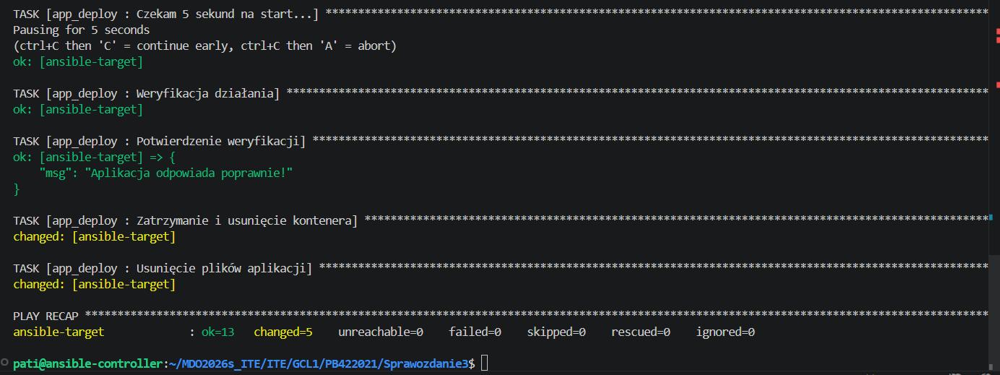

Proces wdrożenia zakończył się sukcesem (failed=0).Moduł uri uderzył na port 3000 uruchomionego kontenera i otrzymał odpowiedź HTTP 200, co dowodzi, że aplikacja faktycznie wstała i działała, a nie tylko została przekopiowana. Na koniec środowisko zostało pomyślnie oczyszczone z testowego wdrożenia - usunięto kontener i wypakowane pliki.

### Lab 9

Laboratoria rozpoczęłam od utworzenia nowej madszyny wirtualnej Fedora. Instalacja przebiegła pomyślnie, więc się do niej zalogowałam.

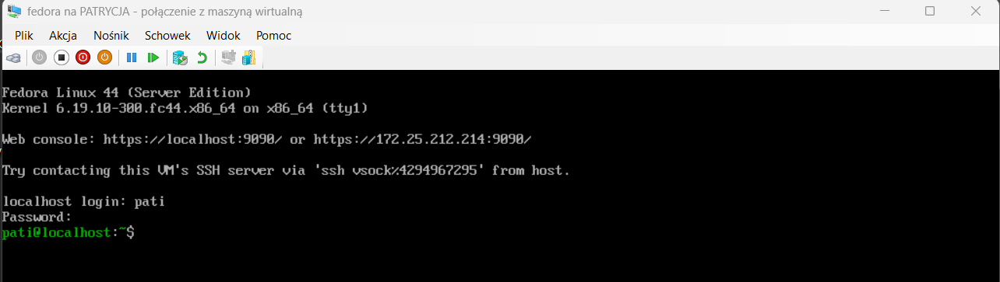

Następnie połączyłam się z Fedorą poprzez ssh, aby móc wygodnie pracować w visual studio code i przeszłam do znalezienia pliku odpowiedzi /root/anaconda-ks.cfg.

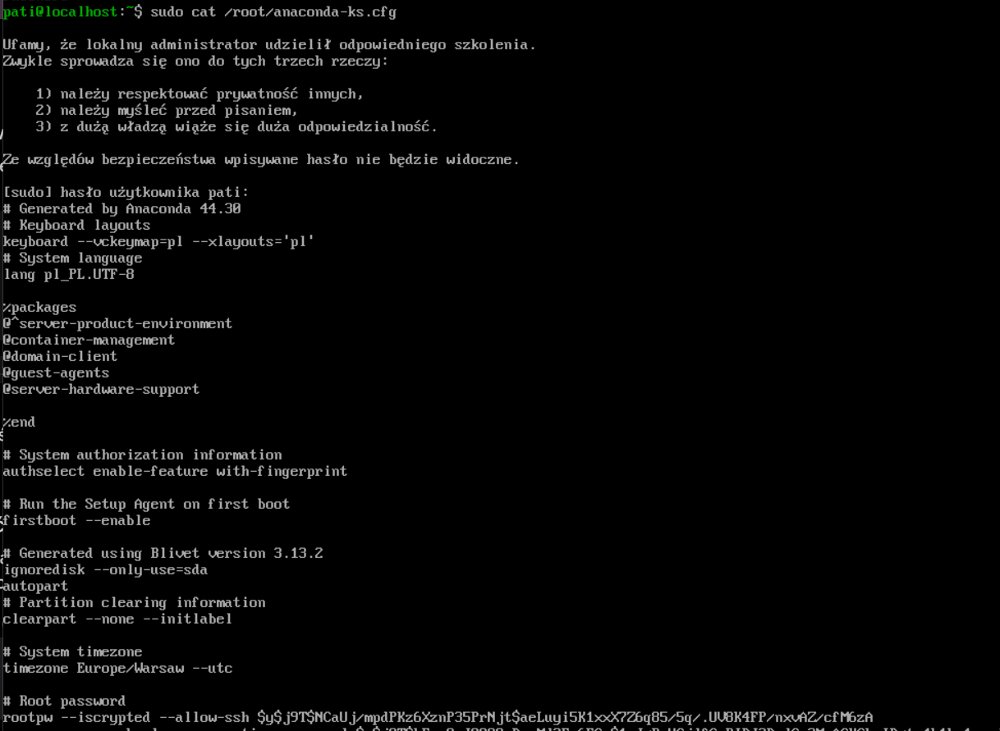

Natstępnie utworzyłam plik anaconda-ks.cfg i skopiowałam tam zawartość tego co otrzymałam w odpowiedzi na polecenie cat. 

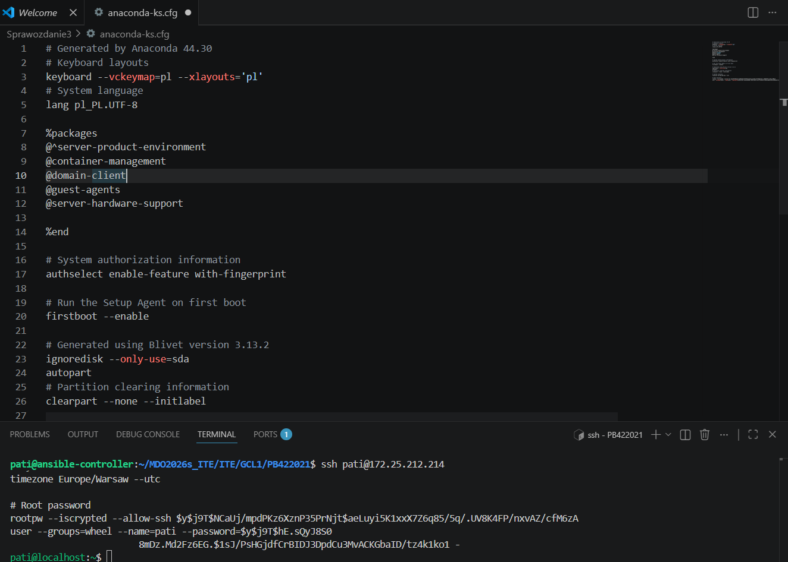

W kolejnym kroku zmodyfikowałam ten plik zgodnie z instrukcją, czyli tak aby plik umożliwiał reinstalację w kółko oraz hostname był inny niż localhost (u mnie jest to server-pati).


```bash
url --mirrorlist=https://mirrors.fedoraproject.org/mirrorlist?repo=fedora-44&arch=x86_64
repo --name=update --mirrorlist=https://mirrors.fedoraproject.org/mirrorlist?repo=updates-released-f44&arch=x86_64

keyboard --vckeymap=pl --xlayouts='pl'
lang pl_PL.UTF-8

network --bootproto=dhcp --device=link --activate
network --hostname=serwer-pati

%packages
@^server-product-environment
@container-management
@domain-client
@guest-agents
@server-hardware-support
%end

firstboot --disable

zerombr

# reinstalacja w kółko
clearpart --all --initlabel

autopart --type=plain

timezone Europe/Warsaw --utc

rootpw pati
user --groups=wheel --name=pati --password=pati
reboot


```
Następnie przystąpiłam do próby instalacji nienadzorowanej.  W tym celu utworzyłam nową maszynę wirtualną. Po jednej poprawce w pliku odpowiedzie (nie zgadzały się wersje fedory) bezdotykowa instalacja zakończyła się sukcesem.

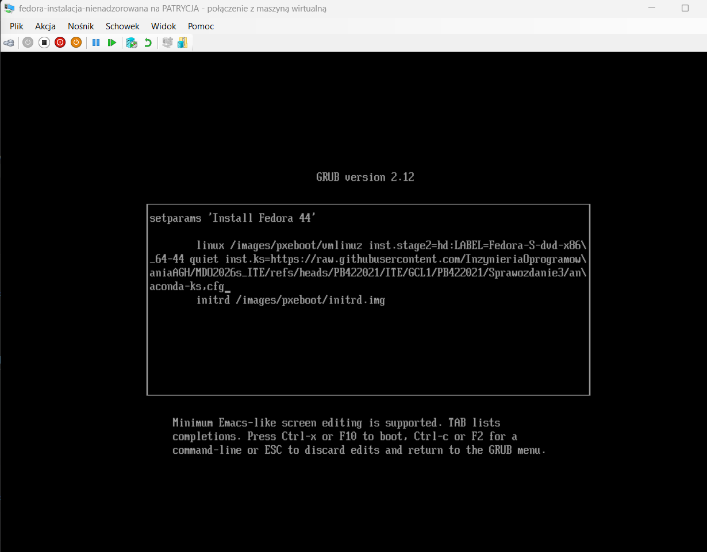
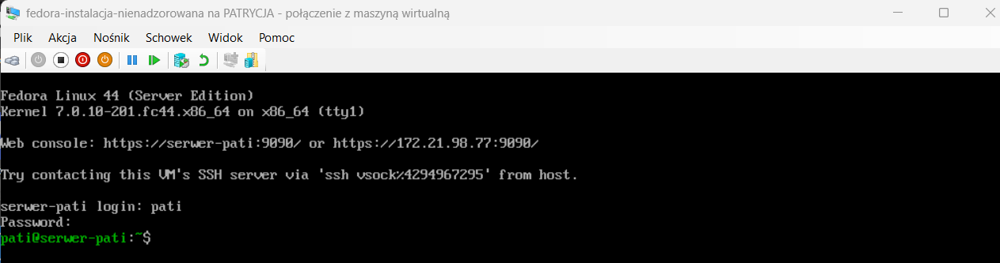


Następnie w pliku odpowiedzi dodałam niezbędne narzędzia, takie jak nodejs, wget i tar do sekcji z pakietami, żeby po instalacji system miał jak pobrać i uruchomić projekt. Początkowo proces miał opierać się na bezpośrednim pobieraniu artefaktu z Jenkinsa, jednak ze względu na problemy z zaporą sieciową, która blokowała ruch, zastosowałam sprytne obejście. Polegało ono na uruchomieniu prywatnego serwera HTTP za pomocą wbudowanego modułu Pythona bezpośrednio w środowisku VS Code.

W związku z tym w sekcji %post napisałam skrypt, który od razu po instalacji systemu tworzy nowy folder w /usr/local/bin i pobiera do niego gotowy artefakt z aplikacją z mojego lokalnego serwera działającego w VS Code. Następnie skrypt rozpakowuje pliki i od razu kasuje zbędne archiwum. Żeby spełnić wymóg automatycznego uruchamiania programu, dopisałam konfigurację usługi systemd, która po cichu startuje aplikację w środowisku Node.js. Na sam koniec aktywowałam tę usługę poleceniem systemctl enable, dzięki czemu po restarcie maszyny system od razu podnosi aplikację i wszystko działa w pełni automatycznie.

 [Finalny plik anaconda-ks.cfg](anaconda-ks.cfg)

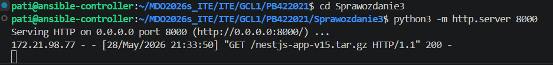
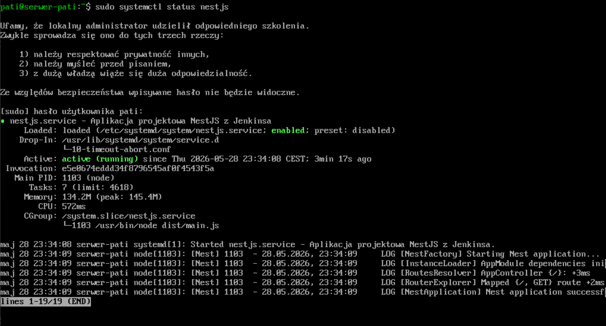


Zrzuty ekranu potwierdzają sukces przeprowadzonej automatyzacji.