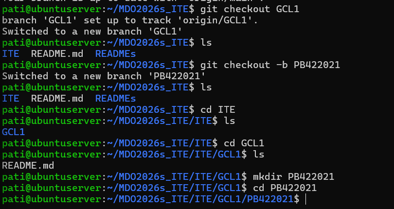

Sprawozdanie nr 1

treść hooka:

#!/bin/bash
INPUT_FILE=$1
START_LINE=$(head -n 1 "$INPUT_FILE")
if [[ ! $START_LINE =~ ^PB422021 ]]; then
  echo "BŁĄD: Commit message musi zaczynać się od PB422021"
  exit 1
fi

Utworzenie własnego folderu z inicjałem i nr indeksu:
