# Sprawozdanie 1

Piotr Chajec 422024 GR1

## Środowisko pracy

Wszystkie działania zostały wykonane w systemie Linux (Ubuntu Server) za pośrednictwem połączenia SSH, logując się jako użytkownik - piotr. Połączenie SSH zostało wykonane poprzez rozszerzenie Visual Studio Code.


# LAB1 - Wprowadzenie, Git, Gałęzie, SSH

## Git

Gdy klient Git został zainstalowany, nasze repozytorium grupowe zostało sklonowane poprzez klasyczne HTTPS i personal access token

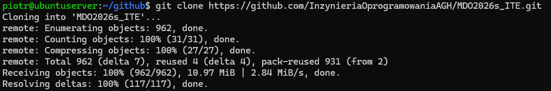

## SSH

Następnie przystąpiono do wygenerowania pary kluczy SSH. Użyto algorytmu `ed25519`, a klucz zabezpieczono dodatkowym hasłem.

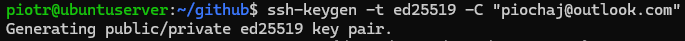

Po wygenerowaniu klucza i dodaniu klucza publicznego do ustawień konta GitHub, repozytorium zostało sklonowane ponownie, tym razem z użyciem protokołu SSH. Repozytorium zostało sklonowane do odrębnego katalogu `repo-ssh`.

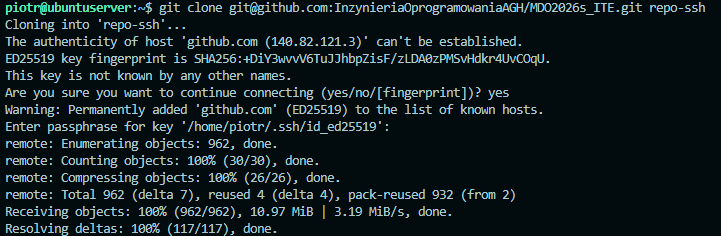

## Gałąź

Przechodząc do sklonowanego repozytorium, przełączono się na gałąź grupową `GCL1`. Następnie, zgodnie z poleceniem utworzenia gałęzi o nazwie składającej się z inicjałów i numeru indeksu, utworzono nową gałąź o nazwie `PC422024` i przełączono się na nią.

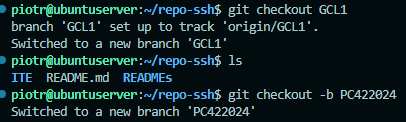

W celu wymuszenia poprawności formatowania wiadomości do commitów (każdy "commit message" musi zaczynać się od identyfikatora `PC422024`), przygotowano skrypt bash pełniący rolę Git Hooka typu `commit-msg`. Skrypt został zapisany i umieszczony w katalogu `.git/hooks`.

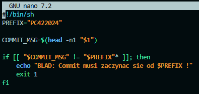

# LAB2 - Git, Docker

## Weryfikacja instalacji Dockera i poobrane obrazy

Po zainstalowaniu środowiska Docker w systemie linuksowym, sprawdzono jego poprawne działanie uruchamiając testowy kontener z obrazu `hello-world`. 

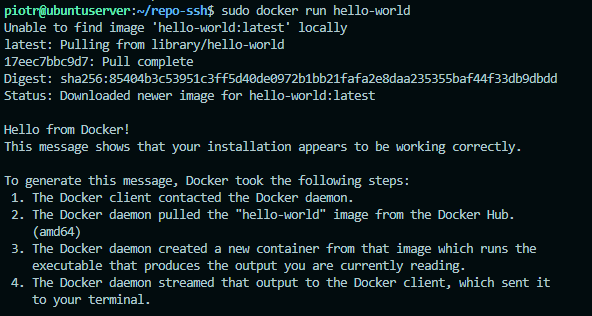

Pobrano zapronowane w poleceniu obrazy i wyświetlono je wszystkie za pomocą `docker images`, wraz z ich rozmiarami.

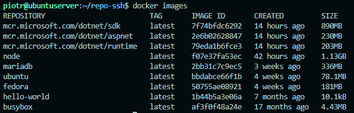

## Praca z kontenerem busybox

Kolejnym krokiem było uruchomienie lekkiego kontenera z obrazu `busybox`. Po jego standardowym uruchomieniu i natychmiastowym zakończeniu działania, sprawdzono kod wyjścia (exit code) za pomocą polecenia `echo $?`, który wyniósł `0`, oznaczając brak błędów.

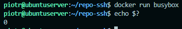

Następnie kontener uruchomiono ponownie, tym razem w trybie interaktywnym z podłączonym terminalem (flagi `-it`) z powłoką `sh`. Wykonano proste polecenie weryfikujące wersję i zakończono pracę.

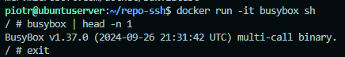

## System w kontenerze (Ubuntu)

W celu zbadania zachowania procesów wewnątrz izolowanego środowiska, uruchomiono "system w kontenerze" wykorzystując obraz `ubuntu`. Za pomocą polecenia `ps` zweryfikowano, że procesem głównym (PID 1) wewnątrz kontenera jest uruchomiona powłoka `bash`. Następnie zaktualizowano listę pakietów oraz same pakiety (`apt update && apt upgrade -y`).

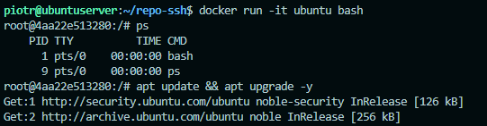

## Własny obraz (Dockerfile) i pobieranie repozytorium

W celu zautomatyzowania procesu pobierania repozytorium przygotowano własny plik `Dockerfile` bazujący na systemie Ubuntu. Obraz został zaopatrzony w program `git`, a proces instalacji zoptymalizowano poprzez usunięcie cache'u menedżera pakietów.

**Treść pliku Dockerfile:**
```dockerfile
FROM ubuntu:latest
RUN apt-get update && apt-get install -y git && \
    rm -rf /var/lib/apt/lists/*

WORKDIR /app
RUN git clone [https://github.com/InzynieriaOprogramowaniaAGH/MDO2026s_ITE.git](https://github.com/InzynieriaOprogramowaniaAGH/MDO2026s_ITE.git) .
CMD ["bash"]
```

Obraz zbudowano lokalnie pod nazwą `repo-git`.

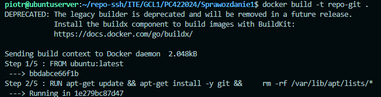

Po pomyślnym zbudowaniu obrazu uruchomiono go w trybie interaktywnym. Za pomocą polecenia `ls -la` zweryfikowano obecność ukrytego katalogu `.git` oraz plików projektowych, co potwierdza skuteczne pobranie repozytorium podczas etapu budowy.

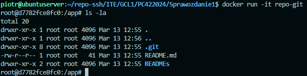

## Czyszczenie środowiska

Po zakończeniu pracy wywołano listę wszystkich (również zatrzymanych) kontenerów za pomocą polecenia `docker ps -a`.

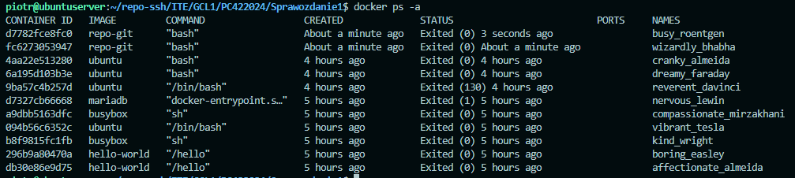

Środowisko zostało oczyszczone z nieużywanych instancji za pomocą polecenia `docker container prune`. Po zwolnieniu przestrzeni lista kontenerów pozostała pusta.

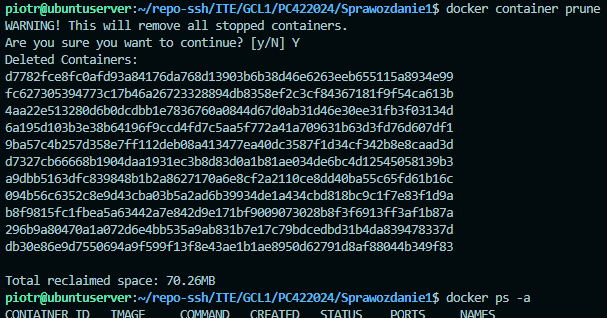

# LAB3 - Dockerfiles, kontener jako definicja etapu

## Wybór oprogramowania i interaktywny build w kontenerze

Do realizacji zadania wybrano projekt `nlohmann/json` (bibliotekę C++ do obsługi formatu JSON), który dysponuje otwartą licencją, wykorzystuje system budowania CMake oraz zawiera testy jednostkowe.

Proces budowy i testowania przeprowadzono interaktywnie wewnątrz kontenera bazowego. Uruchomiono obraz `ubuntu:22.04` z podłączonym TTY, a następnie zaopatrzono środowisko w niezbędne zależności uruchamiając komendę instalującą m.in. `git`, `build-essential` oraz `cmake`.

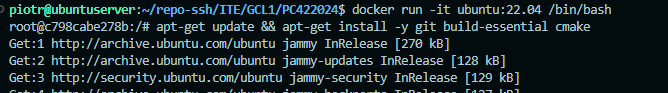

Następnie sklonowano repozytorium wybranego oprogramowania.

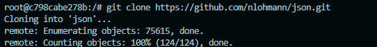

W kolejnym kroku skonfigurowano środowisko za pomocą polecenia `cmake` (włączając flagę budowania testów) i uruchomiono proces kompilacji `(build)`.

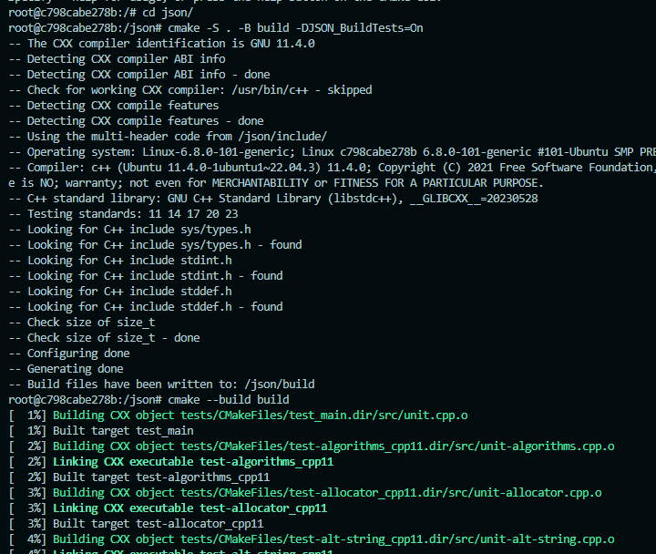

Po udanym zbudowaniu projektu, uruchomiono dołączone testy jednostkowe narzędziem `ctest`.

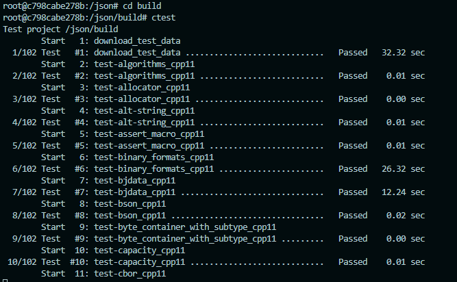

Testy zakończyły się pomyślnie, jednoznacznie formułując swój raport końcowy (100% tests passed).

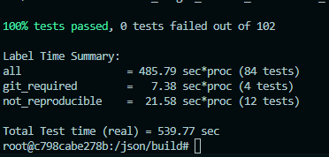

## Automatyzacja: Pliki Dockerfile jako etapy (Build i Test)

Manualny proces interaktywny zastąpiono automatyzacją, dzieląc go na dwa etapy za pomocą dwóch oddzielnych plików Dockerfile.

Przygotowano pierwszy plik konfiguracyjny `Dockerfile.build`, który bazuje na systemie Ubuntu i przeprowadza wszystkie kroki instalacji oraz kompilacji aż do momentu wykonania samego builda. Obraz zbudowano poleceniem docker build z tagiem json-build.

**Dockerfile.build**
```dockerfile
FROM ubuntu:22.04

RUN apt-get update && apt-get install -y \
    git \
    build-essential \
    cmake \
    && rm -rf /var/lib/apt/lists/*

WORKDIR /app

RUN git clone --depth 1 https://github.com/nlohmann/json.git .

RUN cmake -S . -B build -DJSON_BuildTests=On

RUN cmake --build build
```

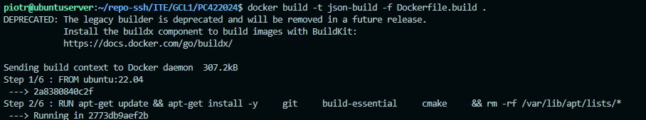

Proces budowania kontenera etapu pierwszego zakończył się sukcesem, tworząc bazowy artefakt z programem.

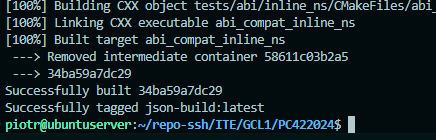

Następnie przygotowano drugi plik `Dockerfile.test`, który jako obrazu bazowego używa zbudowanego przed chwilą `json-build:latest` i odpowiada wyłącznie za wykonywanie testów, nie robiąc ponownego builda. Po zbudowaniu tego obrazu `test`, uruchomiono kontener, co wykazuje, że kontener wdraża się i pracuje poprawnie – procesem pracującym w tym kontenerze jest wyłącznie narzędzie testujące `ctest`.

**Dockerfile.test**
```dockerfile
FROM json-build:latest

WORKDIR /app/build

CMD ["ctest", "--output-on-failure"]
```

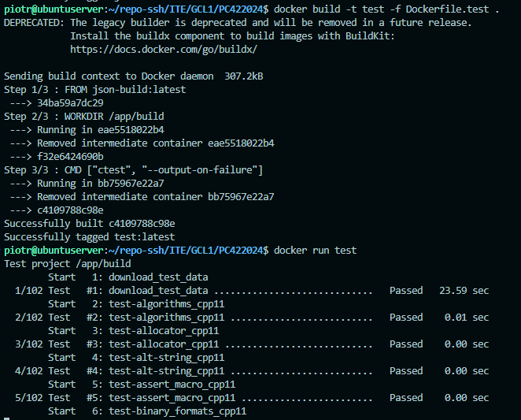

## Implementacja kompozycji (Docker Compose)

Ręczne wdrażanie kontenerów zastąpiono zautomatyzowanym podejściem przy użyciu narzędzia Docker Compose. Zdefiniowano usługę testową w pliku kompozycji i uruchomiono całość poleceniem docker-compose up, co skutecznie wywołało proces testowania zbudowanego artefaktu.

**docker-compose.yml**
```yml
version: '3.8'

services:
  testy3:
    build:
      context: .
      dockerfile: Dockerfile.test
```

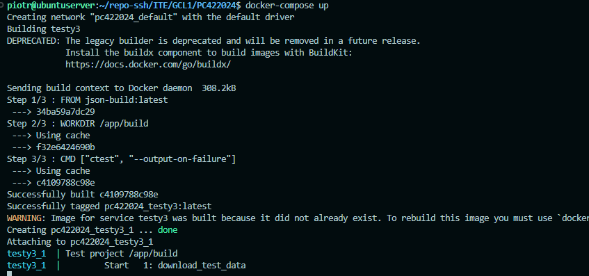

# LAB4 - Dodatkowa terminologia w konteneryzacji, instancja Jenkins

## Zachowywanie stanu między kontenerami

W celu zbadania mechanizmów zachowywania stanu, utworzono dwa dedykowane woluminy: `vol_in` (wejściowy) oraz `vol_out` (wyjściowy). Zgodnie z wytycznymi, kontener bazowy nie powinien korzystać z narzędzia Git. Aby to osiągnąć, sklonowanie repozytorium na wolumin wejściowy zrealizowano za pomocą jednorazowego kontenera pomocniczego bazującego na lekkim obrazie `alpine/git`. Podejście to pozwala na dostarczenie kodu do woluminu bez zaśmiecania docelowego środowiska. Następnie uruchomiono kontener bazowy `ubuntu:22.04`, podłączając do niego oba utworzone woluminy.

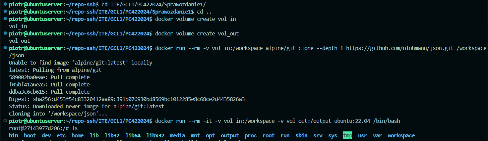

Wewnątrz kontenera bazowego (posiadającego dostęp do kodu pobranego na wolumin wejściowy) skonfigurowano środowisko i uruchomiono proces budowania projektu (build) za pomocą programu CMake.

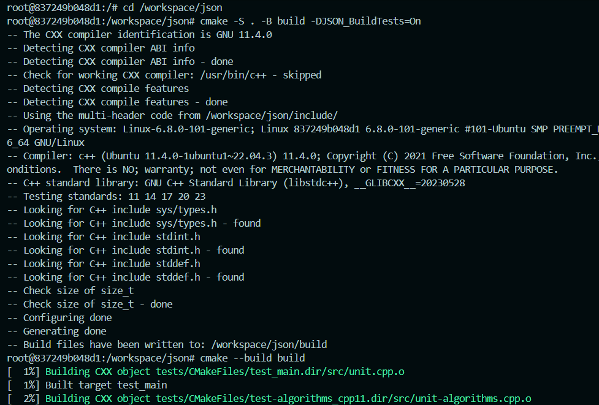

Po zakończeniu kompilacji, powstałe i zbudowane pliki skopiowano do wyznaczonego folderu (podłączonego pod `vol_out`), zapisując je tym samym na woluminie wyjściowym.

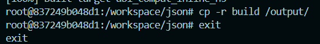

W celu zweryfikowania trwałości danych, uruchomiono kolejny kontener, mapując do niego wolumin wyjściowy. Polecenie `ls` wykazało, że wygenerowane pliki są w pełni dostępne po wyłączeniu wcześniejszego kontenera bazowego.

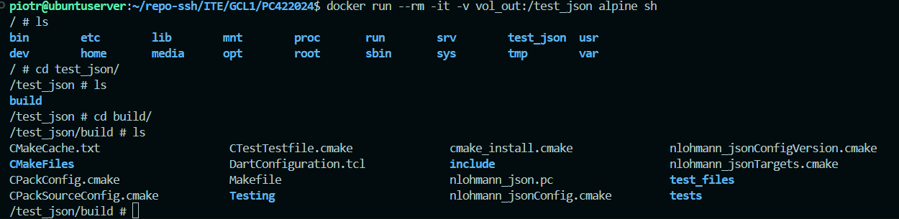

## Eksponowanie portu i łączność między kontenerami

Następnie badano ruch sieciowy i mechanizmy rozwiązywania nazw. Utworzono własną sieć o nazwie `siec1`. Wewnątrz tej sieci uruchomiono serwer aplikacji `iperf3` w kontenerze `iperf-serwer`, eksponując jednocześnie jego port na fizyczny port maszyny hosta (`-p 5201:5201`).

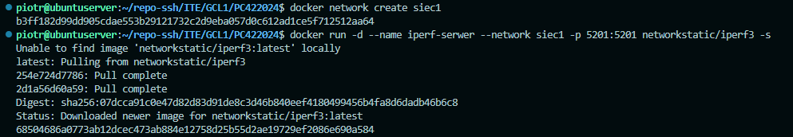

Aby przetestować łączność i przedstawić przepustowość komunikacji, uruchomiono drugi kontener (klienta) podpięty pod tę samą sieć `siec1`.

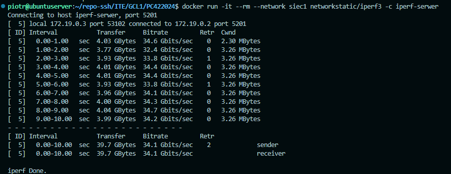

Przeprowadzono weryfikację eksponowania portu i nawiązano połączenie spoza kontenera – z poziomu hosta. Z lokalnej konsoli systemu Linux (hosta Dockera) wywołano test `iperf3` skierowany na adres `localhost` skutecznie łącząc się do wnętrza kontenera i generując raport przepustowości.

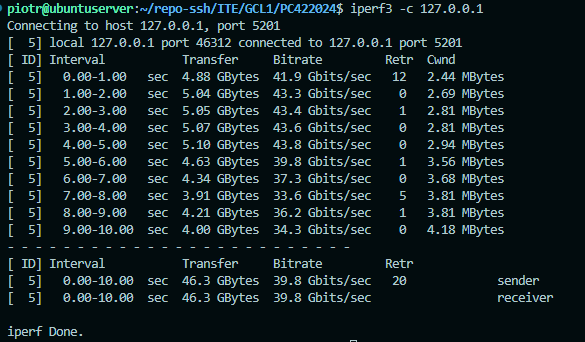

Ostateczny test sieciowy wykonano w pełni *spoza hosta* – użyto zewnętrznego komputera z systemem Windows podłączonego do tej samej sieci lokalnej. Skierowanie zapytania na adres IP maszyny wirtualnej z Linuksem.

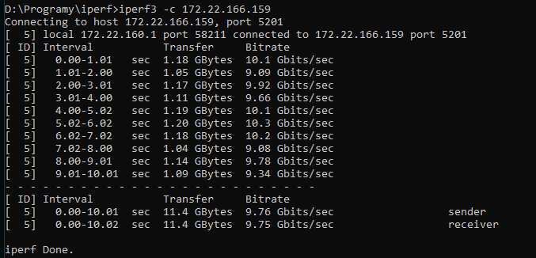

## Usługi w rozumieniu systemu, kontenera i klastra

W ramach przedostatniego zadania przystąpiono do zestawienia usługi SSHD wewnątrz systemu Ubuntu zamkniętego w kontenerze. Rozpoczęto od uruchomienia świeżego kontenera `kontener-ssh` z powłoką bash, mapując port usługi na zewnątrz hosta.

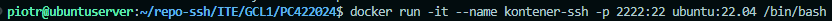

Po instalacji wymaganego pakietu `openssh-server`, server SSH został pomyślnie uruchomiony wewnątrz skonteneryzowanego systemu.

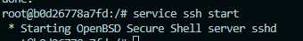

Dla szybkiego testu odblokowano możliwość logowanie się na konto root z użyciem hasła, modyfikując przy tym plik konfiguracyjny `/etc/ssh/sshd_config`.

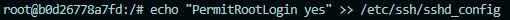

Z poziomu terminala hosta (Linuksa) pomyślnie nawiązano połączenie z usługą działającą wewnątrz izolowanego kontenera, co potwierdza poprawne działanie serwera SSH w kontenerze.

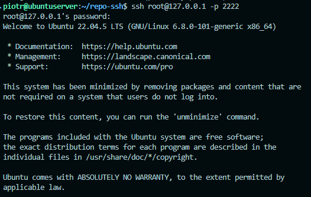

**Zalety i wady komunikacji z kontenerem z wykorzystaniem SSH:**
* **Przypadki użycia (zalety):**
  * **Zdalne środowiska programistyczne:** Środowiska IDE które wymagają bezpośredniego, natywnego połączenia SSH do maszyny docelowej.
* **Wady:**
  * **Łamanie zasady pojedynczego procesu:** Kontener z założenia powinien realizować jedną konkretną usługę. Wprowadzanie demona SSH (`sshd`) zmusza do zarządzania wieloma procesami, co kłóci się z filozofią konteneryzacji.
  * **Spadek bezpieczeństwa:** Dodatkowa usługa sieciowa zwiększa możliwości ataku.

## Przygotowanie do uruchomienia serwera Jenkins

Ostatnim etapem zajęć było wdrożenie skonteneryzowanej instancji Jenkinsa wraz z pomocnikiem DIND.

W tym celu przygotowano plik kompozycji `docker-compose.yml`:

**`docker-compose.yml`:**
```yml
version: '3.8'
services:
  jenkins-docker:
    image: docker:dind
    privileged: true
    environment:
      - DOCKER_TLS_CERTDIR=/certs
    volumes:
      - jenkins-docker-certs:/certs/client
      - jenkins-data:/var/jenkins_home
    networks:
      - jenkins

  jenkins-blueocean:
    image: jenkins/jenkins:lts-jdk17
    ports:
      - "8080:8080"
    environment:
      - DOCKER_HOST=tcp://jenkins-docker:2376
      - DOCKER_CERT_PATH=/certs/client
      - DOCKER_TLS_VERIFY=1
    volumes:
      - jenkins-data:/var/jenkins_home
      - jenkins-docker-certs:/certs/client:ro
    networks:
      - jenkins

networks:
  jenkins:
volumes:
  jenkins-data:
  jenkins-docker-certs:
  ```

Całe środowisko uruchomiono w tle za pomocą polecenia docker-compose up -d.

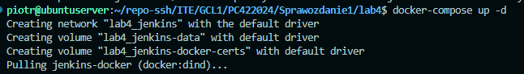

Poprawność uruchomienia wykazano wywołując polecenie docker ps. Widoczne są dwa współpracujące ze sobą kontenery: serwer aplikacji Jenkins z wyeksponowanym portem 8080 oraz DIND.

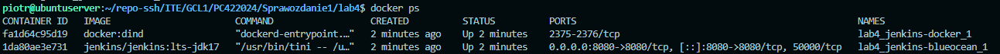

Po wpisaniu adresu IP z portem 8080 w przeglądarce i uwierzytelnieniu, zainicjalizowano instancję. Ukazano ekran główny serwera Jenkins.

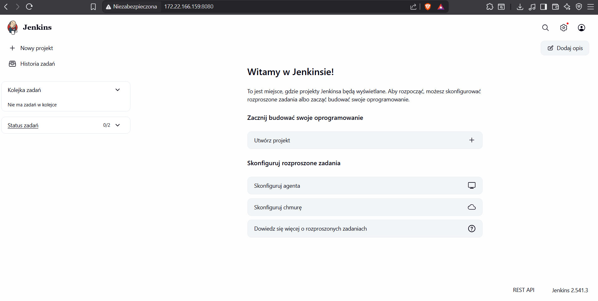

# Historia poleceń

Historia poleceń jest dostępna w pliku `ITE\GCL1\Sprawozdanie1\historia-polecen.txt`