# Sprawozdanie 2

Piotr Chajec 422024 GR1

## Środowisko pracy

Wszystkie działania zostały wykonane w systemie Ubuntu Server za pośrednictwem połączenia SSH. Kontynuowano pracę ze środowiskiem Jenkins uruchomionym w architekturze (DIND)

# LAB5 - Pipeline, Jenkins, izolacja etapów

## Zadania wstępne

Uruchomiono wcześniej przygotowany Jenkins na serwerze Linux, a następnie w przeglądarce zalogowano się na panel admina wcześniej skopiowanym hasłem

### Projekt wyświetlający uname

Utworzono projekt wykonujący proste polecenie powłoki `uname -a`. Po jego uruchomieniu zweryfikowano w logach konsoli, że środowisko poprawnie zwraca identyfikator jądra systemu Linux.
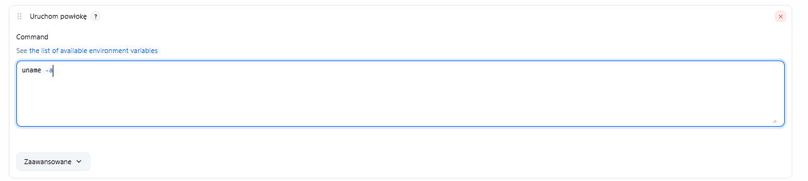
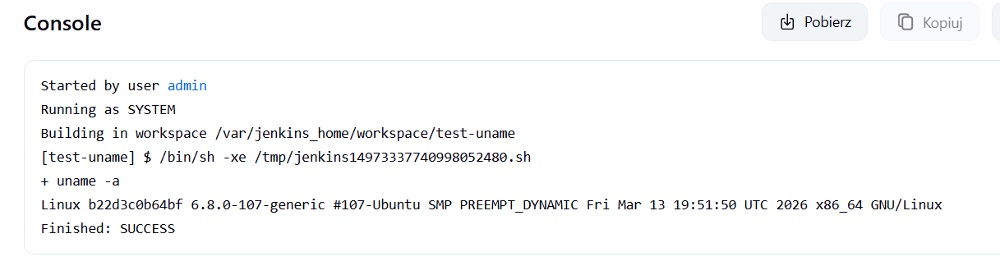

### Zadanie warunkowe

Skonfigurowano projekt, którego poprawne wykonanie było uzależnione od aktualnego czasu na serwerze. Zastosowano skrypt powłoki Bash:
   ```bash
   if [ $(( $(date +%H) % 2 )) -ne 0 ]; then 
       echo "Godzina nieparzysta - wymuszam blad!"
       exit 1
   else 
       echo "Godzina parzysta - sukces."
       exit 0
   fi
   ```
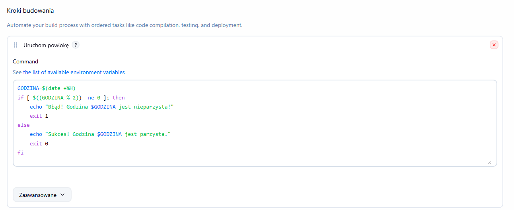
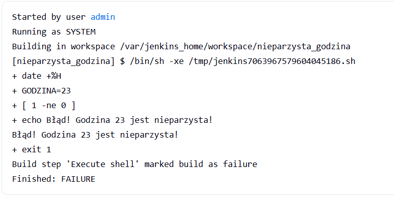

W tym przypadku błąd pojawił się, gdyż godzina tego buildu to 23. Czyli zgodnie z wymaganiami.

### Weryfikacja dockera

Ostatnim zadaniem wstępnym było wykonanie polecenia `docker pull ubuntu`. Przebiegło ono pomyślnie.

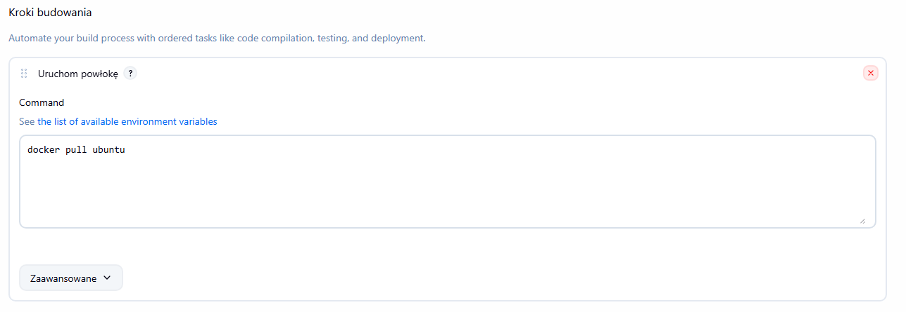
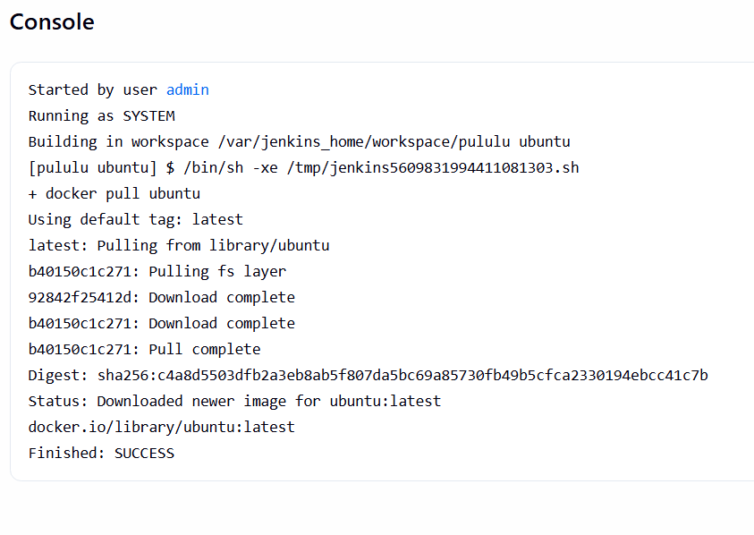

## Pipeline

Po wykonaniu zadań wstępnych przystąpiono do utworzenia obiektu typu `Pipeline`. Definicja pipeline została wpisana bezpośrednio w pole tekstowe konfiguratora Jenkins.

Pipeline został zaprogramowany tak, że w pierwszej kolejności klonowane jest repozytorium przedmiotowe, ze wskazaniem konkretnej gałęzi `PC422024`. Następnie za pomocą `dir(...)` przenosi się do katalogu zawierającego plik wcześniej przygotowanego oprogramowania `Dockerfile.build` z lab3, aby zbudować go pod nazwą test-build.

Zastosowany skrypt:
```groovy
pipeline {
    agent any

    stages {
        stage('Sklonowanie Repozytorium') {
            steps {
                git branch: 'PC422024', url: 'https://github.com/InzynieriaOprogramowaniaAGH/MDO2026s_ITE.git'
            }
        }
        
        stage('Budowanie obrazu') {
            steps {
                dir('ITE/GCL1/PC422024/Sprawozdanie1/lab3/') {
                    sh 'docker build -f Dockerfile.build -t test-build .'
                }
            }
        }
    }
}
```
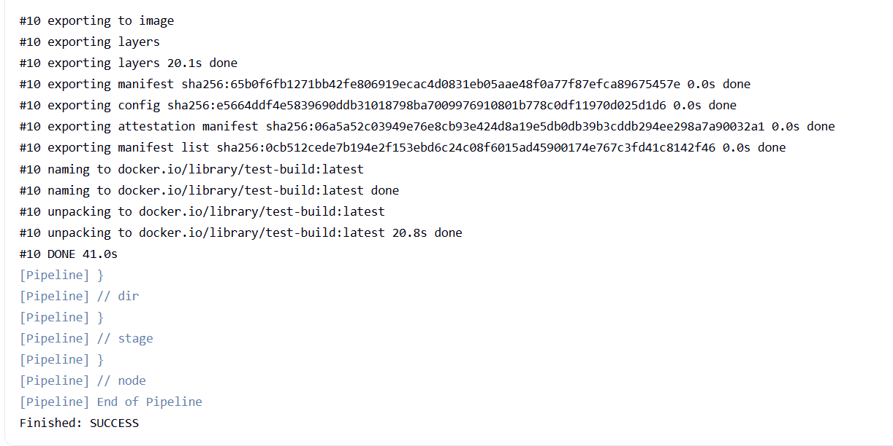
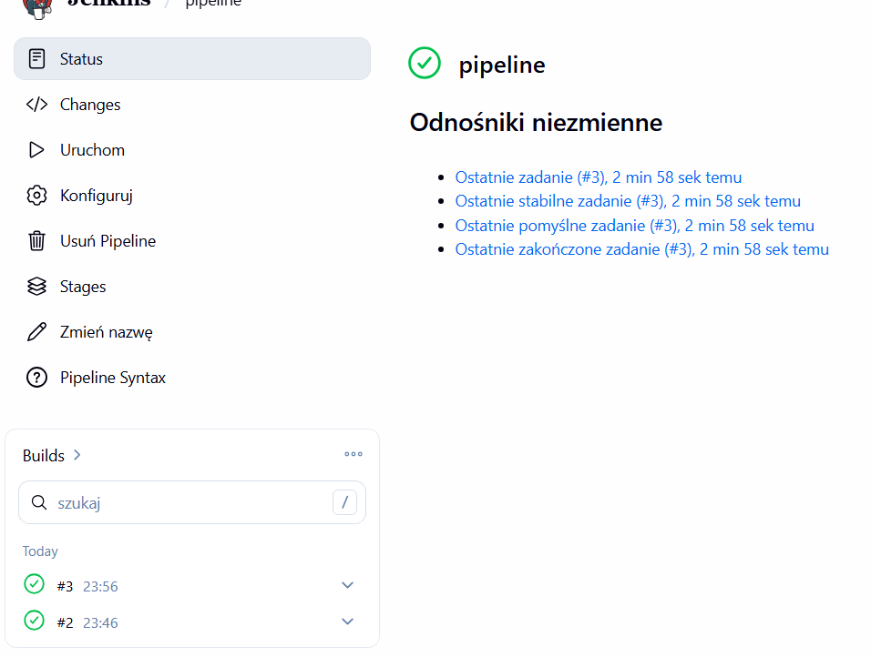

Zgodnie z poleceniem, ten pipeline został uruchomiony dwukrotnie. Czas wykonania następnego uruchomienia był krótszy, wynikało to z faktu, że system docker wykorzystał pamięć cache z pierwszego uruchomienia.

# LAB 6 & 7 - Pipeline: lista kontrolna

W ramach tej części zajęć zaimplementowano docelowy pipeline aplikacyjny, realizujący pełną ścieżkę krytyczną: *clone, build, test, deploy, publish*. Aplikacją docelową pozostaje wybrana wcześniej biblioteka `nlohmann/json` oparta na licencji MIT, co umożliwia swobodny obrót kodem na potrzeby zadania.

## Diagram

Diagram został przedstawiony przez prowadzącego na zajęciach

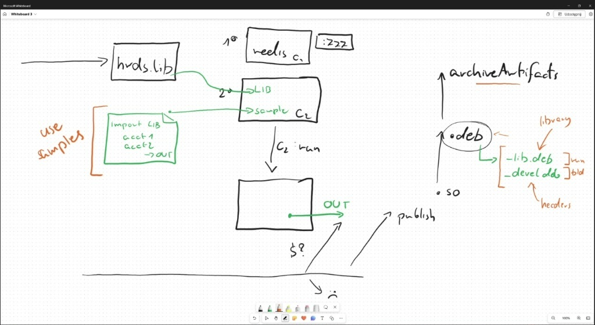

## Definicje kontenerów

W celu optymalizacji procesu i zwiększenia bezpieczeństwa, zrezygnowano z jednego, uniwersalnego obrazu. Zamiast tego zdefiniowano trzy osobne pliki `Dockerfile`, precyzyjnie odpowiadające etapom potoku

### 1. Etap Build (`Dockerfile.build`)

Wybrano lekki kontener bazowy (`ubuntu:22.04`). Obraz ten pobiera wymagane narzędzia (`git`, `build-essential`, `cmake`), a następnie wykonuje pełną kompilację oprogramowania ze sklonowanego repozytorium. Na koniec generowana jest przykładowa aplikacja (`sample-app`) korzystająca ze skompilowanych nagłówków.
```dockerfile
FROM ubuntu:22.04

RUN apt-get update && apt-get install -y \
    git \
    build-essential \
    cmake \
    && rm -rf /var/lib/apt/lists/*

WORKDIR /app

RUN git clone --depth 1 https://github.com/nlohmann/json.git .

RUN g++ -I single_include docs/mkdocs/docs/examples/parse__string__parser_callback_t.cpp -o sample-app
```
### 2. Etap test `Dockerfile.test`

Testy zostały wykonane wewnątrz kolejnego kontenera. Co kluczowe, obraz ten dziedziczy bezpośrednio z kontenera budującego. Kontener testowy izoluje proces uruchamiania ponad 100 testów jednostkowych dołączonych do oprogramowania. po poprawnym wykonaniu testów folder roboczy kompilatora jest usuwany,
```Dockerfile
FROM my-builder
RUN apt-get update && apt-get install -y cmake && rm -rf /var/lib/apt/lists/*
WORKDIR /app
RUN cmake -S . -B build -DJSON_BuildTests=On
RUN cmake --build build --parallel 4
WORKDIR /app/build
RUN ctest --output-on-failure && cd .. && rm -rf build
```

### Publikacja artefaktu `Publish`

Zdefiniowano, że rezultatem potoku będą pakiety w formacie DEB (natywne dla bazowego systemu Ubuntu). Wybór tego formatu uzasadniono standaryzacją wdrożeń w systemach z rodziny Debian oraz łatwością zarządzania zależnościami.
Proces został podzielony na dwa pakiety:

* `nlohmann-json.lib` (środowisko uruchomieniowe)
* `nlohmann-json-devel` (pliki nagłówkowe)

Artefakty są dołączane jako wynik działania pipeline w systemie Jenkins

### Etap Deploy i Smoke Test `Dockerfile.deploy`

Uzasadnienie odmiennego kontenera docelowego: Kontener budujący waży kilka gigabajtów, zawiera kompilatory, kody źródłowe oraz menedżery pakietów. Uruchomienie go w środowisku produkcyjnym stanowiłoby ogromne zagrożenie bezpieczeństwa. Z tego powodu zdefiniowano nowy, minimalny kontener typu deploy, który przyjmuje jedynie gotowy artefakt i weryfikuje jego poprawne działanie.

```Dockerfile
FROM ubuntu:22.04
COPY nlohmann-json-lib.deb /tmp/
RUN dpkg -i /tmp/nlohmann-json-lib.deb
CMD ["sample-app"]
```

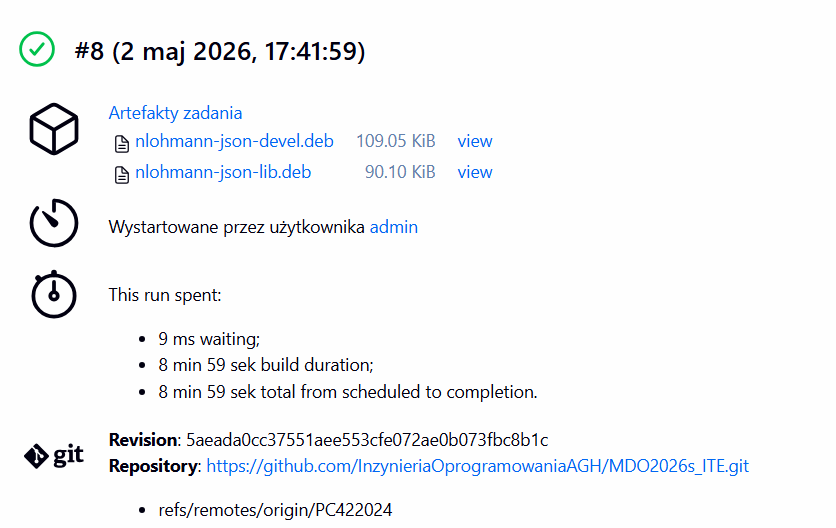

## Jenkinsfile jako kod (SCM)

Usunięto pipeline wpisany na sztywno, zamiast tego nasz projekt będzie korzystał z `Jenkinsfile` umieszczonego w plikach repozytorium GitHub.

W konfiguracji zadania wybrano opcje **Pipeline script from SCM**, wskazując osobistego brancha `PC422024` oraz ścieżkę do skryptu

Następnie wymuszono, aby pipeline nie opierał się na kodzie zapisanym w pamięci podręcznej. Dlatego dodano
 * flagę `--no-cache` do polecenia `docker build` przy budowaniu kontenera z pobieraniem i budowaniem repozytorium `nlohmann/json`
 * Dyrektywę `cleanWs()` na końcu skryptu, aby usunąć obszar roboczy do ponownego wdrożenia od zera podczas kolejnych przebiegów. 

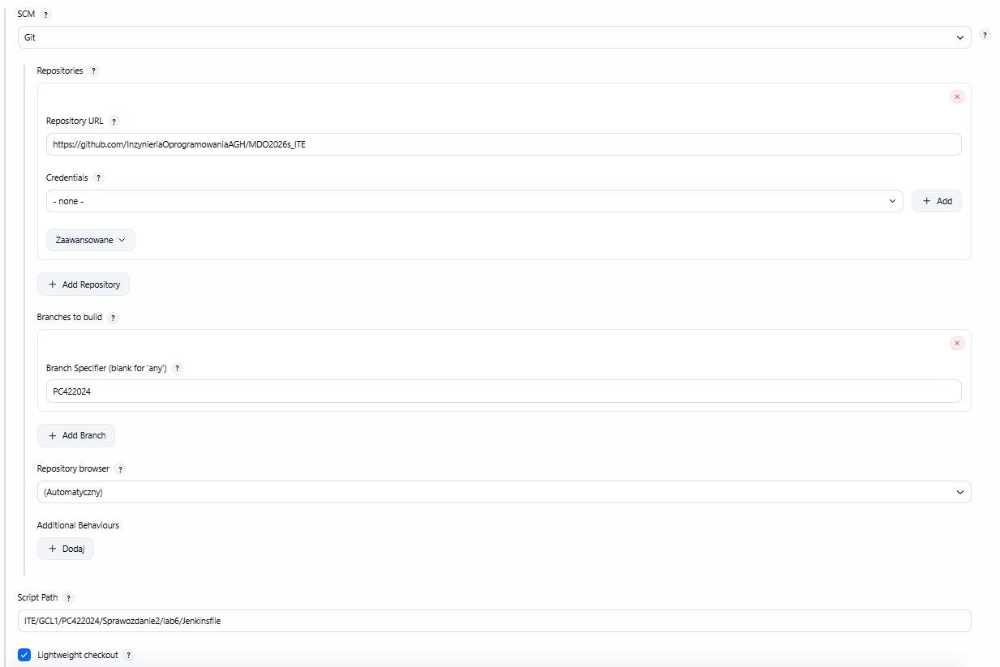

## Finalny skrypt Jenkinsfile

```groovy
pipeline {
    agent any

    stages {

        stage('Build, Extract & Publish') {
            steps {
                dir('ITE/GCL1/PC422024/Sprawozdanie2/lab6') {
                    sh 'docker build --no-cache -f Dockerfile.build -t my-builder .'
                    sh 'docker build -f Dockerfile.test -t my-tester .'
                    sh 'docker create --name temp-builder my-builder'               
                    
                    sh 'docker cp temp-builder:/app/sample-app ./sample-app'
                    sh 'docker cp temp-builder:/app/single_include/nlohmann/json.hpp ./json.hpp'
                    sh 'docker rm temp-builder'
                
                    
                    sh '''
                    mkdir -p lib-pkg/usr/local/bin
                    mkdir -p lib-pkg/DEBIAN
                    cp sample-app lib-pkg/usr/local/bin/
                    echo "Package: nlohmann-json-lib\nVersion: 1.0\nArchitecture: amd64\nMaintainer: Student\nDescription: Runtime sample app" > lib-pkg/DEBIAN/control
                    dpkg-deb --build lib-pkg nlohmann-json-lib.deb
                    '''
                    
                    sh '''
                    mkdir -p dev-pkg/usr/include/nlohmann
                    mkdir -p dev-pkg/DEBIAN
                    cp json.hpp dev-pkg/usr/include/nlohmann/
                    echo "Package: nlohmann-json-devel\nVersion: 1.0\nArchitecture: all\nMaintainer: Student\nDescription: Headers for development" > dev-pkg/DEBIAN/control
                    dpkg-deb --build dev-pkg nlohmann-json-devel.deb
                    '''

                    archiveArtifacts artifacts: '*.deb', followSymlinks: false
                }
            }
        }

        stage('Deploy & Smoke Test') {
            steps {
                dir('ITE/GCL1/PC422024/Sprawozdanie2/lab6') {
                    sh 'docker build -f Dockerfile.deploy -t my-deploy .'
                    sh 'docker run --rm my-deploy'
                }
            }
        }
    }
    post {
        always {
            cleanWs()
        }
    }
}
```

Wynik końcowy:

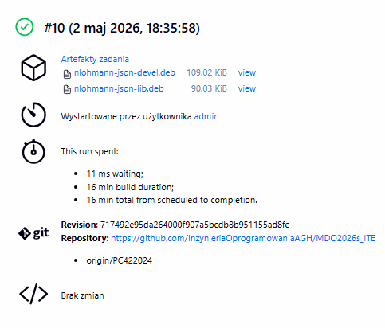

## Lista kontrolna

### LAB6

* Aplikacja została wybrana: biblioteka `nlohmann/json`
* Aplikacja jest na licencji MIT, co pozwala na jej użycie do zajęć.
* Wybrany program buduje się z wykorzystaniem `g++` i `cmake`
* Testy do programu przechodzą bezbłednie w 100% dla ponad 100 testów.
* Zdecydowano aby pobierać za każdym razem świeży kod z głównego repozytorium twórcy.
* Diagram został opracowany na zajęciach.
* Kontenerem bazowym jest `ubuntu:22:04`
* Build jest w kontenerze na bazie pliku `Dockerfile.build`
* Testy zostały wykonane w kontenerze `Dockerfile.test`
* Kontener testowy jest oparty na poprzednim buildzie.
* Jenkins zapisuje logi z konsoli (?)
* Stworzono `Dockerfile.deploy`, który uruchamia zbudowany pakiet instalacyjny
* Stworzono minimalny kontener wdrożeniowy.
* Tak jak wyżej przez `Dockerfile.deploy`
* Smoke test przechodzi poprawnie
* Publikowany artefakt to pakiety systemowe Linux
* Wybrano format `.deb`
* Semanting Versioning, jako wersjonowanie artefaktu
* Paczki można pobrać ze strony z wynikami danego uruchomienia
* Każdy pakiet można powiązać poprzez ID
* Kody źródłowe są w raporcie oraz w plikach repo
* Jest zgodna

### LAB7

* Tak, Jenkinsfile jako SCM a nie na sztywno
* Zastosowano flagi i wszystko pobiera się od zera.
* Jenkisn pobiera repo i dysponuje niezbędnymi plikami
* Pipeline buduje obraz z tagiem `my-builder`
* Z `my-builder` wyodrębniane są pliki binarne i pakowane do formatu `.deb`
* Etap test przeprowadza testy weryfikujące kod
* Wykorzystując deploy, instaluje się artefakt `.deb` i przygotowuje pod wdrożenie
* Etap deploy przeprowadza wdrożenie i test spakowanych paczek
* Gotowe paczki można pobrać w Jenkinsie
* cache zostal wyłączony, build uruchamia się wielokrotnie 😎

## Definition of Done

Pipeline można uznać za skuteczny i skończony. Opublikowane paczki DEB można pobrać i zainstalować na docelowej maszynie opartej na Ubuntu. Smoke Test potwierdza poprawne działanie aplikacji.

# Historia poleceń

Jest dołączona w pliku `historia-polecen.txt`
