# Sprawozdanie 3

Piotr Chajec 422024 GR1

## Środowisko pracy

Wszystkie działania zostały wykonane w systemie Linux (Ubuntu Server) za pośrednictwem połączenia SSH. Połączenie SSH zostało zrealizowane poprzez rozszerzenie Remote - SSH w programie Visual Studio Code, co umożliwiło również wygodne korzystanie z wbudowanego mechanizmu przekierowywania portów (Port Forwarding). Do zadań z zakresu automatyzacji wykorzystano również wirtualną maszynę z systemem Fedora.

# LAB 8 - Ansible

## Konfiguracja inwentarza i test łączności

Pracę z narzędziem Ansible rozpoczęto od zdefiniowania pliku inwentaryzacji (`inventory.ini`). W celu weryfikacji poprawności komunikacji z węzłami za pośrednictwem protokołu SSH, wykorzystano wbudowany moduł `ping`. 

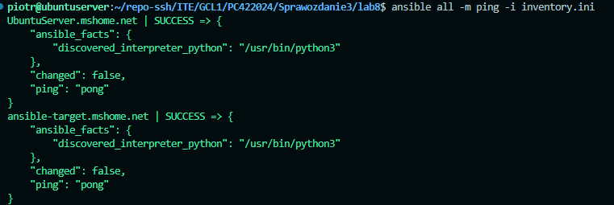
Polecenie zakończyło się statusem `SUCCESS` dla zdefiniowanych hostów, co potwierdziło gotowość środowiska do wykonywania bardziej zaawansowanych playbooków. W ramach testów obsługi błędów, zasymulowano również brak dostępności hosta, co Ansible poprawnie wyłapał komunikatem `UNREACHABLE` (Connection timed out).

## Automatyzacja konfiguracji i zasada Idempotentności

Przygotowano plik `playbook.yml`, którego zadaniem była aktualizacja menedżera pakietów APT, instalacja usługi `rngd` oraz restart odpowiednich demonów systemowych. Wymagało to zastosowania dyrektywy podniesienia uprawnień (`BECOME`).

W celu udowodnienia kluczowej dla narzędzia Ansible zasady **idempotentności**, playbook został uruchomiony dwukrotnie:
1. **Pierwsze uruchomienie:** Narzędzie dokonało fizycznych modyfikacji na serwerze docelowym (instalacja i restart usług), co zostało zasygnalizowane statusem `changed`.
2. **Drugie uruchomienie:** Ansible wykrył, że pożądany stan systemu jest już osiągnięty. Pominął ponowną instalację, zwracając status `ok`.

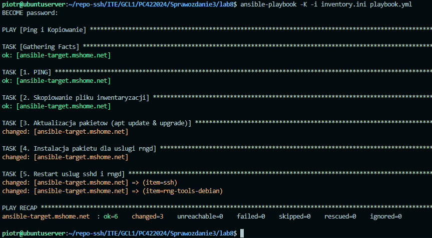
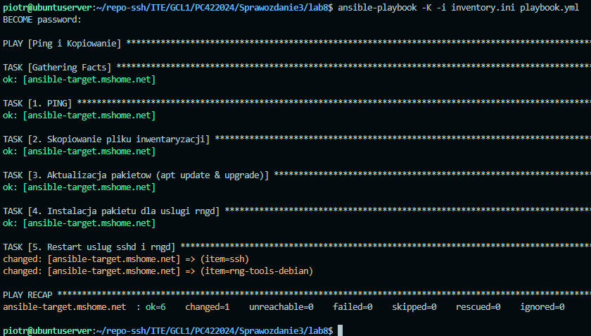

## Wdrożenie w środowisku testowym (Sandbox)

Kolejnym zadaniem było przygotowanie w pełni zautomatyzowanego wdrożenia wybranego wcześniej artefaktu (paczki `.deb` biblioteki nlohmann/json) w izolowanym środowisku kontenerowym za pomocą pliku `deploy_deb.yml`.

Playbook zrealizował następującą ścieżkę:
1. Weryfikacja dostępnej przestrzeni dyskowej.
2. Instalacja środowiska Docker.
3. Przesłanie skompilowanej paczki `.deb` na maszynę docelową.
4. Utworzenie kontenera testowego ("Sandbox") i instalacja w nim przesłanego pakietu.
5. Uruchomienie aplikacji wewnątrz kontenera i weryfikacja jej działania (zwrócenie sformatowanego pliku JSON).
6. Oczyszczenie środowiska – usunięcie kontenera oraz paczki z hosta.

```yaml
---
- name: Wdrozenie artefaktu i weryfikacja w kontenerze
  hosts: Endpoints
  become: yes
  tasks:
    - name: 1. sprawdzenie zajetosci dysku
      command: df -h /
      register: disk_space
      ignore_errors: yes

    - name: 1b. Wyswietlenie wyniku dysku
      debug:
        msg: "Stan dysku docelowego:\n{{ disk_space.stdout }}"

    - name: 2. Pobieranie Dockera
      get_url:
        url: https://get.docker.com/
        dest: /tmp/get-docker.sh
        mode: '0755'

    - name: 3. Instalacja dockera
      command: /tmp/get-docker.sh
      args:
        creates: /usr/bin/docker

    - name: 4. Sprawdzenie stanu uslugi docker
      service:
        name: docker
        state: started
        enabled: yes

    - name: 5. Wysłanie paczki .deb na host docelowy
      copy:
        src: nlohmann-json-lib.deb
        dest: /tmp/nlohmann-json-lib.deb

    - name: 6. Stworzenie kontenera testowego (Sandbox) do weryfikacji dzialania naszej paczki .deb
      command: docker run -d --name test-sandbox -v /tmp:/tmp ubuntu:22.04 sleep 600

    - name: 7. Instalacja paczki .deb w kontenerze testowym
      command: docker exec test-sandbox dpkg -i /tmp/nlohmann-json-lib.deb

    - name: 8. Weryfikacja dzialania aplikacji (sample-app) w kontenerze testowym
      command: docker exec test-sandbox sample-app
      register: app_output

    - name: 9. Wyswietlenie wyniku dzialania sample-app w kontenerze testowym
      debug:
        msg: "Wynik dzialania sample-app: {{ app_output.stdout }}"

    - name: 10. Oczysczanie srodowiska (Usun kontener testowy)
      command: docker rm -f test-sandbox
      ignore_errors: yes

    - name: 11. Oczysczanie srodowiska (Usun paczke .deb z hosta docelowego)
      file:
        path: /tmp/nlohmann-json-lib.deb
        state: absent
```

## Refaktoryzacja kodu przy użyciu Ról (Ansible Galaxy)

W celu zachowania dobrych praktyk programistycznych (utrzymanie czytelności i modularności kodu), powyższy skrypt wdrożeniowy został zrefaktoryzowany. Monolityczny playbook podzielono na strukturalną Rolę (`deploy_deb_role`). Konfiguracja została wywołana za pomocą pliku `galaxy.yml`, uzyskując identyczny, pomyślny rezultat wdrożenia artefaktu.

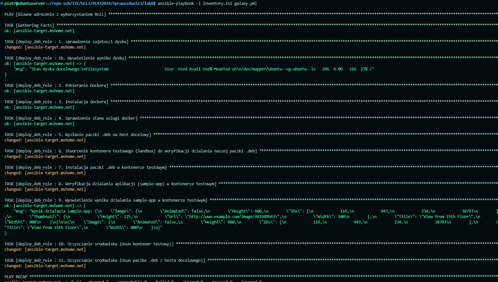


# LAB 9 - Automatyzacja instalacji i Systemd

## Instalacja nienadzorowana (Automated Install)

Proces wdrożenia maszyny docelowej z systemem Fedora został zautomatyzowany przy użyciu instalatora Anaconda w trybie nienadzorowanym (tekstowym).

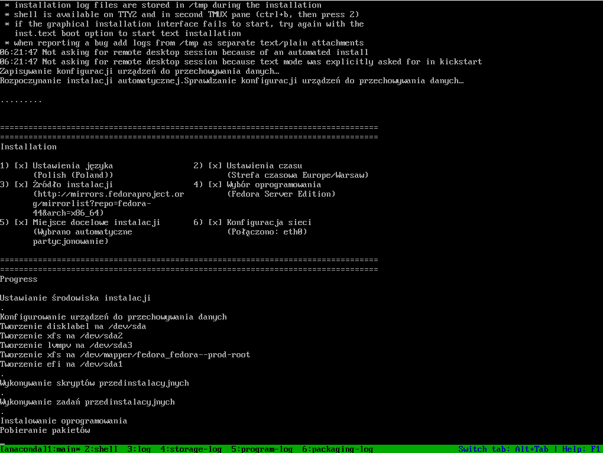

## Usługa Systemd i rozwiązywanie problemów (Troubleshooting)

Utworzono własną usługę w systemie Linux (`deploy-artifact.service`), która miała za zadanie pobrać środowisko Ubuntu, zainstalować w nim artefakt `.deb` i uruchomić program generujący JSON.

Podczas pierwszego uruchomienia usługi napotkano na problemy sieciowe wewnątrz środowiska (błędy GPG narzędzia APT). Narzędzie `journalctl` pozwoliło na precyzyjne zlokalizowanie problemu, który objawił się kodem wyjścia `exit-code`.

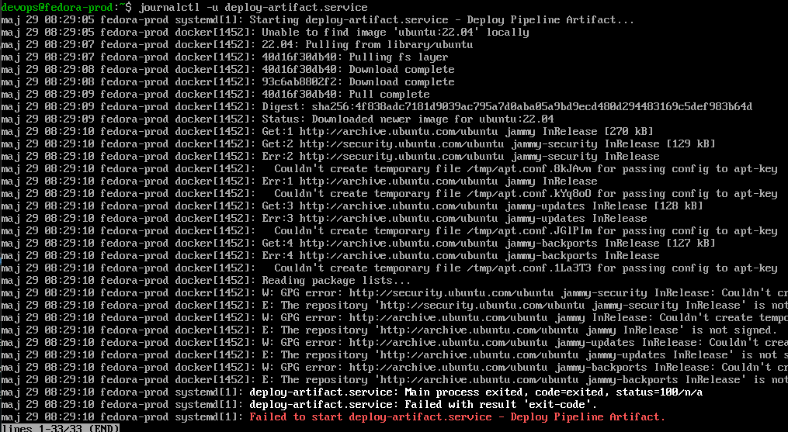

Po wprowadzeniu niezbędnych poprawek konfiguracyjnych, usługa `deploy-artifact.service` została uruchomiona ponownie, tym razem realizując cały potok wdrożeniowy (od pobrania obrazu dockera, przez rozpakowanie `nlohmann-json-lib`, aż po wykonanie logiki aplikacji).

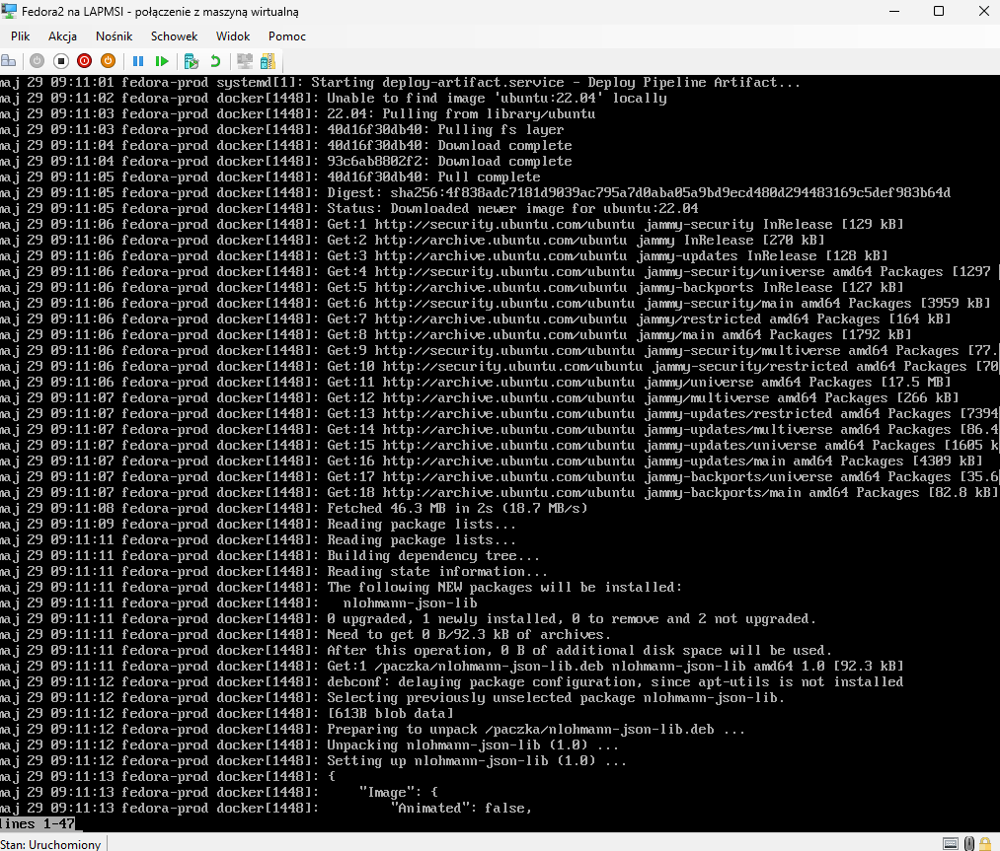
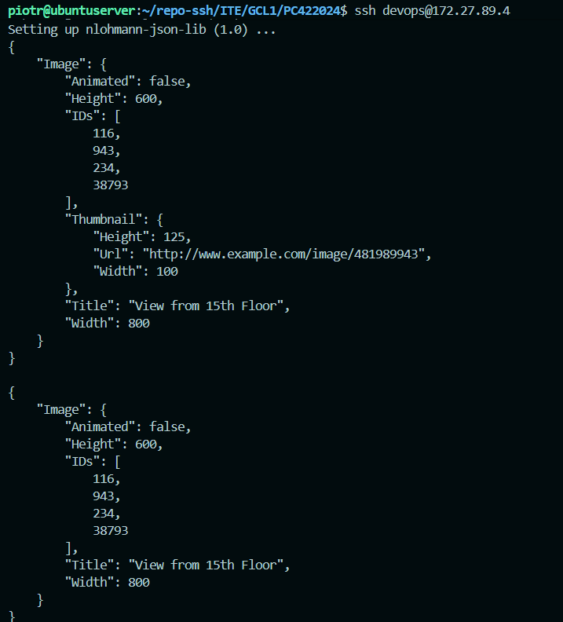


# LAB 10 - Wprowadzenie do Kubernetes (K8s)

## Konfiguracja środowiska Minikube

Zainstalowano niezbędne narzędzia do pracy z klastrem Kubernetes: `kubectl` oraz `minikube`. Następnie zainicjowano klaster za pomocą sterownika Docker.

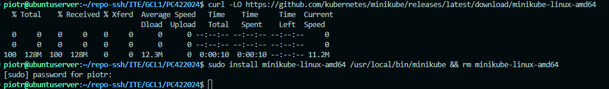
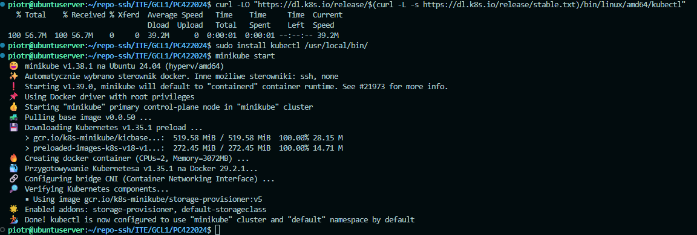

Zweryfikowano poprawność działania węzła (`control-plane`) za pomocą komendy `kubectl get nodes` oraz uruchomiono graficzny interfejs zarządzania klastrem – Minikube Dashboard.

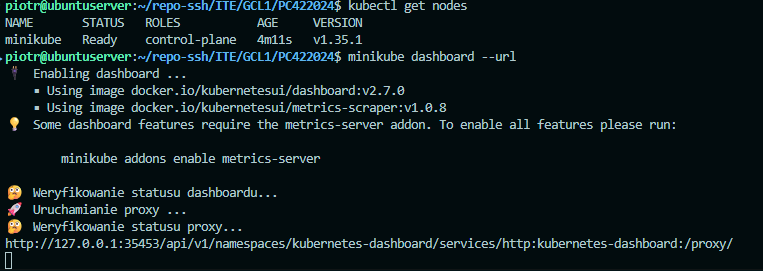
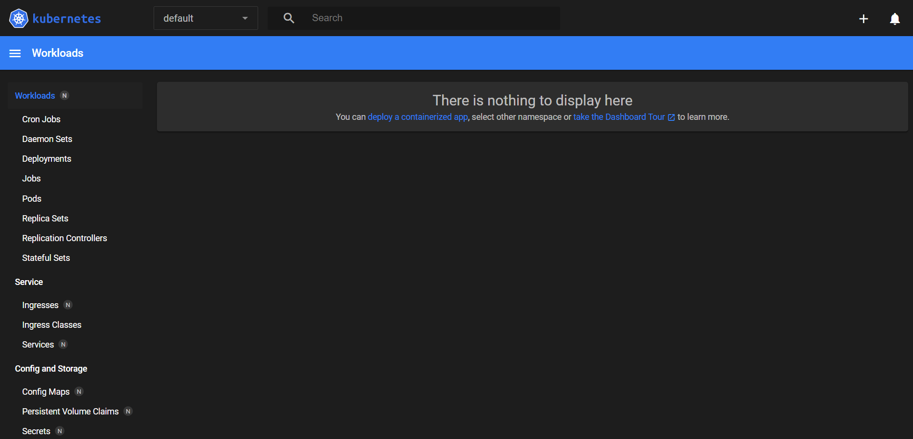

## Imperatywne zarządzanie Podami

Uruchomiono pierwszy punkt aplikacyjny (Pod) w klastrze, korzystając z podejścia imperatywnego. Użyto obrazu `sillytavern`, eksponując port 8000 i nadając odpowiednie etykiety.

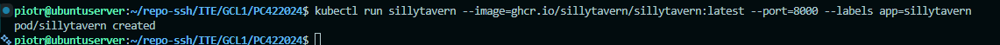

W celu weryfikacji dostępu do aplikacji, utworzono bezpieczny tunel bezpośrednio do przestrzeni sieciowej klastra, wykorzystując polecenie `kubectl port-forward`. Aplikacja była poprawnie dostępna z poziomu przeglądarki internetowej.

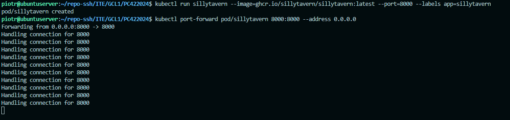

Stan wdrożenia weryfikowano na dwa sposoby: graficznie za pomocą sekcji Workloads w Dashboardzie oraz z poziomu wiersza poleceń poprzez wyświetlenie szczegółów i logów zdarzeń (`kubectl describe pod`).

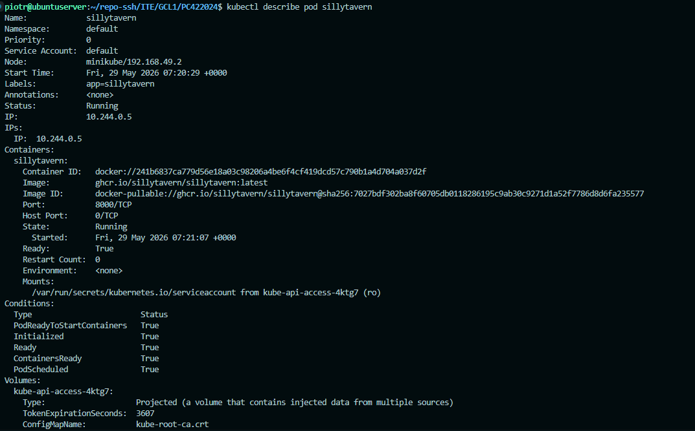
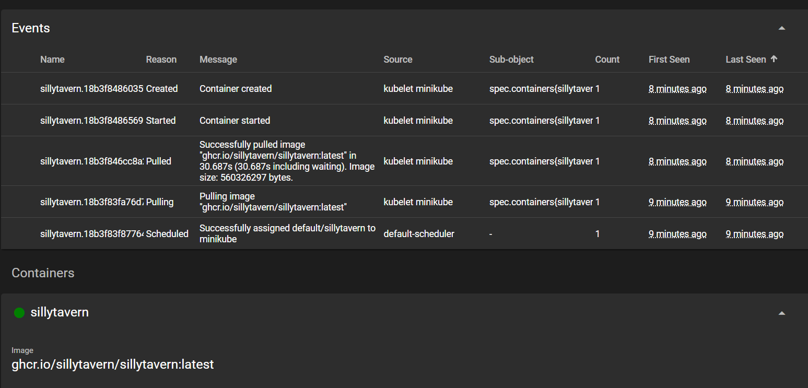


# LAB 11 - Kubernetes: Wdrożenia, Serwisy i Skalowanie

## Deployment i Serwisy

Zrezygnowano z podejścia imperatywnego na rzecz plików konfiguracyjnych YAML. Stworzono definicję `Deploymentu`, która powołała do życia 12 replik aplikacji SillyTavern, zapewniając wysoką dostępność usług. 

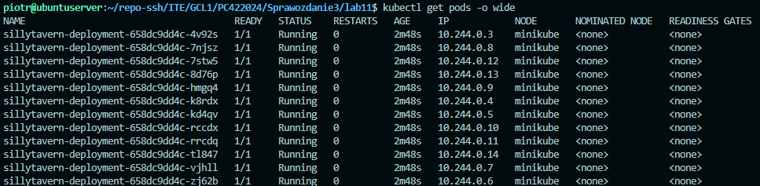

Aby zapanować nad ruchem sieciowym trafiającym do 12 niezależnych podów, utworzono obiekt typu `Service` (NodePort) w dedykowanym pliku `service.yaml`. W celu wyeksponowania aplikacji środowisko Visual Studio Code zostało wykorzystane do symultanicznego przekierowania portów na trzy odrębne ścieżki dostępowe klastra:
* `localhost:8000` -> Bezpośrednio do Poda.
* `localhost:8001` -> Do wdrożenia (Deployment).
* `localhost:8002` -> Do warstwy abstrakcji Serwisu.

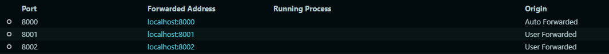

## Weryfikacja działania Load Balancera

W celu udowodnienia równomiernego rozkładania ruchu przez obiekt `Service`, przeprowadzono testy łączności z użyciem narzędzia `curl` wewnątrz sieci klastra. Aplikacja docelowa posiadała zabezpieczenia odrzucające niesautoryzowane połączenia zewnętrzne, co w rezultacie zapisało się w logach.

Generując połączony strumień logów ze wszystkich podów (`kubectl logs -l app=sillytavern --prefix`), zaobserwowano, że zapytania `curl` były rejestrowane i odrzucane przez *różne instancje kontenerów* (różniące się identyfikatorami w prefiksach). Jest to bezpośredni dowód na poprawne funkcjonowanie wbudowanego w Kubernetes Load Balancera.

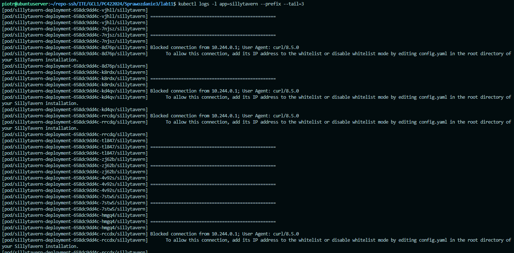

## Skalowanie środowiska w locie

Wykazano odporność klastra na dynamiczne zmiany obciążenia poprzez proces manualnego skalowania liczby replik (dyrektywa `kubectl scale`). Kubernetes automatycznie reagował na zmianę żądanego stanu, odpowiednio zabijając (status `Terminating`) nadmiarowe instancje, nie przerywając działania całej aplikacji.

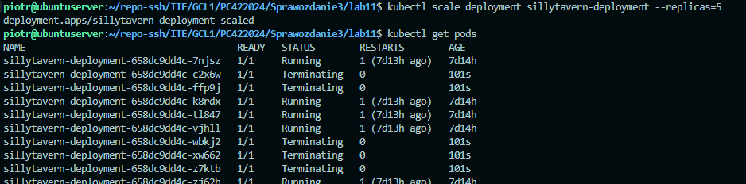

# Historia poleceń

Jest dołączona w pliku `historia-polecen.txt`