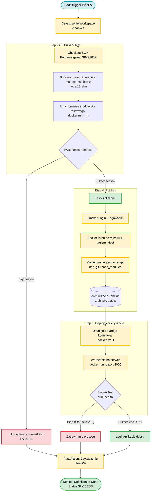

# Sprawozdanie SB422052 - Laboratoria z konteneryzacji

## Środowisko uruchomieniowe
Wszystkie opisane w sprawozdaniu kroki i polecenia zostały wykonane w następującym środowisku:
* **Host:** macOS
* **Maszyna wirtualna:** Ubuntu Linux (dostarczona przez oprogramowanie do wirtualizacji UTM).
* **Dostęp:** Połączenie z maszyną wirtualną zrealizowano zdalnie za pomocą protokołu SSH (`ssh seb@192.168.64.2`). Nie korzystano z konsoli KVM.
* **Użytkownik:** Pracę wykonano z poziomu standardowego użytkownika (`seb`), unikając pracy bezpośrednio jako `root`. Do poleceń wymagających uprawnień używano `sudo` lub grupy `docker`.

*Historia wszystkich użytych poleceń (bash history) znajduje się w załączonym w tym samym katalogu pliku `historia_polecen.txt`.*

---

## Część I: Podstawy Docker, SSH i środowisko

### Cel zadania:
Celem było przygotowanie środowiska Ubuntu na maszynie wirtualnej, weryfikacja dostępu SSH bez hasła (klucze), instalacja silnika Docker oraz przećwiczenie podstawowych operacji na kontenerach (uruchamianie, wejście do środka, weryfikacja systemu plików).

**Dowody wykonania:**
Wszystkie punkty zrealizowane: UTM (Ubuntu), SSH, Klucze, Git Hook.

1. Instalacja środowiska Docker bezpośrednio z repozytorium Ubuntu:

2. Weryfikacja instalacji - uruchomienie testowego kontenera hello-world:

3. Pobranie i interaktywne uruchomienie obrazu busybox oraz weryfikacja wersji:

4. Kontener Ubuntu - aktualizacja pakietów i instalacja procps wewnątrz systemu:

5. Utworzenie pliku Dockerfile (zastosowanie dobrych praktyk m.in. COPY zamiast git clone) i budowa własnego obrazu:

6. Weryfikacja zawartości obrazu, globalne czyszczenie środowiska (prune) i wysłanie pliku na GitHub:

---

## Część II: Dockerfiles, kontener jako definicja etapu

### 1. Wybór projektu i ręczny build w kontenerze
**Cel:** Wybór otwartoźródłowego projektu i próba jego zbudowania oraz przetestowania wewnątrz kontenera.
Jako projekt na zajęcia wybrałem **Express.js** (popularny framework backendowy w środowisku Node.js). 
* **Repozytorium:** `https://github.com/expressjs/express.git`
* **Licencja:** otwarta (MIT).
* **Proces budowania i testów:** W środowisku Node build realizowany jest przez `npm install`, a testy poleceniem `npm test`.

Najpierw proces przetestowałem ręcznie. Uruchomiłem bazowy kontener (`docker run -it node:20 bash`), sklonowałem repozytorium, pobrałem zależności i odpaliłem testy. Raport z testów udowadnia poprawne działanie środowiska:
 

### 2. Automatyzacja zadania (dwa pliki Dockerfile)
**Cel:** Stworzenie powtarzalnego, zautomatyzowanego procesu przy użyciu `Dockerfile`.
Proces został rozbity na dwa pliki:
1. `Dockerfile.build` - obraz bazowy pobierający kod i instalujący zależności.
2. `Dockerfile.test` - obraz korzystający z poprzedniego kroku, którego celem (ENTRYPOINT) jest uruchomienie testów.

Poniżej dowód odpalenia automatycznych testów z pliku testowego:

### 3. Docker Compose
**Cel:** Użycie Docker Compose do orkiestracji uruchamiania kontenerów testowych.
Stworzony został plik `docker-compose.yml`, który po wydaniu polecenia `docker compose up` automatycznie buduje i uruchamia etap testowy, zwracając logi bezpośrednio na standardowe wyjście:

---

## Część III: Woluminy, Sieci i Jenkins

### 1. Zachowywanie stanu między kontenerami (Woluminy)
**Cel:** Przekazanie plików zbudowanej aplikacji z jednego kontenera do drugiego z wykorzystaniem woluminów bez "zaśmiecania" kontenera produkcyjnego narzędziami deweloperskimi (np. Git).

Utworzono dwa nazwane woluminy: `vol_wejsciowy` i `vol_wyjsciowy`.
Wykorzystano **kontener pomocniczy** (`alpine/git`), do sklonowania kodu (Express.js) bezpośrednio na wolumin wejściowy, po czym usunięto kontener (flaga `--rm`). 
Następnie uruchomiono główny kontener budujący (`node:20`), skompilowano aplikację z woluminu wejściowego i zapisano wyniki na wolumin wyjściowy. Poniżej weryfikacja (wylistowanie plików z woluminu przez osobny, lekki kontener alpine), udowadniająca, że stan przetrwał:

### 2. Eksponowanie portu i łączność między kontenerami (iperf3)
**Cel:** Sprawdzenie przepustowości sieciowej między kontenerami w różnych konfiguracjach sieciowych za pomocą narzędzia `iperf3`.

* **Krok 1 (domyślna sieć mostkowa):** Uruchomiono serwer i klienta iperf3 uderzając bezpośrednio po adresie IP kontenera (np. `172.17.0.2`). Ruch symulowany był w pamięci operacyjnej maszyny wirtualnej, co dało bardzo wysoką przepustowość.
* **Krok 2 (sieć dedykowana i DNS):** Utworzono własną sieć (`docker network create iperf_siec`). Serwer i klient komunikowały się po nazwach kontenerów, a nie IP. Port serwera został wyeksponowany na hosta (`-p 5201:5201`).

* **Krok 3 (połączenie z hosta):** Narzędzie iperf3 zostało zainstalowane na hoście (środowisku Ubuntu), z którego nawiązano pomyślne połączenie z serwerem w kontenerze poprzez `127.0.0.1` dzięki przekierowaniu portów.

### 3. Usługi w rozumieniu systemu i kontenera (SSHD)
**Cel:** Uruchomienie usługi SSH w kontenerze i omówienie wad takiego rozwiązania z perspektywy konteneryzacji.

Uruchomiono kontener oparty na Ubuntu, zainstalowano w nim serwer OpenSSH i wyeksponowano na port `2222` hosta. Logowanie do kontenera z poziomu środowiska wirtualnego zakończyło się sukcesem:

**Analiza podejścia:**
Instalowanie usługi SSHD wewnątrz kontenera to uznany antywzorzec. Kontener powinien realizować pojedynczy proces biznesowy. Dodawanie SSH powiększa rozmiar obrazu, tworzy niepotrzebne luki bezpieczeństwa i kłóci się z zasadą niemutowalności środowiska (do zarządzania i inspekcji kontenera służy polecenie `docker exec`).

### 4. Przygotowanie serwera CI Jenkins (z Docker-in-Docker)
**Cel:** Wdrożenie gotowego środowiska automatyzacji CI/CD zgodnie z oficjalnymi wytycznymi twórców oprogramowania.

W oparciu o dokumentację, zestawiono dwa połączone dedykowaną siecią kontenery.
1. Kontener DinD (`docker:dind`), działający jako uprzywilejowany "pomocnik", umożliwiający używanie Dockera wewnątrz Dockera.
2. Kontener aplikacji Jenkins (`jenkins/jenkins:lts`), skonfigurowany pod połączenie z demonem DinD oraz eksponujący własny interfejs webowy (port `8080`).

Wykonano proces weryfikacji działających kontenerów:

Następnie z logów woluminu pobrano początkowe hasło administratora (`initialAdminPassword`), zalogowano się poprzez przeglądarkę i zainstalowano sugerowane wtyczki. Poniżej dowód ukończenia inicjalizacji instancji:

Pomoc AI 
Zapytanie:
"Przeredaguj tak aby było jednolite oraz usuń błędy ortograficzne itp." 

######################################################################################3

# Sprawozdanie: Laboratorium 5, 6 i 7 - Pipeline CI/CD (Jenkins)

## 1. Wybrana Aplikacja i Repozytorium
Do wdrożenia wybrano prostą aplikację backendową napisaną w środowisku **Node.js** z wykorzystaniem frameworka **Express**. 
* **Licencja:** Kod ma charakter dydaktyczny, co pozwala na swobodny obrót nim na potrzeby zadania (licencja otwarta).
* **Repozytorium:** Zdecydowano się pracować na osobistej gałęzi (`SB422052`) wewnątrz istniejącego repozytorium przedmiotowego (`MDO2026s_ITE`), zamiast tworzyć pełnego forka.

## 2. Zadania Wstępne (Weryfikacja Środowiska)
W ramach rozgrzewki przygotowano projekty typu *Freestyle*, weryfikujące poprawność konfiguracji Jenkinsa:
1. `Zadanie_1_Uname` - Pomyślne wywołanie powłoki systemowej.
2. `Zadanie_2_Godzina` - Poprawne zachowanie przy błędzie (celowe przerwanie `exit 1` przy nieparzystej godzinie).
3. `Zadanie_3_Docker` - Pomyślne pobranie obrazu Ubuntu.

> **Dowód realizacji zadań wstępnych:**
> 
> 

## 3. Diagram Aktywności (Proces CI/CD)
Poniższy diagram UML obrazuje zaplanowany przepływ pracy w Jenkinsie:

4. Realizacja etapów Pipeline (Ścieżka Krytyczna)
Zgodnie z zaplanowanym diagramem, zrealizowano potok CI/CD. Proces jest w pełni zautomatyzowany i powtarzalny dzięki czyszczeniu środowiska przed i po każdym uruchomieniu.

Krok 1: Build i Testowanie
Zbudowano obraz aplikacji na bazie obrazu node:18-slim. Wybór tej wersji pozwolił na zachowanie niskiej wagi obrazu przy jednoczesnym zapewnieniu stabilności środowiska. Po budowie obrazu, Jenkins automatycznie uruchomił kontener testowy i wykonał testy jednostkowe przy użyciu biblioteki Mocha.

Wynik: Testy zakończone sukcesem.

Krok 2: Publikacja Artefaktów (Publish)
Po pomyślnym przejściu testów, potok przeszedł do etapu publikacji:

Docker Hub: Obraz został otagowany i wypchnięty do zewnętrznego rejestru pod nazwą sebboze3/moj-express-bldr:latest. Dzięki temu aplikacja jest dostępna do pobrania na dowolnej maszynie.

Archiwum lokalne: Kod produkcyjny został spakowany do archiwum .tar.gz (z wykluczeniem katalogu .git i node_modules) i zarchiwizowany bezpośrednio w Jenkinsie jako artefakt do pobrania.

Krok 3: Wdrożenie i Weryfikacja (Deploy & Smoke Test)
Ostatnim etapem było wdrożenie produkcyjne na lokalnym środowisku Docker.

Jenkins usunął poprzednią instancję aplikacji, aby uniknąć konfliktów portów.

Uruchomiono nową wersję na porcie 3000.

Smoke Test: Wykonano weryfikację "na żywo" za pomocą narzędzia curl. Odpytano endpoint /health, który zwrócił status 200 OK, co potwierdza, że aplikacja nie tylko się uruchomiła, ale poprawnie obsługuje żądania sieciowe.

5. Odpowiedzi na pytania i wnioski
Format artefaktu: Wybrano obraz Docker (jako główny format redystrybucyjny) oraz archiwum .tar.gz. Obraz Docker zapewnia pełną przenośność (Portable Artifact), eliminując różnice w środowiskach między deweloperem a produkcją.

node vs node-slim: Pełny obraz node zawiera dodatkowe narzędzia kompilacji (np. python, kompilatory C++), które są potrzebne przy budowaniu niektórych bibliotek, ale zbędne do samego uruchomienia aplikacji. Obraz node-slim jest ich pozbawiony, co czyni go znacznie lżejszym i bezpieczniejszym na produkcji, ponieważ ogranicza liczbę zainstalowanych pakietów (mniejsza powierzchnia ataku).

Kontener Deploy: W moim projekcie kontenerem wdrożeniowym jest ten sam obraz, który został zbudowany w kroku Build. Dzięki zastosowaniu pliku .dockerignore, obraz ten jest "czysty" – nie zawiera logów, plików testowych ani historii Gita, co czyni go optymalnym do roli produkcyjnej (tzw. Runtime Image).

Definition of Done: Zadanie uznaję za zakończone, ponieważ proces kończy się wystawieniem gotowego do wdrożenia artefaktu na Docker Hubie, a automatyczna weryfikacja (Smoke Test) potwierdza jego pełną sprawność po starcie.