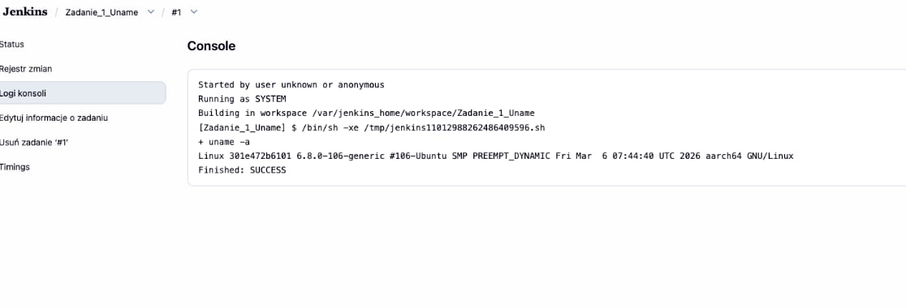
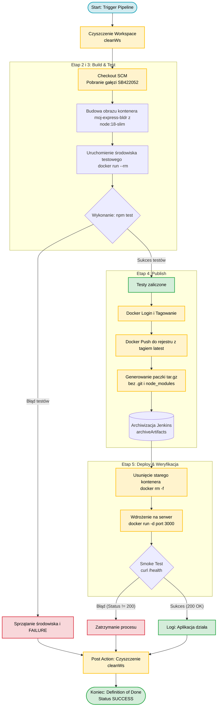
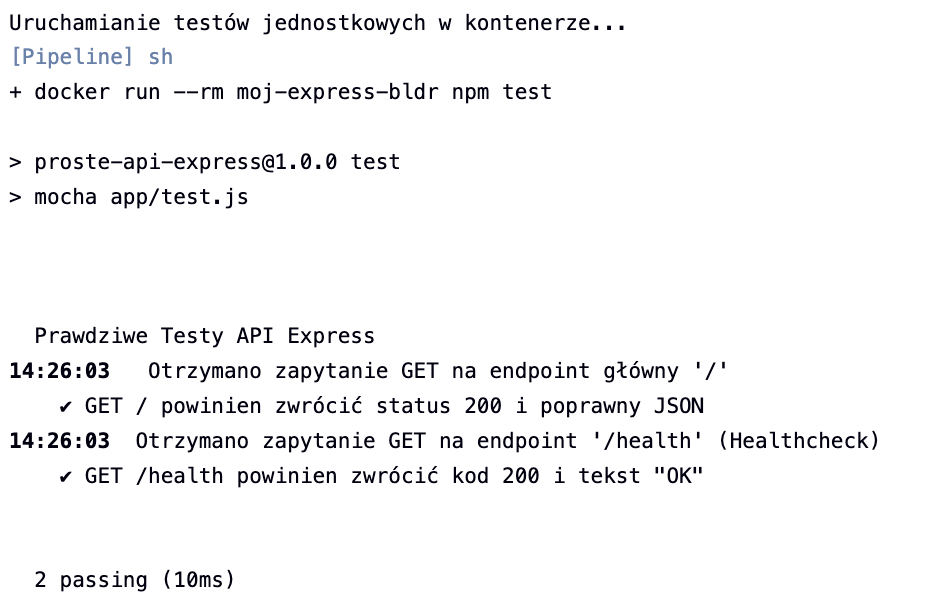
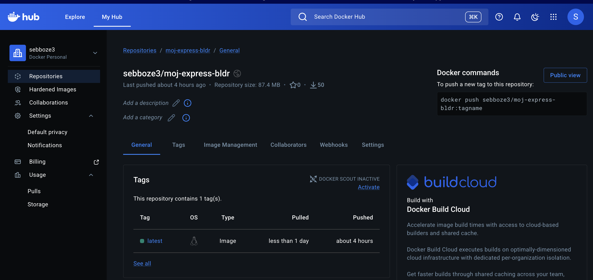
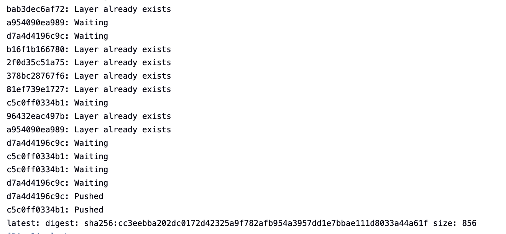
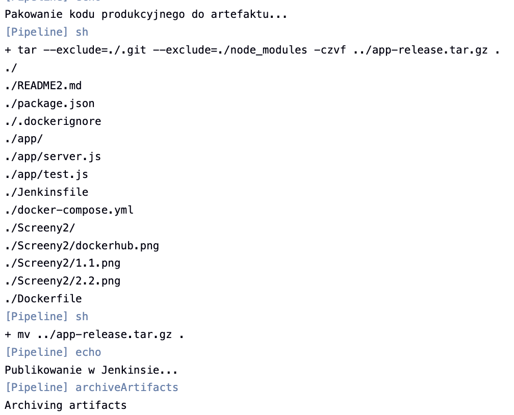
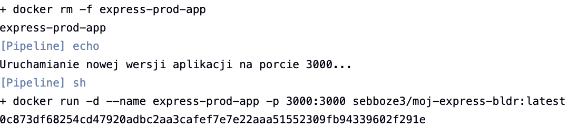
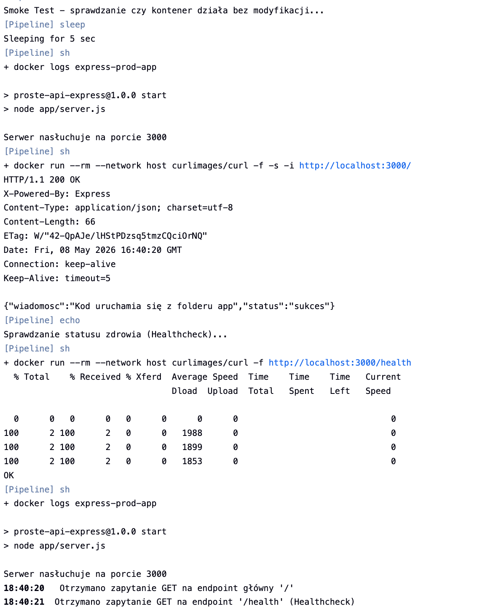

# Sprawozdanie: Laboratorium 5, 6 i 7 

## 1. Wybrana Aplikacja i Repozytorium
Do wdrożenia wybrano prostą aplikację backendową napisaną w środowisku **Node.js** z wykorzystaniem frameworka **Express**. 
* **Licencja:** Kod ma charakter dydaktyczny, co pozwala na swobodny obrót nim na potrzeby zadania (licencja otwarta).
* **Repozytorium:** Zdecydowano się pracować na osobistej gałęzi (`SB422052`) wewnątrz istniejącego repozytorium przedmiotowego (`MDO2026s_ITE`), zamiast tworzyć pełnego forka.

## 2. Zadania Wstępne (Weryfikacja Środowiska)
W ramach rozgrzewki przygotowano projekty typu *Freestyle*, weryfikujące poprawność konfiguracji Jenkinsa:
1. `Zadanie_1_Uname` - Pomyślne wywołanie powłoki systemowej.
2. `Zadanie_2_Godzina` - Poprawne zachowanie przy błędzie (celowe przerwanie `exit 1` przy nieparzystej godzinie).
3. `Zadanie_3_Docker` - Pomyślne pobranie obrazu Ubuntu.

> **Dowód realizacji zadań wstępnych:**
> 
> 

## 3. Diagram Aktywności (Proces CI/CD)
Poniższy diagram UML obrazuje zaplanowany przepływ pracy w Jenkinsie:

## 4. Realizacja etapów Pipeline (Ścieżka Krytyczna)
Zgodnie z zaplanowanym diagramem, zrealizowano potok CI/CD. Proces jest w pełni zautomatyzowany i powtarzalny dzięki czyszczeniu środowiska przed i po każdym uruchomieniu.

Krok 1: Build i Testowanie
Zbudowano obraz aplikacji na bazie obrazu node:18-slim. Wybór tej wersji pozwolił na zachowanie niskiej wagi obrazu przy jednoczesnym zapewnieniu stabilności środowiska. Po budowie obrazu, Jenkins automatycznie uruchomił kontener testowy i wykonał testy jednostkowe przy użyciu biblioteki Mocha.

Wynik: Testy zakończone sukcesem.
> 

Krok 2: Publikacja Artefaktów (Publish)
Po pomyślnym przejściu testów, potok przeszedł do etapu publikacji:

Docker Hub: Obraz został otagowany i wypchnięty do zewnętrznego rejestru pod nazwą sebboze3/moj-express-bldr:latest. Dzięki temu aplikacja jest dostępna do pobrania na dowolnej maszynie.
> 
> 

Archiwum lokalne: Kod produkcyjny został spakowany do archiwum .tar.gz (z wykluczeniem katalogu .git i node_modules) i zarchiwizowany bezpośrednio w Jenkinsie jako artefakt do pobrania.
> 

Krok 3: Wdrożenie i Weryfikacja (Deploy & Smoke Test)
Ostatnim etapem było wdrożenie produkcyjne na lokalnym środowisku Docker.

Jenkins usunął poprzednią instancję aplikacji, aby uniknąć konfliktów portów.

Uruchomiono nową wersję na porcie 3000.
> 

Smoke Test: Wykonano weryfikację "na żywo" za pomocą narzędzia curl. Odpytano endpoint /health, który zwrócił status 200 OK, co potwierdza, że aplikacja nie tylko się uruchomiła, ale poprawnie obsługuje żądania sieciowe.

> 

## 5. Odpowiedzi na pytania i wnioski
Format artefaktu: Wybrano obraz Docker (jako główny format redystrybucyjny) oraz archiwum .tar.gz. Obraz Docker zapewnia pełną przenośność (Portable Artifact), eliminując różnice w środowiskach między deweloperem a produkcją.

node vs node-slim: Pełny obraz node zawiera dodatkowe narzędzia kompilacji (np. python, kompilatory C++), które są potrzebne przy budowaniu niektórych bibliotek, ale zbędne do samego uruchomienia aplikacji. Obraz node-slim jest ich pozbawiony, co czyni go znacznie lżejszym i bezpieczniejszym na produkcji, ponieważ ogranicza liczbę zainstalowanych pakietów (mniejsza powierzchnia ataku).

Kontener Deploy: W moim projekcie kontenerem wdrożeniowym jest ten sam obraz, który został zbudowany w kroku Build. Dzięki zastosowaniu pliku .dockerignore, obraz ten jest "czysty" – nie zawiera logów ani historii Gita, co czyni go optymalnym do roli produkcyjnej (tzw. Runtime Image).

Definition of Done: Zadanie uznaję za zakończone, ponieważ proces kończy się wystawieniem gotowego do wdrożenia artefaktu na Docker Hubie, a automatyczna weryfikacja (Smoke Test) potwierdza jego pełną sprawność po starcie.