Sprawozdanie z Laboratoriów 08-11
Środowisko testowe: Maszyny wirtualne z systemami Linux (Fedora/Ubuntu). Dostęp do serwerów realizowałem zdalnie przez SSH

Na tych zajęciach zajęliśmy się automatyzacją pracy na wielu maszynach naraz przy użyciu narzędzia Ansible. Na początku przygotowałem maszynę główną (Control Node) i węzły docelowe (Endpoints), wymieniając między nimi klucze SSH, żeby móc logować się bez podawania hasła.

Następnie stworzyłem plik inwentaryzacji inventory.ini i sprawdziłem łączność z hostami za pomocą wbudowanego modułu ping.
> 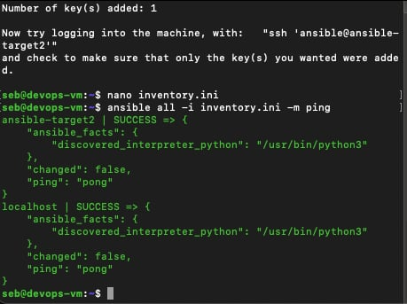

Jak widać na zrzucie, maszyny poprawnie odpowiedziały "pong", co potwierdza udaną komunikację.

Kolejnym krokiem było sprawdzenie idempotentności Ansible, czyli tego, jak zachowuje się przy ponownym uruchomieniu tego samego zadania. Napisałem playbooka, który kopiował pliki na serwery docelowe. Przy pierwszym uruchomieniu zadania wykonały się (status changed).

> 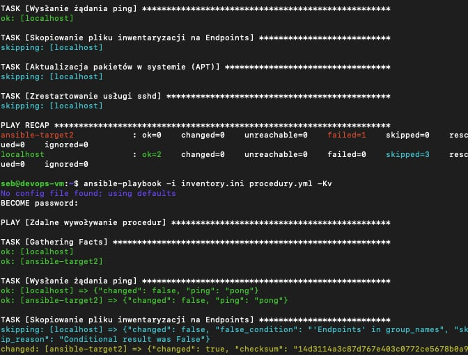

Gdy odpaliłem ten sam playbook po raz drugi, Ansible zauważył, że pliki już tam są, więc pominął zadanie (status ok zamiast changed).

> 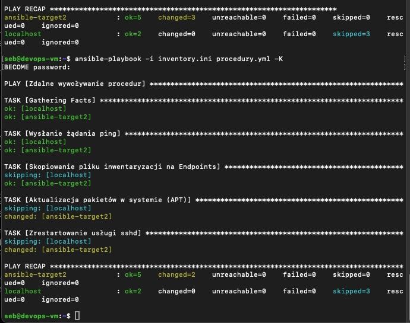

Przetestowałem też, jak system reaguje na awarię. Odciąłem maszynę docelową od sieci (wyłączając dostęp SSH) i uruchomiłem playbooka. Ansible prawidłowo zgłosił błąd UNREACHABLE z powodu timeoutu połączenia.
> 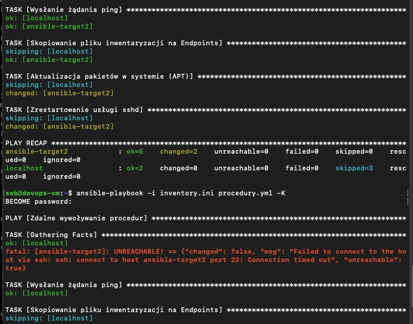

Ostatnim etapem było zdalne wdrożenie naszej aplikacji w kontenerze. Playbook zainstalował Dockera, pobrał obraz i uruchomił go na odpowiednim porcie. Zalogowałem się na maszynę docelową, żeby ręcznie sprawdzić status kontenera i przetestować działanie aplikacji curlem. Dodatkowo Ansible sam zweryfikował, czy aplikacja zwraca poprawny status.
> 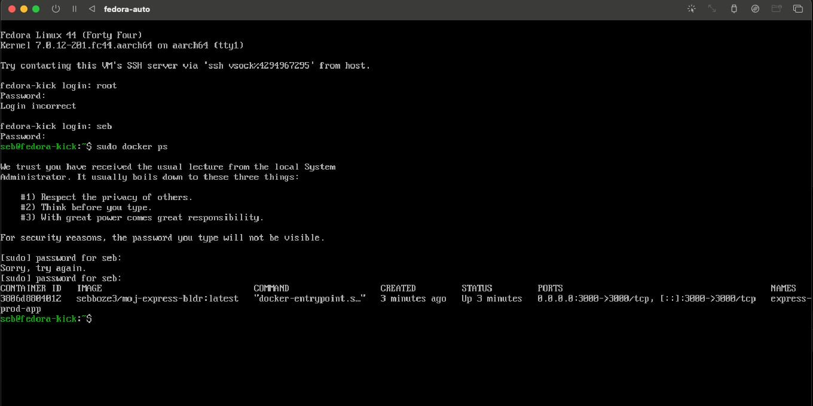

> 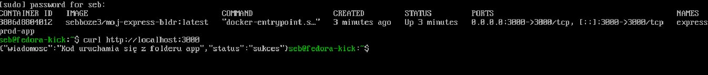

> 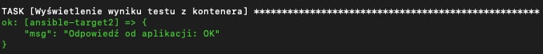

Nienadzorowana instalacja systemu (Kickstart)
Zamiast przeklikiwać się przez instalator systemu, przygotowałem plik odpowiedzi (Kickstart), który automatyzuje ten proces. Zmodyfikowałem plik konfiguracyjny tak, aby instalator sam sformatował dysk, utworzył odpowiedniego użytkownika (innego niż domyślny) oraz ustawił hostname maszyny.

Podczas uruchamiania nowej maszyny wirtualnej, wskazałem instalatorowi przygotowany plik. Proces instalacji systemu Fedora przebiegł całkowicie bez mojej ingerencji.
> 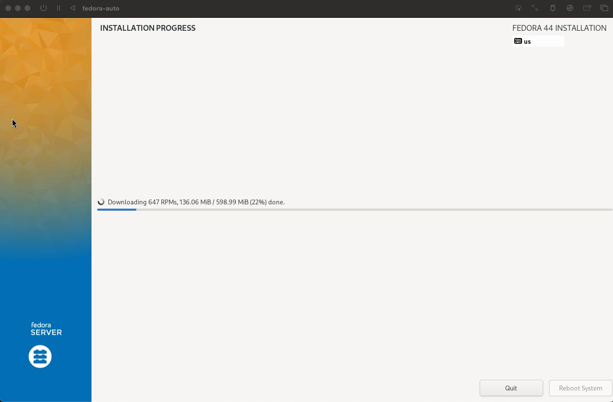

W sekcji %post pliku odpowiedzi zdefiniowałem też skrypty, które od razu po instalacji systemu pobierają i przygotowują środowisko do odpalenia naszego programu.
> 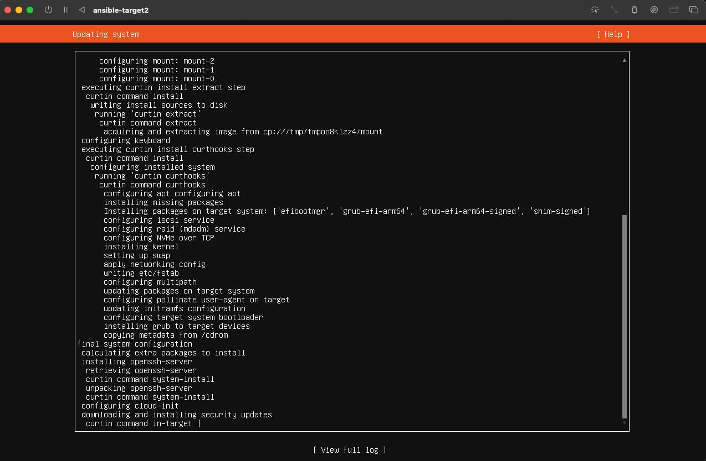

Kubernetes 
Uruchomiłem lokalny klaster za pomocą Minikube, używając Dockera jako sterownika. Sprawdziłem status węzła i uruchomiłem webowy Dashboard.
> 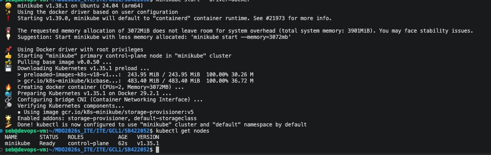

> 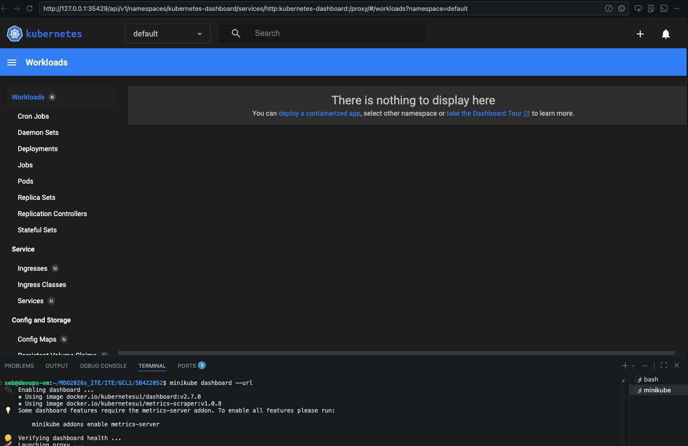

Na początek wdrożyłem aplikację ręcznie, powołując pojedynczego Poda z naszym obrazem moj-express. Po przekierowaniu portów (port-forward) przetestowałem w terminalu, czy aplikacja odpowiada na żądania.
> 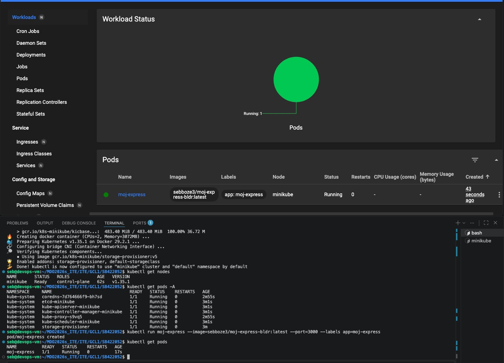
> 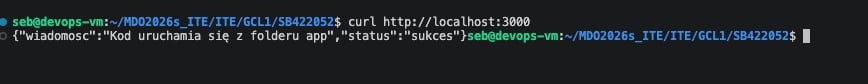

Następnie stworzyłem plik deployment.yml i zaaplikowałem go w klastrze. Przetestowałem dynamiczne skalowanie liczby replik. Klaster w ułamku sekundy powołał nowe pody, aby wyrównać stan rzeczywisty z zadeklarowanym w pliku.
> 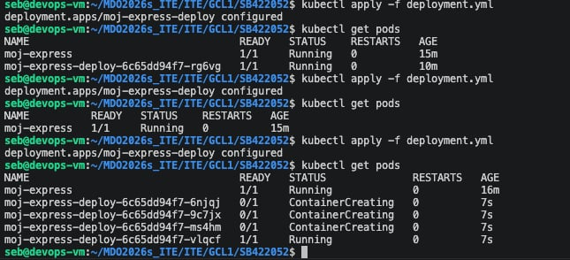

Zasymulowałem też awarię wdrożenia. Zaktualizowałem aplikację do zepsutego obrazu (wersja z bugiem). Pody po chwili przeszły w stan błędu. Użyłem komendy rollout undo, aby błyskawicznie cofnąć klaster do poprzedniej, działającej wersji.
> 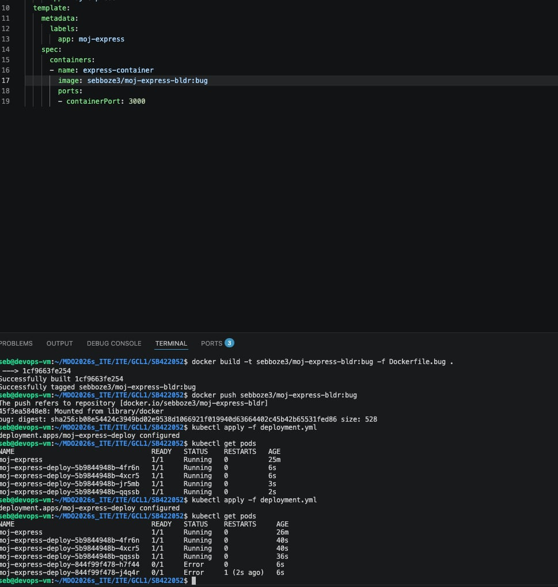
> 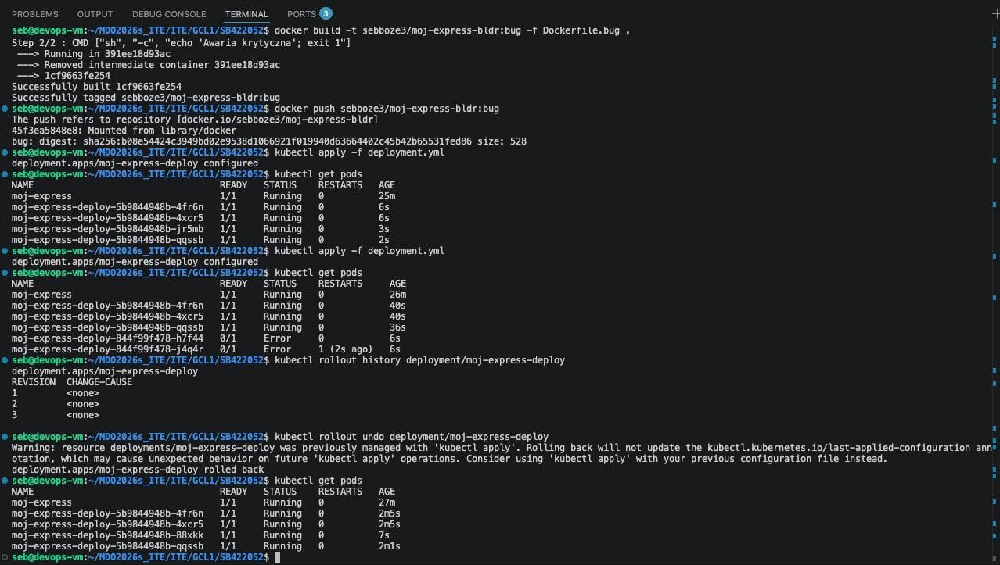

Przetestowałem różne strategie podmieniania podów podczas aktualizacji, modyfikując sekcję strategy w pliku YAML .
> 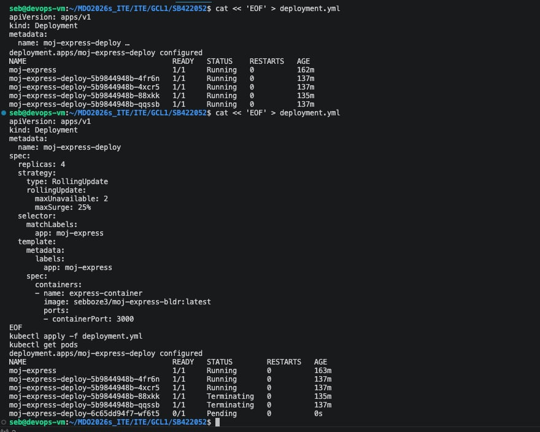

Żeby mieć pewność, że wdrożenie wyrabia się w czasie, napisałem skrypt bash, który weryfikuje status wdrożenia i zwraca błąd, jeśli trwa ono dłużej niż 60 sekund.

> 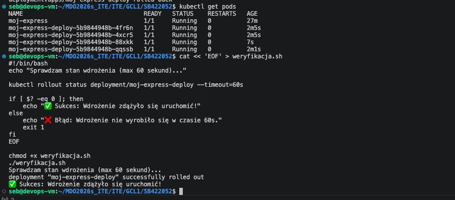
> 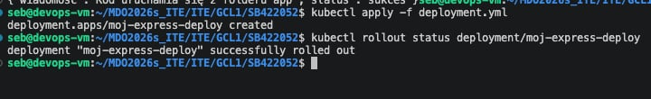

Na koniec zrealizowałem Canary Deployment. Postawiłem drugi, osobny deployment z zaledwie jedną repliką nowej wersji (obok działających starych replik), żeby bezpiecznie przetestować ruch produkcyjny na małej próbce.
> 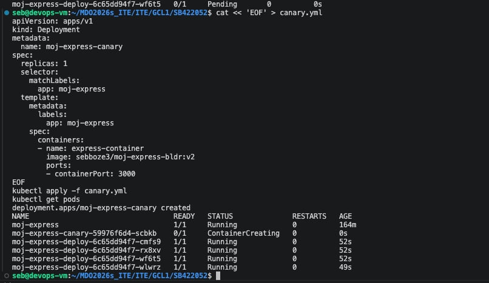

Kubernetes - Eksponowanie ruchu i Load Balancing
Na start wdrożyłem potężny deployment serwera Nginx wyskalowany aż do 36 replik, co skutecznie zaprezentowało możliwości orkiestracji Kubernetesa.
> 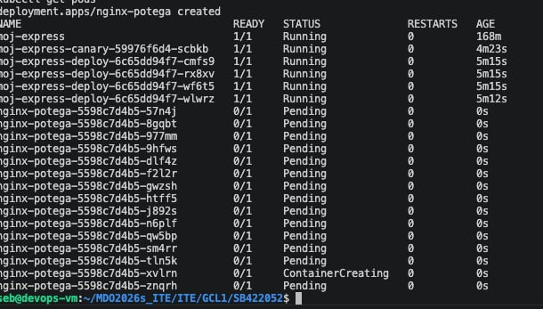
> 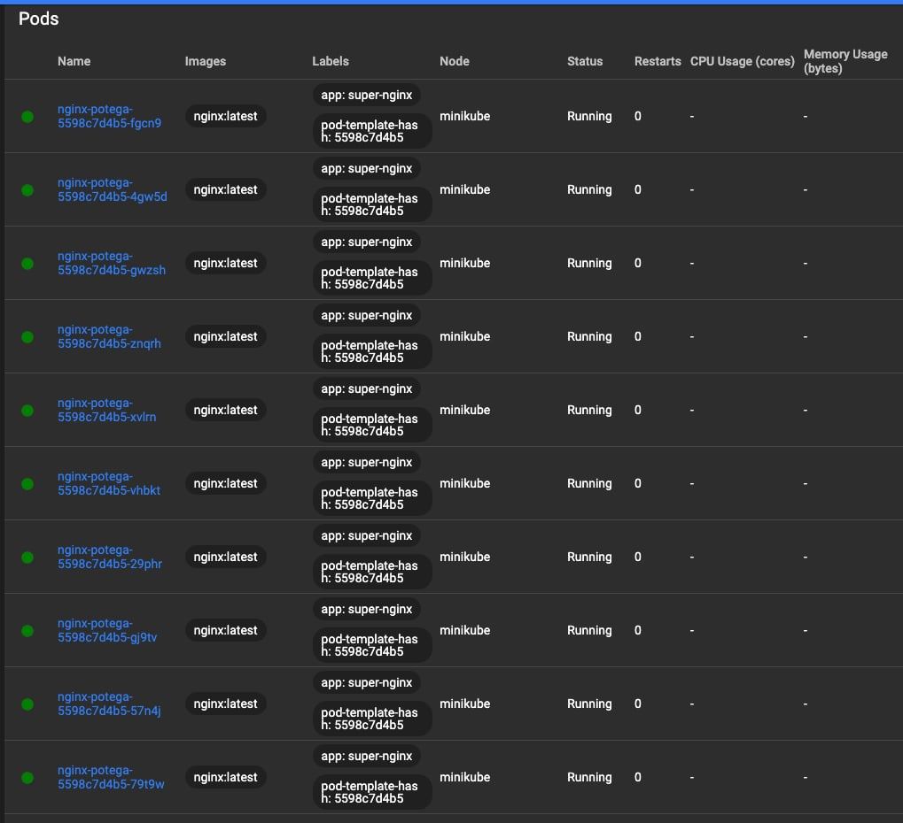

Ruch kierowałem sukcesywnie na cztery sposoby: bezpośrednio do konkretnego Poda, do całego wdrożenia (Deployment), do Serwisu utworzonego z palca przez terminal oraz do Serwisu zdefiniowanego w osobnym pliku YAML. Każdy test weryfikowałem pobierając stronę powitalną Nginxa.
> 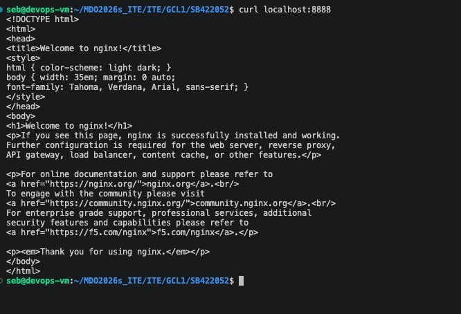
> 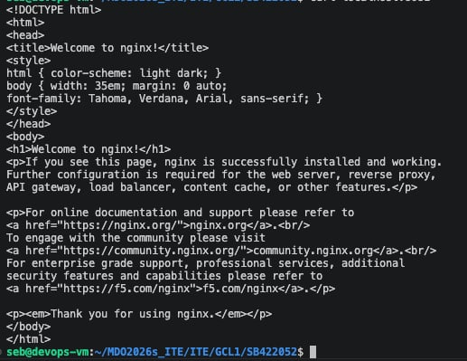
> 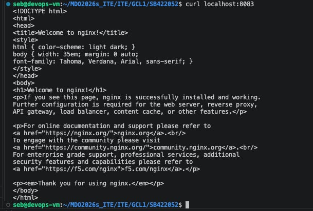

Potem zzmiejszylem nasz potężny deployment z 36 replik. Zrobiłem to na dwa sposoby: najpierw szybką, wymuszoną komendą scale zmniejszyłem je do 10 replik, a potem edytując plik konfiguracyjny YAML do 3 replik, co jest znacznie lepszą praktyką .
> 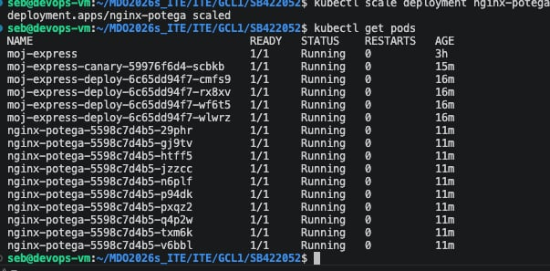
> 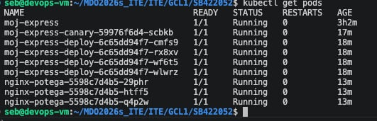

sprawdziłem działanie Kubernetesowego Load Balancera. Uruchomiłem pętlę, która wysyłała kilka szybkich zapytań HTTP pod rząd do naszego Serwisu. Po wyświetleniu logów wszystkich trzech podów wyraźnie było widać, że zapytania nie poleciały tylko do jednego z nich. Klaster inteligentnie i równomiernie rozdzielał ruch pomiędzy działające pody.
> 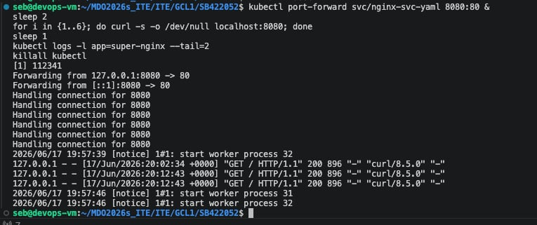