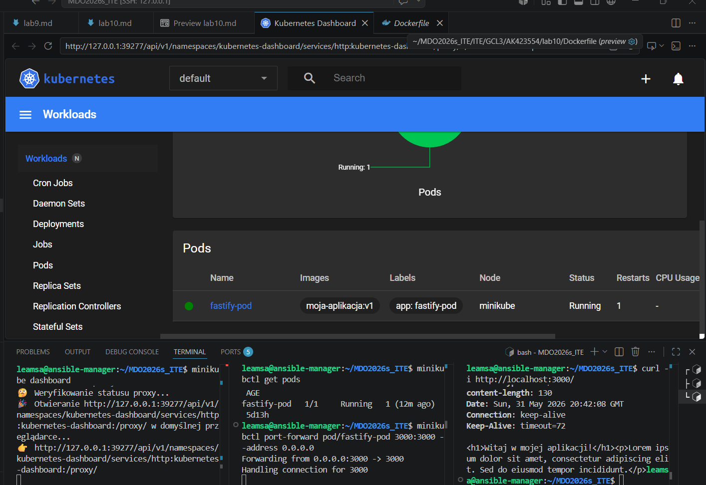
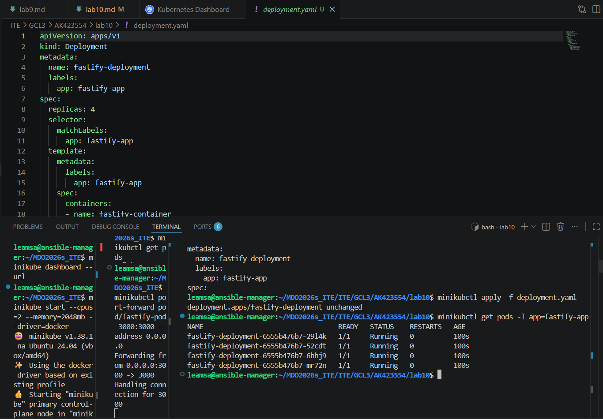
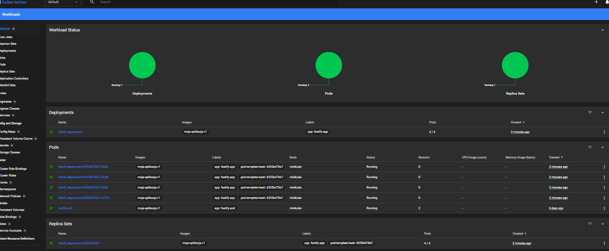
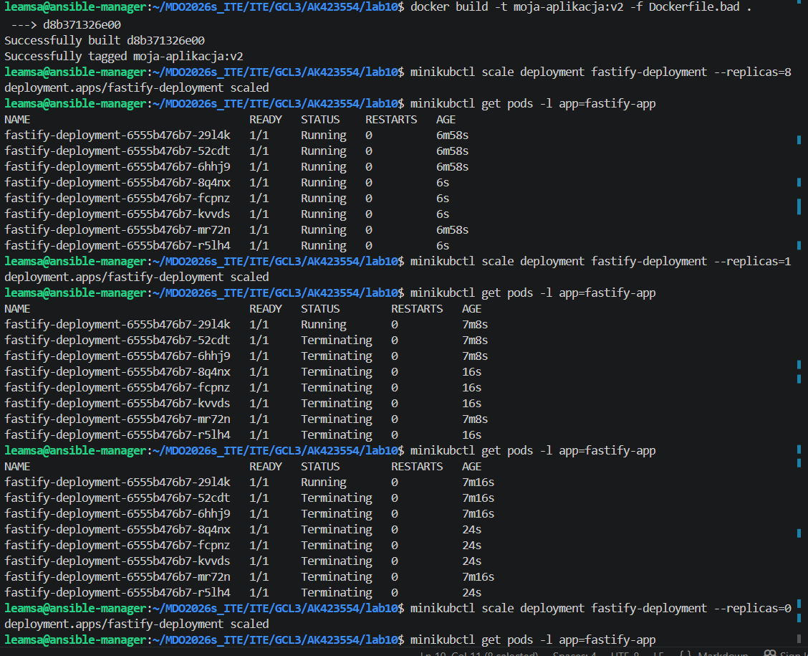
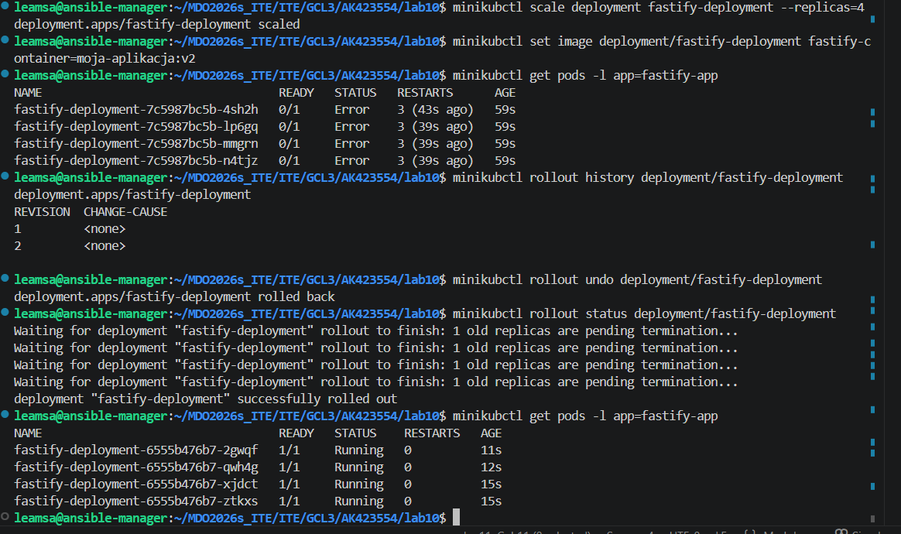
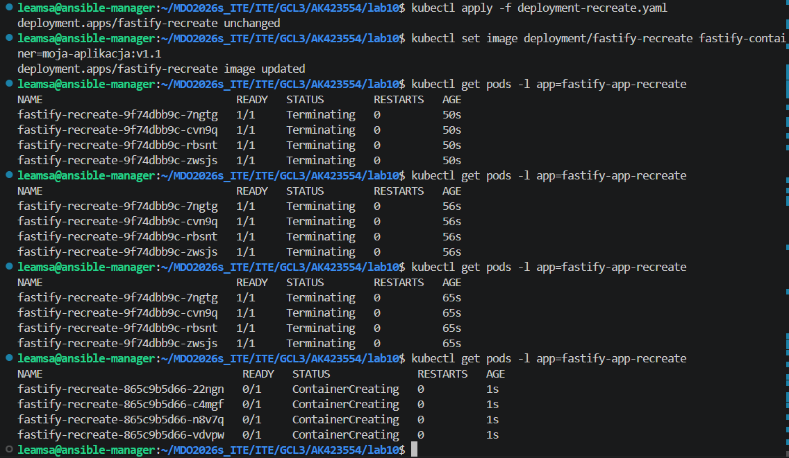
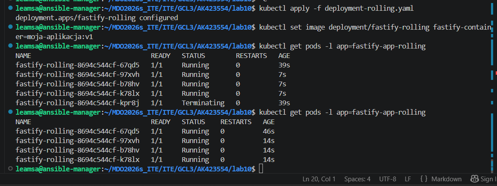
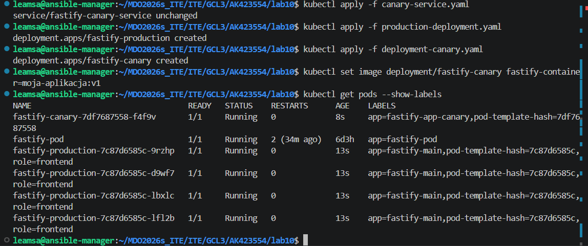

`leamsa@ansible-manager:~/MDO2026s_ITE/ITE/GCL3/AK423554/lab10$ minikube start --cpus=2 --memory=2048mb --driver=docker`

Strategia Recreate

Wszystkie 4 dotychczasowe pody natychmiast otrzymały status Terminating (zamykanie). Przez kilka sekund liczba działających podów wynosiła dokładnie 0. Dopiero po całkowitym usunięciu starych kontenerów, Kubernetes zaczął uruchamiać 4 nowe pody.
Wniosek: Strategia drastyczna, powodująca przerwę w dostępności usługi, ale gwarantująca, że dwie różne wersje aplikacji nigdy nie działają w tym samym momencie.

Strategia Rolling Update

Klaster nie wyłączył aplikacji. Widoczne było uruchamianie nowej partii podów przy jednoczesnym utrzymaniu części starych. W szczytowym momencie na liście znajdowało się więcej podów niż zadeklarowane 4 repliki. Pody były wymieniane płynnie.

Wniosek: Strategia zapewnia brak przestoju. Użytkownik końcowy cały czas ma dostęp do aplikacji podczas wdrożenia nowej wersji.

Canary Deployment

Ruch przychodzący na serwis fastify-canary-service jest automatycznie rozdzielany pomiędzy pody z etykietą role: frontend. Ponieważ kanarek stanowi małą część puli, nowa wersja testowana jest bezpiecznie na małej grupie zapytań. W razie błędu kanarka, usuwa się tylko jedno małe wdrożenie, nie niszcząc głównej produkcji.

Wniosek: Strategia idealna do testowania ryzykownych aktualizacji bezpośrednio na użytkownikach bez przerywania stabilnej usługi.