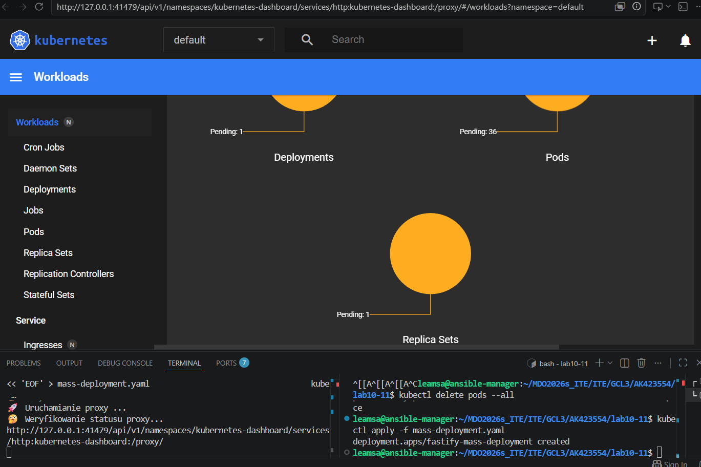
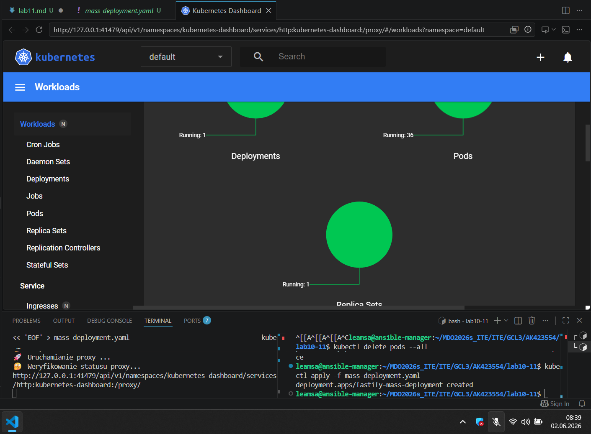
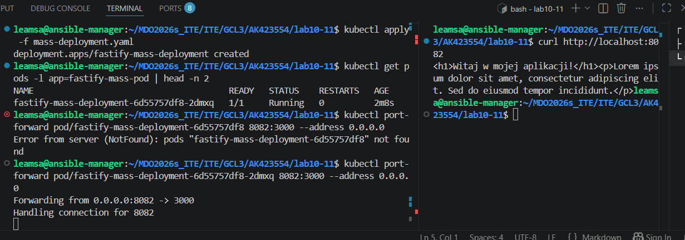
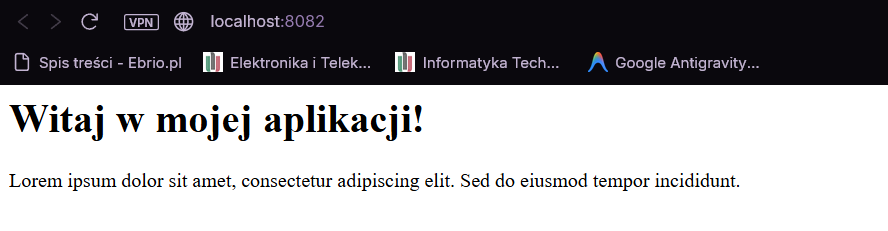
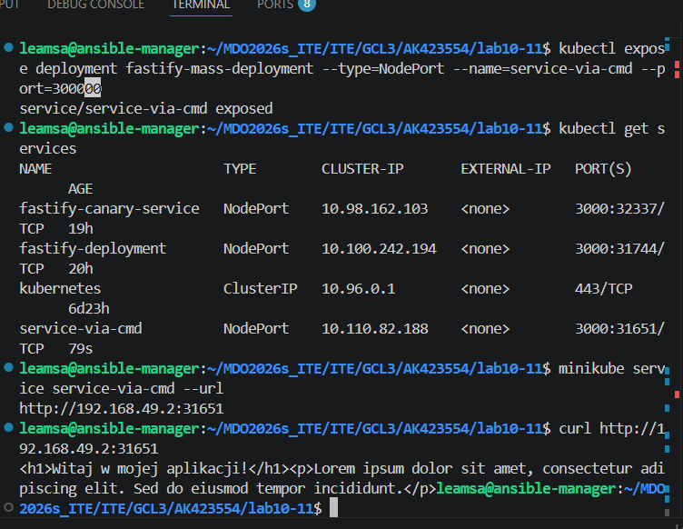
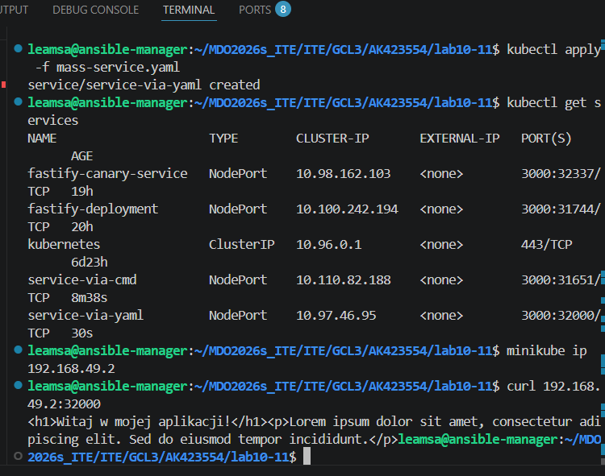
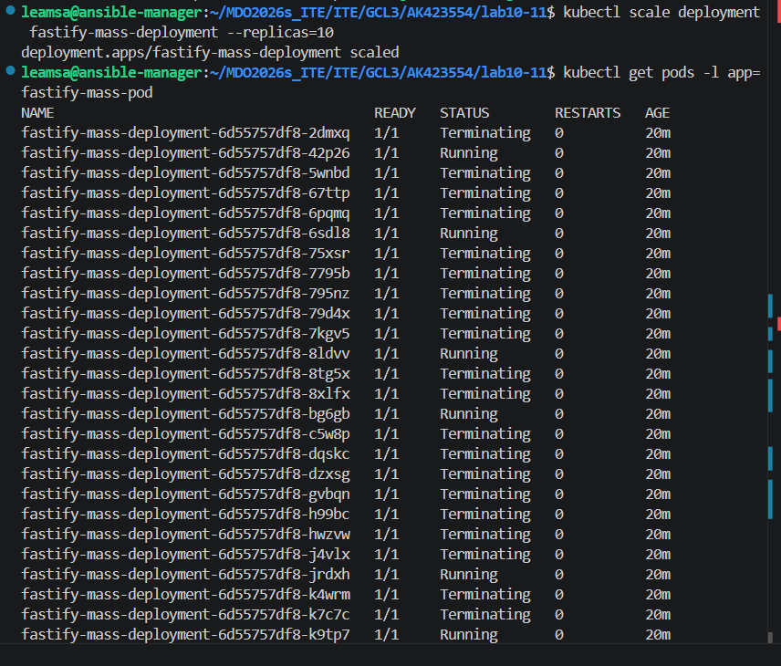
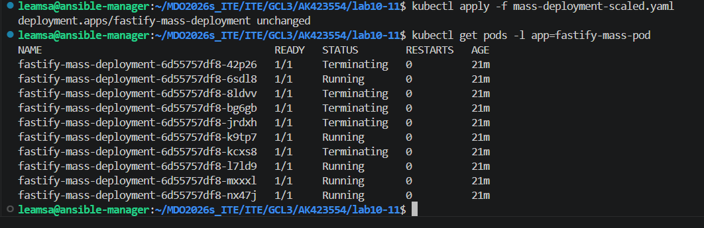
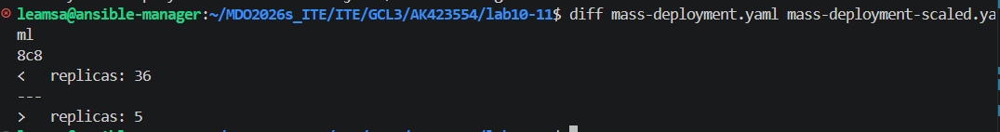
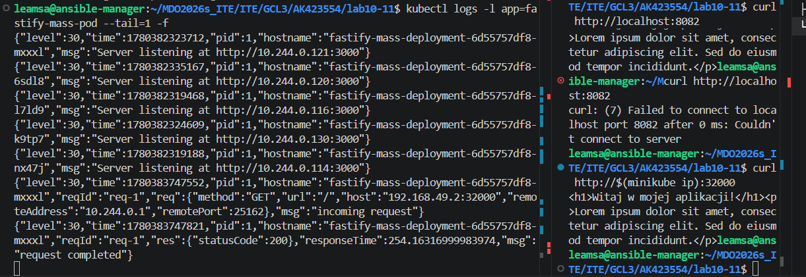

dostep do poda:

dostep do deploymentu:

dostep do serwisu:

skalowanie:

różnice między replikami:

do których podów się połączyliśmy:

w tym wypadku curla obsłużył pod `fastify-mass-deployment-6d55757df8-mxxxl`