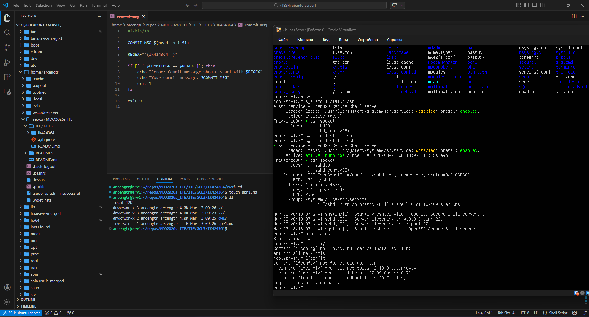

Metodyki DevOps Sprawozdanie Illia Kuziv ITE gr.3

Git Hook 
```
#!/bin/sh

COMMIT_MSG=$(head -n 1 $1)

REGEX="^(IK424364: )"

if [[ ! $COMMITMSG =~ $REGEX ]]; then
	echo "Error: Commit message should start with $REGEX"
	echo "Your commit message: $COMMIT_MSG"
	exit 1
fi

exit 0
```

