Metodyki DevOps Sprawozdanie 1 Illia Kuziv ITE gr.3

Lab1

Git Hook 
```
#!/bin/sh

COMMIT_MSG=$(head -n 1 $1)

REGEX="^(IK424364: )"

if [[ ! $COMMITMSG =~ $REGEX ]]; then
	echo "Error: Commit message should start with $REGEX"
	echo "Your commit message: $COMMIT_MSG"
	exit 1
fi

exit 0
```

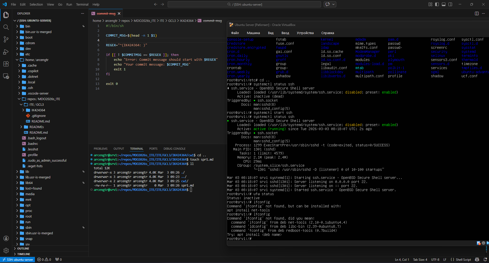

Lab 2

Uruchomienie kontenera busybox:

```
docker run -it busybox
```

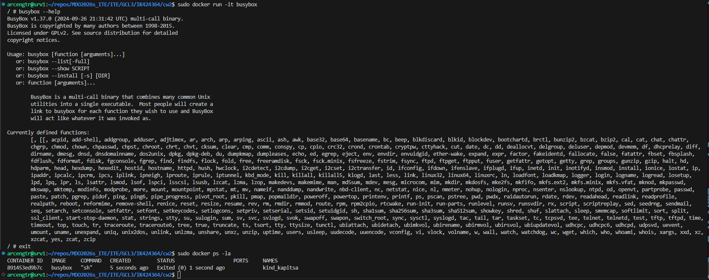

Na zrzutach widać efekto izolowania kontenerów, widać, że na obu zrzutach jest proces shell-a, ale na hostie i w kontenerze ma różne PID:

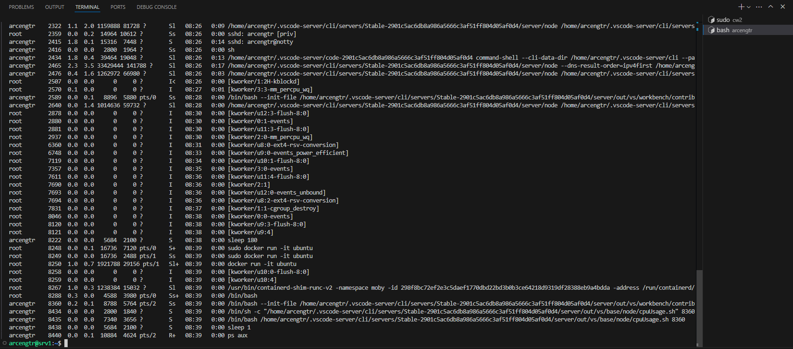

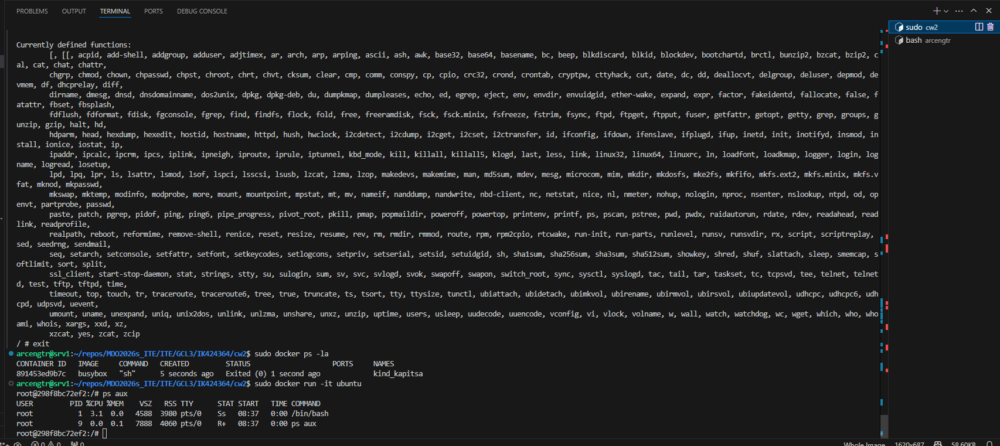

Przykładowy kod Dockerfile:

```
FROM ubuntu:22.04

RUN apt update && apt install git -y

RUN git --version

WORKDIR /app

RUN git clone https://github.com/InzynieriaOprogramowaniaAGH/MDO2026s_ITE.git

CMD ["/bin/bash"]
```

Po uruchomieniu kontenera widać, że repo ściągnięte:

```
docker run -it git-container .
```

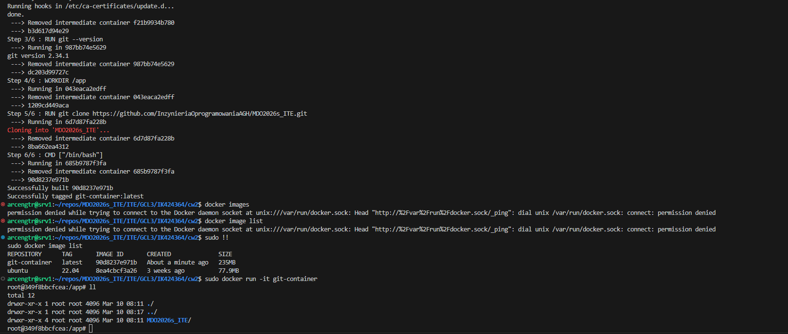

Lab 3

Repozytorium wykorzystywany do zajęć: https://github.com/alexey-lapin/realworld-backend-spring

Najpierw był zainstalowany JDK do buildowania i uruchomienia aplikacji i po tym udało uruchomić aplikację, oraz ją przetesatować

```
sudo apt update
sudo apt install openjdk-25-jdk

git clone https://github.com/alexey-lapin/realworld-backend-spring.git
cd realworld-backend-spring

./gradlew assemble --no-daemon

./gradlew test --no-daemon
```


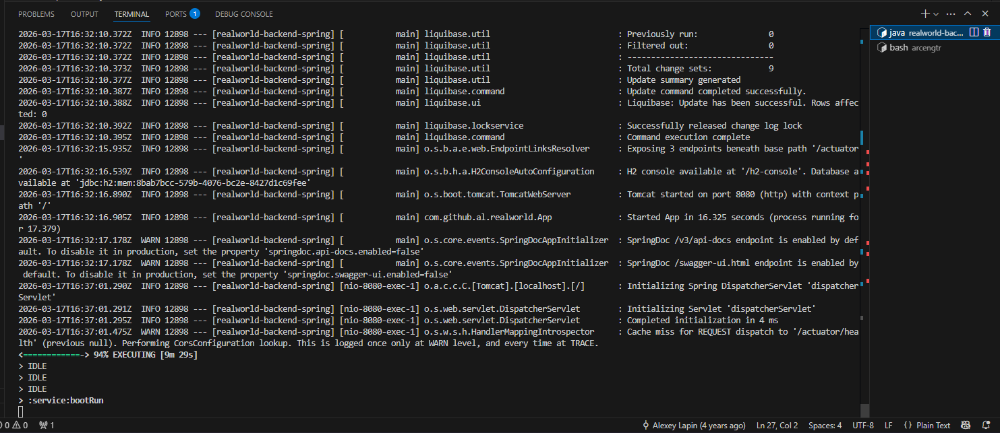

Potem został stworzony kontener z Ubuntu 22 do przetestowania tych działń w nim:

```
docker run -it --name spring-build-env ubuntu:22.04 /bin/bash

sudo apt-get update && apt-get install -y openjdk-25-jdk git

git clone https://github.com/alexey-lapin/realworld-backend-spring.git
cd realworld-backend-spring

./gradlew assemble --no-daemon

./gradlew test --no-daemon
```

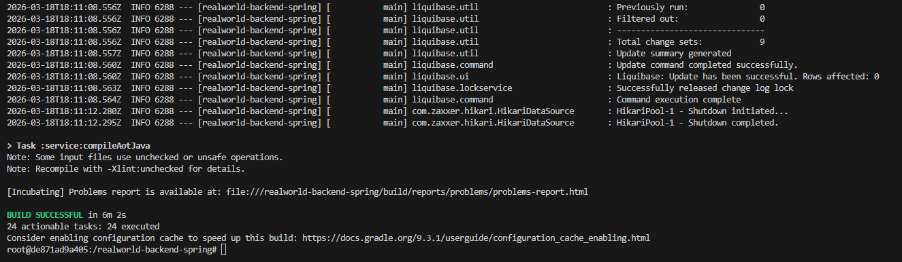

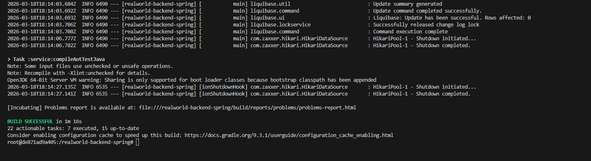

Potem zostały utworzone pliki Dockerfile do buildowania i do testowania

Dockerfile.build:

```
FROM eclipse-temurin:25-noble

WORKDIR app/

RUN apt-get update && apt-get install -y git

RUN git clone https://github.com/alexey-lapin/realworld-backend-spring.git

WORKDIR /app/realworld-backend-spring

RUN ./gradlew dependencies --no-daemon

RUN ./gradlew assemble --no-daemon
```

Dockerfile.test:

```
FROM realworld-base

ENTRYPOINT ["./gradlew", "test", "--no-daemon"]
```

I zostały uruchomione komendy:

```
docker build -f Dockerfile.build -t realworld-base .
```

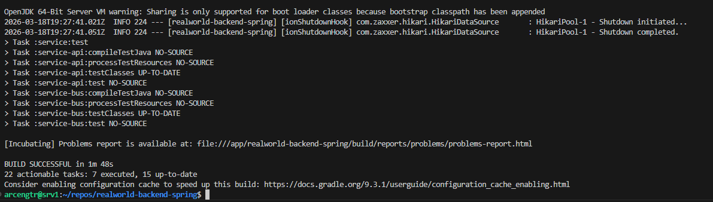

```
docker build -f Dockerfile.test -t realworld-tester .
docker run --name test-run realworld-tester
```


Lab 4

Tworzenie i sprawdzanie działalności Bind Mount:


Lączność pomiędzu 2 kontenerami z iperf3:
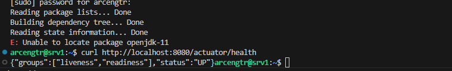

Najwyższy wynik wynoszący 36,1 Gbit/s

Lączność pomiędzu 2 kontenerami z iperf3 w sieci docker:


Uzyskuje stabilny transfer na poziomie 32,3 Gbit/s

Lączność pomiędzu 2 kontenerami z iperf3 spoza hosta:


Niższą przepustowość rzędu 3,2 Gbit/s osiągana ze względu na narzut procesów proxy i translacji portów

Z tego wychodzi, że sieci Docker mają prawie natywną szybkość przesayłania danych


SSHD:
```
sudo docker run --rm --tty -i --name ssh-container ubuntu
apt update
apt install -y openssh-server
mkdir /var/run/sshd
echo 'root:password123' | chpasswd
sed -i 's/#PermitRootLogin prohibit-password/PermitRootLogin yes/' /etc/ssh/sshd_config
/usr/sbin/sshd -D &
```

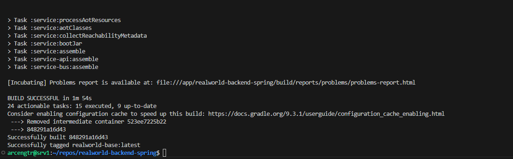

Zaletą SSH jest wygoda przesyłania plików i obsługa zewnętrznych narzędzi, natomiast wadą jest niepotrzebny narzut zasobów oraz ryzyko bezpieczeństwa


Instalacja Jenkins:
```
docker network create jenkins
```

```
docker run \
  --name jenkins-docker \
  --rm \
  --detach \
  --privileged \
  --network jenkins \
  --network-alias docker \
  --env DOCKER_TLS_CERTDIR=/certs \
  --volume jenkins-docker-certs:/certs/client \
  --volume jenkins-data:/var/jenkins_home \
  --publish 2376:2376 \
  docker:dind \
  --storage-driver overlay2
```

Był stworzony Dockerfile:
```
FROM jenkins/jenkins:2.541.3-jdk21
USER root
RUN apt-get update && apt-get install -y lsb-release ca-certificates curl && \
    install -m 0755 -d /etc/apt/keyrings && \
    curl -fsSL https://download.docker.com/linux/debian/gpg -o /etc/apt/keyrings/docker.asc && \
    chmod a+r /etc/apt/keyrings/docker.asc && \
    echo "deb [arch=$(dpkg --print-architecture) signed-by=/etc/apt/keyrings/docker.asc] \
    https://download.docker.com/linux/debian $(. /etc/os-release && echo \"$VERSION_CODENAME\") stable" \
    | tee /etc/apt/sources.list.d/docker.list > /dev/null && \
    apt-get update && apt-get install -y docker-ce-cli && \
    apt-get clean && rm -rf /var/lib/apt/lists/*
USER jenkins
RUN jenkins-plugin-cli --plugins "blueocean docker-workflow json-path-api"
```

```
docker build -t myjenkins-blueocean:2.541.3-1 .
```

```
docker run \
  --name jenkins-blueocean \
  --restart=on-failure \
  --detach \
  --network jenkins \
  --env DOCKER_HOST=tcp://docker:2376 \
  --env DOCKER_CERT_PATH=/certs/client \
  --env DOCKER_TLS_VERIFY=1 \
  --publish 8080:8080 \
  --publish 50000:50000 \
  --volume jenkins-data:/var/jenkins_home \
  --volume jenkins-docker-certs:/certs/client:ro \
  myjenkins-blueocean:2.541.3-1
```


