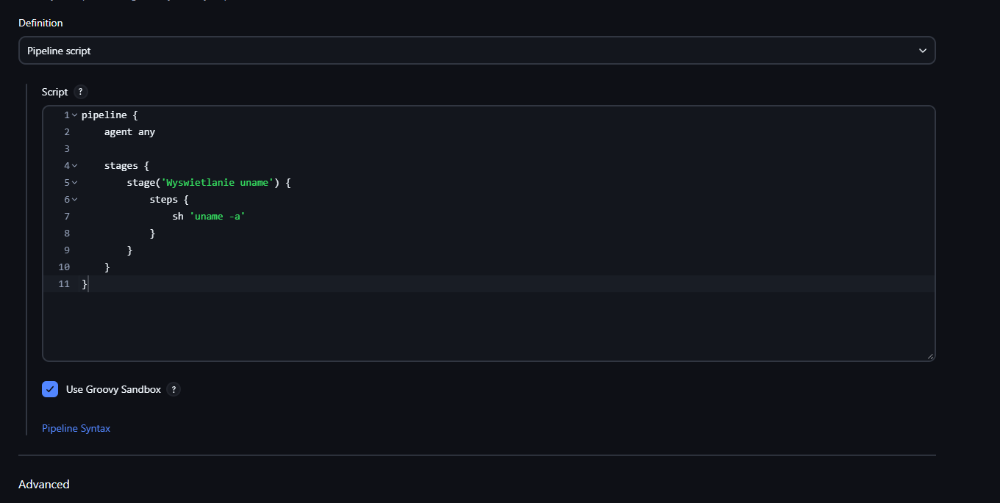
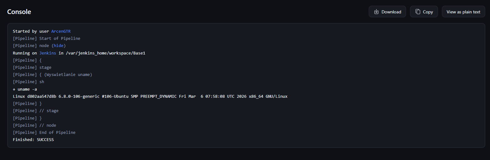
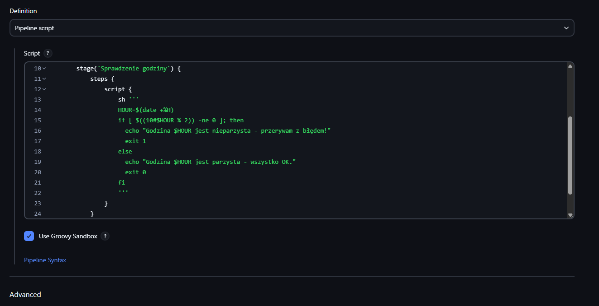
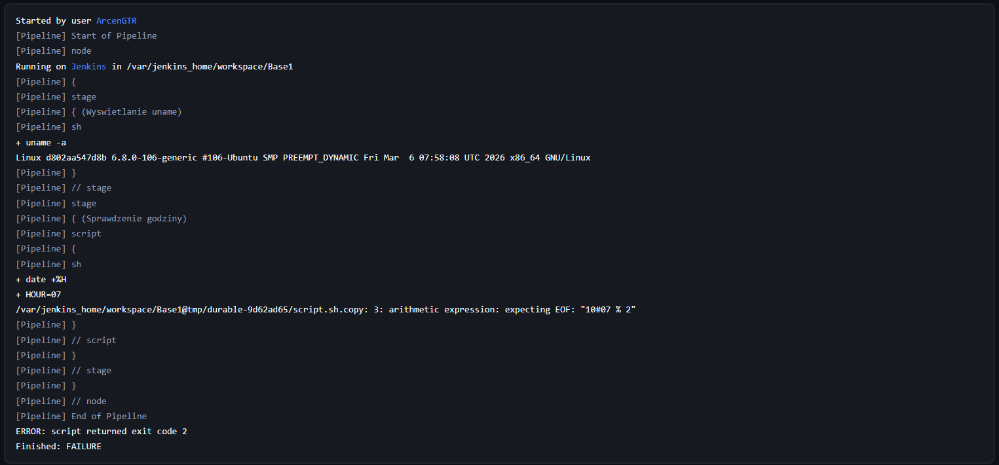
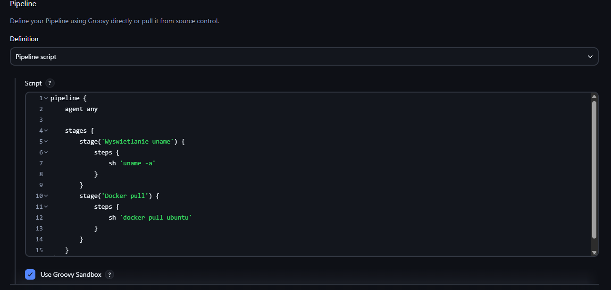
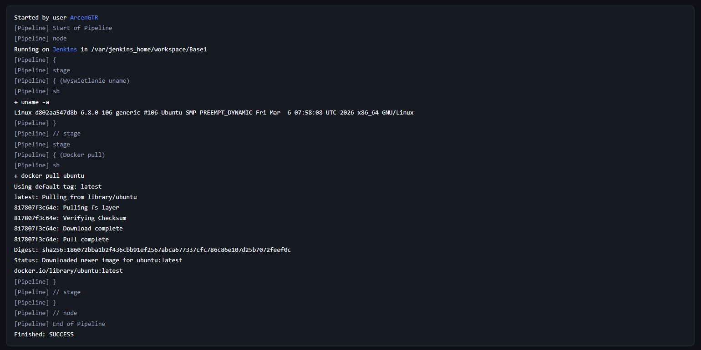
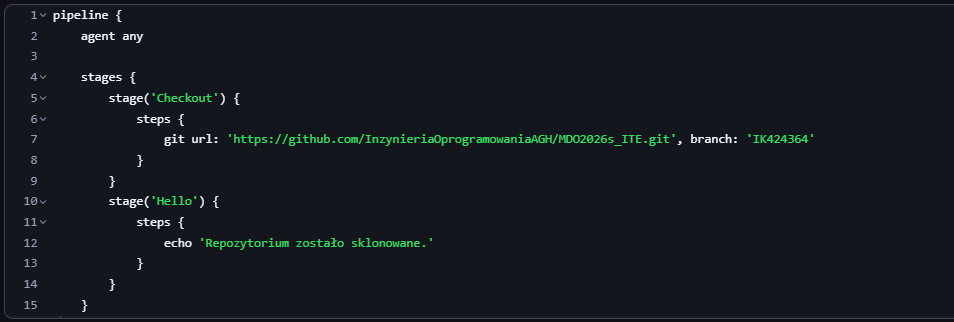
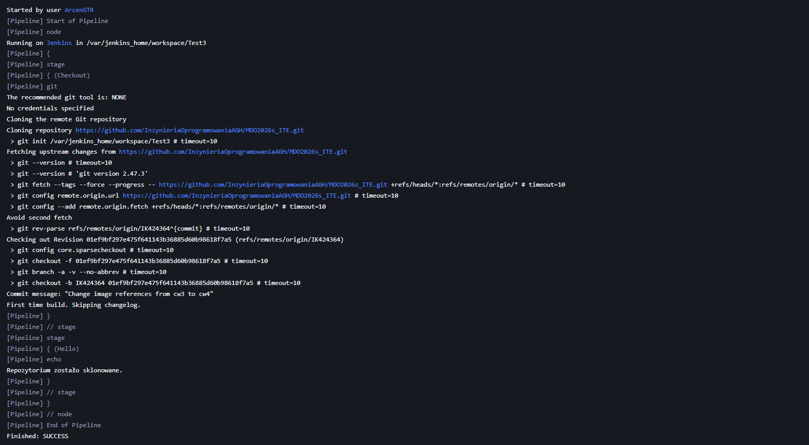
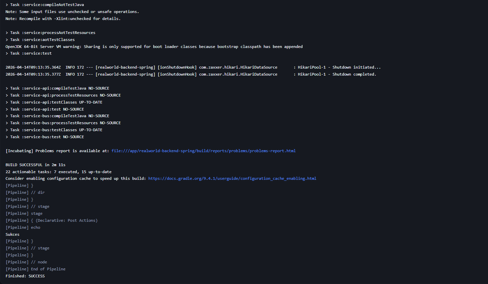

Po uruchomieniu Jenkins Blueocean, czyli Jenkinsa z zaawansowanym interfejsem graficznum:

sudo docker run   --name jenkins-docker   --rm   --detach   --privileged   --network jenkins   --network-alias docker   --env DOCKER_TLS_CERTDIR=/certs   --volume jenkins-docker-certs:/certs/client   --volume jenkins-data:/var/jenkins_home   --publish 2376:2376   docker:dind   --storage-driver overlay2


Stoworzony był prosty pipline z uname -a:



Wynik:



Utworzono projekt odpalający poniższy skrypt, wyrzucający błąd gdy godzina jest nieparzysta:



Wynik:



I też został protestowany docker pull:



Wynik:



Najpierw sprawdziłem klonowanie repozytorium:



Wynik:



Budowanie Dockera w piplinie:

```
pipeline {
    agent any

    stages {
        stage('Checkout') {
            steps {
                echo 'Start'
                git url: 'https://github.com/InzynieriaOprogramowaniaAGH/MDO2026s_ITE.git', branch: 'IK424364'
                echo 'Repozytorium zostało sklonowane'
            }
        }
        stage('Build') {
            steps {
                 dir('ITE/GCL3/IK424364/cw3/') {
                    sh 'docker build --no-cache -f Dockerfile.build -t realworld-base .'
                }
            }
        }
        stage('Test') {
            steps {
                dir('ITE/GCL3/IK424364/cw3/') {
                    echo 'Start testów'
                    sh 'docker build --no-cache -f Dockerfile.test -t realworld-test .'
                    sh 'docker run --rm spring-test'
                }
            }
        }
    }
    post {
        success {
            echo 'Sukces'
        }
        failure {
            echo 'Błąd'
        }
    }
}
```


Po tym został utworzony Jenkinsfile z kompletnym piplinem dla następnych zajęć:
```
pipeline {
    agent any

    stages {
        stage('Checkout') {
            steps {
                echo 'Start'
                git url: 'https://github.com/InzynieriaOprogramowaniaAGH/MDO2026s_ITE.git', branch: 'IK424364'
                echo 'Repozytorium zostało sklonowane'
            }
        }
        stage('Build') {
            steps {
                 dir('ITE/GCL3/IK424364/cw3/') {
                    sh 'docker build --no-cache -f Dockerfile.build -t realworld-base .'
                }
            }
        }
        stage('Test') {
            steps {
                dir('ITE/GCL3/IK424364/cw3/') {
                    echo 'Start testów'
                    sh 'docker build --no-cache -f Dockerfile.test -t realworld-test .'
                    sh 'docker run --rm spring-test'
                }
            }
        }
        stage('Deploy') {
            steps {
                echo 'TODO'
            }
        }

        stage('Publish') {
            steps {
                echo 'TODO'
            }
        }
    }
    post {
        success {
            echo 'Sukces'
        }
        failure {
            echo 'Błąd'
        }
    }
}
```

Wynik pipelinu:



Różnica pomiędzy dedykowanym DIND a działaniem odrazu w kontenerze CI:

DIND (Docker-in-Docker) pozwala uruchomić demona Dockera wewnątrz kontenera. co pozwala na pełną izolację,
podejście z kontenerom CI polega na korzystaniu się z hostowego demona Dockera


