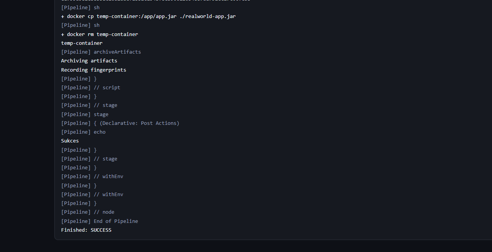
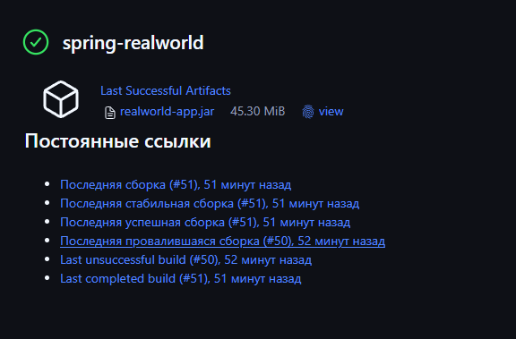
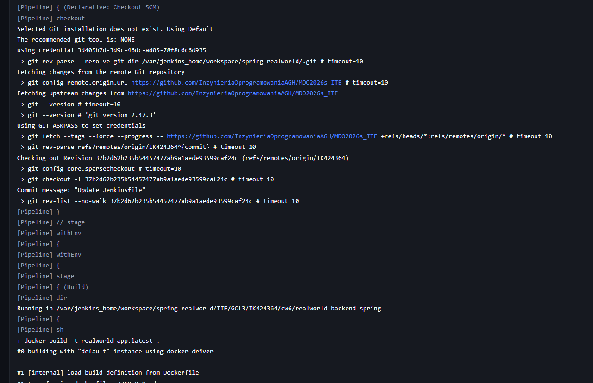

Lab 5 / Lab 6 / Lab 7

Po uruchomieniu Jenkins Blueocean, czyli Jenkinsa z zaawansowanym interfejsem graficznum oraz DIND


Stoworzony był prosty pipline z uname -a:


Wynik:


Utworzono projekt odpalający poniższy skrypt, wyrzucający błąd gdy godzina jest nieparzysta:


Wynik:


I też został protestowany docker pull:


Wynik:


Najpierw sprawdziłem klonowanie repozytorium:


Wynik:


Budowanie Dockera w piplinie:

```
pipeline {
    agent any

    stages {
        stage('Checkout') {
            steps {
                echo 'Start'
                git url: 'https://github.com/InzynieriaOprogramowaniaAGH/MDO2026s_ITE.git', branch: 'IK424364'
                echo 'Repozytorium zostało sklonowane'
            }
        }
        stage('Build') {
            steps {
                 dir('ITE/GCL3/IK424364/cw3/') {
                    sh 'docker build --no-cache -f Dockerfile.build -t realworld-base .'
                }
            }
        }
        stage('Test') {
            steps {
                dir('ITE/GCL3/IK424364/cw3/') {
                    echo 'Start testów'
                    sh 'docker build --no-cache -f Dockerfile.test -t realworld-test .'
                    sh 'docker run --rm spring-test'
                }
            }
        }
    }
    post {
        success {
            echo 'Sukces'
        }
        failure {
            echo 'Błąd'
        }
    }
}
```


Po tym został utworzony Jenkinsfile z kompletnym piplinem dla następnych zajęć:
```
pipeline {
    agent any

    stages {
        stage('Checkout') {
            steps {
                echo 'Start'
                git url: 'https://github.com/InzynieriaOprogramowaniaAGH/MDO2026s_ITE.git', branch: 'IK424364'
                echo 'Repozytorium zostało sklonowane'
            }
        }
        stage('Build') {
            steps {
                 dir('ITE/GCL3/IK424364/cw3/') {
                    sh 'docker build --no-cache -f Dockerfile.build -t realworld-base .'
                }
            }
        }
        stage('Test') {
            steps {
                dir('ITE/GCL3/IK424364/cw3/') {
                    echo 'Start testów'
                    sh 'docker build --no-cache -f Dockerfile.test -t realworld-test .'
                    sh 'docker run --rm spring-test'
                }
            }
        }
        stage('Deploy') {
            steps {
                echo 'TODO'
            }
        }

        stage('Publish') {
            steps {
                echo 'TODO'
            }
        }
    }
    post {
        success {
            echo 'Sukces'
        }
        failure {
            echo 'Błąd'
        }
    }
}
```

Wynik pipelinu:


Różnica pomiędzy dedykowanym DIND a działaniem odrazu w kontenerze CI:

DIND (Docker-in-Docker) pozwala uruchomić demona Dockera wewnątrz kontenera. co pozwala na pełną izolację,
podejście z kontenerom CI polega na korzystaniu się z hostowego demona Dockera

Do korzystania z SCM ustawić to w pipelinie



Pipeline:

```
pipeline {
    agent any
    environment {
        NETWORK_NAME = "app-network-${BUILD_NUMBER}"
    }

    stages {
        stage('Build') {
            steps {
                dir('ITE/GCL3/IK424364/cw6/realworld-backend-spring') {
                    sh 'docker build -t realworld-app:latest .'
                }
            }
        }
        stage('API Tests') {
            steps {
                dir('ITE/GCL3/IK424364/cw6/realworld-backend-spring') {
                    script {
                        sh "docker network create ${NETWORK_NAME}"
                        sh "docker run -d --name app-container --network ${NETWORK_NAME} -e SERVER_ADDRESS=0.0.0.0 -e SERVER_PORT=8080 realworld-app:latest"

                        echo "Czekanie na start aplikacji"
                        timeout(time: 60, unit: 'SECONDS') {
                            waitUntil {
                                def status = sh(script: "docker run --rm --network ${NETWORK_NAME} curlimages/curl:8.19.0 -s -o /dev/null -w '%{http_code}' http://app-container:8080/api/tags || echo 0", returnStdout: true).trim()
                                return status == '200'
                            }
                        }

                        def t1 = sh(script: "docker run --rm --network ${NETWORK_NAME} curlimages/curl -s -o /dev/null -w '%{http_code}' http://app-container:8080/api/tags", returnStdout: true).trim()

                        def t2 = sh(script: "docker run --rm --network ${NETWORK_NAME} curlimages/curl -s -o /dev/null -w '%{http_code}' http://app-container:8080/api/articles", returnStdout: true).trim()
                        
                        def jsonPayload = '{"user": {"username": "testuser", "email": "test@test.com", "password": "password123"}}'
                        def t3 = sh(script: """
                            docker run --rm --network ${NETWORK_NAME} curlimages/curl -o /dev/null -w '%{http_code}' \
                            -X POST http://app-container:8080/api/users \
                            -H 'Content-Type: application/json' \
                            -d '${jsonPayload}'
                        """, returnStdout: true).trim()
        
                        if (t1 == '200' && t2 == '200' && t3 == '201') {
                            echo "Testy przeszły pomyślnie!"
                        } else {
                            error "Błąd w testach: Tags=${t1}, Articles=${t2}, Register=${t3} (oczekiwano 200, 200, 201)"
                        }
                    }
                }
            }
            post {
                always {
                    sh 'docker stop app-container || true'
                    sh 'docker rm app-container || true'
                    sh "docker network rm ${NETWORK_NAME} || true"
                }
            }
        }
        stage('Deploy') {
            steps {
                script {
                    def DEPLOY_NETWORK = "prod-${NETWORK_NAME}"
                    
                    sh "docker network create ${DEPLOY_NETWORK} || true"
                    
                    sh 'docker stop realworld-prod || true'
                    sh 'docker rm realworld-prod || true'
                    
                    sh "docker run -d --name realworld-prod --network ${DEPLOY_NETWORK} -p 8081:8080 -e SERVER_ADDRESS=0.0.0.0 -e SERVER_PORT=8080 realworld-app:latest"
                    
                    echo "Czekanie na start aplikacji..."
                    timeout(time: 60, unit: 'SECONDS') {
                        waitUntil {
                            def status = sh(script: """
                                docker run --rm --network ${DEPLOY_NETWORK} curlimages/curl:8.19.0 \
                                -s -o /dev/null -w '%{http_code}' http://realworld-prod:8080/api/tags || echo 0
                            """, returnStdout: true).trim()
                            
                            return status == '200'
                        }
                    }
                    echo "Deployment udany."
                }
            }
            post {
                failure {
                    echo "--- BŁĄD: Deployment nie powiódł się. Diagnostyka: ---"
                    sh 'docker logs realworld-prod'
                    sh 'docker ps -a --filter name=realworld-prod'
                    echo "-----------------------------------------------------"
                }
            }
        }
        stage('Publish') {
            steps {
                script {
                    sh 'docker create --name temp-container realworld-app:latest'
                    sh 'docker cp temp-container:/app/app.jar ./realworld-app.jar'
                    sh 'docker rm temp-container'
                    archiveArtifacts artifacts: 'realworld-app.jar', fingerprint: true
                }
            }
        }
    }
    post {
        success {
            echo 'Sukces'
        }
        failure {
            echo 'Błąd'
        }
    }
}
```

Pipeline poprawnie się wykonuję:


Opis działania pipelinu:

Etap Build: Tworzy fundament (obraz), na którym opierają się kolejne kroki.

Etap API Tests: Wykorzystuje dedykowaną sieć i tymczasowy kontener z aplikacją do walidacji.

Etap Deploy: Powtarza proces w środowisku produkcyjnym, mapując porty na zewnątrz.

Etap Publish: Wyodrębnia gotowy produkt z obrazu i tworzy z tego artefakt (uzgodzono z prowadzoncym)



Pipeline też każdy raz pobiera kod z gitu, więc nie pracujemy na zastarzałym kodzie

