Na maszynie docelowej utworzono usera ansible z prawami sudo

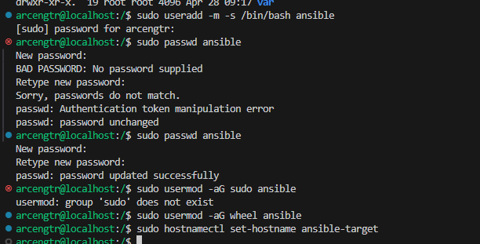

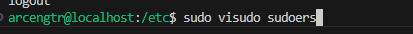

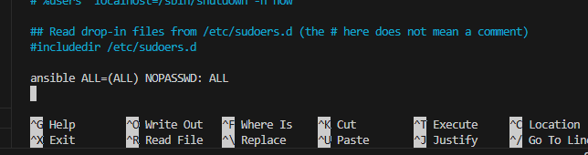

Na maszynie głownej zainstalowano ansible

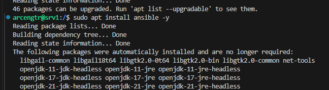

Także zgenerowano i wymieniono klucze ssh

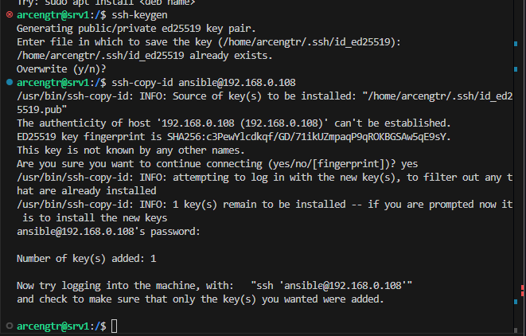

Ustawione odpowiednie nazwy hostów

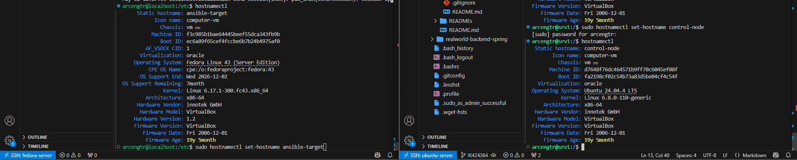

Zmieniony plik /etc/hosts

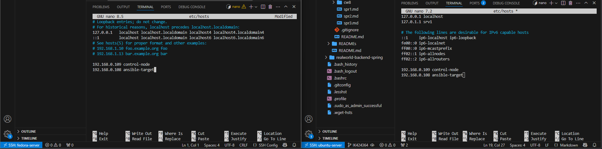

Na maszynie gownej utowrzony ansible.cfg (ustawiona opcja do omijania Host Key Checking)

```
[defaults]
host_key_checking = False
inventory = inventory.ini
```

I inventory.ini

```
[orchestrators]
control-node ansible_connection=local

[endpoints]
ansible-target ansible_user=ansible
```

Po tym 

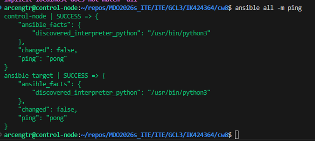

```
---
- name: Przygotowanie systemów
  hosts: endpoints
  become: yes
  tasks:
    - name: Testowanie łączności
      ping:

    - name: Plik inventory.ini
      copy:
        src: ./inventory.ini
        dest: /home/ansible/inventory_backup.ini
        owner: ansible
        mode: '0644'

    - name: Aktualizacja pakietów (Ubuntu)
      apt:
        update_cache: yes
        upgrade: dist
      when: ansible_os_family == "Debian"

    - name: Aktualizacja pakietów (Fedora)
      shell: "dnf upgrade -y"
      when: ansible_os_family == "RedHat"
      become: yes

    - name: Restart serwisów
      service:
        name: "{{ item }}"
        state: restarted
      loop:
        - sshd
      ignore_errors: yes
```

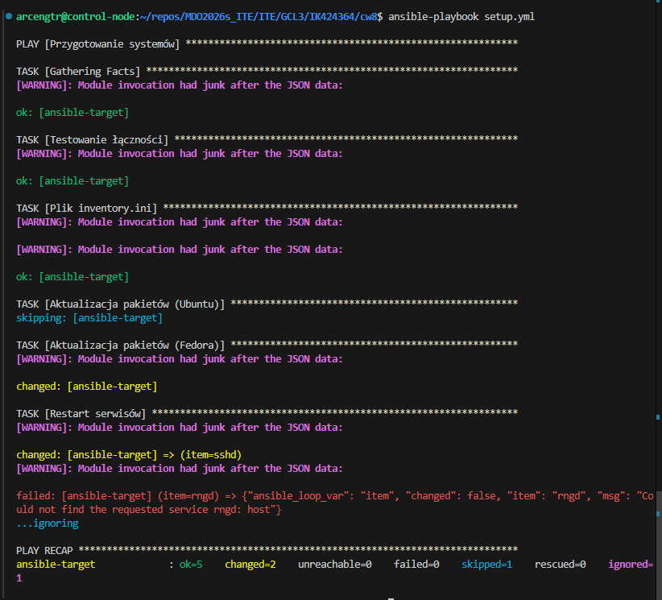

Do deployu stworzona odpowidnia rola w ansible-galaxy

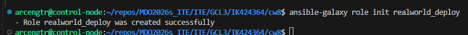

Został stworzony plik z instrukcjami do buildu oraz deployu aplikacji z poprzednich zajęć

```
---
- name: Sanity Check
  shell: df -h / | tail -1 | awk '{print $4}'
  register: disk_space
  ignore_errors: yes

- name: Instalacja Docker
  shell: "dnf install -y docker python3-docker"
  become: yes

- name: Włączenie Dockera
  service:
    name: docker
    state: started
    enabled: yes
  become: yes

- name: Kopia pliku binarnego
  copy:
    src: files/realworld-app.jar
    dest: /opt/realworld-app.jar
    mode: '0755'

- name: Dockerfile dla JAR
  copy:
    dest: /opt/Dockerfile
    content: |
      FROM eclipse-temurin:25-jre-noble
      COPY realworld-app.jar /app.jar
      ENTRYPOINT ["java", "-jar", "/app.jar"]

- name: Build image z JAR
  shell: "docker build -t realworld-from-jar /opt"
  become: yes

- name: Kontener docker
  shell: |
    docker stop realworld-final || true
    docker rm realworld-final || true
    docker run -d --name realworld-final -p 8081:8080 realworld-from-jar
  become: yes

- name: Health Check
  uri:
    url: "http://localhost:8081/api/tags"
    status_code: 200
  register: result
  until: result.status == 200
  retries: 5
  delay: 10
  ```

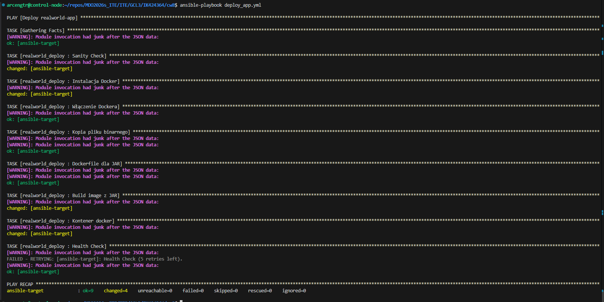

Używaliśmy modułów shell zamiast natywnych modułów dnf i docker poprzez niekompatybilnością bieżących bibliotek Ansible z eksperymentalną wersją Python 3.14 na maszynie docelowej z systemem Fedora 43. Pozwoliło to na pomyślne zakończenie deploymentu poprzez wyeliminowanie błędów segmentacji oraz niezgodności interfejsów API

----------

Po zainstalowaniu Fedora 44 netinst i ustawieniu połączenia przez ssh skopiowałem plik anaconda-ks.cfg

```
scp root@192.168.0.73:/root/anaconda-ks.cfg ./anaconda-ks.cfg
```

```
# Generated by Anaconda 44.30
# Keyboard layouts
keyboard --vckeymap=us --xlayouts='us'
# System language
lang en_US.UTF-8

%packages
@^custom-environment

%end

# Run the Setup Agent on first boot
firstboot --enable

# Generated using Blivet version 3.13.2
ignoredisk --only-use=sda
autopart
# Partition clearing information
clearpart --none --initlabel

# System timezone
timezone Europe/Warsaw --utc

# Root password
rootpw --iscrypted --allow-ssh $y$j9T$6fmHtSKRQZ6gRPa3w/PhuKk4$CQH79i2PRYUuoyPoe.rhEoZJ2KLCPUyZuwn4UuobCyA
```

Zmieniony plik:

```
# Generated by Anaconda 44.30
# Keyboard layouts
keyboard --vckeymap=us --xlayouts='us'
# System language
lang en_US.UTF-8

# Repozytoria dla Fedory 44
url --mirrorlist=http://mirrors.fedoraproject.org/mirrorlist?repo=fedora-44&arch=x86_64
repo --name=updates --mirrorlist=http://mirrors.fedoraproject.org/mirrorlist?repo=updates-released-f44&arch=x86_64

text
skipx
firstboot --disable
reboot

ignoredisk --only-use=sda
clearpart --all --initlabel
autopart --type=plain

# System timezone
timezone Europe/Warsaw --utc

# Root password
rootpw --iscrypted --allow-ssh $y$j9T$6fmHtSKRQZ6gRPa3w/PhuKk4$CQH79i2PRYUuoyPoe.rhEoZJ2KLCPUyZuwn4UuobCyA

# Sekcja pakietów - dodany Docker i Tar
%packages
@core
wget
curl
tar
moby-engine
docker-compose
%end

# Sekcja Post-installation
%post --log=/root/kickstart-post.log

mkdir -p /opt/java25
wget -O /tmp/openjdk25.tar.gz "https://github.com/adoptium/temurin25-binaries/releases/download/jdk-25%2B0-ea/OpenJDK25-jdk_x64_linux_hotspot_25_0-ea.tar.gz"

tar -xzf /tmp/openjdk25.tar.gz -C /opt/java25 --strip-components=1
rm -f /tmp/openjdk25.tar.gz

ln -sf /opt/java25/bin/java /usr/bin/java

systemctl enable docker

mkdir -p /usr/local/bin/moja-aplikacja

wget -O /usr/local/bin/moja-aplikacja/app.jar "https://github.com/ArcenGTR/ArcenGTR/releases/download/1/realworld-app.jar"

cat << 'EOF' > /usr/local/bin/moja-aplikacja/run.sh
#!/bin/bash
sleep 5
exec /opt/java25/bin/java -jar /usr/local/bin/moja-aplikacja/app.jar
EOF

chmod +x /usr/local/bin/moja-aplikacja/run.sh

cat > /etc/systemd/system/moja-java-app.service << 'EOF'
[Unit]
Description=Aplikacja Java z GitHub Releases
After=network-online.target
Wants=network-online.target

[Service]
Type=simple
Restart=always
RestartSec=10
ExecStart=/usr/local/bin/moja-aplikacja/run.sh
User=root

[Install]
WantedBy=multi-user.target
EOF

systemctl daemon-reload
systemctl enable moja-java-app.service

%end
```

Po wczytaniu pliku 

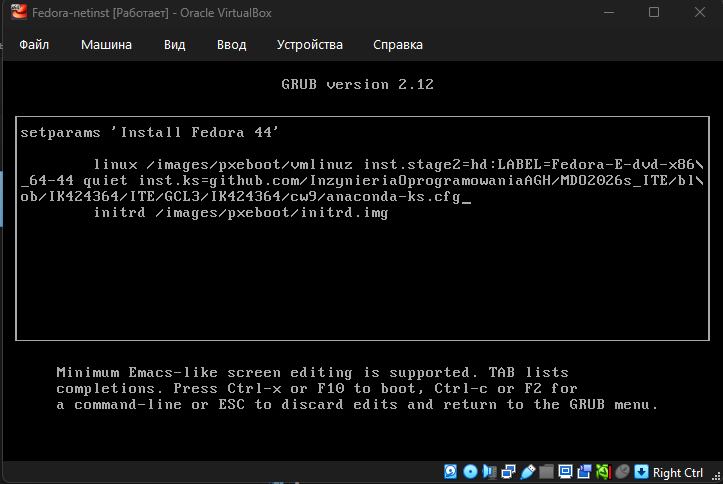

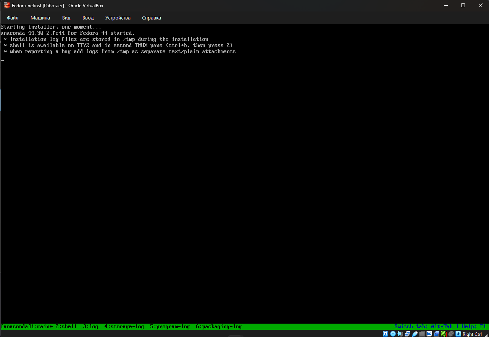

System zainstalował się samodzielnie


---

Lab 10

Instaluję Minikube i definuję alias

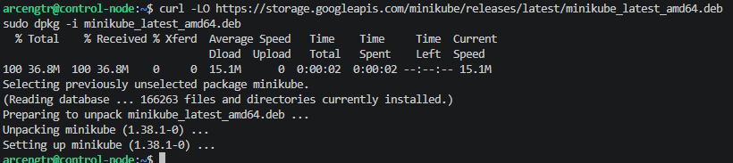

```
echo 'alias minikubctl="minikube kubectl --"' >> ~/.bashrc
```

Uruchomiłem kubernetes komendą:

```
minikube start
```

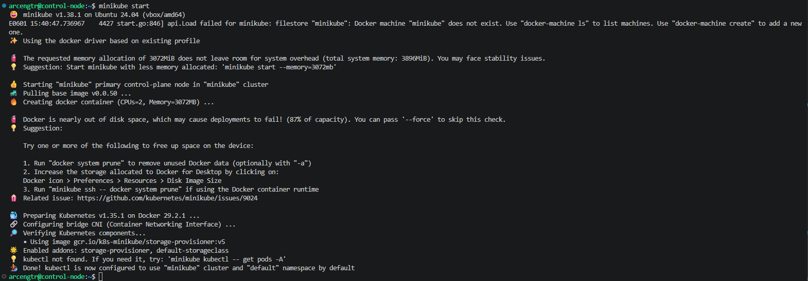


Uruchomiłem dasboard komendą:

```
minikube dashboard
```

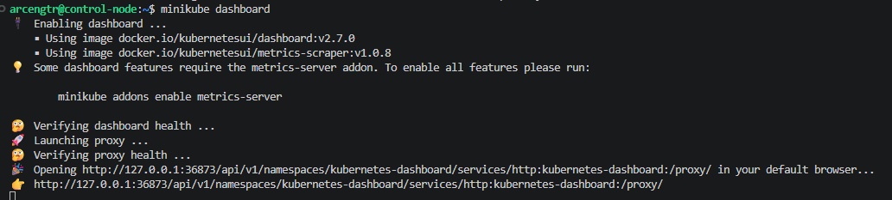

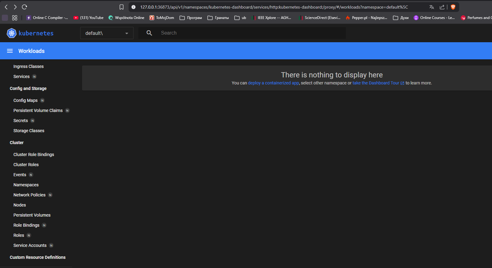

Napisany manifest deploymentu

```
apiVersion: apps/v1
kind: Deployment
metadata:
  name: realworld-deployment
  labels:
    app: realworld
spec:
  replicas: 2
  selector:
    matchLabels:
      app: realworld
  template:
    metadata:
      labels:
        app: realworld
    spec:
      containers:
      - name: realworld-container
        image: realworld-app:latest
        imagePullPolicy: Never # Zla wykorzystywania lokalnego obrazu
        ports:
        - containerPort: 8080
        env:
        - name: SERVER_ADDRESS
          value: "0.0.0.0"
        - name: SERVER_PORT
          value: "8080"
---
apiVersion: v1
kind: Service
metadata:
  name: realworld-service
spec:
  selector:
    app: realworld
  ports:
    - protocol: TCP
      port: 8080
      targetPort: 8080
  type: ClusterIP
```

Przed zastosowaniem manifest wczytałem obraz programu do minikube

```
minikube image load realworld-app:latest
```

A potem zastosowaem go przy pomocy

```
minikubctl apply -f deployment.yaml
```

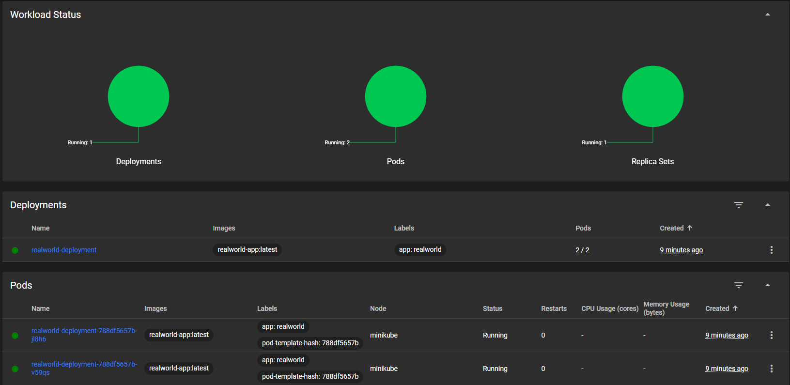

Włączyłem portforwarding dla sprawdzenia działania aplikacji

```
minikubctl port-forward service/realworld-service 8081:8080
```

Chociaż curl komenda nie działa poprawnie i zwraca błąd 401

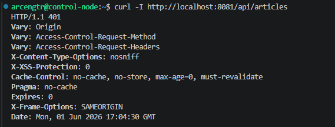

Ale przeglądarka działa poprawnie

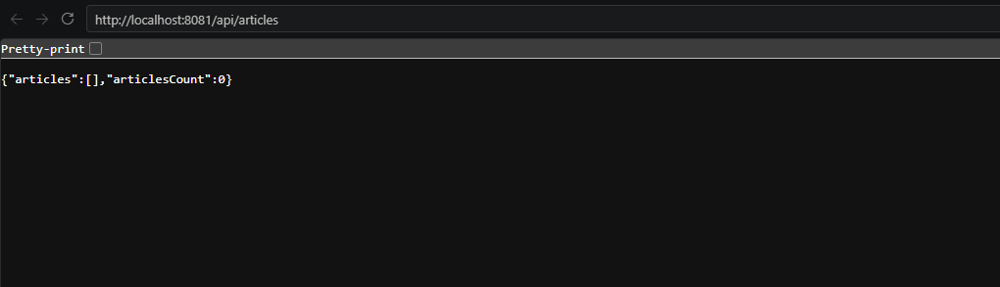

Utworzyłem plik do deployentu nginx

```
apiVersion: apps/v1
kind: Deployment
metadata:
  name: nginx-deployment
  labels:
    app: nginx
spec:
  replicas: 1
  selector:
    matchLabels:
      app: nginx
  template:
    metadata:
      labels:
        app: nginx
    spec:
      containers:
        - name: nginx
          image: nginx:latest
          ports:
            - containerPort: 80
```

I zastosowałem go

```
minikubctl apply -f nginx-deployment.yaml
```

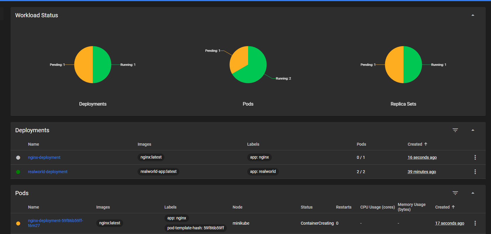

Oraz eksponuję wdrożenie jako serwis i przekierowuję port

```
minikubctl port-forward service/nginx-deployment 8080:80
minikubctl expose deployment nginx-deployment --type=NodePort --port=80
```

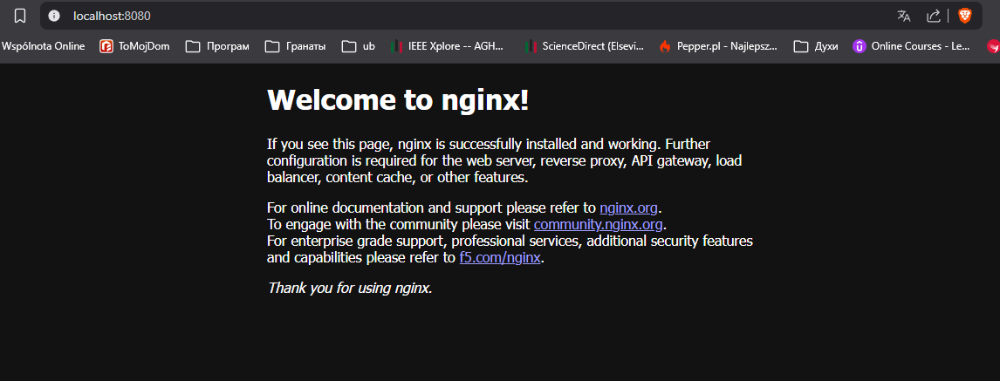

Buduję i wgrywam 2 wersję aplikacji zarówno z niedziałającą

```
docker build -t realworld-app:v1 .
minikube image load realworld-app:v1

docker build -t realworld-app:v2 .
minikube image load realworld-app:v2

docker build -f Dockerfile.broken -t realworld-app:broken .
minikube image load realworld-app:broken
```

Zamieniłem wersję na v1 z 2 replikami

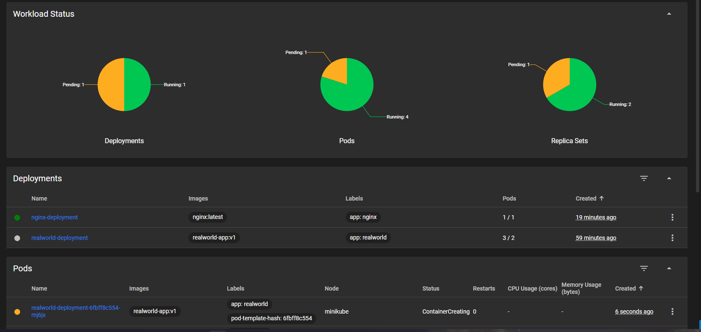

Zamieniłem wersję na v2 z 6 replikami

```
minikubctl set image deployment/realworld-deployment realworld-container=realworld-app:v2
```

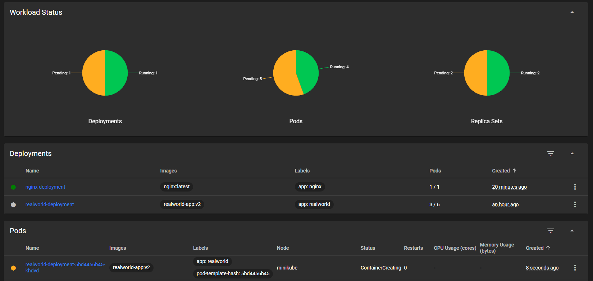

I na niedziałającą z 4 replikami

```
minikubctl set image deployment/realworld-deployment realworld-container=realworld-app:broken
```

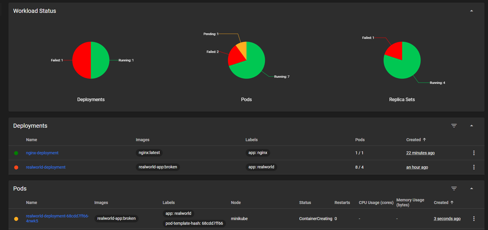

Oraz przywróciłem deployment do poprzedniej wersji

```
minikubctl rollout undo deployment/realworld-deployment
```

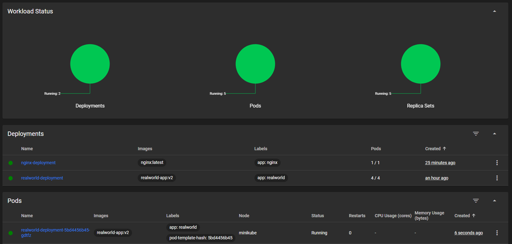

---

Lab 11

Najpierw zmieniłem plik manifestu: 

```
apiVersion: apps/v1
kind: Deployment
metadata:
  name: nginx-deployment
  labels:
    app: nginx
spec:
  replicas: 8
  selector:
    matchLabels:
      app: nginx
  template:
    metadata:
      labels:
        app: nginx
    spec:
      containers:
        - name: nginx
          image: nginx:latest
          ports:
            - containerPort: 80
---
apiVersion: v1
kind: Service
metadata:
  name: web-server-svc-yaml
spec:
  selector:
    app: nginx
  ports:
    - protocol: TCP
      port: 80
      targetPort: 80
  type: ClusterIP
```

I zastosowałem go

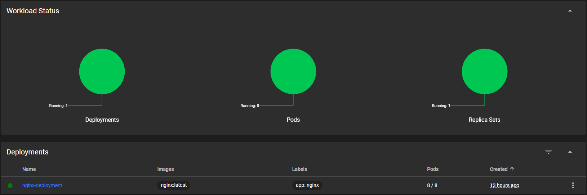

Najpierw włączyłem port-forwarding do podu

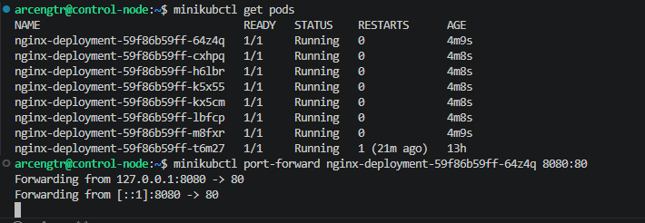

Do deploymentu

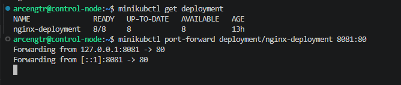

Do serwisu

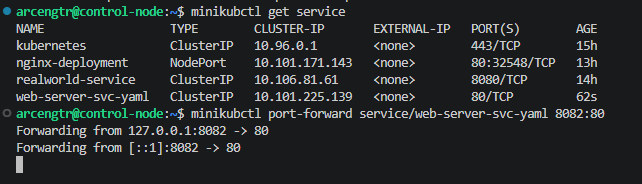

Przeskalowałem ilość podów do 2 za pomocą komendy

```
minikubctl scale deployment/nginx-deployment --replicas=2
```

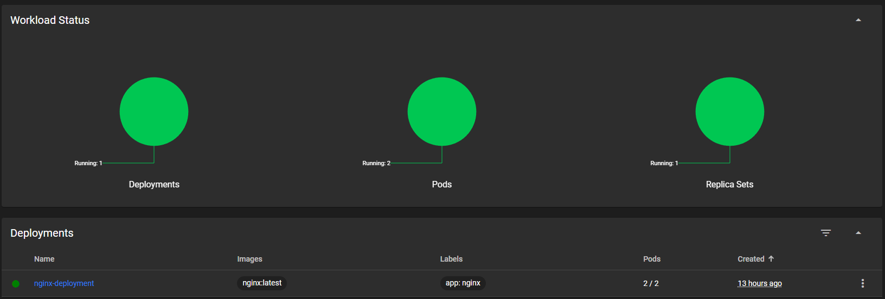

* Pod z port-forwardingu po przeskalowaniu w dół nadal działa, ale mógł by być usunięty
* Port-forwarding do deploymentu też działa, ale sytuacja jest podobna do sytuacji z podóm
* Servis działa poprawnie i udostępnia dostęp do podów dynamicznie

I potem przeskalowałem ilość podów do 16 już zmieniając liczbę replik w manifeście

* Nic ni miało się stać i się nie stało, we wszystkich 3 przypadkach dostęp do podów nadal istnieje

Używanie komendy pozwala na szybką i nietrwałą zmianę ilości podów, kiedy zmiana w pliku pozwala na trwałą zmianę


