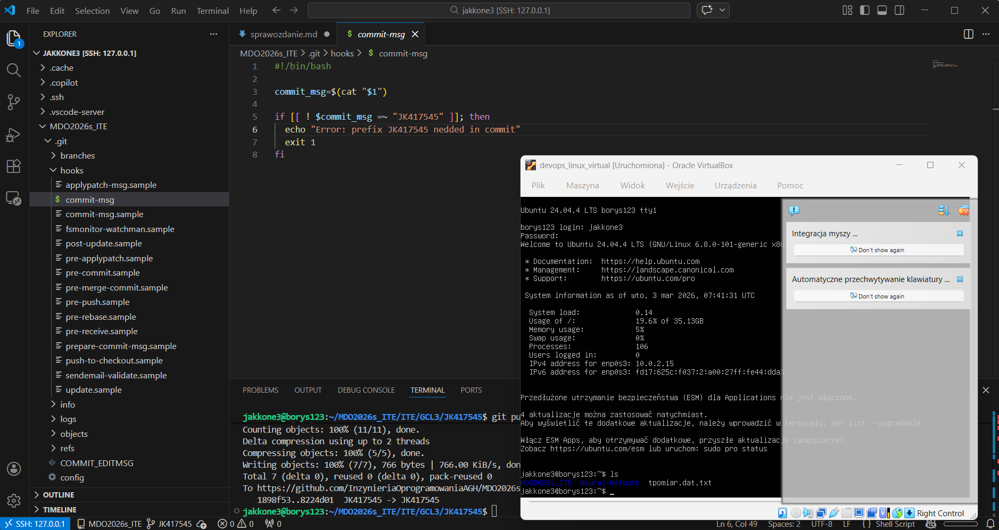
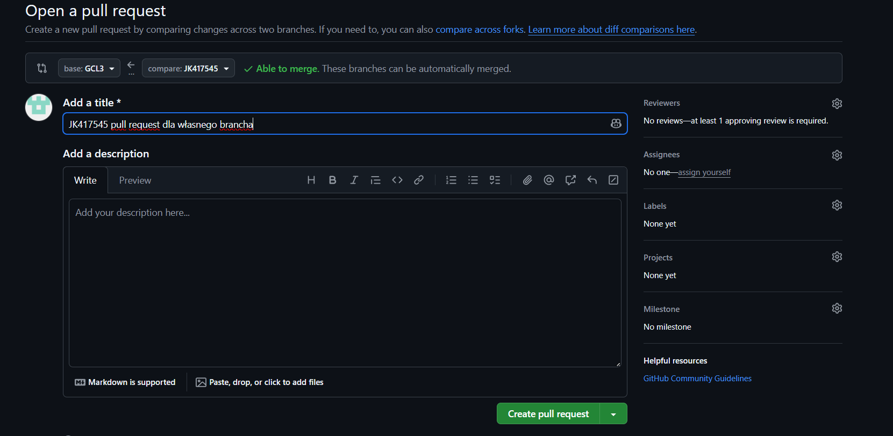

# Sprawozdanie lab1 03.03.2026

Na 1 zajęcia przygotowano maszynę wirtualną w środowisku VirtualBox z systemem Ubuntu Server:
RAM - 4GB
Dysk - 36GB

Utworzono gałąź roboczą komendą
git checkout -b JK417545
 
Na platformie GitHub utworzono Pull Request z gałęzi osobistej do gałęzi grupowej.

Skrypt commit-msg:

```bash
#!/bin/bash

commit_msg=$(cat "$1")

if [[ ! $commit_msg =~ "JK417545" ]]; then
  echo "Error: prefix JK417545 nedded in commit"
  exit 1
fi
```
Skrypt zostal skopiowany do lokalnego katalogu git/hooks/ i nadano mu uprawnienia execute

### Screeny




