## Laboratorium 10

### Przygotowanie

#### 1: Pobranie i instalacja minikube i kubectl

```bash
curl -LO https://github.com/kubernetes/minikube/releases/latest/download/minikube-linux-amd64
sudo install minikube-linux-amd64 /usr/local/bin/minikube && rm minikube-linux-amd64

curl -LO "https://dl.k8s.io/release/$(curl -L -s https://dl.k8s.io/release/stable.txt)/bin/linux/amd64/kubectl"
sudo install -m 0755 kubectl /usr/local/bin/kubectl && rm kubectl
```

#### 2: Alias
dodano alias do .bashrc
```bash
alias minikubctl="kubectl"
```

#### 3: Uruchomienie minicube

```bash
minikube start --driver=docker
```


Dzialający kontener/worker

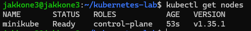

#### 4: Dashboard

```bash
minikube dashboard
``` 

Żeby polączyć się z dashboardem, z racji tego że VM ma NAT z port forwardingiem zastosowano tunelowanie żeby wystawić dashboard dla hosta
```bash
ssh -N -L 45089:127.0.0.1:45089 jakkone3@127.0.0.1 -p 2222
```

```bash
kubectl create deployment test-nginx --image=nginx:alpine
deployment.apps/test-nginx created

kubectl scale deployment test-nginx --replicas=2
deployment.apps/test-nginx scaled
```

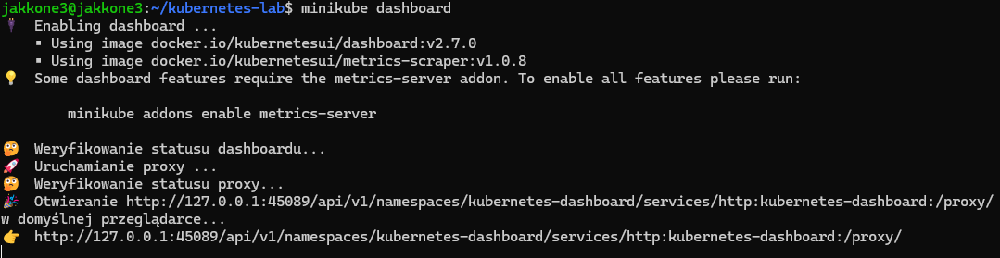
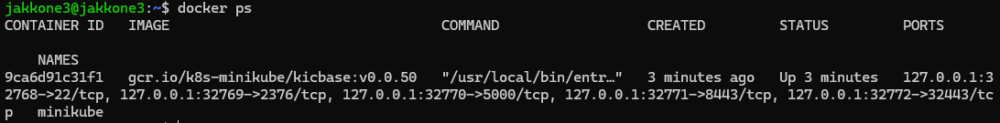
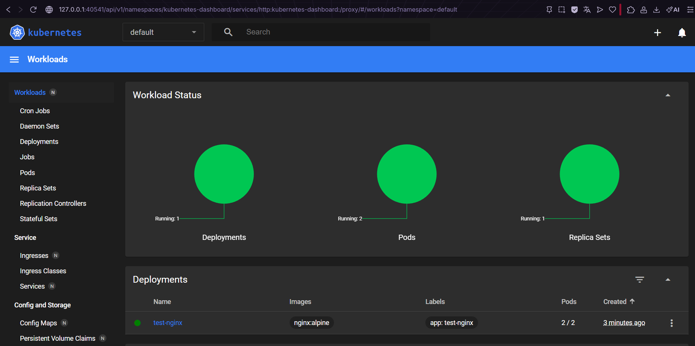
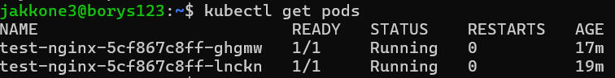


### Analiza posiadanego kontenera

#### 1. Zbudowano obraz url-shortenera
Przetestowano czy obraz działa poprawnie, wystawia interface sieciowy i nie wyłącza się od razu po uruchomieniu.

Skorzystano z pliku Dockerfile.runtime zmienionego na potrzeby laboratorium z ansible
```bash
docker build -t url-shortener-deploy -f ansible_files/Dockerfile.runtime .
docker-compose -f docker-compose.deploy.yml up -d
```

#### 2. Wyniki


### Uruchamianie oprogramowania
#### 1. Uruchomienie podu

- Problem: obraz url-shortnenera nie jest wrzucony do sieci więc kubernetes nie może go znaleźć
- Rozwiązanie: przełączenie kontekstu dockera na minikube i zbudowanie obrazu bezpośrednio w minikube

```bash
eval $(minikube docker-env)
docker build -t url-shortener-deploy -f ansible_files/Dockerfile.runtime .
```

Uruchomienie podu
```bash
kubectl run url-shortener-pod --image=url-shortener-deploy --port=3000 --labels app=url-shortener-pod --image-pull-policy=Never
```


#### 2. Wyprowadzenie portu

```bash
kubectl port-forward pod/url-shortener-pod 3000:3000
```

Przetestowanie czy interface sieciowy został wystawiony poprawnie
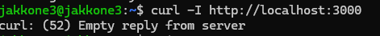
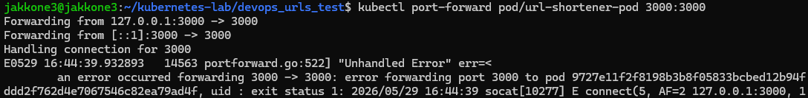
Kubernetes przekazał ruch do podu. Url-shortener został uruchomiony bez bazy danych więc proces główny wyrzucił błąd i się wyłączył ale nie jest to problemem ponieważ chcieliśmy przetestować tylkoczy port forwarding działa poprawnie.

Sprzątanie
```bash
kubectl delete pod url-shortener-pod
```

### Przekucie wdrożenia manualnego w plik wdrożenia

#### 1. Stworzenie pliku yaml

```yaml
apiVersion: apps/v1
kind: Deployment
metadata:
  name: nginx-deployment
  labels:
    app: nginx
spec:
  replicas: 4
  selector:
    matchLabels:
      app: nginx
  template:
    metadata:
      labels:
        app: nginx
    spec:
      containers:
      - name: nginx
        image: nginx:alpine
        ports:
        - containerPort: 80
```

#### 2. Uruchomienie wdrożenia

```bash
kubectl apply -f nginx-deployment.yaml
```

#### 3. Testowanie czy wdrożenie działa poprawnie
```bash
kubectl rollout status deployment/nginx-deployment
```

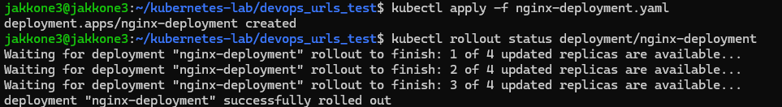
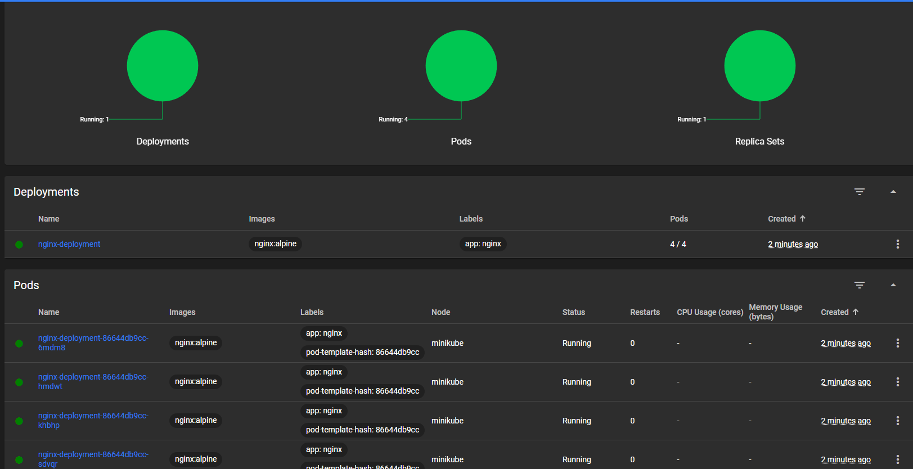

#### 4. Wyeksportowanie jako serwis

```bash
kubectl expose deployment nginx-deployment --type=LoadBalancer --port=80
kubectl port-forward service/nginx-deployment 8080:80
```
Test
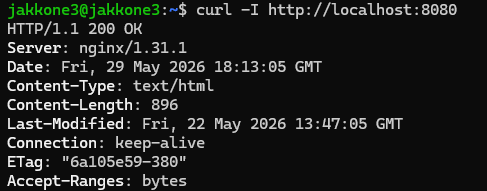

Sprzątanie
```bash
kubectl delete service nginx-deployment
kubectl delete deployment nginx-deployment
```

### Przygotowanie nowego obrazu

#### 1. Przygotowanie 1 wersji aplikacji

```bash
docker build -t url-shortener-deploy:v1 -f ansible_files/Dockerfile.runtime .
```
#### 2. Przygotowanie 2 wersji aplikacji
```bash
docker run -d --name temp-container url-shortener-deploy:v1
docker exec temp-container touch /app/version_2_marker
docker commit temp-container url-shortener-deploy:v2
docker rm -f temp-container
```

#### 3. Przygotowanie wadliwej wersji aplikacji
```bash 
docker run --name temp-bad url-shortener-deploy:v1 true
docker commit --change='CMD ["adawwwwwwdwdwdw"]' temp-bad url-shortener-deploy:bad
docker rm temp-bad
```
#### 4. Weryfikacja
```bash
docker images | grep url-shortener-deploy
```
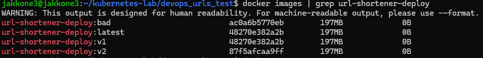

### Zmiany w deploymencie

#### 1. stworzenie pliku produkcji

```yaml
apiVersion: apps/v1
kind: Deployment
metadata:
  name: mongo-deployment
spec:
  replicas: 1
  selector:
    matchLabels:
      app: mongo
  template:
    metadata:
      labels:
        app: mongo
    spec:
      containers:
      - name: mongo
        image: mongo:4.2.1
        ports:
        - containerPort: 27017
---
apiVersion: v1
kind: Service
metadata:
  name: mongo
spec:
  ports:
  - port: 27017
  selector:
    app: mongo
---
apiVersion: apps/v1
kind: Deployment
metadata:
  name: url-shortener-deployment
spec:
  replicas: 4
  selector:
    matchLabels:
      app: url-shortener
  template:
    metadata:
      labels:
        app: url-shortener
    spec:
      containers:
      - name: url-shortener
        image: url-shortener-deploy:v1
        imagePullPolicy: Never
        ports:
        - containerPort: 3000
        env:
        - name: MONGO_URI
          value: "mongodb://mongo:27017/urlshortener"
```
#### 2. Pierwsze uruchomienie
```bash
kubectl apply -f app-deployment.yaml
kubectl rollout status deployment/url-shortener-deployment
```

Weryfikacja

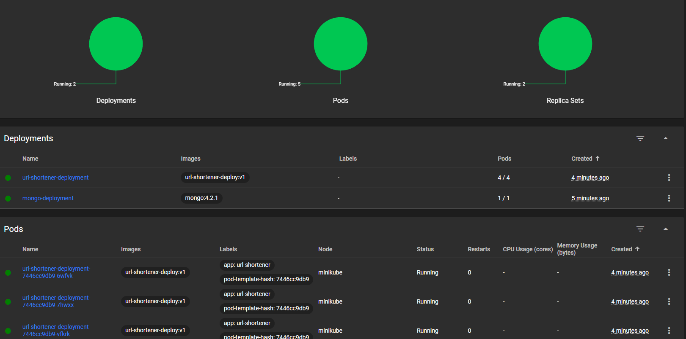

#### 3. Zmiana liczby replik/wersji

Zmianie ulegała linijka 
```yaml
apiVersion: apps/v1
kind: Deployment
metadata:
  name: url-shortener-deployment
spec:
#  Zmiania replicas na 8,1,0
  replicas: 4
  selector:
    matchLabels:
      app: url-shortener
  template:
    metadata:
      labels:
        app: url-shortener
    spec:
      containers:
      - name: url-shortener
      #  Zmiania image na :v2, :bad
        image: url-shortener-deploy:v1
```

8 replik


1 replika
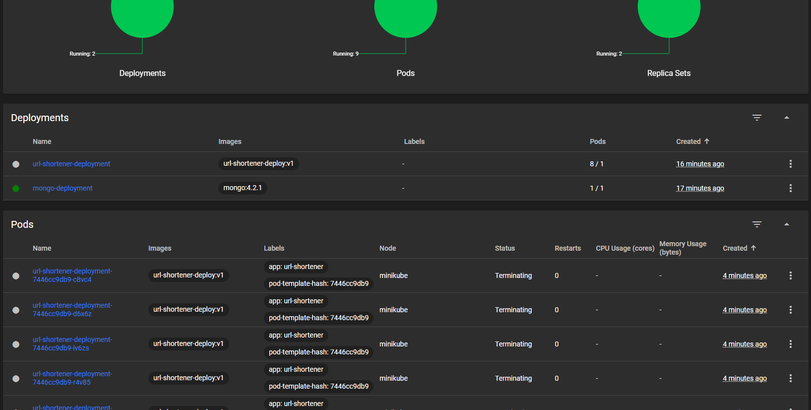

0 replik


4 repliki 2v
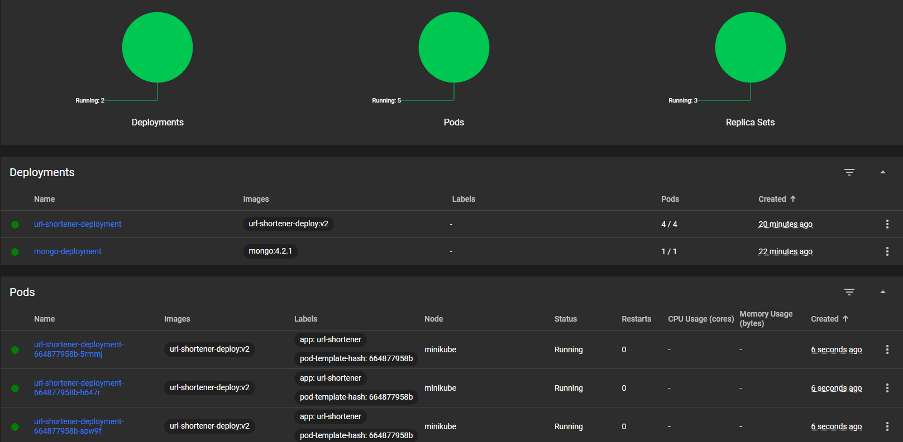

4 repliki bad
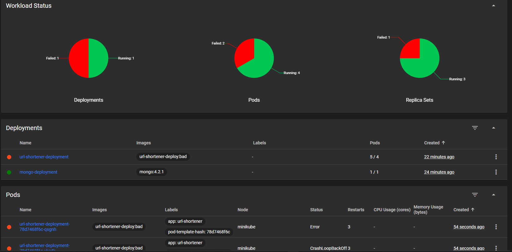

#### 4. Rollback

```bash
kubectl rollout history deployment/url-shortener-deployment
kubectl rollout undo deployment/url-shortener-deployment
```

Weryfikacja

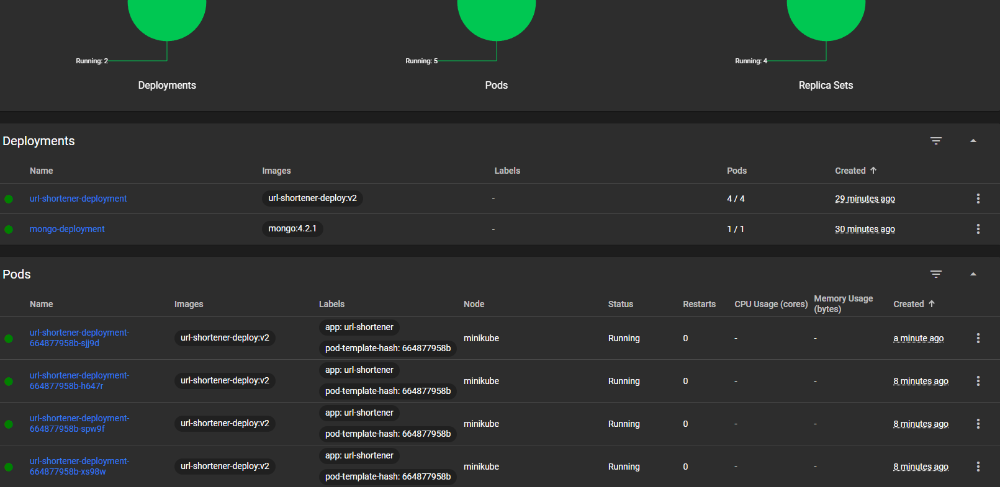

### Kontrola wdrożenia

#### 1. Historia wdrożeń

- 1. Pierwsze wdrożenie aplikacji, Wszystkie 4 repliki uzyskały status Running
- 2. Zmiana liczby replik na 8, Wszystkie 8 replik uzyskało status Running
- 3. Zmiana liczby replik na 1, Jedna replika ze statusem running
- 4. Zmiana liczby replik na 0, Brak replik
- 5. Zmiana obrazu na v2, Wszystkie 4 repliki uzyskały status Running
- 6. Zmiana obrazu na bad, Wstały tylko 2 repliki wersji bad ze statusem Error, pozostałe 3 nie zmieniły wersji i mają status Running. Finalnie przy zadeklarowaniu 4 replik aktywnych było 5
- 7. Rollback do punktu 5, wersja v2 i 4 repliki ze statusem running

Wniosek
Bezpieczeństwo w kubernetesie: 
W konfiguracji istnieją dwa domyślne parametry bezpieczeństwa:

maxSurge (domyślnie 25%): Określa, o ile maksymalnie k8s może stworzyć podów ponad limit w  trakcie aktualizacji.
maxUnavailable (domyślnie 25%): Określa, ile podów z puli produkcyjnej może być niedostępnych w trakcie operacji.

#### 2. Skrypt
```bash
#!/bin/bash

DEPLOYMENT_NAME="url-shortener-deployment"
TIMEOUT=60
INTERVAL=5
ELAPSED=0

echo "Deployment verification..."

while [ $ELAPSED -lt $TIMEOUT ]; do
    if kubectl rollout status deployment/$DEPLOYMENT_NAME --timeout=2s > /dev/null 2>&1; then
        echo "Successs"
        exit 0
    fi

    echo "Waiting $INTERVAL sec..."
    sleep $INTERVAL
    ELAPSED=$((ELAPSED + INTERVAL))
done

echo "Failure"

kubectl get pods -l app=url-shortener
exit 1
```

### Strategie wdrożenia
#### 1. Wdrożenie typu Rolling Update

Przedstawione we wcześniejszym kroku, w trakcie wdrożenia z tymi parametrami niedostępne mogą być 2 pody i możliwy jest 1 pod ponad limit

```yaml
spec:
  replicas: 4
  strategy:
    type: RollingUpdate
    rollingUpdate:
      maxUnavailable: 2
      maxSurge: 1
  selector:
    matchLabels:
      app: url-shortener
  template:
    metadata:
      labels:
        app: url-shortener
    spec:
      containers:
      - name: url-shortener
        image: url-shortener-deploy:v1
```

#### 2. Wdrożenie typu Recreate

Kubernetes najpierw całkowicie zabija wszystkie działające Pody v1, powodując chwilowy brak dostępności usługi, a dopiero gdy stare Pody znikną, zaczyna tworzyć nowe v2

```yaml
spec:
  replicas: 4
  strategy:
    type: Recreate
  selector:
    matchLabels:
      app: url-shortener
  template:
    metadata:
      labels:
        app: url-shortener
    spec:
      containers:
      - name: url-shortener
        image: url-shortener-deploy:v1
```
#### 3. Wdrożenie typu Canary Deployment

Nie zmieniamy obecnego wdrożenia. Zamiast tego tworzymy zupełnie nowy, mały Deployment  z wersją v2, nadajemy mu tę samą etykietę główną, którą nasłuchuje nasz Serwis. W ten sposób Serwis automatycznie zacznie kierować część ruchu do nowego kanarka.

Plik wdrożenia dla Kanarka
```yaml
apiVersion: apps/v1
kind: Deployment
metadata:
  name: url-shortener-canary
spec:
  replicas: 1
  selector:
    matchLabels:
      app: url-shortener
  template:
    metadata:
      labels:
        app: url-shortener
        track: canary
    spec:
      containers:
      - name: url-shortener
        image: url-shortener-deploy:v2
        imagePullPolicy: Never
        ports:
        - containerPort: 3000
        env:
        - name: MONGO_URI
          value: "mongodb://mongo:27017/urlshortener"
```


### Wnioski laboratorium 10

- Zamiast ręcznego uruchamiania i konfigurowania pojedynczych kontenerów za pomocą poleceń konsolowych, zastosowanie plików konfiguracyjnych YAML  pozwala na pełną automatyzację.

- Bezpieczeństwo i stabilność: Wprowadzenie uszkodzonego obrazu nie doprowadziło do downtime usługi, kubernetes automatycznie wstrzymał wdrożenie wadliwych podów, pozostawiając ruch użytkowników na sprawnych replikach.

- Rollback: kubectl rollout history oraz kubectl rollout undo pozwalają na bezproblemowe przywrócenie stabilnej wersji aplikacji minimalizując czas niedostępności usługi.
