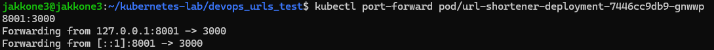

## Laboratorium 11

### Eksponowanie
wdrozenie yaml
```yaml
apiVersion: apps/v1
kind: Deployment
metadata:
  name: mongo-deployment
spec:
  replicas: 1
  selector:
    matchLabels:
      app: mongo
  template:
    metadata:
      labels:
        app: mongo
    spec:
      containers:
      - name: mongo
        image: mongo:4.2.1
        ports:
        - containerPort: 27017
---
apiVersion: v1
kind: Service
metadata:
  name: mongo
spec:
  ports:
  - port: 27017
  selector:
    app: mongo
---
apiVersion: apps/v1
kind: Deployment
metadata:
  name: url-shortener-deployment
spec:
  replicas: 36
  selector:
    matchLabels:
      app: url-shortener
  template:
    metadata:
      labels:
        app: url-shortener
    spec:
      containers:
      - name: url-shortener
        image: url-shortener-deploy:v1
        imagePullPolicy: Never
        ports:
        - containerPort: 3000
        env:
        - name: MONGO_URI
          value: "mongodb://mongo:27017/urlshortener"
```

#### 1. Wyeksponowania do 1 poda
```bash
kubectl port-forward pod/url-shortener-deployment-7446cc9db9-gnwwp 8001:3000
```


#### 2. Wyeksponowania do wszystkich podów
```bash
kubectl port-forward deployment/url-shortener-deployment 8002:3000
```
#### 3.
```bash
kubectl expose deployment url-shortener-deployment --type=NodePort --name=url-service-manual --port=3000
kubectl port-forward service/url-service-manual 8003:3000
```

#### 4. yaml

posprzatanie

```bash
kubectl delete service url-service-manual
```
```yaml
apiVersion: v1
kind: Service
metadata:
  name: url-service-yaml
spec:
  type: NodePort
  ports:
  - port: 3000
    targetPort: 3000
    nodePort: 32000
  selector:
    app: url-shortener
```
```bash
kubectl apply -f service-deployment.yaml
```

### Skalowanie

#### 1.
```bash
kubectl scale deployment url-shortener-deployment --replicas=5
```

#### 2. yaml
przekopiowanie pliku yaml
```bash
cp shortener-deployment.yaml scaled-deployment.yaml
```

podmiana replicas z 36 na 15
```bash
kubectl apply -f scaled-deployment.yaml
```

### Test działania
```bash
kubectl port-forward deployment/url-shortener-deployment 3000:3000 --address 0.0.0.0
```

### Logi
```bash
kubectl logs -l app=nginx-logger --prefix=true | grep "HEAD /"
```

### Sprzątanie
```bash
kubectl delete -f scaled-deployment.yaml
kubectl delete service url-service-yaml --ignore-not-found=true
kubectl delete -f nginx-test.yaml
minikube stop
```


### Wnioski laboratorium 11


