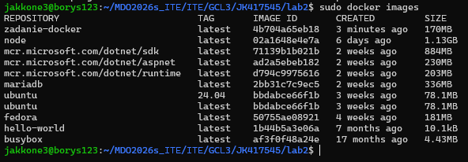
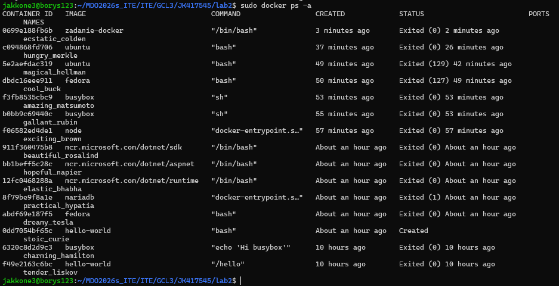
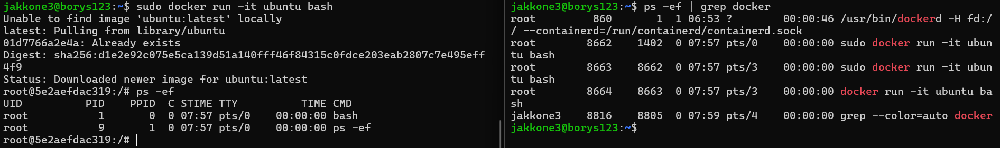
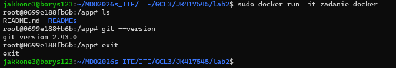
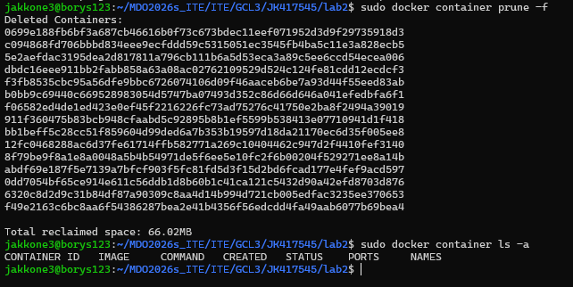

## Lab2

Na maszynie wirtualnej zainstalowano Dockera:

```bash
sudo apt update
sudo apt install docker.io
```

Pobrano i uruchomiono obrazy, sprawdzono kody wyjścia i ich rozmiary

```bash
sudo docker pull ubuntu
sudo docker run hello-world
sudo docker images
sudo docker ps -a
```




Uruchomiono kontener ubuntu w trybie interaktywnym

```bash
sudo docker run -it ubuntu bash
```



Stworzono plik dockerfile i przetestowano jego działanie

```bash
sudo docker build -t zadanie-docker .
sudo docker run -it zadanie docker
```

```dockerfile
FROM ubuntu:24.04

ENV DEBIAN_FRONTEND=noninteractive

RUN apt-get update && apt-get install -y \
    git \
    && rm -rf /var/lib/apt/lists/*

WORKDIR /app

RUN git clone https://github.com/InzynieriaOprogramowaniaAGH/MDO2026s_ITE.git .

CMD ["/bin/bash"]
```



Na koniec wyczyszczono środowisko
```bash
sudo docker prune -f
sudo docker rmi zadanie-docker
```

