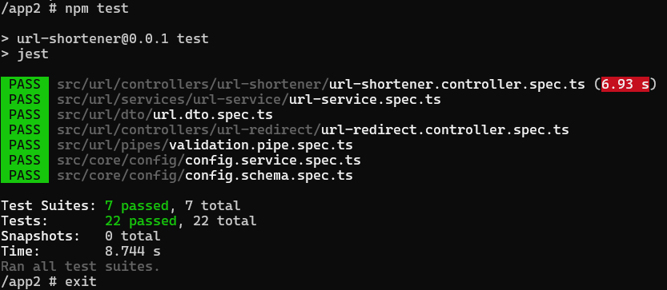
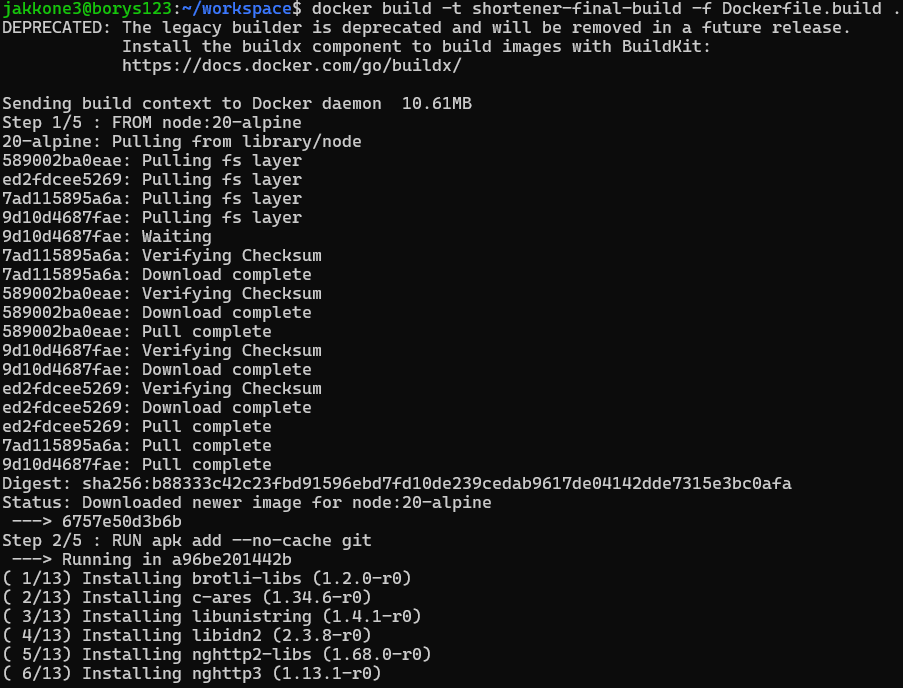
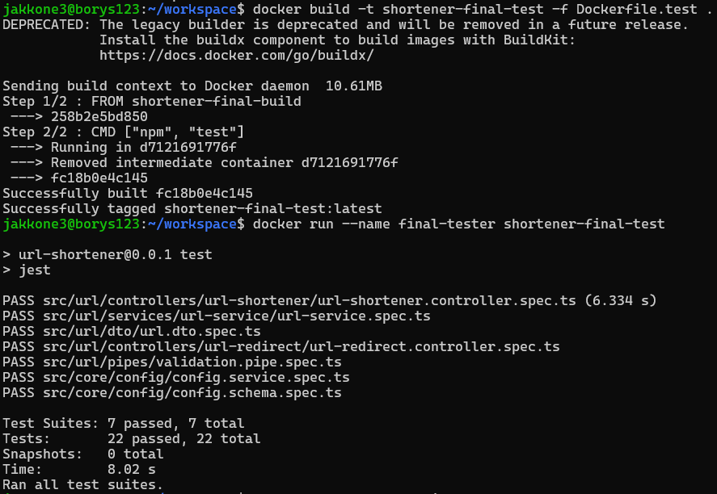
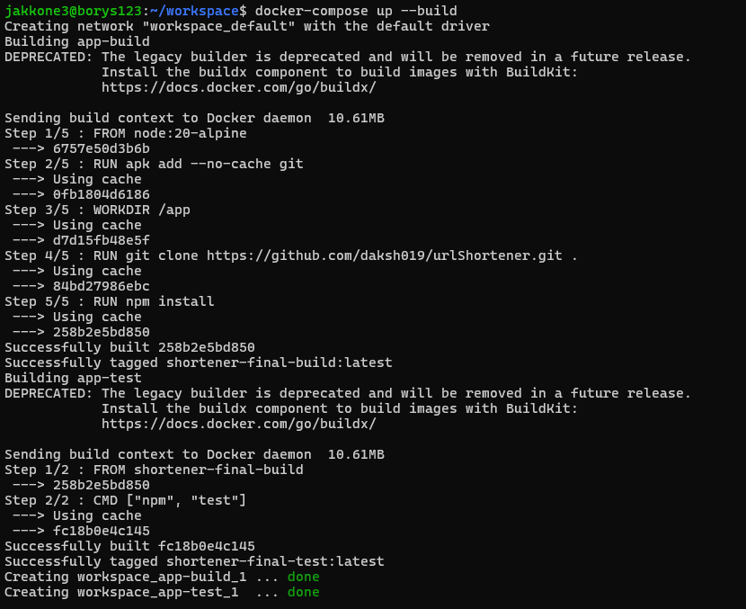

## Lab3

Na maszynie wirtualnej uruchomiono pusty kontener ubuntu w trybie interaktywnym i doinstalowano tam potrzebne zależności

```bash
docker run -it --name shortener node:20-alpine sh
apk add git
npm install
```

Sklonowano do niego repozytorium i po konfiguracji uruchomiono testy

```bash
git clone https://github.com/daksh019/urlShortener.git app
npm install
npm run build
npm test
```




Zautomatyzowano tworzenie kontenera przy pomocy 2 plików dockerfile

Dockerfile.build
```dockerfile
FROM node:20-alpine

RUN apk add --no-cache git

WORKDIR /app

RUN git clone https://github.com/daksh019/urlShortener.git .

RUN npm install
```

Dockerfile.test
```dockerfile
FROM shortener-final-build

CMD ["npm", "test"]
```
Przetestowano ich działanie

```bash
docker build -t shortener-final-build -f Dockerfile.build .
docker build -t shortener-final-test -f Dockerfile.test .
docker run --name final-tester shortener-final-test
```




Zbudowano 1 plik docker-compose w którym zawierają się 2 wcześniej napisane pliki dockerfile, by mieć możliwość zbudowania konteneru 1 poleceniem

```bash
docker-compose up --build
```

docker-compose.yml
```yml
version: '3.8'

services:

  app-build:
    build:
      context: .
      dockerfile: Dockerfile.build
    image: shortener-final-build


  app-test:
    build:
      context: .
      dockerfile: Dockerfile.test
    image: shortener-final-test
    depends_on:
      - app-build

    command: npm test
```



