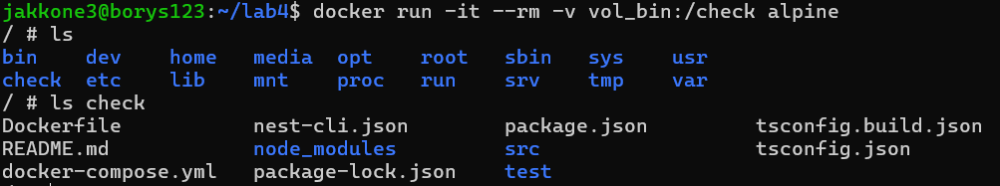
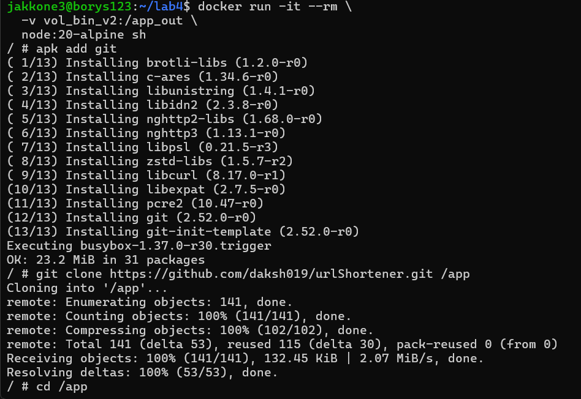

# Lab 4

Stworzono 2 woluminy

```bash
 docker volume create vol_src
 docker volume create vol_bin
```

Skorzystano z pomocniczego kontenera do clona repo dla vol_src

```bash
docker run --rm -v vol_src:/data alpine/git clone https://github.com/daksh019/urlShortener.git /data
```


Odpalono kolejny kontener z woluminami zeby zbuildowac projekt i zapisac pliki na wolumminie wyjsciowym

```bash
docker run -it --name builder-node -v vol_src:/app_in -v vol_bin:/app_out node:20-alpine sh
npm install
cp -r . /app_out
```


Sprawdzono dzialanie kolejnym kontenerem z woluminem wyjsciowym
```bash
docker run -it --rm -v vol_bin:/check alpine
ls check 
```



Zrobienie jesze raz tego samego tym razem bez kontenera pomocniczego
```bash
docker run -it --rm -v vol_bin_v2:/app_out node:20-alpine sh
apk add git
git clone https://github.com/daksh019/urlShortener.git
npm install
cp -r . /app_out
```



Sprawdzenie
```bash
docker run --rm -v vol_bin_v2:/check alpine ls -l /check
```
