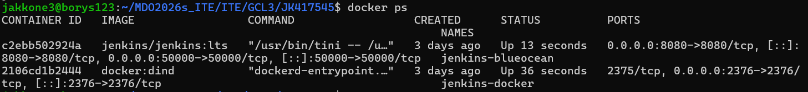
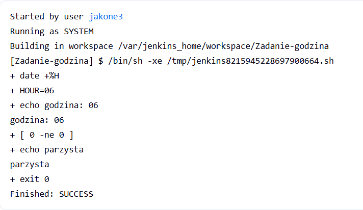
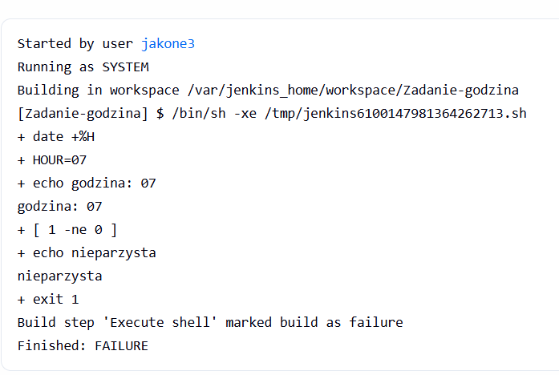

## Laboratorium 5

### Przygotowanie

#### 1:Stworzono voluminy dla jenkinsa i certyfikatów dockera
```bash
docker volume create jenkins-docker-certs
docker volume create jenkins-data
```

#### 2: Uruchomienie Docker-in-Docker
```bash
docker run --name jenkins-docker --detach \
  --privileged --network moja-siec --network-alias docker \
  --env DOCKER_TLS_CERTDIR=/certs \
  --volume jenkins-docker-certs:/certs/client \
  --volume jenkins-data:/var/jenkins_home \
  --publish 2376:2376 \
  docker:dind --storage-driver overlay2
```

#### 3: Uruchomienie Jenkinsa
```bash
docker run --name jenkins-blueocean --detach \
  --network moja-siec --env DOCKER_HOST=tcp://docker:2376 \
  --env DOCKER_CERT_PATH=/certs/client --env DOCKER_TLS_VERIFY=1 \
  --publish 8080:8080 --publish 50000:50000 \
  --volume jenkins-data:/var/jenkins_home \
  --volume jenkins-docker-certs:/certs/client:ro \
  jenkins/jenkins:lts
```



#### 4: Znalezione haslo dla jenkinsa
```bash
docker logs jenkins-blueocean
```


### Zadanie wstępne: uruchomienie

#### 1: Zadanie 1 uname

Utworzono projekt ogólny
W sekcji add build step dodano:
```bash
uname -a
uptime
```


#### 2: Zadanie 2 godzina
Utworzono projekt ogólny
W sekcji add build step dodano:

```bash
HOUR=$(date +%H)
echo "godzina: $HOUR"

if [ $((HOUR % 2)) -ne 0 ]; then
    echo "nieparzysta"
    exit 1
else
    echo "parzysta"
    exit 0
fi
```




#### 3: Zadanie 3 ubuntu
Utworzono projekt ogólny
W sekcji add build step dodano:

```bash 
docker pull ubuntu:latest
docker images | grep ubuntu
```


