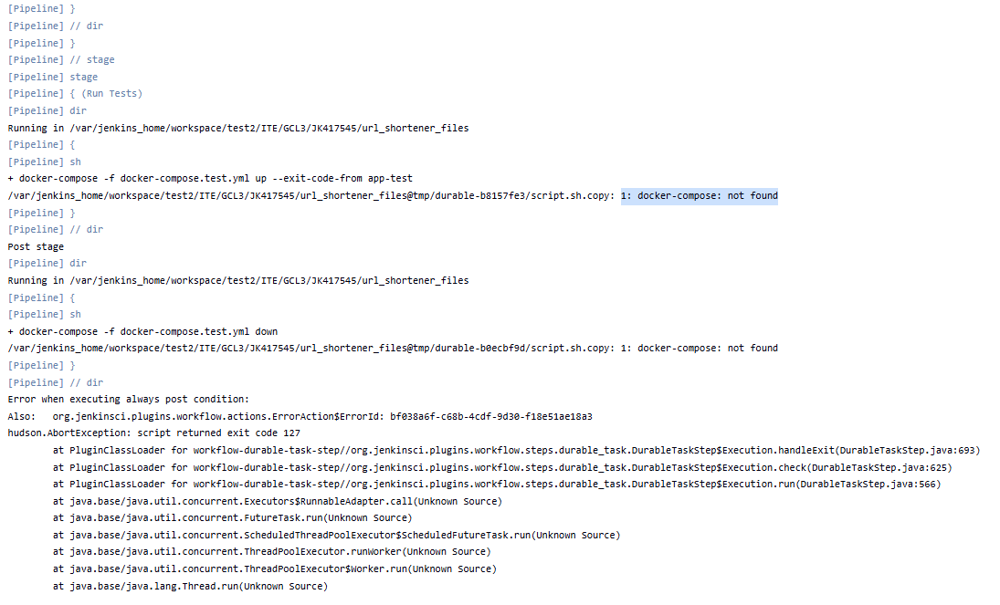
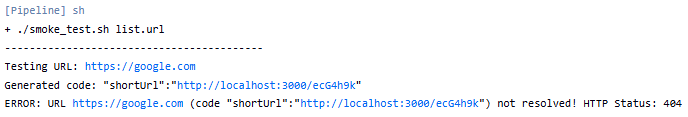

## Laboratorium 6

### Przygotowanie do pipelinu Jenkins

#### 1:Stworzono fork repozytorium projektu

Oryginalna aplikacja posiadała wpisany na sztywno adres połączenia z bazą danych. Zastąpiono statyczny ciąg połączenia zmienną środowiskową, którą można sterować z poziomu pliku docker-compose.yml, umożliwiając elastyczne konfigurowanie połączenia do bazy danych w różnych środowiskach.


#### 2:Poprawiono docker-compose.yml

Mój docker-compose z poprzednich laboratoriów nie uwzględniał drugiego serwisu z bazą danych co bylo krytycznym blędem. Poprawiono plik docker-compose.yml, dodając serwis bazy danych oraz konfigurując sieć, aby oba serwisy mogły się ze sobą komunikować. Dodatkowo rozdzielono infrastrukturę na dwa niezależne pliki docker-compose. Pozwala to na uniknięcie konfliktów portów oraz zapewnia czystość danych.

docker-compose.deploy.yml: Wykorzystany w etapie Deploy i Smoke Test
```yaml 
version: '3.8'
services:
  url-svc:
    build:
      context: .
      dockerfile: Dockerfile.runtime
    image: url-shortener-deploy
    container_name: url-svc-prod
    ports:
      - '3000:3000'
    depends_on:
      - mongo
    environment:
      - MONGO_URI=mongodb://mongo:27017/urlshortener
  mongo:
    image: mongo:4.2.1
    hostname: mongo
    restart: always
```

docker-compose.test.yml: Wykorzystywany do unit testów
```yaml
version: '3.8'
services:
  app-test:
    build:
      context: .
      dockerfile: Dockerfile.test
    image: url-shortener-tester
    depends_on:
      - mongo
    environment:
      - MONGO_URI=mongodb://mongo:27017/urlshortener
  mongo:
    image: mongo:4.2.1
    hostname: mongo
```


#### 3: Optymalizacja obrazów: Builder i Runtime
Pierwotnie obraz aplikacji był bardzo ciężki, zawierał kod źródłowy, kompilatory TypeScripta i wszystkie zależności devDependencies.
Zastosowano podejście rozdzielenia kontenera budującego od produkcyjnego.
- Builder: Zawiera wszystkie narzędzia potrzebne do budowania aplikacji, w tym kompilatory i zależności deweloperskie.
- Runtime: Zawiera tylko skompilowany kod i minimalne zależności potrzebne do uruchomienia aplikacji, co znacznie zmniejsza rozmiar obrazu i poprawia bezpieczeństwo.

Dockerfile.build:
```dockerfile
FROM node:20-alpine
RUN apk add --no-cache git
WORKDIR /app
RUN git clone https://github.com/SzymonJednorozec/devops_urlShortener.git .
RUN npm install
RUN npm run build
```
Dockerfile.runtime:
```dockerfile
FROM node:20-alpine
WORKDIR /app
COPY --from=url-shortener-builder /app/package*.json ./
RUN npm install --omit=dev --legacy-peer-deps
COPY --from=url-shortener-builder /app/dist ./dist
CMD ["node", "dist/main"]
```

#### 4. publish.sh
Głównym celem skryptu jest izolacja procesu budowania artefaktu od środowiska Jenkinsa

```bash
#!/bin/bash

BUILD_IMAGE=$1

echo "------------------------------------------"
echo "Starting Publish process..."

docker run --rm -v $(pwd):/out $BUILD_IMAGE cp -r /app/package.json /app/dist /out/
docker run --rm -v $(pwd):/out -w /out node:20-alpine npm pack

echo "Package created successfully."
echo "------------------------------------------"
```

### Blędy przy budowaniu pipeline

#### 1. Błąd: docker-compose: not found
Jenkins przerywał pracę z komunikatem script returned exit code 127, Oficjalny obraz Jenkinsa domyślnie nie posiada binarnego pliku docker-compose. Jenkins próbował wykonać komendę na powłoce kontenera, która jej nie znała.


Rozwiązanie: Zainstalowano ręcznie docker-compose w kontenerze Jenkinsa:
```bash
docker exec -u 0 -it jenkins-blueocean bash

mkdir -p /usr/local/lib/docker/cli-plugins/
curl -SL https://github.com/docker/compose/releases/download/v2.24.5/docker-compose-linux-x86_64 -o /usr/local/lib/docker/cli-plugins/docker-compose

chmod +x /usr/local/lib/docker/cli-plugins/docker-compose

ln -s /usr/local/lib/docker/cli-plugins/docker-compose /usr/bin/docker-compose

docker-compose version
exit
```

#### 2. Błąd "Connection Refused"
Etap Smoke Test kończył się niepowodzeniem przy próbie wykonania komendy:
```bash
curl -v http://localhost:3000/url/tinyUrl.
```
W logach widniał komunikat: Failed to connect to localhost port 3000: Connection refused.


Błąd wynikał z błędnego założenia, że aplikacja uruchomiona przez docker-compose będzie dostępna dla Jenkinsa na adresie localhost. W rzeczywistości, ponieważ Jenkins działa w kontenerze, localhost odnosi się do samego kontenera Jenkinsa, a nie do hosta, na którym działa docker-compose.
Rozwiązanie: Należało zmienić adres docelowy z localhost na hosta, który w architekturze DinD reprezentuje maszynę uruchamiającą kontenery.

Rozwiązanie:


#### 3. Błąd: URL not resolved! HTTP Status: 404
Smoke Test zwracał {"statusCode":404,"message":"Cannot GET /url/tinyUrl"}.
Aplikacja Nest.js domyślnie oczekiwała żądania typu POST z body (tworzenie linku), a curl domyślnie wysyłał GET. Poprawiono skrypt testowy tak, aby najpierw tworzył zasób (POST), a następnie weryfikował jego istnienie.



smoke_test.sh:
```bash
#!/bin/bash

URL_FILE=$1
APP_URL="http://docker:3000"

if [ ! -f "$URL_FILE" ]; then
    echo "ERROR: File $URL_FILE not found!"
    exit 1
fi

while read -r url || [ -n "$url" ]; do
    [ -z "$url" ] && continue
    echo "------------------------------------------"
    echo "Testing URL: $url"
    
    # upewniamy się że żądanie jest typu POST  ////////////////////////////////////////////////////////////
    RESPONSE=$(curl -s -X POST "$APP_URL/url/tinyUrl" \
        -H 'Content-Type: application/json' \
        -d "{\"longUrl\": \"$url\"}")
    #//////////////////////////////////////////////////////////////////////////////////////////////////////

    SHORT_CODE=$(echo "$RESPONSE" | sed 's/.*[\/]\([^"]*\)".*/\1/')
    
    if [ -z "$SHORT_CODE" ] || [[ "$SHORT_CODE" == *"{"* ]]; then
        echo "ERROR: Failed to parse short code!"
        echo "Full Response: $RESPONSE"
        exit 1
    fi
    
    echo "Generated code: $SHORT_CODE"

    CHECK=$(curl -s -o /dev/null -w "%{http_code}" "$APP_URL/url/tinyUrl/$SHORT_CODE")
    
    if [ "$CHECK" != "200" ]; then
        echo "ERROR: URL $url (code $SHORT_CODE) not resolved! HTTP Status: $CHECK"
        echo "Attempted URL: $APP_URL/url/tinyUrl/$SHORT_CODE"
        exit 1
    fi
    
    echo "SUCCESS: $url resolved correctly."
done < "$URL_FILE"

echo "------------------------------------------"
echo "ALL TESTS PASSED SUCCESSFULLY"
exit 0
```

### Pipeline Jenkins

``` Groovy
pipeline {
    agent any

    environment {
        FILES_DIR = "ITE/GCL3/JK417545/url_shortener_files"
        BUILD_IMAGE = "url-shortener-builder"
        DEPLOY_IMAGE = "url-shortener-deploy"
    }

    stages {
        stage('Checkout') {
            steps {
                git branch: 'JK417545', 
                    url: 'https://github.com/InzynieriaOprogramowaniaAGH/MDO2026s_ITE.git'
            }
        }

        stage('Build Builder') {
            steps {
                dir("${FILES_DIR}") {
                    sh "docker build -t ${BUILD_IMAGE} -f Dockerfile.build ."
                }
            }
        }

        stage('Run Unit Tests') {
            steps {
                dir("${FILES_DIR}") {
                    sh "docker-compose -f docker-compose.test.yml up --exit-code-from app-test"
                }
            }
            post {
                always {
                    dir("${FILES_DIR}") {
                        sh "docker-compose -f docker-compose.test.yml down -v"
                    }
                }
            }
        }

        stage('Build Runtime Image') {
            steps {
                dir("${FILES_DIR}") {
                    sh "docker build -t ${DEPLOY_IMAGE} -f Dockerfile.runtime ."
                }
            }
        }

        stage('Deploy & Smoke Test') {
            steps {
                dir("${FILES_DIR}") {
                    sh "docker-compose -f docker-compose.deploy.yml up -d"
                    sh "sleep 15"
                    sh "chmod +x smoke_test.sh"
                    sh "./smoke_test.sh list.url"
                }
            }
            post {
                always {
                    dir("${FILES_DIR}") {
                        sh "docker-compose -f docker-compose.deploy.yml down -v"
                    }
                }
            }
        }

        stage('Publish Artifact') {
            steps {
                dir("${FILES_DIR}") {
                    sh "chmod +x publish.sh"
                    sh "./publish.sh ${BUILD_IMAGE}"
                    archiveArtifacts artifacts: '*.tgz', fingerprint: true
                }
            }
        }
    }

    post {
        success {
            echo "Pipeline Success!"
        }
        failure {
            echo "Pipeline Failure. Check logs."
        }
    }
}
```

