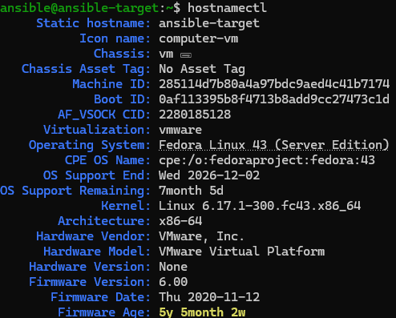
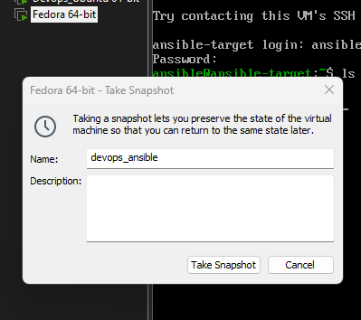
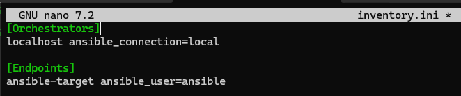
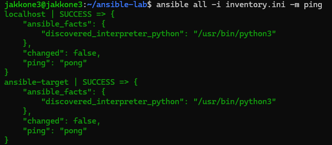
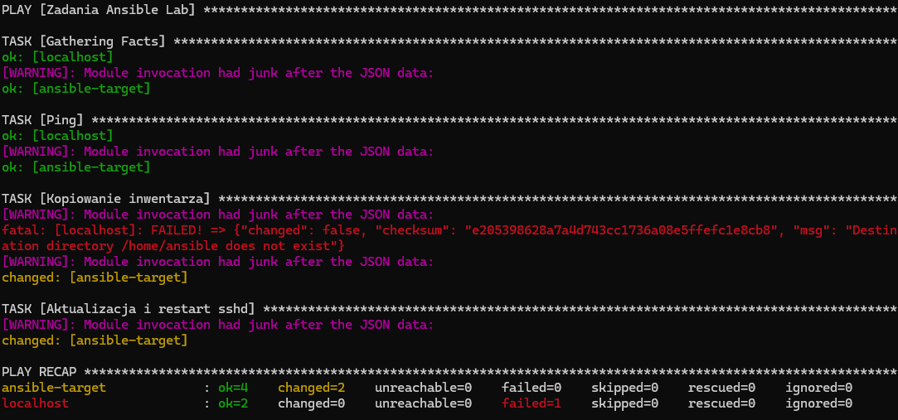
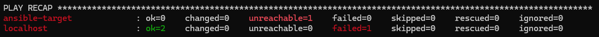
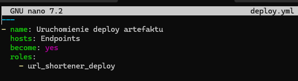
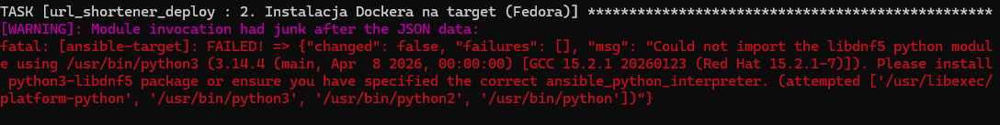
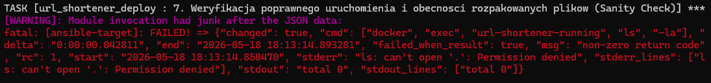
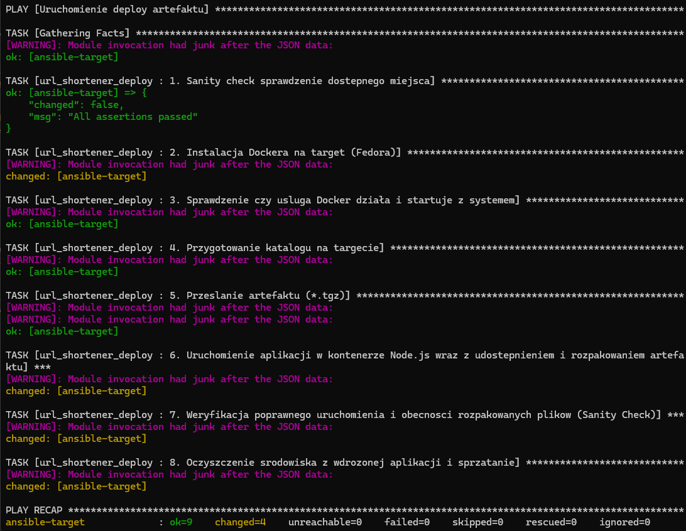

## Laboratorium 8

### Instalacja zarządcy Ansible

#### 1: Utworzono drugą maszynę wirtualną
Ze względu na obawę że mój laptop na którym do tej pory działałem może nie poradzić sobie z uruchomieniem dwóch maszyn wirtualnych, zdecydowalem przenieść się na komputer stacjonarny, tam od nowa utworzylem 2 maszyny wirtualne


Maszyny hostowane są na vmware_workstation:
- Zarządca - Ubuntu 24.04 server 4GB RAM, 2 vCPU, 32GB HDD (skonfigurowano wszystkie narzędzia z którymi do tej pory dzialaliśmy)
- Target - Fedora 43 server 2GB RAM, 1 vCPU, 20GB HDD

Target:


Zarządca:


Na targecie sprawdzono obecność tar i odblokowano ssh
```bash
sudo systemctl enable --now sshd
sudo firewall-cmd --add-service=ssh --permanent
sudo firewall-cmd --reload

tar --version
```

#### 2: Snapshot
Po upewnieniu się że wszystko działa poprawnie, utworzono snapshot targetu



#### 3: Instalacja Ansible i wymiana kluczy SSH
Zainstalowano Ansible na zarządcy
```bash
sudo apt update
sudo apt install ansible -y
```

Wyegenerowano i przesłano klucze SSH z zarządcy do targetu
```bash
ssh-keygen -t rsa -b 4096
ssh-copy-id ansible@192.168.219.131
```

Przetestowano połączenie


### Inwentaryzacja
#### 1: Wprowadzono nazwy DNS na Zarządcy w /etc/hosts
Wprowadzono nazwy


Zweryfikowano działanie


#### 2: Plik inwentaryzacyjny Ansible

Utworzono plik inwentaryzacyjny Ansible 


Zweryfikowano działanie wysyłając ping do wszystkich maszyn


### Zdalne wywoływanie procedur

#### 1. Utworzono playbook Ansible

```yml
---
- name: Zadania Ansible Lab
  hosts: all
  become: yes
  tasks:
    - name: Ping
      ping:

    - name: Kopiowanie inwentarza
      copy:
        src: ./inventory.ini
        dest: /home/ansible/inventory_backup.ini

    - name: Aktualizacja i restart sshd
      shell: |
        dnf update -y
        systemctl restart sshd
      when: inventory_hostname != 'localhost'
```

#### 2. Uruchomiono playbook pierwszy raz

```bash
ansible-playbook -i inventory.ini tasks.yml --ask-become-pass
```

Po wpisaniu hasła


Przy pierwszym wywołaniu Ansible wykrywa, że systemy docelowe znajdują się w stanie odbiegającym od definicji w playbooku.
Status changed: Widoczny przy zadaniu kopiowania oraz aktualizacji, oznacza, że Ansible faktycznie wykonał pracę (przesłał plik, wywołał menedżer pakietów).

#### 3. Drugie uruchomienie


Ansible używa dedykowanego modułu copy, po ponownym uruchomieniu playbooka ansible przed przesłaniem pliku sprawdza jego sumę kontrolną na obu maszynach. Ponieważ plik na Fedorze był identyczny z lokalnym, ansible pominął kopiowanie i zwrócił status ok. Aktualizacja systemu wykonała się ponownie, ponieważ użyłem modułu shell. W przeciwieństwie do modułów dedykowanych, moduł shell nie potrafi sam ocenić, czy stan pożądany został już osiągnięty dlatego licznik changed nadal wzrasta przy każdym odpaleniu.


#### 4. Trzecie uruchomienie bez ssh na targecie

```bash
sudo systemctl stop sshd
```


Po wyłączeniu serwera SSH na maszynie ansible-target, Ansible raportuje błąd UNREACHABLE. Ansible nie wymaga zainstalowanego agenta na maszynie docelowej, ale jest całkowicie zależny od protokołu SSH. Brak łączności natychmiast przerywa proces dla danego hosta, nie wpływając jednak na wykonanie zadań na pozostałych dostępnych maszynach.

### Zarządzanie stworzonym artefaktem

#### 1. Stworzenie nowej roli na zarządcy

```bash
ansible-galaxy role init url_shortener_deploy
```


#### 2. Wypelnienie meta/main.yml


#### 3. Wypelnienie tasks/main.yml

```yml
---


- name: 1. Sanity check sprawdzenie dostepnego miejsca 
  assert:
    that:
      - ansible_memfree_mb > 100
    fail_msg: "Za malo wolnej pamieci"
  ignore_errors: yes

- name: 2. Instalacja Dockera na target (Fedora)
  shell: dnf install -y docker docker-compose

- name: 3. Sprawdzenie czy usluga Docker działa i startuje z systemem
  service:
    name: docker
    state: started
    enabled: yes

- name: 4. Przygotowanie katalogu na targecie
  file:
    path: /home/ansible/app
    state: directory
    mode: '0755'

- name: 5. Przeslanie artefaktu (*.tgz) 
  copy:
    src: ./szymonjednorozec-mdo-url-shortener-0.0.3.tgz       
    dest: /home/ansible/app/url-shortener.tgz
    owner: ansible
    mode: '0644'

- name: 6. Uruchomienie aplikacji w kontenerze Node.js wraz z udostepnieniem i rozpakowaniem artefaktu
  shell: |
    tar -xzf url-shortener.tgz
    
    docker run -d --name url-shortener-running \
      -v /home/ansible/app/package:/src:Z \
      -w /src \
      -p 8081:8080 \
      node:20-alpine sleep 100
  args:
    chdir: /home/ansible/app
    executable: /bin/bash

- name: 7. Weryfikacja poprawnego uruchomienia i obecnosci rozpakowanych plikow (Sanity Check)
  command: docker exec url-shortener-running ls -la
  register: docker_check
  failed_when: "'package.json' not in docker_check.stdout"

- name: 8. Oczyszczenie srodowiska z wdrozonej aplikacji i sprzatanie
  shell: |
    docker stop url-shortener-running
    docker rm url-shortener-running
    rm -rf /home/ansible/app
  args:
    executable: /bin/bash
```

#### 4. Stworzona playbook uruchamiający rolę



#### 5. Uruchomienie playbooka / napotkane problemy

```bash
ansible-playbook -i inventory.ini deploy.yml --ask-become-pass
```

- błąd integracji Pythona z menedżerem pakietów DNF5


Problem ten rozwiązano poprzez zastąpienie natywnego modułu, komendą systemową w module shell

Zamiast:
```yml
dnf:
    name:
      - docker
      - docker-compose
    state: present
```
zastosowano:
```yml
shell: dnf install -y docker docker-compose
```

- Podczas montowania wolumenu z rozpakowanym artefaktem do kontenera, system zablokował uprawnienia do odczytu plików wewnątrz kontenera


Problem został rozwiązany poprzez dodanie flagi :Z do definicji wolumenu (-v /home/ansible/app/package:/src:Z). Flaga ta instruuje Dockera, aby automatycznie nadał odpowiedni kontekst bezpieczeństwa


Po poprawieniu problemów:



## Wnioski laboratorium 8

- Dla pełnej automatyzacji w środowiskach produkcyjnych zaleca się stosowanie natywnych modułów, które raportują changed: false, jeśli system jest już w pełni zaktualizowany. Użycie modułu shell jest prostsze w zapisie, ale oszukuje statystyki.

- Ansible pozwala na zarządzanie wieloma maszynami o różnych systemach (Ubuntu, Fedora) za pomocą jednego, czytelnego pliku YAML. Eliminuje to konieczność ręcznego logowania się na każdy serwer z osobna.

- Ansible jest agentless, ale całkowicie zależny od SSH. Brak łączności z maszyną docelową skutkuje błędem UNREACHABLE, co podkreśla znaczenie stabilnej infrastruktury sieciowej dla skutecznego zarządzania konfiguracją.