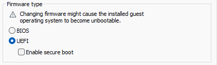
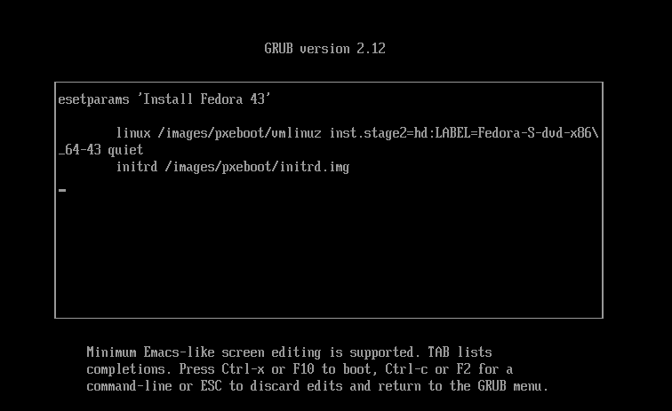
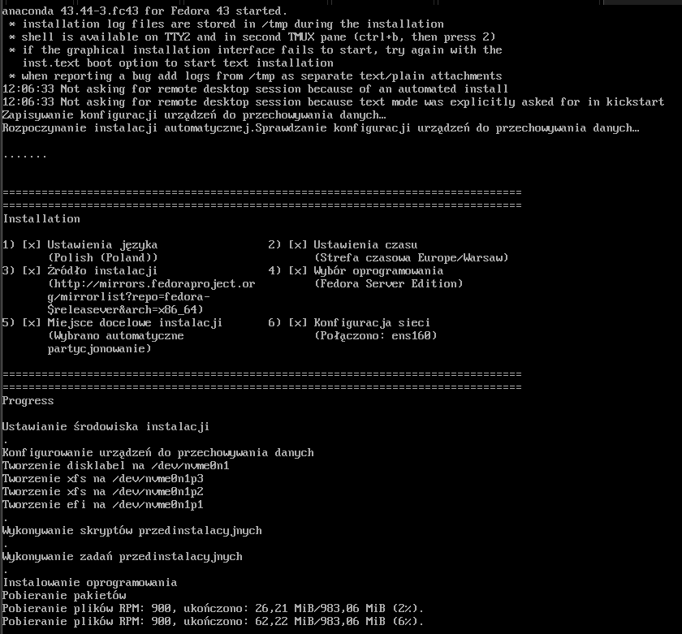
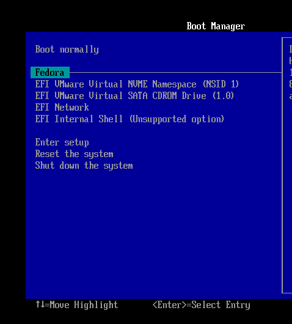
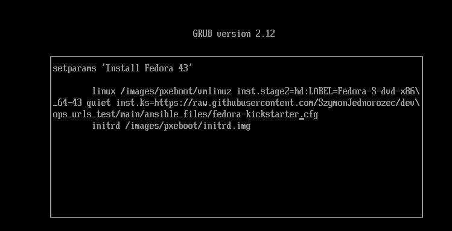
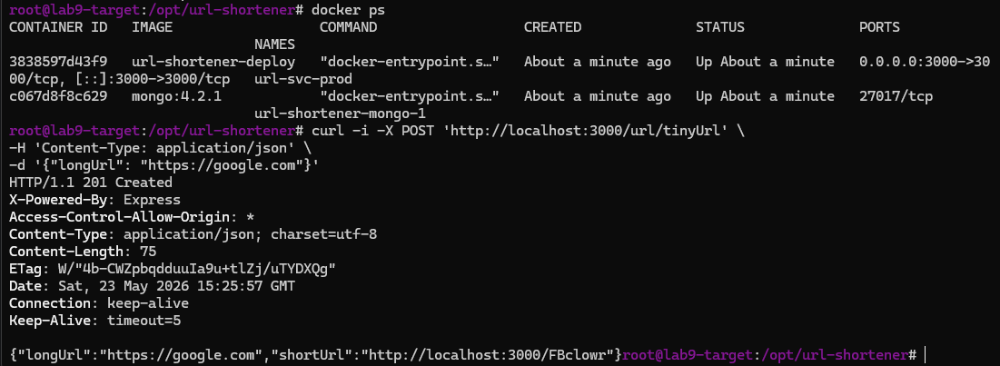
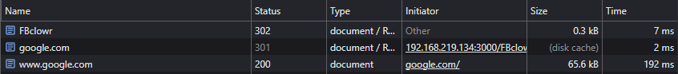

## Laboratorium 9

### Pliki odpowiedzi dla wdrożeń nienadzorowanych

#### 1: Przeprowadzono ręczną instalację systemu w czystej VM

- Specyfikacja: Fedora 43 server 2GB RAM, 2 vCPU, 20GB HDD, Dysk virtualny w 1 pliku

Ręcznia zmiana firmware type na UEFI



Wskazano obraz .iso, ustawiono możliwość logowania się na konto roota przez SSH oraz dysk na maszynie hostującej i przeprowadzono instalację systemu.

#### 2: Plik anaconda-ks.cfg

Skopoiowano plik anaconda-ks.cfg na maszynę zarządcy przez SSH
```bash
scp root@192.168.219.132:/root/anaconda-ks.cfg ./fedora-kickstart.cfg
```
#### 3: Edycja pliku kickstart

```bash
# Generated by Anaconda 43.44
# tekstowa instalacja
text

# reboot po zakonczeniu isntalacji
reboot

# Keyboard layouts
keyboard --vckeymap=pl --xlayouts='pl'
# System language
lang pl_PL.UTF-8

# repo + installation sources
url --mirrorlist=http://mirrors.fedoraproject.org/mirrorlist?repo=fedora-$releasever&arch=x86_64
repo --name=update --mirrorlist=http://mirrors.fedoraproject.org/mirrorlist?repo=updates-released-f$releasever&arch=x86_64

# Network information 
network --bootproto=dhcp --device=ens160 --ipv6=auto --activate --hostname=lab9-target.local

%packages
@^server-product-environment
@container-management
@domain-client
@guest-agents
@server-hardware-support
# dodatkowe pakiety
curl
tar
%end

# System authorization information
authselect enable-feature with-fingerprint

# Run the Setup Agent on first boot
firstboot --enable

# config dysku
ignoredisk --only-use=nvme0n1
clearpart --all --initlabel --drives=nvme0n1
autopart --type=plain

# System bootloader configuration
bootloader --boot-drive=nvme0n1

# System timezone
timezone Europe/Warsaw --utc

# Root password + nazwa usera --name=ansible
rootpw --iscrypted --allow-ssh $y$j9T$jItepsKwSnQ5Lzt7Mj2rsVhP$1iixxLGKgjjJgGDCTskBAQ10bUuy013vAB4astMlFK5
user --groups=wheel --name=ansible --password=$y$j9T$YIWk6AOTuzd.LMziLpso6S90$pOQOKnucYa/3bx2xGE4c4HKYyQM4Qrdb6QdJcZ.rHt3 --iscrypted
```

- reboot oraz text: na samym początku. Dzięki temu instalacja wykona się w trybie tekstowym co powinno być szybsze, a po jej zakończeniu maszyna sama się zrestartuje.

- url i repo: wpisy wskazujące na serwery lustrzane Fedory, z których zostaną pobrane pakiety podczas instalacji.

- --hostname=lab9-target.local: zamiana nazwy hosta z localhost

- instalacja w kółko: zmieniono clearpart --none na clearpart --all --initlabel --drives=nvme0n1. Instalator przy każdym uruchomieniu skasuje wszystkie istniejące partycje, założy nową czystą strukturę.

#### 4: Host pliku kickstart
Wykorzystałem wcześniej utworzone repo w którym trzymałem wszystkie pliki do pipeline i umieściłem tam plik fedora-kickstart.cfg. Dzięki temu jest on dostępny pod adresem:

https://raw.githubusercontent.com/SzymonJednorozec/devops_urls_test/main/ansible_files/fedora-kickstarter.cfg

w repo

https://github.com/SzymonJednorozec/devops_urls_test

### Instalacja nienadzorowana

#### 1. Nowa maszyna wirtualna
Stworzono kolejną czystą VM, ręcznie ustawiono Firmware type na UEFI, wskazano obraz .iso i uruchomiono maszynę.

Następnie klawiszem 'e' edytowana parametry rozruchu



za słowem quiet po spacji dopisano:
```bash
inst.ks=https://raw.githubusercontent.com/SzymonJednorozec/devops_urls_test/main/ansible_files/fedora-kickstarter.cfg
```

Po zmianie przyciskiem F10 rozpoczęto rozruch



Po zalogowaniu na kont roota mamy 2 pliki ks.cfg:


- original-ks.cfg: zmodyfikowany przez nas, z naszymi komentarzami
- anaconda-ks.cfg: wygenerowany przez instalator

### Rozszerzenie pliku kickstarter 

```bash
# Generated by Anaconda 43.44
# tekstowa instalacja
text

# reboot po zakonczeniu isntalacji
reboot

# Keyboard layouts
keyboard --vckeymap=pl --xlayouts='pl'
# System language
lang pl_PL.UTF-8

# repo + installation sources
url --mirrorlist=http://mirrors.fedoraproject.org/mirrorlist?repo=fedora-$releasever&arch=x86_64
repo --name=update --mirrorlist=http://mirrors.fedoraproject.org/mirrorlist?repo=updates-released-f$releasever&arch=x86_64

# Network information - ustawiony unikalny hostname (Wymog prowadzacego)
network --bootproto=dhcp --device=ens160 --ipv6=auto --activate --hostname=lab9-target.local

%packages
@^server-product-environment
@container-management
@domain-client
@guest-agents
@server-hardware-support
# dodatkowe pakiety 
curl
tar
docker
docker-compose
cronie
%end

# System authorization information
authselect enable-feature with-fingerprint

# Run the Setup Agent on first boot
firstboot --enable

# config dysku 
ignoredisk --only-use=nvme0n1
clearpart --all --initlabel --drives=nvme0n1
autopart --type=plain

# System bootloader configuration
bootloader --boot-drive=nvme0n1

# System timezone
timezone Europe/Warsaw --utc

# Root password + nazwa usera --name=ansible
rootpw --iscrypted --allow-ssh $y$j9T$jItepsKwSnQ5Lzt7Mj2rsVhP$1iixxLGKgjjJgGDCTskBAQ10bUuy013vAB4astMlFK5
user --groups=wheel --name=ansible --password=$y$j9T$YIWk6AOTuzd.LMziLpso6S90$pOQOKnucYa/3bx2xGE4c4HKYyQM4Qrdb6QdJcZ.rHt3 --iscrypted

# Sekcja skryptow wykonywanych po zakonczeniu instalacji pakietow
%post --log=/root/ks-post-install.log

# Rejestracja i wlaczenie uslugi Docker oraz Crona
systemctl enable docker
systemctl enable crond

mkdir -p /opt/url-shortener
cd /opt/url-shortener

# Pobranie plikow z GitHub
curl -sO https://raw.githubusercontent.com/SzymonJednorozec/devops_urls_test/main/docker-compose.deploy.yml
curl -sO https://raw.githubusercontent.com/SzymonJednorozec/devops_urls_test/main/ansible_files/Dockerfile.runtime

# Standaryzacja nazwy pliku dla narzedzia docker compose
mv docker-compose.deploy.yml docker-compose.yml

# Pobranie kodu zrodlowego aplikacji (zastepstwo z Jenkinsa)
curl -sL https://github.com/SzymonJednorozec/devops_urls_test/archive/refs/heads/main.tar.gz -o app-source.tar.gz
tar -xzf app-source.tar.gz --strip-components=1

cp /opt/url-shortener/ansible_files/Dockerfile.runtime /opt/url-shortener/Dockerfile.runtime
# Utworzenie mechanizmu automatycznego startu produkcji za pomoca Crontaba roota
echo "@reboot cd /opt/url-shortener && docker compose up -d --build >> /root/app-start.log 2>&1" >> /var/spool/cron/root
chmod 600 /var/spool/cron/root

%end
```

#### 1: Ponowna instalacja systemu na tej samej maszynie wirtualnej

Przy ponownym uruchomieniu VM zaciągnęla system z dysku wirtualnego, a nie z obrazu .iso. W boot menu trzeba było ręcznie wskazać rozruch z napędu DVD/CD, na którym ustawiony jest plik .iso żeby ponownie przejść przez proces instalacji.




Ponownie dopisano komendę inst.ks i odpalono rozruch.



Pojawił się problem z nazewnictwem w plikach dockerfile, stworzono specjalny plik dockerfile.runtime który jest polączeniem dockerfile.build+dockerfile.runtime żeby wyeliminować problem z nazewnictwem pomiędzy nimi.

```dockerfile
FROM node:20-alpine AS url-shortener-builder

RUN apk add --no-cache git
WORKDIR /app
RUN git clone https://github.com/SzymonJednorozec/devops_urlShortener.git .
RUN npm install
RUN npm run build

FROM node:20-alpine
WORKDIR /app

COPY --from=url-shortener-builder /app/package*.json ./
RUN npm install --omit=dev --legacy-peer-deps
COPY --from=url-shortener-builder /app/dist ./dist

CMD ["node", "dist/main"]
```

Kolejnym problemem byl kontekst budowania, z racji tego że nowy Dockerfile.runtime znajduje się w katalogu ansible_files, a docker-compose.yml w katalogu głównym VM korzystala ze zlego pliku.

Kopiowania pliku w odpowiednie miejsce rozwiązało problem z kontekstem.

Dodano do pliku kickstart:
```bash
cp /opt/url-shortener/ansible_files/Dockerfile.runtime /opt/url-shortener/Dockerfile.runtime
```

Po wszystkich porpawkach serwis uruchomił się poprawnie



Zamiat loclahosta trzeba używać adresu IP VM, po wpisaniu w przeglądarkę
192.168.219.134:3000/FBclowr zostajemy przekierowani na stronę google.com



