# Sprawozdanie 

## Laboratorium 1

#### 1: Na 1 zajęcia przygotowano maszynę wirtualną w środowisku VirtualBox z systemem Ubuntu Server:
RAM - 4GB
Dysk - 36GB

#### 2:Utworzono gałąź roboczą komendą
```bash
git checkout -b JK417545
```
 
#### 3: Na platformie GitHub utworzono Pull Request z gałęzi osobistej do gałęzi grupowej.
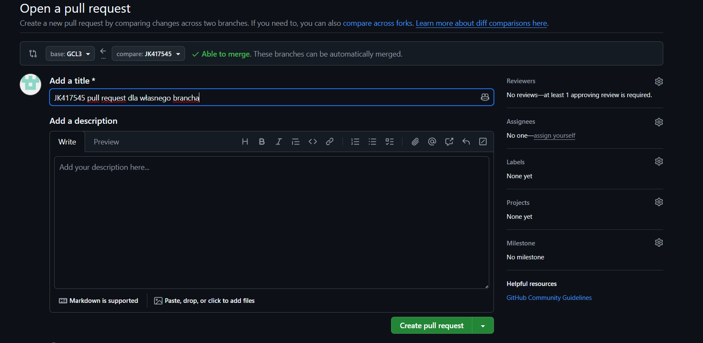

#### 4: Skrypt commit-msg:

```bash
#!/bin/bash

commit_msg=$(cat "$1")

if [[ ! $commit_msg =~ "JK417545" ]]; then
  echo "Error: prefix JK417545 nedded in commit"
  exit 1
fi
```
Skrypt został umieszczony w katalogu .git/hooks/ i nadano mu uprawnienia do wykonywania (chmod +x). Dzięki temu każda próba zatwierdzenia zmian niezgodna z formatem jest blokowana na poziomie lokalnym.
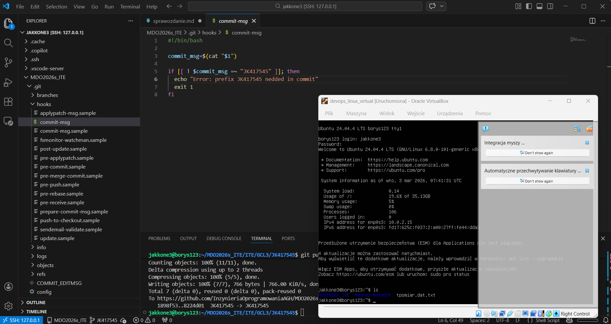

### Wnioski:
Automatyzacja na poziomie lokalnego repozytorium (Git Hooks) pozwala na wyeliminowanie błędów ludzkich przed wysłaniem kodu na serwer. Wymuszenie standardu nazewnictwa ułatwia zarządzanie historią zmian w dużych projektach zespołowych i integrację z systemami CI/CD.

<!-- -------------------------------------------------------------------------------------------------------------------------lab2 -->
## Laboratorium 2

Celem zajęć jest zestawienie środowiska skonteneryzowanego do pracy nad CI i potwierdzenie łączności/możliwośi utrzymywania kodu w repozytorium GitHub.

### Zestawienie środowiska skonteneryzowanego

#### 1: Zainstalowanie Dockera na maszynie wirtualnej

```bash
sudo apt update
sudo apt install docker.io
```

#### 2: Pobrano i uruchomiono obrazy, sprawdzono kody wyjścia i ich rozmiary

 Obrazy różnią się znacząco rozmiarem, co wynika z zawartych w nich bibliotek systemowych. Kontenery które poprawnie wykonały polecenie mają kod wyjścia 0, natomiast te w których pojawiały się błędy mają kod wyjścia różny od 0. 

```bash
sudo docker pull ubuntu
sudo docker run hello-world
sudo docker images
sudo docker ps -a
```


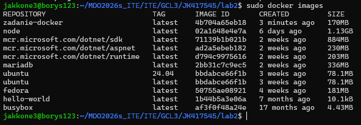
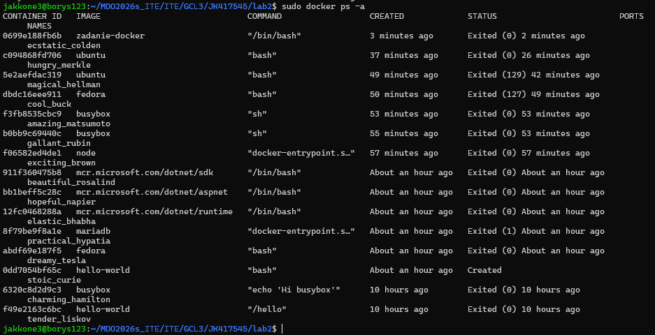

#### 3: Uruchomiono kontener ubuntu w trybie interaktywnym

Wewnątrz kontenera procesem o identyfikatorze PID 1 jest powłoka bash. Oznacza to, że kontener nie jest pełnym systemem operacyjnym, lecz izolowanym procesem

```bash
sudo docker run -it ubuntu bash
```

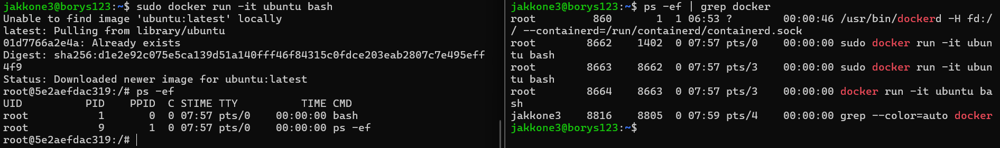

#### 4: Stworzono plik dockerfile i przetestowano jego działanie
W pliku zastosowano łączenie komend apt-get update && apt-get install, co redukuje liczbę warstw obrazu i jego finalny rozmiar
```bash
sudo docker build -t zadanie-docker .
sudo docker run -it zadanie docker
```

```dockerfile
FROM ubuntu:24.04

ENV DEBIAN_FRONTEND=noninteractive

RUN apt-get update && apt-get install -y \
    git \
    && rm -rf /var/lib/apt/lists/*

WORKDIR /app

RUN git clone https://github.com/InzynieriaOprogramowaniaAGH/MDO2026s_ITE.git .

CMD ["/bin/bash"]
```

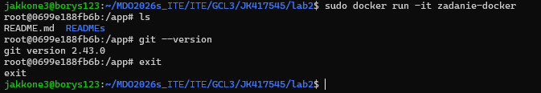

#### 5: Na koniec wyczyszczono środowisko
```bash
sudo docker prune -f
sudo docker rmi zadanie-docker
```

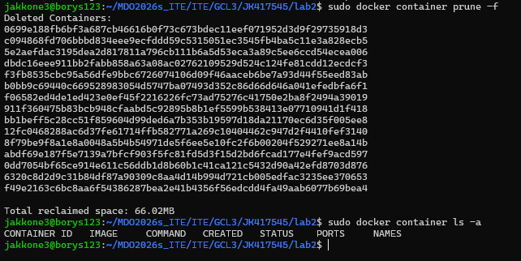

### Wnioski:
- Docker pozwala na błyskawiczne zestawienie różnorodnych systemów (Ubuntu, Alpine) bez narzutu typowego dla pełnej wirtualizacji. Procesy wewnątrz kontenera są odseparowane od hosta, co potwierdza analiza PID 1 kontener żyje tak długo, jak proces główny.

- Dockerfile: Wykorzystanie własnych definicji pozwala na pełną automatyzację przygotowania środowiska pracy.

- Zarządzanie: Regularne czyszczenie (docker prune) jest niezbędne do zachowania limitów miejsca na maszynie deweloperskiej.

<!-- -------------------------------------------------------------------------------------------------------------------------lab3 -->

## Laboratorium 3

Celem zajęć jest zbudowanie oprogramowania w powtarzalnym środowisku CI tak, aby proces był przenośny między ustrojami.

### Wybór oprogramowania na zajęcia

Do zajęć wybrano prosty projekt urlShortener https://github.com/daksh019/urlShortener, który jest aplikacją do skracania linków. Projekt ten jest napisany w Node.js. 

### Izolacja i powtarzalność: build w kontenerze

#### 1: Na maszynie wirtualnej uruchomiono pusty kontener ubuntu w trybie interaktywnym i doinstalowano tam potrzebne zależności

```bash
docker run -it --name shortener node:20-alpine sh
apk add git
npm install
```

#### 2: Sklonowano do niego repozytorium i po konfiguracji uruchomiono testy

```bash
git clone https://github.com/daksh019/urlShortener.git app
npm install
npm test
```

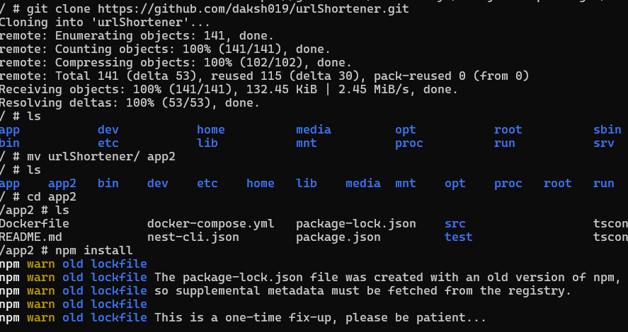


#### 3: Zautomatyzowano tworzenie kontenera przy pomocy 2 plików dockerfile

Dzięki temu podziałowi, proces testowania jest odseparowany od procesu budowania, co pozwala na łatwiejsze zarządzanie etapami potoku CI/CD.

Dockerfile.build
```dockerfile
FROM node:20-alpine

RUN apk add --no-cache git

WORKDIR /app

RUN git clone https://github.com/daksh019/urlShortener.git .

RUN npm install
```

Dockerfile.test
```dockerfile
FROM shortener-final-build

CMD ["npm", "test"]
```
#### 4: Przetestowano ich działanie

```bash
docker build -t shortener-final-build -f Dockerfile.build .
docker build -t shortener-final-test -f Dockerfile.test .
docker run --name final-tester shortener-final-test
```


### Docker Compose

#### 1: Zbudowano 1 plik docker-compose w którym zawierają się 2 wcześniej napisane pliki dockerfile, by mieć możliwość zbudowania konteneru 1 poleceniem

```bash
docker-compose up --build
```

docker-compose.yml
```yml
version: '3.8'

services:

  app-build:
    build:
      context: .
      dockerfile: Dockerfile.build
    image: shortener-final-build


  app-test:
    build:
      context: .
      dockerfile: Dockerfile.test
    image: shortener-final-test
    depends_on:
      - app-build

    command: npm test
```


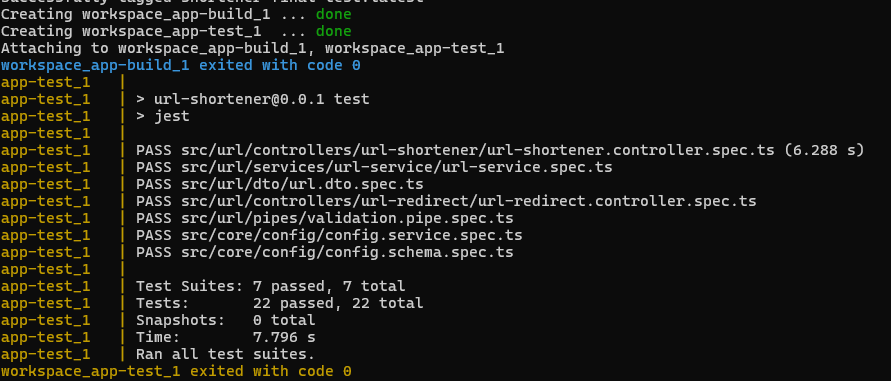

### Dyskusja: Przygotowanie do wdrożenia (deploy)
- Czy program nadaje się jako kontener? UrlShortener nadaje się do publikacji jako kontener. W przeciwieństwie do bibliotek jest to samodzielna usługa która do działania potrzebuje konkretnego środowiska i zależności. Kontener zapewnia, że aplikacja zadziała tak samo na produkcji jak i u dewelopera.
- Oczyszczanie? Jeśli program ma być publikowany jako kontener, bezwzględnie należy go oczyścić z pozostałości po buildzie.
- Format dystrybucji i dodatkowe kroki? Aplikacje Node.js można dystrybuować jako spakowane archiwum node_modules wraz z kodem. Aby to zautomatyzować, można dodać trzeci kontener w potoku, który po pomyślnych testach pakuje artefakty.

### Wnioski:
- Przenośność: Konteneryzacja pozwala na uruchomienie aplikacji NestJS w identycznym środowisku na każdym systemie, eliminując problem "u mnie działa".

- Separacja etapów: Rozdzielenie na build i test optymalizuje potoki CI/CD i pozwala na ponowne wykorzystanie warstw obrazu.

- Obraz vs Kontener: Obraz jest statyczną, niemodyfikowalną definicją (szablonem), natomiast kontener to działający proces wykonujący skompilowany kod.

<!-- -------------------------------------------------------------------------------------------------------------------------lab4 -->

## Laboratorium 4

### Zachowywanie stanu między kontenerami

#### 1: Stworzono 2 woluminy

```bash
 docker volume create vol_src
 docker volume create vol_bin
```

#### 2: Skorzystano z pomocniczego kontenera żeby clonowac repozytorium dla vol_src

- Wolumin/kontener pomocniczy (Wybrana metoda)? Jest to najbardziej przenośne rozwiązanie. Nie zależy od plików na hoście, a cały proces odbywa się wewnątrz silnika Docker. Umożliwia to zachowanie czystości kontenera budującego, który nie musi mieć zainstalowanego Gita.

- Bind mount z lokalnym katalogiem? Wymagałoby to ręcznego pobrania kodu na dysk maszyny VM. Jest to mniej profesjonalne ponieważ ścieżki na hostach mogą się różnić, co psuje powtarzalność.

- Kopiowanie do /var/lib/docker? Katalog ten jest zarządzany przez demona Dockera i bezpośrednia ingerencja w te pliki z poziomu hosta może prowadzić do problemów z uprawnieniami i spójnością danych.

```bash
docker run --rm -v vol_src:/data alpine/git clone https://github.com/daksh019/urlShortener.git /data
```

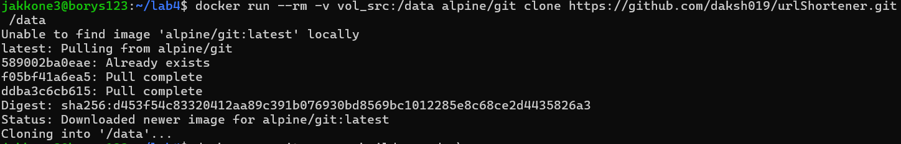

#### 3: Odpalono kolejny kontener z woluminami zeby zbuildowac projekt i zapisac pliki na wolumminie wyjsciowym

Użycie kontenera pomocniczego do klonowania kodu (vol_src) pozwoliło zachować czystość docelowego kontenera budującego. Kontener budujący miał dostęp tylko do kodu z vol_src i mógł bezpośrednio kopiować z niego do vol_bin, co zapewniało izolację i powtarzalność procesu budowania.

```bash
docker run -it --name builder-node -v vol_src:/app_in -v vol_bin:/app_out node:20-alpine sh
npm install
cp -r . /app_out
```

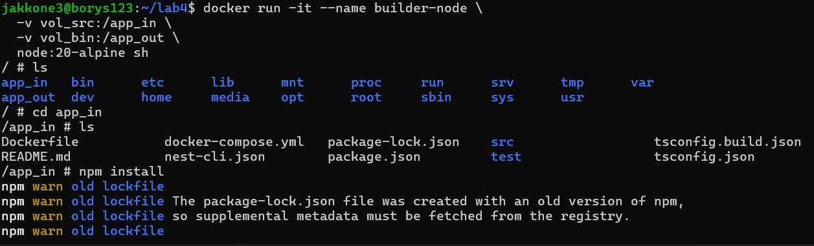

#### 4: Sprawdzono dzialanie kolejnym kontenerem z woluminem wyjsciowym
```bash
docker run -it --rm -v vol_bin:/check alpine
ls check 
```


#### 5: Zrobienie jesze raz tego samego tym razem bez kontenera pomocniczego
```bash
docker run -it --rm -v vol_bin_v2:/app_out node:20-alpine sh
apk add git
git clone https://github.com/daksh019/urlShortener.git
npm install
cp -r . /app_out
```


#### 6: Sprawdzenie co zostało w woluminie wyjsciowym
```bash
docker run --rm -v vol_bin_v2:/check alpine ls -l /check
```
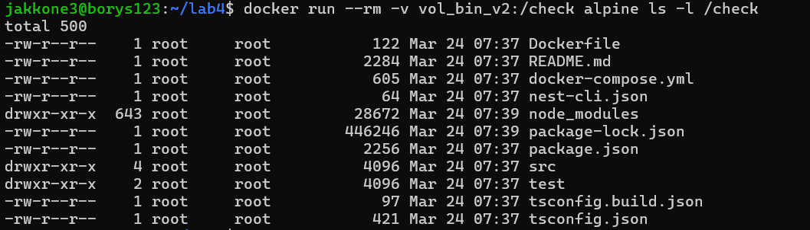

#### Wnioski części 1:
- Woluminy Dockera to trwałe magazyny danych, które mogą być współdziel
one między kontenerami. Pozwalają one na zachowanie stanu i danych nawet po usunięciu kontenera.
- Użycie kontenera pomocniczego to metoda najbardziej przenośna. Nie zależy od plików na hoście, a cały proces odbywa się wewnątrz ekosystemu Docker. Użycie woluminów pozwala na trwałe przechowywanie wyników budowania poza cyklem życia kontenera.

### Eksponowanie portu i łączność między kontenerami

#### 1: Uruchomiono wewnątrz kontenera serwer iperf
```bash
docker run -d --name iperf-server networkstatic/iperf3 -s
```
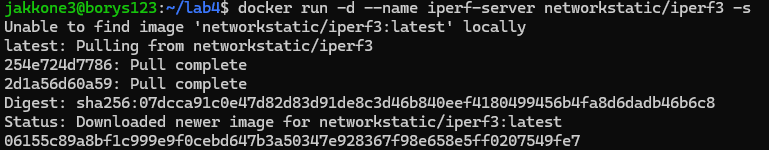

#### 2: Znaleziono IP kontenera
```bash
docker inspect iperf-server
```
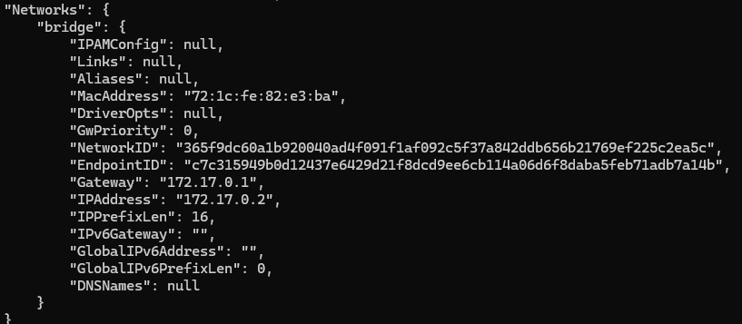

#### 3: Zbadano łączność z serwerem iperf z innego kontenera
```bash 
docker run --rm networkstatic/iperf3 -c 172.17.0.2
```
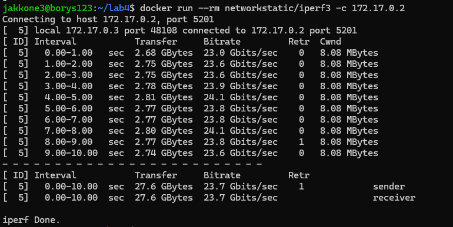

#### 4: Stworzono wlasną sieć i ponownie podlączono kontenery tym razem przy pomocy nazywy
```bash
docker network create moja-siec
docker run -d --name iperf-server-v2 --network moja-siec networkstatic/iperf3 -s
docker run --rm --network moja-siec networkstatic/iperf3 -c iperf-server-v2
```
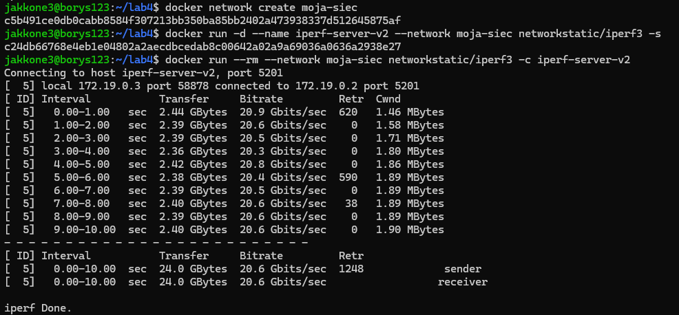

#### 5: Stworzono kontener z otwartym portem i polączono się do niego z hosta (vm) i spoza hosta
```bash
docker run -d --name iperf-exposed -p 5201:5201 networkstatic/iperf3 -s
iperf3 -c localhost
.\iperf3.exe -c 192.168.1.38
```
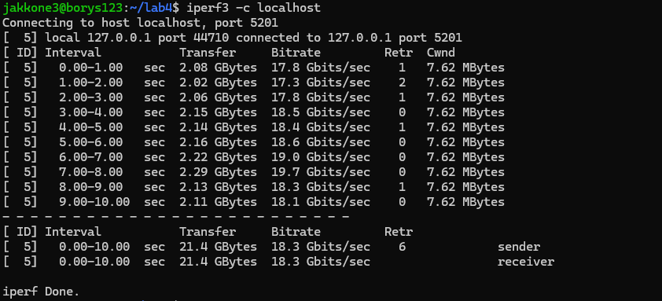
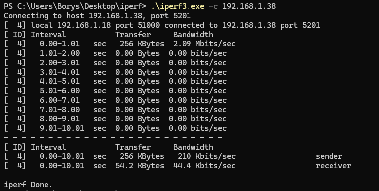

#### 6: Wyciagnieto log z kontenera
```bash
docker logs iperf-exposed > iperf_outside_results.log 2>&1
cat iperf_outside_results.log
```
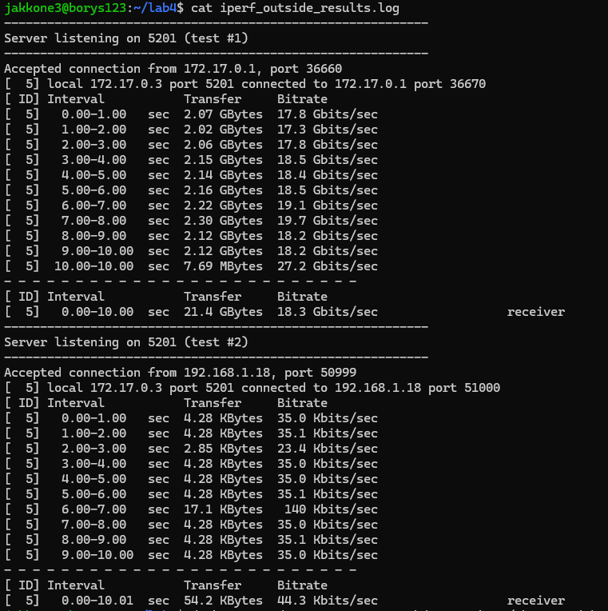

#### Wnioski części 2:
- Docker umożliwia łatwe tworzenie izolowanych sieci, co pozwala na bezpieczną komunikację między kontenerami bez narażania ich na ataki z zewnątrz.
- Eksponowanie portów umożliwia dostęp do usług działających w kontenerach z
poza hosta, ale wiąże się z ryzykiem bezpieczeństwa.
- Własna sieć typu bridge zapewnia wbudowany mechanizm DNS, co pozwala na komunikację między kontenerami za pomocą nazw a nie IP, co jest bardziej elastyczne i odporne na zmiany adresów.
### Usługi w rozumieniu systemu, kontenera i klastra

#### 1: Uruchomiono kontener z SSH i polaczono się do niego z hosta

```bash
docker run -d -P --name test_sshd rastasheep/ubuntu-sshd
ssh root@127.0.0.1 -p 32768
```

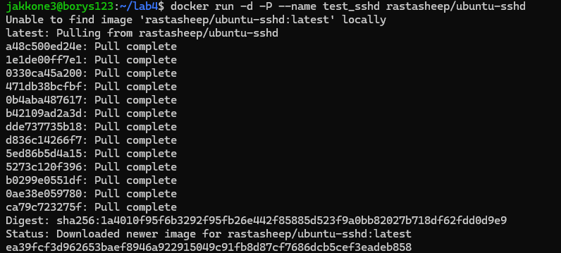
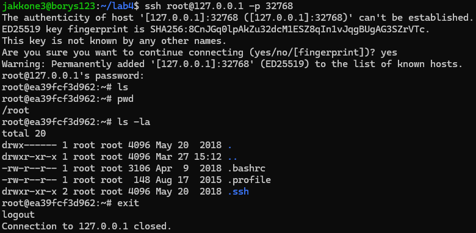

#### Zalety:
- Umożliwia zdalne zarządzanie kontenerem.
#### Wady:
- Kontener powinien uruchamiać tylko jeden proces. Dodanie SSHD zmusza do zarządzania użytkownikami, hasłami i kluczami wewnątrz obrazu, co zwiększa podatność na ataki.

- Każdy proces SSH to dodatkowe zużycie RAM i CPU.

- Docker posiada natywne narzędzie docker exec -it <name> bash, które daje dostęp do terminala bez potrzeby instalowania serwera SSH.

#### Wnioski części 3:
- SSH ułatwia dostęp klasycznymi narzędziami, zwiększa jednak prawdopodobieństwo ataku i zużycie zasobów.

### Przygotowanie do uruchomienia serwera Jenkins

#### 1:Stworzono voluminy dla jenkinsa i certyfikatów dockera
```bash
docker volume create jenkins-docker-certs
docker volume create jenkins-data
```

#### 2: Uruchomienie Docker-in-Docker
```bash
docker run --name jenkins-docker --detach \
  --privileged --network moja-siec --network-alias docker \
  --env DOCKER_TLS_CERTDIR=/certs \
  --volume jenkins-docker-certs:/certs/client \
  --volume jenkins-data:/var/jenkins_home \
  --publish 2376:2376 \
  docker:dind --storage-driver overlay2
```

#### 3: Uruchomienie Jenkinsa
```bash
docker run --name jenkins-blueocean --detach \
  --network moja-siec --env DOCKER_HOST=tcp://docker:2376 \
  --env DOCKER_CERT_PATH=/certs/client --env DOCKER_TLS_VERIFY=1 \
  --publish 8080:8080 --publish 50000:50000 \
  --volume jenkins-data:/var/jenkins_home \
  --volume jenkins-docker-certs:/certs/client:ro \
  jenkins/jenkins:lts
```

#### 4: Znalezione haslo dla jenkinsa
```bash
docker logs jenkins-blueocean
```
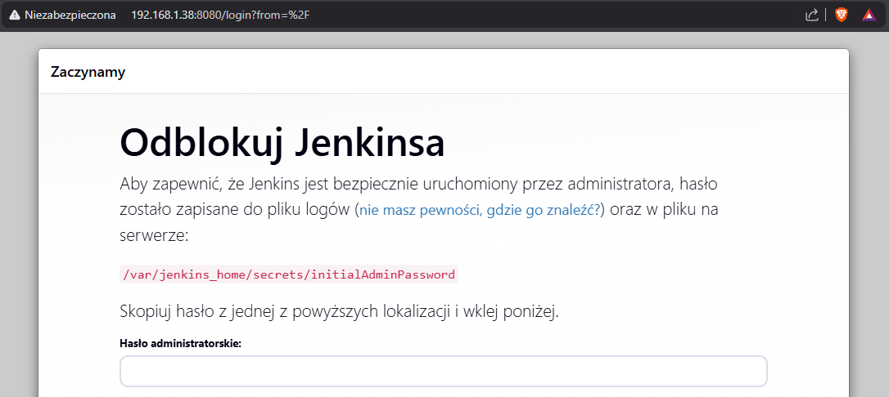

#### 5: Weryfikacja dzialania jenkinsa

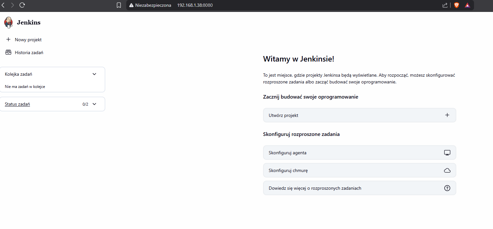
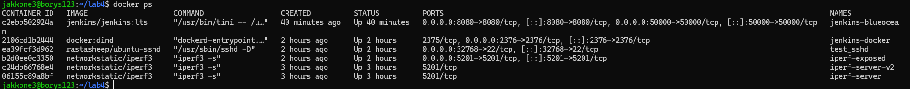


