# Sprawozdanie

## Laboratorium 5

### Przygotowanie

#### 1:Stworzono voluminy dla jenkinsa i certyfikatów dockera
```bash
docker volume create jenkins-docker-certs
docker volume create jenkins-data
```

#### 2: Uruchomienie Docker-in-Docker
```bash
docker run --name jenkins-docker --detach \
  --privileged --network moja-siec --network-alias docker \
  --env DOCKER_TLS_CERTDIR=/certs \
  --volume jenkins-docker-certs:/certs/client \
  --volume jenkins-data:/var/jenkins_home \
  --publish 2376:2376 \
  docker:dind --storage-driver overlay2
```

#### 3: Uruchomienie Jenkinsa
```bash
docker run --name jenkins-blueocean --detach \
  --network moja-siec --env DOCKER_HOST=tcp://docker:2376 \
  --env DOCKER_CERT_PATH=/certs/client --env DOCKER_TLS_VERIFY=1 \
  --publish 8080:8080 --publish 50000:50000 \
  --volume jenkins-data:/var/jenkins_home \
  --volume jenkins-docker-certs:/certs/client:ro \
  jenkins/jenkins:lts
```


#### 4: Znalezione haslo dla jenkinsa
```bash
docker logs jenkins-blueocean
```


### Zadanie wstępne: uruchomienie

#### 1: Zadanie 1 uname

Utworzono projekt ogólny
W sekcji add build step dodano:
```bash
uname -a
uptime
```

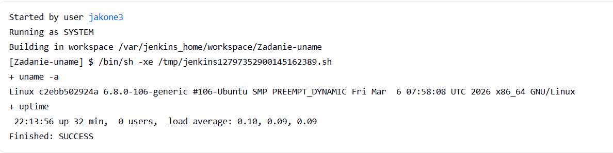

#### 2: Zadanie 2 godzina
Utworzono projekt ogólny
W sekcji add build step dodano:

```bash
HOUR=$(date +%H)
echo "godzina: $HOUR"

if [ $((HOUR % 2)) -ne 0 ]; then
    echo "nieparzysta"
    exit 1
else
    echo "parzysta"
    exit 0
fi
```


#### 3: Zadanie 3 ubuntu
Utworzono projekt ogólny
W sekcji add build step dodano:

```bash 
docker pull ubuntu:latest
docker images | grep ubuntu
```
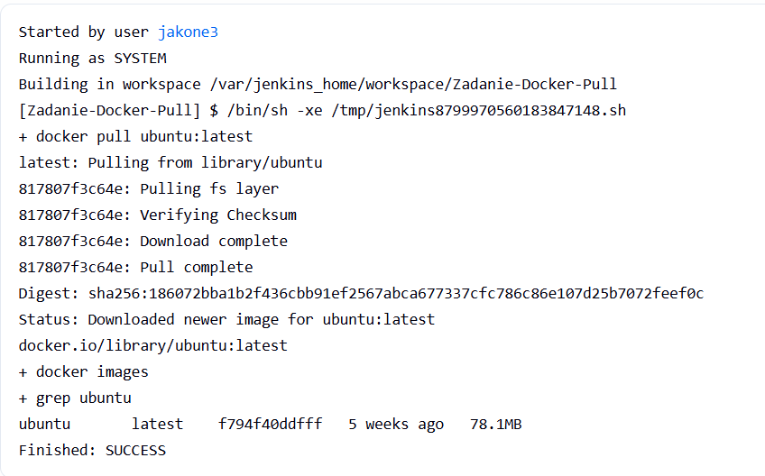

### Zadanie wstępne: obiekt typu pipeline

Utworzone obiekt typu pipeline
W sekcji skrypt dodano:
```dockerfile
pipeline {
    agent any

    environment {
        IMAGE_NAME = "url-shortener-builder"
        DOCKERFILE_PATH = "ITE/GCL3/JK417545/lab3/Dockerfile.build"
    }

    stages {
        stage('Checkout Repo') {
            steps {
                git branch: 'JK417545', 
                    url: 'https://github.com/InzynieriaOprogramowaniaAGH/MDO2026s_ITE.git'
            }
        }

        stage('Build Image') {
            steps {
                script {
                    sh "docker build -t ${IMAGE_NAME} -f ${DOCKERFILE_PATH} ."
                }
            }
        }

        stage('Verify Build') {
            steps {
                sh "docker images | grep ${IMAGE_NAME}"
            }
        }
    }
}
```
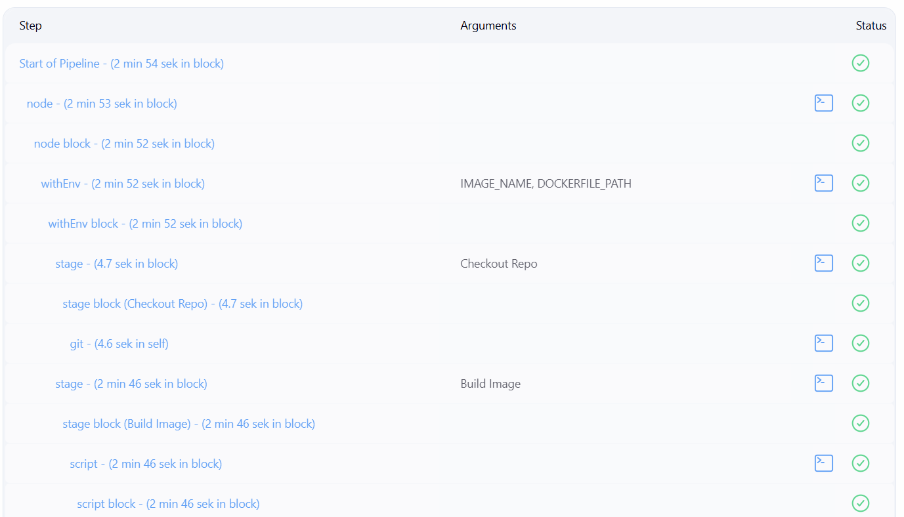
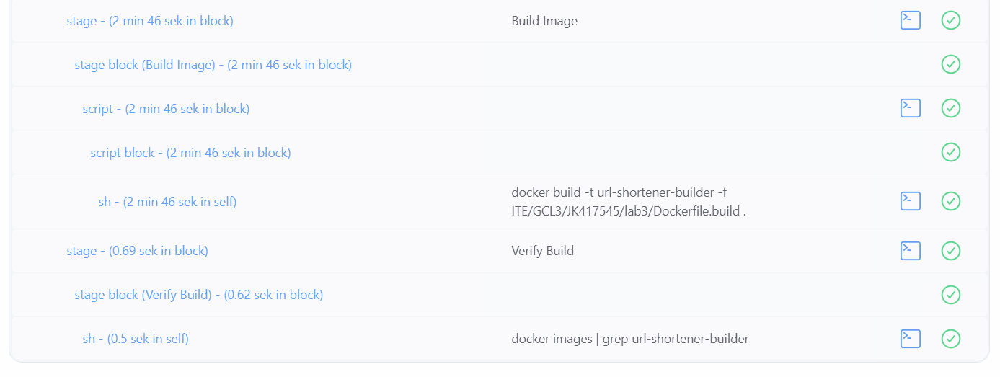

### Wnioski laboratorium 5
- Implementacja Docker-in-Docker wykazala skuteczność architektury w której Jenkins uruchomiony w kontenerze może zarządzać operacjami Dockera dzięki komunikacji z dedykowanym kontenerem jenkins-docker.

- Pipeline umożliwia pełną kontrolę nad środowiskiem, pobieraniem kodu z repozytorium oraz budowaniem obrazów w sposób powtarzalny i przejrzysty dla innych.

- Udany proces budowania obrazu wewnatrz potoku Pipeline potwierdza że środowisko Jenkinsa zostalo poprawnie skonfigurowane do obslugi zadań związanych z konteneryzacją. 


## Laboratorium 6

### Przygotowanie do pipelinu Jenkins

#### 1:Stworzono fork repozytorium projektu

Oryginalna aplikacja posiadała wpisany na sztywno adres połączenia z bazą danych. Zastąpiono statyczny ciąg połączenia zmienną środowiskową, którą można sterować z poziomu pliku docker-compose.yml, umożliwiając elastyczne konfigurowanie połączenia do bazy danych w różnych środowiskach.

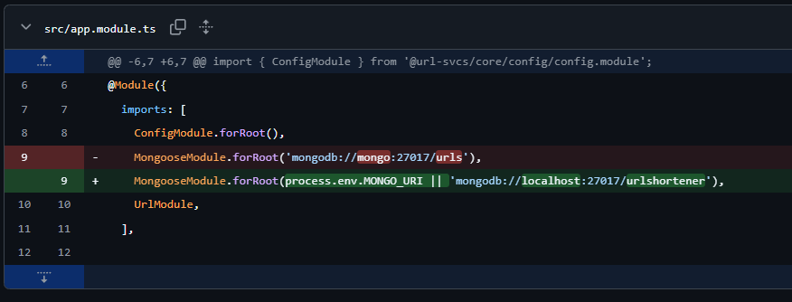

#### 2:Poprawiono docker-compose.yml

Mój docker-compose z poprzednich laboratoriów nie uwzględniał drugiego serwisu z bazą danych co bylo krytycznym blędem. Poprawiono plik docker-compose.yml, dodając serwis bazy danych oraz konfigurując sieć, aby oba serwisy mogły się ze sobą komunikować. Dodatkowo rozdzielono infrastrukturę na dwa niezależne pliki docker-compose. Pozwala to na uniknięcie konfliktów portów oraz zapewnia czystość danych.

docker-compose.deploy.yml: Wykorzystany w etapie Deploy i Smoke Test
```yaml 
version: '3.8'
services:
  url-svc:
    build:
      context: .
      dockerfile: Dockerfile.runtime
    image: url-shortener-deploy
    container_name: url-svc-prod
    ports:
      - '3000:3000'
    depends_on:
      - mongo
    environment:
      - MONGO_URI=mongodb://mongo:27017/urlshortener
  mongo:
    image: mongo:4.2.1
    hostname: mongo
    restart: always
```

docker-compose.test.yml: Wykorzystywany do unit testów
```yaml
version: '3.8'
services:
  app-test:
    build:
      context: .
      dockerfile: Dockerfile.test
    image: url-shortener-tester
    depends_on:
      - mongo
    environment:
      - MONGO_URI=mongodb://mongo:27017/urlshortener
  mongo:
    image: mongo:4.2.1
    hostname: mongo
```


#### 3: Optymalizacja obrazów: Builder i Runtime
Pierwotnie obraz aplikacji był bardzo ciężki, zawierał kod źródłowy, kompilatory TypeScripta i wszystkie zależności devDependencies.
Zastosowano podejście rozdzielenia kontenera budującego od produkcyjnego.
- Builder: Zawiera wszystkie narzędzia potrzebne do budowania aplikacji, w tym kompilatory i zależności deweloperskie.
- Runtime: Zawiera tylko skompilowany kod i minimalne zależności potrzebne do uruchomienia aplikacji, co znacznie zmniejsza rozmiar obrazu i poprawia bezpieczeństwo.

Dockerfile.build:
```dockerfile
FROM node:20-alpine
RUN apk add --no-cache git
WORKDIR /app
RUN git clone https://github.com/SzymonJednorozec/devops_urlShortener.git .
RUN npm install
RUN npm run build
```
Dockerfile.runtime:
```dockerfile
FROM node:20-alpine
WORKDIR /app
COPY --from=url-shortener-builder /app/package*.json ./
RUN npm install --omit=dev --legacy-peer-deps
COPY --from=url-shortener-builder /app/dist ./dist
CMD ["node", "dist/main"]
```

#### 4. publish.sh
Głównym celem skryptu jest izolacja procesu budowania artefaktu od środowiska Jenkinsa

```bash
#!/bin/bash

BUILD_IMAGE=$1

echo "------------------------------------------"
echo "Starting Publish process..."

docker run --rm -v $(pwd):/out $BUILD_IMAGE cp -r /app/package.json /app/dist /out/
docker run --rm -v $(pwd):/out -w /out node:20-alpine npm pack

echo "Package created successfully."
echo "------------------------------------------"
```

### Blędy przy budowaniu pipeline

#### 1. Błąd: docker-compose: not found
Jenkins przerywał pracę z komunikatem script returned exit code 127, Oficjalny obraz Jenkinsa domyślnie nie posiada binarnego pliku docker-compose. Jenkins próbował wykonać komendę na powłoce kontenera, która jej nie znała.


Rozwiązanie: Zainstalowano ręcznie docker-compose w kontenerze Jenkinsa:
```bash
docker exec -u 0 -it jenkins-blueocean bash

mkdir -p /usr/local/lib/docker/cli-plugins/
curl -SL https://github.com/docker/compose/releases/download/v2.24.5/docker-compose-linux-x86_64 -o /usr/local/lib/docker/cli-plugins/docker-compose

chmod +x /usr/local/lib/docker/cli-plugins/docker-compose

ln -s /usr/local/lib/docker/cli-plugins/docker-compose /usr/bin/docker-compose

docker-compose version
exit
```

#### 2. Błąd "Connection Refused"
Etap Smoke Test kończył się niepowodzeniem przy próbie wykonania komendy:
```bash
curl -v http://localhost:3000/url/tinyUrl.
```
W logach widniał komunikat: Failed to connect to localhost port 3000: Connection refused.

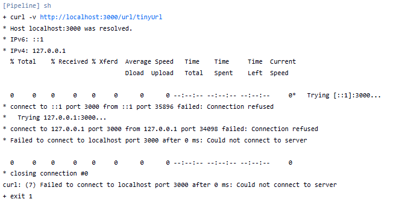

Błąd wynikał z błędnego założenia, że aplikacja uruchomiona przez docker-compose będzie dostępna dla Jenkinsa na adresie localhost. W rzeczywistości, ponieważ Jenkins działa w kontenerze, localhost odnosi się do samego kontenera Jenkinsa, a nie do hosta, na którym działa docker-compose.
Rozwiązanie: Należało zmienić adres docelowy z localhost na hosta, który w architekturze DinD reprezentuje maszynę uruchamiającą kontenery.

Rozwiązanie:

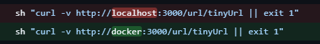

#### 3. Błąd: URL not resolved! HTTP Status: 404
Smoke Test zwracał {"statusCode":404,"message":"Cannot GET /url/tinyUrl"}.
Aplikacja Nest.js domyślnie oczekiwała żądania typu POST z body (tworzenie linku), a curl domyślnie wysyłał GET. Poprawiono skrypt testowy tak, aby najpierw tworzył zasób (POST), a następnie weryfikował jego istnienie.


smoke_test.sh:
```bash
#!/bin/bash

URL_FILE=$1
APP_URL="http://docker:3000"

if [ ! -f "$URL_FILE" ]; then
    echo "ERROR: File $URL_FILE not found!"
    exit 1
fi

while read -r url || [ -n "$url" ]; do
    [ -z "$url" ] && continue
    echo "------------------------------------------"
    echo "Testing URL: $url"
    
    # upewniamy się że żądanie jest typu POST  ////////////////////////////////////////////////////////////
    RESPONSE=$(curl -s -X POST "$APP_URL/url/tinyUrl" \
        -H 'Content-Type: application/json' \
        -d "{\"longUrl\": \"$url\"}")
    #//////////////////////////////////////////////////////////////////////////////////////////////////////

    SHORT_CODE=$(echo "$RESPONSE" | sed 's/.*[\/]\([^"]*\)".*/\1/')
    
    if [ -z "$SHORT_CODE" ] || [[ "$SHORT_CODE" == *"{"* ]]; then
        echo "ERROR: Failed to parse short code!"
        echo "Full Response: $RESPONSE"
        exit 1
    fi
    
    echo "Generated code: $SHORT_CODE"

    CHECK=$(curl -s -o /dev/null -w "%{http_code}" "$APP_URL/url/tinyUrl/$SHORT_CODE")
    
    if [ "$CHECK" != "200" ]; then
        echo "ERROR: URL $url (code $SHORT_CODE) not resolved! HTTP Status: $CHECK"
        echo "Attempted URL: $APP_URL/url/tinyUrl/$SHORT_CODE"
        exit 1
    fi
    
    echo "SUCCESS: $url resolved correctly."
done < "$URL_FILE"

echo "------------------------------------------"
echo "ALL TESTS PASSED SUCCESSFULLY"
exit 0
```

### Pipeline Jenkins (Finalny pipeline na samym końcu sprawozdania)

``` Groovy
pipeline {
    agent any

    environment {
        FILES_DIR = "ITE/GCL3/JK417545/url_shortener_files"
        BUILD_IMAGE = "url-shortener-builder"
        DEPLOY_IMAGE = "url-shortener-deploy"
    }

    stages {
        stage('Checkout') {
            steps {
                git branch: 'JK417545', 
                    url: 'https://github.com/InzynieriaOprogramowaniaAGH/MDO2026s_ITE.git'
            }
        }

        stage('Build Builder') {
            steps {
                dir("${FILES_DIR}") {
                    sh "docker build -t ${BUILD_IMAGE} -f Dockerfile.build ."
                }
            }
        }

        stage('Run Unit Tests') {
            steps {
                dir("${FILES_DIR}") {
                    sh "docker-compose -f docker-compose.test.yml up --exit-code-from app-test"
                }
            }
            post {
                always {
                    dir("${FILES_DIR}") {
                        sh "docker-compose -f docker-compose.test.yml down -v"
                    }
                }
            }
        }

        stage('Build Runtime Image') {
            steps {
                dir("${FILES_DIR}") {
                    sh "docker build -t ${DEPLOY_IMAGE} -f Dockerfile.runtime ."
                }
            }
        }

        stage('Deploy & Smoke Test') {
            steps {
                dir("${FILES_DIR}") {
                    sh "docker-compose -f docker-compose.deploy.yml up -d"
                    sh "sleep 15"
                    sh "chmod +x smoke_test.sh"
                    sh "./smoke_test.sh list.url"
                }
            }
            post {
                always {
                    dir("${FILES_DIR}") {
                        sh "docker-compose -f docker-compose.deploy.yml down -v"
                    }
                }
            }
        }

        stage('Publish Artifact') {
            steps {
                dir("${FILES_DIR}") {
                    sh "chmod +x publish.sh"
                    sh "./publish.sh ${BUILD_IMAGE}"
                    archiveArtifacts artifacts: '*.tgz', fingerprint: true
                }
            }
        }
    }

    post {
        success {
            echo "Pipeline Success!"
        }
        failure {
            echo "Pipeline Failure. Check logs."
        }
    }
}
```
### Diagram UML i wyjaśnienie pipeline
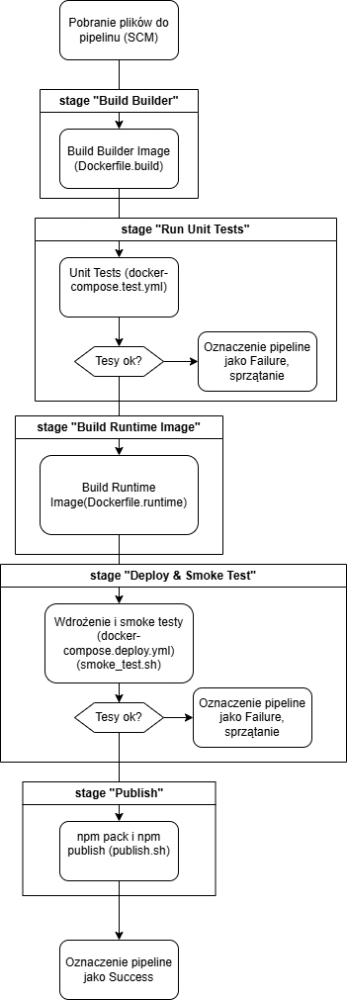

Pipeline został zaprojektowany tak, aby każdy build odbywał się w izolacji, co gwarantuje powtarzalność wyników. Proces dzieli się na trzy główne fazy:

#### 1. Budowa i weryfikacja (Build & Unit Test)

- Najpierw tworzony jest obraz Builder, który kompiluje kod źródłowy.

- Następnie uruchamiane są testy jednostkowe przy pomocy docker-compose. Tutaj tworzona jest tymczasowa sieć i kontener z bazą danych (MongoDB), aby testy mogły sprawdzić logikę aplikacji w warunkach rzeczywistych. Po zakończeniu testów, kontenery pomocnicze są natychmiast niszczone (down -v), aby zwolnić zasoby.

#### 2. Wdrożenie sandboxowe (Deploy & Smoke Test)

- Tworzymy środowisko tymczasowe (sandbox).

- Za pomocą docker-compose uruchamiamy główny kontener aplikacji oraz wszystkie usługi pomocnicze (bazę danych).

- Gdy środowisko wstanie, skrypt smoke_test.sh wykonuje zapytania HTTP, sprawdzając, czy aplikacja faktycznie żyje i rozmawia z bazą.

- Sprzątanie: Po teście całe środowisko sandboxowe jest niszczone. Dzięki temu mamy pewność, że artefakt działa, a jednocześnie nie zostawiamy śmieci na serwerze Jenkinsa.

#### 3. Dystrybucja (Publish)

- Dopiero gdy powyższe kroki zakończą się sukcesem, rurociąg przechodzi do publikacji.

- Tworzony jest ostateczny artefakt .tgz, który trafia do archiwum Jenkinsa oraz do publicznego rejestru NPM.js.


## Laboratorium 7

### Poprawa pipeline 

#### 1. Przepis dostarczany z SCM
Zamiast ręcznie wklejać pipeline do Jenkinsa, skonfigurowano go tak, aby pobierał definicję pipeline bezpośrednio z repozytorium Git. Każda zmiana w pliku Jenkinsfile jest automatycznie uwzględniana przy każdym buildzie.

Ponieważ często pojawialy się poprawki postanowilem stworzyć specjalne repozytorium, które będzie zawieralo tylko pliki potrzebne do pipeline. Dzięki temu praca nad pipelinem była prostsza i przy okazji nie pobieramy całego repozytorium przedmiotowego przy każdym buildzie, co oszczędza czas i zasoby.
https://github.com/SzymonJednorozec/devops_urls_test

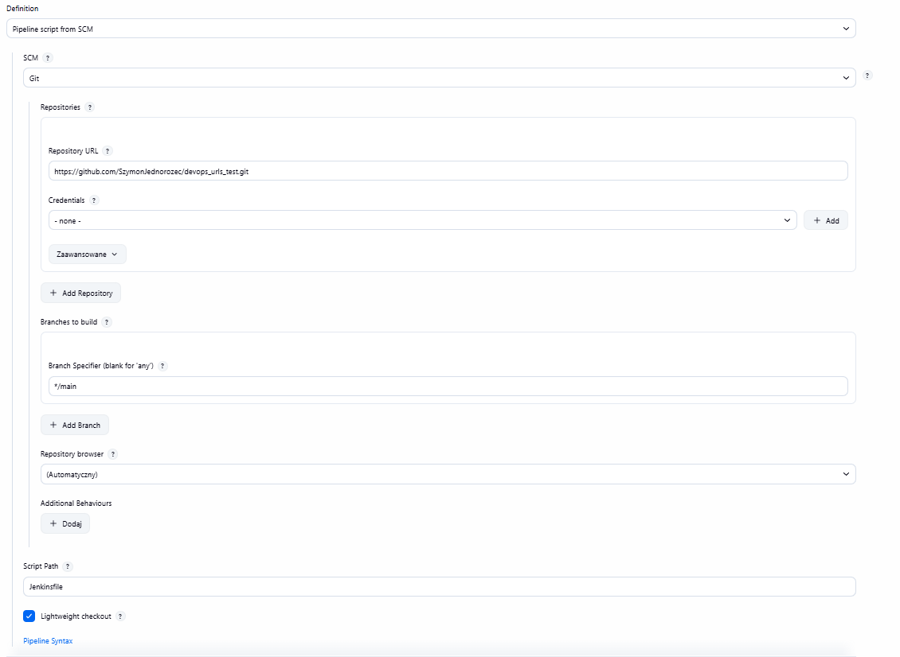

#### 2. Cacheowany kod
Stage Build Builder i Build Runtime Image skorzystały z mechanizmu cache'owania warstw Dockera. Co doprowadzilo do krytycznego błędu, ponieważ zmiany w kodzie źródłowym nie były odzwierciedlane w cache'u, co powodowało, że pipeline zawsze korzystał z poprzedniej wersji aplikacji. 

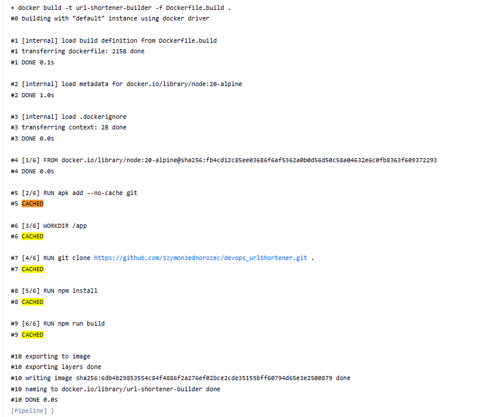

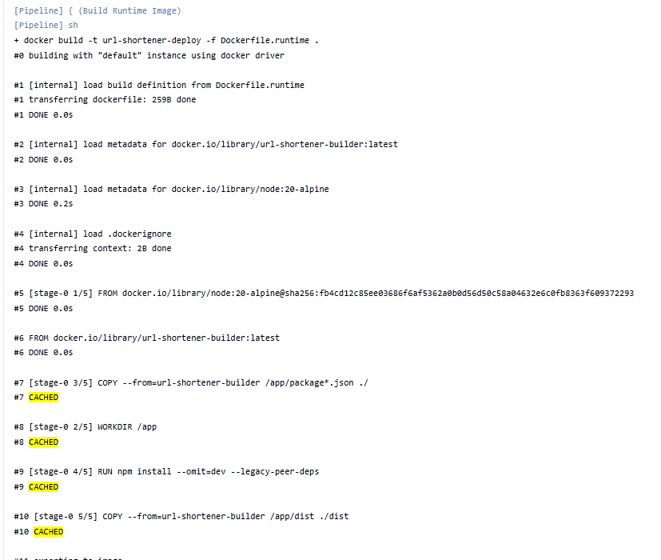


Aby rozwiązać ten problem, dodano argument --no-cache do komendy docker build, wymuszając pełne przebudowanie obrazu przy każdej zmianie.

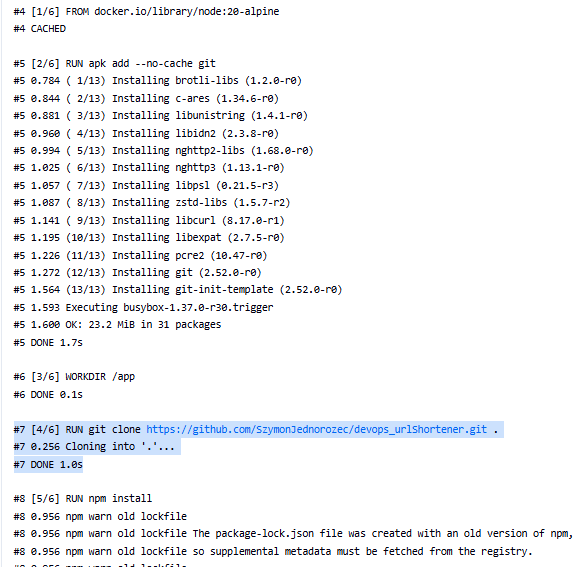

Pobranie obrazu jest CACHED ponieważ kontener DinD nie został zrestartowany, więc obraz jest dostępny lokalnie. Jest to dobre ponieważ oszczędza czas i zasoby.

#### 3. Publish do NPM.js
Zmieniono nazwę w package.json ponieważ "url-shortener" może być już zajęty.

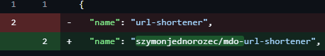
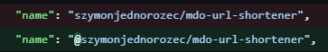

Stworzono konto na NPM.js i wygenerowano access token, który jest przechowywany jako sekret text w Jenkinsie.
Zmodyfikowano skrypt publish.sh, aby publikował paczkę do NPM.js. Skrypt teraz przy pomocy access tokenu automatycznie loguje się do NPM, tworzy paczkę i publikuje ją.

```bash
#!/bin/bash
BUILD_IMAGE=$1

echo "------------------------------------------"
echo "Starting Publish to NPM.js process..."

docker run --rm -v $(pwd):/out $BUILD_IMAGE cp -r /app/package.json /app/dist /out/

docker run --rm -v $(pwd):/out -w /out node:20-alpine sh -c "
  echo '//registry.npmjs.org/:_authToken=${NPM_TOKEN}' > .npmrc
  npm publish --access public
"

echo "------------------------------------------"
```

Zmodifikowano pipeline, aby przekazywał sekret NPM_TOKEN do skryptu publish.sh podczas etapu Publish Artifact.
```groovy
stage('Publish Artifact') {
            steps {
                dir("${FILES_DIR}") {
                    withCredentials([string(credentialsId: 'NPM_TOKEN', variable: 'NPM_TOKEN')]) {
                        sh "chmod +x publish.sh"
                        sh "./publish.sh ${BUILD_IMAGE}"
                    }
                    archiveArtifacts artifacts: '*.tgz', fingerprint: true
                }
            }
        }
```

Napotkane problemy:

- Błąd 403 (2FA): Napotkano problem z autoryzacją dwuskładnikową. Rozwiązaniem było użycie Access Tokena który pozwala na pominięcie 2FA.

- Immutability wersji: Zaobserwowano, że raz użyta wersja w NPM nawet po unpublish nie może zostać użyta ponownie. Wymusiło to ścisłe przestrzeganie wersji artefaktu.

#### 4. Weryfikacja pipeline

Po finalnych poprawkach w skryptach, rurociąg CI/CD realizuje podwójną ścieżkę publikacji artefaktu: lokalną wewnątrz Jenkinsa oraz zewnętrzną rejestr NPM.js.

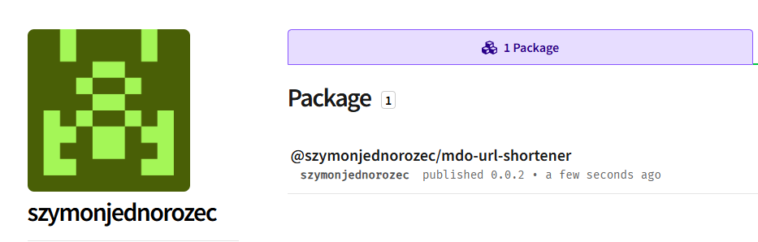
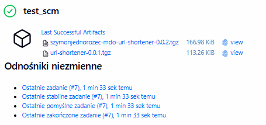


### "Definition of done"

#### 1. Czy opublikowany obraz może być pobrany z Rejestru i uruchomiony w Dockerze bez modyfikacji (acz potencjalnie z szeregiem wymaganych parametrów, jak obraz DIND)? Nie chcemy posyłać w świat czegoś, co działa tylko u nas!

Tak. Obraz url-shortener-deploy jest samowystarczalny.

- Zawiera w sobie wszystkie biblioteki node_modules i skompilowany kod. Nie wymaga instalowania Node.js na maszynie hosta.

- Jedynym wymaganiem jest podanie parametrów połączenia do bazy danych..

Działanie: Użytkownik końcowy musi jedynie wykonać docker run -e MONGO_URI=... url-shortener-deploy.

#### 2. Czy dołączony do jenkinsowego przejścia artefakt, gdy pobrany, ma szansę zadziałać od razu na maszynie o oczekiwanej konfiguracji docelowej?
Tak, pod warunkiem posiadania środowiska uruchomieniowego (Node.js). * Standard NPM: Paczka .tgz została przygotowana zgodnie ze standardem npm pack.Zawiera poprawną strukturę katalogów oraz plik package.json z listą zależności.

- Instalacja: Użytkownik docelowy po pobraniu paczki wykonuje komendę npm install ./nazwa-paczki.tgz. Menedżer pakietów automatycznie dociągnie wymagane biblioteki.

- Gotowość: Skrypt startowy (main.js) jest już skompilowany do czystego JavaScriptu, więc maszyna docelowa nie musi posiadać kompilatora TypeScript. Wymagana jest jedynie konfiguracja bazy danych (np. przez plik .env lub zmienne systemowe).

## Wnioski
Zdecydowano, że aplikacja url-shortener będzie dystrybuowana w jako wersjonowana paczka .tgz. Wybór formatu .tgz pozwala na przesyłanie lekkiego, skompilowanego kodu JavaScript (folder dist) bez konieczności dołączania ciężkich plików źródłowych TypeScript czy narzędzi deweloperskich. Jest to format gotowy do wdrożenia, który można zainstalować na dowolnym serwerze produkcyjnym komendą npm install.

Przeprowadzony Smoke Test udowodnił, że:

- Artefakt wygenerowany w etapie Build jest kompletny i aplikacja poprawnie wstaje w środowisku pozbawionym kompilatora tsc.

- Komunikacja sieciowa z bazą danych MongoDB wewnątrz sieci Dockera przebiega bez zakłóceń, potwierdzone poprawnym zapisem i odczytem skróconych linków.

### Podsumowanie

- Powtarzalność i Izolacja: Dzięki wykorzystaniu agentów Dockerowych i flagi --no-cache, każde uruchomienie potoku odbywa się w identycznym, czystym środowisku, co eliminuje błędy typu "u mnie działa".

- Weryfikacja: Każdy build przechodzi testy jednostkowe oraz testy integracyjne , co gwarantuje, że do rejestru trafia wyłącznie działające oprogramowanie.

- Dystrybucja: Artefakt jest dostępny zarówno lokalnie w Jenkinsie, jak i w globalnym rejestrze NPM.js.

## Pipeline

``` Groovy
pipeline {
    agent any

    environment {
        // FILES_DIR = "ITE/GCL3/JK417545/url_shortener_files"
        FILES_DIR = "."
        BUILD_IMAGE = "url-shortener-builder"
        DEPLOY_IMAGE = "url-shortener-deploy"
    }

    stages {

        stage('Build Builder') {
            steps {
                dir("${FILES_DIR}") {
                    sh "docker build --no-cache -t ${BUILD_IMAGE} -f Dockerfile.build ."
                }
            }
        }

        stage('Run Unit Tests') {
            steps {
                dir("${FILES_DIR}") {
                    sh "docker-compose -f docker-compose.test.yml up --exit-code-from app-test"
                }
            }
            post {
                always {
                    dir("${FILES_DIR}") {
                        sh "docker-compose -f docker-compose.test.yml down -v"
                    }
                }
            }
        }

        stage('Build Runtime Image') {
            steps {
                dir("${FILES_DIR}") {
                    sh "docker build --no-cache -t ${DEPLOY_IMAGE} -f Dockerfile.runtime ."
                }
            }
        }

        stage('Deploy & Smoke Test') {
            steps {
                dir("${FILES_DIR}") {
                    sh "docker-compose -f docker-compose.deploy.yml up -d"
                    sh "sleep 15"
                    sh "chmod +x smoke_test.sh"
                    sh "./smoke_test.sh list.url"
                }
            }
            post {
                always {
                    dir("${FILES_DIR}") {
                        sh "docker-compose -f docker-compose.deploy.yml down -v"
                    }
                }
            }
        }

        stage('Publish Artifact') {
            steps {
                dir("${FILES_DIR}") {
                    withCredentials([string(credentialsId: 'NPM_TOKEN', variable: 'NPM_TOKEN')]) {
                        sh "chmod +x publish.sh"
                        sh "./publish.sh ${BUILD_IMAGE}"
                    }
                    archiveArtifacts artifacts: '*.tgz', fingerprint: true
                }
            }
        }
    }

    post {
        success {
            echo "Pipeline Success!"
        }
        failure {
            echo "Pipeline Failure. Check logs."
        }
    }
}
```