## Laboratorium 8

### Instalacja zarządcy Ansible

#### 1: Utworzono drugą maszynę wirtualną
Ze względu na obawę że mój laptop na którym do tej pory działałem może nie poradzić sobie z uruchomieniem dwóch maszyn wirtualnych, zdecydowalem przenieść się na komputer stacjonarny, tam od nowa utworzylem 2 maszyny wirtualne


Maszyny hostowane są na vmware_workstation:
- Zarządca - Ubuntu 24.04 server 4GB RAM, 2 vCPU, 32GB HDD (skonfigurowano wszystkie narzędzia z którymi do tej pory dzialaliśmy)
- Target - Fedora 43 server 2GB RAM, 1 vCPU, 20GB HDD

Target:


Zarządca:
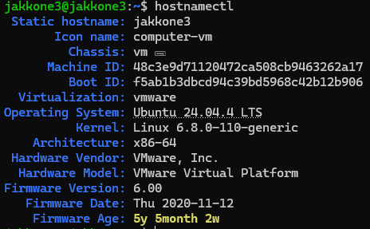

Na targecie sprawdzono obecność tar i odblokowano ssh
```bash
sudo systemctl enable --now sshd
sudo firewall-cmd --add-service=ssh --permanent
sudo firewall-cmd --reload

tar --version
```

#### 2: Snapshot
Po upewnieniu się że wszystko działa poprawnie, utworzono snapshot targetu


#### 3: Instalacja Ansible i wymiana kluczy SSH
Zainstalowano Ansible na zarządcy
```bash
sudo apt update
sudo apt install ansible -y
```

Wyegenerowano i przesłano klucze SSH z zarządcy do targetu
```bash
ssh-keygen -t rsa -b 4096
ssh-copy-id ansible@192.168.219.131
```

Przetestowano połączenie
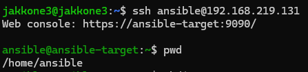

### Inwentaryzacja
#### 1: Wprowadzono nazwy DNS na Zarządcy w /etc/hosts
Wprowadzono nazwy
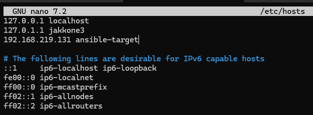

Zweryfikowano działanie
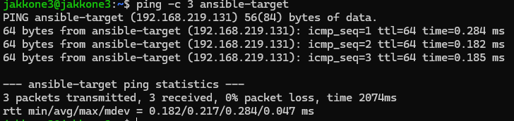

#### 2: Plik inwentaryzacyjny Ansible

Utworzono plik inwentaryzacyjny Ansible 


Zweryfikowano działanie wysyłając ping do wszystkich maszyn


### Zdalne wywoływanie procedur

#### 1. Utworzono playbook Ansible

```yml
---
- name: Zadania Ansible Lab
  hosts: all
  become: yes
  tasks:
    - name: Ping
      ping:

    - name: Kopiowanie inwentarza
      copy:
        src: ./inventory.ini
        dest: /home/ansible/inventory_backup.ini

    - name: Aktualizacja i restart sshd
      shell: |
        dnf update -y
        systemctl restart sshd
      when: inventory_hostname != 'localhost'
```

#### 2. Uruchomiono playbook pierwszy raz

```bash
ansible-playbook -i inventory.ini tasks.yml --ask-become-pass
```

Po wpisaniu hasła


Przy pierwszym wywołaniu Ansible wykrywa, że systemy docelowe znajdują się w stanie odbiegającym od definicji w playbooku.
Status changed: Widoczny przy zadaniu kopiowania oraz aktualizacji, oznacza, że Ansible faktycznie wykonał pracę (przesłał plik, wywołał menedżer pakietów).

#### 3. Drugie uruchomienie

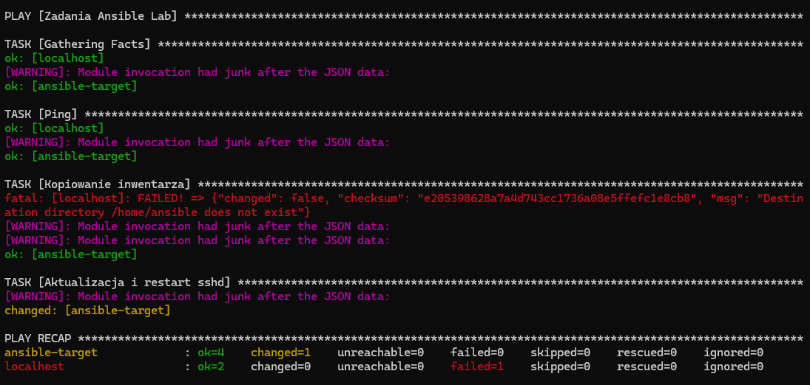

Ansible używa dedykowanego modułu copy, po ponownym uruchomieniu playbooka ansible przed przesłaniem pliku sprawdza jego sumę kontrolną na obu maszynach. Ponieważ plik na Fedorze był identyczny z lokalnym, ansible pominął kopiowanie i zwrócił status ok. Aktualizacja systemu wykonała się ponownie, ponieważ użyłem modułu shell. W przeciwieństwie do modułów dedykowanych, moduł shell nie potrafi sam ocenić, czy stan pożądany został już osiągnięty dlatego licznik changed nadal wzrasta przy każdym odpaleniu.


#### 4. Trzecie uruchomienie bez ssh na targecie

```bash
sudo systemctl stop sshd
```


Po wyłączeniu serwera SSH na maszynie ansible-target, Ansible raportuje błąd UNREACHABLE. Ansible nie wymaga zainstalowanego agenta na maszynie docelowej, ale jest całkowicie zależny od protokołu SSH. Brak łączności natychmiast przerywa proces dla danego hosta, nie wpływając jednak na wykonanie zadań na pozostałych dostępnych maszynach.

### Zarządzanie stworzonym artefaktem

#### 1. Stworzenie nowej roli na zarządcy

```bash
ansible-galaxy role init url_shortener_deploy
```

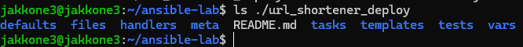

#### 2. Wypelnienie meta/main.yml

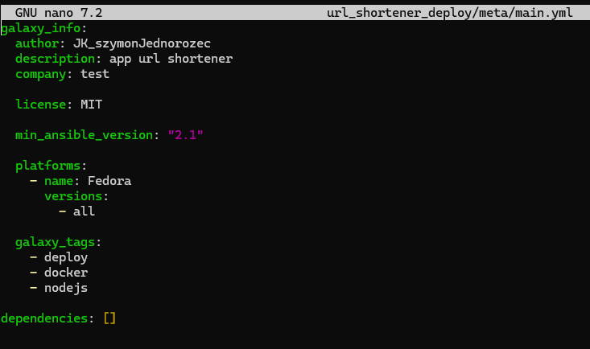

#### 3. Wypelnienie tasks/main.yml

```yml
---


- name: 1. Sanity check sprawdzenie dostepnego miejsca 
  assert:
    that:
      - ansible_memfree_mb > 100
    fail_msg: "Za malo wolnej pamieci"
  ignore_errors: yes

- name: 2. Instalacja Dockera na target (Fedora)
  shell: dnf install -y docker docker-compose

- name: 3. Sprawdzenie czy usluga Docker działa i startuje z systemem
  service:
    name: docker
    state: started
    enabled: yes

- name: 4. Przygotowanie katalogu na targecie
  file:
    path: /home/ansible/app
    state: directory
    mode: '0755'

- name: 5. Przeslanie artefaktu (*.tgz) 
  copy:
    src: ./szymonjednorozec-mdo-url-shortener-0.0.3.tgz       
    dest: /home/ansible/app/url-shortener.tgz
    owner: ansible
    mode: '0644'

- name: 6. Uruchomienie aplikacji w kontenerze Node.js wraz z udostepnieniem i rozpakowaniem artefaktu
  shell: |
    tar -xzf url-shortener.tgz
    
    docker run -d --name url-shortener-running \
      -v /home/ansible/app/package:/src:Z \
      -w /src \
      -p 8081:8080 \
      node:20-alpine sleep 100
  args:
    chdir: /home/ansible/app
    executable: /bin/bash

- name: 7. Weryfikacja poprawnego uruchomienia i obecnosci rozpakowanych plikow (Sanity Check)
  command: docker exec url-shortener-running ls -la
  register: docker_check
  failed_when: "'package.json' not in docker_check.stdout"

- name: 8. Oczyszczenie srodowiska z wdrozonej aplikacji i sprzatanie
  shell: |
    docker stop url-shortener-running
    docker rm url-shortener-running
    rm -rf /home/ansible/app
  args:
    executable: /bin/bash
```

#### 4. Stworzona playbook uruchamiający rolę


#### 5. Uruchomienie playbooka / napotkane problemy

```bash
ansible-playbook -i inventory.ini deploy.yml --ask-become-pass
```

- błąd integracji Pythona z menedżerem pakietów DNF5


Problem ten rozwiązano poprzez zastąpienie natywnego modułu, komendą systemową w module shell

Zamiast:
```yml
dnf:
    name:
      - docker
      - docker-compose
    state: present
```
zastosowano:
```yml
shell: dnf install -y docker docker-compose
```

- Podczas montowania wolumenu z rozpakowanym artefaktem do kontenera, system zablokował uprawnienia do odczytu plików wewnątrz kontenera


Problem został rozwiązany poprzez dodanie flagi :Z do definicji wolumenu (-v /home/ansible/app/package:/src:Z). Flaga ta instruuje Dockera, aby automatycznie nadał odpowiedni kontekst bezpieczeństwa


Po poprawieniu problemów:


## Wnioski laboratorium 8

- Dla pełnej automatyzacji w środowiskach produkcyjnych zaleca się stosowanie natywnych modułów, które raportują changed: false, jeśli system jest już w pełni zaktualizowany. Użycie modułu shell jest prostsze w zapisie, ale oszukuje statystyki.

- Ansible pozwala na zarządzanie wieloma maszynami o różnych systemach (Ubuntu, Fedora) za pomocą jednego, czytelnego pliku YAML. Eliminuje to konieczność ręcznego logowania się na każdy serwer z osobna.

- Ansible jest agentless, ale całkowicie zależny od SSH. Brak łączności z maszyną docelową skutkuje błędem UNREACHABLE, co podkreśla znaczenie stabilnej infrastruktury sieciowej dla skutecznego zarządzania konfiguracją.


## Laboratorium 9

### Pliki odpowiedzi dla wdrożeń nienadzorowanych

#### 1: Przeprowadzono ręczną instalację systemu w czystej VM

- Specyfikacja: Fedora 43 server 2GB RAM, 2 vCPU, 20GB HDD, Dysk virtualny w 1 pliku

Ręcznia zmiana firmware type na UEFI


Wskazano obraz .iso, ustawiono możliwość logowania się na konto roota przez SSH oraz dysk na maszynie hostującej i przeprowadzono instalację systemu.

#### 2: Plik anaconda-ks.cfg

Skopoiowano plik anaconda-ks.cfg na maszynę zarządcy przez SSH
```bash
scp root@192.168.219.132:/root/anaconda-ks.cfg ./fedora-kickstart.cfg
```
#### 3: Edycja pliku kickstart

```bash
# Generated by Anaconda 43.44
# tekstowa instalacja
text

# reboot po zakonczeniu isntalacji
reboot

# Keyboard layouts
keyboard --vckeymap=pl --xlayouts='pl'
# System language
lang pl_PL.UTF-8

# repo + installation sources
url --mirrorlist=http://mirrors.fedoraproject.org/mirrorlist?repo=fedora-$releasever&arch=x86_64
repo --name=update --mirrorlist=http://mirrors.fedoraproject.org/mirrorlist?repo=updates-released-f$releasever&arch=x86_64

# Network information 
network --bootproto=dhcp --device=ens160 --ipv6=auto --activate --hostname=lab9-target.local

%packages
@^server-product-environment
@container-management
@domain-client
@guest-agents
@server-hardware-support
# dodatkowe pakiety
curl
tar
%end

# System authorization information
authselect enable-feature with-fingerprint

# Run the Setup Agent on first boot
firstboot --enable

# config dysku
ignoredisk --only-use=nvme0n1
clearpart --all --initlabel --drives=nvme0n1
autopart --type=plain

# System bootloader configuration
bootloader --boot-drive=nvme0n1

# System timezone
timezone Europe/Warsaw --utc

# Root password + nazwa usera --name=ansible
rootpw --iscrypted --allow-ssh $y$j9T$jItepsKwSnQ5Lzt7Mj2rsVhP$1iixxLGKgjjJgGDCTskBAQ10bUuy013vAB4astMlFK5
user --groups=wheel --name=ansible --password=$y$j9T$YIWk6AOTuzd.LMziLpso6S90$pOQOKnucYa/3bx2xGE4c4HKYyQM4Qrdb6QdJcZ.rHt3 --iscrypted
```

- reboot oraz text: na samym początku. Dzięki temu instalacja wykona się w trybie tekstowym co powinno być szybsze, a po jej zakończeniu maszyna sama się zrestartuje.

- url i repo: wpisy wskazujące na serwery lustrzane Fedory, z których zostaną pobrane pakiety podczas instalacji.

- --hostname=lab9-target.local: zamiana nazwy hosta z localhost

- instalacja w kółko: zmieniono clearpart --none na clearpart --all --initlabel --drives=nvme0n1. Instalator przy każdym uruchomieniu skasuje wszystkie istniejące partycje, założy nową czystą strukturę.

#### 4: Host pliku kickstart
Wykorzystałem wcześniej utworzone repo w którym trzymałem wszystkie pliki do pipeline i umieściłem tam plik fedora-kickstart.cfg. Dzięki temu jest on dostępny pod adresem:

https://raw.githubusercontent.com/SzymonJednorozec/devops_urls_test/main/ansible_files/fedora-kickstarter.cfg

w repo

https://github.com/SzymonJednorozec/devops_urls_test

### Instalacja nienadzorowana

#### 1. Nowa maszyna wirtualna
Stworzono kolejną czystą VM, ręcznie ustawiono Firmware type na UEFI, wskazano obraz .iso i uruchomiono maszynę.

Następnie klawiszem 'e' edytowana parametry rozruchu


za słowem quiet po spacji dopisano:
```bash
inst.ks=https://raw.githubusercontent.com/SzymonJednorozec/devops_urls_test/main/ansible_files/fedora-kickstarter.cfg
```

Po zmianie przyciskiem F10 rozpoczęto rozruch


Po zalogowaniu na kont roota mamy 2 pliki ks.cfg:

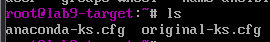

- original-ks.cfg: zmodyfikowany przez nas, z naszymi komentarzami
- anaconda-ks.cfg: wygenerowany przez instalator

### Rozszerzenie pliku kickstarter 

```bash
# Generated by Anaconda 43.44
# tekstowa instalacja
text

# reboot po zakonczeniu isntalacji
reboot

# Keyboard layouts
keyboard --vckeymap=pl --xlayouts='pl'
# System language
lang pl_PL.UTF-8

# repo + installation sources
url --mirrorlist=http://mirrors.fedoraproject.org/mirrorlist?repo=fedora-$releasever&arch=x86_64
repo --name=update --mirrorlist=http://mirrors.fedoraproject.org/mirrorlist?repo=updates-released-f$releasever&arch=x86_64

# Network information - ustawiony unikalny hostname (Wymog prowadzacego)
network --bootproto=dhcp --device=ens160 --ipv6=auto --activate --hostname=lab9-target.local

%packages
@^server-product-environment
@container-management
@domain-client
@guest-agents
@server-hardware-support
# dodatkowe pakiety 
curl
tar
docker
docker-compose
cronie
%end

# System authorization information
authselect enable-feature with-fingerprint

# Run the Setup Agent on first boot
firstboot --enable

# config dysku 
ignoredisk --only-use=nvme0n1
clearpart --all --initlabel --drives=nvme0n1
autopart --type=plain

# System bootloader configuration
bootloader --boot-drive=nvme0n1

# System timezone
timezone Europe/Warsaw --utc

# Root password + nazwa usera --name=ansible
rootpw --iscrypted --allow-ssh $y$j9T$jItepsKwSnQ5Lzt7Mj2rsVhP$1iixxLGKgjjJgGDCTskBAQ10bUuy013vAB4astMlFK5
user --groups=wheel --name=ansible --password=$y$j9T$YIWk6AOTuzd.LMziLpso6S90$pOQOKnucYa/3bx2xGE4c4HKYyQM4Qrdb6QdJcZ.rHt3 --iscrypted

# Sekcja skryptow wykonywanych po zakonczeniu instalacji pakietow
%post --log=/root/ks-post-install.log

# Rejestracja i wlaczenie uslugi Docker oraz Crona
systemctl enable docker
systemctl enable crond

mkdir -p /opt/url-shortener
cd /opt/url-shortener

# Pobranie plikow z GitHub
curl -sO https://raw.githubusercontent.com/SzymonJednorozec/devops_urls_test/main/docker-compose.deploy.yml
curl -sO https://raw.githubusercontent.com/SzymonJednorozec/devops_urls_test/main/ansible_files/Dockerfile.runtime

# Standaryzacja nazwy pliku dla narzedzia docker compose
mv docker-compose.deploy.yml docker-compose.yml

# Pobranie kodu zrodlowego aplikacji (zastepstwo z Jenkinsa)
curl -sL https://github.com/SzymonJednorozec/devops_urls_test/archive/refs/heads/main.tar.gz -o app-source.tar.gz
tar -xzf app-source.tar.gz --strip-components=1

cp /opt/url-shortener/ansible_files/Dockerfile.runtime /opt/url-shortener/Dockerfile.runtime
# Utworzenie mechanizmu automatycznego startu produkcji za pomoca Crontaba roota
echo "@reboot cd /opt/url-shortener && docker compose up -d --build >> /root/app-start.log 2>&1" >> /var/spool/cron/root
chmod 600 /var/spool/cron/root

%end
```

#### 1: Ponowna instalacja systemu na tej samej maszynie wirtualnej

Przy ponownym uruchomieniu VM zaciągnęla system z dysku wirtualnego, a nie z obrazu .iso. W boot menu trzeba było ręcznie wskazać rozruch z napędu DVD/CD, na którym ustawiony jest plik .iso żeby ponownie przejść przez proces instalacji.


Ponownie dopisano komendę inst.ks i odpalono rozruch.


Pojawił się problem z nazewnictwem w plikach dockerfile, stworzono specjalny plik dockerfile.runtime który jest polączeniem dockerfile.build+dockerfile.runtime żeby wyeliminować problem z nazewnictwem pomiędzy nimi.

```dockerfile
FROM node:20-alpine AS url-shortener-builder

RUN apk add --no-cache git
WORKDIR /app
RUN git clone https://github.com/SzymonJednorozec/devops_urlShortener.git .
RUN npm install
RUN npm run build

FROM node:20-alpine
WORKDIR /app

COPY --from=url-shortener-builder /app/package*.json ./
RUN npm install --omit=dev --legacy-peer-deps
COPY --from=url-shortener-builder /app/dist ./dist

CMD ["node", "dist/main"]
```

Kolejnym problemem byl kontekst budowania, z racji tego że nowy Dockerfile.runtime znajduje się w katalogu ansible_files, a docker-compose.yml w katalogu głównym VM korzystala ze zlego pliku.

Kopiowania pliku w odpowiednie miejsce rozwiązało problem z kontekstem.

Dodano do pliku kickstart:
```bash
cp /opt/url-shortener/ansible_files/Dockerfile.runtime /opt/url-shortener/Dockerfile.runtime
```

Po wszystkich porpawkach serwis uruchomił się poprawnie


Zamiat loclahosta trzeba używać adresu IP VM, po wpisaniu w przeglądarkę
192.168.219.134:3000/FBclowr zostajemy przekierowani na stronę google.com


## Laboratorium 10

### Przygotowanie

#### 1: Pobranie i instalacja minikube i kubectl

```bash
curl -LO https://github.com/kubernetes/minikube/releases/latest/download/minikube-linux-amd64
sudo install minikube-linux-amd64 /usr/local/bin/minikube && rm minikube-linux-amd64

curl -LO "https://dl.k8s.io/release/$(curl -L -s https://dl.k8s.io/release/stable.txt)/bin/linux/amd64/kubectl"
sudo install -m 0755 kubectl /usr/local/bin/kubectl && rm kubectl
```

#### 2: Alias
dodano alias do .bashrc
```bash
alias minikubctl="kubectl"
```

#### 3: Uruchomienie minicube

```bash
minikube start --driver=docker
```
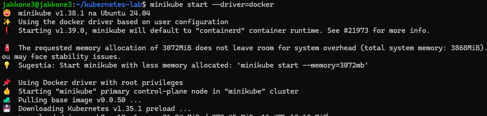

Dzialający kontener/worker

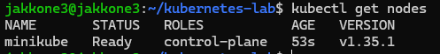

#### 4: Dashboard

```bash
minikube dashboard
``` 

Żeby polączyć się z dashboardem, z racji tego że VM ma NAT z port forwardingiem zastosowano tunelowanie żeby wystawić dashboard dla hosta
```bash
ssh -N -L 45089:127.0.0.1:45089 jakkone3@127.0.0.1 -p 2222
```

```bash
kubectl create deployment test-nginx --image=nginx:alpine
deployment.apps/test-nginx created

kubectl scale deployment test-nginx --replicas=2
deployment.apps/test-nginx scaled
```

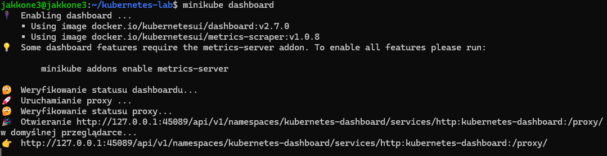
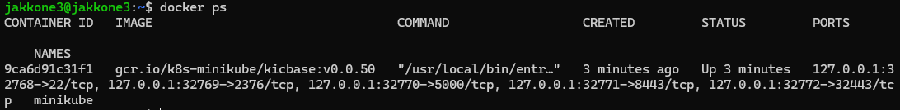


### Analiza posiadanego kontenera

#### 1. Zbudowano obraz url-shortenera
Przetestowano czy obraz działa poprawnie, wystawia interface sieciowy i nie wyłącza się od razu po uruchomieniu.

Skorzystano z pliku Dockerfile.runtime zmienionego na potrzeby laboratorium z ansible
```bash
docker build -t url-shortener-deploy -f ansible_files/Dockerfile.runtime .
docker-compose -f docker-compose.deploy.yml up -d
```

#### 2. Wyniki

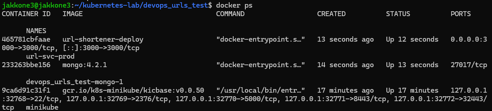
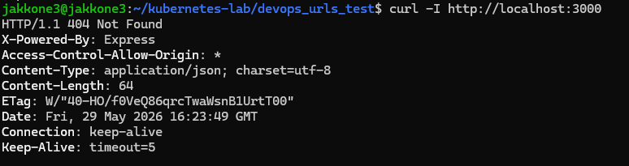


### Uruchamianie oprogramowania
#### 1. Uruchomienie podu

- Problem: obraz url-shortnenera nie jest wrzucony do sieci więc kubernetes nie może go znaleźć
- Rozwiązanie: przełączenie kontekstu dockera na minikube i zbudowanie obrazu bezpośrednio w minikube

```bash
eval $(minikube docker-env)
docker build -t url-shortener-deploy -f ansible_files/Dockerfile.runtime .
```

Uruchomienie podu
```bash
kubectl run url-shortener-pod --image=url-shortener-deploy --port=3000 --labels app=url-shortener-pod --image-pull-policy=Never
```
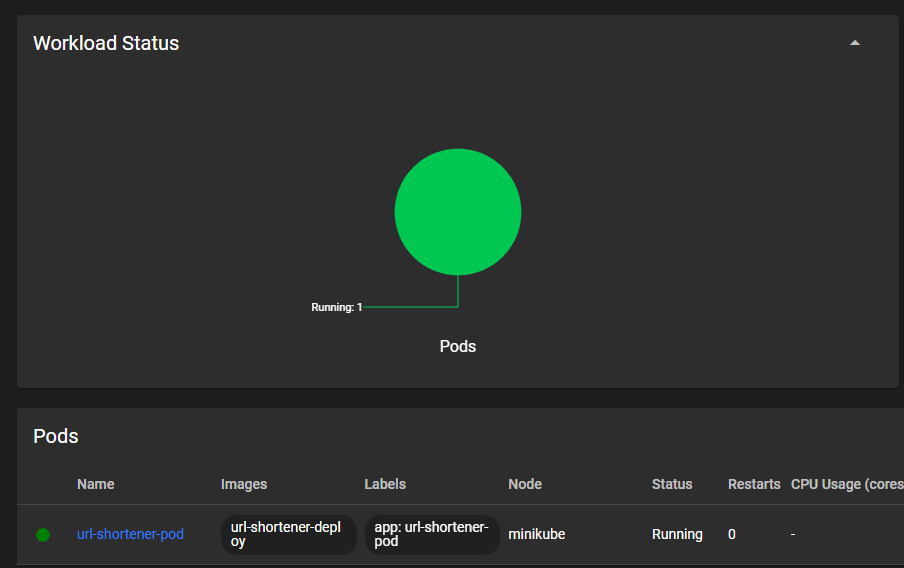

#### 2. Wyprowadzenie portu

```bash
kubectl port-forward pod/url-shortener-pod 3000:3000
```

Przetestowanie czy interface sieciowy został wystawiony poprawnie


Kubernetes przekazał ruch do podu. Url-shortener został uruchomiony bez bazy danych więc proces główny wyrzucił błąd i się wyłączył ale nie jest to problemem ponieważ chcieliśmy przetestować tylkoczy port forwarding działa poprawnie.

Sprzątanie
```bash
kubectl delete pod url-shortener-pod
```

### Przekucie wdrożenia manualnego w plik wdrożenia

#### 1. Stworzenie pliku yaml

```yaml
apiVersion: apps/v1
kind: Deployment
metadata:
  name: nginx-deployment
  labels:
    app: nginx
spec:
  replicas: 4
  selector:
    matchLabels:
      app: nginx
  template:
    metadata:
      labels:
        app: nginx
    spec:
      containers:
      - name: nginx
        image: nginx:alpine
        ports:
        - containerPort: 80
```

#### 2. Uruchomienie wdrożenia

```bash
kubectl apply -f nginx-deployment.yaml
```

#### 3. Testowanie czy wdrożenie działa poprawnie
```bash
kubectl rollout status deployment/nginx-deployment
```


#### 4. Wyeksportowanie jako serwis

```bash
kubectl expose deployment nginx-deployment --type=LoadBalancer --port=80
kubectl port-forward service/nginx-deployment 8080:80
```
Test


Sprzątanie
```bash
kubectl delete service nginx-deployment
kubectl delete deployment nginx-deployment
```

### Przygotowanie nowego obrazu

#### 1. Przygotowanie 1 wersji aplikacji

```bash
docker build -t url-shortener-deploy:v1 -f ansible_files/Dockerfile.runtime .
```
#### 2. Przygotowanie 2 wersji aplikacji
```bash
docker run -d --name temp-container url-shortener-deploy:v1
docker exec temp-container touch /app/version_2_marker
docker commit temp-container url-shortener-deploy:v2
docker rm -f temp-container
```

#### 3. Przygotowanie wadliwej wersji aplikacji
```bash 
docker run --name temp-bad url-shortener-deploy:v1 true
docker commit --change='CMD ["adawwwwwwdwdwdw"]' temp-bad url-shortener-deploy:bad
docker rm temp-bad
```
#### 4. Weryfikacja
```bash
docker images | grep url-shortener-deploy
```


### Zmiany w deploymencie

#### 1. stworzenie pliku produkcji

```yaml
apiVersion: apps/v1
kind: Deployment
metadata:
  name: mongo-deployment
spec:
  replicas: 1
  selector:
    matchLabels:
      app: mongo
  template:
    metadata:
      labels:
        app: mongo
    spec:
      containers:
      - name: mongo
        image: mongo:4.2.1
        ports:
        - containerPort: 27017
---
apiVersion: v1
kind: Service
metadata:
  name: mongo
spec:
  ports:
  - port: 27017
  selector:
    app: mongo
---
apiVersion: apps/v1
kind: Deployment
metadata:
  name: url-shortener-deployment
spec:
  replicas: 4
  selector:
    matchLabels:
      app: url-shortener
  template:
    metadata:
      labels:
        app: url-shortener
    spec:
      containers:
      - name: url-shortener
        image: url-shortener-deploy:v1
        imagePullPolicy: Never
        ports:
        - containerPort: 3000
        env:
        - name: MONGO_URI
          value: "mongodb://mongo:27017/urlshortener"
```
#### 2. Pierwsze uruchomienie
```bash
kubectl apply -f app-deployment.yaml
kubectl rollout status deployment/url-shortener-deployment
```

Weryfikacja


#### 3. Zmiana liczby replik/wersji

Zmianie ulegała linijka 
```yaml
apiVersion: apps/v1
kind: Deployment
metadata:
  name: url-shortener-deployment
spec:
#  Zmiania replicas na 8,1,0
  replicas: 4
  selector:
    matchLabels:
      app: url-shortener
  template:
    metadata:
      labels:
        app: url-shortener
    spec:
      containers:
      - name: url-shortener
      #  Zmiania image na :v2, :bad
        image: url-shortener-deploy:v1
```

8 replik
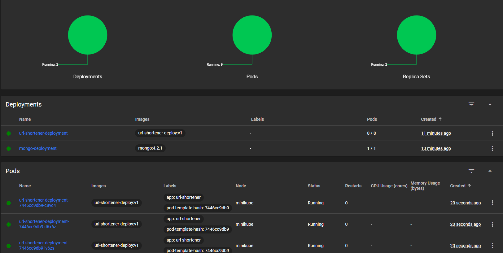

1 replika


0 replik
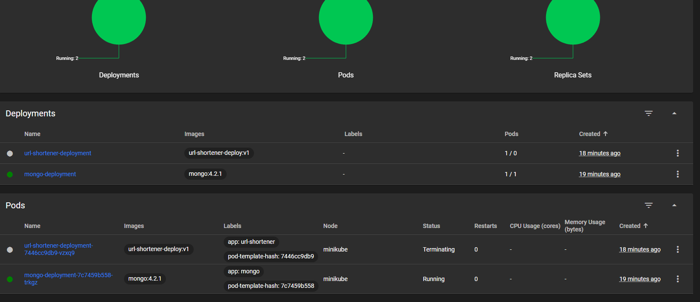

4 repliki 2v


4 repliki bad


#### 4. Rollback

```bash
kubectl rollout history deployment/url-shortener-deployment
kubectl rollout undo deployment/url-shortener-deployment
```

Weryfikacja
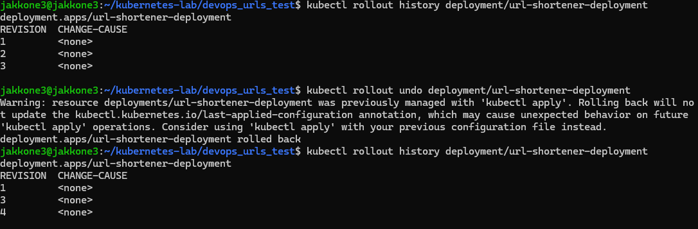


### Kontrola wdrożenia

#### 1. Historia wdrożeń

- 1. Pierwsze wdrożenie aplikacji, Wszystkie 4 repliki uzyskały status Running
- 2. Zmiana liczby replik na 8, Wszystkie 8 replik uzyskało status Running
- 3. Zmiana liczby replik na 1, Jedna replika ze statusem running
- 4. Zmiana liczby replik na 0, Brak replik
- 5. Zmiana obrazu na v2, Wszystkie 4 repliki uzyskały status Running
- 6. Zmiana obrazu na bad, Wstały tylko 2 repliki wersji bad ze statusem Error, pozostałe 3 nie zmieniły wersji i mają status Running. Finalnie przy zadeklarowaniu 4 replik aktywnych było 5
- 7. Rollback do punktu 5, wersja v2 i 4 repliki ze statusem running

Wniosek
Bezpieczeństwo w kubernetesie: 
W konfiguracji istnieją dwa domyślne parametry bezpieczeństwa:

maxSurge (domyślnie 25%): Określa, o ile maksymalnie k8s może stworzyć podów ponad limit w  trakcie aktualizacji.
maxUnavailable (domyślnie 25%): Określa, ile podów z puli produkcyjnej może być niedostępnych w trakcie operacji.

#### 2. Skrypt
```bash
#!/bin/bash

DEPLOYMENT_NAME="url-shortener-deployment"
TIMEOUT=60
INTERVAL=5
ELAPSED=0

echo "Deployment verification..."

while [ $ELAPSED -lt $TIMEOUT ]; do
    if kubectl rollout status deployment/$DEPLOYMENT_NAME --timeout=2s > /dev/null 2>&1; then
        echo "Successs"
        exit 0
    fi

    echo "Waiting $INTERVAL sec..."
    sleep $INTERVAL
    ELAPSED=$((ELAPSED + INTERVAL))
done

echo "Failure"

kubectl get pods -l app=url-shortener
exit 1
```

### Strategie wdrożenia
#### 1. Wdrożenie typu Rolling Update

Przedstawione we wcześniejszym kroku, w trakcie wdrożenia z tymi parametrami niedostępne mogą być 2 pody i możliwy jest 1 pod ponad limit

```yaml
spec:
  replicas: 4
  strategy:
    type: RollingUpdate
    rollingUpdate:
      maxUnavailable: 2
      maxSurge: 1
  selector:
    matchLabels:
      app: url-shortener
  template:
    metadata:
      labels:
        app: url-shortener
    spec:
      containers:
      - name: url-shortener
        image: url-shortener-deploy:v1
```

#### 2. Wdrożenie typu Recreate

Kubernetes najpierw całkowicie zabija wszystkie działające Pody v1, powodując chwilowy brak dostępności usługi, a dopiero gdy stare Pody znikną, zaczyna tworzyć nowe v2

```yaml
spec:
  replicas: 4
  strategy:
    type: Recreate
  selector:
    matchLabels:
      app: url-shortener
  template:
    metadata:
      labels:
        app: url-shortener
    spec:
      containers:
      - name: url-shortener
        image: url-shortener-deploy:v1
```
#### 3. Wdrożenie typu Canary Deployment

Nie zmieniamy obecnego wdrożenia. Zamiast tego tworzymy zupełnie nowy, mały Deployment  z wersją v2, nadajemy mu tę samą etykietę główną, którą nasłuchuje nasz Serwis. W ten sposób Serwis automatycznie zacznie kierować część ruchu do nowego kanarka.

Plik wdrożenia dla Kanarka
```yaml
apiVersion: apps/v1
kind: Deployment
metadata:
  name: url-shortener-canary
spec:
  replicas: 1
  selector:
    matchLabels:
      app: url-shortener
  template:
    metadata:
      labels:
        app: url-shortener
        track: canary
    spec:
      containers:
      - name: url-shortener
        image: url-shortener-deploy:v2
        imagePullPolicy: Never
        ports:
        - containerPort: 3000
        env:
        - name: MONGO_URI
          value: "mongodb://mongo:27017/urlshortener"
```


### Wnioski laboratorium 10

- Zamiast ręcznego uruchamiania i konfigurowania pojedynczych kontenerów za pomocą poleceń konsolowych, zastosowanie plików konfiguracyjnych YAML  pozwala na pełną automatyzację.

- Bezpieczeństwo i stabilność: Wprowadzenie uszkodzonego obrazu nie doprowadziło do downtime usługi, kubernetes automatycznie wstrzymał wdrożenie wadliwych podów, pozostawiając ruch użytkowników na sprawnych replikach.

- Rollback: kubectl rollout history oraz kubectl rollout undo pozwalają na bezproblemowe przywrócenie stabilnej wersji aplikacji minimalizując czas niedostępności usługi.


## Laboratorium 11

### Eksponowanie serwisu
Plik wdrożenia url-shortenera z dodanymi portami i zmienną środowiskową dla adresu bazy danych MongoDB

```yaml
apiVersion: apps/v1
kind: Deployment
metadata:
  name: mongo-deployment
spec:
  replicas: 1
  selector:
    matchLabels:
      app: mongo
  template:
    metadata:
      labels:
        app: mongo
    spec:
      containers:
      - name: mongo
        image: mongo:4.2.1
        ports:
        - containerPort: 27017
---
apiVersion: v1
kind: Service
metadata:
  name: mongo
spec:
  ports:
  - port: 27017
  selector:
    app: mongo
---
apiVersion: apps/v1
kind: Deployment
metadata:
  name: url-shortener-deployment
spec:
  replicas: 36
  selector:
    matchLabels:
      app: url-shortener
  template:
    metadata:
      labels:
        app: url-shortener
    spec:
      containers:
      - name: url-shortener
        image: url-shortener-deploy:v1
        imagePullPolicy: Never
        ports:
        - containerPort: 3000
        env:
        - name: MONGO_URI
          value: "mongodb://mongo:27017/urlshortener"
```

#### 1. Wyeksponowanie dostępu do 1 poda
```bash
kubectl port-forward pod/url-shortener-deployment-7446cc9db9-gnwwp 8001:3000
```


#### 2. Wyeksponowania do wszystkich podów
```bash
kubectl port-forward deployment/url-shortener-deployment 8002:3000
```
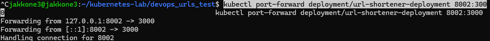


#### 3. Wyeksponowanie do serwisu przy pomocy dedykowanej komendy expose
```bash
kubectl expose deployment url-shortener-deployment --type=NodePort --name=url-service-manual --port=3000
kubectl port-forward service/url-service-manual 8003:3000
```
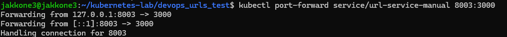
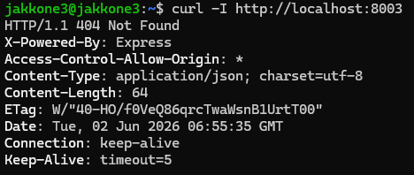

#### 4. Wyeksponowanie do serwisu przy pomocy plikuyaml

Sprzątanie po kroku 3

```bash
kubectl delete service url-service-manual
```
```yaml
apiVersion: v1
kind: Service
metadata:
  name: url-service-yaml
spec:
  type: NodePort
  ports:
  - port: 3000
    targetPort: 3000
    nodePort: 32000
  selector:
    app: url-shortener
```
```bash
kubectl apply -f service-deployment.yaml
```

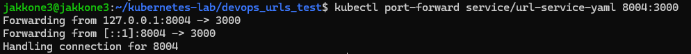
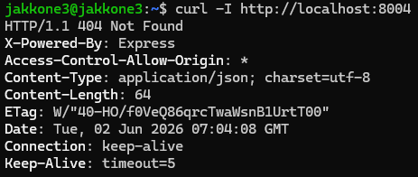

### Skalowanie

#### 1. Przeskalowanie przy pomocy komendy scale
```bash
kubectl scale deployment url-shortener-deployment --replicas=5
```


#### 2. Przeskalowanie przy pomocy zmienionego pliku yaml
przekopiowanie pliku yaml
```bash
cp shortener-deployment.yaml scaled-deployment.yaml
```

Podmienienie pola replicas z 36 na 15 i zaaplikowanie zmian

```bash
kubectl apply -f scaled-deployment.yaml
```
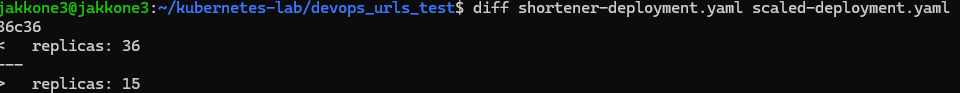
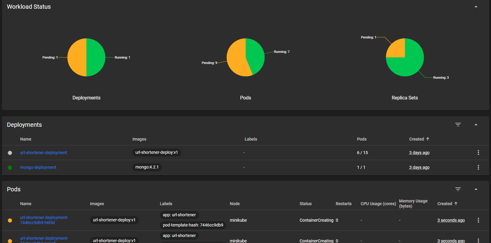

### Test serwisu

Do tej pory do url-shortenera były wysyłane zapytania tylko przez curla i dodatkowo z tej samej VM. Teraz shortener zostanie wystawiony na zewnątrz a zapytanie zostanie wysłane z hosta
```bash
kubectl port-forward deployment/url-shortener-deployment 3000:3000 --address 0.0.0.0
```
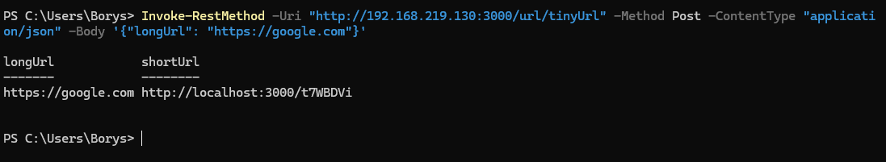

Wpisując w przeglądarkę adres maszyny wirtualnej + skrócony url zostajemy przekierowani na docelową stronę
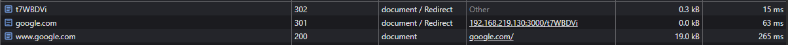

### Logi

Logi z url-shortenera były nmieczytelne, stworzono dodatkowy deployment dla nginxa dla tego kroku

#### 1. Deployment dla nginx 
```yaml
apiVersion: apps/v1
kind: Deployment
metadata:
  name: nginx-test-deployment
spec:
  replicas: 6
  selector:
    matchLabels:
      app: nginx-logger
  template:
    metadata:
      labels:
        app: nginx-logger
    spec:
      containers:
      - name: nginx
        image: nginx:alpine
        ports:
        - containerPort: 80
---
apiVersion: v1
kind: Service
metadata:
  name: nginx-logger-service
spec:
  type: NodePort
  ports:
  - port: 80
    targetPort: 80
  selector:
    app: nginx-logger
```

```bash
kubectl apply -f nginx-test.yaml
```

#### 2. Logi z nginx

Użyto flagi prefix aby wiedzieć z którego poda pochodzą logi, a następnie grep do filtrowania logów pod kątem zapytań typu HEAD

```bash
kubectl logs -l app=nginx-logger --prefix=true | grep "HEAD /"
```

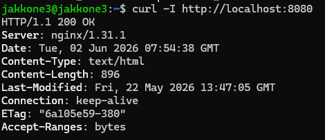
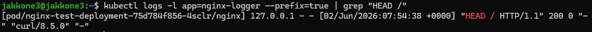

### Sprzątanie
```bash
kubectl delete -f scaled-deployment.yaml
kubectl delete service url-service-yaml --ignore-not-found=true
kubectl delete -f nginx-test.yaml
minikube stop
```


### Wnioski laboratorium 11

- Zamiast ręcznie zmieniać liczbę podów komendą scale, znacznie lepiej robić to przez edycję pliku YAML. Dzięki temu mamy zapisany dokładny stan naszej infrastruktury, a różnice w konfiguracji można łatwo sprawdzić komendą diff.

- Użycie flagi --address 0.0.0.0 pozwoliło na wyjście poza izolację maszyny wirtualnej. Dzięki temu można było przetestować działanie URL-shortenera bezpośrednio w przeglądarce na Windowsie, symulując ruch od prawdziwego klienta.

- Przekierowanie bezpośrednio do pojedynczego poda wiąże ruch z konkretnym adresem IP kontenera. Przekierowanie do deploymentu automatyzuje ten proces, ale dopiero wdrożenie obiektów typu Service tworzy niezależną od cyklu życia podów warstwę sieciową.