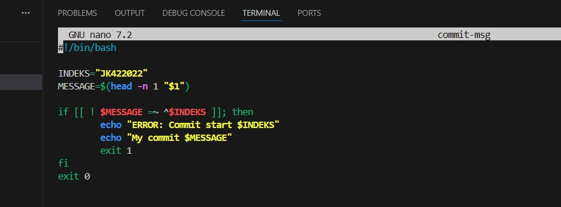
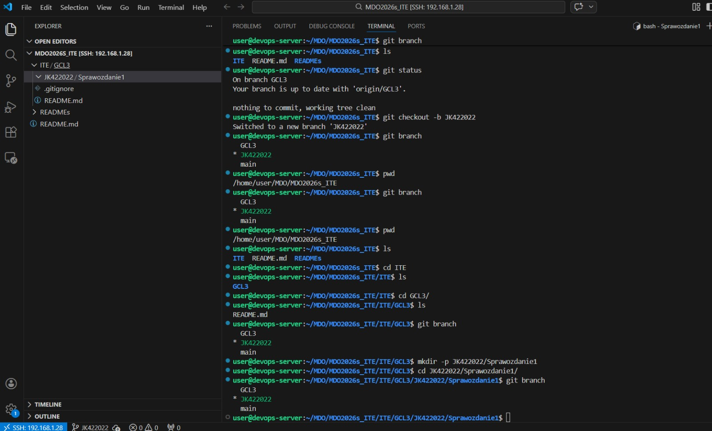
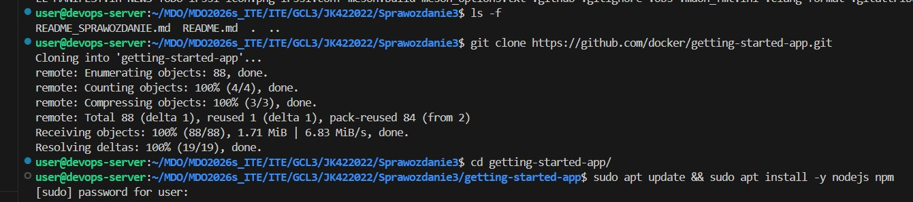
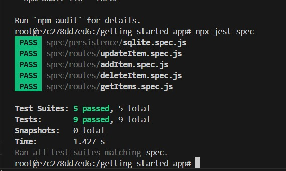
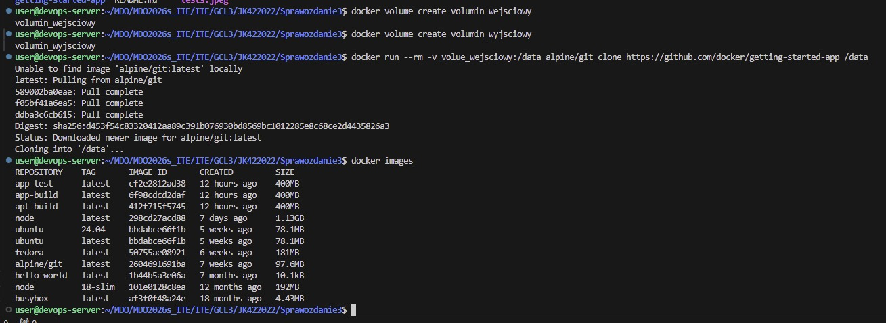
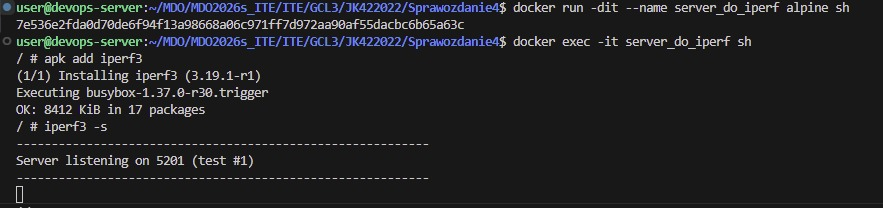
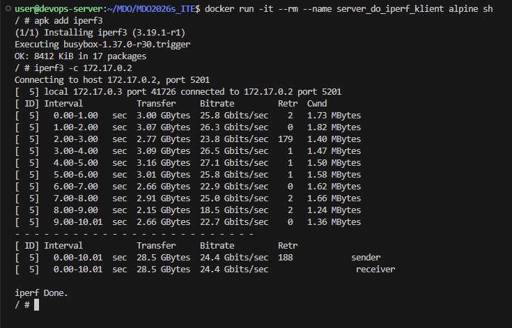
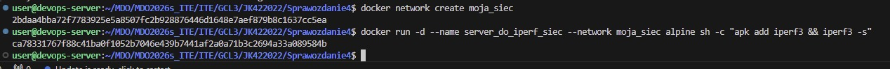
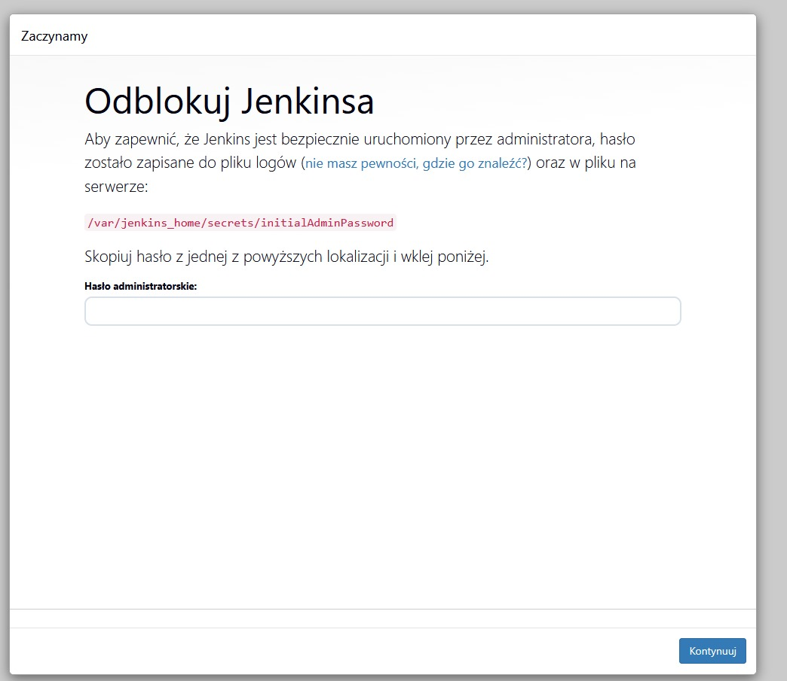
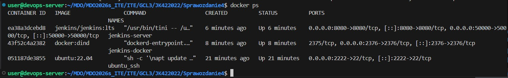

SPRAWOZDANIE 1 ZAJĘCIA 1-4

Celem 1 zajęć było stworzenie skryptu hook aby sprawdzane były poprawnie wystawione commity
```
#!/bin/bash

INDEKS="JK422022"
MESSAGE=$(head -n 1 "$1")

if [[ ! $MESSAGE =~ ^$INDEKS ]]; then
	echo "ERROR: Commit start $INDEKS"
	echo "My commit $MESSAGE"
	exit 1
fi
exit 0
```


oraz utworzenie branchu w odpowiedniej gałęzi




Celem 2 zajęć było stworzenie środowiska skonteneryzowanego

polecenia instalujace dockera
sudo apt update
sudo apt install docker.io


docker run -it busybox sh


pobrane kontenery


plik Dockerfile
```
FROM ubuntu:24.04

RUN apt-get update && apt-get install -y git && rm -rf /var/lib/apt/lists/*

WORKDIR /app

RUN git clone https://github.com/InzynieriaOprogramowaniaAGH/MDO2026s_ITE.git .

CMD ["/bin/bash"]
```

Zajęcia 3

wybrano repozytorium: https://github.com/docker/getting-started-app

wykorzystane polecenia:
```
git clone https://github.com/docker/getting-started-app
sudo apt update && sudo apt install -y nodejs npm
npm install npm install --save-dev jest npx jest spec 
```



utworzono docker na którym wykorzystano polecenia poniższe polecenia oraz
2 Dockerfile - build oraz test, które następnie zbudowano i sprawdzono poprawność działania poprzez wywołanie testów
```
docker run -it --name app-test node:18-slim /bin/bash
```


Dockerfile.build :
```
FROM node:18-slim
RUN apt-get update && apt-get install -y git
WORKDIR /app
COPY . .
RUN npm install && npm install --save-dev jest
```
Dockerfile.test:
```
FROM app-build
CMD ["npx", "jest", "spec"]
```


wszystkie testy przeszły poprawnie


Zajęcia 4

stworzono 2 voluminy komendą:
```
docker volume create _nazwa 
```


aby wykonać polecnie wykorzystano kontener pomocniczy za pomocą poleceń

```
docker run --rm -v vol-in:/data alpine/git clone https://github.com/docker/getting-started-app /data
```



następnie zweryfikowano podpięcie 
```
docker run --rm -v volumin_wyjsciowy:/data busybox ls -F /data
```


zadanie z iperf
utworzono docker na server poleceniami:
```
docker run -dit --name server_do_iperf alphine sh
docker exec -it server_do_iperf sh
```


sprawdzono jego ip oraz nawiazano polaczenie miedzy 2 dockerami




następnie utworzono sieć i na tej sieci utworzono połączenie



nawiazano polaczenie na sieci


następnie nawiązano połączenie spoza hosta


wykorzystane polecenia do utworzenia jenkins:
```
docker network create jenkins
docker volume create jenkins_docker
docker volume create jenkins_docker
docker run --name jenkins-docker --detach   --privileged --network jenkins --network-alias docker   --env DOCKER_TLS_CERTDIR=/certs   --volume jenkins_docker:>
docker run --name jenkins-server --detach   --network jenkins --env DOCKER_HOST=tcp://docker:2376   --env DOCKER_CERT_PATH=/certs/client --env DOCKER_TLS_VERI>
```




aby wszystko działało dodano przekierowanie portów 5201 i 8080

