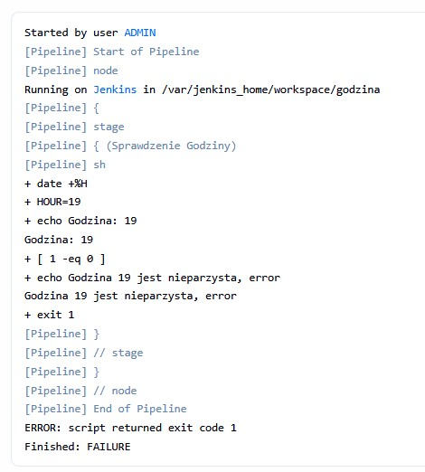
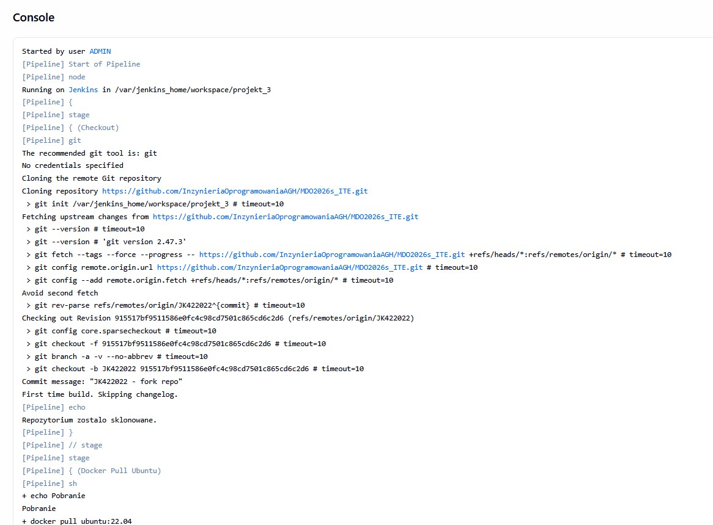
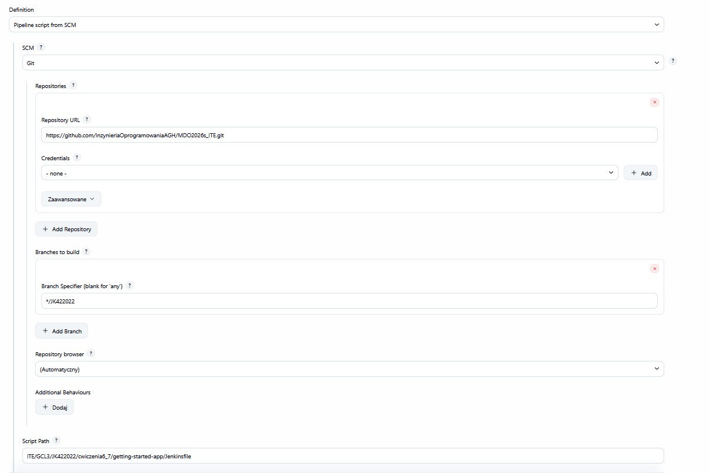
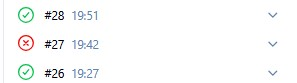
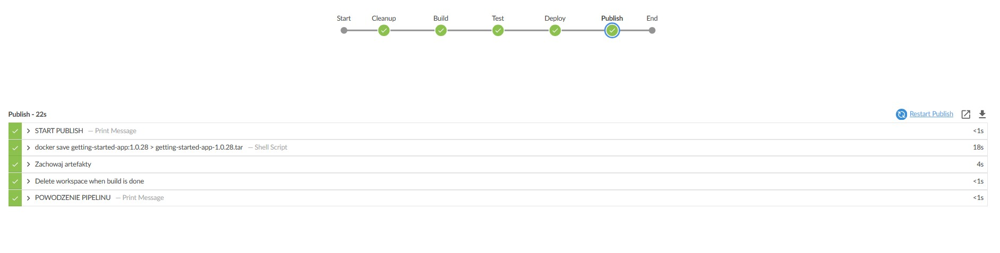

ZAJĘCIA 5
1 - Utworzyłem instalację Jenkinsa poprzez utworzenie dockera o nazwie jenkins-docker
Ale najpierw utworzyłem sieć abym mógł się bez problemu komunikować z jenkinsem:
```
docker network create jenkins 
oraz
docker volume create jenkins_docker
docker volume create jenkins_data
```
Dzięki utworzeniu volumów mogłę od razu stworzyć docker z połączoną siecią za pomocą komendy
```
docker run --name jenkins-docker --detach   --privileged --network jenkins --network-alias docker   --env DOCKER_TLS_CERTDIR=/certs   --volume jenkins_docker:/certs   --volume jenkins_data:/var/jenkins_home   --publish 2376:2376   docker:dind
```

Następnie uworzyłem Dockerfile:
```
FROM jenkins/jenkins:2.541.3-jdk17
USER root
RUN apt-get update && apt-get install -y lsb-release ca-certificates curl && \
    install -m 0755 -d /etc/apt/keyrings && \
    curl -fsSL https://download.docker.com/linux/debian/gpg -o /etc/apt/keyrings/docker.asc && \
    chmod a+r /etc/apt/keyrings/docker.asc && \
    echo "deb [arch=$(dpkg --print-architecture) signed-by=/etc/apt/keyrings/docker.asc] \
    https://download.docker.com/linux/debian $(. /etc/os-release && echo \"$VERSION_CODENAME\") stable" \
    | tee /etc/apt/sources.list.d/docker.list > /dev/null && \
    apt-get update && apt-get install -y docker-ce-cli && \
    apt-get clean && rm -rf /var/lib/apt/lists/*
USER jenkins
RUN jenkins-plugin-cli --plugins "blueocean docker-workflow json-path-api"
```
zbudowałem kontener blueocean poleceniem:
```
docker build -t myjenkins-blueocean:2.541.3-1 .
```
Utworzyłem następnie server dla jenkinsa ponownie z volumami żeby 2 kontenery mogły bez problemu ze sobą się porozumiewać
```
docker run --name jenkins-server --detach   --network jenkins --env DOCKER_HOST=tcp://docker:2376   --env DOCKER_CERT_PATH=/certs/client --env DOCKER_TLS_VERIFY=1   --publish 8080:8080 --publish 50000:50000   --volume jenkins_data:/var/jenkins_home   --volume jenkins_docker:/certs/client:ro  myjenkins-blueocean:2.541.3-1
```


Aby odblokować jenkinsa należało sprawdzić logi i wyłuskać hasło poleceniem
```
docker logs
```
Stworzyłem użytkownika o nazwie ADMIN


Stworzyłem projekty które miały na celu wyświetlenie informacji o systemie, sprawdzenie godziny, pobranie obrazu kontenera


```
pipeline {
    agent any
    stages {
        stage('Sprawdzenie Godziny') {
            steps {
                sh '''
                HOUR=$(date +%H)
                echo "Godzina: $HOUR"
                if [ $((HOUR % 2)) -eq 0 ]; then
                    echo "Godzina $HOUR jest parzysta. sukces"
                    exit 0
                else
                    echo "Godzina $HOUR jest nieparzysta, error"
                    exit 1
                fi
                '''
            }
        }
    }
}
```



Kod pipelinu kopiującego repozytorium oraz tworzącego kontener ubuntu
```
pipeline {
    agent any

    stages {
        stage('Checkout') {
            steps {
                git url: 'https://github.com/InzynieriaOprogramowaniaAGH/MDO2026s_ITE.git', branch: 'JK422022'
                echo 'Repozytorium zostalo sklonowane.'
            }
        }
        stage('Docker Pull Ubuntu') {
            steps {
                sh '''
                echo "Pobranie"
                docker pull ubuntu:22.04
                echo "Sprawdzenie"
                docker images | grep ubuntu
                '''
            }
        }
    }
}
```



Ostatnim krokiem było stworzenie pipelinu bazującego na wcześniej utworzonych dockerfilach - Dockerfile.build i Dockerfile.test

```
pipeline {
    agent any
    stages {
        stage('Checkout') {
            steps {
                echo 'Klonowanie'
                git url: 'https://github.com/InzynieriaOprogramowaniaAGH/MDO2026s_ITE.git', branch: 'JK422022'
                echo 'Klonowanie pomyślnie'
            }
        }
        stage('Build') {
            steps {
                 dir('ITE/GCL3/JK422022/cwiczenia3/getting-started-app') {
                    echo 'Faza build'
                    sh 'docker build -f Dockerfile.build -t aplikacja-build .'
                }
            }
        }
        stage('Test') {
            steps {
                dir('ITE/GCL3/JK422022/cwiczenia3/getting-started-app') {
                    echo 'Faza testy'
                    sh 'docker build -f Dockerfile.test -t aplikacja-test .'
                    sh 'docker run --rm aplikacja-test'
                }
            }
        }
    }
    post {
        success {
            echo 'Pipeline sukces'
        }
        failure {
            echo 'Pipeline błędny'
        }
    }
}
```

ZAJĘCIA 6-7 polegały na stworzeniu pipelinu dla jenkinsa na bazie jenkinsfila
Aby jenkinsfile zadziałał należy najpierw utworzyć konfigurację między jenkinsem,a naszym repozytorium

Kod mojego jenkinsfila
```
pipeline {
	agent any

	environment {

	APP_NAME = "getting-started-app"
	VERSION = "1.0.${env.BUILD_NUMBER}"
	APP_PATH ="ITE/GCL3/JK422022/cwiczenia6_7/getting-started-app"
	}

	stages {
		stage('Cleanup') {
		steps {
			echo 'START CLEANUP'
			sh 'docker system prune -af || true'
			sh 'docker rm -f czy-dziala || true'
			}
		}
		stage('Build') {
		steps {
			echo 'START BUILD'
			dir("${APP_PATH}") {
			sh "docker build --target builder -t ${APP_NAME}:tester ."
				}
			}
		}
		stage('Test') {
		steps {
			echo 'START TEST'
			sh "docker run --rm ${APP_NAME}:tester npx jest spec"
			}
		}
		stage('Deploy') {
    steps {
        dir("${APP_PATH}") {

            echo 'START DEPLOY'
            echo 'BUDOWANIE KONTENERA'
            sh "docker build -t ${APP_NAME}:${VERSION} ."

            echo 'START KONTENERA'
            sh "docker run -d --name czy-dziala -p 3000:3000 ${APP_NAME}:${VERSION}"

            sh '''
        
                CONTAINER_IP=$(docker inspect -f '{{range .NetworkSettings.Networks}}{{.IPAddress}}{{end}}' czy-dziala)
                echo "Prawdziwe IP kontenera to: $CONTAINER_IP"

                 for i in $(seq 1 20); do
                  echo "WYKONUJE $i probe"
                  echo "CURL NA STRONE"
                      
                  if curl -f http://$CONTAINER_IP:3000; then 
                    echo "APLIKACJA DZIALA"
                    exit 0
                  fi

                  sleep 2
                 done

                  echo "APLIKACJA NIE DZIALA"
                  docker logs czy-dziala
                 docker rm -f czy-dziala
                exit 1
             '''
            

            echo 'SPRZATANIE'
            sh "docker rm -f czy-dziala || true"
        }
    }
}

		stage('Publish') {
		steps { 
			echo 'START PUBLISH'
				dir("${APP_PATH}") {
                    sh "docker save ${APP_NAME}:${VERSION} > ${APP_NAME}-${VERSION}.tar"
                    archiveArtifacts artifacts: '*.tar', fingerprint: true
                }
			}
		}
	}
	post {
		always {
			cleanWs()
		}
		failure {
			echo 'NIE POWODZENIE PIPELINU'
		}
		success {
			echo 'POWODZENIE PIPELINU'
		}
	}
}
			
```


Próba numer 27 została ukończona niepomyślnie, ponieważ wcześniejszy pipeline nie wykonywał czyszczenia i próba numer 27 chciała się wykonywać już na zajętym porcie numer 3000 ten problem został naprawiony dodając w sekcji cleanup linii:
```
sh 'docker system prune -af || true'
```
która to na końcu mojego pipelinu czyściła wszystko i pozwalała na wykonywanie się kolejnych tych samych pipelinów na czystych portach i folderach
Powtórzona próba numer 27 z zasosowaniem cleanupa


Wybrałem konstrukcję DiD aby bezpiecznie oddzielić etapy budowania i testowania - w celu eliminacji konfliktów portów i nie wyczyszczenia, które występowały gdy na początku próbowałem pisać pipeliny na bazie zewnętrznych kontenerów.