Sprawozdanie 3
Zajęcia 8
Utworzyłem maszynę wirtualną ansible na tym samym obrazie ubuntu co moja główna maszyna oraz utworzyłem migawkę 
Już na etapie instalacji nadałem jej hostname ansible-target i utworzyłem użytkownika anisble


Utworzyłem bezpieczne połączenie pomiędzy nową maszyna o moją główną przy pomocy klucza ssh- dzięki temu nie będę musiał za każdym razem podawać hasła do ansibla 

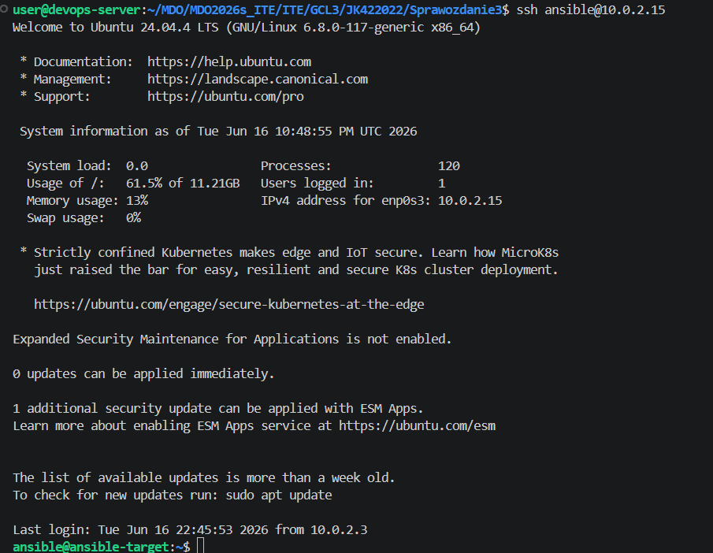

W czasie konfiguracji klucza napotkałem na przeszkodę gdyż maszyny nie widziały się nawzajem dlatego utworzyłem Sieć NAT i podpiołem obie maszyny pod tą sieć dzięki takiemu zabiegowi obie maszyny mogły się już widzieć

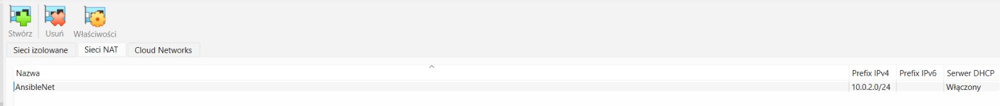

Zainstalowałem ansibla na moją główną maszynę poleceniem

```
sudo apt install ansible -y
```

następnie w pliku etc/hosts ustawiłem odpowiednie nazwy 

```
127.0.0.1 localhost
127.0.1.1 devops-server

# The following lines are desirable for IPv6 capable hosts
::1     ip6-localhost ip6-loopback
fe00::0 ip6-localnet
ff00::0 ip6-mcastprefix
ff02::1 ip6-allnodes
ff02::2 ip6-allrouters
10.0.2.15 ansible-target
```

i wykonałem pingi w celu sprawdzenia

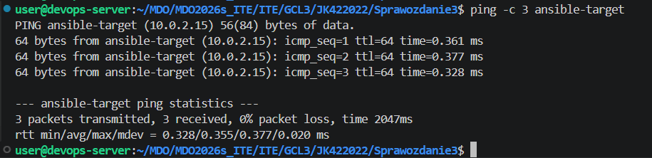

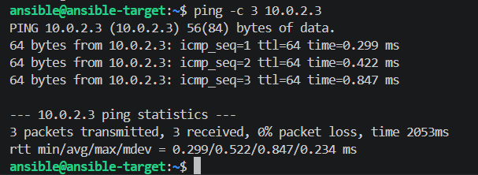

następnie utworzyłem plik inventory.ini i nadałem mu odpowiednie sekcje odpowiadające nazwą mojej maszyny

```
[Orchestrators]
devops-server ansible_connection=local

[Endpoints]
ansible-target ansible_user=ansible ansible_become_password=haslo
```

zastosowałem od razu haslo aby przyspieszyc nadawanie uprawnień dla użytkonika 
Wysłałem zapytanie do wszystkich maszyn i dostałem sukces - ping i pong

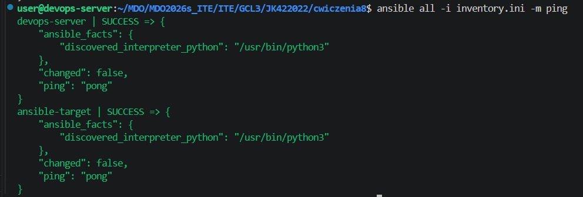

Następnie utworzyłem playbooka i go wywołałem poleceniem

```
ansible-playbook -i inventory.ini ansible-playbook.yml -K
```

zastosowałem polecenie z flaga -K aby umożliwić operacje administratora 

```
---
- name: ANSIBLE
  hosts: all
  become: yes
  tasks:
    - name: PING
      ansible.builtin.ping:

    - name: COPY
      ansible.builtin.copy:
        src: inventory.ini
        dest: /tmp/inventory.ini
      when: "'Endpoints' in group_names"

    - name: UPDATE
      ansible.builtin.apt:
        update_cache: yes
        upgrade: dist
    
    - name: RESET SSH
      ansible.builtin.service:
        name: ssh
        state: restarted
    - name: RESET RNGD

      ansible.builtin.service:
        name: rngd
        state: restarted
      ignore_errors: yes
```

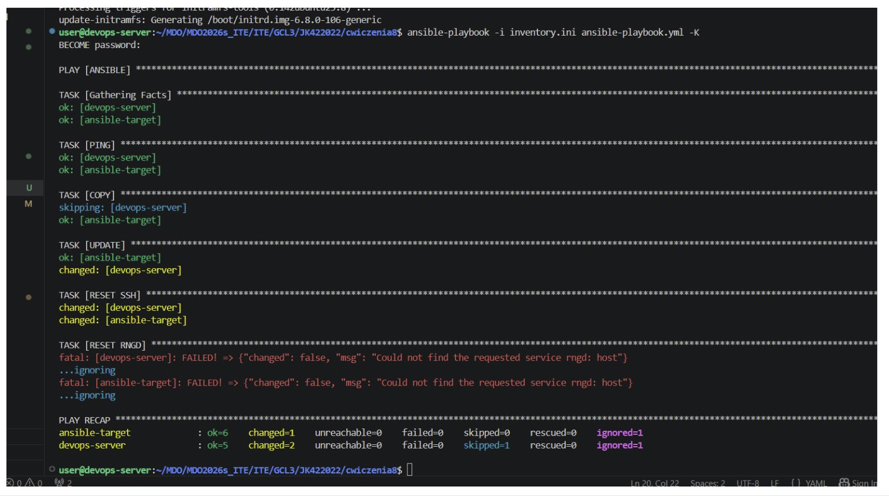

Gdy odłączyłem mój klucz ssh komunikat zwrotny zawsze był typu - UNREACHABLE 

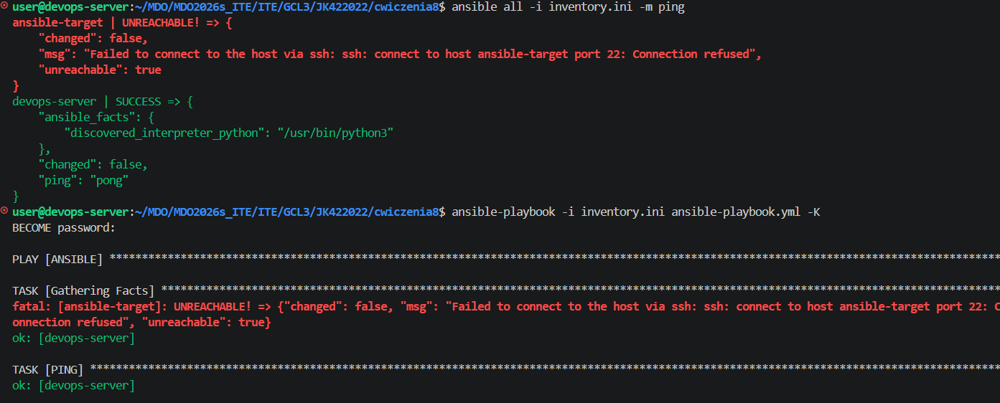

Następnie zbudowałem playbooka na bazie mojego deployu z pipelinu z aplikacji to-do i utworzyłem szkielet ansible-galaxy

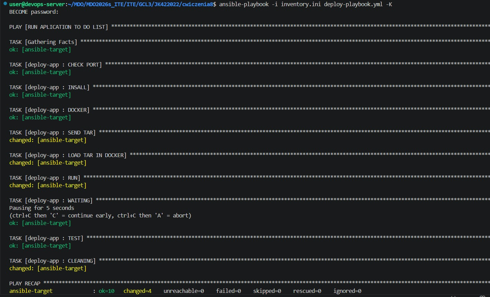

Kod pliku deploy-playbook.yml 
```
---
- name: RUN APLICATION TO DO LIST
  hosts: Endpoints
  become: yes
  roles:
    - deploy-app
```
Kod który jest faktycznie wywoływany przez deploy-playbook.yml
```
---
- name: CHECK PORT
  ansible.builtin.wait_for:
    port: 3000
    state: stopped
    timeout: 3
  ignore_errors: yes

- name: INSALL
  ansible.builtin.apt:
    name: ['apt-transport-https', 'ca-certificates', 'curl', 'software-properties-common']
    state: present
    update_cache: yes

- name: DOCKER
  ansible.builtin.apt:
    name: docker.io
    state: present

- name: SEND TAR
  ansible.builtin.copy:
    src: "{{ playbook_dir }}/getting-started-app.tar"
    dest: /tmp/getting-started-app.tar

- name: LOAD TAR IN DOCKER
  ansible.builtin.command: docker load -i /tmp/getting-started-app.tar

- name: RUN
  ansible.builtin.command: docker run -d --name aplikacja-na-artefakcie -p 3000:3000 getting-started-app:1.0.26

- name: WAITING
  ansible.builtin.pause:
    seconds: 5

- name: TEST
  ansible.builtin.uri:
    url: http://localhost:3000
    status_code: 200

- name: CLEANING
  ansible.builtin.command: docker rm -f aplikacja-na-artefakcie
```


Uzupełniłem plik meta/main.yml o podstawowe informacje
```
galaxy_info:
  author: JK
  description: wdrozenie aplikacji
  company: your company (optional)

  # If the issue tracker for your role is not on github, uncomment the
  # next line and provide a value
  # issue_tracker_url: http://example.com/issue/tracker

  # Choose a valid license ID from https://spdx.org - some suggested licenses:
  # - BSD-3-Clause (default)
  # - MIT
  # - GPL-2.0-or-later
  # - GPL-3.0-only
  # - Apache-2.0
  # - CC-BY-4.0
  license: license (GPL-2.0-or-later, MIT, etc)

  min_ansible_version: 2.1

  # If this a Container Enabled role, provide the minimum Ansible Container version.
  # min_ansible_container_version:

  #
  # Provide a list of supported platforms, and for each platform a list of versions.
  # If you don't wish to enumerate all versions for a particular platform, use 'all'.
  # To view available platforms and versions (or releases), visit:
  # https://galaxy.ansible.com/api/v1/platforms/
  #
  # platforms:
  # - name: Fedora
  #   versions:
  #   - all
  #   - 25
  # - name: SomePlatform
  #   versions:
  #   - all
  #   - 1.0
  #   - 7
  #   - 99.99

  galaxy_tags: []
    # List tags for your role here, one per line. A tag is a keyword that describes
    # and categorizes the role. Users find roles by searching for tags. Be sure to
    # remove the '[]' above, if you add tags to this list.
    #
    # NOTE: A tag is limited to a single word comprised of alphanumeric characters.
    #       Maximum 20 tags per role.

dependencies: []
  # List your role dependencies here, one per line. Be sure to remove the '[]' above,
  # if you add dependencies to this list.
  ```


Zajęcia 9

Pobrałem obraz fedory oraz stworzyłem nową maszynę wirtualną. 
Następnie wyciągnąłęm plik anaconda-ks.cfg z tej maszyny aby przeprowadzić nową instalację bazując już na
pliku konfiguracji zmodyfikowałem go abym mógł utworzyć nową maszynę z odpowiednimi modyfikacjami

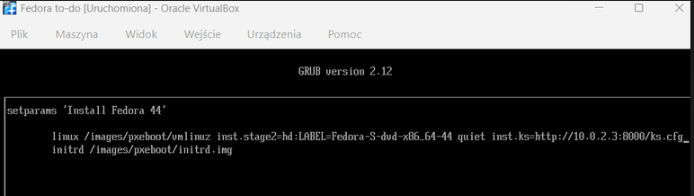

Zmieniony plik konfiguracyjny:

```
text

reboot


keyboard --vckeymap=pl --xlayouts='pl'
lang pl_PL.UTF-8
timezone Europe/Warsaw --utc

url --mirrorlist=http://mirrors.fedoraproject.org/mirrorlist?repo=fedora-44&arch=x86_64
repo --name=updates --mirrorlist=http://mirrors.fedoraproject.org/mirrorlist?repo=updates-released-f44&arch=x86_64

network --bootproto=dhcp --device=link --activate --hostname=fedora-serwer

rootpw --plaintext haslo

user --name=user_fedora --password=haslo --plaintext --groups=wheel

zerombr
clearpart --all --initlabel
autopart --type=lvm

%packages
@core

moby-engine
wget
curl
tar
%end

%post --log=/root/ks-post-script.log

systemctl enable docker

mkdir -p /opt/myapp


wget -O /opt/myapp/app.tar "http://10.0.2.3:8080/job/pipeline%20aplikacja/lastSuccessfulBuild/artifact/getting-started-app-1.0.28.tar"

cat << 'EOF' > /etc/systemd/system/uruchom-aplikacje.service
[Unit]
Description=RUN APPLICATION IN DOCKER 
Requires=docker.service
After=docker.service

[Service]
Type=oneshot
RemainAfterExit=yes


ExecStartPre=/usr/bin/docker load -i /opt/myapp/app.tar

ExecStart=/usr/bin/docker run -d --name aplikacja-wdrozeniowa -p 3000:3000 getting-started-app:1.0.28


ExecStop=/usr/bin/docker rm -f aplikacja-wdrozeniowa

[Install]
WantedBy=multi-user.target
EOF


systemctl enable uruchom-aplikacje.service

%end
```

zastosowałem python3 server abym mogl bezpiecznie i bez pomylki przekazac moj plik konfiguracyjny (ks.cfg) do fedory 

Po uruchomiemniu wykonałem curl aby sprawdzić czy moja aplikacja się wdrożyła i ruchomiła

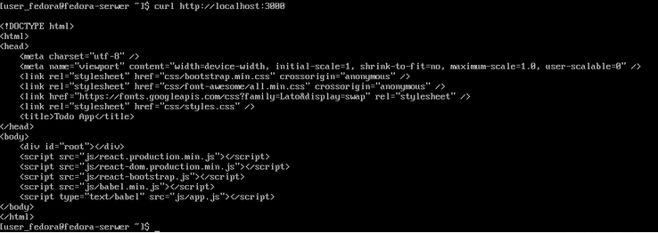

Uzyskałem odpowiedź html 
Następnie zestawiłem połączenie ssh pomiędzy moją maszyną domyślną, a nową maszyną fedory.
Aby to zrobić zainstalowałem odpowiednie pakiety do fedory i zestawiłem połączenie klucza

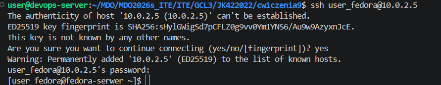

Zajęcia 10

zainstalowałem minikube oraz kubectl następującymi poleceniami 
Wszystkie polecenia wykonałem na nginx

```
curl -LO https://github.com/kubernetes/minikube/releases/latest/download/minikube-linux-amd64
sudo install minikube-linux-amd64 /usr/local/bin/minikube
curl -LO "https://dl.k8s.io/release/$(curl -L -s https://dl.k8s.io/release/stable.txt)/bin/linux/amd64/kubectl"
minikube start --driver=docker --memory=2048
```

następnie sprawdziłem czy działa mi dashboard oraz wykonałem uruchomienie kontenera nginx poleceniem:

```
minikube kubectl run -- wdrozenie-nginx --image=nginx --port=80 --labels app=wdrozenie-nginx
```

Sprawdziłem czy wszystko działa

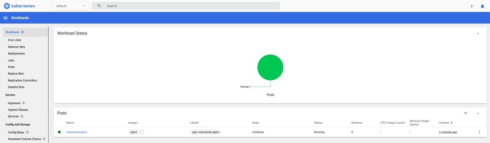

Sprawdziłem czy faktycznie uruchomiłem na 1 podzie poleceniem:

```
kubectl get pods
```

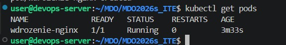

następnie wyeksponowałęm port poleceniem

```
kubectl port-forward pod/wdrozenie-nginx 8080:80
```


oraz sprawdziłem czy nginx działa na porcie 8080

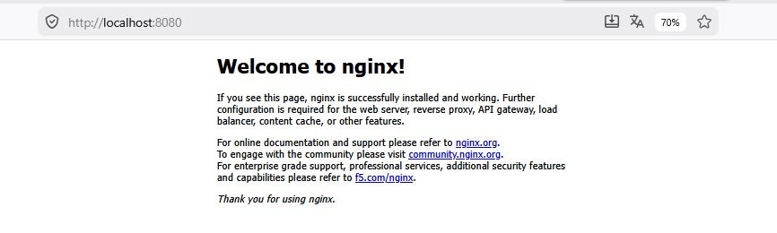

Następnie usunąłem moje wdrożenie aby przekształcić je do pliku yamla

```
apiVersion: apps/v1
kind: Deployment
metadata:
  name: nginx-wdrozenie
  labels:
    app: nginx
spec:
  replicas: 4
  selector:
    matchLabels:
      app: nginx
  template:
    metadata:
      labels:
        app: nginx
    spec:
      containers:
      - name: nginx
        image: nginx:latest
        ports:
        - containerPort: 80
```

tak wyglądał mój yaml na tym etapie zadania
uruchomiłem go na 4 replikach i za pomocą dashboard sprawdziłem czy wszystko się uruchamia poprawnie
poleceniem ktore użyłem to 

```
kubectl apply -f wdrozenie.yaml
```

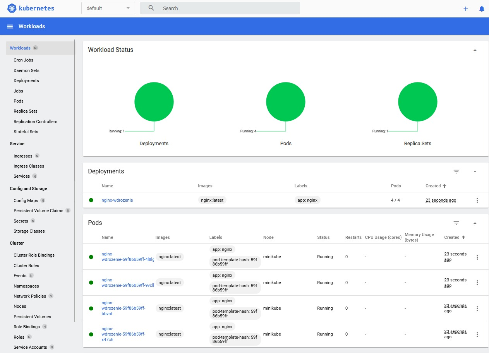

Wykonałem rollout zakończony sukcesem i sprawdziłem czy na pewno 4 pody działają

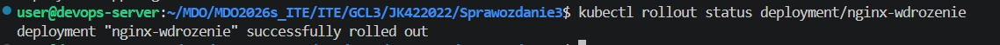

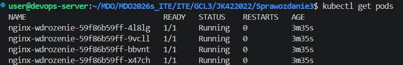

Wszystko działało poprawnie
Stworzyłem serwis i go wyeksponowałem poprzez port-forward

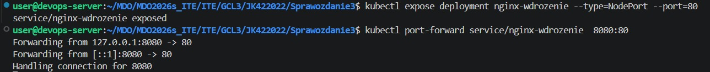

Następnie zmieniając mojego yamla uzyskałem wdrożenie dla 8, 1, 0 replik

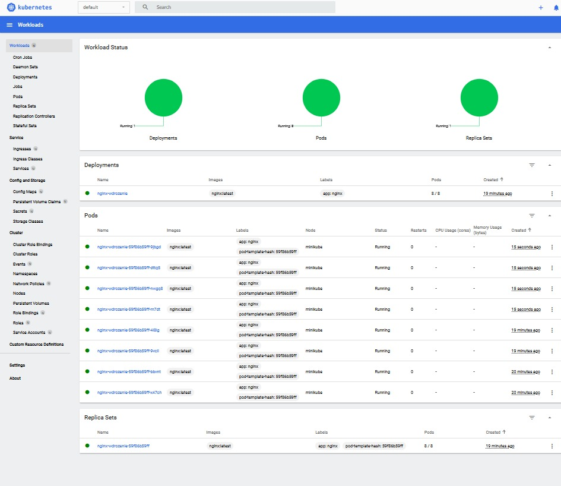

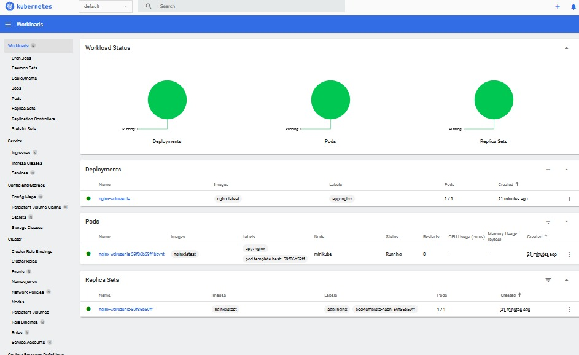

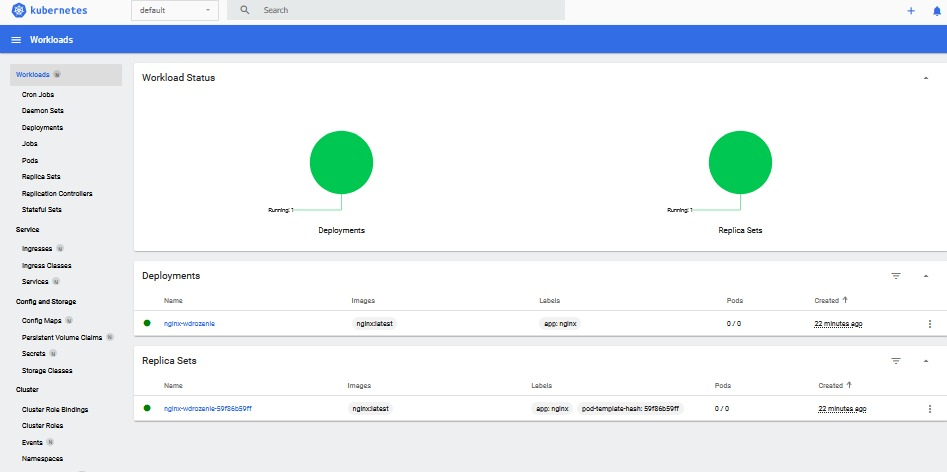

Wróciłem do 4 replik  ,a następnie stworzyłem 3 wersję mojego nginx
wersja 1 - stara
wersja 2 - aktualizacja
wersja 3 - error
wszystko robiłem w docker hubie spawdziłem jak one sie zachowują i otrzymałem wyniki których się można było spodziewać:
wersja 1 i 2 zadziały bez problemu natomiast wersja 3 errorowa wywaliła błąd

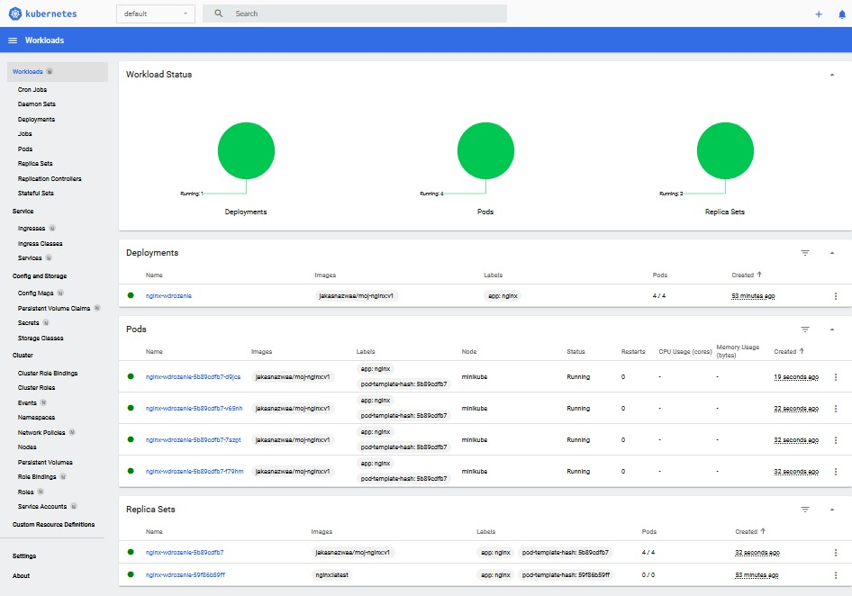

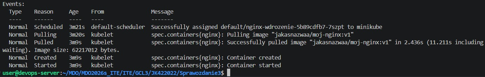

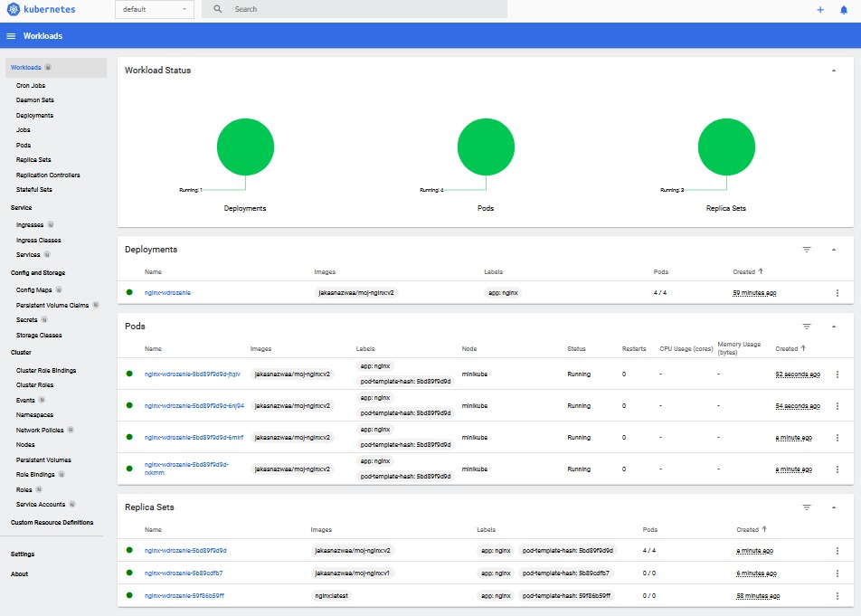

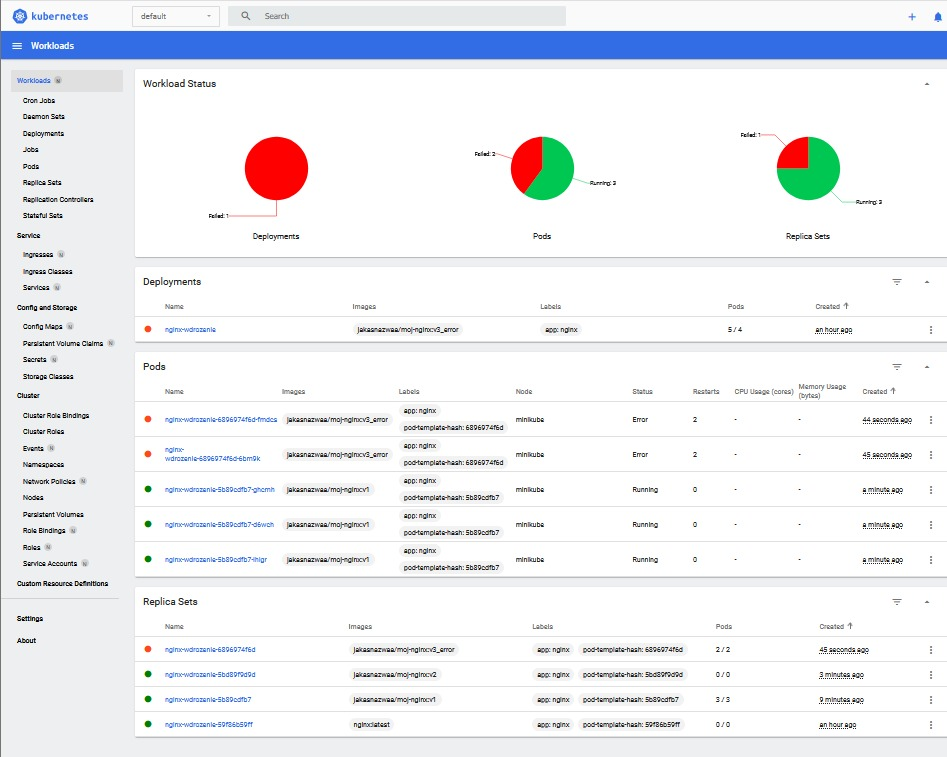

Sprawdziłem historię i wróciłem do działającej wersji poleceniami
kubectl rollout history / undo nazwa

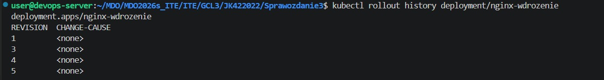

Widać tutaj 4 wdrożenia
Następnie zrobiłem skrypt weryfikujący czy polecenie kubectl rollout status wykona się w odpowiednim czasie dla nas 60 sekund dla tego zastosowałem flagę --timeout

```
#!/bin/bash
echo "START"
kubectl rollout status deployment/nginx-wdrozenie --timeout=60s
if [ $? -eq 0 ]; then
  echo "Ponizej 60 sekund"
else
  echo "Powyzej 60 sekund"
  exit 1
fi
```

Potwierdzenie działania wykonałem kubectrl apply i od razu wywołałem skrypt

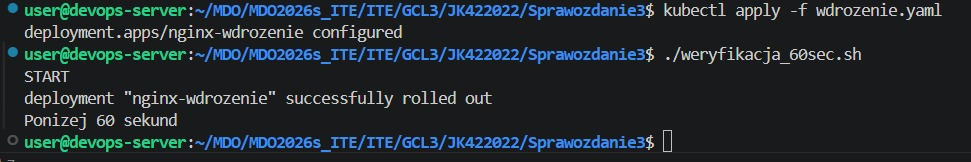

Zadziałał w mniej niż 60 sekund 
Wykonałem różne wersję wdrożeń:
Recreate - ustawiłem w moim dotychczasowym yamlu w strategy type na recreate 
Widać że moje pody ulegają usunięciu i od razu tworzą się na nowo

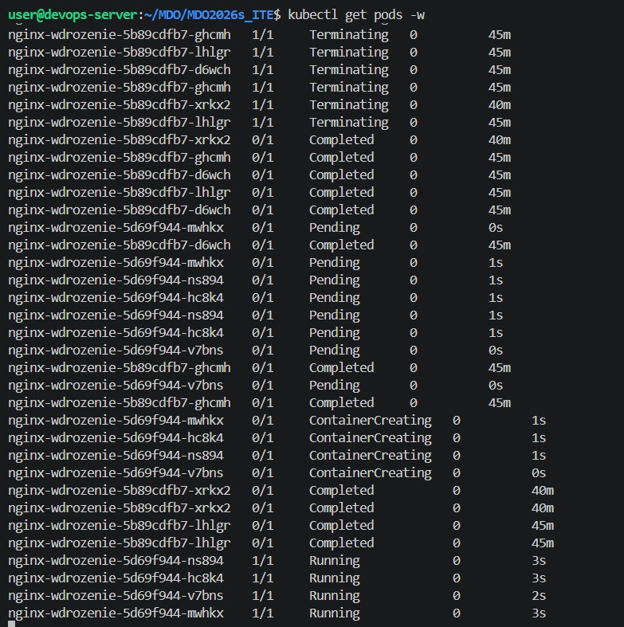

Wdrożenie Rolling Update poprzez uzupełnienie strategy tak:

```
strategy:
    type: RollingUpdate
    rollingUpdate:
      maxUnavailable: 2   
      maxSurge: 25%
```
zmieniono strategie na RollingUpdate z ustawieniami maxUnavailable = 2  i maxSurge = 25%

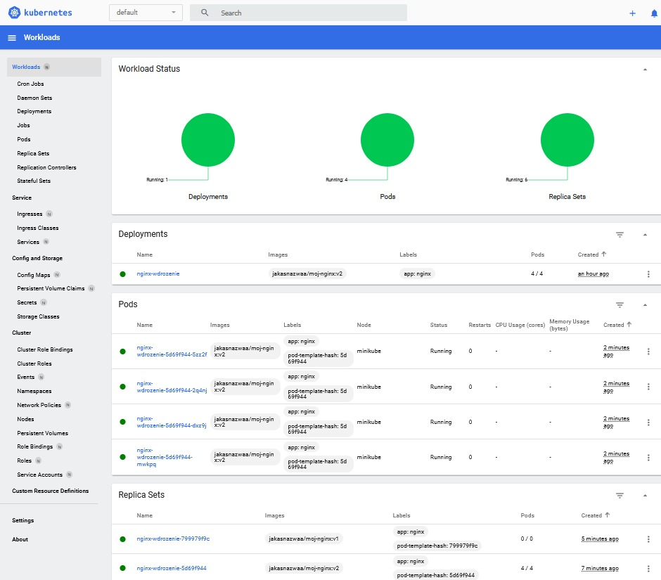

Ta strategia w przeciwieństwie do recreate nie usuwa wszystkich podów na raz uśmiercając aplikacje tylko stopniowo fazami tworzy  nowe pody oraz następnie usuwa stare. Takie wdrożenie pozwala na aktualizacje przy zachowaniu ciągłości zadania. Działa znaczniej wolniej niż Recreate 

Ostatni wdrożeniem było canary dla tego wdrożenia zrobiłem osobny plik yaml canary.yaml

```
apiVersion: apps/v1
kind: Deployment
metadata:
  name: nginx-canary
  labels:
   app: nginx
spec:
  replicas: 2
  selector:
    matchLabels:
      app: nginx
  template:
    metadata:
      labels:
        app: nginx
    spec:
      containers:
      - name: nginx
        image: jakasnazwaa/moj-nginx:v2
        ports:
        - containerPort: 80
```

oraz zrobiłem serwis yaml

```
apiVersion: v1
kind: Service
metadata:
  name: nginx-serwis
spec:
  selector:
    app: nginx
  ports:
    - protocol: TCP
      port: 80
      targetPort: 80
  type: NodePort
```  
uruchomiłem wszystko na raz i zauważyłem, że oba wdrożenia działają na raz

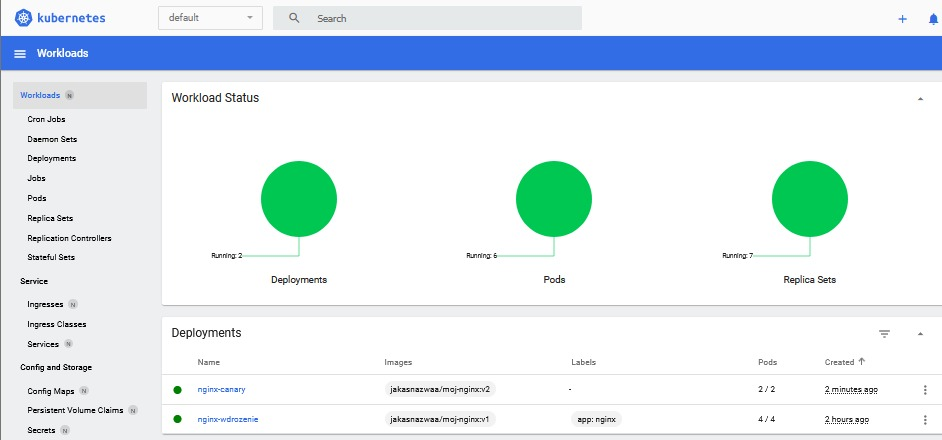

Zajęcia 11
Uruchomiłem mojego nginx na 15 podach 

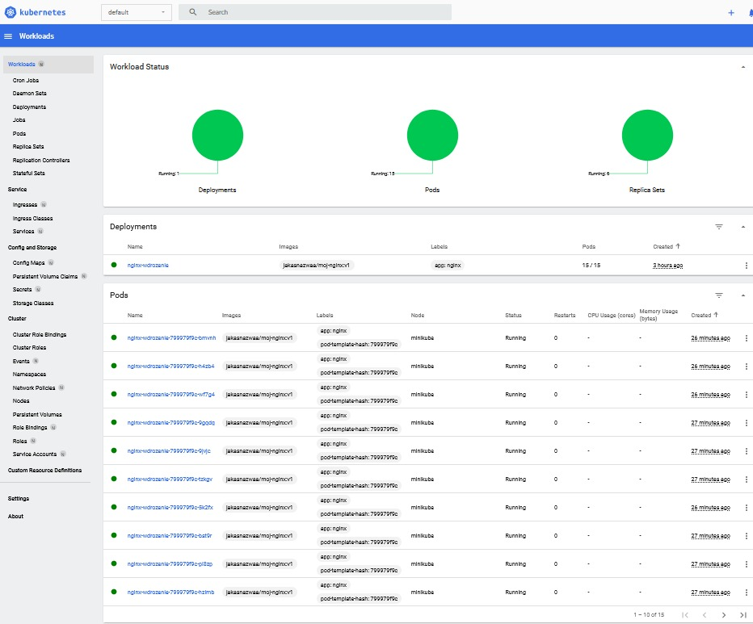

wyeksponowany nginx na 1 losowo wybranym podzie na port 8082 poleceniem port-forward oraz zrobiłem odpowiednie przekierowanie portów w ws studio

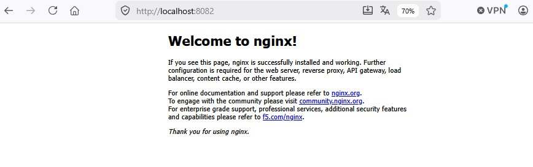

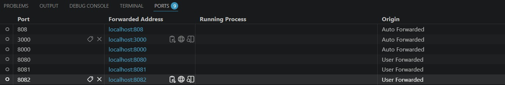

Następnie zrobiłem wyeksponowanie do deploymentu tak samo jak powyżej 

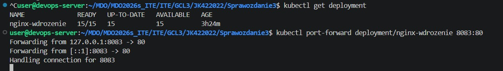

Ostatnim wyeksponowaniem miał być serwis za pomocą polecenia oraz pliku yaml
Zrobiłem to poleceniem:

```
kubectl expose deployment nginx-wdrozenie --name=nginx-serwis-1 --port=80 --type=NodePort
```

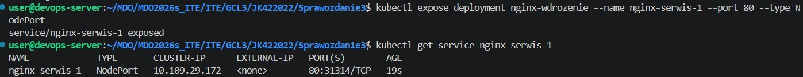

Plik yaml aby zrobić to dedykowanym plikiem

```
plik yaml
apiVersion: v1
kind: Service
metadata:
  name: nginx-serwis-11
spec:
  type: NodePort
  selector:
    app: nginx      
  ports:
    - port: 80         
      targetPort: 80
```      

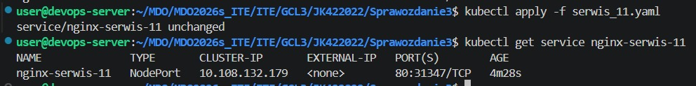

Sprawdziłem czy wszystko działa

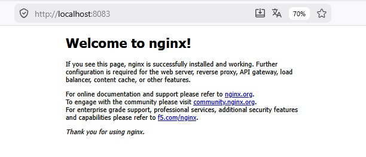

Ostatnim krokiem było przeskalowanie raz za pomocą dyrektywy scale a raz za pomocą yamla
W yamlu wystarz zmienić replicas z 15 na 10
różnica w plikach poniżej
wywołaniem polecenia 
```
kubectl diff -f wdrozenie.yaml
```
widać następujące zmiany :
 - replicas:15 zmiana  na + replicas: 10
 - generation: 24 zmienia się na + generation: 25

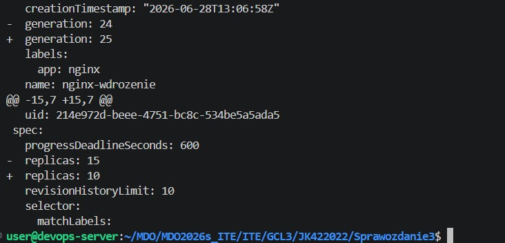

Poleceniem scale wygląda następująco:
```
kubectl scale deployment nginx-wdrozenie --replicas=10
```
Zmiana następuje z 15 replik na 10
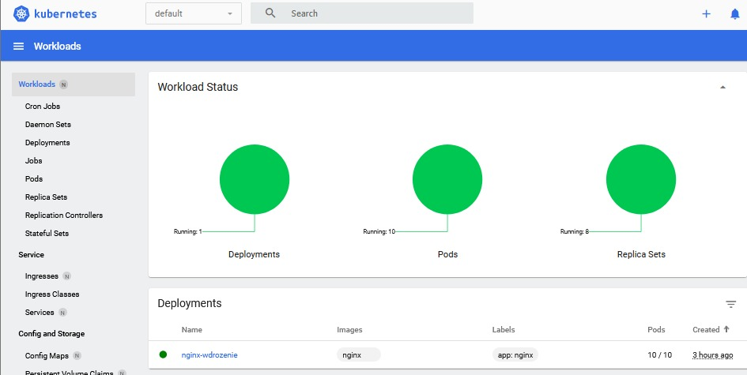
Ostatnim co sprawdziłem było sprawdzenie logów i czy komunikacja przebiega prawidłowo
Poleceniem 
```
kubectl logs -f nginx-wdrozenie- numer podu
```
Sprawdziłem następujące rzeczy 

I uzyskałem:
- nginx pomyślnie zaczął nasłuchiwać na portach
- zapytanie typu get zostało zakończone pomyślnie kod 200, widać że przesłano 896 bajtów 
- został napotkany błąd przy próbie pobrania ikony (favicon.ico) ta próba zakończyłą się kodem błędu 404 ale nie wpływa to na działanie nginx

AI było uzywane aby sprawdzać literówki lub szukać innych podobnych rozwiązań jakich inni ludzie wykorzystywali przy podobnych zagadnieniach