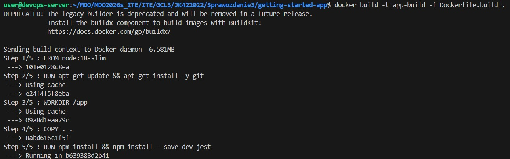

wybrano repozytorium: https://github.com/docker/getting-started-app

wykorzystane polecenia:
git clone https://github.com/docker/getting-started-app
sudo apt update && sudo apt install -y nodejs npm
npm install
npm install --save-dev jest
npx jest spec

utworzono docker:
docker run -it --name app-test node:18-slim /bin/bash
na którym wykorzystano polecenia powyższe polecenia oraz dodano poniższe Dockerfile które następnie zbudowano

Dockerfile.build :

FROM node:18-slim
RUN apt-get update && apt-get install -y git
WORKDIR /app
COPY . .
RUN npm install && npm install --save-dev jest

Dockerfile.test:

FROM app-build
CMD ["npx", "jest", "spec"]

